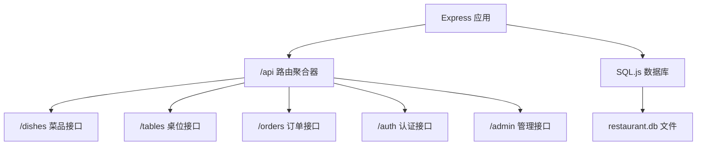
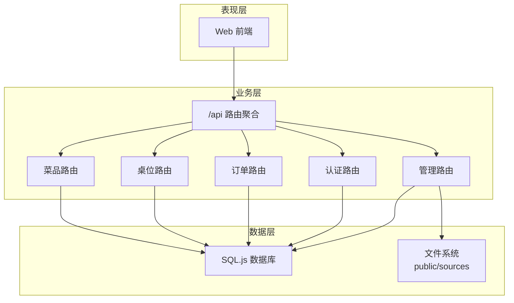
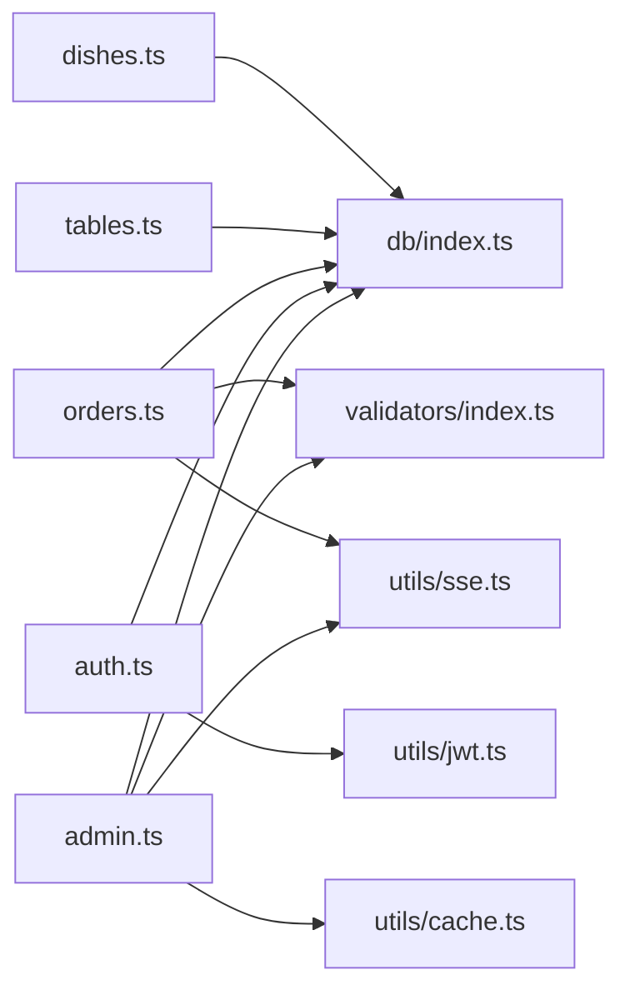
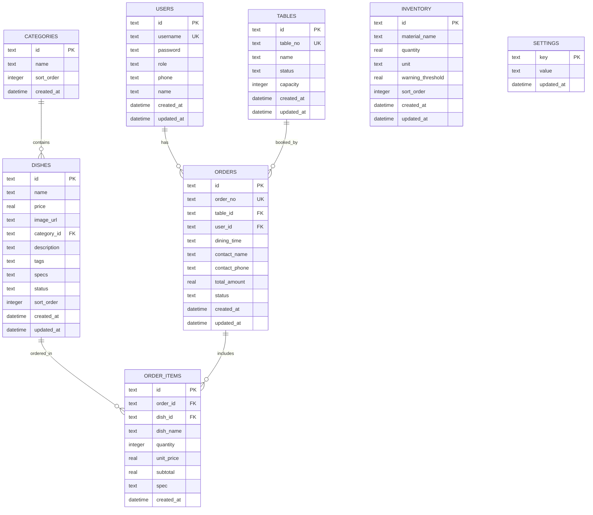
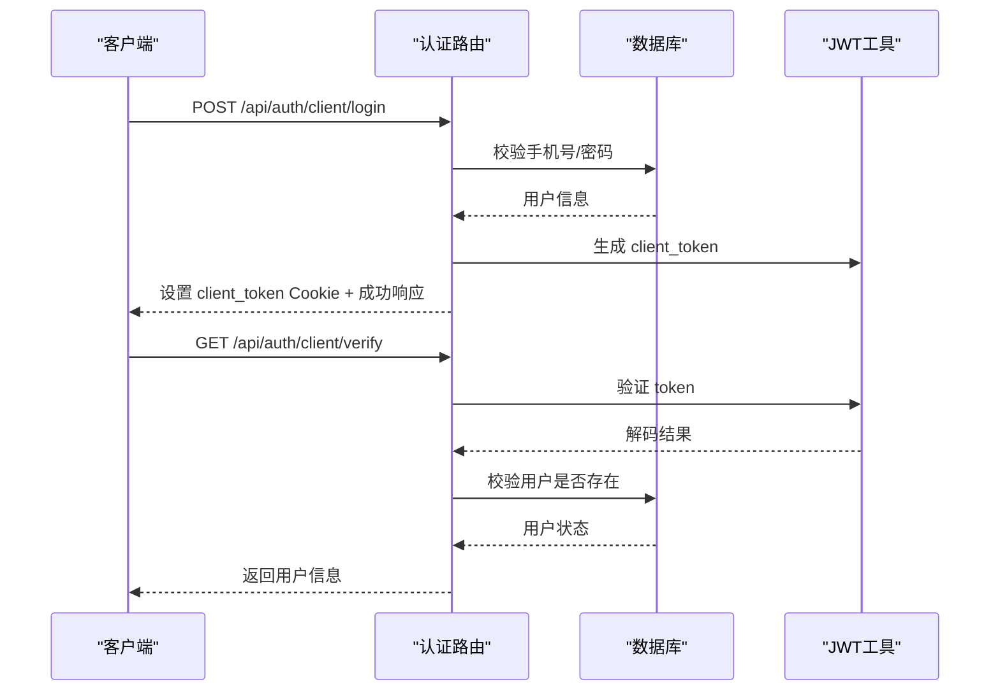
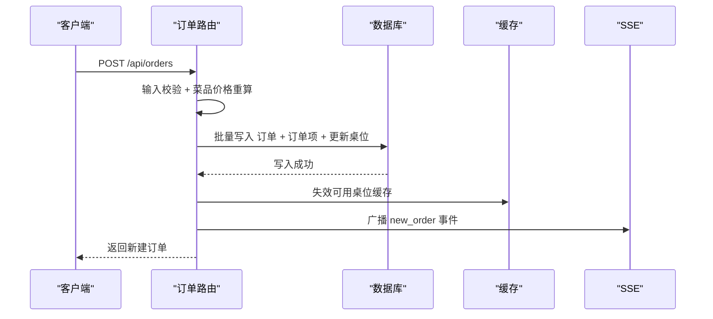
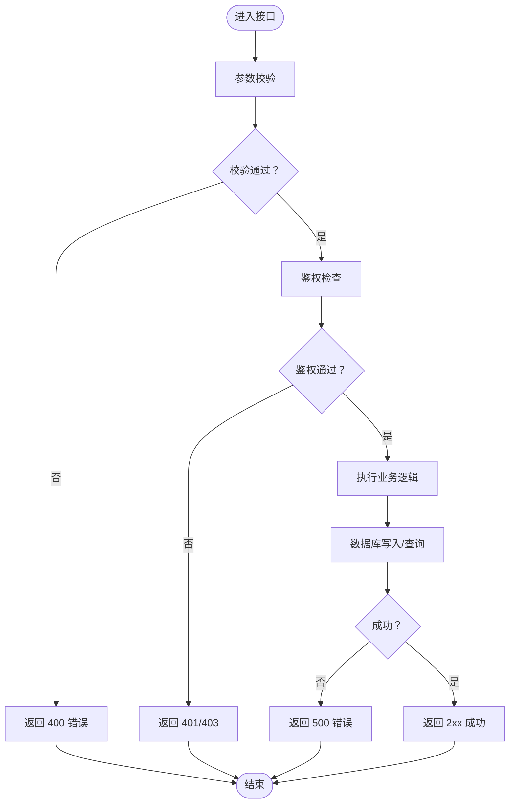

# API接口文档

<cite>
**本文档引用的文件**
- [server/src/routes/index.ts](file://server/src/routes/index.ts)
- [server/src/routes/dishes.ts](file://server/src/routes/dishes.ts)
- [server/src/routes/tables.ts](file://server/src/routes/tables.ts)
- [server/src/routes/orders.ts](file://server/src/routes/orders.ts)
- [server/src/routes/auth.ts](file://server/src/routes/auth.ts)
- [server/src/routes/admin.ts](file://server/src/routes/admin.ts)
- [server/src/db/index.ts](file://server/src/db/index.ts)
- [server/src/db/init.ts](file://server/src/db/init.ts)
- [server/src/validators/index.ts](file://server/src/validators/index.ts)
- [server/src/utils/jwt.ts](file://server/src/utils/jwt.ts)
- [server/src/utils/cache.ts](file://server/src/utils/cache.ts)
- [server/src/utils/sse.ts](file://server/src/utils/sse.ts)
- [server/src/utils/format.ts](file://server/src/utils/format.ts)
</cite>

## 目录
1. [简介](#简介)
2. [项目结构](#项目结构)
3. [核心组件](#核心组件)
4. [架构概览](#架构概览)
5. [详细组件分析](#详细组件分析)
6. [依赖关系分析](#依赖关系分析)
7. [性能考虑](#性能考虑)
8. [故障排除指南](#故障排除指南)
9. [结论](#结论)
10. [附录](#附录)

## 简介
本文件为 RLRMS（红灯笼餐厅管理系统）的完整 RESTful API 接口参考文档。系统采用 Node.js + Express + SQL.js 构建，提供菜品、桌位、订单、认证及管理后台等模块的 API。文档涵盖：
- 所有 RESTful 接口的 HTTP 方法、URL 模式、请求参数、响应格式
- 功能模块划分与权限控制
- 认证机制与 Cookie 策略
- 错误码与异常处理
- 请求/响应示例（使用真实 JSON 结构）
- 性能优化与缓存策略
- API 版本管理与兼容性说明

## 项目结构
后端采用按功能模块划分的路由组织方式，主入口将各模块路由挂载到统一的 API 前缀下。

**图表来源**
- [server/src/routes/index.ts:8-17](file://server/src/routes/index.ts#L8-L17)

**章节来源**
- [server/src/routes/index.ts:1-18](file://server/src/routes/index.ts#L1-L18)

## 核心组件
- 路由层：按模块拆分，职责清晰，便于扩展与维护
- 数据访问层：封装 SQL.js 的查询与事务，支持批量写入与防抖保存
- 验证层：使用 Zod 对输入进行强类型校验
- 缓存层：基于内存的 TTL 缓存，降低数据库压力
- 认证层：JWT + Cookie，区分管理员与客户两种令牌
- 实时推送：基于 Server-Sent Events（SSE）

**章节来源**
- [server/src/db/index.ts:76-156](file://server/src/db/index.ts#L76-L156)
- [server/src/validators/index.ts:1-123](file://server/src/validators/index.ts#L1-L123)
- [server/src/utils/cache.ts:1-73](file://server/src/utils/cache.ts#L1-L73)
- [server/src/utils/jwt.ts:1-27](file://server/src/utils/jwt.ts#L1-L27)
- [server/src/utils/sse.ts:1-59](file://server/src/utils/sse.ts#L1-L59)

## 架构概览
系统整体采用三层架构：表现层（前端）、业务层（路由与控制器）、数据层（SQL.js）。认证通过 Cookie 中的 JWT 进行，管理员与客户分别使用不同的 Cookie 名称与权限。

**图表来源**
- [server/src/routes/index.ts:1-18](file://server/src/routes/index.ts#L1-L18)
- [server/src/routes/dishes.ts:1-216](file://server/src/routes/dishes.ts#L1-L216)
- [server/src/routes/tables.ts:1-93](file://server/src/routes/tables.ts#L1-L93)
- [server/src/routes/orders.ts:1-552](file://server/src/routes/orders.ts#L1-L552)
- [server/src/routes/auth.ts:1-405](file://server/src/routes/auth.ts#L1-L405)
- [server/src/routes/admin.ts:1-800](file://server/src/routes/admin.ts#L1-L800)
- [server/src/db/index.ts:1-156](file://server/src/db/index.ts#L1-L156)

## 详细组件分析

### 菜品接口（/api/dishes）
- 作用：提供菜品列表、详情、首页聚合数据、搜索与分类查询
- 权限：公开访问
- 关键特性：多处使用内存缓存，减少数据库压力；支持 JSON 字段解析

接口定义
- GET /api/dishes
  - 查询参数：category（可选，按分类过滤）
  - 响应：success + data（菜品列表，含分类名、状态等）
  - 示例响应：见“请求/响应示例”
- GET /api/dishes/home-data
  - 作用：一次性返回分类与菜品聚合数据，降低带宽
  - 响应：success + data.categories + data.dishes（tags/specs 已解析为数组）
- GET /api/dishes/search/query?q=...（字符串）
  - 作用：按菜品名模糊搜索（on_sale）
  - 响应：success + data（匹配菜品列表）
- GET /api/dishes/categories/all
  - 作用：获取全部分类（排序）
  - 响应：success + data（分类列表）
- GET /api/dishes/:id
  - 作用：按 ID 获取菜品详情
  - 响应：success + data（菜品详情，tags/specs 已解析）

请求/响应示例
- 请求：GET /api/dishes?category=宫保鸡丁
- 响应：
  {
    "success": true,
    "data": [
      {
        "id": "uuid",
        "name": "宫保鸡丁",
        "price": 28,
        "image_url": "/sources/xxx.jpg",
        "category_id": "uuid",
        "category_name": "热菜",
        "status": "on_sale"
      }
    ]
  }

- 请求：GET /api/dishes/home-data
- 响应：
  {
    "success": true,
    "data": {
      "categories": [{ "id": "uuid", "name": "热菜", "sort_order": 1 }],
      "dishes": [
        {
          "id": "uuid",
          "name": "宫保鸡丁",
          "price": 28,
          "image_url": "/sources/xxx.jpg",
          "category_id": "uuid",
          "category_name": "热菜",
          "status": "on_sale",
          "tags": ["招牌", "辣"],
          "specs": ["少辣", "不辣"]
        }
      ]
    }
  }

- 请求：GET /api/dishes/search/query?q=宫保
- 响应：
  {
    "success": true,
    "data": [
      {
        "id": "uuid",
        "name": "宫保鸡丁",
        "price": 28,
        "image_url": "/sources/xxx.jpg",
        "category_name": "热菜",
        "status": "on_sale",
        "tags": ["招牌"],
        "specs": []
      }
    ]
  }

- 请求：GET /api/dishes/categories/all
- 响应：
  {
    "success": true,
    "data": [
      { "id": "uuid", "name": "热菜", "sort_order": 1 },
      { "id": "uuid", "name": "凉菜", "sort_order": 2 }
    ]
  }

- 请求：GET /api/dishes/:id
- 响应：
  {
    "success": true,
    "data": {
      "id": "uuid",
      "name": "宫保鸡丁",
      "price": 28,
      "image_url": "/sources/xxx.jpg",
      "category_id": "uuid",
      "category_name": "热菜",
      "description": "经典川菜",
      "tags": ["招牌", "辣"],
      "specs": ["少辣", "不辣"],
      "status": "on_sale"
    }
  }

错误码
- 404：菜品不存在
- 500：服务器内部错误

缓存策略
- 列表与首页数据使用内存缓存，分类数据独立缓存
- 数据变更（如菜品增删改）会触发缓存失效

**章节来源**
- [server/src/routes/dishes.ts:24-215](file://server/src/routes/dishes.ts#L24-L215)
- [server/src/utils/cache.ts:64-72](file://server/src/utils/cache.ts#L64-L72)

### 桌位接口（/api/tables）
- 作用：获取全部桌位、可用桌位、按就餐时段筛选可用桌位、按 ID 获取
- 权限：公开访问
- 关键特性：可用性查询结合订单状态与就餐时段，带短 TTL 缓存

接口定义
- GET /api/tables
  - 响应：success + data（全部桌位）
- GET /api/tables/available-for?dining_time=中午|晚上
  - 响应：success + data（可用桌位集合）
  - 说明：status=available 或 status=reserved 且当前时段无活跃订单
- GET /api/tables/available
  - 响应：success + data（status=available）
- GET /api/tables/:id
  - 响应：success + data（桌位详情）

请求/响应示例
- 请求：GET /api/tables/available-for?dining_time=中午
- 响应：
  {
    "success": true,
    "data": [
      { "id": "uuid", "table_no": "01", "name": "卡座A", "capacity": 4, "status": "available" }
    ]
  }

- 请求：GET /api/tables/available
- 响应：
  {
    "success": true,
    "data": [
      { "id": "uuid", "table_no": "01", "name": "卡座A", "capacity": 4, "status": "available" },
      { "id": "uuid", "table_no": "02", "name": "卡座B", "capacity": 6, "status": "available" }
    ]
  }

错误码
- 400：缺少就餐时间参数
- 404：桌位不存在
- 500：服务器内部错误

缓存策略
- 可用性查询带 5 秒 TTL，避免频繁数据库查询

**章节来源**
- [server/src/routes/tables.ts:13-93](file://server/src/routes/tables.ts#L13-L93)
- [server/src/utils/cache.ts:64-72](file://server/src/utils/cache.ts#L64-L72)

### 订单接口（/api/orders）
- 作用：客户侧订单 CRUD、验证订单存在性、按手机号查询历史订单
- 权限：除验证接口外均需客户端登录（client_token）
- 关键特性：客户端 JWT 验证、N+1 查询优化、批量写入、SSE 实时推送

认证中间件
- requireClientAuth：校验 client_token，确保用户存在且角色为 customer，将用户信息注入请求上下文

接口定义
- GET /api/orders?phone=...
  - 作用：按手机号查询用户历史订单
  - 响应：success + data（订单列表，含 items 明细）
  - 说明：无 phone 参数返回空数组
- POST /api/orders/verify
  - 作用：批量验证订单 ID 是否存在
  - 请求体：ids: string[]
  - 响应：success + data（存在的 id 列表）
- GET /api/orders/:id
  - 作用：按订单 ID 获取详情（含 items）
  - 响应：success + data（订单 + items）
- POST /api/orders
  - 作用：创建订单
  - 请求体：table_id（可选）、dining_time（中午/晚上）、contact_name、contact_phone、items[]
  - 响应：success + data（新建订单，含 items）
  - 说明：服务端批量校验菜品与价格，防止篡改
- POST /api/orders/:id/cancel
  - 作用：取消订单（5 分钟内且状态为 pending）
  - 请求体：phone（手机号验证）
  - 响应：success + message 或 error
- PUT /api/orders/:id/items
  - 作用：加菜（重建订单项，重算金额，状态置为 pending）
  - 请求体：items[]
  - 响应：success + data（更新后的订单）

请求/响应示例
- 请求：POST /api/orders
  - 请求体：
    {
      "table_id": "uuid",
      "dining_time": "中午",
      "contact_name": "张三",
      "contact_phone": "13800001111",
      "items": [
        {
          "dish_id": "uuid",
          "dish_name": "宫保鸡丁",
          "quantity": 2,
          "unit_price": 28,
          "subtotal": 56,
          "spec": "少辣"
        }
      ]
    }
  - 响应：
    {
      "success": true,
      "data": {
        "id": "uuid",
        "order_no": "RL202412010001",
        "table_id": "uuid",
        "table_name": "卡座A",
        "table_no": "01",
        "items": [
          {
            "id": "uuid",
            "order_id": "uuid",
            "dish_id": "uuid",
            "dish_name": "宫保鸡丁",
            "quantity": 2,
            "unit_price": 28,
            "subtotal": 56,
            "spec": "少辣"
          }
        ]
      }
    }

- 请求：POST /api/orders/:id/cancel
  - 请求体：
    {
      "phone": "13800001111"
    }
  - 响应：
    {
      "success": true,
      "message": "订单已取消"
    }

- 请求：PUT /api/orders/:id/items
  - 请求体：
    {
      "items": [
        {
          "dish_id": "uuid",
          "dish_name": "鱼香肉丝",
          "quantity": 1,
          "unit_price": 22,
          "subtotal": 22
        }
      ]
    }
  - 响应：
    {
      "success": true,
      "data": {
        "id": "uuid",
        "order_no": "RL202412010001",
        "table_id": "uuid",
        "table_name": "卡座A",
        "table_no": "01",
        "items": [
          {
            "id": "uuid",
            "order_id": "uuid",
            "dish_id": "uuid",
            "dish_name": "鱼香肉丝",
            "quantity": 1,
            "unit_price": 22,
            "subtotal": 22
          }
        ]
      }
    }

错误码
- 400：参数错误、桌位被占用、超时取消、状态不可取消、菜品不存在或已下架
- 401：未登录或登录过期
- 403：手机号与订单不匹配
- 404：订单不存在
- 500：服务器内部错误

性能与可靠性
- 批量写入：订单 + 订单项 + 桌位状态更新使用 beginBatch/endBatch
- N+1 查询优化：批量查询订单明细
- SSE 广播：新订单与订单更新事件通知管理端

**章节来源**
- [server/src/routes/orders.ts:24-552](file://server/src/routes/orders.ts#L24-L552)
- [server/src/validators/index.ts:6-18](file://server/src/validators/index.ts#L6-L18)

### 认证接口（/api/auth）
- 作用：管理员登录/登出/校验；客户登录/登出/校验；修改密码
- 权限：管理员与客户分别使用不同 Cookie 与 JWT 密钥
- 关键特性：IP 登录频率限制、手机号格式校验、自动注册客户账号

接口定义
- POST /api/auth/login
  - 请求体：username、password
  - 响应：success + data.user（admin）
  - Cookie：admin_token（httpOnly、secure、sameSite=lax、有效期 1 天）
- GET /api/auth/verify
  - 作用：校验 admin_token
  - 响应：success + data.userId/username/role
- POST /api/auth/logout
  - 作用：清除 admin_token
  - 响应：success + message
- POST /api/auth/client/login
  - 请求体：phone、password
  - 响应：success + data.user（customer，若不存在则自动注册）
  - Cookie：client_token（有效期 7 天）
- GET /api/auth/client/verify
  - 作用：校验 client_token（同时校验用户是否仍存在）
  - 响应：success + data.userId/phone/role
- POST /api/auth/client/logout
  - 作用：清除 client_token
  - 响应：success + message
- PUT /api/auth/password
  - 作用：修改管理员密码
  - 请求体：oldPassword、newPassword（6-128 位）
  - 响应：success + message

请求/响应示例
- 请求：POST /api/auth/client/login
  - 请求体：
    {
      "phone": "13800001111",
      "password": "123456"
    }
  - 响应：
    {
      "success": true,
      "data": {
        "user": {
          "id": "uuid",
          "phone": "13800001111",
          "role": "customer"
        }
      }
    }

错误码
- 400：缺少参数、手机号格式错误、密码过短、登录尝试过多
- 401：用户名或密码错误、未登录、登录已过期、用户不存在或被删除
- 429：登录尝试次数过多
- 500：服务器内部错误

安全与合规
- 密码使用 bcrypt 哈希存储
- JWT 密钥开发与生产模式不同策略
- Cookie 安全属性：httpOnly、secure（生产环境）、sameSite=lax

**章节来源**
- [server/src/routes/auth.ts:64-405](file://server/src/routes/auth.ts#L64-L405)
- [server/src/utils/jwt.ts:1-27](file://server/src/utils/jwt.ts#L1-L27)

### 管理接口（/api/admin）
- 作用：仪表盘统计、实时事件流、桌位/菜品/分类/订单管理、用户管理、库存管理、备份与恢复
- 权限：管理员专用，需 admin_token
- 关键特性：SSE 实时推送、批量操作、幂等迁移与回填

接口定义（节选）
- GET /api/admin/dashboard
  - 响应：success + data（今日订单数、今日收入、待确认订单数、可用桌位数、最近订单）
- GET /api/admin/events
  - 作用：SSE 实时事件流，心跳保活
  - 响应：connected 事件 + 心跳消息
- 桌位管理
  - GET /api/admin/tables：获取全部桌位（含当前订单）
  - POST /api/admin/tables：创建桌位（table_no/name 唯一性校验）
  - PUT /api/admin/tables/:id：更新桌位（支持 status/name/table_no/capacity）
  - DELETE /api/admin/tables/:id：删除桌位（需无未完成订单）
- 菜品管理
  - GET /api/admin/dishes：获取全部菜品（含分类名）
  - POST /api/admin/dishes：创建菜品（名称唯一性）
  - PUT /api/admin/dishes/reorder：批量重排菜品顺序
  - PUT /api/admin/dishes/:id：更新菜品（支持图片变更与清理）
  - DELETE /api/admin/dishes/:id：删除菜品（清理图片）
- 分类管理
  - GET /api/admin/categories：获取全部分类
  - POST /api/admin/categories：创建分类（名称唯一，保留名“其他”）
  - PUT /api/admin/categories/reorder：批量重排分类顺序
  - DELETE /api/admin/categories/:id：删除分类（需无菜品）
- 订单管理
  - GET /api/admin/orders：按状态/日期范围查询订单（批量明细）
  - GET /api/admin/orders/search?order_no=...：按订单号模糊搜索（最多 20）
  - PUT /api/admin/orders/:id/status：更新订单状态（白名单）
- 用户管理（简述）
  - POST /api/admin/users：创建用户（username/password/role/name/phone）
  - PUT /api/admin/users/:id：更新用户（可选字段）
  - DELETE /api/admin/users/:id：删除用户
- 库存管理（简述）
  - GET /api/admin/inventory：获取库存列表
  - POST /api/admin/inventory：创建库存
  - PUT /api/admin/inventory/:id：更新库存数量与预警阈值
  - DELETE /api/admin/inventory/:id：删除库存
- 备份与恢复（简述）
  - 导出/导入数据库（zip/archiver）
  - 重置数据库（需确认）

请求/响应示例
- 请求：GET /api/admin/dashboard
- 响应：
  {
    "success": true,
    "data": {
      "todayOrders": 120,
      "todayRevenue": 12800,
      "pendingOrders": 15,
      "availableTables": 8,
      "recentOrders": [
        {
          "id": "uuid",
          "order_no": "RL202412010001",
          "table_name": "卡座A",
          "contact_name": "张三",
          "contact_phone": "13800001111",
          "total_amount": 128,
          "status": "pending",
          "created_at": "2024-12-01T18:30:00+08:00"
        }
      ]
    }
  }

错误码
- 400：参数错误、重复、状态非法、ID 格式错误、有未完成订单等
- 401：未提供或无效 token
- 403：权限不足
- 500：服务器内部错误

**章节来源**
- [server/src/routes/admin.ts:134-800](file://server/src/routes/admin.ts#L134-L800)

## 依赖关系分析
- 路由依赖数据库访问层与验证器，管理路由还依赖文件系统与 SSE
- 认证依赖 JWT 密钥与 Cookie 策略
- 缓存与 SSE 提升用户体验与实时性

**图表来源**
- [server/src/routes/dishes.ts:1-5](file://server/src/routes/dishes.ts#L1-L5)
- [server/src/routes/tables.ts:1-5](file://server/src/routes/tables.ts#L1-L5)
- [server/src/routes/orders.ts:1-10](file://server/src/routes/orders.ts#L1-L10)
- [server/src/routes/auth.ts:1-8](file://server/src/routes/auth.ts#L1-L8)
- [server/src/routes/admin.ts:1-17](file://server/src/routes/admin.ts#L1-L17)

**章节来源**
- [server/src/db/index.ts:100-156](file://server/src/db/index.ts#L100-L156)
- [server/src/validators/index.ts:1-123](file://server/src/validators/index.ts#L1-L123)
- [server/src/utils/sse.ts:1-59](file://server/src/utils/sse.ts#L1-L59)
- [server/src/utils/jwt.ts:1-27](file://server/src/utils/jwt.ts#L1-L27)
- [server/src/utils/cache.ts:1-73](file://server/src/utils/cache.ts#L1-L73)

## 性能考虑
- 批量写入：订单创建与更新使用 beginBatch/endBatch，减少磁盘写入次数
- 防抖保存：SQL.js 写入使用防抖保存，合并多次写入
- 缓存策略：菜品列表、首页数据、分类、可用桌位等使用内存缓存，合理 TTL
- 查询优化：批量查询订单明细，避免 N+1；建立必要索引
- SSE：实时推送，心跳保活，断线自动清理
- 文件上传：图片上传限制大小与类型，删除不再使用的图片文件

最佳实践
- 客户端应在网络波动时重试幂等请求
- 管理端批量操作前先预览影响范围
- 合理设置 Cookie 安全属性，生产环境启用 secure
- 定期备份数据库，使用导出/导入功能

**章节来源**
- [server/src/db/index.ts:46-73](file://server/src/db/index.ts#L46-L73)
- [server/src/utils/cache.ts:13-36](file://server/src/utils/cache.ts#L13-L36)
- [server/src/utils/sse.ts:13-51](file://server/src/utils/sse.ts#L13-L51)

## 故障排除指南
常见问题与解决
- 登录失败/频繁限制
  - 检查用户名/密码或手机号格式
  - IP 登录尝试过多（15 分钟窗口，最多 5 次）
- 订单创建失败
  - 确认菜品存在且 on_sale
  - 确认桌位未被占用且无未完成订单
  - 检查 items 数组与单价/小计一致性（服务端会重新计算）
- 订单取消失败
  - 仅 5 分钟内且状态为 pending 可取消
  - 手机号需与订单一致
- SSE 无法接收事件
  - 确认已正确订阅 /api/admin/events
  - 检查网络代理对 SSE 的支持
- 管理端图片显示异常
  - 确认图片 URL 与 public/sources 下文件一致
  - 删除菜品后旧图若未被其他菜品使用会被清理

日志与监控
- 服务器端错误会在控制台输出详细堆栈
- 建议在网关或反向代理层开启访问日志

**章节来源**
- [server/src/routes/auth.ts:34-55](file://server/src/routes/auth.ts#L34-L55)
- [server/src/routes/orders.ts:207-236](file://server/src/routes/orders.ts#L207-L236)
- [server/src/routes/admin.ts:50-82](file://server/src/routes/admin.ts#L50-L82)

## 结论
RLRMS 提供了完整、清晰的 RESTful API，覆盖餐厅运营的核心场景。通过严格的输入校验、JWT 认证、缓存与批处理优化，系统在易用性与性能之间取得良好平衡。建议在生产环境中配合完善的监控与备份策略，确保稳定运行。

## 附录

### 数据模型（ER）

**图表来源**
- [server/src/db/init.ts:11-137](file://server/src/db/init.ts#L11-L137)

### 认证流程（序列图）

**图表来源**
- [server/src/routes/auth.ts:182-344](file://server/src/routes/auth.ts#L182-L344)
- [server/src/utils/jwt.ts:1-27](file://server/src/utils/jwt.ts#L1-L27)

### 订单创建流程（序列图）

**图表来源**
- [server/src/routes/orders.ts:194-353](file://server/src/routes/orders.ts#L194-L353)
- [server/src/utils/sse.ts:37-51](file://server/src/utils/sse.ts#L37-L51)

### 错误处理流程（流程图）

**图表来源**
- [server/src/routes/orders.ts:196-203](file://server/src/routes/orders.ts#L196-L203)
- [server/src/routes/auth.ts:114-118](file://server/src/routes/auth.ts#L114-L118)

### API 版本管理与兼容性
- 当前版本：v1（/api）
- 兼容性策略
  - 新增接口：在现有路由下新增端点，保持向后兼容
  - 修改接口：通过请求体字段可选与默认值维持兼容
  - 删除接口：不直接删除，改为标记废弃并在后续版本移除
  - 数据迁移：提供幂等迁移脚本，确保历史数据一致性
- 建议
  - 前端在升级时优先测试关键路径（下单、支付、管理端操作）
  - 使用网关层进行版本路由与灰度发布

**章节来源**
- [server/src/db/init.ts:167-197](file://server/src/db/init.ts#L167-L197)