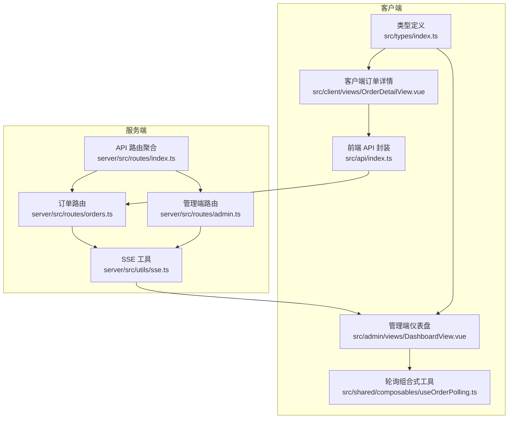
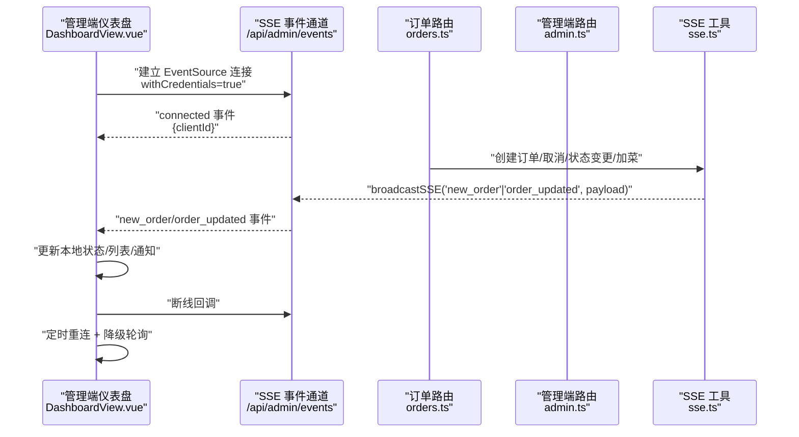
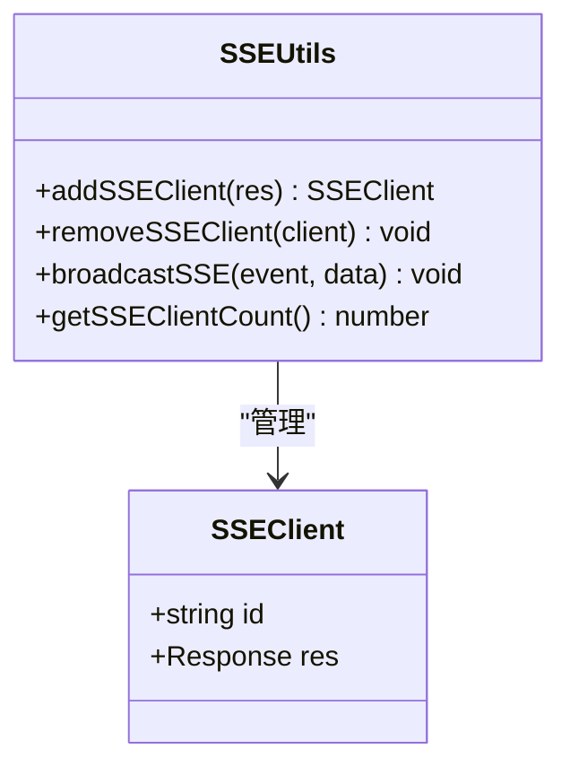
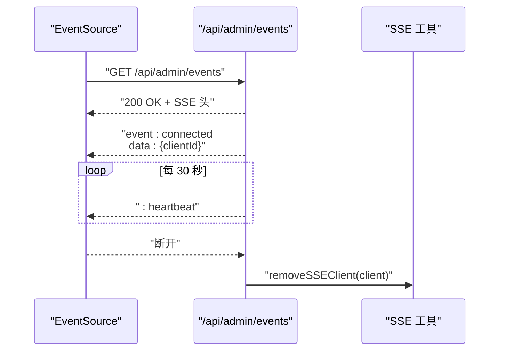
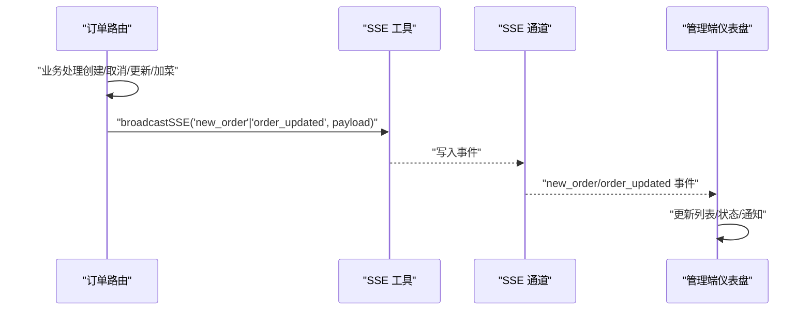
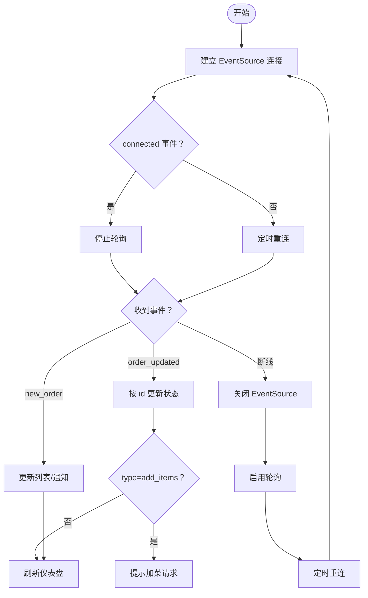
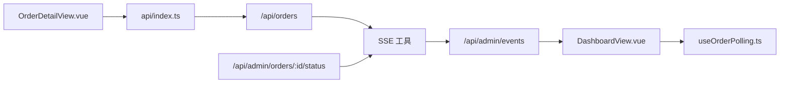

# 实时通信API

<cite>
**本文引用的文件**
- [server/src/utils/sse.ts](file://server/src/utils/sse.ts)
- [server/src/routes/admin.ts](file://server/src/routes/admin.ts)
- [server/src/routes/orders.ts](file://server/src/routes/orders.ts)
- [server/src/routes/index.ts](file://server/src/routes/index.ts)
- [src/admin/views/DashboardView.vue](file://src/admin/views/DashboardView.vue)
- [src/shared/composables/useOrderPolling.ts](file://src/shared/composables/useOrderPolling.ts)
- [src/client/views/OrderDetailView.vue](file://src/client/views/OrderDetailView.vue)
- [src/api/index.ts](file://src/api/index.ts)
- [src/types/index.ts](file://src/types/index.ts)
</cite>

## 目录
1. [简介](#简介)
2. [项目结构](#项目结构)
3. [核心组件](#核心组件)
4. [架构总览](#架构总览)
5. [详细组件分析](#详细组件分析)
6. [依赖关系分析](#依赖关系分析)
7. [性能考量](#性能考量)
8. [故障排查指南](#故障排查指南)
9. [结论](#结论)
10. [附录](#附录)

## 简介
本文件面向 RL RMS 的实时通信能力，聚焦基于 Server-Sent Events (SSE) 的实时推送机制，覆盖以下接口与场景：
- 管理端实时事件流：/api/admin/events
- 订单状态变更推送：来自订单创建、取消、状态更新、加菜等操作的事件广播
- 管理端订单列表实时更新：通过 SSE 推送“new_order”和“order_updated”事件
- 客户端实现要点：EventSource 连接、心跳保活、断线重连、事件解析与降级轮询

文档同时给出事件类型定义、数据格式规范、客户端处理流程、错误重连策略以及性能优化建议。

## 项目结构
- 服务端实时模块位于 server/src/utils/sse.ts，提供 SSE 客户端注册、广播与计数功能
- 管理端路由 server/src/routes/admin.ts 提供 /api/admin/events SSE 事件通道，并在多个订单操作后通过 broadcastSSE 广播事件
- 订单路由 server/src/routes/orders.ts 在创建订单、取消订单、加菜等场景触发广播
- 客户端管理端仪表盘 src/admin/views/DashboardView.vue 使用 EventSource 订阅 /api/admin/events，处理“connected”、“new_order”、“order_updated”事件，并在断线时进行定时重连与降级轮询
- 客户端订单详情页 src/client/views/OrderDetailView.vue 对活跃订单采用轮询策略，保证状态可见性
- 通用轮询组合式工具 src/shared/composables/useOrderPolling.ts 提供可复用的轮询逻辑
- 前端 API 封装 src/api/index.ts 提供统一的请求封装与超时控制
- 类型定义 src/types/index.ts 提供订单、菜品、表位等核心类型

图表来源
- [server/src/utils/sse.ts:1-59](file://server/src/utils/sse.ts#L1-L59)
- [server/src/routes/admin.ts:133-162](file://server/src/routes/admin.ts#L133-L162)
- [server/src/routes/orders.ts:342-343](file://server/src/routes/orders.ts#L342-L343)
- [server/src/routes/index.ts:1-18](file://server/src/routes/index.ts#L1-L18)
- [src/admin/views/DashboardView.vue:302-403](file://src/admin/views/DashboardView.vue#L302-L403)
- [src/client/views/OrderDetailView.vue:97-149](file://src/client/views/OrderDetailView.vue#L97-L149)
- [src/shared/composables/useOrderPolling.ts:1-55](file://src/shared/composables/useOrderPolling.ts#L1-L55)
- [src/api/index.ts:54-114](file://src/api/index.ts#L54-L114)
- [src/types/index.ts:70-97](file://src/types/index.ts#L70-L97)

章节来源
- [server/src/utils/sse.ts:1-59](file://server/src/utils/sse.ts#L1-L59)
- [server/src/routes/admin.ts:133-162](file://server/src/routes/admin.ts#L133-L162)
- [server/src/routes/orders.ts:342-343](file://server/src/routes/orders.ts#L342-L343)
- [server/src/routes/index.ts:1-18](file://server/src/routes/index.ts#L1-L18)
- [src/admin/views/DashboardView.vue:302-403](file://src/admin/views/DashboardView.vue#L302-L403)
- [src/client/views/OrderDetailView.vue:97-149](file://src/client/views/OrderDetailView.vue#L97-L149)
- [src/shared/composables/useOrderPolling.ts:1-55](file://src/shared/composables/useOrderPolling.ts#L1-L55)
- [src/api/index.ts:54-114](file://src/api/index.ts#L54-L114)
- [src/types/index.ts:70-97](file://src/types/index.ts#L70-L97)

## 核心组件
- SSE 客户端管理与广播
  - addSSEClient：为每个 SSE 连接分配唯一 id 并加入客户端池
  - removeSSEClient：清理断开或不可写连接
  - broadcastSSE：向所有存活客户端广播事件，支持心跳与异常清理
  - getSSEClientCount：用于监控连接数
- 管理端 SSE 事件通道
  - /api/admin/events：设置 SSE 响应头、发送“connected”确认、每 30 秒心跳、断开清理
- 订单相关事件广播
  - 创建订单：广播“new_order”
  - 取消订单：广播“order_updated”（状态=cancelled）
  - 状态更新：广播“order_updated”（状态变更）
  - 加菜：广播“order_updated”（带 type=add_items）
- 客户端订阅与处理
  - EventSource 订阅 /api/admin/events withCredentials=true
  - 处理 connected/new_order/order_updated 事件
  - 断线重连与降级轮询

章节来源
- [server/src/utils/sse.ts:15-58](file://server/src/utils/sse.ts#L15-L58)
- [server/src/routes/admin.ts:133-162](file://server/src/routes/admin.ts#L133-L162)
- [server/src/routes/orders.ts:342-343](file://server/src/routes/orders.ts#L342-L343)
- [src/admin/views/DashboardView.vue:308-391](file://src/admin/views/DashboardView.vue#L308-L391)

## 架构总览
SSE 实时架构围绕“服务端广播 + 客户端订阅”的模式构建，管理端仪表盘通过 EventSource 订阅事件，实现订单列表的实时更新；客户端订单详情页在 SSE 不可用时回退到轮询。

图表来源
- [server/src/routes/admin.ts:133-162](file://server/src/routes/admin.ts#L133-L162)
- [server/src/routes/orders.ts:342-343](file://server/src/routes/orders.ts#L342-L343)
- [server/src/utils/sse.ts:37-50](file://server/src/utils/sse.ts#L37-L50)
- [src/admin/views/DashboardView.vue:308-391](file://src/admin/views/DashboardView.vue#L308-L391)

## 详细组件分析

### SSE 客户端管理与广播
- 设计要点
  - 客户端池：维护 SSEClient 数组，按连接顺序分配自增 id
  - 广播策略：遍历副本，避免并发修改；对不可写连接执行清理
  - 心跳保活：服务端每 30 秒发送占位行，维持长连接
  - 异常处理：捕获写入异常并移除客户端，降低资源泄漏风险
- 性能与可靠性
  - 遍历副本避免迭代中数组修改导致的竞态
  - writableEnded 检测避免向已关闭连接写入
  - 心跳减少代理层缓存导致的延迟感知问题

图表来源
- [server/src/utils/sse.ts:3-6](file://server/src/utils/sse.ts#L3-L6)
- [server/src/utils/sse.ts:15-58](file://server/src/utils/sse.ts#L15-L58)

章节来源
- [server/src/utils/sse.ts:15-58](file://server/src/utils/sse.ts#L15-L58)

### 管理端 SSE 事件通道
- 接口
  - 方法：GET
  - 路径：/api/admin/events
  - 认证：requireAuth 中间件，要求 admin_token Cookie
  - 响应头：Content-Type=text/event-stream、Cache-Control=no-cache、Connection=keep-alive、X-Accel-Buffering=no
  - 初始消息：connected 事件，携带 clientId
  - 心跳：每 30 秒发送占位行
  - 断开：监听 close 事件清理心跳与客户端
- 客户端职责
  - 订阅 connected/new_order/order_updated 事件
  - 断线后定时重连（固定间隔）
  - 降级：SSE 断线时启用轮询

图表来源
- [server/src/routes/admin.ts:133-162](file://server/src/routes/admin.ts#L133-L162)
- [server/src/utils/sse.ts:27-32](file://server/src/utils/sse.ts#L27-L32)

章节来源
- [server/src/routes/admin.ts:133-162](file://server/src/routes/admin.ts#L133-L162)

### 订单相关事件广播
- 创建订单
  - 触发点：POST /api/orders
  - 广播事件：new_order
  - 广播数据：完整订单对象（含 items）
- 取消订单
  - 触发点：POST /api/orders/:id/cancel
  - 广播事件：order_updated
  - 广播数据：{ id, status: 'cancelled' }
- 状态更新
  - 触发点：PUT /api/admin/orders/:id/status
  - 广播事件：order_updated
  - 广播数据：{ id, status }
- 加菜
  - 触发点：PUT /api/orders/:id/items
  - 广播事件：order_updated
  - 广播数据：{ id, status: 'pending', type: 'add_items' }

图表来源
- [server/src/routes/orders.ts:342-343](file://server/src/routes/orders.ts#L342-L343)
- [server/src/routes/admin.ts:825-826](file://server/src/routes/admin.ts#L825-L826)
- [server/src/utils/sse.ts:37-50](file://server/src/utils/sse.ts#L37-L50)

章节来源
- [server/src/routes/orders.ts:342-343](file://server/src/routes/orders.ts#L342-L343)
- [server/src/routes/admin.ts:825-826](file://server/src/routes/admin.ts#L825-L826)

### 客户端实现与事件处理
- 管理端仪表盘
  - 订阅 /api/admin/events，withCredentials=true
  - connected：标记 SSE 已连接，停止轮询
  - new_order：在无筛选条件下直接插入列表头部，否则全量刷新
  - order_updated：按 id 更新状态，加菜事件增加计数并刷新订单详情
  - 断线：关闭 EventSource，启用轮询，定时重连
- 客户端订单详情
  - 对 pending/confirmed 状态的订单采用轮询，页面隐藏时停止轮询
- 通用轮询
  - useOrderPolling 提供可配置轮询间隔与 shouldPoll 条件

图表来源
- [src/admin/views/DashboardView.vue:308-391](file://src/admin/views/DashboardView.vue#L308-L391)
- [src/shared/composables/useOrderPolling.ts:19-31](file://src/shared/composables/useOrderPolling.ts#L19-L31)
- [src/client/views/OrderDetailView.vue:130-149](file://src/client/views/OrderDetailView.vue#L130-L149)

章节来源
- [src/admin/views/DashboardView.vue:308-391](file://src/admin/views/DashboardView.vue#L308-L391)
- [src/shared/composables/useOrderPolling.ts:19-31](file://src/shared/composables/useOrderPolling.ts#L19-L31)
- [src/client/views/OrderDetailView.vue:130-149](file://src/client/views/OrderDetailView.vue#L130-L149)

### 事件类型与数据格式规范
- 事件类型
  - connected：首次连接确认，数据包含 clientId
  - new_order：新增订单，数据为完整订单对象
  - order_updated：订单状态变更，数据包含 id、status；加菜时额外包含 type=add_items
- 数据模型（简化）
  - Order：包含 id、order_no、table_id/table_name/table_no、contact_*、total_amount、status、created_at、items[]
  - OrderItem：包含 id、order_id、dish_id、dish_name、quantity、unit_price、subtotal、spec
- 客户端处理建议
  - connected：记录 clientId，停止轮询
  - new_order：无筛选时插入列表头部，有筛选时全量刷新
  - order_updated：按 id 更新状态，加菜事件触发提示与刷新

章节来源
- [src/types/index.ts:70-97](file://src/types/index.ts#L70-L97)
- [src/admin/views/DashboardView.vue:324-373](file://src/admin/views/DashboardView.vue#L324-L373)

## 依赖关系分析
- 服务端
  - /api/admin/events 依赖 SSE 工具进行客户端注册与广播
  - 订单路由在多个业务场景调用 broadcastSSE
  - 管理端路由在订单状态更新后调用 broadcastSSE
- 客户端
  - 管理端仪表盘依赖 EventSource 订阅 SSE 事件
  - 订单详情页依赖轮询组合式工具与 API 封装
  - API 封装统一处理 401、超时与非 JSON 响应

图表来源
- [server/src/routes/orders.ts:342-343](file://server/src/routes/orders.ts#L342-L343)
- [server/src/routes/admin.ts:825-826](file://server/src/routes/admin.ts#L825-L826)
- [server/src/utils/sse.ts:37-50](file://server/src/utils/sse.ts#L37-L50)
- [src/admin/views/DashboardView.vue:308-391](file://src/admin/views/DashboardView.vue#L308-L391)
- [src/shared/composables/useOrderPolling.ts:19-31](file://src/shared/composables/useOrderPolling.ts#L19-L31)
- [src/client/views/OrderDetailView.vue:130-149](file://src/client/views/OrderDetailView.vue#L130-L149)
- [src/api/index.ts:54-114](file://src/api/index.ts#L54-L114)

章节来源
- [server/src/routes/orders.ts:342-343](file://server/src/routes/orders.ts#L342-L343)
- [server/src/routes/admin.ts:825-826](file://server/src/routes/admin.ts#L825-L826)
- [server/src/utils/sse.ts:37-50](file://server/src/utils/sse.ts#L37-L50)
- [src/admin/views/DashboardView.vue:308-391](file://src/admin/views/DashboardView.vue#L308-L391)
- [src/shared/composables/useOrderPolling.ts:19-31](file://src/shared/composables/useOrderPolling.ts#L19-L31)
- [src/client/views/OrderDetailView.vue:130-149](file://src/client/views/OrderDetailView.vue#L130-L149)
- [src/api/index.ts:54-114](file://src/api/index.ts#L54-L114)

## 性能考量
- 连接管理
  - 心跳保活：每 30 秒发送占位行，减少代理层缓存导致的延迟感知问题
  - 可写性检测：对不可写连接及时清理，避免阻塞广播循环
  - 断线清理：监听 close 事件并移除客户端，防止内存泄漏
- 广播效率
  - 遍历副本：避免在迭代过程中修改数组引发竞态
  - 异常捕获：写入异常即移除客户端，保障整体稳定性
- 客户端策略
  - SSE 优先：连接成功后停止轮询，降低服务器压力
  - 断线降级：SSE 断线时启用轮询，轮询间隔与 shouldPoll 控制频率
  - 页面可见性：页面隐藏时停止轮询，恢复时重新拉取并启动轮询
- 服务端响应头
  - X-Accel-Buffering=no：禁用 Nginx 缓冲，确保事件即时到达

章节来源
- [server/src/routes/admin.ts:147-155](file://server/src/routes/admin.ts#L147-L155)
- [server/src/utils/sse.ts:37-50](file://server/src/utils/sse.ts#L37-L50)
- [src/admin/views/DashboardView.vue:414-417](file://src/admin/views/DashboardView.vue#L414-L417)
- [src/client/views/OrderDetailView.vue:142-149](file://src/client/views/OrderDetailView.vue#L142-L149)

## 故障排查指南
- SSE 无法连接
  - 检查 /api/admin/events 是否返回 200 且包含 SSE 头
  - 确认 withCredentials=true 且 Cookie admin_token 有效
  - 查看浏览器 Network 面板中 SSE 流是否持续
- 事件未到达
  - 确认服务端在对应业务场景调用了 broadcastSSE
  - 检查客户端是否正确监听 new_order/order_updated 事件
  - 关注断线回调与定时重连逻辑
- 断线重连
  - 客户端会在断线后定时重连（固定间隔），若仍失败，检查网络与代理配置
  - 确保 X-Accel-Buffering=no 生效，避免代理层缓冲
- 轮询降级
  - 当 SSE 断线且自动刷新开启时，启用轮询；页面隐藏时自动停止轮询
  - 恢复可见性后重新拉取并启动轮询

章节来源
- [src/admin/views/DashboardView.vue:375-391](file://src/admin/views/DashboardView.vue#L375-L391)
- [server/src/routes/admin.ts:139-140](file://server/src/routes/admin.ts#L139-L140)
- [src/client/views/OrderDetailView.vue:142-149](file://src/client/views/OrderDetailView.vue#L142-L149)

## 结论
RL RMS 的实时通信基于 SSE 提供了低延迟、低开销的事件推送能力，结合客户端的断线重连与轮询降级策略，实现了稳定可靠的管理端订单列表实时更新体验。通过明确的事件类型与数据格式规范，客户端能够高效地增量更新界面状态，提升运营效率。

## 附录
- 接口清单
  - GET /api/admin/events：管理端 SSE 事件通道
  - POST /api/orders：创建订单（触发 new_order）
  - POST /api/orders/:id/cancel：取消订单（触发 order_updated）
  - PUT /api/admin/orders/:id/status：更新订单状态（触发 order_updated）
  - PUT /api/orders/:id/items：加菜（触发 order_updated，type=add_items）
- 客户端最佳实践
  - 使用 withCredentials=true 订阅 SSE
  - 监听 connected/new_order/order_updated 事件
  - 断线后定时重连，必要时启用轮询降级
  - 页面隐藏时停止轮询，恢复时重新拉取并启动轮询