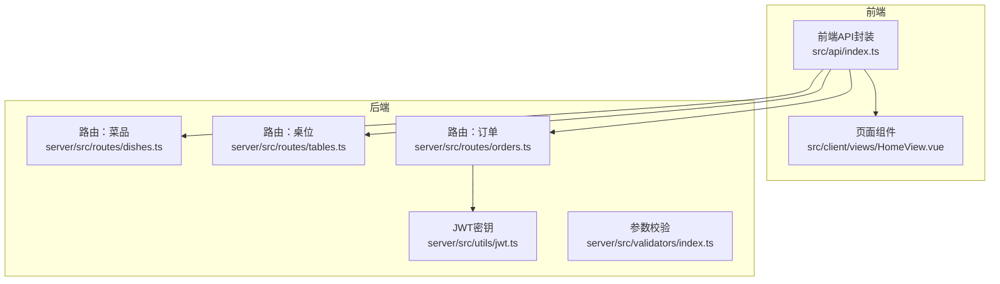
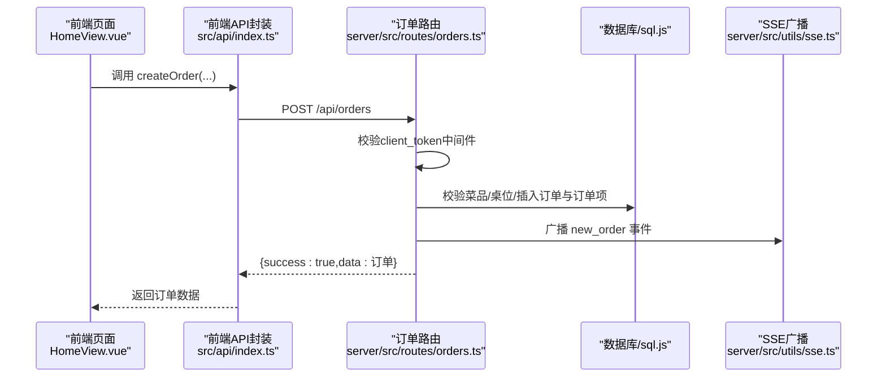
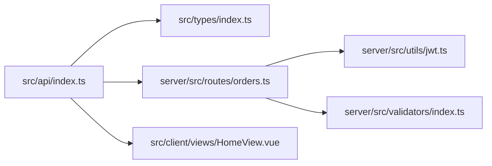

# 客户端API

<cite>
**本文引用的文件**
- [dishes.ts](file://server/src/routes/dishes.ts)
- [tables.ts](file://server/src/routes/tables.ts)
- [orders.ts](file://server/src/routes/orders.ts)
- [index.ts](file://server/src/utils/jwt.ts)
- [index.ts](file://server/src/validators/index.ts)
- [index.ts](file://src/api/index.ts)
- [index.ts](file://src/types/index.ts)
- [HomeView.vue](file://src/client/views/HomeView.vue)
- [README.md](file://README.md)
</cite>

## 目录
1. [简介](#简介)
2. [项目结构](#项目结构)
3. [核心组件](#核心组件)
4. [架构总览](#架构总览)
5. [详细组件分析](#详细组件分析)
6. [依赖关系分析](#依赖关系分析)
7. [性能考量](#性能考量)
8. [故障排查指南](#故障排查指南)
9. [结论](#结论)
10. [附录](#附录)

## 简介
本文件为“红灯笼食府”系统中面向客户点餐系统的API接口文档，聚焦于顾客端可公开访问与受保护的接口，包括菜品查询、桌位查询、订单创建与查询、订单状态更新等。文档提供每个接口的HTTP方法、URL路径、请求参数、响应格式、认证要求与权限限制、错误码说明与常见问题解决方案，并给出请求与响应示例（使用真实JSON结构）。

## 项目结构
- 后端采用Express + sql.js（SQLite的JS实现），路由位于 server/src/routes 下，包含 dishes、tables、orders 等模块。
- 前端使用Vue 3 + TypeScript，API封装位于 src/api/index.ts，统一通过 /api 前缀访问后端。
- 认证机制：客户端登录使用 client_token Cookie；管理端使用 admin_token Cookie；JWT密钥由 server/src/utils/jwt.ts 动态生成。



图表来源
- [index.ts:128-286](file://src/api/index.ts#L128-L286)
- [dishes.ts:1-216](file://server/src/routes/dishes.ts#L1-L216)
- [tables.ts:1-93](file://server/src/routes/tables.ts#L1-L93)
- [orders.ts:1-552](file://server/src/routes/orders.ts#L1-L552)
- [index.ts:1-27](file://server/src/utils/jwt.ts#L1-L27)
- [index.ts:1-123](file://server/src/validators/index.ts#L1-L123)

章节来源
- [README.md:267-300](file://README.md#L267-L300)
- [index.ts:128-286](file://src/api/index.ts#L128-L286)

## 核心组件
- 前端API封装：统一处理基础URL、Cookie携带、超时、401拦截、缓存策略与错误包装。
- 后端路由：提供菜品、桌位、订单的REST接口，包含参数校验、缓存、SSE广播、表状态联动等。
- 认证与权限：客户端登录使用 client_token Cookie，路由中间件 requireClientAuth 校验用户存在性与角色。
- 数据模型：Dish、Table、Order、OrderItem、Category 等类型定义于 src/types/index.ts。

章节来源
- [index.ts:54-114](file://src/api/index.ts#L54-L114)
- [orders.ts:24-49](file://server/src/routes/orders.ts#L24-L49)
- [index.ts:54-97](file://src/types/index.ts#L54-L97)

## 架构总览
客户端API调用链路如下：
- 前端通过 src/api/index.ts 发起 /api 请求，自动携带 Cookie（含 client_token）。
- 后端路由根据路径与方法处理业务逻辑，必要时进行参数校验、缓存读写、数据库操作与SSE事件广播。
- 响应统一为 { success: boolean, data?: any, error?: string } 结构。



图表来源
- [HomeView.vue:169-210](file://src/client/views/HomeView.vue#L169-L210)
- [index.ts:187-205](file://src/api/index.ts#L187-L205)
- [orders.ts:194-353](file://server/src/routes/orders.ts#L194-L353)

## 详细组件分析

### 菜品查询接口
- GET /api/dishes
  - 功能：获取在售菜品列表，按分类与排序字段排序。
  - 查询参数：category（可选，按分类过滤）。
  - 认证：无需。
  - 响应：success + data: Dish[]。
  - 示例响应：
    ```json
    {
      "success": true,
      "data": [
        {
          "id": "d1",
          "name": "宫保鸡丁",
          "price": 38,
          "image_url": "/sources/d1.jpg",
          "category_id": "c1",
          "category_name": "热菜",
          "status": "on_sale",
          "tags": [],
          "specs": []
        }
      ]
    }
    ```

- GET /api/dishes/home-data
  - 功能：一次性返回分类与菜品聚合数据，用于首页低带宽场景。
  - 认证：无需。
  - 响应：success + data: { categories: Category[], dishes: Dish[] }。
  - 示例响应：
    ```json
    {
      "success": true,
      "data": {
        "categories": [{ "id": "c1", "name": "热菜", "sort_order": 1 }],
        "dishes": [
          {
            "id": "d1",
            "name": "宫保鸡丁",
            "price": 38,
            "image_url": "/sources/d1.jpg",
            "category_id": "c1",
            "category_name": "热菜",
            "status": "on_sale",
            "tags": [],
            "specs": []
          }
        ]
      }
    }
    ```

- GET /api/dishes/search/query?q=关键词
  - 功能：按菜品名称模糊搜索在售菜品。
  - 查询参数：q（必填，字符串）。
  - 认证：无需。
  - 响应：success + data: Dish[]。
  - 示例响应：
    ```json
    {
      "success": true,
      "data": [
        {
          "id": "d1",
          "name": "宫保鸡丁",
          "price": 38,
          "image_url": "/sources/d1.jpg",
          "category_id": "c1",
          "category_name": "热菜",
          "status": "on_sale",
          "tags": [],
          "specs": []
        }
      ]
    }
    ```

- GET /api/dishes/categories/all
  - 功能：获取全部分类列表。
  - 认证：无需。
  - 响应：success + data: Category[]。
  - 示例响应：
    ```json
    {
      "success": true,
      "data": [
        { "id": "c1", "name": "热菜", "sort_order": 1 },
        { "id": "c2", "name": "凉菜", "sort_order": 2 }
      ]
    }
    ```

- GET /api/dishes/:id
  - 功能：获取菜品详情，解析 tags/specs JSON 字段。
  - 认证：无需。
  - 响应：success + data: Dish。
  - 示例响应：
    ```json
    {
      "success": true,
      "data": {
        "id": "d1",
        "name": "宫保鸡丁",
        "price": 38,
        "image_url": "/sources/d1.jpg",
        "category_id": "c1",
        "category_name": "热菜",
        "description": "经典川菜",
        "tags": ["辣"],
        "specs": ["少辣"],
        "status": "on_sale"
      }
    }
    ```

章节来源
- [dishes.ts:25-65](file://server/src/routes/dishes.ts#L25-L65)
- [dishes.ts:69-117](file://server/src/routes/dishes.ts#L69-L117)
- [dishes.ts:121-157](file://server/src/routes/dishes.ts#L121-L157)
- [dishes.ts:161-174](file://server/src/routes/dishes.ts#L161-L174)
- [dishes.ts:178-215](file://server/src/routes/dishes.ts#L178-L215)

### 桌位查询接口
- GET /api/tables
  - 功能：获取全部桌位列表。
  - 认证：无需。
  - 响应：success + data: Table[]。
  - 示例响应：
    ```json
    {
      "success": true,
      "data": [
        { "id": "t1", "table_no": "T01", "name": "靠窗位", "status": "available", "capacity": 4 }
      ]
    }
    ```

- GET /api/tables/available
  - 功能：获取当前可用桌位（status=available）。
  - 认证：无需。
  - 响应：success + data: Table[]。
  - 示例响应：
    ```json
    {
      "success": true,
      "data": [
        { "id": "t1", "table_no": "T01", "name": "靠窗位", "status": "available", "capacity": 4 }
      ]
    }
    ```

- GET /api/tables/available-for?dining_time=中午|晚上
  - 功能：获取指定就餐时段可用桌位（排除该时段已有待处理订单的预留桌位）。
  - 查询参数：dining_time（必填，枚举：中午/晚上）。
  - 认证：无需。
  - 响应：success + data: Table[]。
  - 示例响应：
    ```json
    {
      "success": true,
      "data": [
        { "id": "t1", "table_no": "T01", "name": "靠窗位", "status": "available", "capacity": 4 }
      ]
    }
    ```

- GET /api/tables/:id
  - 功能：获取桌位详情。
  - 认证：无需。
  - 响应：success + data: Table。
  - 示例响应：
    ```json
    {
      "success": true,
      "data": {
        "id": "t1",
        "table_no": "T01",
        "name": "靠窗位",
        "status": "available",
        "capacity": 4
      }
    }
    ```

章节来源
- [tables.ts:14-22](file://server/src/routes/tables.ts#L14-L22)
- [tables.ts:58-76](file://server/src/routes/tables.ts#L58-L76)
- [tables.ts:25-54](file://server/src/routes/tables.ts#L25-L54)
- [tables.ts:79-93](file://server/src/routes/tables.ts#L79-L93)

### 订单创建接口
- POST /api/orders
  - 功能：创建订单。服务端重新验证菜品与价格，防止客户端篡改金额；若提供 table_id，检查桌位状态并预留。
  - 认证：需要 client_token Cookie（客户端登录）。
  - 请求体字段：
    - table_id: string（可选）
    - dining_time: "中午"|"晚上"
    - contact_name: string（联系人姓名）
    - contact_phone: string（手机号）
    - items: 数组，元素包含 dish_id、dish_name、quantity、unit_price、subtotal、spec（可选）
  - 响应：success + data: Order。
  - 示例请求：
    ```json
    {
      "table_id": "t1",
      "dining_time": "中午",
      "contact_name": "张三",
      "contact_phone": "13800001111",
      "items": [
        {
          "dish_id": "d1",
          "dish_name": "宫保鸡丁",
          "quantity": 2,
          "unit_price": 38,
          "subtotal": 76,
          "spec": "少辣"
        }
      ]
    }
    ```
  - 示例响应：
    ```json
    {
      "success": true,
      "data": {
        "id": "o1",
        "order_no": "RL202504050001",
        "table_id": "t1",
        "table_name": "靠窗位",
        "table_no": "T01",
        "user_id": "u1",
        "dining_time": "中午",
        "contact_name": "张三",
        "contact_phone": "13800001111",
        "total_amount": 76,
        "status": "pending",
        "created_at": "2025-04-05T12:00:00Z",
        "items": [
          {
            "id": "oi1",
            "order_id": "o1",
            "dish_id": "d1",
            "dish_name": "宫保鸡丁",
            "quantity": 2,
            "unit_price": 38,
            "subtotal": 76,
            "spec": "少辣"
          }
        ]
      }
    }
    ```

章节来源
- [orders.ts:194-353](file://server/src/routes/orders.ts#L194-L353)
- [index.ts:6-19](file://server/src/validators/index.ts#L6-L19)

### 订单查询接口
- GET /api/orders?phone=手机号
  - 功能：获取指定手机号的历史订单列表（按创建时间倒序）。
  - 查询参数：phone（必填，字符串）。
  - 认证：需要 client_token Cookie。
  - 响应：success + data: Order[]。
  - 示例响应：
    ```json
    {
      "success": true,
      "data": [
        {
          "id": "o1",
          "order_no": "RL202504050001",
          "table_id": "t1",
          "table_name": "靠窗位",
          "table_no": "T01",
          "user_id": "u1",
          "dining_time": "中午",
          "contact_name": "张三",
          "contact_phone": "13800001111",
          "total_amount": 76,
          "status": "pending",
          "created_at": "2025-04-05T12:00:00Z",
          "items": []
        }
      ]
    }
    ```

- GET /api/orders/:id
  - 功能：获取订单详情（包含订单项）。
  - 认证：需要 client_token Cookie。
  - 响应：success + data: Order。
  - 示例响应：
    ```json
    {
      "success": true,
      "data": {
        "id": "o1",
        "order_no": "RL202504050001",
        "table_id": "t1",
        "table_name": "靠窗位",
        "table_no": "T01",
        "user_id": "u1",
        "dining_time": "中午",
        "contact_name": "张三",
        "contact_phone": "13800001111",
        "total_amount": 76,
        "status": "pending",
        "created_at": "2025-04-05T12:00:00Z",
        "items": [
          {
            "id": "oi1",
            "order_id": "o1",
            "dish_id": "d1",
            "dish_name": "宫保鸡丁",
            "quantity": 2,
            "unit_price": 38,
            "subtotal": 76,
            "spec": "少辣"
          }
        ]
      }
    }
    ```

章节来源
- [orders.ts:62-135](file://server/src/routes/orders.ts#L62-L135)
- [orders.ts:157-191](file://server/src/routes/orders.ts#L157-L191)

### 订单状态更新接口
- POST /api/orders/:id/cancel
  - 功能：取消订单（5分钟内有效，需手机号验证）。
  - 认证：需要 client_token Cookie。
  - 请求体字段：phone（手机号，用于身份验证）。
  - 响应：success + message。
  - 示例请求：
    ```json
    {
      "phone": "13800001111"
    }
    ```
  - 示例响应：
    ```json
    {
      "success": true,
      "message": "订单已取消"
    }
    ```

- PUT /api/orders/:id/items
  - 功能：加菜（对同一订单追加菜品，服务端重新验证与计价，重置状态为 pending）。
  - 认证：需要 client_token Cookie。
  - 请求体字段：items（数组，同创建订单的 items 结构）。
  - 响应：success + data: Order。
  - 示例请求：
    ```json
    {
      "items": [
        {
          "dish_id": "d2",
          "dish_name": "鱼香肉丝",
          "quantity": 1,
          "unit_price": 32,
          "subtotal": 32
        }
      ]
    }
    ```
  - 示例响应：
    ```json
    {
      "success": true,
      "data": {
        "id": "o1",
        "order_no": "RL202504050001",
        "table_id": "t1",
        "table_name": "靠窗位",
        "table_no": "T01",
        "user_id": "u1",
        "dining_time": "中午",
        "contact_name": "张三",
        "contact_phone": "13800001111",
        "total_amount": 108,
        "status": "pending",
        "created_at": "2025-04-05T12:00:00Z",
        "items": [
          {
            "id": "oi1",
            "order_id": "o1",
            "dish_id": "d1",
            "dish_name": "宫保鸡丁",
            "quantity": 2,
            "unit_price": 38,
            "subtotal": 76,
            "spec": "少辣"
          },
          {
            "id": "oi2",
            "order_id": "o1",
            "dish_id": "d2",
            "dish_name": "鱼香肉丝",
            "quantity": 1,
            "unit_price": 32,
            "subtotal": 32
          }
        ]
      }
    }
    ```

章节来源
- [orders.ts:356-418](file://server/src/routes/orders.ts#L356-L418)
- [orders.ts:421-552](file://server/src/routes/orders.ts#L421-L552)
- [index.ts:79-93](file://server/src/validators/index.ts#L79-L93)

## 依赖关系分析
- 前端API封装依赖：
  - src/types/index.ts：统一响应结构与数据模型。
  - src/api/index.ts：封装 fetch、超时、401处理、缓存策略。
- 后端路由依赖：
  - server/src/utils/jwt.ts：生成JWT密钥，用于客户端登录签发与校验。
  - server/src/validators/index.ts：Zod 参数校验，保证输入合法性。
  - server/src/routes/dishes.ts、tables.ts、orders.ts：具体业务路由。



图表来源
- [index.ts:1-608](file://src/api/index.ts#L1-L608)
- [index.ts:1-133](file://src/types/index.ts#L1-L133)
- [orders.ts:1-552](file://server/src/routes/orders.ts#L1-L552)
- [index.ts:1-27](file://server/src/utils/jwt.ts#L1-L27)
- [index.ts:1-123](file://server/src/validators/index.ts#L1-L123)
- [HomeView.vue:1-867](file://src/client/views/HomeView.vue#L1-L867)

章节来源
- [index.ts:128-286](file://src/api/index.ts#L128-L286)
- [orders.ts:24-49](file://server/src/routes/orders.ts#L24-L49)

## 性能考量
- 前端缓存：src/api/index.ts 内置内存缓存（stale-while-revalidate），提升首页与分类数据加载速度。
- 后端缓存：菜品与分类接口使用 CACHE_KEYS 缓存，降低数据库压力。
- 批量查询：订单列表一次性拉取所有订单项，避免 N+1 查询。
- SSE 广播：新订单与状态变更通过 SSE 推送，减少轮询成本。

章节来源
- [index.ts:9-34](file://src/api/index.ts#L9-L34)
- [dishes.ts:28-60](file://server/src/routes/dishes.ts#L28-L60)
- [orders.ts:96-130](file://server/src/routes/orders.ts#L96-L130)

## 故障排查指南
- 401 未授权
  - 现象：返回 { success: false, error: "请先登录" 或 "登录已过期，请重新登录" }。
  - 原因：缺少或过期的 client_token Cookie。
  - 处理：触发前端登录弹窗，重新登录后重试。
- 400 参数错误
  - 现象：返回 { success: false, error: "参数验证失败" 或具体字段错误 }。
  - 原因：请求体不符合 Zod 校验规则（如手机号格式、菜品ID、数量等）。
  - 处理：修正请求体字段，确保 items 中的 dish_id、quantity、unit_price、subtotal 合法。
- 404 资源不存在
  - 现象：菜品/桌位/订单不存在时返回 { success: false, error: "...not found" }。
  - 处理：确认ID正确或重新获取最新数据。
- 500 服务器内部错误
  - 现象：数据库异常、缓存失效、SSE广播失败等。
  - 处理：查看后端日志，重试或稍后重试。
- 取消订单失败（超过时限）
  - 现象：返回 { success: false, error: "超过5分钟，无法取消订单" }。
  - 处理：在下单后5分钟内取消，或联系管理员处理。
- 桌位冲突
  - 现象：提交订单时提示“该桌位已被占用/已有待处理的订单”。
  - 处理：更换桌位或等待当前订单完成。

章节来源
- [orders.ts:24-49](file://server/src/routes/orders.ts#L24-L49)
- [orders.ts:196-236](file://server/src/routes/orders.ts#L196-L236)
- [orders.ts:383-393](file://server/src/routes/orders.ts#L383-L393)
- [orders.ts:208-236](file://server/src/routes/orders.ts#L208-L236)

## 结论
本文档梳理了客户点餐系统的核心API，明确了各接口的HTTP方法、路径、参数、响应格式、认证与权限、错误处理与性能优化策略。建议在集成时：
- 始终携带 client_token Cookie；
- 严格遵循请求体字段与类型；
- 利用前端缓存与后端缓存提升性能；
- 对异常情况做好前端提示与重试策略。

## 附录
- 统一响应结构
  - { success: boolean, data?: any, error?: string, message?: string }
- 认证与权限
  - 客户端登录：POST /api/auth/client/login，返回 client_token Cookie。
  - 客户端验证：GET /api/auth/client/verify。
  - 管理端登录：POST /api/auth/login，返回 admin_token Cookie。
- 数据模型参考
  - Dish、Table、Order、OrderItem、Category 等类型定义见 src/types/index.ts。

章节来源
- [README.md:269-317](file://README.md#L269-L317)
- [index.ts:54-97](file://src/types/index.ts#L54-L97)