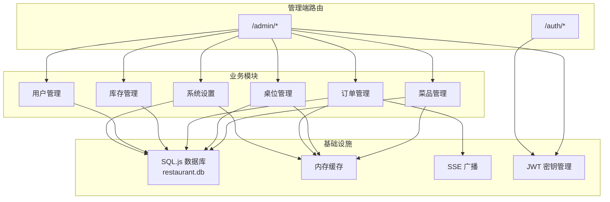
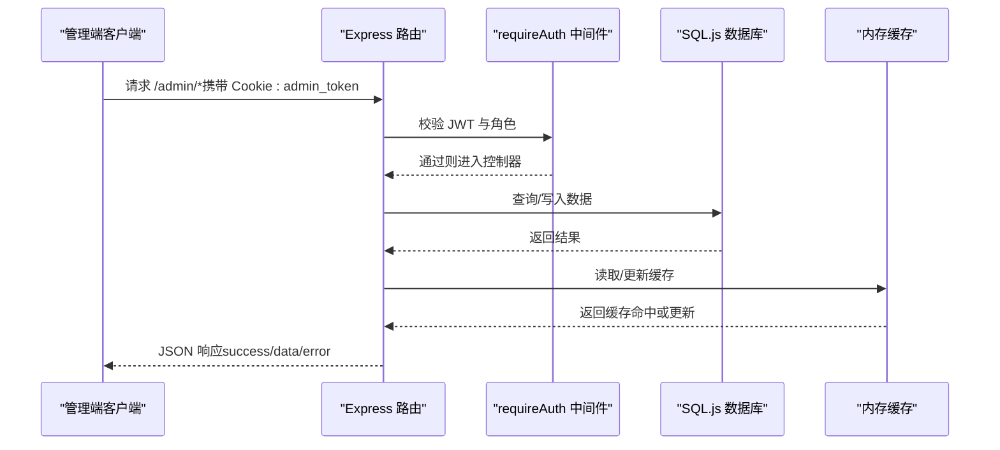
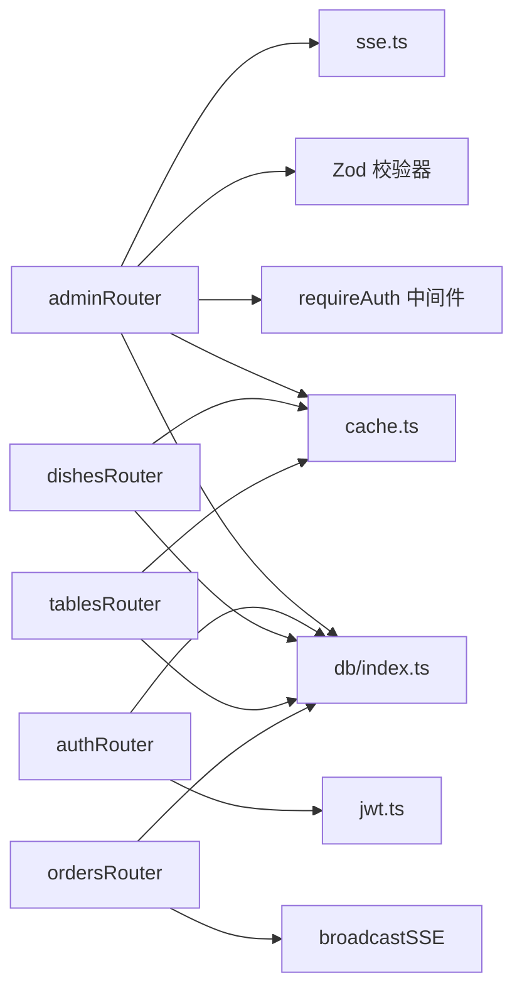
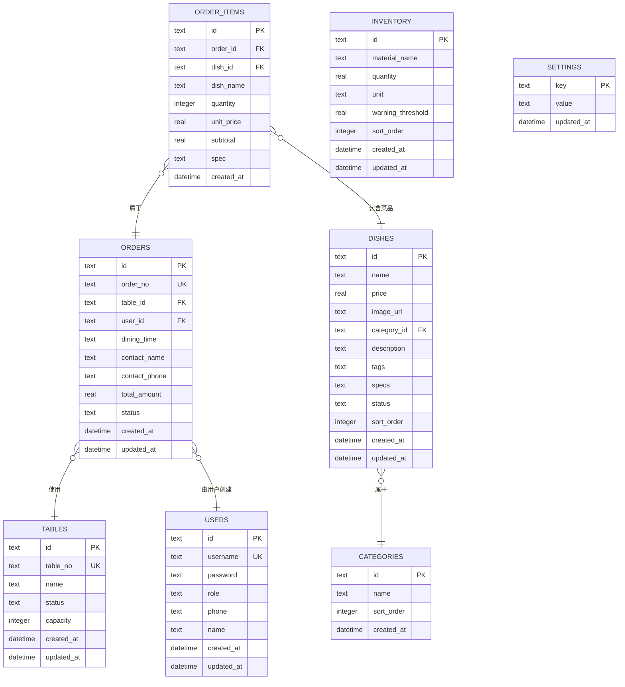

# 管理端API

<cite>
**本文引用的文件**
- [server/src/routes/admin.ts](file://server/src/routes/admin.ts)
- [server/src/routes/auth.ts](file://server/src/routes/auth.ts)
- [server/src/routes/dishes.ts](file://server/src/routes/dishes.ts)
- [server/src/routes/tables.ts](file://server/src/routes/tables.ts)
- [server/src/routes/orders.ts](file://server/src/routes/orders.ts)
- [server/src/utils/jwt.ts](file://server/src/utils/jwt.ts)
- [server/src/validators/index.ts](file://server/src/validators/index.ts)
- [server/src/db/index.ts](file://server/src/db/index.ts)
- [server/src/db/init.ts](file://server/src/db/init.ts)
- [server/src/utils/cache.ts](file://server/src/utils/cache.ts)
- [server/src/utils/sse.ts](file://server/src/utils/sse.ts)
- [server/src/routes/index.ts](file://server/src/routes/index.ts)
</cite>

## 目录
1. [简介](#简介)
2. [项目结构](#项目结构)
3. [核心组件](#核心组件)
4. [架构总览](#架构总览)
5. [详细组件分析](#详细组件分析)
6. [依赖关系分析](#依赖关系分析)
7. [性能考量](#性能考量)
8. [故障排查指南](#故障排查指南)
9. [结论](#结论)
10. [附录](#附录)

## 简介
本文件为 RLRMS 管理端 API 接口文档，面向管理员角色，覆盖登录认证、菜品管理、桌位管理、订单管理、库存管理、用户管理等完整后台能力。文档提供每个接口的请求方式、参数说明、权限要求、响应格式、错误处理策略，并解释认证令牌的使用与有效期管理。

## 项目结构
- 后端采用 Express + SQL.js 架构，数据持久化存储于本地 SQLite 文件 restaurant.db。
- 管理端路由统一挂载在 /admin 前缀下，通过 requireAuth 中间件进行管理员鉴权。
- 全局缓存使用内存 TTL 缓存，减少重复查询成本；批量写入使用事务批处理，保障一致性与性能。
- SSE 广播用于实时推送订单状态变更，便于管理端与前端协同。

**图表来源**
- [server/src/routes/index.ts:1-18](file://server/src/routes/index.ts#L1-L18)
- [server/src/routes/admin.ts:107-131](file://server/src/routes/admin.ts#L107-L131)
- [server/src/utils/cache.ts:64-72](file://server/src/utils/cache.ts#L64-L72)
- [server/src/utils/sse.ts:37-50](file://server/src/utils/sse.ts#L37-L50)
- [server/src/utils/jwt.ts:20-26](file://server/src/utils/jwt.ts#L20-L26)

**章节来源**
- [server/src/routes/index.ts:1-18](file://server/src/routes/index.ts#L1-L18)
- [server/src/db/index.ts:76-98](file://server/src/db/index.ts#L76-L98)

## 核心组件
- 认证中间件 requireAuth：从 Cookie 读取 admin_token，校验 JWT 角色为 admin，否则拒绝访问。
- JWT 密钥管理：开发环境基于主机特征派生固定密钥，生产环境可配置 JWT_SECRET，未配置时使用动态密钥。
- 数据库层：SQL.js 初始化、批量写入、事务合并、延迟保存，降低磁盘 IO。
- 缓存层：对分类、菜品、桌位可用性等热点数据设置 TTL，提升查询性能。
- SSE 广播：向管理端实时推送新订单与订单状态变更事件。

**章节来源**
- [server/src/routes/admin.ts:116-131](file://server/src/routes/admin.ts#L116-L131)
- [server/src/utils/jwt.ts:11-26](file://server/src/utils/jwt.ts#L11-L26)
- [server/src/db/index.ts:47-73](file://server/src/db/index.ts#L47-L73)
- [server/src/utils/cache.ts:18-36](file://server/src/utils/cache.ts#L18-L36)
- [server/src/utils/sse.ts:37-50](file://server/src/utils/sse.ts#L37-L50)

## 架构总览
管理端 API 通过 /admin 前缀暴露，所有接口均需携带 admin_token Cookie 并通过 requireAuth 校验。接口按功能划分为菜品、桌位、订单、库存、用户、设置等模块，每个模块内部遵循 REST 风格，使用标准 HTTP 方法表达 CRUD 行为。

**图表来源**
- [server/src/routes/admin.ts:116-131](file://server/src/routes/admin.ts#L116-L131)
- [server/src/db/index.ts:101-140](file://server/src/db/index.ts#L101-L140)
- [server/src/utils/cache.ts:18-36](file://server/src/utils/cache.ts#L18-L36)

## 详细组件分析

### 管理员登录接口
- 路径：POST /admin/login
- 权限：无（登录接口）
- 功能：校验用户名与密码，签发 admin_token（Cookie），返回用户信息。
- 参数：
  - username: string（必填）
  - password: string（必填）
- 成功响应：
  - data.user.id: string
  - data.user.username: string
  - data.user.role: string
  - data.user.name: string|null
- 错误响应：
  - 400：缺少参数或密码格式错误
  - 401：用户名或密码错误
  - 429：登录尝试次数过多
  - 500：服务器内部错误

**章节来源**
- [server/src/routes/auth.ts:65-144](file://server/src/routes/auth.ts#L65-L144)

### 管理员认证接口
- 路径：GET /admin/auth
- 权限：需要 admin_token（Cookie）
- 功能：校验 Cookie 中的 admin_token 是否有效并返回用户角色信息。
- 成功响应：
  - data.userId: string
  - data.username: string
  - data.role: string
- 错误响应：
  - 401：未提供或无效 token

**章节来源**
- [server/src/routes/auth.ts:158-179](file://server/src/routes/auth.ts#L158-L179)

### 菜品管理接口
- GET /admin/dishes
  - 功能：获取全部菜品（含分类名称、标签、规格等）
  - 成功响应：data[] 包含 tags/specs 解析为数组
  - 错误响应：500
- POST /admin/dishes
  - 功能：新增菜品
  - 参数：name, price, category_id?, description?, tags?, specs?, image_url?
  - 校验：createDishSchema
  - 成功响应：201 + data
  - 错误响应：400/500
- PUT /admin/dishes/reorder
  - 功能：批量重排菜品排序
  - 参数：orders: [{ id, sort_order }]
  - 成功响应：200
- PUT /admin/dishes/:id
  - 功能：更新菜品（可更新图片，自动清理未使用的旧图）
  - 参数：同上（部分可选）
  - 成功响应：200 + data
  - 错误响应：400/500
- DELETE /admin/dishes/:id
  - 功能：删除菜品（如图片未被其他菜品使用则删除文件）
  - 成功响应：200
  - 错误响应：400/500

**章节来源**
- [server/src/routes/admin.ts:341-546](file://server/src/routes/admin.ts#L341-L546)
- [server/src/validators/index.ts:21-40](file://server/src/validators/index.ts#L21-L40)

### 桌位管理接口
- GET /admin/tables
  - 功能：获取全部桌位（包含当前关联的未完成订单号）
  - 成功响应：200 + data[]
- POST /admin/tables
  - 功能：新增桌位
  - 参数：table_no, name, capacity?
  - 校验：createTableSchema
  - 成功响应：201 + data
  - 错误响应：400/500
- PUT /admin/tables/:id
  - 功能：更新桌位（可仅更新 status）
  - 参数：status, table_no?, name?, capacity?
  - 成功响应：200 + data 或 message
  - 错误响应：400/404/500
- DELETE /admin/tables/:id
  - 功能：删除桌位（若存在未完成订单则禁止删除）
  - 成功响应：200
  - 错误响应：400/404/500

**章节来源**
- [server/src/routes/admin.ts:223-337](file://server/src/routes/admin.ts#L223-L337)
- [server/src/validators/index.ts:42-46](file://server/src/validators/index.ts#L42-L46)

### 订单管理接口
- GET /admin/orders
  - 功能：分页查询订单（支持 status、startDate、endDate 过滤）
  - 成功响应：200 + data[]（items 已按订单聚合）
- GET /admin/orders/search
  - 功能：按订单号模糊搜索（最多 20 条）
  - 成功响应：200 + data[]
- PUT /admin/orders/:id/status
  - 功能：更新订单状态（支持 pending/confirmed/completed/cancelled）
  - 参数：status
  - 校验：updateOrderStatusSchema
  - 成功响应：200
  - 错误响应：400/404/500
- DELETE /admin/orders/:id
  - 功能：删除订单（级联删除订单项；若关联桌位且活跃则释放）
  - 成功响应：200
  - 错误响应：400/404/500

**章节来源**
- [server/src/routes/admin.ts:643-871](file://server/src/routes/admin.ts#L643-L871)
- [server/src/validators/index.ts:67-71](file://server/src/validators/index.ts#L67-L71)

### 库存管理接口
- GET /admin/inventory
  - 功能：获取全部库存项
  - 成功响应：200 + data[]
- POST /admin/inventory
  - 功能：新增库存项
  - 参数：material_name, quantity, unit, warning_threshold?
  - 校验：createInventorySchema
  - 成功响应：201 + data
- PUT /admin/inventory/reorder
  - 功能：批量重排库存排序
  - 参数：orders: [{ id, sort_order }]
  - 成功响应：200
- PUT /admin/inventory/:id
  - 功能：更新库存数量与预警阈值
  - 参数：quantity, warning_threshold?
  - 校验：updateInventorySchema
  - 成功响应：200 + data
- DELETE /admin/inventory/:id
  - 功能：删除库存项
  - 成功响应：200
  - 错误响应：404/500

**章节来源**
- [server/src/routes/admin.ts:875-990](file://server/src/routes/admin.ts#L875-L990)
- [server/src/validators/index.ts:53-64](file://server/src/validators/index.ts#L53-L64)

### 用户管理接口
- GET /admin/users
  - 功能：获取全部用户（按创建时间升序）
  - 成功响应：200 + data[]
- POST /admin/users
  - 功能：新增用户（管理员可创建 admin/customer）
  - 参数：username, password, role, name?, phone?
  - 校验：createUserSchema
  - 成功响应：201 + data
- PUT /admin/users/:id
  - 功能：更新用户（可选 password、role、name、phone）
  - 参数：password?, role?, name?, phone?
  - 校验：updateUserSchema
  - 成功响应：200 + data
  - 特殊限制：不可编辑/删除主管理员 admin
- DELETE /admin/users/:id
  - 功能：删除用户
  - 成功响应：200
  - 特殊限制：不可删除当前登录用户；不可删除最后一个管理员

**章节来源**
- [server/src/routes/admin.ts:994-1140](file://server/src/routes/admin.ts#L994-L1140)
- [server/src/validators/index.ts:96-109](file://server/src/validators/index.ts#L96-L109)

### 认证令牌使用与有效期
- 登录成功后，服务端通过 Set-Cookie 返回 admin_token（httpOnly、secure、sameSite=lax、maxAge=1 天、path=/）。
- 管理端在后续请求中自动携带该 Cookie。
- JWT 密钥：
  - 开发环境：基于主机特征派生固定密钥，保证热重载不丢失 token。
  - 生产环境：优先使用 JWT_SECRET 环境变量；未设置时使用动态密钥，重启后 token 失效。
- 令牌校验：requireAuth 中间件解码并校验角色为 admin。

**章节来源**
- [server/src/routes/auth.ts:114-127](file://server/src/routes/auth.ts#L114-L127)
- [server/src/utils/jwt.ts:20-26](file://server/src/utils/jwt.ts#L20-L26)
- [server/src/routes/admin.ts:116-131](file://server/src/routes/admin.ts#L116-L131)

### 实时事件接口（SSE）
- GET /admin/events
  - 功能：建立 SSE 连接，接收新订单与订单状态变更事件
  - 成功响应：200，持续推送 event: new_order/order_updated
  - 心跳：每 30 秒发送一次冒号行保持连接
  - 断开：客户端关闭或异常时清理连接

**章节来源**
- [server/src/routes/admin.ts:134-162](file://server/src/routes/admin.ts#L134-L162)
- [server/src/utils/sse.ts:37-50](file://server/src/utils/sse.ts#L37-L50)

## 依赖关系分析
- 路由组织：/admin/* 由 adminRouter 提供，/auth/* 由 authRouter 提供，公共接口（/dishes、/tables、/orders）由对应路由器提供。
- 数据访问：所有路由通过 db/index.ts 的 get/run/all 封装访问 SQL.js，批量写入使用 beginBatch/endBatch。
- 校验器：使用 Zod schema 在路由层进行输入校验，统一错误消息。
- 缓存：对分类、菜品、桌位可用性等设置 TTL，变更时主动失效。
- SSE：订单状态变更触发广播，管理端实时感知。

**图表来源**
- [server/src/routes/admin.ts:116-131](file://server/src/routes/admin.ts#L116-L131)
- [server/src/validators/index.ts:1-123](file://server/src/validators/index.ts#L1-L123)
- [server/src/db/index.ts:101-140](file://server/src/db/index.ts#L101-L140)
- [server/src/utils/cache.ts:41-54](file://server/src/utils/cache.ts#L41-L54)
- [server/src/utils/sse.ts:37-50](file://server/src/utils/sse.ts#L37-L50)
- [server/src/utils/jwt.ts:20-26](file://server/src/utils/jwt.ts#L20-L26)

**章节来源**
- [server/src/routes/index.ts:1-18](file://server/src/routes/index.ts#L1-L18)
- [server/src/db/index.ts:47-73](file://server/src/db/index.ts#L47-L73)

## 性能考量
- 批量写入：使用 beginBatch/endBatch 合并多次写入为单次事务，显著降低磁盘写入次数。
- 延迟保存：run 写入后通过防抖定时器合并保存，避免高频写入导致的性能抖动。
- 缓存策略：对分类、菜品列表、桌位可用性设置短 TTL，热点数据快速命中。
- 查询优化：为订单、菜品、桌位等表建立索引，加速过滤与排序。
- SSE：仅在连接活跃时广播，异常时自动清理，避免资源泄露。

**章节来源**
- [server/src/db/index.ts:47-73](file://server/src/db/index.ts#L47-L73)
- [server/src/db/init.ts:124-137](file://server/src/db/init.ts#L124-L137)
- [server/src/utils/cache.ts:18-36](file://server/src/utils/cache.ts#L18-L36)

## 故障排查指南
- 认证失败
  - 401 Authentication required：缺少 admin_token
  - 401 Invalid token：token 无效或过期
  - 403 Admin access required：非管理员账户
- 参数校验失败
  - 400：请求体不符合 Zod schema，返回具体字段错误信息
- 资源不存在
  - 404：请求的 ID 不存在（菜品/桌位/订单/库存/用户）
- 业务约束冲突
  - 400：桌位存在未完成订单无法删除；菜品/桌位/库存名称重复；菜品图片被使用无法删除
- 服务器错误
  - 500：数据库异常、文件处理异常、SSE 广播异常

**章节来源**
- [server/src/routes/admin.ts:116-131](file://server/src/routes/admin.ts#L116-L131)
- [server/src/validators/index.ts:1-123](file://server/src/validators/index.ts#L1-L123)

## 结论
管理端 API 以清晰的模块划分与严格的权限控制为基础，结合批量写入、缓存与 SSE 实时推送，提供了高效稳定的后台管理体验。建议在生产环境明确配置 JWT_SECRET，合理规划缓存 TTL，并对高频接口进行监控与告警。

## 附录

### 数据模型概览（与接口相关）

**图表来源**
- [server/src/db/init.ts:12-95](file://server/src/db/init.ts#L12-L95)