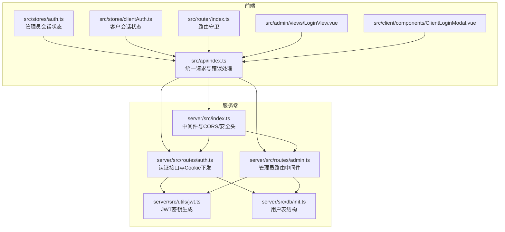
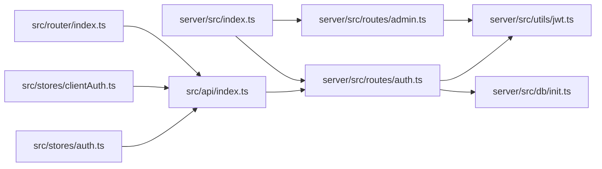

# 认证API

<cite>
**本文档引用的文件**
- [server/src/routes/auth.ts](file://server/src/routes/auth.ts)
- [server/src/utils/jwt.ts](file://server/src/utils/jwt.ts)
- [server/src/routes/admin.ts](file://server/src/routes/admin.ts)
- [server/src/index.ts](file://server/src/index.ts)
- [src/api/index.ts](file://src/api/index.ts)
- [src/stores/auth.ts](file://src/stores/auth.ts)
- [src/stores/clientAuth.ts](file://src/stores/clientAuth.ts)
- [src/admin/views/LoginView.vue](file://src/admin/views/LoginView.vue)
- [src/client/components/ClientLoginModal.vue](file://src/client/components/ClientLoginModal.vue)
- [src/router/index.ts](file://src/router/index.ts)
- [server/src/db/init.ts](file://server/src/db/init.ts)
</cite>

## 目录
1. [简介](#简介)
2. [项目结构](#项目结构)
3. [核心组件](#核心组件)
4. [架构总览](#架构总览)
5. [详细组件分析](#详细组件分析)
6. [依赖关系分析](#依赖关系分析)
7. [性能考量](#性能考量)
8. [故障排查指南](#故障排查指南)
9. [结论](#结论)

## 简介
本文件面向RLRMS系统的认证API，重点覆盖以下接口：
- 管理员登录接口：POST /api/auth/login
- 客户登录接口：POST /api/auth/client/login
- 登出接口：POST /api/auth/logout（管理员），POST /api/auth/client/logout（客户）
- 令牌验证接口：GET /api/auth/verify（管理员），GET /api/auth/client/verify（客户）

认证采用基于httpOnly Cookie的JWT方案，服务端签发JWT并以Cookie形式下发，前端通过Cookie自动携带，无需手动维护Authorization头。系统还内置IP级登录速率限制、令牌过期处理与安全加固措施。

## 项目结构
认证相关代码分布如下：
- 服务端
  - 路由层：/api/auth 与 /api/admin 下的认证相关接口
  - 工具层：JWT密钥生成与校验
  - 中间件：cookie解析、CORS、安全头
- 前端
  - API封装：统一请求、错误处理、401事件分发
  - Pinia Store：会话状态、保活定时器、过期提示
  - 路由守卫：鉴权拦截、登录态恢复
  - 视图组件：登录弹窗、管理登录页



图表来源
- [server/src/routes/auth.ts:62-344](file://server/src/routes/auth.ts#L62-L344)
- [server/src/routes/admin.ts:115-131](file://server/src/routes/admin.ts#L115-L131)
- [server/src/utils/jwt.ts:1-27](file://server/src/utils/jwt.ts#L1-L27)
- [server/src/index.ts:45-67](file://server/src/index.ts#L45-L67)
- [src/api/index.ts:54-114](file://src/api/index.ts#L54-L114)
- [src/stores/auth.ts:15-127](file://src/stores/auth.ts#L15-L127)
- [src/stores/clientAuth.ts:10-86](file://src/stores/clientAuth.ts#L10-L86)
- [src/admin/views/LoginView.vue:20-42](file://src/admin/views/LoginView.vue#L20-L42)
- [src/client/components/ClientLoginModal.vue:47-88](file://src/client/components/ClientLoginModal.vue#L47-L88)
- [src/router/index.ts:201-277](file://src/router/index.ts#L201-L277)
- [server/src/db/init.ts:11-22](file://server/src/db/init.ts#L11-L22)

章节来源
- [server/src/routes/auth.ts:62-344](file://server/src/routes/auth.ts#L62-L344)
- [server/src/routes/admin.ts:115-131](file://server/src/routes/admin.ts#L115-L131)
- [server/src/utils/jwt.ts:1-27](file://server/src/utils/jwt.ts#L1-L27)
- [server/src/index.ts:45-67](file://server/src/index.ts#L45-L67)
- [src/api/index.ts:54-114](file://src/api/index.ts#L54-L114)
- [src/stores/auth.ts:15-127](file://src/stores/auth.ts#L15-L127)
- [src/stores/clientAuth.ts:10-86](file://src/stores/clientAuth.ts#L10-L86)
- [src/admin/views/LoginView.vue:20-42](file://src/admin/views/LoginView.vue#L20-L42)
- [src/client/components/ClientLoginModal.vue:47-88](file://src/client/components/ClientLoginModal.vue#L47-L88)
- [src/router/index.ts:201-277](file://src/router/index.ts#L201-L277)
- [server/src/db/init.ts:11-22](file://server/src/db/init.ts#L11-L22)

## 核心组件
- 服务端认证路由
  - 管理员登录：POST /api/auth/login，签发admin_token Cookie（1天有效期）
  - 客户登录：POST /api/auth/client/login，签发client_token Cookie（7天有效期）
  - 登出：POST /api/auth/logout、POST /api/auth/client/logout，清除对应Cookie
  - 验证：GET /api/auth/verify、GET /api/auth/client/verify，从Cookie解码并校验JWT
- 前端API封装
  - 统一fetch封装，自动携带Cookie（credentials: 'include'）
  - 401错误统一转化为自定义事件，触发全局“会话过期”提示
- 前端状态与保活
  - 管理员：Pinia Store维护会话过期时间，5分钟保活轮询
  - 客户：登录态恢复（tryRestore），支持自动登录
- 安全与限流
  - IP级登录速率限制（15分钟最多5次）
  - httpOnly Cookie，secure（生产环境），sameSite=lax
  - 客户端验证时二次校验用户是否存在数据库

章节来源
- [server/src/routes/auth.ts:65-144](file://server/src/routes/auth.ts#L65-L144)
- [server/src/routes/auth.ts:182-294](file://server/src/routes/auth.ts#L182-L294)
- [server/src/routes/auth.ts:157-179](file://server/src/routes/auth.ts#L157-L179)
- [server/src/routes/auth.ts:307-344](file://server/src/routes/auth.ts#L307-L344)
- [src/api/index.ts:54-114](file://src/api/index.ts#L54-L114)
- [src/stores/auth.ts:37-55](file://src/stores/auth.ts#L37-L55)
- [src/stores/clientAuth.ts:38-54](file://src/stores/clientAuth.ts#L38-L54)
- [server/src/routes/auth.ts:19-55](file://server/src/routes/auth.ts#L19-L55)

## 架构总览
认证流程概览（管理员登录为例）：

```mermaid
sequenceDiagram
participant C as "浏览器"
participant FE as "前端API封装"
participant SRV as "服务端路由"
participant DB as "数据库"
participant JWT as "JWT工具"
C->>FE : "POST /api/auth/login {username,password}"
FE->>SRV : "携带Cookie凭据"
SRV->>DB : "查询用户并校验密码"
DB-->>SRV : "用户信息"
SRV->>JWT : "签发JWTadmin_token"
JWT-->>SRV : "签名后的token"
SRV-->>C : "Set-Cookie : admin_token=...; HttpOnly; Secure; SameSite=Lax; Max-Age=86400"
SRV-->>FE : "{success : true,data : {user}}"
FE-->>C : "登录成功回调"
```

图表来源
- [server/src/routes/auth.ts:65-144](file://server/src/routes/auth.ts#L65-L144)
- [src/api/index.ts:246-251](file://src/api/index.ts#L246-L251)
- [server/src/utils/jwt.ts:20-22](file://server/src/utils/jwt.ts#L20-L22)
- [server/src/db/init.ts:11-22](file://server/src/db/init.ts#L11-L22)

章节来源
- [server/src/routes/auth.ts:65-144](file://server/src/routes/auth.ts#L65-L144)
- [src/api/index.ts:246-251](file://src/api/index.ts#L246-L251)
- [server/src/utils/jwt.ts:20-22](file://server/src/utils/jwt.ts#L20-L22)
- [server/src/db/init.ts:11-22](file://server/src/db/init.ts#L11-L22)

## 详细组件分析

### 接口定义与行为

- 管理员登录（POST /api/auth/login）
  - 请求体：{ username, password }
  - 成功响应：设置admin_token Cookie（HttpOnly、Secure、SameSite=Lax、Max-Age=86400）
  - 错误码：
    - 400：缺少用户名/密码或格式非法
    - 401：用户名或密码错误
    - 429：登录尝试过多（15分钟窗口内最多5次）
    - 500：内部错误
  - 令牌有效期：1天
  - 安全特性：IP级速率限制、httpOnly Cookie

- 客户登录（POST /api/auth/client/login）
  - 请求体：{ phone, password }
  - 自动注册：若手机号不存在且密码有效，自动创建customer用户
  - 成功响应：设置client_token Cookie（7天有效期）
  - 错误码：
    - 400：缺少手机号/密码、手机号格式错误、密码长度不足
    - 401：手机号或密码错误
    - 429：登录尝试过多
    - 500：注册失败
  - 令牌有效期：7天

- 登出（POST /api/auth/logout、POST /api/auth/client/logout）
  - 清除对应Cookie并返回成功消息

- 验证（GET /api/auth/verify、GET /api/auth/client/verify）
  - 从Cookie读取token并验证
  - 客户端验证额外检查用户是否仍存在于数据库
  - 错误码：401（未提供token/无效token/用户不存在/登录已过期）

章节来源
- [server/src/routes/auth.ts:65-144](file://server/src/routes/auth.ts#L65-L144)
- [server/src/routes/auth.ts:182-294](file://server/src/routes/auth.ts#L182-L294)
- [server/src/routes/auth.ts:147-155](file://server/src/routes/auth.ts#L147-L155)
- [server/src/routes/auth.ts:297-305](file://server/src/routes/auth.ts#L297-L305)
- [server/src/routes/auth.ts:157-179](file://server/src/routes/auth.ts#L157-L179)
- [server/src/routes/auth.ts:307-344](file://server/src/routes/auth.ts#L307-L344)

### JWT生成与验证机制
- 密钥生成
  - 开发环境：基于主机名与用户名派生固定密钥，便于热重载不丢失token
  - 生产环境：优先使用JWT_SECRET环境变量；若未设置则生成随机密钥（每次启动不同）
- 令牌签发
  - 管理员：expiresIn=1d
  - 客户：expiresIn=7d
- 令牌验证
  - 从Cookie读取token并使用相同密钥验证
  - 客户端验证时额外查询数据库确认用户存在性

章节来源
- [server/src/utils/jwt.ts:1-27](file://server/src/utils/jwt.ts#L1-L27)
- [server/src/routes/auth.ts:114-118](file://server/src/routes/auth.ts#L114-L118)
- [server/src/routes/auth.ts:265-269](file://server/src/routes/auth.ts#L265-L269)
- [server/src/routes/auth.ts:318-330](file://server/src/routes/auth.ts#L318-L330)

### 前端集成与最佳实践

- Cookie认证与请求
  - 前端API封装默认携带Cookie（credentials: 'include'），无需手动设置Authorization头
  - 401统一转化为自定义事件，触发全局“会话过期”提示

- 管理员会话保活
  - Store设置会话过期时间为24小时，并启动5分钟保活轮询
  - 若保活失败，触发auth:expired事件并清空会话

- 客户端登录态恢复
  - 页面初始化尝试调用clientVerifyToken，恢复登录态
  - 受保护路由（requiresClientAuth）未登录时弹出登录模态框

- 登录视图
  - 管理员登录页：提交用户名/密码，成功后跳转至redirect或/admin
  - 客户登录模态：手机号+密码，未注册自动注册并登录

章节来源
- [src/api/index.ts:54-114](file://src/api/index.ts#L54-L114)
- [src/api/index.ts:253-255](file://src/api/index.ts#L253-L255)
- [src/api/index.ts:278-280](file://src/api/index.ts#L278-L280)
- [src/stores/auth.ts:37-55](file://src/stores/auth.ts#L37-L55)
- [src/stores/clientAuth.ts:38-54](file://src/stores/clientAuth.ts#L38-L54)
- [src/admin/views/LoginView.vue:20-42](file://src/admin/views/LoginView.vue#L20-L42)
- [src/client/components/ClientLoginModal.vue:47-88](file://src/client/components/ClientLoginModal.vue#L47-L88)
- [src/router/index.ts:201-277](file://src/router/index.ts#L201-L277)

### 管理员路由中间件
- requireAuth中间件从Cookie读取admin_token，验证角色为admin
- 未提供token或token无效返回401
- 非admin角色返回403

章节来源
- [server/src/routes/admin.ts:115-131](file://server/src/routes/admin.ts#L115-L131)

### 数据模型与用户表
- users表包含id、username、password、role、phone、name等字段
- 管理员默认账户在初始化时创建

章节来源
- [server/src/db/init.ts:11-22](file://server/src/db/init.ts#L11-L22)
- [server/src/db/init.ts:140-149](file://server/src/db/init.ts#L140-L149)

## 依赖关系分析



图表来源
- [server/src/routes/auth.ts:6-7](file://server/src/routes/auth.ts#L6-L7)
- [server/src/utils/jwt.ts:1-27](file://server/src/utils/jwt.ts#L1-L27)
- [server/src/db/init.ts:11-22](file://server/src/db/init.ts#L11-L22)
- [src/api/index.ts:246-286](file://src/api/index.ts#L246-L286)
- [src/stores/auth.ts:15-127](file://src/stores/auth.ts#L15-L127)
- [src/stores/clientAuth.ts:10-86](file://src/stores/clientAuth.ts#L10-L86)
- [src/router/index.ts:201-277](file://src/router/index.ts#L201-L277)
- [server/src/index.ts:45-88](file://server/src/index.ts#L45-L88)
- [server/src/routes/admin.ts:115-131](file://server/src/routes/admin.ts#L115-L131)

章节来源
- [server/src/routes/auth.ts:6-7](file://server/src/routes/auth.ts#L6-L7)
- [server/src/utils/jwt.ts:1-27](file://server/src/utils/jwt.ts#L1-L27)
- [server/src/db/init.ts:11-22](file://server/src/db/init.ts#L11-L22)
- [src/api/index.ts:246-286](file://src/api/index.ts#L246-L286)
- [src/stores/auth.ts:15-127](file://src/stores/auth.ts#L15-L127)
- [src/stores/clientAuth.ts:10-86](file://src/stores/clientAuth.ts#L10-L86)
- [src/router/index.ts:201-277](file://src/router/index.ts#L201-L277)
- [server/src/index.ts:45-88](file://server/src/index.ts#L45-L88)
- [server/src/routes/admin.ts:115-131](file://server/src/routes/admin.ts#L115-L131)

## 性能考量
- Cookie自动携带：减少请求头体积，避免跨域复杂请求
- 保活轮询：5分钟一次，负载可控
- 速率限制：15分钟窗口内最多5次尝试，降低暴力破解风险
- 安全头：X-Content-Type-Options、X-Frame-Options、X-XSS-Protection、Referrer-Policy

[本节为通用建议，不直接分析具体文件]

## 故障排查指南

常见错误与处理
- 400 参数缺失/格式错误
  - 管理员登录：检查username/password是否为空
  - 客户登录：检查phone格式（11位数字）、password长度（≥6）
- 401 未提供token/无效token/登录已过期
  - 前端会触发auth:expired事件，提示重新登录
  - 检查Cookie是否被浏览器禁用或跨域策略影响
- 429 登录尝试过多
  - 等待15分钟或更换IP
- 500 内部错误
  - 查看服务端日志，确认数据库初始化完成

安全与Cookie问题
- 确认Cookie属性：HttpOnly、Secure（生产环境）、SameSite=Lax
- 生产环境需设置JWT_SECRET环境变量，避免每次启动密钥变化导致token失效
- 客户端验证时若用户被删除，会清除Cookie并返回401

章节来源
- [server/src/routes/auth.ts:79-84](file://server/src/routes/auth.ts#L79-L84)
- [server/src/routes/auth.ts:196-216](file://server/src/routes/auth.ts#L196-L216)
- [src/api/index.ts:94-104](file://src/api/index.ts#L94-L104)
- [server/src/routes/auth.ts:19-55](file://server/src/routes/auth.ts#L19-L55)
- [server/src/utils/jwt.ts:24-26](file://server/src/utils/jwt.ts#L24-L26)
- [server/src/routes/auth.ts:323-330](file://server/src/routes/auth.ts#L323-L330)

## 结论
RLRMS采用基于httpOnly Cookie的JWT认证方案，结合IP级速率限制与安全头，兼顾易用性与安全性。管理员与客户分别使用不同的Cookie与有效期策略，前端通过统一API封装与Pinia Store实现会话保活与登录态恢复。建议生产环境务必设置JWT_SECRET并启用HTTPS，确保Cookie的Secure标志生效。