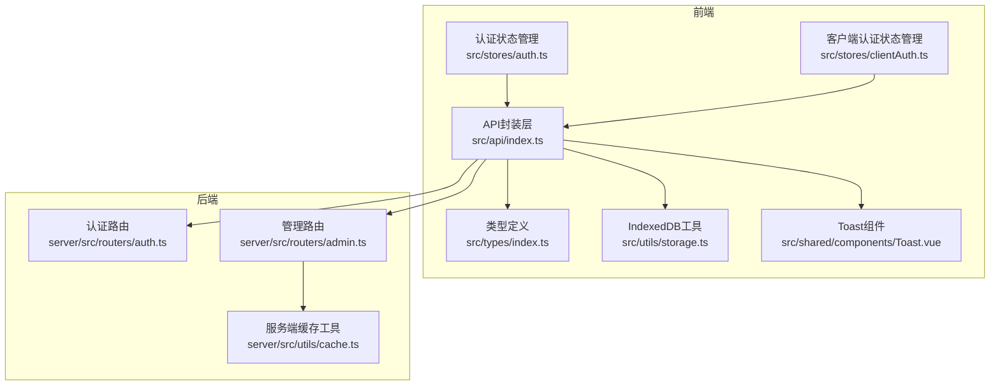
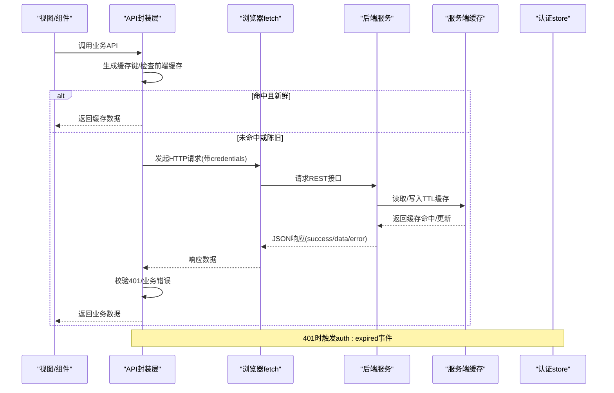
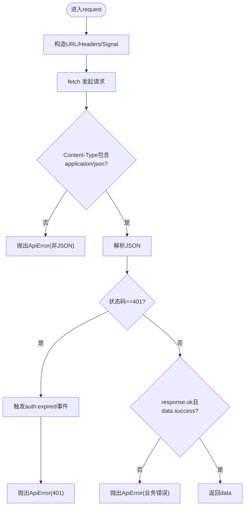
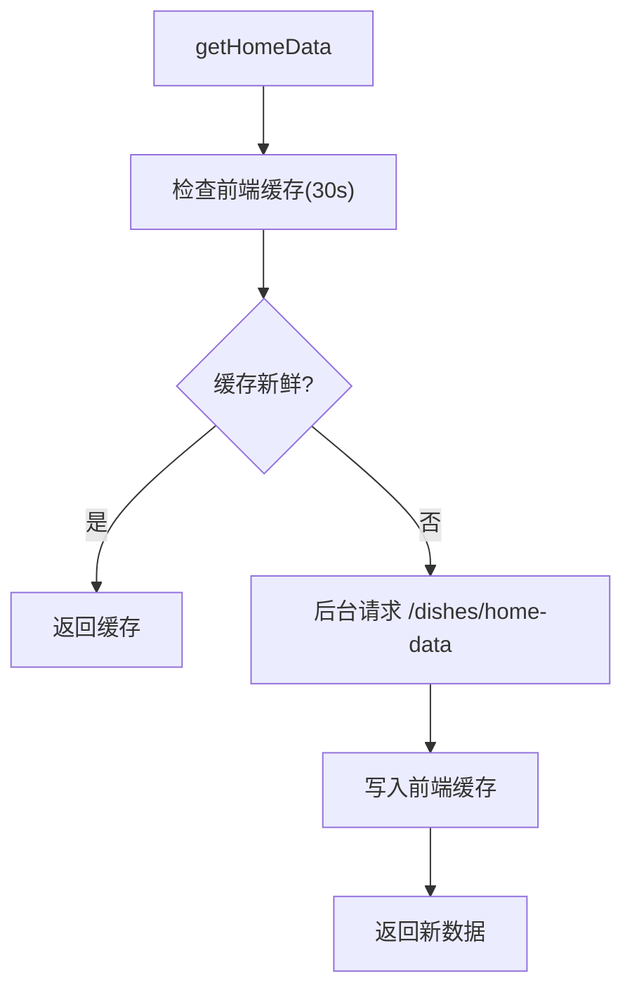
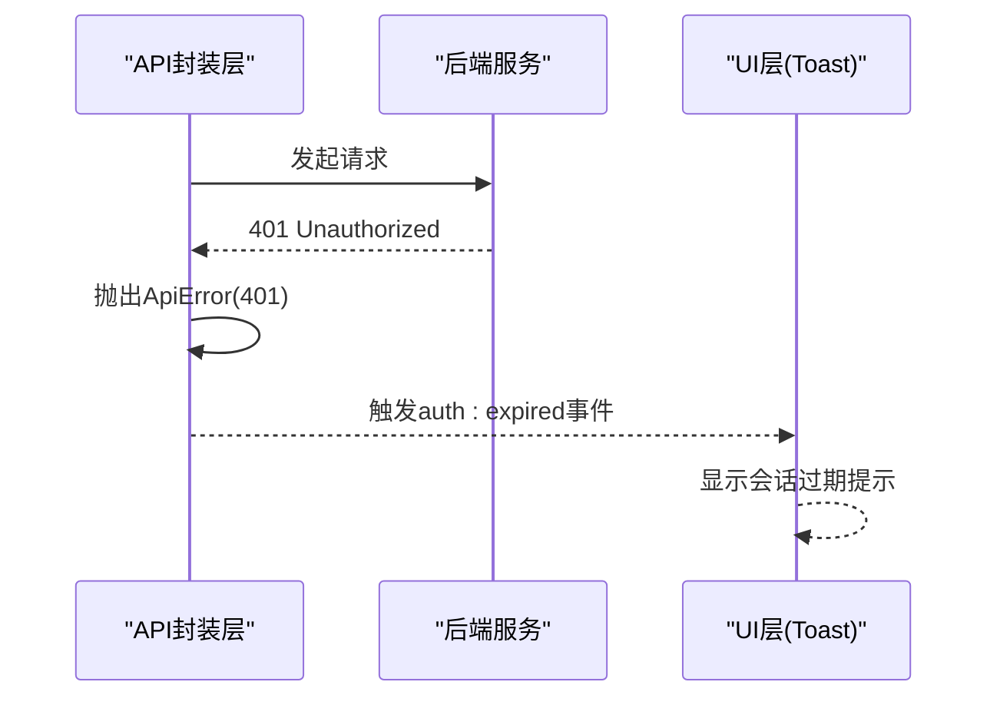
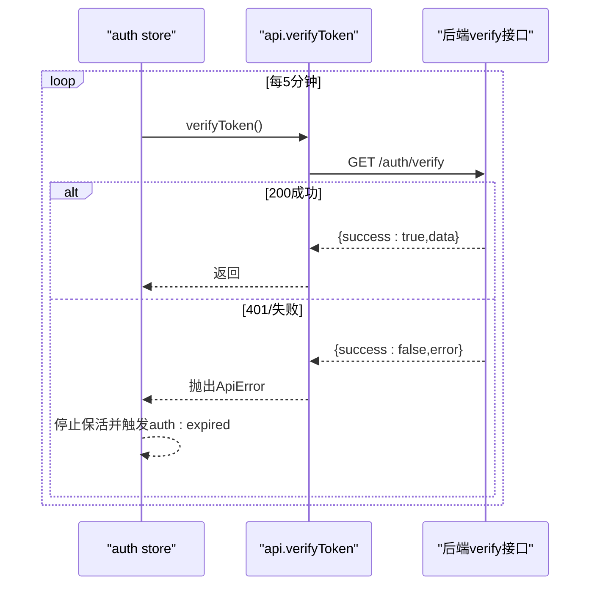
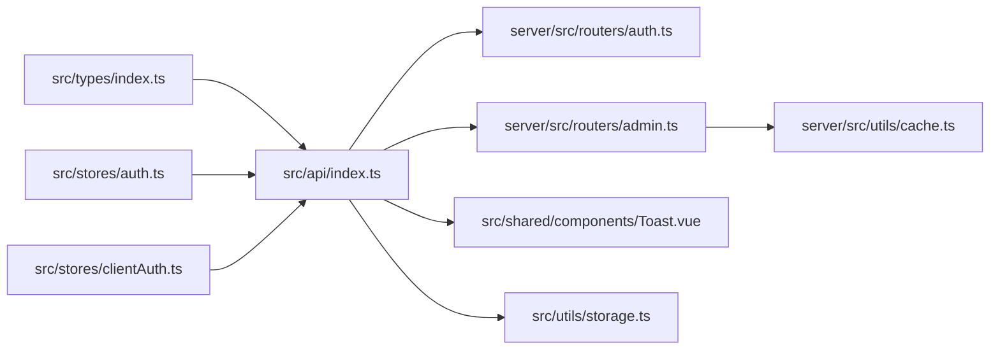

# API封装层

<cite>
**本文引用的文件**
- [src/api/index.ts](file://src/api/index.ts)
- [server/src/utils/cache.ts](file://server/src/utils/cache.ts)
- [server/src/routers/auth.ts](file://server/src/routers/auth.ts)
- [server/src/routers/admin.ts](file://server/src/routers/admin.ts)
- [src/stores/auth.ts](file://src/stores/auth.ts)
- [src/stores/clientAuth.ts](file://src/stores/clientAuth.ts)
- [src/types/index.ts](file://src/types/index.ts)
- [src/main.ts](file://src/main.ts)
- [src/utils/storage.ts](file://src/utils/storage.ts)
- [src/shared/components/Toast.vue](file://src/shared/components/Toast.vue)
</cite>

## 目录
1. [简介](#简介)
2. [项目结构](#项目结构)
3. [核心组件](#核心组件)
4. [架构总览](#架构总览)
5. [详细组件分析](#详细组件分析)
6. [依赖关系分析](#依赖关系分析)
7. [性能考量](#性能考量)
8. [故障排查指南](#故障排查指南)
9. [结论](#结论)
10. [附录](#附录)

## 简介
本文件面向RLRMS前端API封装层，系统性梳理RESTful接口设计理念与实现架构，统一的请求/响应规范，内存缓存策略（含stale-while-revalidate）、错误处理机制、请求/响应拦截器思路、最佳实践与性能优化建议，并提供调试技巧与排障清单。

## 项目结构
API封装层位于前端src/api/index.ts，围绕统一的请求发起器与一组高内聚的业务API方法构建；后端提供认证、管理与通用数据接口，配套服务端内存缓存工具；前端状态管理负责会话保活与全局事件联动；类型系统统一前后端契约；UI侧提供骨架屏、加载与Toast组件提升交互质量。

图示来源
- [src/api/index.ts:1-608](file://src/api/index.ts#L1-L608)
- [server/src/routers/auth.ts:1-405](file://server/src/routers/auth.ts#L1-L405)
- [server/src/routers/admin.ts:1-200](file://server/src/routers/admin.ts#L1-L200)
- [server/src/utils/cache.ts:1-73](file://server/src/utils/cache.ts#L1-L73)
- [src/stores/auth.ts:1-128](file://src/stores/auth.ts#L1-L128)
- [src/stores/clientAuth.ts:1-87](file://src/stores/clientAuth.ts#L1-L87)
- [src/types/index.ts:1-133](file://src/types/index.ts#L1-L133)
- [src/utils/storage.ts:1-109](file://src/utils/storage.ts#L1-L109)
- [src/shared/components/Toast.vue:1-138](file://src/shared/components/Toast.vue#L1-L138)

章节来源
- [src/api/index.ts:1-608](file://src/api/index.ts#L1-L608)
- [server/src/routers/auth.ts:1-405](file://server/src/routers/auth.ts#L1-L405)
- [server/src/routers/admin.ts:1-200](file://server/src/routers/admin.ts#L1-L200)
- [server/src/utils/cache.ts:1-73](file://server/src/utils/cache.ts#L1-L73)
- [src/stores/auth.ts:1-128](file://src/stores/auth.ts#L1-L128)
- [src/stores/clientAuth.ts:1-87](file://src/stores/clientAuth.ts#L1-L87)
- [src/types/index.ts:1-133](file://src/types/index.ts#L1-L133)
- [src/utils/storage.ts:1-109](file://src/utils/storage.ts#L1-L109)
- [src/shared/components/Toast.vue:1-138](file://src/shared/components/Toast.vue#L1-L138)

## 核心组件
- 统一请求发起器与拦截器
  - 统一基础路径、超时控制、信号合并、凭据携带、Content-Type设置
  - 非JSON响应防御、401统一处理、业务错误包装
- 内存缓存策略
  - 前端stale-while-revalidate：命中即返回，后台静默刷新
  - 服务端TTL缓存：按键失效与前缀失效
- 错误处理
  - 统一ApiError异常、401事件分发、业务错误透传
- 认证与会话保活
  - 前端store维护过期时间、定时保活、过期事件
  - 后端cookie + JWT，支持管理员与客户端两类token
- 类型系统
  - 统一的ApiResponse与领域模型，保障契约一致性
- UI支撑
  - 骨架屏、加载、Toast组件提升可用性

章节来源
- [src/api/index.ts:48-126](file://src/api/index.ts#L48-L126)
- [src/api/index.ts:128-608](file://src/api/index.ts#L128-L608)
- [server/src/utils/cache.ts:1-73](file://server/src/utils/cache.ts#L1-L73)
- [src/stores/auth.ts:15-127](file://src/stores/auth.ts#L15-L127)
- [server/src/routers/auth.ts:64-344](file://server/src/routers/auth.ts#L64-L344)
- [src/types/index.ts:1-133](file://src/types/index.ts#L1-L133)

## 架构总览
前端API封装层通过统一请求器对接后端REST接口，结合前端内存缓存与后端TTL缓存实现“冷热分离”的读取优化；认证采用cookie + JWT，前端store负责会话保活与过期事件；错误通过统一异常与全局事件驱动UI反馈。

图示来源
- [src/api/index.ts:54-114](file://src/api/index.ts#L54-L114)
- [server/src/routers/auth.ts:158-179](file://server/src/routers/auth.ts#L158-L179)
- [server/src/utils/cache.ts:18-36](file://server/src/utils/cache.ts#L18-L36)
- [src/stores/auth.ts:37-54](file://src/stores/auth.ts#L37-L54)

## 详细组件分析

### 统一请求器与拦截器
- 设计要点
  - 基础路径/API_BASE、超时控制、AbortSignal合并、凭据携带
  - 非JSON响应防御：校验Content-Type，避免HTML响应绕过401/错误处理器
  - 401处理：触发全局auth:expired事件，便于路由与store联动
  - 业务错误：统一包装为ApiError，包含status与data
- 可取消请求
  - 提供createCancellableRequest，便于复杂场景（如搜索防抖、轮询取消）

图示来源
- [src/api/index.ts:54-114](file://src/api/index.ts#L54-L114)

章节来源
- [src/api/index.ts:48-126](file://src/api/index.ts#L48-L126)
- [src/api/index.ts:54-114](file://src/api/index.ts#L54-L114)

### 内存缓存策略
- 前端stale-while-revalidate
  - 30秒TTL，命中即返回，后台静默刷新
  - home-data与categories等高频读取场景受益明显
- 服务端TTL缓存
  - Map + expiresAt，支持按键失效、前缀失效、清空
  - 管理端路由广泛使用，降低数据库压力
- 缓存键规范
  - categories、dishes:home-data、dishes:list、dishes:search:、settings、tables:available、tables:available-for: 等

图示来源
- [src/api/index.ts:128-148](file://src/api/index.ts#L128-L148)
- [server/src/utils/cache.ts:18-36](file://server/src/utils/cache.ts#L18-L36)
- [server/src/utils/cache.ts:64-72](file://server/src/utils/cache.ts#L64-L72)

章节来源
- [src/api/index.ts:9-34](file://src/api/index.ts#L9-L34)
- [src/api/index.ts:128-171](file://src/api/index.ts#L128-L171)
- [server/src/utils/cache.ts:1-73](file://server/src/utils/cache.ts#L1-L73)

### 错误处理机制
- ApiError异常
  - 包含message/status/data，便于UI与日志追踪
- 401处理
  - 统一触发auth:expired事件，路由与store可监听并执行登出/跳转
- 业务错误
  - data.error透传，结合Toast组件进行用户提示
- 非JSON响应防御
  - 防止HTML响应导致语法错误与误导性异常

图示来源
- [src/api/index.ts:94-108](file://src/api/index.ts#L94-L108)
- [src/stores/auth.ts:41-54](file://src/stores/auth.ts#L41-L54)
- [src/shared/components/Toast.vue:1-138](file://src/shared/components/Toast.vue#L1-L138)

章节来源
- [src/api/index.ts:36-46](file://src/api/index.ts#L36-L46)
- [src/api/index.ts:94-108](file://src/api/index.ts#L94-L108)
- [src/stores/auth.ts:37-54](file://src/stores/auth.ts#L37-L54)
- [src/shared/components/Toast.vue:1-138](file://src/shared/components/Toast.vue#L1-L138)

### 认证与会话保活
- 管理端认证
  - /auth/login：管理员登录，设置httpOnly cookie，有效期1天
  - /auth/verify：校验cookie + JWT，返回用户角色
  - /auth/logout：清除cookie
  - /auth/password：修改密码
- 客户端认证
  - /auth/client/login：手机号+密码登录，自动注册客户账号，设置7天有效期cookie
  - /auth/client/verify：校验客户端token并二次核对用户是否存在
  - /auth/client/logout：清除客户端cookie
- 前端会话保活
  - 每5分钟调用verifyToken，失败则触发auth:expired事件并停止保活
  - 记录会话过期时间，计算剩余秒数与即将过期阈值

图示来源
- [server/src/routers/auth.ts:158-179](file://server/src/routers/auth.ts#L158-L179)
- [src/stores/auth.ts:37-54](file://src/stores/auth.ts#L37-L54)
- [src/api/index.ts:253-255](file://src/api/index.ts#L253-L255)

章节来源
- [server/src/routers/auth.ts:64-344](file://server/src/routers/auth.ts#L64-L344)
- [src/stores/auth.ts:15-127](file://src/stores/auth.ts#L15-L127)
- [src/stores/clientAuth.ts:1-87](file://src/stores/clientAuth.ts#L1-L87)
- [src/api/index.ts:246-286](file://src/api/index.ts#L246-L286)

### 请求/响应拦截器实现思路
- 请求拦截器
  - 在request内部完成：统一headers、超时、凭据、信号合并
- 响应拦截器
  - 在request内部完成：非JSON防御、401事件、业务错误包装
- 认证令牌注入
  - 通过credentials:'include'与后端cookie配合，无需手动注入Authorization头
- 响应数据转换
  - 统一解析JSON并校验success字段
- 错误统一处理
  - 统一抛出ApiError，便于上层捕获与UI提示

章节来源
- [src/api/index.ts:54-114](file://src/api/index.ts#L54-L114)

### API调用最佳实践
- 使用createCancellableRequest处理高频/可取消请求（如搜索）
- 对高频读取接口启用前端缓存（如categories、home-data）
- 严格遵循ApiResponse约定，统一处理success/data/error/message
- 401错误不要忽略，确保触发auth:expired事件
- 上传/下载文件使用FormData/响应blob，注意Content-Disposition解析与UTF-8编码处理

章节来源
- [src/api/index.ts:117-126](file://src/api/index.ts#L117-L126)
- [src/api/index.ts:128-171](file://src/api/index.ts#L128-L171)
- [src/api/index.ts:498-549](file://src/api/index.ts#L498-L549)

## 依赖关系分析

图示来源
- [src/types/index.ts:1-133](file://src/types/index.ts#L1-L133)
- [src/api/index.ts:1-608](file://src/api/index.ts#L1-L608)
- [server/src/routers/auth.ts:1-405](file://server/src/routers/auth.ts#L1-L405)
- [server/src/routers/admin.ts:1-200](file://server/src/routers/admin.ts#L1-L200)
- [server/src/utils/cache.ts:1-73](file://server/src/utils/cache.ts#L1-L73)
- [src/stores/auth.ts:1-128](file://src/stores/auth.ts#L1-L128)
- [src/stores/clientAuth.ts:1-87](file://src/stores/clientAuth.ts#L1-L87)
- [src/shared/components/Toast.vue:1-138](file://src/shared/components/Toast.vue#L1-L138)
- [src/utils/storage.ts:1-109](file://src/utils/storage.ts#L1-L109)

章节来源
- [src/api/index.ts:1-608](file://src/api/index.ts#L1-L608)
- [server/src/routers/auth.ts:1-405](file://server/src/routers/auth.ts#L1-L405)
- [server/src/routers/admin.ts:1-200](file://server/src/routers/admin.ts#L1-L200)
- [server/src/utils/cache.ts:1-73](file://server/src/utils/cache.ts#L1-L73)
- [src/stores/auth.ts:1-128](file://src/stores/auth.ts#L1-L128)
- [src/stores/clientAuth.ts:1-87](file://src/stores/clientAuth.ts#L1-L87)
- [src/types/index.ts:1-133](file://src/types/index.ts#L1-L133)
- [src/utils/storage.ts:1-109](file://src/utils/storage.ts#L1-L109)
- [src/shared/components/Toast.vue:1-138](file://src/shared/components/Toast.vue#L1-L138)

## 性能考量
- 前端缓存
  - stale-while-revalidate减少首屏等待，后台静默刷新保证数据新鲜度
  - 30秒TTL平衡实时性与性能，适合菜品/分类等变化频率较低的数据
- 服务端缓存
  - TTL缓存显著降低热点查询的数据库负载
  - 提供前缀失效能力，便于批量失效（如批量更新后）
- 超时与取消
  - 合理设置timeout，避免长时间挂起
  - 使用AbortController与AbortSignal，及时取消无用请求
- 传输优化
  - 统一JSON传输，避免HTML响应干扰
  - 大文件上传使用FormData，下载使用Blob并触发浏览器下载

章节来源
- [src/api/index.ts:9-34](file://src/api/index.ts#L9-L34)
- [server/src/utils/cache.ts:18-36](file://server/src/utils/cache.ts#L18-L36)
- [src/api/index.ts:117-126](file://src/api/index.ts#L117-L126)
- [src/api/index.ts:498-549](file://src/api/index.ts#L498-L549)

## 故障排查指南
- 401会话过期
  - 现象：弹出“会话已过期，请重新登录”，自动跳转登录页
  - 排查：确认cookie是否携带、JWT是否有效、verifyToken是否定期调用
  - 相关：auth:expired事件、会话保活定时器
- 业务错误提示
  - 现象：Toast显示具体错误信息
  - 排查：查看ApiError.data.error，确认后端返回结构
- 非JSON响应
  - 现象：抛出ApiError，提示非JSON响应
  - 排查：检查Content-Type，确认后端正确返回application/json
- 导入/导出异常
  - 现象：导入失败或导出文件名乱码
  - 排查：Content-Disposition解析、UTF-8编码处理、Blob下载触发

章节来源
- [src/api/index.ts:94-108](file://src/api/index.ts#L94-L108)
- [src/stores/auth.ts:37-54](file://src/stores/auth.ts#L37-L54)
- [src/shared/components/Toast.vue:1-138](file://src/shared/components/Toast.vue#L1-L138)
- [src/api/index.ts:510-549](file://src/api/index.ts#L510-L549)
- [src/api/index.ts:556-595](file://src/api/index.ts#L556-L595)

## 结论
本API封装层以统一请求器为核心，结合前端stale-while-revalidate与后端TTL缓存，形成高效稳定的读取链路；通过401事件与会话保活机制保障认证可靠性；借助统一的ApiResponse与错误包装提升开发效率与用户体验。建议在高频读取场景充分启用前端缓存，在批量更新后使用前缀失效策略，并持续监控会话保活与错误上报。

## 附录
- 统一响应结构
  - success: boolean
  - data?: T
  - error?: string
  - message?: string
- 关键类型
  - User/AdminUser/AuthResponse/Dish/Category/Table/Order/InventoryItem/DashboardStats
- 入口与预加载
  - 应用入口在src/main.ts，关键路由组件预加载以提升首屏性能

章节来源
- [src/types/index.ts:1-133](file://src/types/index.ts#L1-L133)
- [src/main.ts:1-37](file://src/main.ts#L1-L37)