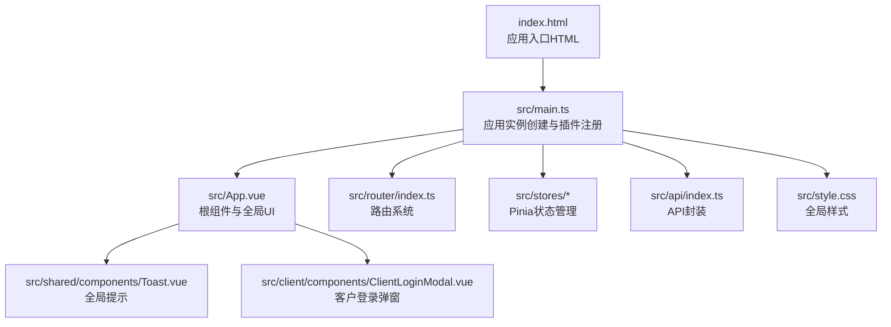
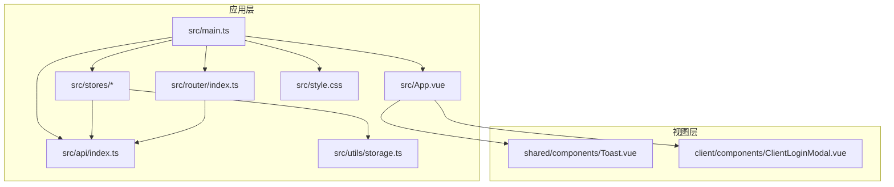
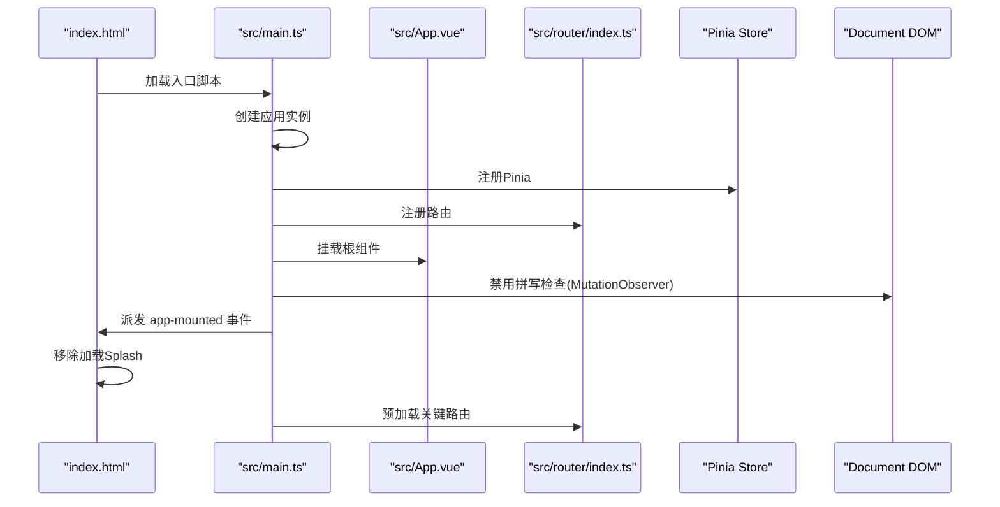
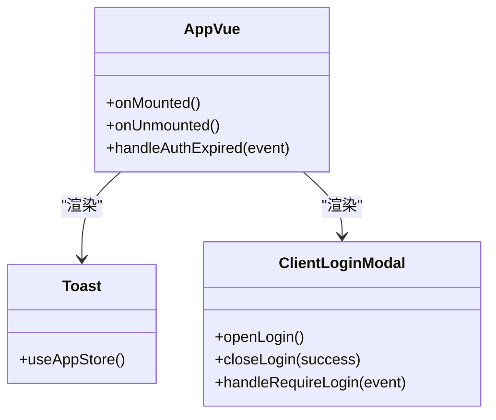
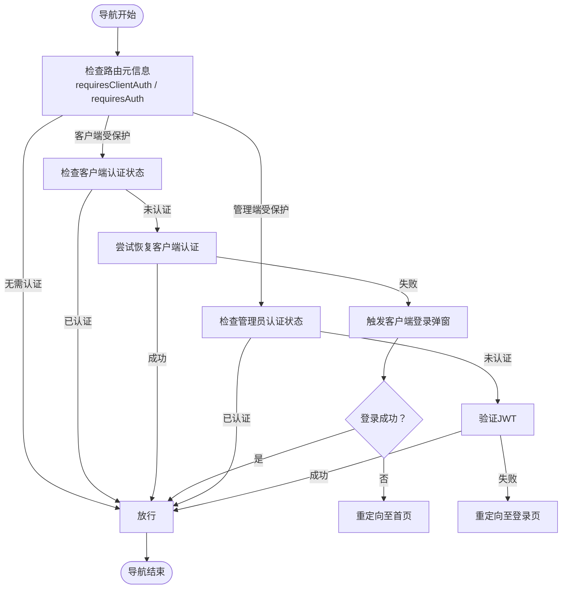
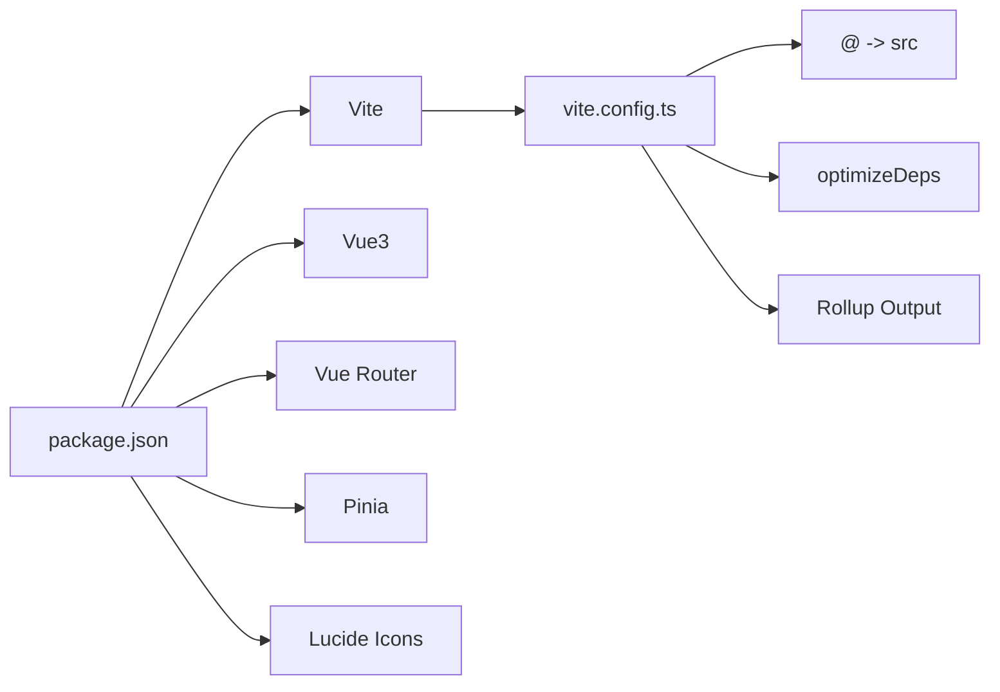

# Vue3应用结构

<cite>
**本文档引用的文件**
- [main.ts](file://src/main.ts)
- [App.vue](file://src/App.vue)
- [style.css](file://src/style.css)
- [vite.config.ts](file://vite.config.ts)
- [package.json](file://package.json)
- [router/index.ts](file://src/router/index.ts)
- [stores/app.ts](file://src/stores/app.ts)
- [stores/auth.ts](file://src/stores/auth.ts)
- [stores/clientAuth.ts](file://src/stores/clientAuth.ts)
- [api/index.ts](file://src/api/index.ts)
- [utils/storage.ts](file://src/utils/storage.ts)
- [shared/components/Toast.vue](file://src/shared/components/Toast.vue)
- [client/components/ClientLoginModal.vue](file://src/client/components/ClientLoginModal.vue)
- [index.html](file://index.html)
</cite>

## 目录
1. [简介](#简介)
2. [项目结构](#项目结构)
3. [核心组件](#核心组件)
4. [架构总览](#架构总览)
5. [详细组件分析](#详细组件分析)
6. [依赖关系分析](#依赖关系分析)
7. [性能考虑](#性能考虑)
8. [故障排除指南](#故障排除指南)
9. [结论](#结论)

## 简介
本文件面向RLRMS的Vue3前端应用，系统性梳理应用入口配置、插件注册流程、根组件设计与组件层次结构、样式系统组织、初始化关键步骤（Pinia状态管理器与路由系统）、全局配置（拼写检查禁用与动态DOM观察器）、应用启动流程及性能优化建议。文档旨在帮助开发者快速理解并高效维护该应用。

## 项目结构
应用采用基于功能域的模块化组织：
- 应用入口与根组件：src/main.ts、src/App.vue
- 路由系统：src/router/index.ts
- 状态管理：src/stores 下的多个模块（app、auth、clientAuth等）
- API封装：src/api/index.ts
- 工具类：src/utils/storage.ts
- 样式系统：src/style.css
- 视图与组件：src/client、src/admin、src/shared
- 构建配置：vite.config.ts、package.json
- HTML模板：index.html

图表来源
- [index.html:1-79](file://index.html#L1-L79)
- [main.ts:1-37](file://src/main.ts#L1-L37)
- [App.vue:1-113](file://src/App.vue#L1-L113)
- [router/index.ts:1-317](file://src/router/index.ts#L1-L317)
- [api/index.ts:1-608](file://src/api/index.ts#L1-L608)
- [style.css:1-944](file://src/style.css#L1-L944)

章节来源
- [main.ts:1-37](file://src/main.ts#L1-L37)
- [router/index.ts:1-317](file://src/router/index.ts#L1-L317)
- [stores/app.ts:1-122](file://src/stores/app.ts#L1-L122)
- [stores/auth.ts:1-128](file://src/stores/auth.ts#L1-L128)
- [stores/clientAuth.ts:1-87](file://src/stores/clientAuth.ts#L1-L87)
- [api/index.ts:1-608](file://src/api/index.ts#L1-L608)
- [style.css:1-944](file://src/style.css#L1-L944)
- [index.html:1-79](file://index.html#L1-L79)

## 核心组件
- 应用入口与初始化：在入口文件中创建Vue应用实例，注册Pinia与路由，并挂载根组件；随后执行全局拼写检查禁用与动态DOM观察器、移除加载Splash等初始化逻辑。
- 根组件App.vue：统一承载页面切换动画、全局Toast与ClientLoginModal，监听认证过期事件并进行相应处理。
- 路由系统：支持客户端与管理端双栈路由，包含导航守卫、标题更新、权限校验、关键路由预加载与后续页面预取。
- Pinia状态管理：包含应用主题、加载状态、调试模式、全局Toast队列；以及管理员与客户端认证状态管理。
- API封装：统一请求、超时、401处理、缓存策略（stale-while-revalidate），并提供可取消请求能力。
- 样式系统：设计系统变量、深色主题、重置与通用样式、动画与过渡、无障碍与减少运动支持。
- 工具类：IndexedDB键值存储，用于持久化主题偏好等设置。

章节来源
- [main.ts:1-37](file://src/main.ts#L1-L37)
- [App.vue:1-113](file://src/App.vue#L1-L113)
- [router/index.ts:1-317](file://src/router/index.ts#L1-L317)
- [stores/app.ts:1-122](file://src/stores/app.ts#L1-L122)
- [stores/auth.ts:1-128](file://src/stores/auth.ts#L1-L128)
- [stores/clientAuth.ts:1-87](file://src/stores/clientAuth.ts#L1-L87)
- [api/index.ts:1-608](file://src/api/index.ts#L1-L608)
- [style.css:1-944](file://src/style.css#L1-L944)
- [utils/storage.ts:1-109](file://src/utils/storage.ts#L1-L109)

## 架构总览
应用采用“入口配置—插件注册—根组件—功能模块”的分层架构。入口负责应用生命周期与全局初始化；根组件负责全局UI与事件；路由与状态管理分别承担导航与数据流；API封装统一网络层；样式系统提供一致的视觉与交互体验。

图表来源
- [main.ts:1-37](file://src/main.ts#L1-L37)
- [App.vue:1-113](file://src/App.vue#L1-L113)
- [router/index.ts:1-317](file://src/router/index.ts#L1-L317)
- [stores/app.ts:1-122](file://src/stores/app.ts#L1-L122)
- [stores/auth.ts:1-128](file://src/stores/auth.ts#L1-L128)
- [stores/clientAuth.ts:1-87](file://src/stores/clientAuth.ts#L1-L87)
- [api/index.ts:1-608](file://src/api/index.ts#L1-L608)
- [style.css:1-944](file://src/style.css#L1-L944)
- [utils/storage.ts:1-109](file://src/utils/storage.ts#L1-L109)
- [shared/components/Toast.vue:1-138](file://src/shared/components/Toast.vue#L1-L138)
- [client/components/ClientLoginModal.vue:1-351](file://src/client/components/ClientLoginModal.vue#L1-L351)

## 详细组件分析

### 应用入口与初始化流程
- 应用实例创建与插件注册：创建Vue应用实例，注册Pinia与路由，最后挂载根节点。
- 全局拼写检查禁用：遍历现有input/textarea元素并禁用拼写检查，同时通过MutationObserver监听新增节点，确保动态插入的输入框也禁用拼写检查。
- 动态DOM观察器：持续观察document.body的子节点变更，对新增节点递归应用拼写检查禁用策略。
- 加载Splash移除：在应用挂载后派发自定义事件，HTML模板中监听该事件并渐隐移除加载Splash。
- 关键路由预加载：应用初始化后在浏览器空闲时预加载关键路由组件，提升首屏与关键路径体验。

图表来源
- [main.ts:1-37](file://src/main.ts#L1-L37)
- [index.html:1-79](file://index.html#L1-L79)
- [router/index.ts:23-40](file://src/router/index.ts#L23-L40)

章节来源
- [main.ts:1-37](file://src/main.ts#L1-L37)
- [index.html:64-76](file://index.html#L64-L76)

### 根组件App.vue设计理念与组件层次
- 页面切换动画：通过RouterView与Transition实现页面进入/离开的平滑过渡，使用CSS变量控制动画时长与缓动。
- 全局事件处理：监听认证过期事件，区分管理端与客户端路径，分别进行登出或弹窗登录处理。
- 全局UI组件：引入Toast与ClientLoginModal，统一消息提示与登录交互。
- 组件层次：根组件作为容器，内部组合全局提示与登录弹窗，通过事件驱动实现跨组件通信。

图表来源
- [App.vue:1-113](file://src/App.vue#L1-L113)
- [shared/components/Toast.vue:1-138](file://src/shared/components/Toast.vue#L1-L138)
- [client/components/ClientLoginModal.vue:1-351](file://src/client/components/ClientLoginModal.vue#L1-L351)

章节来源
- [App.vue:1-113](file://src/App.vue#L1-L113)
- [shared/components/Toast.vue:1-138](file://src/shared/components/Toast.vue#L1-L138)
- [client/components/ClientLoginModal.vue:1-351](file://src/client/components/ClientLoginModal.vue#L1-L351)

### 样式系统组织方式
- 设计系统变量：集中定义颜色、字体、间距、圆角、阴影、动画时长与缓动函数，支持浅色/深色主题切换。
- 深色主题：通过data-theme属性切换，提供暗色系配色与组件特定样式覆盖。
- 重置与通用样式：统一盒模型、字体、链接、按钮、输入框等基础样式。
- 动画与过渡：提供丰富的动画关键帧与实用类，支持Edge兼容与减少运动支持。
- 辅助类：容器、sr-only等通用样式类，提升可访问性与复用性。

章节来源
- [style.css:1-944](file://src/style.css#L1-L944)

### Pinia状态管理器与路由系统注册
- Pinia注册：在入口文件中创建并注册Pinia，随后在各store中定义状态、计算属性与方法。
- 应用状态：主题、加载状态、调试模式、Toast队列等。
- 认证状态：
  - 管理员：设置用户信息、启动会话保活定时器、监听过期事件并触发全局事件。
  - 客户端：尝试恢复登录、设置用户信息、登出与清理会话。
- 路由系统：
  - 双栈路由：客户端与管理端路由分离，支持嵌套路由与通配符。
  - 导航守卫：更新文档标题、校验客户端/管理员权限、处理登录弹窗与重定向。
  - 预加载与预取：关键路由组件预加载与导航后相关页面预取，提升性能。

图表来源
- [router/index.ts:202-277](file://src/router/index.ts#L202-L277)

章节来源
- [stores/app.ts:1-122](file://src/stores/app.ts#L1-L122)
- [stores/auth.ts:1-128](file://src/stores/auth.ts#L1-L128)
- [stores/clientAuth.ts:1-87](file://src/stores/clientAuth.ts#L1-L87)
- [router/index.ts:1-317](file://src/router/index.ts#L1-L317)

### 全局配置选项与动态DOM观察器
- 拼写检查禁用：对所有input/textarea元素禁用拼写检查与自动纠错，确保移动端输入体验。
- 动态DOM观察器：MutationObserver监听document.body的子节点变更，对新增节点递归应用拼写检查禁用策略，保证异步渲染内容的一致性。
- 加载Splash移除：应用挂载后派发事件，HTML模板中监听并渐隐移除加载Splash，改善首屏体验。

章节来源
- [main.ts:14-34](file://src/main.ts#L14-L34)
- [index.html:66-76](file://index.html#L66-L76)

### 应用启动流程详解
- HTML加载：index.html提供占位容器与加载Splash，注入主题初始化脚本。
- 入口脚本：main.ts创建应用、注册插件、挂载根组件。
- 初始化任务：禁用拼写检查、建立DOM观察器、移除加载Splash、预加载关键路由。
- 运行时交互：路由守卫根据权限与状态决定导航行为，状态管理协调认证与UI反馈。

章节来源
- [index.html:1-79](file://index.html#L1-L79)
- [main.ts:1-37](file://src/main.ts#L1-L37)
- [router/index.ts:23-40](file://src/router/index.ts#L23-L40)

## 依赖关系分析
- 构建与打包：Vite配置启用Vue插件、路径别名、依赖预构建、生产环境代码分割与资源命名策略。
- 依赖管理：package.json声明Vue3、Vue Router、Pinia、Lucide图标库等核心依赖。
- 开发与运行：提供开发服务器、构建脚本与生产环境启动命令。

图表来源
- [package.json:1-64](file://package.json#L1-L64)
- [vite.config.ts:1-112](file://vite.config.ts#L1-L112)

章节来源
- [package.json:1-64](file://package.json#L1-L64)
- [vite.config.ts:1-112](file://vite.config.ts#L1-L112)

## 性能考虑
- 代码分割与懒加载：路由按需加载组件，Vite配置手动拆分vendor与图标库chunk，提升缓存命中率与Tree Shaking效果。
- 预加载与预取：关键路由组件在空闲时预加载，导航后根据目标路由预取相关页面，降低感知延迟。
- 构建优化：生产环境启用esbuild压缩、禁用source map、合理chunk大小限制，减少包体积。
- 网络层优化：API封装内置stale-while-revalidate缓存策略，减少重复请求；超时控制与可取消请求，提升稳定性。
- 样式与动画：统一动画时长与缓动，减少不必要的重绘与回流；Edge兼容与减少运动支持，兼顾性能与体验。

章节来源
- [vite.config.ts:63-112](file://vite.config.ts#L63-L112)
- [router/index.ts:23-40](file://src/router/index.ts#L23-L40)
- [router/index.ts:283-314](file://src/router/index.ts#L283-L314)
- [api/index.ts:1-608](file://src/api/index.ts#L1-L608)
- [style.css:1-944](file://src/style.css#L1-L944)

## 故障排除指南
- 认证过期处理：
  - 管理端：收到401时清空会话并跳转登录页，同时Toast提示。
  - 客户端：清除本地会话并触发登录弹窗，提示重新登录。
- 登录弹窗交互：监听“require-login”事件打开弹窗，登录成功/取消分别派发对应事件，供路由守卫处理。
- API错误处理：统一捕获非JSON响应、401未授权与业务错误，抛出自定义ApiError并携带状态与数据。
- 主题与存储：主题偏好通过IndexedDB持久化，若初始化失败会重试；系统主题变化时自动同步生效主题。

章节来源
- [App.vue:16-39](file://src/App.vue#L16-L39)
- [client/components/ClientLoginModal.vue:90-104](file://src/client/components/ClientLoginModal.vue#L90-L104)
- [api/index.ts:94-114](file://src/api/index.ts#L94-L114)
- [utils/storage.ts:1-109](file://src/utils/storage.ts#L1-L109)

## 结论
该Vue3应用通过清晰的入口配置、完善的插件注册、统一的根组件设计与模块化的功能域划分，实现了良好的可维护性与扩展性。结合Pinia状态管理、Vue Router导航守卫、API封装与样式系统，形成了从UI到数据流再到网络层的完整闭环。配合Vite构建优化与路由预加载策略，整体具备优秀的性能表现与用户体验。建议在后续迭代中持续关注缓存策略、错误边界与可访问性细节，进一步提升稳定性与包容性。