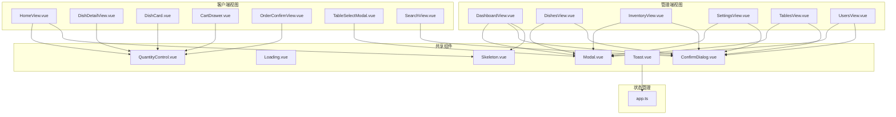
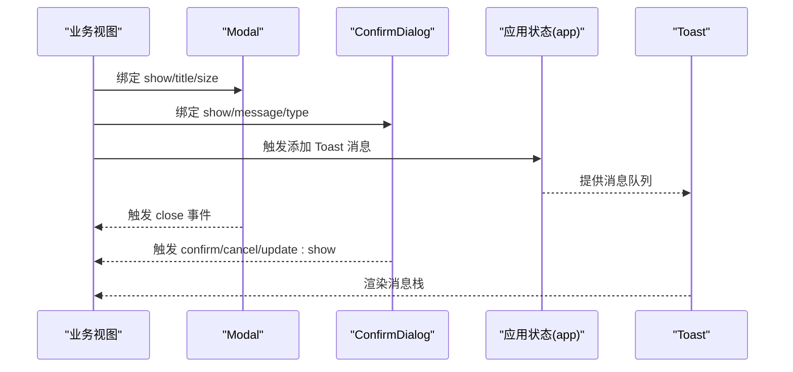
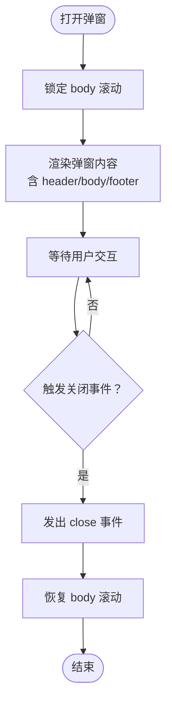
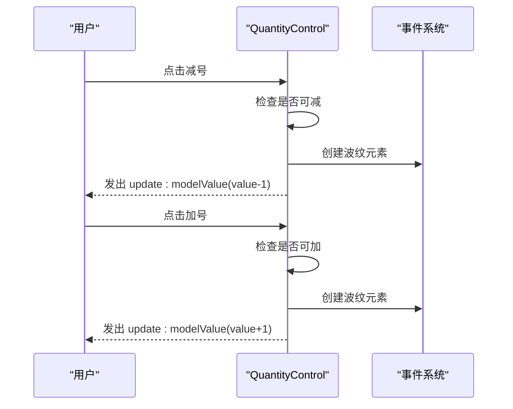
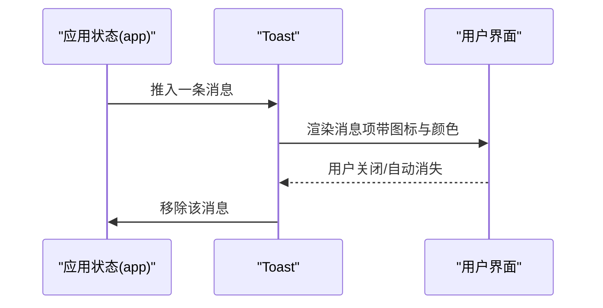
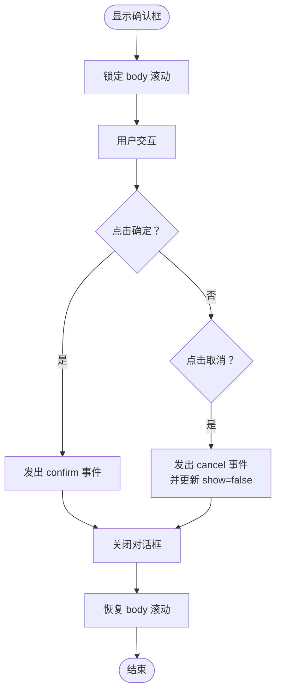
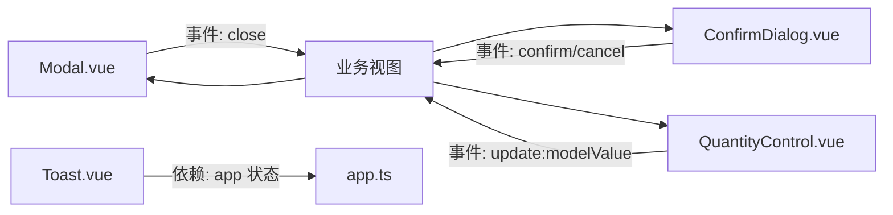

# UI组件

<cite>
**本文引用的文件**
- [Modal.vue](file://src/shared/components/Modal.vue)
- [Loading.vue](file://src/shared/components/Loading.vue)
- [QuantityControl.vue](file://src/shared/components/QuantityControl.vue)
- [Skeleton.vue](file://src/shared/components/Skeleton.vue)
- [Toast.vue](file://src/shared/components/Toast.vue)
- [ConfirmDialog.vue](file://src/shared/components/ConfirmDialog.vue)
- [App.vue](file://src/App.vue)
- [CartDrawer.vue](file://src/client/components/CartDrawer.vue)
- [DishCard.vue](file://src/client/components/DishCard.vue)
- [DishDetailView.vue](file://src/client/views/DishDetailView.vue)
- [HomeView.vue](file://src/client/views/HomeView.vue)
- [OrderConfirmView.vue](file://src/client/views/OrderConfirmView.vue)
- [DashboardView.vue](file://src/admin/views/DashboardView.vue)
- [DishesView.vue](file://src/admin/views/DishesView.vue)
- [InventoryView.vue](file://src/admin/views/InventoryView.vue)
- [SettingsView.vue](file://src/admin/views/SettingsView.vue)
- [TablesView.vue](file://src/admin/views/TablesView.vue)
- [UsersView.vue](file://src/admin/views/UsersView.vue)
- [TableSelectModal.vue](file://src/client/components/TableSelectModal.vue)
- [SearchView.vue](file://src/client/views/SearchView.vue)
- [app.ts](file://src/stores/app.ts)
</cite>

## 目录
1. [简介](#简介)
2. [项目结构](#项目结构)
3. [核心组件](#核心组件)
4. [架构总览](#架构总览)
5. [详细组件分析](#详细组件分析)
6. [依赖分析](#依赖分析)
7. [性能考虑](#性能考虑)
8. [故障排查指南](#故障排查指南)
9. [结论](#结论)
10. [附录](#附录)

## 简介
本文件为 RLRMS 的共享 UI 组件技术文档，覆盖以下组件的设计理念与实现细节：
- 弹窗组件（Modal）：模态框管理、尺寸与标题控制、可关闭性、插槽布局与动画过渡
- 加载组件（Loading）：旋转指示器与文本提示、尺寸规格
- 数量控制组件（QuantityControl）：增减按钮、数值范围限制、波纹点击反馈与数字弹跳动画
- 骨架屏组件（Skeleton）：占位元素类型、尺寸与圆角、渐变闪烁动画与无障碍适配
- 全局提示组件（Toast）：消息栈管理、类型化图标与颜色、进入/离开动画
- 确认对话框（ConfirmDialog）：危险/警告/主色按钮风格、确认/取消事件与背景滚动控制

文档同时提供各组件的属性定义、事件与插槽、样式定制要点、使用示例路径、最佳实践与性能优化建议，并分析组件间协作与复用策略。

## 项目结构
共享 UI 组件集中于 src/shared/components，采用按功能分层的组织方式：
- 组件层：各通用 UI 组件（Modal、Loading、QuantityControl、Skeleton、Toast、ConfirmDialog）
- 视图层：业务视图通过动态导入或直接引入组件进行组合使用
- 状态层：Toast 通过全局应用状态管理队列，其他组件多为纯展示/交互型

图表来源
- [Modal.vue](file://src/shared/components/Modal.vue)
- [QuantityControl.vue](file://src/shared/components/QuantityControl.vue)
- [Skeleton.vue](file://src/shared/components/Skeleton.vue)
- [Toast.vue](file://src/shared/components/Toast.vue)
- [ConfirmDialog.vue](file://src/shared/components/ConfirmDialog.vue)
- [HomeView.vue](file://src/client/views/HomeView.vue)
- [DishDetailView.vue](file://src/client/views/DishDetailView.vue)
- [DishCard.vue](file://src/client/components/DishCard.vue)
- [CartDrawer.vue](file://src/client/components/CartDrawer.vue)
- [OrderConfirmView.vue](file://src/client/views/OrderConfirmView.vue)
- [TableSelectModal.vue](file://src/client/components/TableSelectModal.vue)
- [DashboardView.vue](file://src/admin/views/DashboardView.vue)
- [DishesView.vue](file://src/admin/views/DishesView.vue)
- [InventoryView.vue](file://src/admin/views/InventoryView.vue)
- [SettingsView.vue](file://src/admin/views/SettingsView.vue)
- [TablesView.vue](file://src/admin/views/TablesView.vue)
- [UsersView.vue](file://src/admin/views/UsersView.vue)
- [SearchView.vue](file://src/client/views/SearchView.vue)
- [app.ts](file://src/stores/app.ts)

章节来源
- [Modal.vue](file://src/shared/components/Modal.vue)
- [QuantityControl.vue](file://src/shared/components/QuantityControl.vue)
- [Skeleton.vue](file://src/shared/components/Skeleton.vue)
- [Toast.vue](file://src/shared/components/Toast.vue)
- [ConfirmDialog.vue](file://src/shared/components/ConfirmDialog.vue)
- [HomeView.vue](file://src/client/views/HomeView.vue)
- [DishDetailView.vue](file://src/client/views/DishDetailView.vue)
- [DishCard.vue](file://src/client/components/DishCard.vue)
- [CartDrawer.vue](file://src/client/components/CartDrawer.vue)
- [OrderConfirmView.vue](file://src/client/views/OrderConfirmView.vue)
- [TableSelectModal.vue](file://src/client/components/TableSelectModal.vue)
- [DashboardView.vue](file://src/admin/views/DashboardView.vue)
- [DishesView.vue](file://src/admin/views/DishesView.vue)
- [InventoryView.vue](file://src/admin/views/InventoryView.vue)
- [SettingsView.vue](file://src/admin/views/SettingsView.vue)
- [TablesView.vue](file://src/admin/views/TablesView.vue)
- [UsersView.vue](file://src/admin/views/UsersView.vue)
- [SearchView.vue](file://src/client/views/SearchView.vue)
- [app.ts](file://src/stores/app.ts)

## 核心组件
本节对六个共享组件进行概览，包含职责、关键属性、事件与插槽、样式定制点及典型使用场景。

- Modal（弹窗）
  - 属性：show（必填）、title、closable、size（sm/md/lg）
  - 事件：close
  - 插槽：默认插槽（主体内容）、footer（页脚）
  - 行为：打开时锁定背景滚动；支持 Teleport 至 body；带进入/离开动画
  - 典型使用：管理端多处表单/详情弹窗、客户端菜品详情弹窗

- Loading（加载）
  - 属性：size（sm/md/lg）、text
  - 行为：中心化显示旋转指示器与文本；尺寸规格不同，指示器大小随之变化
  - 典型使用：列表/卡片加载、异步请求等待

- QuantityControl（数量控制）
  - 属性：modelValue（必填）、min、max、size（sm/md）
  - 事件：update:modelValue
  - 行为：增减按钮禁用态控制、波纹点击反馈、数值变化时数字弹跳动画
  - 典型使用：购物车/点餐数量调整

- Skeleton（骨架屏）
  - 属性：variant（text/circle/rect/card）、width、height、animated、radius
  - 行为：根据 variant 生成占位形状；支持动画与无障碍降敏；默认尺寸规则
  - 典型使用：数据加载前的占位渲染

- Toast（全局提示）
  - 行为：基于全局状态队列渲染；按类型选择图标与颜色；进入/离开动画
  - 典型使用：全局成功/错误/信息提示

- ConfirmDialog（确认对话框）
  - 属性：show（必填）、title、message、confirmText、cancelText、type（danger/warning/primary）
  - 事件：confirm、cancel、update:show
  - 行为：打开时锁定背景滚动；根据 type 切换按钮样式；带进入/离开动画
  - 典型使用：删除/危险操作确认

章节来源
- [Modal.vue](file://src/shared/components/Modal.vue)
- [Loading.vue](file://src/shared/components/Loading.vue)
- [QuantityControl.vue](file://src/shared/components/QuantityControl.vue)
- [Skeleton.vue](file://src/shared/components/Skeleton.vue)
- [Toast.vue](file://src/shared/components/Toast.vue)
- [ConfirmDialog.vue](file://src/shared/components/ConfirmDialog.vue)

## 架构总览
组件间协作关系与数据流如下：

图表来源
- [Modal.vue](file://src/shared/components/Modal.vue)
- [ConfirmDialog.vue](file://src/shared/components/ConfirmDialog.vue)
- [Toast.vue](file://src/shared/components/Toast.vue)
- [app.ts](file://src/stores/app.ts)

## 详细组件分析

### Modal（弹窗）
- 设计理念
  - 通过 Teleport 将内容挂载到 body，避免层级与定位问题
  - 使用 Transition 实现进入/离开动画，增强交互体验
  - 支持 header/footer 插槽，满足多样布局需求
- 关键实现
  - 响应式控制 show，切换时锁定/恢复 body 滚动
  - size 控制最大宽度；closable 控制是否显示关闭按钮
  - 支持 footer 插槽，便于放置操作按钮
- 属性与事件
  - 属性：show（布尔）、title（字符串）、closable（布尔，默认true）、size（枚举：sm/md/lg，默认md）
  - 事件：close（无参）
  - 插槽：默认插槽（主体内容）、footer（页脚）
- 样式定制
  - 可通过自定义 CSS 变量覆盖主题变量（如颜色、阴影、圆角、间距）
  - 支持通过类名扩展（如在父级容器上追加额外样式）
- 使用示例路径
  - 管理端多处视图通过 defineAsyncComponent 动态引入并使用
  - 客户端 TableSelectModal 中直接引入并使用
- 最佳实践
  - 打开时务必设置 show=true，关闭时设置 show=false 或触发 close 事件
  - 对长内容使用 footer 插槽承载操作按钮
  - 避免在弹窗内嵌套复杂滚动容器，以免与整体滚动锁定冲突
- 性能优化
  - 使用 Teleport 减少 DOM 深度带来的重绘压力
  - 合理设置 size，避免过大导致渲染成本上升

图表来源
- [Modal.vue](file://src/shared/components/Modal.vue)

章节来源
- [Modal.vue](file://src/shared/components/Modal.vue)
- [TableSelectModal.vue](file://src/client/components/TableSelectModal.vue)
- [DashboardView.vue](file://src/admin/views/DashboardView.vue)
- [DishesView.vue](file://src/admin/views/DishesView.vue)
- [InventoryView.vue](file://src/admin/views/InventoryView.vue)
- [SettingsView.vue](file://src/admin/views/SettingsView.vue)
- [TablesView.vue](file://src/admin/views/TablesView.vue)
- [UsersView.vue](file://src/admin/views/UsersView.vue)

### Loading（加载）
- 设计理念
  - 以简洁的旋转指示器与文本提示缓解等待焦虑
  - 通过 size 区分不同密度场景
- 关键实现
  - 三档尺寸：sm/md/lg，对应不同的指示器尺寸与内边距
  - 文本可选，默认“加载中...”
- 属性与行为
  - 属性：size（枚举：sm/md/lg，默认md）、text（字符串，默认“加载中...”）
- 样式定制
  - 可通过 CSS 变量覆盖颜色、字体大小等
- 使用示例路径
  - 列表/卡片加载占位、异步请求等待场景
- 最佳实践
  - 在长列表或网络较慢环境下优先使用 Loading
  - 配合 Skeleton 使用，先骨架后加载指示器
- 性能优化
  - 避免在高频刷新场景中频繁创建/销毁实例

章节来源
- [Loading.vue](file://src/shared/components/Loading.vue)

### QuantityControl（数量控制）
- 设计理念
  - 提供直观的数量增减交互，支持最小/最大值约束
  - 增强触控反馈（波纹）与数值变化动画，提升可用性
- 关键实现
  - 通过 modelValue 与 update:modelValue 实现双向绑定
  - 基于 min/max 计算增减按钮可用性
  - 点击时创建临时波纹元素，自动清理
  - 数值变化时触发动画
- 属性、事件与行为
  - 属性：modelValue（必填）、min（默认0）、max（默认99）、size（枚举：sm/md，默认md）
  - 事件：update:modelValue（参数为 number）
  - 插槽：无
- 样式定制
  - 可通过 CSS 变量覆盖背景、文字、边框与动画参数
  - sm/md 尺寸差异体现在按钮尺寸与字号
- 使用示例路径
  - DishCard、DishDetailView、CartDrawer、OrderConfirmView 等视图中均有使用
- 最佳实践
  - 为 modelValue 设置合理 min/max，避免溢出
  - 在小尺寸界面中优先使用 size="sm"
- 性能优化
  - 波纹元素在 600ms 后自动移除，避免内存泄漏
  - 数值动画仅在值变化时触发

图表来源
- [QuantityControl.vue](file://src/shared/components/QuantityControl.vue)

章节来源
- [QuantityControl.vue](file://src/shared/components/QuantityControl.vue)
- [DishCard.vue](file://src/client/components/DishCard.vue)
- [DishDetailView.vue](file://src/client/views/DishDetailView.vue)
- [CartDrawer.vue](file://src/client/components/CartDrawer.vue)
- [OrderConfirmView.vue](file://src/client/views/OrderConfirmView.vue)

### Skeleton（骨架屏）
- 设计理念
  - 在数据未就绪时提供占位，减少白屏时间，改善感知速度
  - 支持多种形状与动画，兼顾可访问性
- 关键实现
  - variant 决定形状：text/circle/rect/card
  - width/height/radius 支持显式尺寸与圆角
  - animated 控制是否启用闪烁动画；在 reduce motion 下自动降级
- 属性与行为
  - 属性：variant（枚举：text/circle/rect/card，默认rect）、width、height、animated（布尔，默认true）、radius
- 样式定制
  - 可通过 CSS 变量统一主题色与圆角
- 使用示例路径
  - 管理端 DashboardView 与客户端 HomeView 中广泛使用
- 最佳实践
  - 与 Loading 组合使用：Skeleton 先显示，Loading 后出现
  - 保持与真实内容一致的宽高比与圆角
- 性能优化
  - 动画在 reduce motion 下禁用，降低资源消耗

章节来源
- [Skeleton.vue](file://src/shared/components/Skeleton.vue)
- [DashboardView.vue](file://src/admin/views/DashboardView.vue)
- [HomeView.vue](file://src/client/views/HomeView.vue)

### Toast（全局提示）
- 设计理念
  - 基于全局状态队列渲染，统一管理提示消息，避免重复与冲突
  - 类型化图标与颜色，快速传达语义
- 关键实现
  - 通过 Teleport 渲染至 body，置于固定位置
  - 使用 TransitionGroup 实现消息栈的进入/离开动画
  - 图标与颜色按类型动态选择
- 属性与行为
  - 行为：由应用状态提供消息数组，组件遍历渲染
  - 依赖：应用状态模块（app.ts）
- 样式定制
  - 可通过 CSS 变量覆盖背景、边框、阴影与颜色
- 使用示例路径
  - App.vue 中直接引入并挂载
- 最佳实践
  - 为每条消息提供唯一 id，避免重复
  - 控制消息数量，避免堆叠过多影响阅读
- 性能优化
  - 使用 TransitionGroup 的 move 动画优化列表变更

图表来源
- [Toast.vue](file://src/shared/components/Toast.vue)
- [app.ts](file://src/stores/app.ts)
- [App.vue](file://src/App.vue)

章节来源
- [Toast.vue](file://src/shared/components/Toast.vue)
- [App.vue](file://src/App.vue)
- [app.ts](file://src/stores/app.ts)

### ConfirmDialog（确认对话框）
- 设计理念
  - 以明确的图标与按钮风格提示风险，引导用户谨慎操作
  - 支持三种类型（danger/warning/primary），对应不同视觉强调
- 关键实现
  - 通过 show 控制显示/隐藏；打开时锁定背景滚动
  - confirm/cancel 事件分别触发业务动作与状态更新
  - type 映射到按钮类名，实现风格切换
- 属性、事件与行为
  - 属性：show（必填）、title（默认“确认操作”）、message（必填）、confirmText、cancelText、type（枚举：danger/warning/primary，默认danger）
  - 事件：confirm、cancel、update:show
  - 插槽：无
- 样式定制
  - 可通过 CSS 变量覆盖图标背景色与按钮颜色
- 使用示例路径
  - 管理端多处视图与客户端 SearchView 中使用
- 最佳实践
  - 对破坏性操作（如删除）使用 danger 类型
  - message 应简明扼要，突出关键后果
- 性能优化
  - 与 Modal 类似，仅在需要时渲染，避免常驻 DOM

图表来源
- [ConfirmDialog.vue](file://src/shared/components/ConfirmDialog.vue)

章节来源
- [ConfirmDialog.vue](file://src/shared/components/ConfirmDialog.vue)
- [DashboardView.vue](file://src/admin/views/DashboardView.vue)
- [DishesView.vue](file://src/admin/views/DishesView.vue)
- [InventoryView.vue](file://src/admin/views/InventoryView.vue)
- [SettingsView.vue](file://src/admin/views/SettingsView.vue)
- [TablesView.vue](file://src/admin/views/TablesView.vue)
- [UsersView.vue](file://src/admin/views/UsersView.vue)
- [SearchView.vue](file://src/client/views/SearchView.vue)

## 依赖分析
- 组件内聚与耦合
  - Modal/ConfirmDialog：均依赖 Teleport 与 Transition，耦合于动画与滚动控制
  - QuantityControl：内部逻辑自足，依赖外部状态（如购物车/订单）驱动
  - Skeleton：纯展示组件，低耦合
  - Toast：依赖应用状态模块，形成单向数据流
- 外部依赖
  - 图标库（lucide-vue-next）：Modal 关闭按钮、Toast 图标、ConfirmDialog 图标
  - Vue 响应式系统：watch、computed、ref、defineEmits
- 循环依赖
  - 未发现循环依赖；组件间通过 props/事件通信

图表来源
- [Modal.vue](file://src/shared/components/Modal.vue)
- [ConfirmDialog.vue](file://src/shared/components/ConfirmDialog.vue)
- [QuantityControl.vue](file://src/shared/components/QuantityControl.vue)
- [Toast.vue](file://src/shared/components/Toast.vue)
- [app.ts](file://src/stores/app.ts)

章节来源
- [Modal.vue](file://src/shared/components/Modal.vue)
- [ConfirmDialog.vue](file://src/shared/components/ConfirmDialog.vue)
- [QuantityControl.vue](file://src/shared/components/QuantityControl.vue)
- [Toast.vue](file://src/shared/components/Toast.vue)
- [app.ts](file://src/stores/app.ts)

## 性能考虑
- 动画与过渡
  - Modal/ConfirmDialog/Toast 使用 CSS 动画与 Transform，尽量避免强制同步布局
  - 减少动画层级过深，避免过度合成
- DOM 结构
  - Teleport 将弹窗/提示挂载至 body，减少层级嵌套带来的重排
- 事件与计算
  - QuantityControl 的数值变化动画仅在值变化时触发，避免不必要的重绘
- 资源占用
  - Skeleton 在 reduce motion 下禁用动画，降低 CPU/GPU 占用
- 状态管理
  - Toast 通过状态队列管理消息，避免频繁创建/销毁 DOM

## 故障排查指南
- 弹窗无法关闭
  - 检查是否正确绑定 show 并在关闭时将其置为 false
  - 确认是否监听了 close 事件并执行相应逻辑
- 背景仍可滚动
  - 确保打开时设置 show=true，关闭时设置 show=false
  - 检查是否有多个弹窗同时打开导致状态覆盖
- 数量控制无效
  - 确认已使用 v-model 绑定 modelValue
  - 检查 min/max 设置是否导致按钮始终禁用
- 骨架屏不显示动画
  - 检查 animated 是否为 true
  - 确认系统偏好设置未启用 reduce motion
- 全局提示不显示
  - 确认已在 App.vue 中引入并挂载 Toast
  - 检查应用状态模块是否正确推送消息
- 确认对话框样式异常
  - 检查 type 是否为合法枚举值
  - 确认按钮类名映射正确

章节来源
- [Modal.vue](file://src/shared/components/Modal.vue)
- [ConfirmDialog.vue](file://src/shared/components/ConfirmDialog.vue)
- [QuantityControl.vue](file://src/shared/components/QuantityControl.vue)
- [Skeleton.vue](file://src/shared/components/Skeleton.vue)
- [Toast.vue](file://src/shared/components/Toast.vue)
- [App.vue](file://src/App.vue)
- [app.ts](file://src/stores/app.ts)

## 结论
RLRMS 的共享 UI 组件围绕“一致性、可复用、可维护”的目标设计，通过统一的属性体系、事件模型与样式变量，实现了跨视图的稳定交互体验。各组件职责清晰、耦合度低，配合状态管理与动态导入策略，既保证了开发效率，也兼顾了性能与可访问性。建议在后续迭代中持续完善类型定义与测试覆盖，进一步提升组件的健壮性与可扩展性。

## 附录
- 组件使用示例路径（部分）
  - 数量控制：DishCard、DishDetailView、CartDrawer、OrderConfirmView
  - 骨架屏：DashboardView、HomeView
  - 弹窗：TableSelectModal、多处管理端视图
  - 确认对话框：多处管理端视图与 SearchView
  - 全局提示：App.vue

章节来源
- [DishCard.vue](file://src/client/components/DishCard.vue)
- [DishDetailView.vue](file://src/client/views/DishDetailView.vue)
- [CartDrawer.vue](file://src/client/components/CartDrawer.vue)
- [OrderConfirmView.vue](file://src/client/views/OrderConfirmView.vue)
- [DashboardView.vue](file://src/admin/views/DashboardView.vue)
- [HomeView.vue](file://src/client/views/HomeView.vue)
- [TableSelectModal.vue](file://src/client/components/TableSelectModal.vue)
- [SearchView.vue](file://src/client/views/SearchView.vue)
- [App.vue](file://src/App.vue)