# 共享组件库

<cite>
**本文引用的文件**
- [ConfirmDialog.vue](file://src/shared/components/ConfirmDialog.vue)
- [Loading.vue](file://src/shared/components/Loading.vue)
- [Modal.vue](file://src/shared/components/Modal.vue)
- [QuantityControl.vue](file://src/shared/components/QuantityControl.vue)
- [Skeleton.vue](file://src/shared/components/Skeleton.vue)
- [Toast.vue](file://src/shared/components/Toast.vue)
- [useDragReorder.ts](file://src/shared/composables/useDragReorder.ts)
- [useOrderPolling.ts](file://src/shared/composables/useOrderPolling.ts)
- [useStaggeredAnimation.ts](file://src/shared/composables/useStaggeredAnimation.ts)
- [DishesView.vue](file://src/admin/views/DishesView.vue)
- [OrdersView.vue](file://src/client/views/OrdersView.vue)
- [style.css](file://src/style.css)
- [package.json](file://package.json)
</cite>

## 目录
1. [简介](#简介)
2. [项目结构](#项目结构)
3. [核心组件](#核心组件)
4. [架构总览](#架构总览)
5. [组件详解](#组件详解)
6. [依赖关系分析](#依赖关系分析)
7. [性能考量](#性能考量)
8. [故障排查指南](#故障排查指南)
9. [结论](#结论)
10. [附录](#附录)

## 简介
本文件系统化梳理 RLRMS 的共享组件库，覆盖通用弹窗、加载、数量控制、骨架屏与全局提示等基础 UI 组件，以及拖拽排序、订单轮询、交错动画等组合式函数。文档从设计原则、抽象层次、接口设计、使用场景、可定制性与主题支持、响应式设计、最佳实践、性能优化到扩展指南进行深入解析，帮助开发者高效复用与扩展。

## 项目结构
共享组件与组合式函数集中于 src/shared 目录，按“组件(components)”与“组合式函数(composables)”分层组织；样式系统通过全局 CSS 变量与暗色主题适配统一风格；部分页面示例展示了组件与组合式函数的实际使用方式。

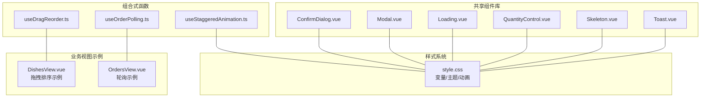

**图表来源**
- [ConfirmDialog.vue:1-200](file://src/shared/components/ConfirmDialog.vue#L1-L200)
- [Modal.vue:1-189](file://src/shared/components/Modal.vue#L1-L189)
- [Loading.vue:1-83](file://src/shared/components/Loading.vue#L1-L83)
- [QuantityControl.vue:1-212](file://src/shared/components/QuantityControl.vue#L1-L212)
- [Skeleton.vue:1-139](file://src/shared/components/Skeleton.vue#L1-L139)
- [Toast.vue:1-138](file://src/shared/components/Toast.vue#L1-L138)
- [useDragReorder.ts:1-109](file://src/shared/composables/useDragReorder.ts#L1-L109)
- [useOrderPolling.ts:1-74](file://src/shared/composables/useOrderPolling.ts#L1-L74)
- [useStaggeredAnimation.ts:1-80](file://src/shared/composables/useStaggeredAnimation.ts#L1-L80)
- [DishesView.vue:1-200](file://src/admin/views/DishesView.vue#L1-L200)
- [OrdersView.vue:1-200](file://src/client/views/OrdersView.vue#L1-L200)
- [style.css:1-944](file://src/style.css#L1-L944)

**章节来源**
- [ConfirmDialog.vue:1-200](file://src/shared/components/ConfirmDialog.vue#L1-L200)
- [Modal.vue:1-189](file://src/shared/components/Modal.vue#L1-L189)
- [Loading.vue:1-83](file://src/shared/components/Loading.vue#L1-L83)
- [QuantityControl.vue:1-212](file://src/shared/components/QuantityControl.vue#L1-L212)
- [Skeleton.vue:1-139](file://src/shared/components/Skeleton.vue#L1-L139)
- [Toast.vue:1-138](file://src/shared/components/Toast.vue#L1-L138)
- [useDragReorder.ts:1-109](file://src/shared/composables/useDragReorder.ts#L1-L109)
- [useOrderPolling.ts:1-74](file://src/shared/composables/useOrderPolling.ts#L1-L74)
- [useStaggeredAnimation.ts:1-80](file://src/shared/composables/useStaggeredAnimation.ts#L1-L80)
- [DishesView.vue:1-200](file://src/admin/views/DishesView.vue#L1-L200)
- [OrdersView.vue:1-200](file://src/client/views/OrdersView.vue#L1-L200)
- [style.css:1-944](file://src/style.css#L1-L944)

## 核心组件
- 弹窗与确认对话框：提供带 Teleport 的模态遮罩、过渡动画、可选标题与关闭按钮、类型化按钮样式。
- 加载指示器：支持尺寸与文本，内置旋转动画。
- 数量控制：带波纹点击反馈、数值变化弹跳动画、最小最大值限制。
- 骨架屏：多变体（文本/圆形/矩形/卡片）、尺寸与圆角可配置、可选闪烁动画。
- 全局提示：基于 Pinia Store 的消息栈，支持成功/错误/信息三类图标与颜色映射。
- 组合式函数：拖拽排序、订单轮询、交错动画，封装跨页面可复用交互逻辑。

**章节来源**
- [ConfirmDialog.vue:1-200](file://src/shared/components/ConfirmDialog.vue#L1-L200)
- [Modal.vue:1-189](file://src/shared/components/Modal.vue#L1-L189)
- [Loading.vue:1-83](file://src/shared/components/Loading.vue#L1-L83)
- [QuantityControl.vue:1-212](file://src/shared/components/QuantityControl.vue#L1-L212)
- [Skeleton.vue:1-139](file://src/shared/components/Skeleton.vue#L1-L139)
- [Toast.vue:1-138](file://src/shared/components/Toast.vue#L1-L138)
- [useDragReorder.ts:1-109](file://src/shared/composables/useDragReorder.ts#L1-L109)
- [useOrderPolling.ts:1-74](file://src/shared/composables/useOrderPolling.ts#L1-L74)
- [useStaggeredAnimation.ts:1-80](file://src/shared/composables/useStaggeredAnimation.ts#L1-L80)

## 架构总览
共享组件库采用“组件 + 组合式函数”的分层架构：
- 组件层：以 Vue 单文件组件形式提供 UI 原子能力，统一使用 CSS 变量与主题系统，保证视觉一致性。
- 组合式函数层：封装横切关注点（拖拽、轮询、动画），通过参数化配置与事件回调解耦业务。
- 视图层：在具体页面中按需引入组件与组合式函数，形成一致的交互体验。

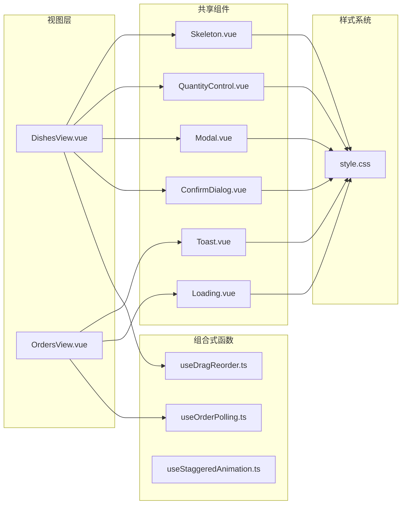

**图表来源**
- [DishesView.vue:1-200](file://src/admin/views/DishesView.vue#L1-L200)
- [OrdersView.vue:1-200](file://src/client/views/OrdersView.vue#L1-L200)
- [ConfirmDialog.vue:1-200](file://src/shared/components/ConfirmDialog.vue#L1-L200)
- [Modal.vue:1-189](file://src/shared/components/Modal.vue#L1-L189)
- [Loading.vue:1-83](file://src/shared/components/Loading.vue#L1-L83)
- [QuantityControl.vue:1-212](file://src/shared/components/QuantityControl.vue#L1-L212)
- [Skeleton.vue:1-139](file://src/shared/components/Skeleton.vue#L1-L139)
- [Toast.vue:1-138](file://src/shared/components/Toast.vue#L1-L138)
- [useDragReorder.ts:1-109](file://src/shared/composables/useDragReorder.ts#L1-L109)
- [useOrderPolling.ts:1-74](file://src/shared/composables/useOrderPolling.ts#L1-L74)
- [useStaggeredAnimation.ts:1-80](file://src/shared/composables/useStaggeredAnimation.ts#L1-L80)
- [style.css:1-944](file://src/style.css#L1-L944)

## 组件详解

### 弹窗组件（Modal）
- 设计要点
  - 通过 Teleport 将内容挂载至 body，避免层级与滚动问题。
  - 支持标题、可关闭、三种尺寸，头部包含关闭按钮与插槽 footer。
  - 过渡动画采用进入/离开不同缓动曲线，提升交互质感。
  - 打开时锁定 body 滚动，关闭时恢复。
- 接口与行为
  - 属性：show、title、closable、size。
  - 事件：close。
  - 插槽：默认插槽承载主体内容，footer 插槽承载底部操作区。
- 主题与响应式
  - 使用 CSS 变量控制背景、边框、阴影、圆角与间距；尺寸类名控制最大宽度。
  - 在暗色主题下自动适配颜色变量。
- 使用场景
  - 表单编辑、详情展示、设置面板、二次确认等。

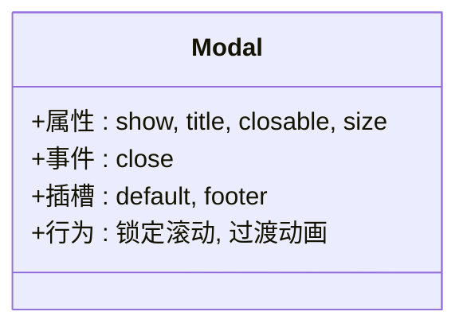

**图表来源**
- [Modal.vue:1-189](file://src/shared/components/Modal.vue#L1-L189)

**章节来源**
- [Modal.vue:1-189](file://src/shared/components/Modal.vue#L1-L189)
- [style.css:1-944](file://src/style.css#L1-L944)

### 确认对话框（ConfirmDialog）
- 设计要点
  - 类型化按钮（danger/warning/primary），图标随类型变化。
  - 打开时锁定 body 滚动，关闭时释放。
  - 支持自定义标题、消息与按钮文案。
- 接口与行为
  - 属性：show、title、message、confirmText、cancelText、type。
  - 事件：confirm、cancel、update:show。
- 主题与响应式
  - 使用 CSS 变量与类名切换实现类型态样式；尺寸与间距由变量控制。
- 使用场景
  - 删除、危险操作确认、重要变更提示。

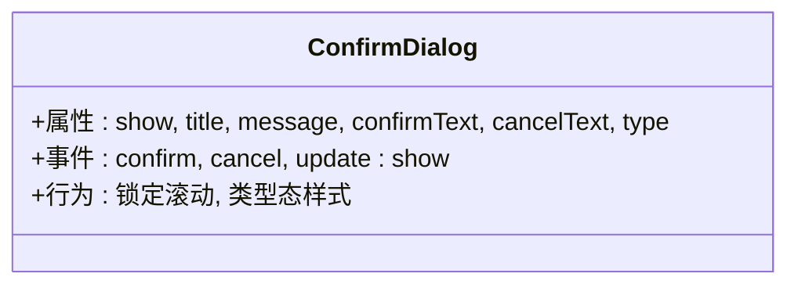

**图表来源**
- [ConfirmDialog.vue:1-200](file://src/shared/components/ConfirmDialog.vue#L1-L200)

**章节来源**
- [ConfirmDialog.vue:1-200](file://src/shared/components/ConfirmDialog.vue#L1-L200)
- [style.css:1-944](file://src/style.css#L1-L944)

### 加载指示器（Loading）
- 设计要点
  - 支持 sm/md/lg 三种尺寸，内置旋转动画。
  - 文本可选，便于在不同布局中使用。
- 接口与行为
  - 属性：size、text。
- 主题与响应式
  - 通过 CSS 变量控制环形边框颜色与尺寸；容器使用列布局与间距变量。
- 使用场景
  - 页面初始化、请求中、列表加载更多等。

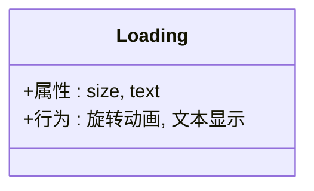

**图表来源**
- [Loading.vue:1-83](file://src/shared/components/Loading.vue#L1-L83)

**章节来源**
- [Loading.vue:1-83](file://src/shared/components/Loading.vue#L1-L83)
- [style.css:1-944](file://src/style.css#L1-L944)

### 数量控制（QuantityControl）
- 设计要点
  - 双按钮增减，禁用态不可点击；数值变化触发波纹与弹跳动画。
  - 通过 min/max 控制范围；支持 sm/md 尺寸。
- 接口与行为
  - 属性：modelValue、min、max、size。
  - 事件：update:modelValue。
  - 内部逻辑：计算可增减状态、创建波纹元素、数值变化动画。
- 主题与响应式
  - 使用 CSS 变量控制背景、文字与悬停/激活态；波纹与数字弹跳动画使用变量时长与缓动。
- 使用场景
  - 购物车数量、菜品份数、库存调整等。

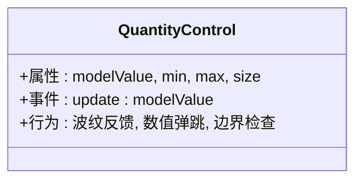

**图表来源**
- [QuantityControl.vue:1-212](file://src/shared/components/QuantityControl.vue#L1-L212)

**章节来源**
- [QuantityControl.vue:1-212](file://src/shared/components/QuantityControl.vue#L1-L212)
- [style.css:1-944](file://src/style.css#L1-L944)

### 骨架屏（Skeleton）
- 设计要点
  - 多变体：text/circle/rect/card；可配置宽高与圆角。
  - 支持动画或静态；在减少运动偏好下自动降级。
- 接口与行为
  - 属性：variant、width、height、animated、radius。
  - 计算样式与类名，根据属性动态生成内联样式与类集合。
- 主题与响应式
  - 使用 CSS 变量作为背景与渐变动效；在减少运动模式下移除动画。
- 使用场景
  - 列表/卡片加载占位、首屏骨架、异步数据渲染前的占位。

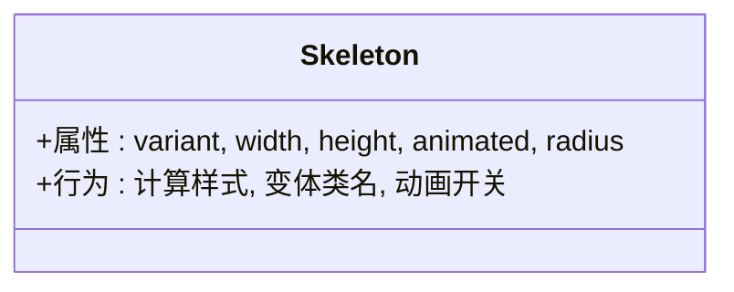

**图表来源**
- [Skeleton.vue:1-139](file://src/shared/components/Skeleton.vue#L1-L139)

**章节来源**
- [Skeleton.vue:1-139](file://src/shared/components/Skeleton.vue#L1-L139)
- [style.css:1-944](file://src/style.css#L1-L944)

### 全局提示（Toast）
- 设计要点
  - 基于 Pinia Store 的消息队列，Teleport 渲染至 body。
  - 三类图标与颜色映射；使用 TransitionGroup 实现堆叠动画。
- 接口与行为
  - 通过 store.toasts 驱动渲染；支持成功/错误/信息类型。
- 主题与响应式
  - 使用 CSS 变量控制背景、边框、阴影与颜色；在减少运动模式下降级动画。
- 使用场景
  - 操作结果反馈、错误提示、系统通知。

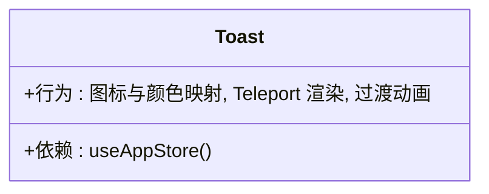

**图表来源**
- [Toast.vue:1-138](file://src/shared/components/Toast.vue#L1-L138)

**章节来源**
- [Toast.vue:1-138](file://src/shared/components/Toast.vue#L1-L138)
- [style.css:1-944](file://src/style.css#L1-L944)

## 组件详解

### 组合式函数：拖拽排序（useDragReorder）
- 设计理念
  - 将拖拽状态管理与持久化保存分离，通过 onReorder 回调交由上层决定如何提交顺序。
  - 通过 dataTransfer 简化浏览器兼容性处理，提供拖拽/放置过程中的视觉反馈。
- 接口与行为
  - 输入：items（Ref<T[]>）、onReorder（Promise<void>）。
  - 输出：拖拽索引、放置索引、拖拽状态、保存状态与一系列事件处理器。
  - 流程：开始拖拽 -> 拖拽经过 -> 放置 -> 重排列表 -> 计算新序号 -> 调用 onReorder -> 更新状态。
- 性能与健壮性
  - 仅在必要时重排数组；异常捕获防止中断 UI；isSaving 标记避免重复提交。
- 使用场景
  - 列表排序、菜品排序、分类排序等。

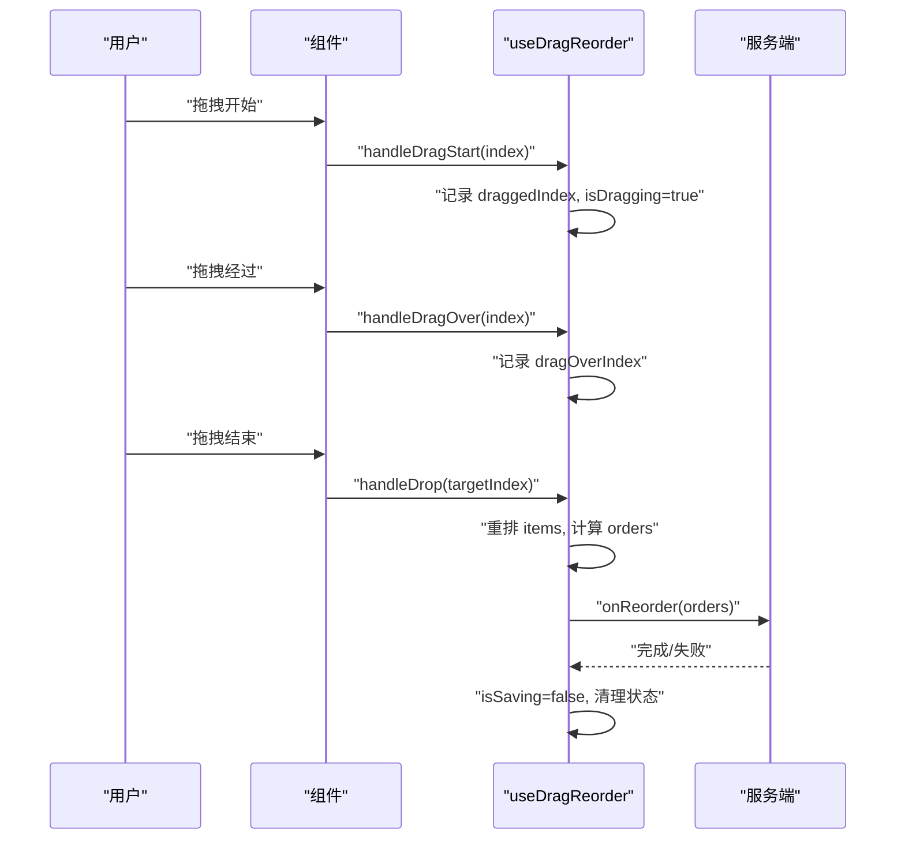

**图表来源**
- [useDragReorder.ts:1-109](file://src/shared/composables/useDragReorder.ts#L1-L109)

**章节来源**
- [useDragReorder.ts:1-109](file://src/shared/composables/useDragReorder.ts#L1-L109)
- [DishesView.vue:69-101](file://src/admin/views/DishesView.vue#L69-L101)

### 组合式函数：订单轮询（useOrderPolling）
- 设计理念
  - 抽象轮询周期、可见性暂停/恢复、新增订单检测与回调，屏蔽定时器生命周期细节。
  - 支持 shouldPoll 条件跳过轮询（如 SSE 已连接时）。
- 接口与行为
  - 输入：fetchFunction（每次轮询执行）、options（interval、onNewOrder、shouldPoll）。
  - 输出：isPolling、startPolling、stopPolling、checkForNewOrders。
  - 生命周期：onMounted 启动，监听 visibilitychange 自动暂停/恢复。
- 使用场景
  - 订单状态实时更新、后台订单推送、活动倒计时等。

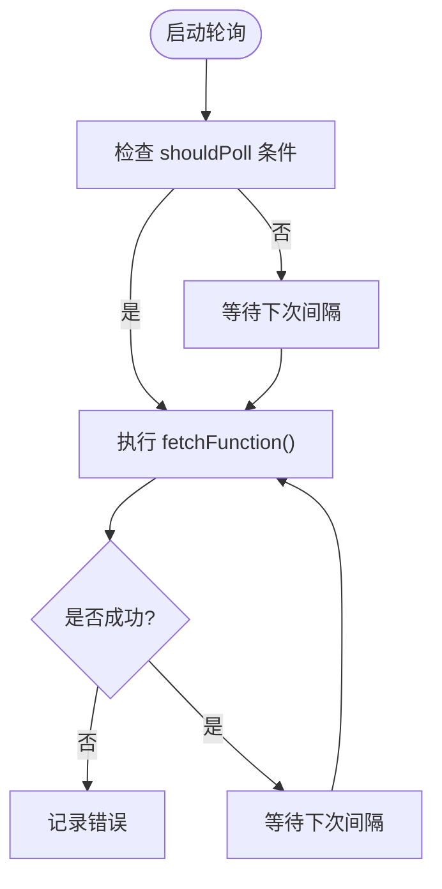

**图表来源**
- [useOrderPolling.ts:1-74](file://src/shared/composables/useOrderPolling.ts#L1-L74)

**章节来源**
- [useOrderPolling.ts:1-74](file://src/shared/composables/useOrderPolling.ts#L1-L74)
- [OrdersView.vue:77-136](file://src/client/views/OrdersView.vue#L77-L136)

### 组合式函数：交错动画（useStaggeredAnimation）
- 设计理念
  - 为列表项生成带延迟的动画样式与类名，支持最大交错数循环，配合 TransitionGroup 实现流畅进入/移动/离开。
- 接口与行为
  - 输入：list（MaybeRef<T[]>）、options（delay、maxStagger）。
  - 输出：ComputedRef<AnimatedListItem<T>[]>
  - 配套：staggeredTransitionProps，直接用于 TransitionGroup。
- 使用场景
  - 列表动态增删、搜索过滤、瀑布流等。

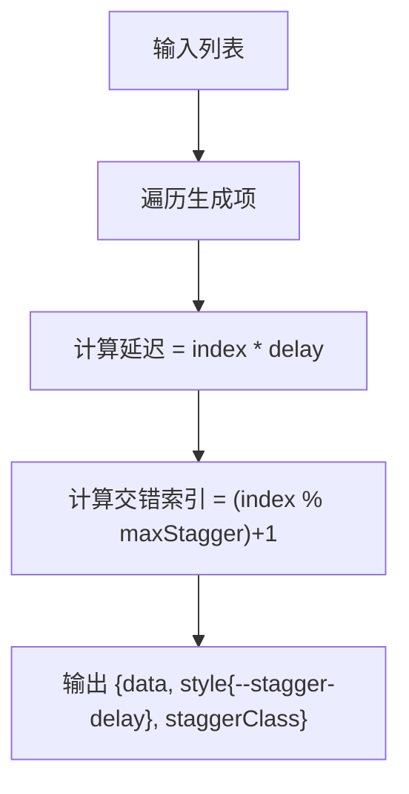

**图表来源**
- [useStaggeredAnimation.ts:1-80](file://src/shared/composables/useStaggeredAnimation.ts#L1-L80)

**章节来源**
- [useStaggeredAnimation.ts:1-80](file://src/shared/composables/useStaggeredAnimation.ts#L1-L80)

## 依赖关系分析
- 组件依赖
  - 所有组件均依赖全局 CSS 变量与动画系统，确保主题与动效一致性。
  - Modal/ConfirmDialog/Toast 使用 Teleport，避免定位与层级问题。
- 组合式函数依赖
  - useDragReorder 依赖 Vue Ref；useOrderPolling 依赖 Vue 生命周期与浏览器可见性 API；useStaggeredAnimation 依赖 Vue computed 与 unref。
- 外部依赖
  - 图标库 lucide-vue-next；拖拽库 vuedraggable（页面示例中使用）。

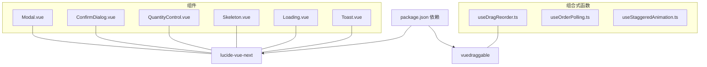

**图表来源**
- [package.json:1-64](file://package.json#L1-L64)
- [Modal.vue:1-189](file://src/shared/components/Modal.vue#L1-L189)
- [ConfirmDialog.vue:1-200](file://src/shared/components/ConfirmDialog.vue#L1-L200)
- [QuantityControl.vue:1-212](file://src/shared/components/QuantityControl.vue#L1-L212)
- [Skeleton.vue:1-139](file://src/shared/components/Skeleton.vue#L1-L139)
- [Loading.vue:1-83](file://src/shared/components/Loading.vue#L1-L83)
- [Toast.vue:1-138](file://src/shared/components/Toast.vue#L1-L138)
- [useDragReorder.ts:1-109](file://src/shared/composables/useDragReorder.ts#L1-L109)
- [useOrderPolling.ts:1-74](file://src/shared/composables/useOrderPolling.ts#L1-L74)
- [useStaggeredAnimation.ts:1-80](file://src/shared/composables/useStaggeredAnimation.ts#L1-L80)

**章节来源**
- [package.json:1-64](file://package.json#L1-L64)

## 性能考量
- 动画与渲染
  - 使用 CSS 变量与 will-change 优化 GPU 合成；减少不必要的 reflow。
  - 骨架屏与 Loading 在减少运动模式下自动降级，避免不必要动画。
- 事件与定时器
  - 轮询使用 shouldPoll 与 visibilitychange 自动暂停，降低无效请求。
  - 拖拽排序在保存期间标记 isSaving，避免重复提交。
- DOM 与 Teleport
  - Modal/ConfirmDialog/Toast 使用 Teleport，减少层级嵌套对布局的影响。
- 图标与体积
  - lucide-vue-next 按需引入，避免整体打包体积膨胀。

[本节为通用指导，无需特定文件引用]

## 故障排查指南
- 模态无法关闭或滚动穿透
  - 检查 show 变更与 watch 中的 body 滚动锁定逻辑；确认 Teleport 目标正确。
- 拖拽排序未保存
  - 确认 onReorder 回调是否被调用；检查异常捕获与 isSaving 状态。
- 轮询不生效
  - 检查 shouldPoll 返回值；确认 visibilitychange 事件绑定与清理。
- 动画卡顿
  - 检查 CSS 变量与缓动函数；确认未在主线程执行重计算。
- 主题不生效
  - 确认 data-theme 属性与 CSS 变量覆盖顺序；检查 style.css 加载顺序。

**章节来源**
- [ConfirmDialog.vue:27-42](file://src/shared/components/ConfirmDialog.vue#L27-L42)
- [Modal.vue:21-28](file://src/shared/components/Modal.vue#L21-L28)
- [useDragReorder.ts:83-95](file://src/shared/composables/useDragReorder.ts#L83-L95)
- [useOrderPolling.ts:41-47](file://src/shared/composables/useOrderPolling.ts#L41-L47)
- [style.css:90-106](file://src/style.css#L90-L106)

## 结论
共享组件库通过统一的样式变量、主题系统与动效规范，结合组合式函数对常见交互进行抽象与封装，实现了高内聚、低耦合、强复用的前端基础设施。建议在新功能开发中优先复用现有组件与组合式函数，并遵循可定制性与可扩展性原则，持续完善设计系统与最佳实践。

[本节为总结，无需特定文件引用]

## 附录

### 设计原则与复用策略
- 抽象层次
  - 组件：UI 原子能力；组合式函数：交互与状态逻辑。
- 接口设计
  - 属性默认值与类型约束；事件命名规范；插槽与 Teleport 使用。
- 复用策略
  - 通过 props/emit/插槽与组合式函数参数化配置，实现跨页面复用。

### 可定制性与主题支持
- 主题变量
  - 颜色、间距、圆角、阴影、动画时长与缓动均可通过 CSS 变量调节。
- 暗色主题
  - 通过 data-theme="dark" 切换，组件自动适配。
- 减少运动
  - 媒体查询减少动画，保障无障碍体验。

**章节来源**
- [style.css:1-944](file://src/style.css#L1-L944)

### 响应式设计
- 组件尺寸与布局
  - 通过 CSS 变量与媒体查询适配移动端与桌面端。
- 动画与交互
  - 移动端优先考虑手势与触摸反馈，避免复杂动画。

**章节来源**
- [style.css:1-944](file://src/style.css#L1-L944)

### 最佳实践
- 组件使用
  - 明确属性与事件边界；合理使用插槽；避免在组件内部做过多业务逻辑。
- 组合式函数
  - 将副作用与状态隔离；提供清晰的输入输出；注意生命周期与资源清理。
- 性能优化
  - 避免在渲染路径中执行重计算；使用 computed 与防抖；合理使用 Teleport。

### 扩展指南
- 新增组件
  - 遵循现有命名与目录结构；统一使用 CSS 变量；提供必要的插槽与事件。
- 新增组合式函数
  - 明确定义输入输出；提供可选配置项；处理异常与资源清理。
- 主题扩展
  - 在 style.css 中补充变量与规则；确保与现有组件兼容。

**章节来源**
- [style.css:1-944](file://src/style.css#L1-L944)