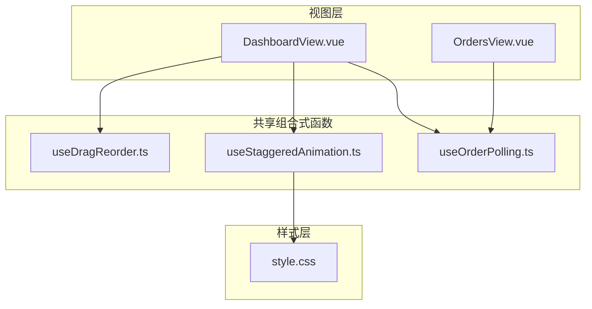
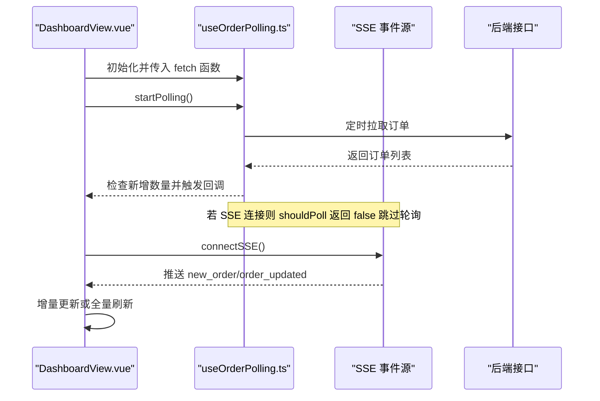
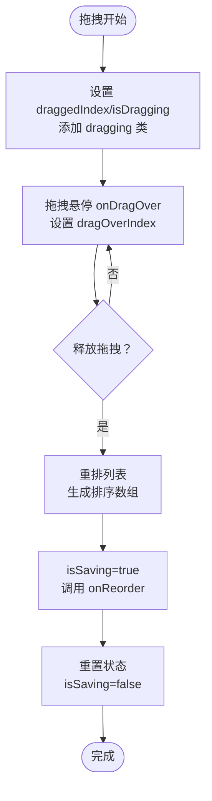
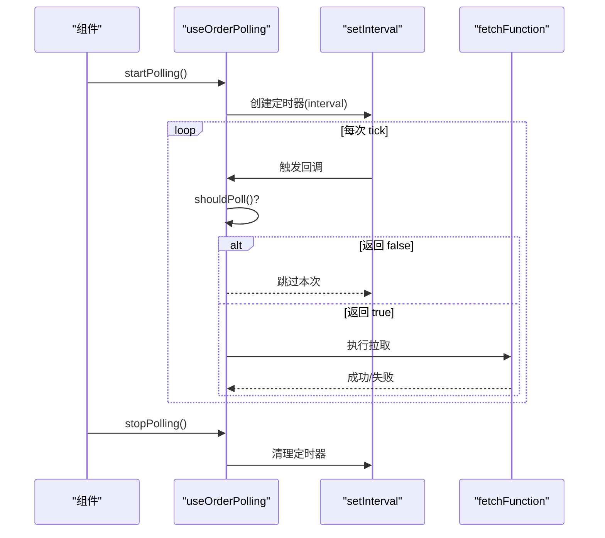
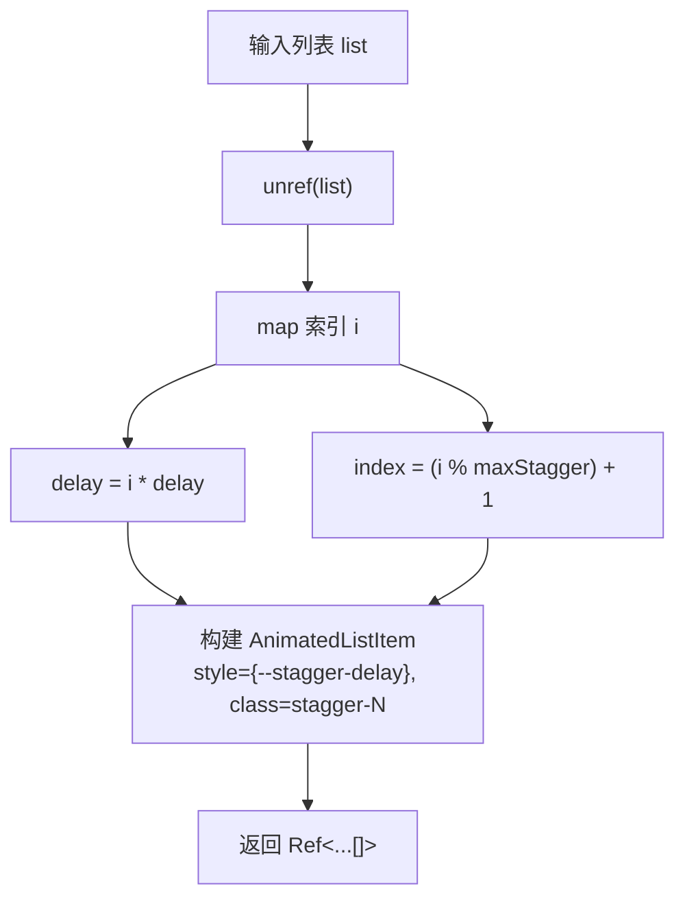
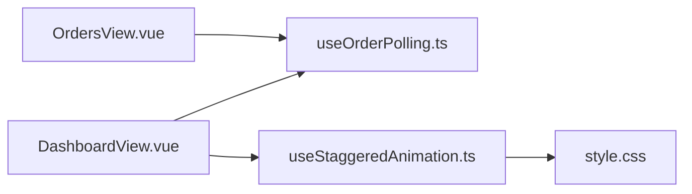

# 组合式函数

<cite>
**本文档引用的文件**
- [useDragReorder.ts](file://src/shared/composables/useDragReorder.ts)
- [useOrderPolling.ts](file://src/shared/composables/useOrderPolling.ts)
- [useStaggeredAnimation.ts](file://src/shared/composables/useStaggeredAnimation.ts)
- [DashboardView.vue](file://src/admin/views/DashboardView.vue)
- [OrdersView.vue](file://src/client/views/OrdersView.vue)
- [style.css](file://src/style.css)
</cite>

## 目录
1. [简介](#简介)
2. [项目结构](#项目结构)
3. [核心组件](#核心组件)
4. [架构总览](#架构总览)
5. [详细组件分析](#详细组件分析)
6. [依赖关系分析](#依赖关系分析)
7. [性能考量](#性能考量)
8. [故障排查指南](#故障排查指南)
9. [结论](#结论)
10. [附录](#附录)

## 简介
本文件系统化梳理 RLRMS 项目中的三个组合式函数（Composable）：拖拽排序 useDragReorder、订单轮询 useOrderPolling、交错动画 useStaggeredAnimation。文档从设计模式、实现原理、输入输出、副作用管理、生命周期、使用场景与集成方式、可复用性与性能优化、扩展可能性等维度进行全面解析，并提供可视化流程图与时序图帮助理解。

## 项目结构
三个组合式函数位于共享层，分别服务于不同业务场景：
- 拖拽排序：用于可拖拽列表的排序持久化与状态管理
- 订单轮询：用于后台仪表盘的订单状态与新增订单的实时感知
- 交错动画：用于列表项进入/离开的视觉延时动画

图表来源
- [useDragReorder.ts:1-109](file://src/shared/composables/useDragReorder.ts#L1-L109)
- [useOrderPolling.ts:1-74](file://src/shared/composables/useOrderPolling.ts#L1-L74)
- [useStaggeredAnimation.ts:1-80](file://src/shared/composables/useStaggeredAnimation.ts#L1-L80)
- [DashboardView.vue:414-432](file://src/admin/views/DashboardView.vue#L414-L432)
- [OrdersView.vue:77-86](file://src/client/views/OrdersView.vue#L77-L86)
- [style.css:778-787](file://src/style.css#L778-L787)

章节来源
- [useDragReorder.ts:1-109](file://src/shared/composables/useDragReorder.ts#L1-L109)
- [useOrderPolling.ts:1-74](file://src/shared/composables/useOrderPolling.ts#L1-L74)
- [useStaggeredAnimation.ts:1-80](file://src/shared/composables/useStaggeredAnimation.ts#L1-L80)
- [DashboardView.vue:414-432](file://src/admin/views/DashboardView.vue#L414-L432)
- [OrdersView.vue:77-86](file://src/client/views/OrdersView.vue#L77-L86)
- [style.css:778-787](file://src/style.css#L778-L787)

## 核心组件
- useDragReorder：提供拖拽排序的响应式状态与事件处理器，负责交换列表元素顺序并在保存阶段触发回调
- useOrderPolling：封装轮询控制、页面可见性感知与新增订单检测，支持条件跳过轮询
- useStaggeredAnimation：为列表项生成带交错延迟的样式与类名，配合 CSS 动画钩子实现流畅入场/离场

章节来源
- [useDragReorder.ts:13-108](file://src/shared/composables/useDragReorder.ts#L13-L108)
- [useOrderPolling.ts:10-73](file://src/shared/composables/useOrderPolling.ts#L10-L73)
- [useStaggeredAnimation.ts:45-79](file://src/shared/composables/useStaggeredAnimation.ts#L45-L79)

## 架构总览
三个组合式函数通过 Vue 的响应式系统协同工作，支撑仪表盘与客户端订单列表的交互体验。DashboardView 使用 useOrderPolling 结合 SSE 与轮询实现高可靠实时更新；useStaggeredAnimation 为订单列表提供视觉延时动画；useDragReorder 在需要排序的场景中提供拖拽能力。

图表来源
- [DashboardView.vue:414-432](file://src/admin/views/DashboardView.vue#L414-L432)
- [useOrderPolling.ts:19-31](file://src/shared/composables/useOrderPolling.ts#L19-L31)

章节来源
- [DashboardView.vue:302-446](file://src/admin/views/DashboardView.vue#L302-L446)
- [useOrderPolling.ts:1-74](file://src/shared/composables/useOrderPolling.ts#L1-L74)

## 详细组件分析

### useDragReorder 拖拽排序
- 设计模式：基于响应式状态与事件驱动的组合式函数，将 DOM 事件映射为应用状态变更
- 输入参数
  - items: Ref<T[]> 列表数据
  - onReorder: 回调函数，接收 [{ id, sort_order }] 数组
- 返回值
  - 状态与事件处理器：draggedIndex、dragOverIndex、isDragging、isSaving、handleDragStart/End/Over/Leave/Drop
- 副作用管理
  - 在拖拽开始/结束时切换 DOM 类名，避免样式泄漏
  - 异步保存期间设置 isSaving，防止重复提交
- 生命周期
  - 由调用方管理挂载/卸载，通常在组件 setup 中初始化
- 使用场景
  - 支持拖拽重排的列表（如菜品排序、订单优先级调整）
- 集成方法
  - 在模板中绑定拖拽事件与类名，调用 onReorder 完成持久化
- 性能考虑
  - 仅在 drop 时计算新的排序数组并发起一次网络请求
  - 避免在拖拽过程中频繁渲染
- 扩展可能性
  - 支持多列拖拽、跨容器移动、拖拽阈值与占位符

图表来源
- [useDragReorder.ts:21-95](file://src/shared/composables/useDragReorder.ts#L21-L95)

章节来源
- [useDragReorder.ts:8-11](file://src/shared/composables/useDragReorder.ts#L8-L11)
- [useDragReorder.ts:13-108](file://src/shared/composables/useDragReorder.ts#L13-L108)

### useOrderPolling 订单轮询
- 设计模式：封装定时任务与页面可见性监听，结合条件跳过策略实现高效轮询
- 输入参数
  - fetchFunction: Promise<void> 拉取函数
  - options: { interval?, onNewOrder?, shouldPoll? }
- 返回值
  - isPolling、startPolling、stopPolling、checkForNewOrders
- 副作用管理
  - onMounted/onUnmounted 自动注册/清理定时器与 visibilitychange 事件
  - shouldPoll 可阻止在 SSE 已连接时的轮询
- 生命周期
  - 自动在组件挂载时启动，在卸载时清理
- 使用场景
  - 订单列表的周期性刷新与新增检测
- 集成方法
  - 在 DashboardView 中与 SSE 协同，SSE 连接时 shouldPoll 返回 false
- 性能考虑
  - 页面隐藏时停止轮询，减少资源消耗
  - 新增检测仅在计数增加时触发回调
- 扩展可能性
  - 支持退避重试、并发去重、错误统计

图表来源
- [useOrderPolling.ts:19-31](file://src/shared/composables/useOrderPolling.ts#L19-L31)
- [DashboardView.vue:414-432](file://src/admin/views/DashboardView.vue#L414-L432)

章节来源
- [useOrderPolling.ts:3-8](file://src/shared/composables/useOrderPolling.ts#L3-L8)
- [useOrderPolling.ts:10-73](file://src/shared/composables/useOrderPolling.ts#L10-L73)
- [DashboardView.vue:414-432](file://src/admin/views/DashboardView.vue#L414-L432)

### useStaggeredAnimation 交错动画
- 设计模式：基于 computed 的纯函数式组合式，将输入列表映射为带动画属性的对象数组
- 输入参数
  - list: MaybeRef<T[]> 响应式列表
  - options: { delay?, maxStagger? } 默认延迟 50ms，最大交错 8
- 返回值
  - Ref<AnimatedListItem<T>[]> 包含 data、style、staggerClass
- 副作用管理
  - 无副作用，仅依赖 unref(list) 读取
- 生命周期
  - 随响应式依赖变化而重新计算
- 使用场景
  - 列表项进入/离开的延时动画（如订单列表滑入）
- 集成方法
  - 与 TransitionGroup 的 staggeredTransitionProps 配合使用
  - CSS 中通过 --stagger-delay 与 .stagger-N 类名生效
- 性能考虑
  - computed 缓存，仅当输入列表变化时重算
  - maxStagger 控制类名循环，避免过多样式类
- 扩展可能性
  - 支持自定义动画曲线、方向、缓动函数

图表来源
- [useStaggeredAnimation.ts:45-69](file://src/shared/composables/useStaggeredAnimation.ts#L45-L69)
- [style.css:778-787](file://src/style.css#L778-L787)

章节来源
- [useStaggeredAnimation.ts:6-23](file://src/shared/composables/useStaggeredAnimation.ts#L6-L23)
- [useStaggeredAnimation.ts:45-79](file://src/shared/composables/useStaggeredAnimation.ts#L45-L79)
- [style.css:778-787](file://src/style.css#L778-L787)

## 依赖关系分析
- DashboardView 依赖 useOrderPolling 与 useStaggeredAnimation，实现订单列表的实时刷新与动画
- OrdersView 依赖 useOrderPolling 实现客户端订单列表的轮询
- useStaggeredAnimation 依赖 style.css 中的动画变量与类名

图表来源
- [DashboardView.vue:414-432](file://src/admin/views/DashboardView.vue#L414-L432)
- [OrdersView.vue:77-86](file://src/client/views/OrdersView.vue#L77-L86)
- [useOrderPolling.ts:1-74](file://src/shared/composables/useOrderPolling.ts#L1-L74)
- [useStaggeredAnimation.ts:75-79](file://src/shared/composables/useStaggeredAnimation.ts#L75-L79)
- [style.css:778-787](file://src/style.css#L778-L787)

章节来源
- [DashboardView.vue:414-432](file://src/admin/views/DashboardView.vue#L414-L432)
- [OrdersView.vue:77-86](file://src/client/views/OrdersView.vue#L77-L86)
- [useOrderPolling.ts:1-74](file://src/shared/composables/useOrderPolling.ts#L1-L74)
- [useStaggeredAnimation.ts:75-79](file://src/shared/composables/useStaggeredAnimation.ts#L75-L79)
- [style.css:778-787](file://src/style.css#L778-L787)

## 性能考量
- useDragReorder
  - 仅在 drop 时一次性计算排序数组，避免拖拽过程中的高频重排
  - 使用 isSaving 防止并发保存
- useOrderPolling
  - 页面隐藏时停止轮询，降低 CPU 与网络消耗
  - shouldPoll 在 SSE 连接时跳过轮询，避免冗余请求
- useStaggeredAnimation
  - computed 缓存，输入不变不重算
  - maxStagger 控制样式类数量，避免过度样式计算

## 故障排查指南
- 拖拽排序无效
  - 检查模板是否正确绑定拖拽事件与类名
  - 确认 onReorder 是否被调用且无异常
- 轮询未生效
  - 确认组件已调用 startPolling 且未被 stopPolling 停止
  - 检查 shouldPoll 是否返回 false（SSE 已连接时）
- 动画不生效
  - 确认使用了 staggeredTransitionProps
  - 检查 style.css 中 --stagger-delay 与 .stagger-N 类是否存在

章节来源
- [useDragReorder.ts:21-95](file://src/shared/composables/useDragReorder.ts#L21-L95)
- [useOrderPolling.ts:19-31](file://src/shared/composables/useOrderPolling.ts#L19-L31)
- [useStaggeredAnimation.ts:75-79](file://src/shared/composables/useStaggeredAnimation.ts#L75-L79)
- [style.css:778-787](file://src/style.css#L778-L787)

## 结论
三个组合式函数以简洁的 API 和清晰的职责边界，有效支撑了 RLRMS 的交互与实时性需求。通过响应式状态与副作用管理，实现了良好的可维护性与可扩展性。建议在后续迭代中进一步完善错误处理、日志埋点与性能监控，以提升可观测性与稳定性。

## 附录
- 使用示例路径
  - 订单轮询集成：[DashboardView.vue:414-432](file://src/admin/views/DashboardView.vue#L414-L432)
  - 订单列表轮询（客户端）：[OrdersView.vue:77-86](file://src/client/views/OrdersView.vue#L77-L86)
  - 交错动画样式：[style.css:778-787](file://src/style.css#L778-L787)
- API 定义摘要
  - useDragReorder(options: { items, onReorder }): { handleDragStart, handleDragEnd, handleDragOver, handleDragLeave, handleDrop, ...状态 }
  - useOrderPolling(fetchFunction, options?): { isPolling, startPolling, stopPolling, checkForNewOrders }
  - useStaggeredAnimation(list, options?): Ref<AnimatedListItem[]>