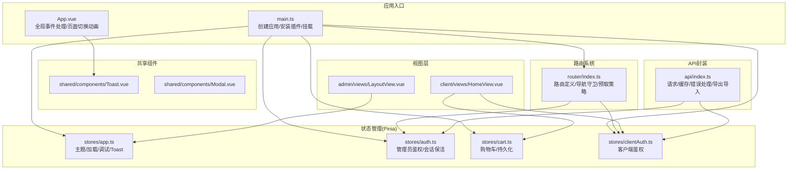
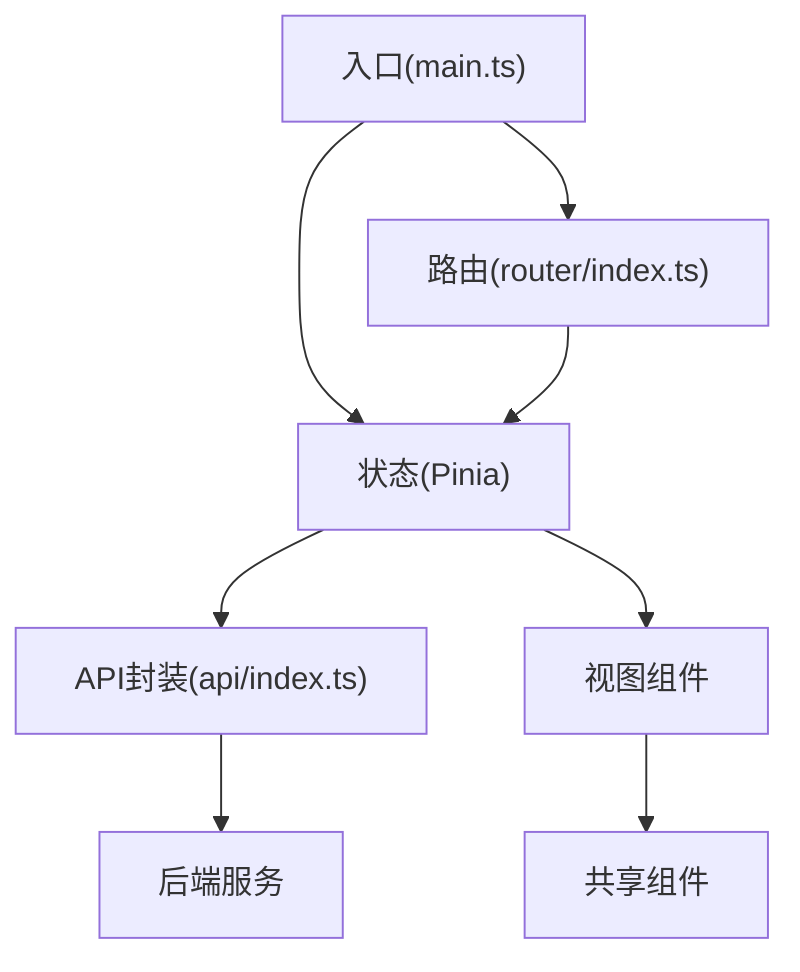
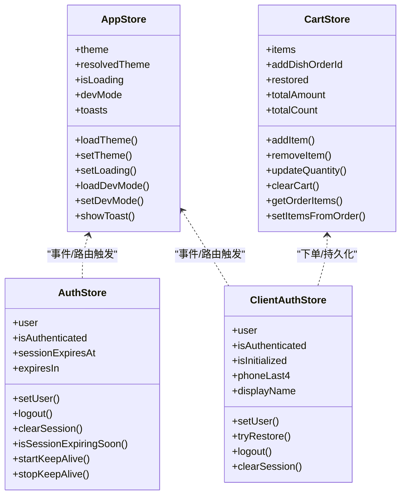
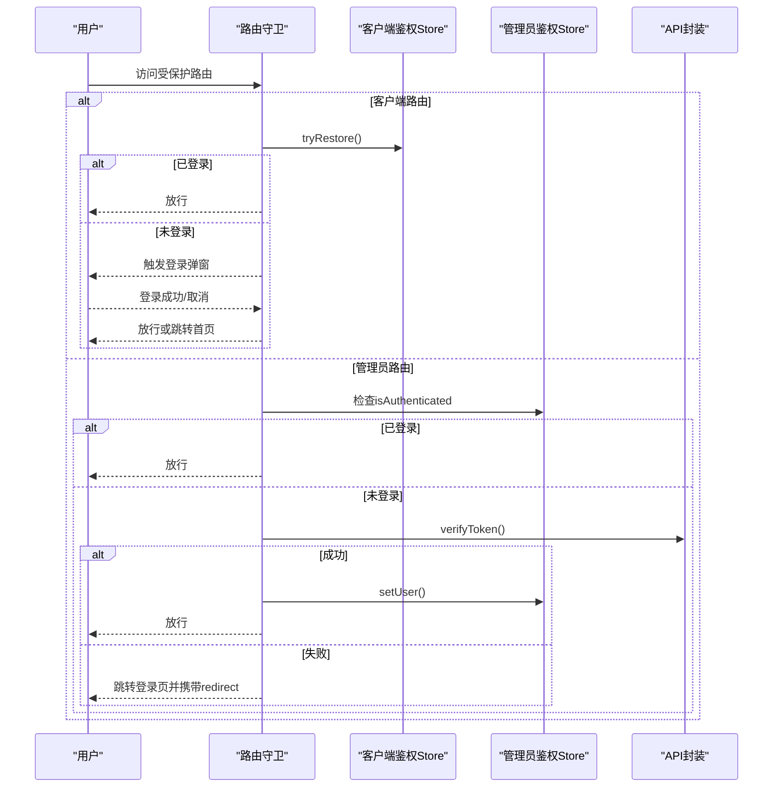
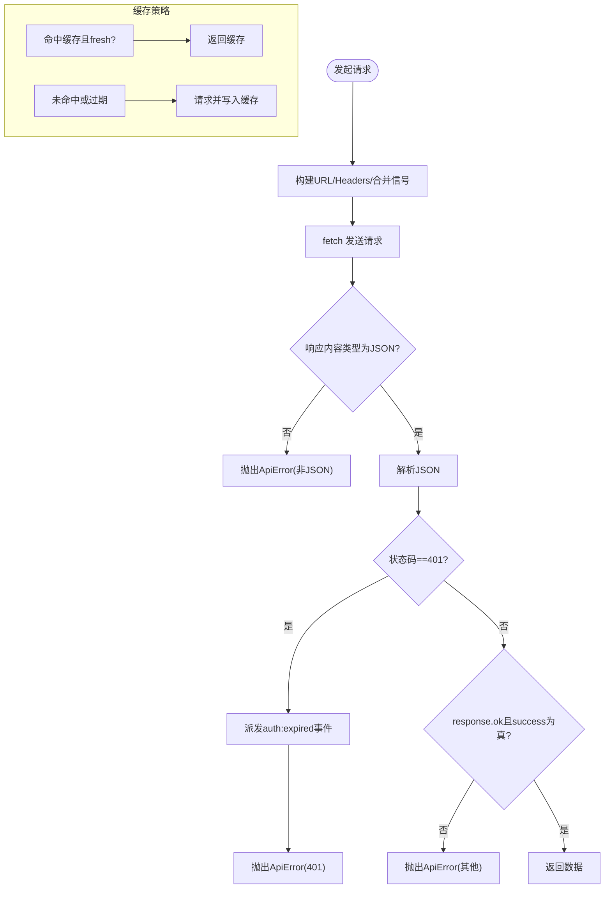
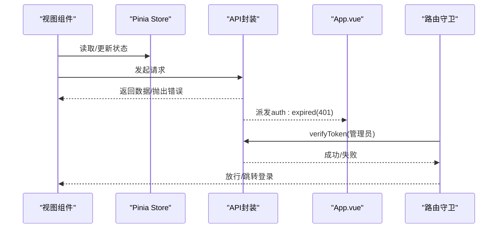
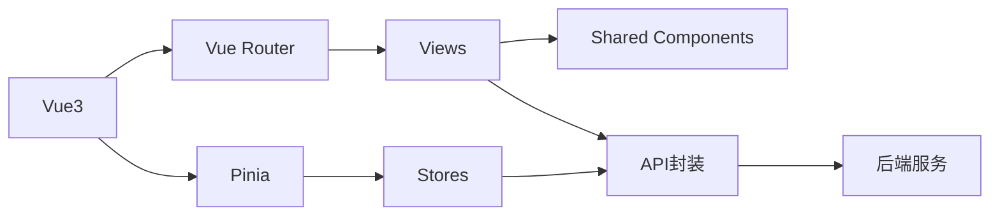

# 前端架构详解

<cite>
**本文档引用的文件**
- [main.ts](file://src/main.ts)
- [App.vue](file://src/App.vue)
- [router/index.ts](file://src/router/index.ts)
- [api/index.ts](file://src/api/index.ts)
- [stores/app.ts](file://src/stores/app.ts)
- [stores/auth.ts](file://src/stores/auth.ts)
- [stores/cart.ts](file://src/stores/cart.ts)
- [stores/clientAuth.ts](file://src/stores/clientAuth.ts)
- [shared/components/Toast.vue](file://src/shared/components/Toast.vue)
- [admin/views/LayoutView.vue](file://src/admin/views/LayoutView.vue)
- [client/views/HomeView.vue](file://src/client/views/HomeView.vue)
- [shared/components/Modal.vue](file://src/shared/components/Modal.vue)
- [types/index.ts](file://src/types/index.ts)
- [utils/storage.ts](file://src/utils/storage.ts)
- [package.json](file://package.json)
</cite>

## 目录
1. [引言](#引言)
2. [项目结构](#项目结构)
3. [核心组件](#核心组件)
4. [架构总览](#架构总览)
5. [详细组件分析](#详细组件分析)
6. [依赖分析](#依赖分析)
7. [性能考虑](#性能考虑)
8. [故障排查指南](#故障排查指南)
9. [结论](#结论)
10. [附录](#附录)

## 引言
本文件面向RLRMS前端架构，围绕Vue3应用的整体设计进行深入解析，涵盖组件层次结构、状态管理模式、路由系统设计；详细阐述Pinia状态管理的设计理念与实现细节，解释各store的作用与相互关系；剖析API封装层的设计思路（缓存策略、错误处理机制）；分析共享组件库的设计原则与使用方法；提供组件间通信模式与数据流分析，并给出性能优化策略与最佳实践建议。

## 项目结构
应用采用按功能域分层的组织方式：
- 应用入口与根组件：在入口文件中注册Pinia与路由，在根组件中统一处理鉴权过期事件与全局提示。
- 路由系统：区分客户端前台与管理后台两条路由线，支持导航守卫与路由预取。
- 状态管理：基于Pinia的模块化store，分别管理应用主题、鉴权、购物车、客户端鉴权等。
- API封装：统一的请求层，内置前端内存缓存、超时控制、401拦截与全局事件派发。
- 共享组件：Toast、Modal、Skeleton等跨域组件，提供一致的交互体验。
- 类型定义：集中声明API响应、用户、菜品、订单、库存等核心类型。
- 工具库：IndexedDB封装，用于购物车持久化与配置存储。

**图表来源**
- [main.ts:1-37](file://src/main.ts#L1-L37)
- [App.vue:1-113](file://src/App.vue#L1-L113)
- [router/index.ts:1-317](file://src/router/index.ts#L1-L317)
- [api/index.ts:1-608](file://src/api/index.ts#L1-L608)
- [stores/app.ts:1-122](file://src/stores/app.ts#L1-L122)
- [stores/auth.ts:1-128](file://src/stores/auth.ts#L1-L128)
- [stores/cart.ts:1-175](file://src/stores/cart.ts#L1-L175)
- [stores/clientAuth.ts:1-87](file://src/stores/clientAuth.ts#L1-L87)
- [shared/components/Toast.vue:1-138](file://src/shared/components/Toast.vue#L1-L138)
- [shared/components/Modal.vue:1-189](file://src/shared/components/Modal.vue#L1-L189)
- [admin/views/LayoutView.vue:1-769](file://src/admin/views/LayoutView.vue#L1-L769)
- [client/views/HomeView.vue:1-867](file://src/client/views/HomeView.vue#L1-L867)

**章节来源**
- [main.ts:1-37](file://src/main.ts#L1-L37)
- [router/index.ts:1-317](file://src/router/index.ts#L1-L317)

## 核心组件
- 应用入口与挂载：创建Vue实例，安装Pinia与路由，全局禁用输入拼写检查，派发应用挂载事件，预加载关键路由。
- 根组件：监听鉴权过期事件，区分管理员与客户端路径，执行相应清理与跳转逻辑；渲染页面切换动画与全局Toast、登录弹窗。
- 路由系统：定义客户端与管理后台路由，导航守卫中处理标题更新、客户端鉴权校验、管理员令牌校验与保活；afterEach中进行路由预取。
- API封装：统一请求函数、可取消请求、前端内存缓存（stale-while-revalidate）、401拦截与全局事件派发、文件上传/下载、数据导入导出。
- Pinia Store：app（主题/加载/调试/Toast）、auth（管理员鉴权/会话保活）、cart（购物车/IndexedDB持久化）、clientAuth（客户端鉴权）。
- 共享组件：Toast（全局通知）、Modal（通用弹窗）。
- 类型系统：集中定义API响应、用户、菜品、订单、库存、购物车等类型。
- 工具库：IndexedDB封装，提供懒加载初始化与读写接口。

**章节来源**
- [main.ts:1-37](file://src/main.ts#L1-L37)
- [App.vue:1-113](file://src/App.vue#L1-L113)
- [router/index.ts:1-317](file://src/router/index.ts#L1-L317)
- [api/index.ts:1-608](file://src/api/index.ts#L1-L608)
- [stores/app.ts:1-122](file://src/stores/app.ts#L1-L122)
- [stores/auth.ts:1-128](file://src/stores/auth.ts#L1-L128)
- [stores/cart.ts:1-175](file://src/stores/cart.ts#L1-L175)
- [stores/clientAuth.ts:1-87](file://src/stores/clientAuth.ts#L1-L87)
- [shared/components/Toast.vue:1-138](file://src/shared/components/Toast.vue#L1-L138)
- [shared/components/Modal.vue:1-189](file://src/shared/components/Modal.vue#L1-L189)
- [types/index.ts:1-133](file://src/types/index.ts#L1-L133)
- [utils/storage.ts:1-109](file://src/utils/storage.ts#L1-L109)

## 架构总览
应用采用“入口-路由-状态-API-组件”分层架构：
- 入口负责应用初始化与全局行为（如拼写检查禁用、预加载）。
- 路由负责页面导航与鉴权控制，结合API层进行令牌校验与会话保活。
- 状态管理负责跨组件共享的状态与业务逻辑，store之间通过API与事件解耦协作。
- API封装提供统一的网络访问与缓存策略，向上游组件屏蔽错误处理细节。
- 共享组件提供一致的UI与交互体验，降低重复开发成本。

**图表来源**
- [main.ts:1-37](file://src/main.ts#L1-L37)
- [router/index.ts:1-317](file://src/router/index.ts#L1-L317)
- [api/index.ts:1-608](file://src/api/index.ts#L1-L608)

## 详细组件分析

### 状态管理（Pinia）设计与实现
- 设计理念
  - 单一职责：每个store聚焦一个领域（应用、鉴权、购物车、客户端鉴权）。
  - 响应式与持久化分离：store内部状态响应式，持久化通过IndexedDB或本地存储独立处理。
  - 事件驱动：通过自定义事件与API层协同，实现跨store的非直接耦合通信。
- 实现细节
  - app：主题管理（支持light/dark/system）、加载状态、调试模式、Toast队列。
  - auth：管理员JWT鉴权、会话过期时间计算、定时保活、登出清理。
  - cart：购物车数据结构、数量与金额计算、持久化（IndexedDB）、下单转换。
  - clientAuth：客户端手机号登录态、令牌恢复、登出与清理。
- 相互关系
  - 路由守卫在导航前调用API进行令牌校验，成功后通过store.setUser设置用户态。
  - App.vue监听auth:expired事件，根据路径区分管理员与客户端处理。
  - HomeView与LayoutView分别读取cart与clientAuth状态，驱动UI与交互。

**图表来源**
- [stores/app.ts:1-122](file://src/stores/app.ts#L1-L122)
- [stores/auth.ts:1-128](file://src/stores/auth.ts#L1-L128)
- [stores/cart.ts:1-175](file://src/stores/cart.ts#L1-L175)
- [stores/clientAuth.ts:1-87](file://src/stores/clientAuth.ts#L1-L87)

**章节来源**
- [stores/app.ts:1-122](file://src/stores/app.ts#L1-L122)
- [stores/auth.ts:1-128](file://src/stores/auth.ts#L1-L128)
- [stores/cart.ts:1-175](file://src/stores/cart.ts#L1-L175)
- [stores/clientAuth.ts:1-87](file://src/stores/clientAuth.ts#L1-L87)

### 路由系统设计
- 路由分层
  - 客户端路由：首页、菜品详情、搜索、订单确认、订单列表、设置等。
  - 管理后台路由：登录、布局、桌位/菜单/订单/库存/用户/设置等子路由。
- 导航守卫
  - 标题更新：根据meta.title动态设置document.title。
  - 客户端鉴权：对requiresClientAuth路由，尝试从cookie恢复，否则触发登录弹窗。
  - 管理员鉴权：对requiresAuth路由，调用verifyToken，成功后设置用户态。
- 预取策略
  - 预加载关键路由组件（首页、管理首页、管理布局）。
  - afterEach中根据当前路由预测并预取相关页面，提升二次访问速度。
- Edge浏览器兼容性
  - 替换history.replaceState，避免隐藏状态下异常调用导致的问题。

**图表来源**
- [router/index.ts:201-277](file://src/router/index.ts#L201-L277)
- [router/index.ts:283-314](file://src/router/index.ts#L283-L314)

**章节来源**
- [router/index.ts:1-317](file://src/router/index.ts#L1-L317)

### API封装层设计
- 统一请求函数
  - 自动添加/合并超时信号，支持外部AbortSignal。
  - 默认携带credentials: 'include'，自动处理JSON响应与非JSON防护。
- 错误处理机制
  - 401拦截：派发auth:expired全局事件，阻止默认处理以统一交由App.vue处理。
  - 非JSON响应：抛出ApiError，避免HTML响应被当作JSON解析。
  - 可选skip401Handler，用于导入/导出等特殊场景。
- 缓存策略
  - 前端内存缓存（Map），stale-while-revalidate：命中即刻返回，后台静默刷新。
  - 缓存TTL 30秒，getHomeData与getCategories等接口使用。
- 特殊能力
  - 可取消请求：createCancellableRequest。
  - 文件上传/下载：uploadImage/deleteImage，导出ZIP并自动下载，导入ZIP并统计结果。
  - 导入导出：exportData/importData，含401处理与文件名解析。

**图表来源**
- [api/index.ts:54-114](file://src/api/index.ts#L54-L114)
- [api/index.ts:128-148](file://src/api/index.ts#L128-L148)
- [api/index.ts:164-171](file://src/api/index.ts#L164-L171)

**章节来源**
- [api/index.ts:1-608](file://src/api/index.ts#L1-L608)

### 共享组件库设计
- Toast
  - 通过app.store.toasts统一管理，最多保留5条，自动定时消失。
  - Teleport到body，使用TransitionGroup实现堆叠动画。
- Modal
  - 支持尺寸、可关闭、脚本槽位；打开时锁定body滚动。
  - 使用Teleport到body，提供模态遮罩与弹性进入/离开动画。
- Skeleton/ConfirmDialog/QuantityControl等
  - 提供骨架屏、确认对话框、数量控件等基础能力，减少重复实现。

**章节来源**
- [shared/components/Toast.vue:1-138](file://src/shared/components/Toast.vue#L1-L138)
- [shared/components/Modal.vue:1-189](file://src/shared/components/Modal.vue#L1-L189)

### 组件间通信与数据流
- 事件驱动
  - App.vue监听auth:expired，根据路径区分管理员/客户端处理。
  - 路由守卫通过window.dispatchEvent触发client:require-login，HomeView监听并弹出登录。
- 状态驱动
  - HomeView读取cart与clientAuth状态，驱动购物车栏与登录态。
  - LayoutView读取app与auth状态，驱动侧边栏与主题。
- API驱动
  - 各store通过api封装进行数据拉取与提交，统一错误处理与缓存策略。

**图表来源**
- [App.vue:16-39](file://src/App.vue#L16-L39)
- [router/index.ts:201-277](file://src/router/index.ts#L201-L277)
- [api/index.ts:94-114](file://src/api/index.ts#L94-L114)

## 依赖分析
- 核心依赖
  - Vue3、Vue Router、Pinia：应用框架与状态管理。
  - lucide-vue-next：图标库。
  - vuedraggable：拖拽排序。
- 开发依赖
  - Vite、TypeScript、Playwright等：构建与测试。
- 外部集成点
  - 后端API：统一前缀/api，配合cookies进行鉴权。
  - IndexedDB：购物车与配置持久化。

**图表来源**
- [package.json:16-41](file://package.json#L16-L41)

**章节来源**
- [package.json:1-64](file://package.json#L1-L64)

## 性能考虑
- 路由预取
  - 预加载关键路由组件，利用requestIdleCallback或setTimeout在空闲时执行。
  - afterEach根据当前路由预测并预取相关页面，减少二次访问延迟。
- 请求缓存
  - 前端内存缓存（stale-while-revalidate），TTL 30秒，兼顾实时性与性能。
  - 对高频接口（如首页数据、分类列表）启用缓存。
- 动画与渲染
  - 页面切换使用CSS动画，骨架屏提升首屏感知。
  - 列表渲染使用TransitionGroup与骨架屏，避免大列表闪烁。
- 浏览器兼容
  - Edge浏览器history.replaceState兼容处理，避免隐藏状态下异常调用。
- 存储优化
  - IndexedDB懒加载初始化，首次使用时建立对象仓库，避免启动开销。
  - 购物车持久化使用structuredClone剥离Proxy，确保序列化安全。

**章节来源**
- [router/index.ts:23-40](file://src/router/index.ts#L23-L40)
- [router/index.ts:283-314](file://src/router/index.ts#L283-L314)
- [api/index.ts:5-34](file://src/api/index.ts#L5-L34)
- [utils/storage.ts:11-40](file://src/utils/storage.ts#L11-L40)
- [client/views/HomeView.vue:244-261](file://src/client/views/HomeView.vue#L244-L261)

## 故障排查指南
- 401会话过期
  - 现象：页面出现“会话已过期，请重新登录”，管理员跳转登录页，客户端弹出登录弹窗。
  - 排查：检查后端JWT是否有效、cookies是否携带、API封装是否正确派发auth:expired。
  - 处理：管理员端清理会话并跳转登录；客户端端清理本地会话并触发登录弹窗。
- 购物车丢失
  - 现象：刷新后购物车清空。
  - 排查：IndexedDB是否可用、openDB是否初始化成功、持久化逻辑是否执行。
  - 处理：确认IndexedDB可用性，检查saveItems/saveOrderId调用时机。
- 路由跳转异常
  - 现象：受保护路由无法访问或反复跳转登录页。
  - 排查：导航守卫逻辑、verifyToken返回、tryRestore是否成功。
  - 处理：确保cookies有效，必要时清除无效缓存后重试。
- 导入导出失败
  - 现象：导入/导出报错或文件名乱码。
  - 排查：Content-Disposition解析、Blob下载、UTF-8编码处理。
  - 处理：检查后端响应头与文件名编码，确保正确解析并下载。

**章节来源**
- [App.vue:16-39](file://src/App.vue#L16-L39)
- [api/index.ts:94-114](file://src/api/index.ts#L94-L114)
- [stores/cart.ts:112-130](file://src/stores/cart.ts#L112-L130)
- [router/index.ts:201-277](file://src/router/index.ts#L201-L277)
- [api/index.ts:509-549](file://src/api/index.ts#L509-L549)

## 结论
本项目前端架构清晰、职责分明：入口负责初始化与全局行为，路由负责导航与鉴权，Pinia负责状态与持久化，API封装提供统一网络与缓存策略，共享组件保障一致性与可复用性。通过事件驱动与状态驱动相结合，实现了低耦合高内聚的组件通信模式。在性能方面，预取、缓存与骨架屏等策略有效提升了用户体验。建议后续持续完善类型覆盖、错误边界与监控埋点，进一步增强可维护性与可观测性。

## 附录
- 类型定义概览
  - API响应：success/data/error/message字段规范。
  - 用户与管理员用户：角色、联系方式、创建/更新时间。
  - 菜品与分类：价格、标签、规格、排序字段。
  - 订单与订单项：联系人、电话、时段、状态、明细。
  - 库存与仪表盘：数量、单位、阈值、统计指标。
  - 购物车：菜品引用、数量、规格。

**章节来源**
- [types/index.ts:1-133](file://src/types/index.ts#L1-L133)