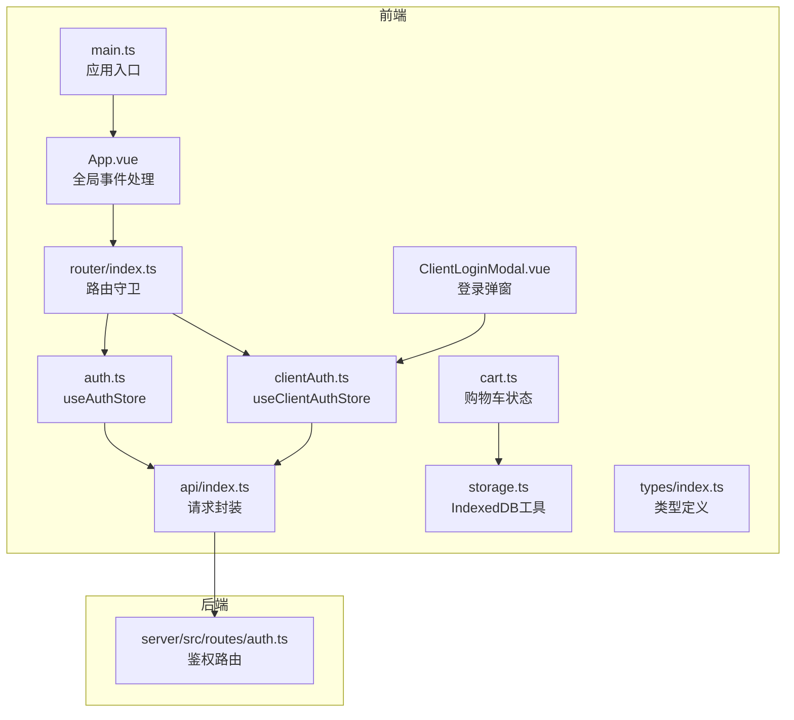
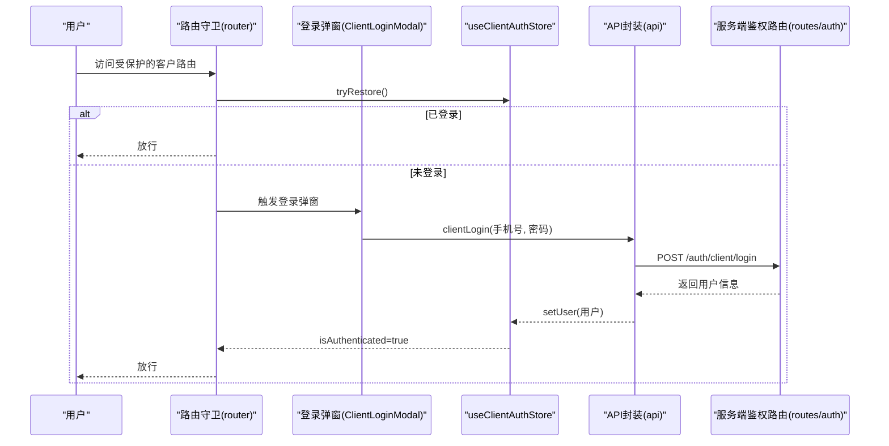
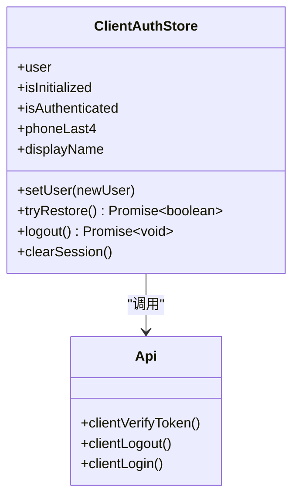
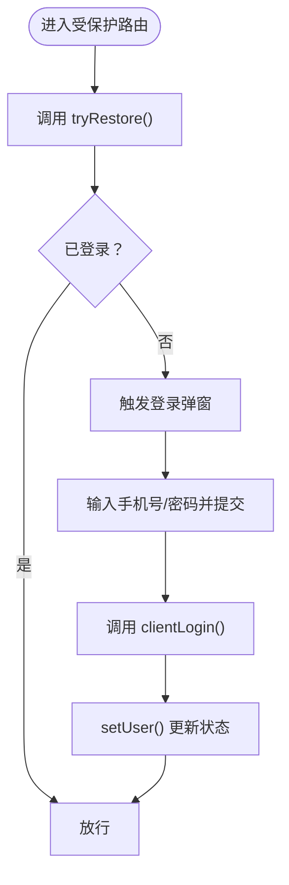
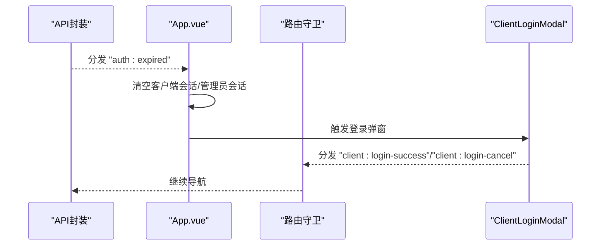
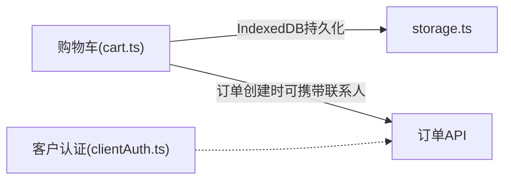
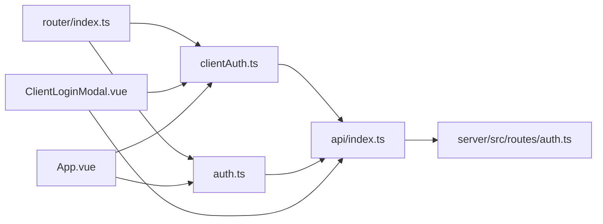

# 客户认证状态

<cite>
**本文引用的文件列表**
- [clientAuth.ts](file://src/stores/clientAuth.ts)
- [auth.ts](file://src/stores/auth.ts)
- [storage.ts](file://src/utils/storage.ts)
- [api/index.ts](file://src/api/index.ts)
- [routes/auth.ts](file://server/src/routes/auth.ts)
- [ClientLoginModal.vue](file://src/client/components/ClientLoginModal.vue)
- [App.vue](file://src/App.vue)
- [router/index.ts](file://src/router/index.ts)
- [main.ts](file://src/main.ts)
- [types/index.ts](file://src/types/index.ts)
- [cart.ts](file://src/stores/cart.ts)
</cite>

## 目录
1. [简介](#简介)
2. [项目结构](#项目结构)
3. [核心组件](#核心组件)
4. [架构总览](#架构总览)
5. [详细组件分析](#详细组件分析)
6. [依赖关系分析](#依赖关系分析)
7. [性能考量](#性能考量)
8. [故障排查指南](#故障排查指南)
9. [结论](#结论)
10. [附录](#附录)

## 简介
本文件面向RLRMS的“客户认证状态”子系统，聚焦于useClientAuthStore的设计与实现，系统性解析客户登录状态管理、会话保持、自动登录与身份验证流程；阐述客户认证与购物车状态的关联、订单绑定与历史记录管理；并提供最佳实践、安全策略与用户体验优化建议。文档以代码为依据，辅以图示帮助不同背景读者理解。

## 项目结构
围绕客户认证状态的关键模块分布如下：
- 客户认证状态：src/stores/clientAuth.ts
- 通用鉴权与会话保活：src/stores/auth.ts
- 请求封装与全局401处理：src/api/index.ts
- 客户端鉴权路由守卫与导航拦截：src/router/index.ts
- 客户端登录弹窗组件：src/client/components/ClientLoginModal.vue
- 应用根组件事件处理：src/App.vue
- 应用入口与Pinia挂载：src/main.ts
- 类型定义：src/types/index.ts
- 购物车状态与本地持久化：src/stores/cart.ts
- 本地键值存储（IndexedDB）：src/utils/storage.ts
- 服务端鉴权路由：server/src/routes/auth.ts

图表来源
- [main.ts:1-37](file://src/main.ts#L1-L37)
- [App.vue:1-113](file://src/App.vue#L1-L113)
- [router/index.ts:1-317](file://src/router/index.ts#L1-L317)
- [clientAuth.ts:1-87](file://src/stores/clientAuth.ts#L1-L87)
- [auth.ts:1-128](file://src/stores/auth.ts#L1-L128)
- [api/index.ts:1-608](file://src/api/index.ts#L1-L608)
- [ClientLoginModal.vue:1-351](file://src/client/components/ClientLoginModal.vue#L1-L351)
- [cart.ts:1-183](file://src/stores/cart.ts#L1-L183)
- [storage.ts:1-109](file://src/utils/storage.ts#L1-L109)
- [routes/auth.ts:1-405](file://server/src/routes/auth.ts#L1-L405)

章节来源
- [main.ts:1-37](file://src/main.ts#L1-L37)
- [App.vue:1-113](file://src/App.vue#L1-L113)
- [router/index.ts:1-317](file://src/router/index.ts#L1-L317)

## 核心组件
- useClientAuthStore：负责客户登录态、显示名与手机号后四位派生计算、恢复登录、登出与清空本地状态等。
- useAuthStore：负责管理员登录态与会话保活（定时器），与客户态并行存在但职责不同。
- ClientLoginModal：客户登录弹窗，触发登录流程并将结果回传给路由守卫。
- 路由守卫：对需要客户认证的路由进行拦截、尝试恢复、必要时弹出登录框。
- API层：统一处理401事件，向App.vue分发“auth:expired”，驱动UI行为。
- 本地存储：购物车通过IndexedDB持久化，与客户认证状态解耦。

章节来源
- [clientAuth.ts:1-87](file://src/stores/clientAuth.ts#L1-L87)
- [auth.ts:1-128](file://src/stores/auth.ts#L1-L128)
- [ClientLoginModal.vue:1-351](file://src/client/components/ClientLoginModal.vue#L1-L351)
- [router/index.ts:201-247](file://src/router/index.ts#L201-L247)
- [api/index.ts:54-114](file://src/api/index.ts#L54-L114)
- [cart.ts:1-183](file://src/stores/cart.ts#L1-L183)

## 架构总览
客户认证状态在前端采用Pinia Store管理，在路由层进行拦截与恢复；后端通过JWT与httpOnly Cookie实现无状态鉴权。整体交互如下：

图表来源
- [router/index.ts:208-247](file://src/router/index.ts#L208-L247)
- [ClientLoginModal.vue:47-88](file://src/client/components/ClientLoginModal.vue#L47-L88)
- [clientAuth.ts:38-54](file://src/stores/clientAuth.ts#L38-L54)
- [api/index.ts:271-286](file://src/api/index.ts#L271-L286)
- [routes/auth.ts:182-294](file://server/src/routes/auth.ts#L182-L294)

## 详细组件分析

### useClientAuthStore 设计与实现
- 状态模型
  - user：客户信息（id、phone）
  - isInitialized：是否完成一次恢复尝试
  - 派生计算：isAuthenticated、phoneLast4、displayName
- 关键方法
  - setUser：设置用户并更新派生状态
  - tryRestore：通过cookie中的client_token调用后端校验接口，成功则填充user并标记初始化
  - logout：调用后端登出接口，忽略异常，然后清空本地用户
  - clearSession：仅清空本地状态，不请求后端
- 与API层协作
  - clientVerifyToken：用于恢复登录
  - clientLogout：用于登出
- 与路由守卫协作
  - 路由守卫在进入受保护路由前调用tryRestore，若失败则弹出登录弹窗

图表来源
- [clientAuth.ts:10-86](file://src/stores/clientAuth.ts#L10-L86)
- [api/index.ts:271-286](file://src/api/index.ts#L271-L286)

章节来源
- [clientAuth.ts:1-87](file://src/stores/clientAuth.ts#L1-L87)
- [api/index.ts:271-286](file://src/api/index.ts#L271-L286)

### 客户认证流程与会话管理策略
- 自动登录（恢复）
  - 进入受保护路由时，路由守卫调用tryRestore
  - tryRestore内部调用clientVerifyToken，若成功则填充user并标记isInitialized
- 登录
  - 路由守卫触发ClientLoginModal
  - 输入手机号与密码，调用clientLogin
  - 成功后调用setUser，isAuthenticated变为true
- 会话保持
  - 客户端不维护定时器保活，依赖后端cookie与JWT
  - 若后端返回401，API层分发“auth:expired”，App.vue监听并清空客户端会话，提示用户重新登录
- 登出
  - 调用clientLogout，忽略异常，再调用clearSession

图表来源
- [router/index.ts:208-247](file://src/router/index.ts#L208-L247)
- [ClientLoginModal.vue:47-88](file://src/client/components/ClientLoginModal.vue#L47-L88)
- [clientAuth.ts:31-33](file://src/stores/clientAuth.ts#L31-L33)

章节来源
- [router/index.ts:208-247](file://src/router/index.ts#L208-L247)
- [ClientLoginModal.vue:47-88](file://src/client/components/ClientLoginModal.vue#L47-L88)
- [clientAuth.ts:38-66](file://src/stores/clientAuth.ts#L38-L66)

### 客户信息存储与认证令牌管理
- 客户信息存储
  - 前端：Pinia store中的user字段，仅包含id与phone
  - 后端：JWT payload包含userId、username、role、phone等
- 认证令牌管理
  - 客户端cookie：client_token（httpOnly、secure、sameSite=lax、maxAge=7天）
  - 客户端store：不持久化token，仅在内存中维护user
- 安全考虑
  - httpOnly cookie防止XSS窃取
  - secure仅在生产环境启用
  - sameSite=lax平衡CSRF与第三方跳转场景
  - 登录失败速率限制（IP维度）

章节来源
- [routes/auth.ts:57-61](file://server/src/routes/auth.ts#L57-L61)
- [routes/auth.ts:271-279](file://server/src/routes/auth.ts#L271-L279)
- [routes/auth.ts:182-294](file://server/src/routes/auth.ts#L182-L294)
- [clientAuth.ts:43-47](file://src/stores/clientAuth.ts#L43-L47)

### 状态同步机制与全局事件
- 全局401事件
  - API封装在收到401时，分发“auth:expired”，携带当前路径与提示消息
  - App.vue监听该事件，区分管理员路径与客户路径，分别执行登出或清空客户端会话并触发登录弹窗
- 路由守卫与登录弹窗
  - 路由守卫在拦截后，等待“client:login-success”或“client:login-cancel”事件，决定放行或回到首页

图表来源
- [api/index.ts:94-104](file://src/api/index.ts#L94-L104)
- [App.vue:16-39](file://src/App.vue#L16-L39)
- [router/index.ts:225-247](file://src/router/index.ts#L225-L247)

章节来源
- [api/index.ts:94-104](file://src/api/index.ts#L94-L104)
- [App.vue:16-39](file://src/App.vue#L16-L39)
- [router/index.ts:225-247](file://src/router/index.ts#L225-L247)

### 客户认证与购物车状态的关联
- 购物车持久化
  - 购物车通过IndexedDB持久化，键分别为“cart_items”和“cart_add_dish_order_id”
  - 与客户认证状态解耦，即使未登录也可保留购物车
- 订单绑定
  - 订单创建时可携带联系人信息（姓名、电话），与客户认证状态无强制绑定
  - 客户登录后可查询其历史订单，但购物车本身不依赖登录态

图表来源
- [cart.ts:6-130](file://src/stores/cart.ts#L6-L130)
- [storage.ts:1-109](file://src/utils/storage.ts#L1-L109)
- [clientAuth.ts:10-86](file://src/stores/clientAuth.ts#L10-L86)

章节来源
- [cart.ts:1-183](file://src/stores/cart.ts#L1-L183)
- [storage.ts:1-109](file://src/utils/storage.ts#L1-L109)

### 登录状态持久化与安全策略
- 前端持久化
  - 客户端store不持久化token，仅在内存中维护user
  - 购物车通过IndexedDB持久化，独立于认证状态
- 后端持久化
  - 客户端cookie（client_token）默认7天有效期
  - 登录失败速率限制（IP维度），15分钟最多5次尝试
- 安全策略
  - httpOnly、secure、sameSite=lax
  - 自动注册：未注册手机号登录时自动创建客户账户
  - token校验：后端校验用户是否存在且角色为customer

章节来源
- [routes/auth.ts:57-61](file://server/src/routes/auth.ts#L57-L61)
- [routes/auth.ts:182-294](file://server/src/routes/auth.ts#L182-L294)
- [routes/auth.ts:34-55](file://server/src/routes/auth.ts#L34-L55)
- [clientAuth.ts:43-47](file://src/stores/clientAuth.ts#L43-L47)

## 依赖关系分析
- 组件耦合
  - 路由守卫依赖useClientAuthStore进行恢复与拦截
  - ClientLoginModal依赖useClientAuthStore与api封装
  - App.vue依赖useAuthStore与useClientAuthStore处理401事件
- 外部依赖
  - 后端鉴权路由提供JWT签发与校验
  - API封装统一处理401并分发全局事件
- 可能的循环依赖
  - 当前结构清晰，store与组件通过API层间接通信，未见循环依赖迹象

图表来源
- [router/index.ts:1-317](file://src/router/index.ts#L1-L317)
- [clientAuth.ts:1-87](file://src/stores/clientAuth.ts#L1-L87)
- [auth.ts:1-128](file://src/stores/auth.ts#L1-L128)
- [api/index.ts:1-608](file://src/api/index.ts#L1-L608)
- [ClientLoginModal.vue:1-351](file://src/client/components/ClientLoginModal.vue#L1-L351)
- [App.vue:1-113](file://src/App.vue#L1-L113)
- [routes/auth.ts:1-405](file://server/src/routes/auth.ts#L1-L405)

章节来源
- [router/index.ts:1-317](file://src/router/index.ts#L1-L317)
- [clientAuth.ts:1-87](file://src/stores/clientAuth.ts#L1-L87)
- [auth.ts:1-128](file://src/stores/auth.ts#L1-L128)
- [api/index.ts:1-608](file://src/api/index.ts#L1-L608)
- [ClientLoginModal.vue:1-351](file://src/client/components/ClientLoginModal.vue#L1-L351)
- [App.vue:1-113](file://src/App.vue#L1-L113)
- [routes/auth.ts:1-405](file://server/src/routes/auth.ts#L1-L405)

## 性能考量
- 路由守卫与登录弹窗
  - 仅在受保护路由进入时触发，避免不必要的开销
  - 登录弹窗采用Teleport至body，减少DOM层级影响
- API层
  - 统一处理401，避免各处重复逻辑
  - fetch超时控制与信号合并，提升稳定性
- 购物车
  - IndexedDB持久化，避免频繁网络请求
  - 防抖保存与深拷贝剥离Proxy，降低序列化成本

章节来源
- [router/index.ts:208-247](file://src/router/index.ts#L208-L247)
- [ClientLoginModal.vue:109-180](file://src/client/components/ClientLoginModal.vue#L109-L180)
- [api/index.ts:54-114](file://src/api/index.ts#L54-L114)
- [cart.ts:112-164](file://src/stores/cart.ts#L112-L164)

## 故障排查指南
- 401会话过期
  - 现象：页面提示“会话已过期，请重新登录”
  - 处理：App.vue监听“auth:expired”，清空客户端会话并触发登录弹窗
  - 建议：检查后端cookie是否正确下发、secure标志与HTTPS环境
- 登录失败
  - 现象：手机号/密码错误或登录过于频繁
  - 处理：ClientLoginModal展示错误信息；后端有IP速率限制
  - 建议：确认手机号格式、密码长度；避免暴力尝试
- 路由无法进入
  - 现象：受保护路由被拦截
  - 处理：路由守卫尝试tryRestore；失败则弹出登录弹窗
  - 建议：确保cookie有效且未被清理
- 购物车丢失
  - 现象：切换设备或浏览器后购物车为空
  - 处理：购物车通过IndexedDB持久化，需检查浏览器隐私设置或禁用IndexedDB
  - 建议：开启IndexedDB支持或在同设备内使用同一浏览器

章节来源
- [App.vue:16-39](file://src/App.vue#L16-L39)
- [api/index.ts:94-104](file://src/api/index.ts#L94-L104)
- [ClientLoginModal.vue:47-88](file://src/client/components/ClientLoginModal.vue#L47-L88)
- [routes/auth.ts:34-55](file://server/src/routes/auth.ts#L34-L55)
- [router/index.ts:208-247](file://src/router/index.ts#L208-L247)
- [cart.ts:132-150](file://src/stores/cart.ts#L132-L150)

## 结论
useClientAuthStore以简洁的状态模型与明确的方法边界，配合路由守卫与登录弹窗，实现了可靠的客户认证与自动登录体验。通过httpOnly Cookie与JWT，结合API层的401统一处理，系统在安全性与可用性之间取得平衡。购物车状态与认证状态解耦，提升了跨设备与跨会话的连续性。建议持续关注后端速率限制与Cookie安全属性配置，确保最佳用户体验与安全合规。

## 附录
- 最佳实践
  - 保持store只存必要信息，不持久化敏感令牌
  - 对受保护路由统一使用meta.requiresClientAuth标识
  - 在登录弹窗中提供清晰的错误提示与输入校验
  - 定期审查后端速率限制与Cookie安全属性
- 安全策略
  - 始终使用httpOnly、secure、sameSite=lax
  - 生产环境启用secure与HTTPS
  - 登录失败速率限制与日志审计
- 用户体验优化
  - 预加载关键路由组件，缩短首屏与登录后的等待
  - 提供登录弹窗的动画与无障碍支持
  - 在401时提供明确的提示与重定向