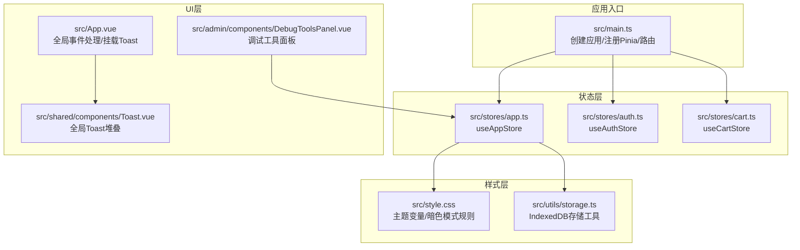
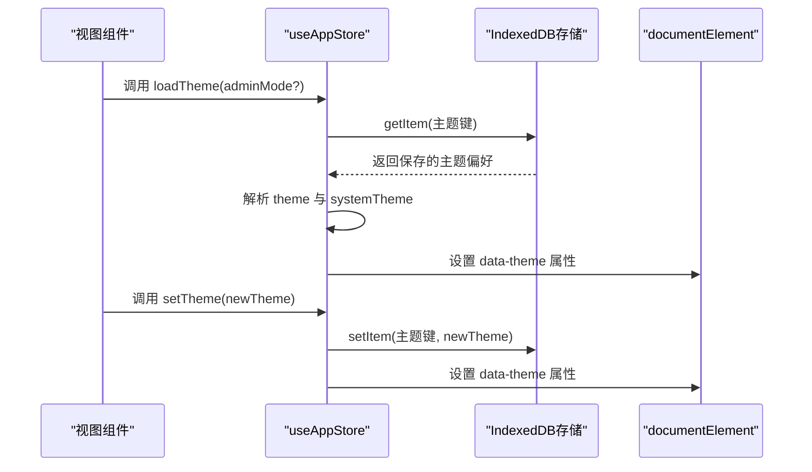
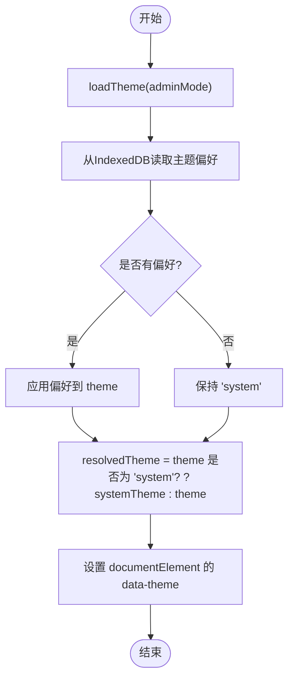
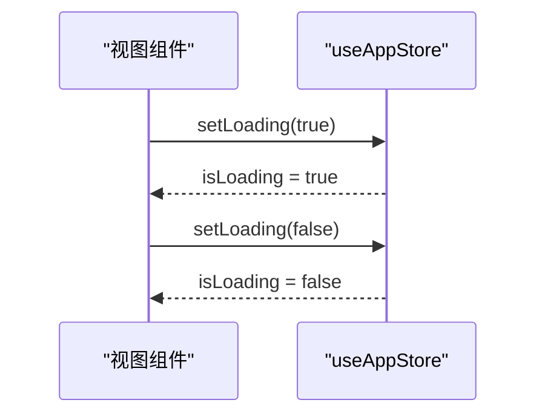
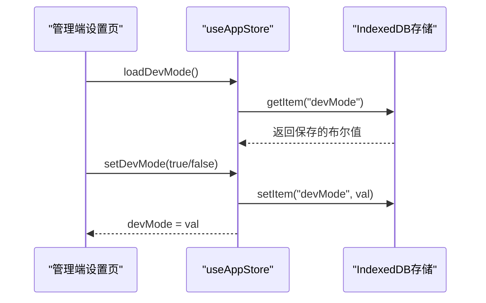
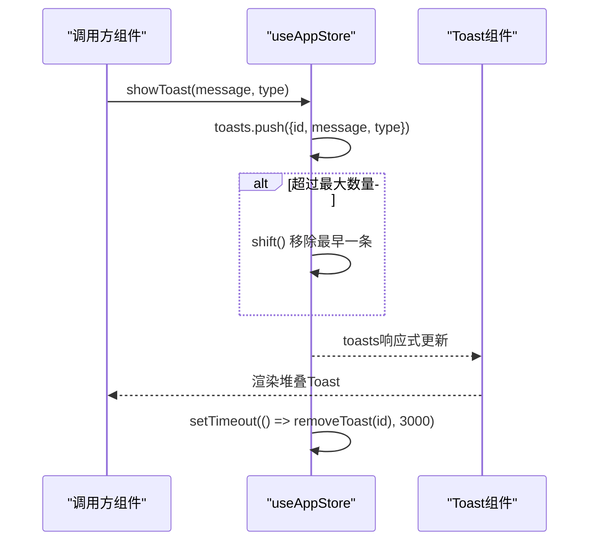
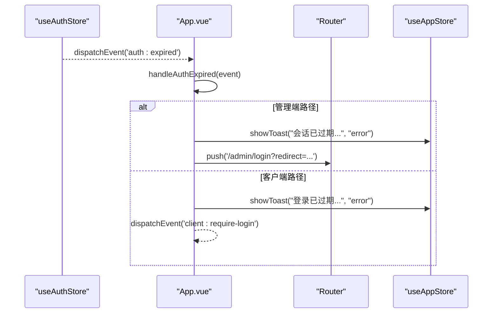
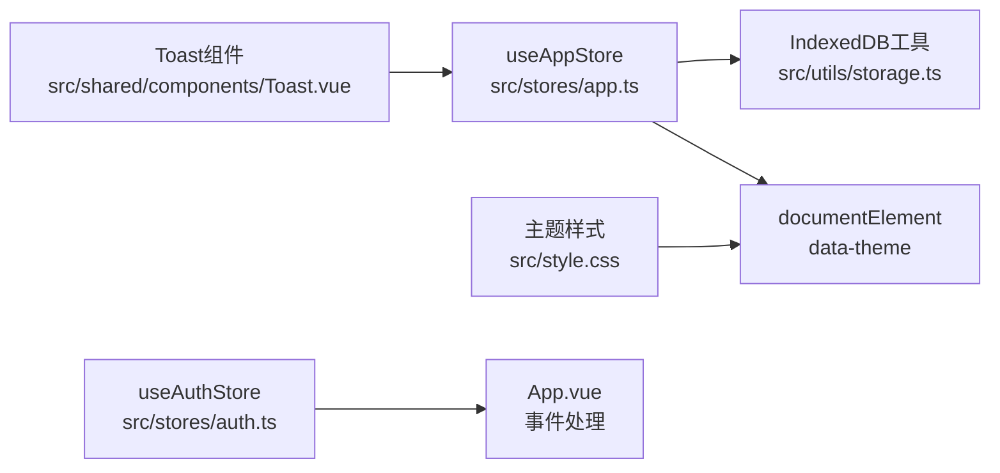

# 应用状态管理

<cite>
**本文引用的文件**
- [src/stores/app.ts](file://src/stores/app.ts)
- [src/utils/storage.ts](file://src/utils/storage.ts)
- [src/shared/components/Toast.vue](file://src/shared/components/Toast.vue)
- [src/admin/components/DebugToolsPanel.vue](file://src/admin/components/DebugToolsPanel.vue)
- [src/App.vue](file://src/App.vue)
- [src/style.css](file://src/style.css)
- [src/main.ts](file://src/main.ts)
- [src/stores/auth.ts](file://src/stores/auth.ts)
- [src/stores/cart.ts](file://src/stores/cart.ts)
</cite>

## 目录
1. [简介](#简介)
2. [项目结构](#项目结构)
3. [核心组件](#核心组件)
4. [架构总览](#架构总览)
5. [详细组件分析](#详细组件分析)
6. [依赖关系分析](#依赖关系分析)
7. [性能考量](#性能考量)
8. [故障排查指南](#故障排查指南)
9. [结论](#结论)
10. [附录](#附录)

## 简介
本文件面向RLRMS前端应用的状态管理，聚焦于应用状态store（useAppStore）的设计与实现，涵盖主题管理（light/dark/system模式）、加载状态控制、调试模式管理以及全局提示系统（Toast）。文档将深入解析主题切换机制、系统主题监听、本地存储持久化与响应式主题应用；阐述加载状态管理、调试工具开关与Toast通知系统的实现原理；分析状态持久化策略、事件监听机制与状态同步方案，并提供主题配置最佳实践、性能优化技巧与调试方法。

## 项目结构
本项目采用Pinia作为状态管理方案，状态集中在src/stores目录下，UI组件位于src/shared/components，主题样式与暗色模式变量定义在src/style.css中，入口在src/main.ts中注册Pinia与路由。

图表来源
- [src/main.ts:1-37](file://src/main.ts#L1-L37)
- [src/stores/app.ts:1-122](file://src/stores/app.ts#L1-L122)
- [src/stores/auth.ts:1-128](file://src/stores/auth.ts#L1-L128)
- [src/stores/cart.ts:1-183](file://src/stores/cart.ts#L1-L183)
- [src/App.vue:1-113](file://src/App.vue#L1-L113)
- [src/shared/components/Toast.vue:1-138](file://src/shared/components/Toast.vue#L1-L138)
- [src/admin/components/DebugToolsPanel.vue:1-800](file://src/admin/components/DebugToolsPanel.vue#L1-L800)
- [src/style.css:1-944](file://src/style.css#L1-L944)
- [src/utils/storage.ts:1-109](file://src/utils/storage.ts#L1-L109)

章节来源
- [src/main.ts:1-37](file://src/main.ts#L1-L37)
- [src/stores/app.ts:1-122](file://src/stores/app.ts#L1-L122)
- [src/style.css:1-944](file://src/style.css#L1-L944)

## 核心组件
- useAppStore：集中管理主题、加载状态、调试模式与Toast通知，提供异步持久化与系统主题监听能力。
- IndexedDB存储工具：封装openDB、getItem、setItem、removeItem、clear等方法，用于主题与购物车等状态的持久化。
- Toast组件：全局堆叠式通知展示，支持success/error/info三种类型与动画过渡。
- 主题样式系统：通过CSS变量与[data-theme="dark"]选择器实现浅色/深色主题切换与暗色模式变量覆盖。

章节来源
- [src/stores/app.ts:14-121](file://src/stores/app.ts#L14-L121)
- [src/utils/storage.ts:11-108](file://src/utils/storage.ts#L11-L108)
- [src/shared/components/Toast.vue:1-138](file://src/shared/components/Toast.vue#L1-L138)
- [src/style.css:90-115](file://src/style.css#L90-L115)

## 架构总览
useAppStore作为应用状态中心，负责：
- 主题管理：维护主题偏好（light/dark/system），解析system为实际生效主题，监听系统主题变化并同步到DOM属性[data-theme]。
- 加载状态：提供isLoading与setLoading，便于全局加载指示器控制。
- 调试模式：维护devMode状态，支持异步加载与保存，用于调试工具面板的全局联动。
- Toast通知：维护toasts数组与showToast方法，实现最多5条通知的堆叠与独立定时关闭。

图表来源
- [src/stores/app.ts:33-53](file://src/stores/app.ts#L33-L53)
- [src/utils/storage.ts:42-74](file://src/utils/storage.ts#L42-L74)

章节来源
- [src/stores/app.ts:14-121](file://src/stores/app.ts#L14-L121)
- [src/utils/storage.ts:11-108](file://src/utils/storage.ts#L11-L108)

## 详细组件分析

### 主题管理与系统主题监听
- 主题偏好类型：ThemePreference为'light' | 'dark' | 'system'。
- 系统主题监听：通过window.matchMedia('(prefers-color-scheme: dark)')监听系统主题变化，当theme为'system'时，自动将data-theme同步为systemTheme。
- 主题持久化：按adminMode区分管理员端与客户端端的主题键，分别读取与写入IndexedDB。
- 响应式主题应用：computed resolvedTheme用于计算实际生效主题，供组件消费。

图表来源
- [src/stores/app.ts:33-45](file://src/stores/app.ts#L33-L45)
- [src/stores/app.ts:10-12](file://src/stores/app.ts#L10-L12)
- [src/stores/app.ts:24-31](file://src/stores/app.ts#L24-L31)

章节来源
- [src/stores/app.ts:14-53](file://src/stores/app.ts#L14-L53)
- [src/style.css:90-115](file://src/style.css#L90-L115)

### 加载状态控制
- isLoading：布尔响应式状态，用于控制全局加载指示器。
- setLoading：对外暴露的setter，便于在API请求前后切换加载状态。

图表来源
- [src/stores/app.ts:55-59](file://src/stores/app.ts#L55-L59)

章节来源
- [src/stores/app.ts:55-59](file://src/stores/app.ts#L55-L59)

### 调试模式管理
- devMode：全局调试工具开关状态，响应式联动侧边栏。
- loadDevMode：从IndexedDB加载devMode状态。
- setDevMode：设置devMode并持久化到IndexedDB。
- 在管理端设置页中，点击调试开关时若当前开启则直接关闭并Toast提示；若当前关闭则弹出确认对话框阻止立即开启。

图表来源
- [src/stores/app.ts:64-72](file://src/stores/app.ts#L64-L72)
- [src/utils/storage.ts:42-74](file://src/utils/storage.ts#L42-L74)

章节来源
- [src/stores/app.ts:61-72](file://src/stores/app.ts#L61-L72)
- [src/admin/views/SettingsView.vue:42-73](file://src/admin/views/SettingsView.vue#L42-L73)

### 全局提示系统（Toast）
- toasts：响应式数组，存储ToastItem{id, message, type}。
- showToast：生成自增id，推入数组，限制最大长度为5，每条独立3秒定时器后移除。
- Toast组件：通过Teleport挂载到body，使用TransitionGroup实现堆叠动画与进入/离开过渡。

图表来源
- [src/stores/app.ts:74-106](file://src/stores/app.ts#L74-L106)
- [src/shared/components/Toast.vue:34-42](file://src/shared/components/Toast.vue#L34-L42)

章节来源
- [src/stores/app.ts:74-106](file://src/stores/app.ts#L74-L106)
- [src/shared/components/Toast.vue:1-138](file://src/shared/components/Toast.vue#L1-L138)

### 状态持久化策略与事件监听机制
- 持久化策略：主题与调试模式均通过IndexedDB进行异步读写，避免阻塞主线程。
- 事件监听机制：useAuthStore通过window.dispatchEvent('auth:expired')分发认证过期事件，App.vue监听并在不同路径（管理端/客户端）执行相应处理（Toast提示、路由跳转、触发登录模态）。
- 状态同步方案：useAppStore在loadTheme时读取IndexedDB并设置documentElement的data-theme，确保页面初始即处于正确的主题状态；在setTheme时同样写入并同步到DOM。

图表来源
- [src/stores/auth.ts:47-53](file://src/stores/auth.ts#L47-L53)
- [src/App.vue:17-39](file://src/App.vue#L17-L39)

章节来源
- [src/stores/auth.ts:15-127](file://src/stores/auth.ts#L15-L127)
- [src/App.vue:1-113](file://src/App.vue#L1-113)

### 与其他store的协作
- 购物车状态：useCartStore同样基于IndexedDB进行持久化，restore时并发读取购物车与订单ID，watch深度监听与防抖保存，确保状态一致性。
- 认证状态：useAuthStore负责JWT会话保活与过期事件分发，与App.vue的全局事件处理形成闭环。

章节来源
- [src/stores/cart.ts:132-167](file://src/stores/cart.ts#L132-L167)
- [src/stores/auth.ts:37-65](file://src/stores/auth.ts#L37-L65)

## 依赖关系分析
- useAppStore依赖：
  - Pinia与Vue响应式API（ref/computed）
  - IndexedDB存储工具（getItem/setItem）
  - 浏览器媒体查询监听系统主题
- Toast组件依赖：
  - useAppStore的toasts与showToast
  - Teleport与TransitionGroup实现挂载与动画
- 主题样式依赖：
  - CSS变量与[data-theme="dark"]选择器
  - documentElement的data-theme属性

图表来源
- [src/stores/app.ts:14-121](file://src/stores/app.ts#L14-L121)
- [src/utils/storage.ts:11-108](file://src/utils/storage.ts#L11-L108)
- [src/shared/components/Toast.vue:1-138](file://src/shared/components/Toast.vue#L1-L138)
- [src/style.css:90-115](file://src/style.css#L90-L115)
- [src/stores/auth.ts:15-127](file://src/stores/auth.ts#L15-L127)
- [src/App.vue:1-113](file://src/App.vue#L1-113)

章节来源
- [src/stores/app.ts:14-121](file://src/stores/app.ts#L14-L121)
- [src/shared/components/Toast.vue:1-138](file://src/shared/components/Toast.vue#L1-L138)
- [src/style.css:90-115](file://src/style.css#L90-L115)

## 性能考量
- IndexedDB懒加载：openDB使用dbPromise缓存初始化Promise，避免重复初始化带来的性能损耗。
- 异步I/O：主题与调试模式的读写均为异步，避免阻塞主线程，提升首屏渲染速度。
- 响应式最小化更新：computed resolvedTheme仅在依赖变化时计算，减少不必要的DOM更新。
- Toast堆叠优化：每条Toast独立定时器，避免相互影响；最大数量限制为5，防止内存膨胀。
- 动画与GPU加速：Toast与页面过渡使用will-change与GPU加速规则，提升动画流畅度。

章节来源
- [src/utils/storage.ts:9-40](file://src/utils/storage.ts#L9-L40)
- [src/stores/app.ts:74-106](file://src/stores/app.ts#L74-L106)
- [src/style.css:146-169](file://src/style.css#L146-L169)

## 故障排查指南
- 主题不生效或切换异常
  - 检查documentElement是否设置了正确的data-theme属性。
  - 确认系统主题监听事件是否触发，以及theme是否为'system'。
  - 验证IndexedDB中主题键是否存在且可读。
- Toast不显示或提前消失
  - 确认toasts数组是否正确推入与移除。
  - 检查每条Toast的独立定时器是否执行。
  - 确认MAX_TOASTS限制与shift逻辑是否符合预期。
- 调试模式开关无效
  - 检查IndexedDB中devMode键的读写是否成功。
  - 确认设置页的点击事件是否正确调用setDevMode。
- 认证过期事件未处理
  - 检查App.vue是否正确监听'auth:expired'事件。
  - 确认useAuthStore的会话保活定时器是否正常运行。

章节来源
- [src/stores/app.ts:24-31](file://src/stores/app.ts#L24-L31)
- [src/stores/app.ts:74-106](file://src/stores/app.ts#L74-L106)
- [src/stores/auth.ts:47-53](file://src/stores/auth.ts#L47-L53)
- [src/App.vue:17-39](file://src/App.vue#L17-L39)

## 结论
useAppStore通过Pinia与IndexedDB实现了主题、加载状态、调试模式与Toast通知的统一管理，具备良好的响应式特性与持久化能力。系统主题监听与data-theme属性结合CSS变量，提供了简洁高效的暗色模式支持。Toast堆叠与独立定时器设计提升了用户体验。建议在后续迭代中持续关注IndexedDB的健壮性与错误恢复策略，进一步优化动画与交互细节。

## 附录
- 主题配置最佳实践
  - 使用'light'/'dark'/'system'三种模式，优先考虑用户偏好与系统设置。
  - 在设置页提供直观的切换按钮与图标反馈。
  - 通过CSS变量与[data-theme]选择器实现主题切换，避免硬编码颜色。
- 性能优化技巧
  - 延迟初始化IndexedDB，避免首屏阻塞。
  - 使用异步读写，避免阻塞UI线程。
  - 控制Toast最大数量，防止内存占用过高。
  - 合理使用动画与GPU加速，提升滚动与过渡体验。
- 调试方法
  - 在管理端设置页启用调试模式，观察侧边栏联动效果。
  - 使用浏览器开发者工具查看IndexedDB中的主题与调试状态键值。
  - 监听全局事件，验证认证过期与路由跳转流程。