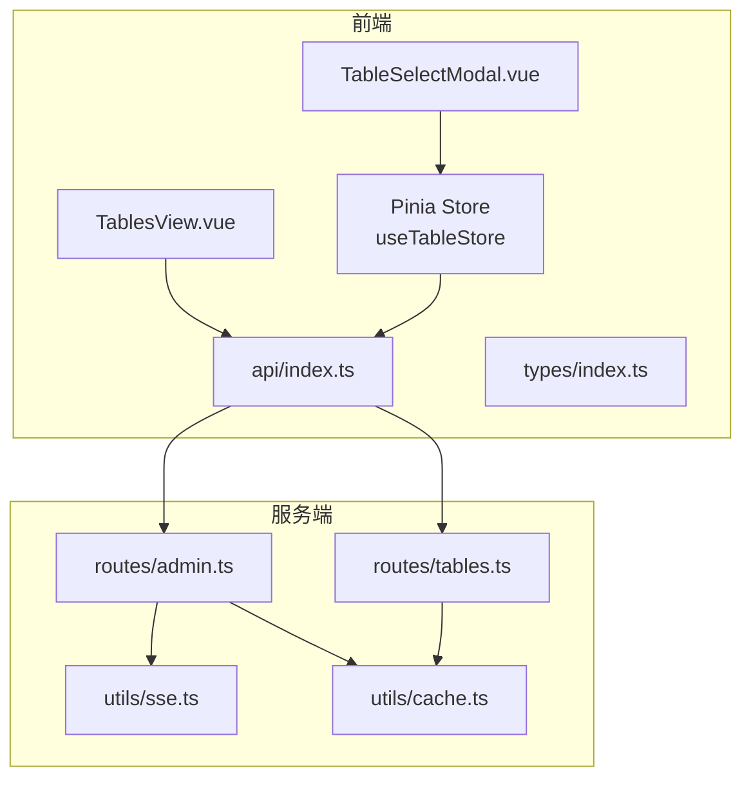
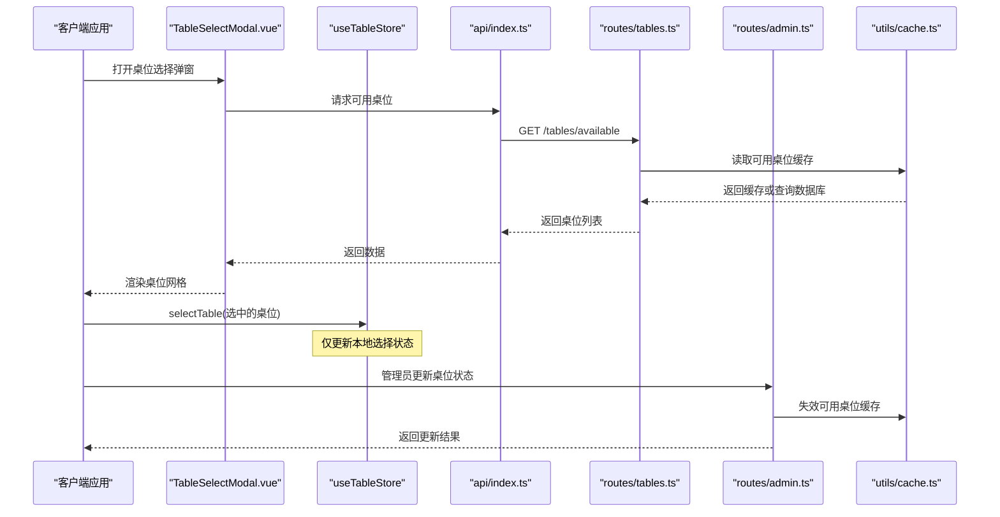
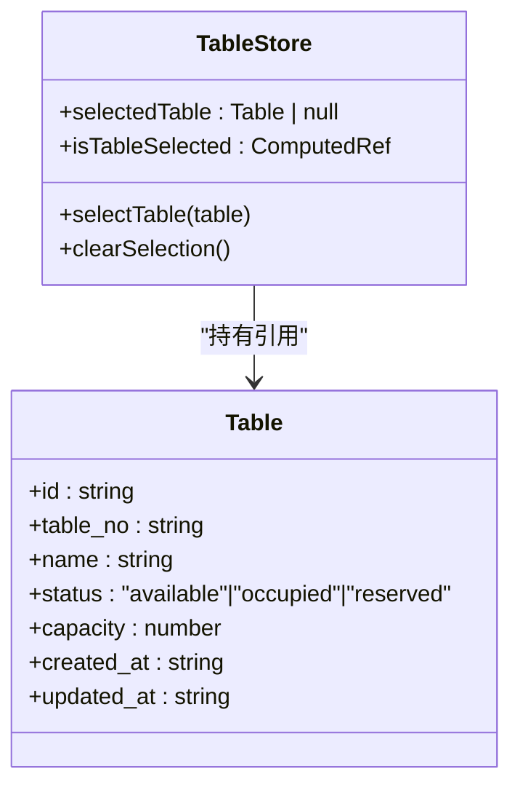
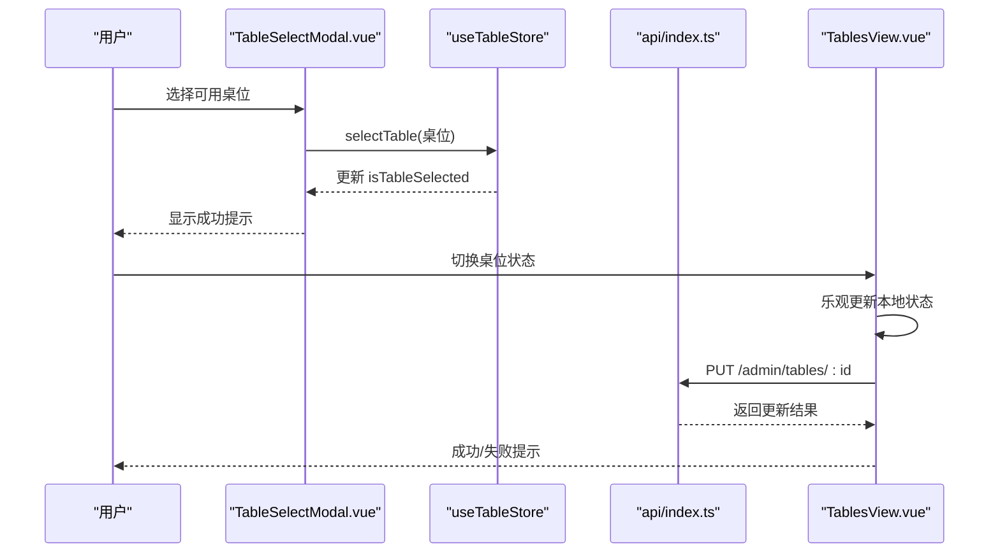
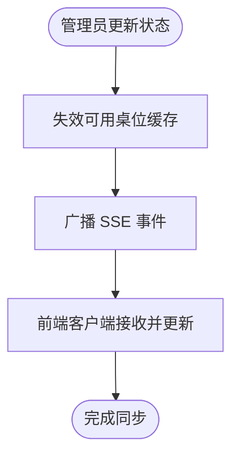
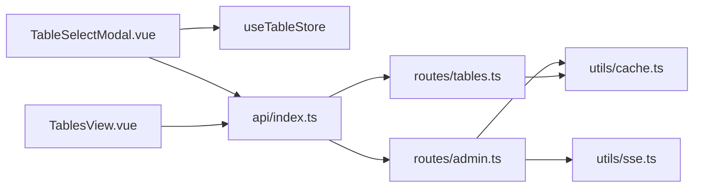

# 桌位状态管理

<cite>
**本文档引用的文件**
- [src/stores/table.ts](file://src/stores/table.ts)
- [src/client/components/TableSelectModal.vue](file://src/client/components/TableSelectModal.vue)
- [src/admin/views/TablesView.vue](file://src/admin/views/TablesView.vue)
- [src/api/index.ts](file://src/api/index.ts)
- [src/types/index.ts](file://src/types/index.ts)
- [server/src/routes/tables.ts](file://server/src/routes/tables.ts)
- [server/src/routes/admin.ts](file://server/src/routes/admin.ts)
- [server/src/utils/sse.ts](file://server/src/utils/sse.ts)
- [server/src/utils/cache.ts](file://server/src/utils/cache.ts)
</cite>

## 目录
1. [简介](#简介)
2. [项目结构](#项目结构)
3. [核心组件](#核心组件)
4. [架构总览](#架构总览)
5. [详细组件分析](#详细组件分析)
6. [依赖关系分析](#依赖关系分析)
7. [性能考量](#性能考量)
8. [故障排查指南](#故障排查指南)
9. [结论](#结论)
10. [附录](#附录)

## 简介
本文件针对 RLRMS 的桌位状态管理 store 进行深入技术文档编写，重点围绕 useTableStore 的设计与实现，覆盖以下主题：
- 桌位选择状态与锁定机制
- 状态同步与预订管理
- 桌位状态跟踪、用户绑定、超时处理与并发控制
- 桌位选择流程、状态变更通知与冲突解决机制
- 桌位状态持久化、实时同步与异常恢复策略
- 最佳实践、性能优化与用户体验设计方法

## 项目结构
本项目的桌位状态管理涉及前端 Pinia store、Vue 组件、API 层与服务端路由/缓存/SSE 工具模块。关键文件分布如下：
- 前端状态管理：src/stores/table.ts
- 用户选择界面：src/client/components/TableSelectModal.vue
- 管理员桌面：src/admin/views/TablesView.vue
- API 封装：src/api/index.ts
- 类型定义：src/types/index.ts
- 服务端路由：server/src/routes/tables.ts、server/src/routes/admin.ts
- 实时推送：server/src/utils/sse.ts
- 缓存工具：server/src/utils/cache.ts

图表来源
- [src/stores/table.ts:1-25](file://src/stores/table.ts#L1-L25)
- [src/client/components/TableSelectModal.vue:1-231](file://src/client/components/TableSelectModal.vue#L1-L231)
- [src/admin/views/TablesView.vue:1-484](file://src/admin/views/TablesView.vue#L1-L484)
- [src/api/index.ts:1-608](file://src/api/index.ts#L1-L608)
- [server/src/routes/tables.ts:1-93](file://server/src/routes/tables.ts#L1-L93)
- [server/src/routes/admin.ts:133-833](file://server/src/routes/admin.ts#L133-L833)
- [server/src/utils/sse.ts:1-59](file://server/src/utils/sse.ts#L1-L59)
- [server/src/utils/cache.ts:1-73](file://server/src/utils/cache.ts#L1-L73)

章节来源
- [src/stores/table.ts:1-25](file://src/stores/table.ts#L1-L25)
- [src/client/components/TableSelectModal.vue:1-231](file://src/client/components/TableSelectModal.vue#L1-L231)
- [src/admin/views/TablesView.vue:1-484](file://src/admin/views/TablesView.vue#L1-L484)
- [src/api/index.ts:1-608](file://src/api/index.ts#L1-L608)
- [server/src/routes/tables.ts:1-93](file://server/src/routes/tables.ts#L1-L93)
- [server/src/routes/admin.ts:133-833](file://server/src/routes/admin.ts#L133-L833)
- [server/src/utils/sse.ts:1-59](file://server/src/utils/sse.ts#L1-L59)
- [server/src/utils/cache.ts:1-73](file://server/src/utils/cache.ts#L1-L73)

## 核心组件
- useTableStore：提供桌位选择状态的响应式存储，包含选中桌位对象与选择状态计算属性，并提供选择与清空的方法。
- TableSelectModal：客户侧桌位选择弹窗，负责拉取可用桌位、展示状态图标与容量、执行选择确认并将结果写入 store。
- TablesView：管理员桌位管理页面，负责展示桌位列表、状态切换、增删改操作，并通过 API 更新后进行本地回滚保护。
- API 封装：统一的请求封装与缓存策略，提供 getTables/getAvailableTables 等接口，支持超时与 401 处理。
- 类型定义：Table 接口定义了桌位状态枚举与字段，确保前后端一致。

章节来源
- [src/stores/table.ts:5-24](file://src/stores/table.ts#L5-L24)
- [src/client/components/TableSelectModal.vue:19-82](file://src/client/components/TableSelectModal.vue#L19-L82)
- [src/admin/views/TablesView.vue:144-162](file://src/admin/views/TablesView.vue#L144-L162)
- [src/api/index.ts:173-184](file://src/api/index.ts#L173-L184)
- [src/types/index.ts:35-43](file://src/types/index.ts#L35-L43)

## 架构总览
下图展示了从用户选择到服务端持久化与缓存失效的整体流程，以及管理员端状态变更与实时推送的路径。

图表来源
- [src/client/components/TableSelectModal.vue:26-82](file://src/client/components/TableSelectModal.vue#L26-L82)
- [src/stores/table.ts:10-16](file://src/stores/table.ts#L10-L16)
- [src/api/index.ts:173-184](file://src/api/index.ts#L173-L184)
- [server/src/routes/tables.ts:58-76](file://server/src/routes/tables.ts#L58-L76)
- [server/src/routes/admin.ts:238-271](file://server/src/routes/admin.ts#L238-L271)
- [server/src/utils/cache.ts:41-54](file://server/src/utils/cache.ts#L41-L54)

## 详细组件分析

### useTableStore 设计与实现
- 状态模型
  - selectedTable：响应式引用，保存当前选中的桌位对象或空值
  - isTableSelected：基于 selectedTable 是否为空的计算属性
- 方法
  - selectTable(table)：设置当前选中桌位
  - clearSelection()：清空选中状态
- 设计特点
  - 采用组合式 API 与 Pinia 函数式 store 定义，简洁直观
  - 仅维护“选择态”，不包含锁机制或超时逻辑，避免过度复杂化

图表来源
- [src/stores/table.ts:5-24](file://src/stores/table.ts#L5-L24)
- [src/types/index.ts:35-43](file://src/types/index.ts#L35-L43)

章节来源
- [src/stores/table.ts:5-24](file://src/stores/table.ts#L5-L24)
- [src/types/index.ts:35-43](file://src/types/index.ts#L35-L43)

### 桌位选择流程与状态变更
- 客户端选择流程
  - TableSelectModal 在挂载时拉取可用桌位列表
  - 用户点击“可预订”桌位后，调用 store 的 selectTable 并提示成功
  - 该步骤仅更新本地选择状态，不涉及服务端持久化
- 管理员状态变更
  - TablesView 提供状态下拉框，切换后先本地乐观更新，再调用 API
  - API 成功后返回消息；若失败则回滚本地状态并提示错误

图表来源
- [src/client/components/TableSelectModal.vue:61-77](file://src/client/components/TableSelectModal.vue#L61-L77)
- [src/stores/table.ts:10-16](file://src/stores/table.ts#L10-L16)
- [src/admin/views/TablesView.vue:144-162](file://src/admin/views/TablesView.vue#L144-L162)
- [src/api/index.ts:297-302](file://src/api/index.ts#L297-L302)

章节来源
- [src/client/components/TableSelectModal.vue:26-82](file://src/client/components/TableSelectModal.vue#L26-L82)
- [src/admin/views/TablesView.vue:144-162](file://src/admin/views/TablesView.vue#L144-L162)
- [src/api/index.ts:297-302](file://src/api/index.ts#L297-L302)

### 状态同步与实时推送
- 服务端缓存与失效
  - 可用桌位查询使用短 TTL 缓存，更新桌位状态后主动失效缓存键
- 实时推送
  - 管理员端 SSE 事件通道提供连接确认与心跳
  - 订单状态变更会广播 order_updated 事件，便于前端增量更新
- 一致性保障
  - 乐观更新 + 失败回滚的交互模式降低用户等待时间
  - SSE 作为首选推送通道，断线后自动降级轮询

图表来源
- [server/src/routes/admin.ts:238-271](file://server/src/routes/admin.ts#L238-L271)
- [server/src/utils/cache.ts:41-54](file://server/src/utils/cache.ts#L41-L54)
- [server/src/utils/sse.ts:37-51](file://server/src/utils/sse.ts#L37-L51)

章节来源
- [server/src/routes/tables.ts:58-76](file://server/src/routes/tables.ts#L58-L76)
- [server/src/routes/admin.ts:133-162](file://server/src/routes/admin.ts#L133-L162)
- [server/src/utils/cache.ts:41-54](file://server/src/utils/cache.ts#L41-L54)
- [server/src/utils/sse.ts:37-51](file://server/src/utils/sse.ts#L37-L51)

### 并发控制与冲突解决
- 并发场景
  - 多个管理员同时修改同一桌位状态
  - 客户端在不同标签页/窗口选择同一桌位
- 冲突解决策略
  - 管理端：乐观更新 + 失败回滚，保证界面一致性
  - 客户端：store 仅维护本地选择状态，不参与并发锁
- 建议改进
  - 引入“锁定令牌/版本号”或“分布式锁”以避免竞态
  - 对高并发场景增加“预占”机制与超时释放

章节来源
- [src/admin/views/TablesView.vue:144-162](file://src/admin/views/TablesView.vue#L144-L162)
- [src/stores/table.ts:10-16](file://src/stores/table.ts#L10-L16)

### 桌位状态跟踪与持久化
- 状态枚举
  - available（可预订）、reserved（已预订）、occupied（占用中）
- 持久化路径
  - 管理员修改状态 → 服务端更新表记录 → 失效缓存 → 下次查询返回最新状态
- 查询优化
  - 可用桌位与按就餐时段过滤的可用桌位均使用短 TTL 缓存

章节来源
- [src/types/index.ts:35-43](file://src/types/index.ts#L35-L43)
- [server/src/routes/tables.ts:24-55](file://server/src/routes/tables.ts#L24-L55)
- [server/src/routes/admin.ts:238-271](file://server/src/routes/admin.ts#L238-L271)

## 依赖关系分析
- 前端依赖
  - TableSelectModal 依赖 useTableStore 与 api.getTables
  - TablesView 依赖 api.updateTableStatus 与本地状态回滚
- 服务端依赖
  - tables 路由依赖缓存工具；admin 路由依赖 SSE 广播与缓存失效
- 耦合度评估
  - 前端 store 与 UI 组件耦合度低，职责清晰
  - 服务端通过缓存与 SSE 解耦了查询与推送

图表来源
- [src/client/components/TableSelectModal.vue:19-30](file://src/client/components/TableSelectModal.vue#L19-L30)
- [src/stores/table.ts:1-3](file://src/stores/table.ts#L1-L3)
- [src/api/index.ts:173-184](file://src/api/index.ts#L173-L184)
- [src/admin/views/TablesView.vue:297-302](file://src/admin/views/TablesView.vue#L297-L302)
- [server/src/routes/tables.ts:1-11](file://server/src/routes/tables.ts#L1-L11)
- [server/src/routes/admin.ts:133-162](file://server/src/routes/admin.ts#L133-L162)
- [server/src/utils/sse.ts:1-59](file://server/src/utils/sse.ts#L1-L59)
- [server/src/utils/cache.ts:1-73](file://server/src/utils/cache.ts#L1-73)

章节来源
- [src/client/components/TableSelectModal.vue:19-30](file://src/client/components/TableSelectModal.vue#L19-L30)
- [src/admin/views/TablesView.vue:297-302](file://src/admin/views/TablesView.vue#L297-L302)
- [src/api/index.ts:173-184](file://src/api/index.ts#L173-L184)
- [server/src/routes/tables.ts:1-11](file://server/src/routes/tables.ts#L1-L11)
- [server/src/routes/admin.ts:133-162](file://server/src/routes/admin.ts#L133-L162)
- [server/src/utils/sse.ts:1-59](file://server/src/utils/sse.ts#L1-L59)
- [server/src/utils/cache.ts:1-73](file://server/src/utils/cache.ts#L1-L73)

## 性能考量
- 前端
  - 使用 Pinia 函数式 store 降低样板代码，提升开发效率
  - API 层实现缓存与超时控制，减少重复请求
- 服务端
  - 可用桌位查询使用短 TTL 缓存，平衡实时性与性能
  - SSE 与轮询双通道，保证在网络波动下的可用性
- 建议优化
  - 对高频查询引入更细粒度缓存键与失效策略
  - 在高并发场景下考虑分页与懒加载

## 故障排查指南
- 常见问题
  - 选择后状态未持久化：确认前端是否仅更新本地选择状态，非持久化行为属预期
  - 管理员修改状态失败：检查网络与 401 处理，查看本地回滚是否生效
  - 桌位状态不同步：确认缓存是否被正确失效，SSE 是否正常连接
- 排查步骤
  - 查看浏览器网络面板与控制台错误
  - 检查服务端日志与 SSE 连接状态
  - 验证缓存键与失效逻辑是否按预期工作

章节来源
- [src/admin/views/TablesView.vue:144-162](file://src/admin/views/TablesView.vue#L144-L162)
- [src/api/index.ts:94-114](file://src/api/index.ts#L94-L114)
- [server/src/utils/sse.ts:37-51](file://server/src/utils/sse.ts#L37-L51)
- [server/src/utils/cache.ts:41-54](file://server/src/utils/cache.ts#L41-L54)

## 结论
当前实现以“轻量选择态 + 管理员端状态变更”的方式满足基本需求：前端 store 专注选择态，管理员端负责状态持久化与同步。通过缓存与 SSE 的配合，系统在性能与实时性之间取得平衡。建议在未来引入并发控制与预占机制，进一步增强高并发场景下的稳定性与一致性。

## 附录
- 最佳实践
  - 保持前端 store 的单一职责，避免混入业务锁逻辑
  - 管理员端采用乐观更新 + 失败回滚，提升交互体验
  - 服务端对热点查询使用短 TTL 缓存，结合 SSE 广播实现近实时同步
- 性能优化
  - 引入更细粒度缓存键与失效策略
  - 在高并发场景下考虑分页与懒加载
- 用户体验设计
  - 明确区分“选择态”与“持久化态”，避免用户误解
  - 提供清晰的状态指示与反馈，减少误操作