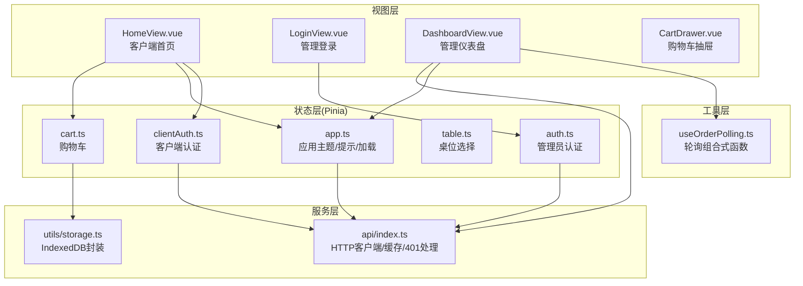
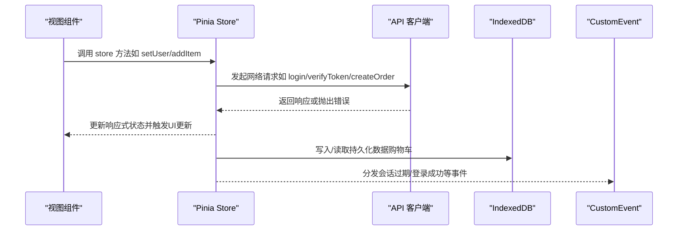
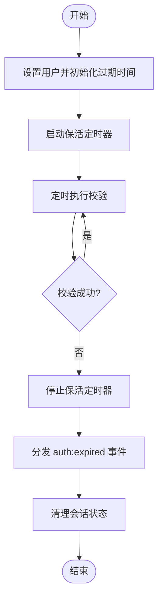
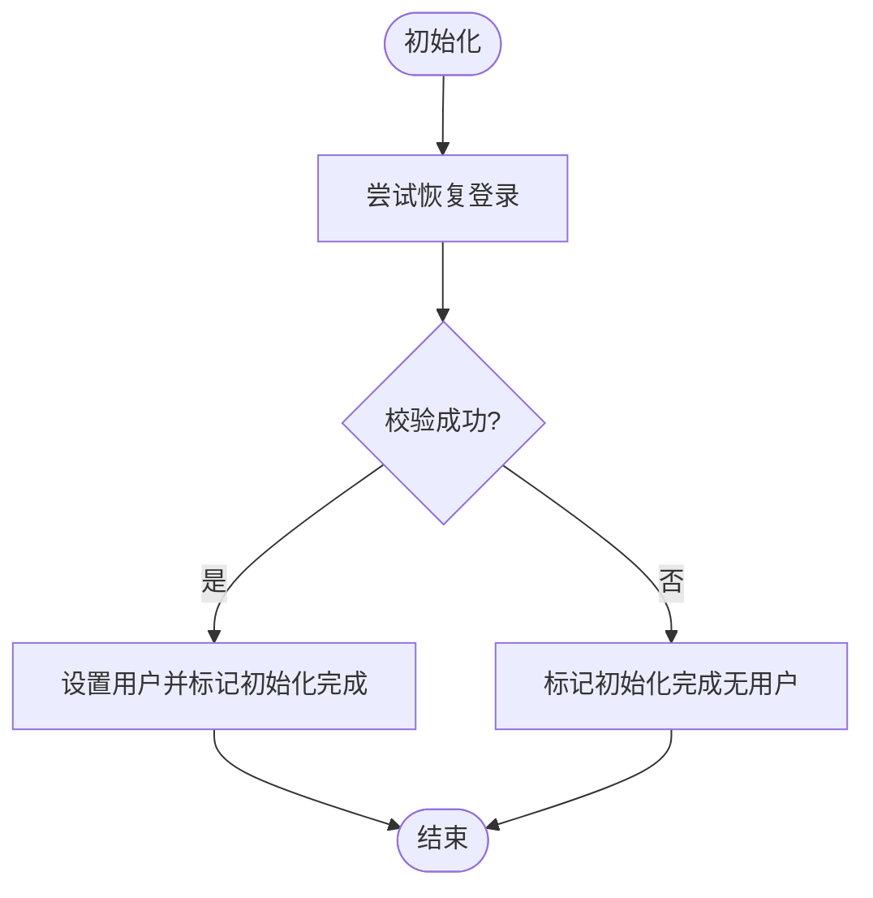
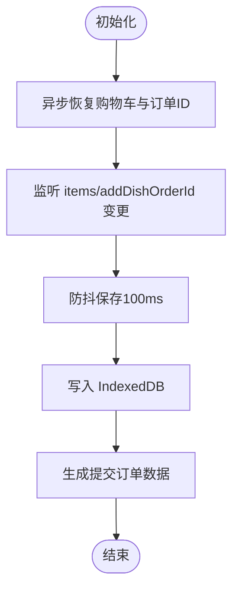
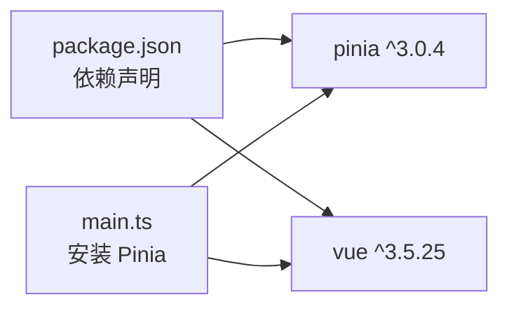

# 状态管理

<cite>
**本文引用的文件**
- [auth.ts](file://src/stores/auth.ts)
- [cart.ts](file://src/stores/cart.ts)
- [table.ts](file://src/stores/table.ts)
- [app.ts](file://src/stores/app.ts)
- [clientAuth.ts](file://src/stores/clientAuth.ts)
- [index.ts](file://src/api/index.ts)
- [index.ts](file://src/types/index.ts)
- [storage.ts](file://src/utils/storage.ts)
- [main.ts](file://src/main.ts)
- [HomeView.vue](file://src/client/views/HomeView.vue)
- [LoginView.vue](file://src/admin/views/LoginView.vue)
- [DashboardView.vue](file://src/admin/views/DashboardView.vue)
- [CartDrawer.vue](file://src/client/components/CartDrawer.vue)
- [useOrderPolling.ts](file://src/shared/composables/useOrderPolling.ts)
- [package.json](file://package.json)
</cite>

## 目录
1. [简介](#简介)
2. [项目结构](#项目结构)
3. [核心组件](#核心组件)
4. [架构总览](#架构总览)
5. [详细组件分析](#详细组件分析)
6. [依赖分析](#依赖分析)
7. [性能考虑](#性能考虑)
8. [故障排查指南](#故障排查指南)
9. [结论](#结论)
10. [附录](#附录)

## 简介
本文件面向RLRMS前端状态管理子系统，基于Pinia进行设计与实现，覆盖认证状态、购物车状态、桌位选择、应用主题与全局提示等模块。文档重点阐述以下方面：
- Store定义与职责边界
- 状态共享与跨组件订阅机制
- 异步操作处理与错误传播
- 状态持久化策略（IndexedDB）与恢复流程
- 状态同步与实时推送（SSE/轮询）
- 组合式函数在状态管理中的使用模式
- 最佳实践、性能优化与调试方法
- 高级功能（状态快照、时间旅行调试）的可扩展性建议

## 项目结构
状态管理相关代码主要分布在以下目录与文件：
- stores：Pinia Store集合（认证、购物车、桌位、应用）
- api：统一的HTTP客户端封装与缓存策略
- utils：IndexedDB封装（键值存储）
- types：前后端通用类型定义
- client/admin/views/components：各视图与组件对Store的使用
- shared/composables：组合式函数（轮询、拖拽等）

图表来源
- [auth.ts:15-127](file://src/stores/auth.ts#L15-L127)
- [clientAuth.ts:10-86](file://src/stores/clientAuth.ts#L10-L86)
- [cart.ts:9-182](file://src/stores/cart.ts#L9-L182)
- [table.ts:5-24](file://src/stores/table.ts#L5-L24)
- [app.ts:14-121](file://src/stores/app.ts#L14-L121)
- [index.ts:128-608](file://src/api/index.ts#L128-L608)
- [storage.ts:1-109](file://src/utils/storage.ts#L1-L109)
- [HomeView.vue:1-867](file://src/client/views/HomeView.vue#L1-L867)
- [LoginView.vue:1-300](file://src/admin/views/LoginView.vue#L1-L300)
- [DashboardView.vue:1-1452](file://src/admin/views/DashboardView.vue#L1-L1452)
- [CartDrawer.vue:1-314](file://src/client/components/CartDrawer.vue#L1-L314)
- [useOrderPolling.ts:10-74](file://src/shared/composables/useOrderPolling.ts#L10-L74)

章节来源
- [main.ts:1-37](file://src/main.ts#L1-L37)
- [package.json:16-41](file://package.json#L16-L41)

## 核心组件
- 认证状态（管理员）：负责JWT会话生命周期、保活检测、过期事件分发与清理。
- 客户端认证：负责客户态登录态恢复、显示名与手机号后四位派生计算。
- 购物车：负责菜品项增删改、数量更新、小计与总计计算、IndexedDB持久化与恢复。
- 桌位选择：负责当前选中桌位的读取与清空。
- 应用状态：负责主题（浅色/深色/跟随系统）、全局加载指示、开发调试模式、Toast通知队列。

章节来源
- [auth.ts:15-127](file://src/stores/auth.ts#L15-L127)
- [clientAuth.ts:10-86](file://src/stores/clientAuth.ts#L10-L86)
- [cart.ts:9-182](file://src/stores/cart.ts#L9-L182)
- [table.ts:5-24](file://src/stores/table.ts#L5-L24)
- [app.ts:14-121](file://src/stores/app.ts#L14-L121)

## 架构总览
Pinia Store作为单一事实来源，通过API层与后端交互；购物车状态通过IndexedDB实现跨会话持久化；Dashboard通过SSE与轮询实现订单状态的实时同步；视图层通过组合式函数与事件总线实现松耦合的状态订阅与UI联动。

图表来源
- [auth.ts:37-55](file://src/stores/auth.ts#L37-L55)
- [cart.ts:113-150](file://src/stores/cart.ts#L113-L150)
- [index.ts:54-114](file://src/api/index.ts#L54-L114)

## 详细组件分析

### 认证状态管理（管理员）
职责与行为
- 维护用户信息、认证状态、会话过期时间戳
- 提供会话保活定时器，周期性调用后端校验
- 在保活失败或API返回401时，分发自定义事件以触发全局登录态清理
- 提供登录成功设置用户、登出与清理会话的方法

图表来源
- [auth.ts:37-96](file://src/stores/auth.ts#L37-L96)

章节来源
- [auth.ts:15-127](file://src/stores/auth.ts#L15-L127)
- [index.ts:94-104](file://src/api/index.ts#L94-L104)

### 客户端认证状态管理
职责与行为
- 维护客户端用户信息与初始化标志
- 提供手机号后四位与显示名的派生计算
- 支持尝试恢复登录（通过后端校验），并在失败时标记初始化完成
- 提供登出与本地清理方法

图表来源
- [clientAuth.ts:38-54](file://src/stores/clientAuth.ts#L38-L54)

章节来源
- [clientAuth.ts:10-86](file://src/stores/clientAuth.ts#L10-L86)
- [index.ts:278-286](file://src/api/index.ts#L278-L286)

### 购物车状态管理
职责与行为
- 维护购物车项数组、下单关联的订单ID、恢复完成标志
- 提供增删改查、数量更新、清空、生成提交订单数据等方法
- 通过watch与防抖兜底，将状态持久化至IndexedDB
- 启动时异步恢复购物车与订单ID，并在恢复完成后才允许持久化

图表来源
- [cart.ts:133-167](file://src/stores/cart.ts#L133-L167)
- [storage.ts:42-91](file://src/utils/storage.ts#L42-L91)

章节来源
- [cart.ts:9-182](file://src/stores/cart.ts#L9-L182)
- [storage.ts:1-109](file://src/utils/storage.ts#L1-L109)

### 桌位状态管理
职责与行为
- 维护当前选中桌位与“是否已选择”的派生状态
- 提供选择与清空方法

章节来源
- [table.ts:5-24](file://src/stores/table.ts#L5-L24)

### 应用状态管理
职责与行为
- 主题管理：支持浅色/深色/跟随系统，监听系统主题变化并解析实际生效主题
- 全局加载指示、开发调试模式（持久化）
- Toast通知队列：最多保留N条，超限移除最早一条，独立定时器自动移除

章节来源
- [app.ts:14-121](file://src/stores/app.ts#L14-L121)

### 视图与组件中的状态使用模式
- 客户端首页：在挂载阶段拉取首页数据、尝试恢复客户端登录、根据可用桌位决定是否展示“桌位已满”提示；绑定购物车抽屉与数量控制组件。
- 管理登录：调用API登录后设置管理员用户，触发全局提示与路由跳转。
- 管理仪表盘：通过SSE与轮询实现订单实时更新，支持搜索、筛选与状态变更。

章节来源
- [HomeView.vue:68-210](file://src/client/views/HomeView.vue#L68-L210)
- [LoginView.vue:20-42](file://src/admin/views/LoginView.vue#L20-L42)
- [DashboardView.vue:302-461](file://src/admin/views/DashboardView.vue#L302-L461)

### 组合式函数与状态订阅
- useOrderPolling：封装轮询逻辑，支持按页面可见性启停、SSE连接状态下的降级策略、新增订单检测回调。
- 事件总线：通过CustomEvent在认证过期、客户端登录结果等场景进行跨组件通信。

章节来源
- [useOrderPolling.ts:10-74](file://src/shared/composables/useOrderPolling.ts#L10-L74)
- [auth.ts:47-53](file://src/stores/auth.ts#L47-L53)
- [HomeView.vue:180-195](file://src/client/views/HomeView.vue#L180-L195)

## 依赖分析
- Pinia版本：^3.0.4
- Vue版本：^3.5.25
- 依赖注入：在应用入口安装Pinia并挂载
- 类型系统：统一的类型定义贯穿API、Store与视图

图表来源
- [package.json:32-37](file://package.json#L32-L37)
- [main.ts:9-9](file://src/main.ts#L9-L9)

章节来源
- [package.json:16-41](file://package.json#L16-L41)
- [main.ts:1-37](file://src/main.ts#L1-L37)

## 性能考虑
- API缓存：采用Map内存缓存与TTL（stale-while-revalidate），热点数据快速返回并后台刷新，降低网络压力。
- 请求超时与信号合并：统一的请求封装支持超时与AbortController信号合并，避免竞态与悬挂请求。
- 购物车持久化：使用防抖与显式保存相结合，减少IndexedDB写入频率；仅在恢复完成后持久化，避免无效IO。
- 主题切换：监听系统主题变化时仅在主题策略为“系统”时更新，避免不必要的DOM属性变更。
- 轮询与SSE：优先使用SSE，断线时启用轮询并自动重连；页面隐藏时停止轮询，恢复可见时重启。

章节来源
- [index.ts:14-34](file://src/api/index.ts#L14-L34)
- [index.ts:54-126](file://src/api/index.ts#L54-L126)
- [cart.ts:153-158](file://src/stores/cart.ts#L153-L158)
- [app.ts:24-31](file://src/stores/app.ts#L24-L31)
- [DashboardView.vue:308-446](file://src/admin/views/DashboardView.vue#L308-L446)

## 故障排查指南
常见问题与定位思路
- 会话过期未触发：检查认证Store的保活定时器是否启动、API 401处理是否正确分发事件；确认事件监听方是否在路由守卫或根组件中注册。
- 购物车丢失：确认restore是否完成（restored标志）、IndexedDB是否可用；查看防抖保存是否被触发。
- 订单未实时更新：检查SSE连接状态与断线重连逻辑；若SSE不可用，确认轮询是否启动。
- 主题未生效：确认loadTheme/setTheme调用链、系统主题监听是否注册、DOM属性data-theme是否更新。

章节来源
- [auth.ts:37-96](file://src/stores/auth.ts#L37-L96)
- [cart.ts:133-167](file://src/stores/cart.ts#L133-L167)
- [DashboardView.vue:308-446](file://src/admin/views/DashboardView.vue#L308-L446)
- [app.ts:33-53](file://src/stores/app.ts#L33-L53)

## 结论
本状态管理方案以Pinia为核心，结合API缓存、IndexedDB持久化与SSE/轮询同步，实现了高可用、低耦合的状态共享与异步处理。通过组合式函数与事件总线，进一步解耦了视图与状态逻辑。建议在后续迭代中引入状态快照与时间旅行调试能力，以提升开发与排错效率。

## 附录

### 状态持久化策略
- 购物车：使用IndexedDB键值存储，分别持久化购物车项与下单关联的订单ID；恢复完成后才允许持久化，避免覆盖。
- 主题与开发模式：使用localStorage键值存储，便于跨页面共享。

章节来源
- [cart.ts:113-130](file://src/stores/cart.ts#L113-L130)
- [storage.ts:42-91](file://src/utils/storage.ts#L42-L91)
- [app.ts:33-72](file://src/stores/app.ts#L33-L72)

### 状态同步机制
- SSE：管理端仪表盘优先使用SSE接收增量事件，断线后自动启用轮询。
- 轮询：在SSE不可用或页面不可见时启用，恢复可见时停止轮询。
- 事件总线：认证过期、客户端登录结果等跨组件通信。

章节来源
- [DashboardView.vue:308-446](file://src/admin/views/DashboardView.vue#L308-L446)
- [useOrderPolling.ts:19-47](file://src/shared/composables/useOrderPolling.ts#L19-L47)
- [auth.ts:47-53](file://src/stores/auth.ts#L47-L53)

### 状态重置方案
- 认证：提供logout与clearSession，停止保活定时器并清空用户信息。
- 购物车：提供clearCart，清空项与订单ID并持久化。
- 应用：提供setLoading、setDevMode、toasts队列管理等。

章节来源
- [auth.ts:90-96](file://src/stores/auth.ts#L90-L96)
- [cart.ts:69-75](file://src/stores/cart.ts#L69-L75)
- [app.ts:55-106](file://src/stores/app.ts#L55-L106)

### 组合式函数使用模式
- useOrderPolling：封装轮询启停、页面可见性处理、新增订单检测回调，便于在多个视图中复用。
- 在仪表盘中结合SSE与轮询，实现高可靠的状态同步。

章节来源
- [useOrderPolling.ts:10-74](file://src/shared/composables/useOrderPolling.ts#L10-L74)
- [DashboardView.vue:414-446](file://src/admin/views/DashboardView.vue#L414-L446)

### API与类型
- API封装：统一的请求函数、缓存策略、401处理与可取消请求工厂。
- 类型定义：涵盖用户、菜品、订单、库存、表单等核心业务模型。

章节来源
- [index.ts:54-126](file://src/api/index.ts#L54-L126)
- [index.ts:1-133](file://src/types/index.ts#L1-L133)