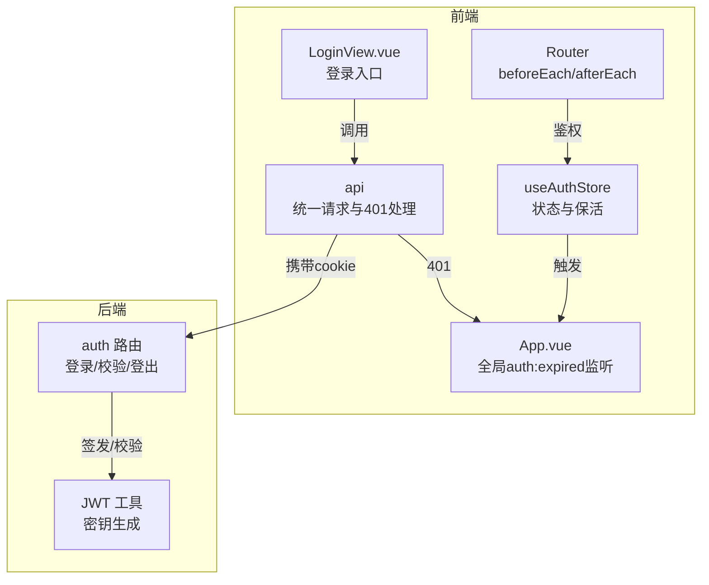
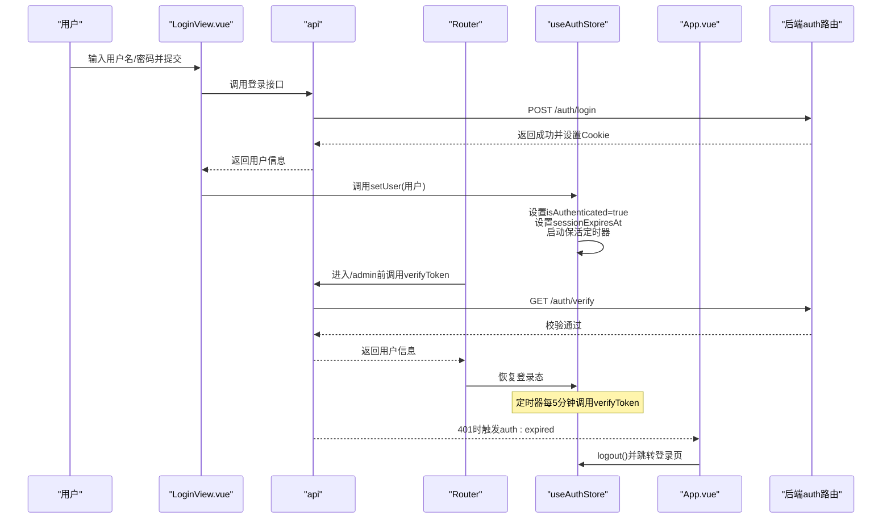
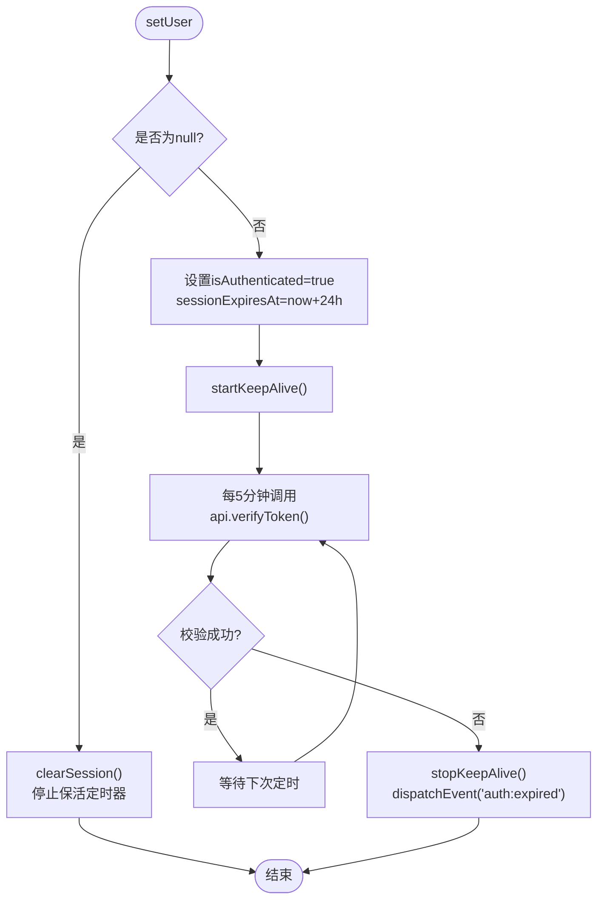
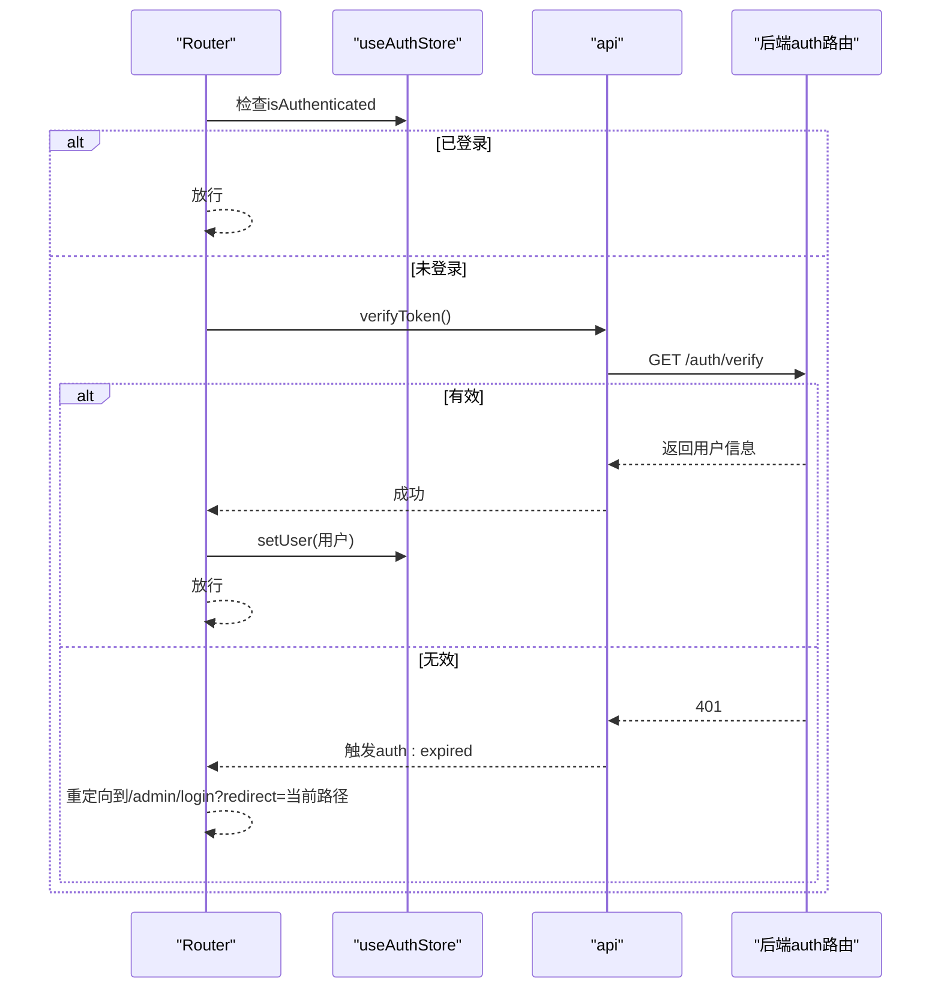
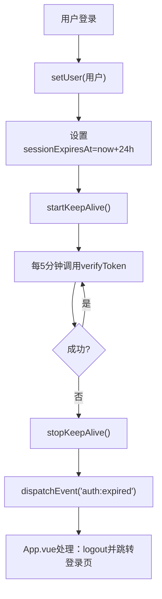
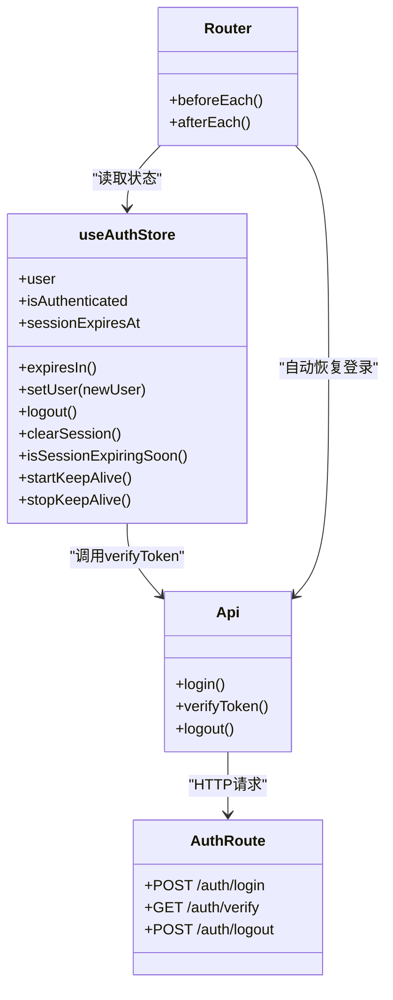

# 管理员认证状态

<cite>
**本文引用的文件列表**
- [src/stores/auth.ts](file://src/stores/auth.ts)
- [src/api/index.ts](file://src/api/index.ts)
- [src/router/index.ts](file://src/router/index.ts)
- [src/admin/views/LoginView.vue](file://src/admin/views/LoginView.vue)
- [src/App.vue](file://src/App.vue)
- [server/src/routes/auth.ts](file://server/src/routes/auth.ts)
- [server/src/utils/jwt.ts](file://server/src/utils/jwt.ts)
- [src/types/index.ts](file://src/types/index.ts)
- [src/utils/storage.ts](file://src/utils/storage.ts)
</cite>

## 目录
1. [简介](#简介)
2. [项目结构与角色定位](#项目结构与角色定位)
3. [核心组件总览](#核心组件总览)
4. [架构概览](#架构概览)
5. [详细组件分析](#详细组件分析)
6. [依赖关系分析](#依赖关系分析)
7. [性能与可用性考量](#性能与可用性考量)
8. [故障排查指南](#故障排查指南)
9. [结论](#结论)
10. [附录](#附录)

## 简介
本文件面向RLRMS管理端的管理员认证状态管理，围绕useAuthStore进行深入技术文档化，覆盖登录状态管理、JWT令牌生命周期、会话保活、自动登录恢复、权限校验、路由守卫、错误处理与安全策略等主题。文档以代码为依据，结合架构图与流程图，帮助开发者与运维人员理解并正确使用该认证状态管理方案。

## 项目结构与角色定位
- 前端状态层：Pinia Store（useAuthStore）负责管理员登录态、会话过期时间、保活定时器与状态暴露。
- 前端网络层：统一API封装（api），负责携带cookie、处理401、触发全局“会话过期”事件。
- 前端路由层：Vue Router的beforeEach守卫对/admin路由进行鉴权；afterEach进行预取优化。
- 后端接口层：Express路由提供/admin登录、校验、登出；JWT密钥由服务端工具生成。
- 全局事件层：App.vue监听“auth:expired”，统一对管理员与客户侧会话过期进行处理。

图表来源
- [src/stores/auth.ts:15-127](file://src/stores/auth.ts#L15-L127)
- [src/api/index.ts:246-261](file://src/api/index.ts#L246-L261)
- [src/router/index.ts:201-277](file://src/router/index.ts#L201-L277)
- [src/admin/views/LoginView.vue:20-42](file://src/admin/views/LoginView.vue#L20-L42)
- [src/App.vue:16-39](file://src/App.vue#L16-L39)
- [server/src/routes/auth.ts:65-179](file://server/src/routes/auth.ts#L65-L179)
- [server/src/utils/jwt.ts:20-26](file://server/src/utils/jwt.ts#L20-L26)

章节来源
- [src/stores/auth.ts:15-127](file://src/stores/auth.ts#L15-L127)
- [src/api/index.ts:246-261](file://src/api/index.ts#L246-L261)
- [src/router/index.ts:201-277](file://src/router/index.ts#L201-L277)
- [src/admin/views/LoginView.vue:20-42](file://src/admin/views/LoginView.vue#L20-L42)
- [src/App.vue:16-39](file://src/App.vue#L16-L39)
- [server/src/routes/auth.ts:65-179](file://server/src/routes/auth.ts#L65-L179)
- [server/src/utils/jwt.ts:20-26](file://server/src/utils/jwt.ts#L20-L26)

## 核心组件总览
- useAuthStore：管理员登录态、会话过期时间计算、保活定时器、登出与状态清理。
- api.verifyToken：从cookie读取JWT并校验，401时触发全局“auth:expired”事件。
- Router beforeEach：对/admin路由进行鉴权，支持从cookie自动恢复登录。
- App.vue：全局监听“auth:expired”，区分管理员与客户路径，执行登出与跳转。
- 后端auth路由：登录签发JWT Cookie、校验Cookie中的JWT、登出清除Cookie。
- JWT工具：开发/生产环境密钥生成策略。

章节来源
- [src/stores/auth.ts:15-127](file://src/stores/auth.ts#L15-L127)
- [src/api/index.ts:253-255](file://src/api/index.ts#L253-L255)
- [src/router/index.ts:249-273](file://src/router/index.ts#L249-L273)
- [src/App.vue:16-39](file://src/App.vue#L16-L39)
- [server/src/routes/auth.ts:65-179](file://server/src/routes/auth.ts#L65-L179)
- [server/src/utils/jwt.ts:20-26](file://server/src/utils/jwt.ts#L20-L26)

## 架构概览
管理员认证状态管理采用“前端Pinia状态 + 后端JWT Cookie”的经典方案：
- 登录：前端提交凭据，后端校验并通过JWT签名，设置httpOnly Cookie。
- 鉴权：前端每次请求携带Cookie；后端校验JWT；401时统一返回并触发前端全局事件。
- 自动登录：路由守卫在进入受保护路由时调用api.verifyToken，若存在有效Cookie则恢复登录态。
- 会话保活：登录后启动定时器定期调用api.verifyToken，失败即触发过期事件并登出。
- 过期处理：App.vue统一接收“auth:expired”，管理员路径跳转至登录页并清空状态。

图表来源
- [src/admin/views/LoginView.vue:20-42](file://src/admin/views/LoginView.vue#L20-L42)
- [src/api/index.ts:246-261](file://src/api/index.ts#L246-L261)
- [src/router/index.ts:249-273](file://src/router/index.ts#L249-L273)
- [src/stores/auth.ts:71-85](file://src/stores/auth.ts#L71-L85)
- [src/App.vue:16-39](file://src/App.vue#L16-L39)
- [server/src/routes/auth.ts:65-179](file://server/src/routes/auth.ts#L65-L179)

## 详细组件分析

### useAuthStore 设计与实现
- 状态字段
  - user：当前管理员用户信息（可为空）
  - isAuthenticated：是否已登录
  - sessionExpiresAt：会话过期时间戳（毫秒）
- 计算属性
  - expiresIn：剩余过期秒数，过期或不存在时为0
- 关键方法
  - setUser：设置用户并初始化过期时间，启动保活定时器；传入null则清理状态并停止保活
  - startKeepAlive/stopKeepAlive：周期性调用api.verifyToken，失败则触发“auth:expired”并停止保活
  - isSessionExpiringSoon：判断是否在30分钟内过期
  - logout/clearSession：登出与清理，均会停止保活定时器
- 保活策略
  - 保活间隔：5分钟
  - 过期时间：24小时
  - 即将过期阈值：30分钟

图表来源
- [src/stores/auth.ts:71-85](file://src/stores/auth.ts#L71-L85)
- [src/stores/auth.ts:37-55](file://src/stores/auth.ts#L37-L55)
- [src/stores/auth.ts:89-96](file://src/stores/auth.ts#L89-L96)

章节来源
- [src/stores/auth.ts:15-127](file://src/stores/auth.ts#L15-L127)

### 登录流程与自动登录恢复
- 登录入口：LoginView.vue
  - 校验输入，调用api.login(username, password)
  - 成功后调用authStore.setUser(res.data.user)，随后根据redirect参数跳转
- 自动登录恢复：Router beforeEach
  - 对requiresAuth=true的/admin路由，先检查authStore.isAuthenticated
  - 若未登录，则调用api.verifyToken，成功则恢复用户信息并放行
  - 失败则重定向到/admin/login?redirect=当前路径

图表来源
- [src/router/index.ts:249-273](file://src/router/index.ts#L249-L273)
- [src/api/index.ts:253-255](file://src/api/index.ts#L253-L255)
- [server/src/routes/auth.ts:157-179](file://server/src/routes/auth.ts#L157-L179)

章节来源
- [src/admin/views/LoginView.vue:20-42](file://src/admin/views/LoginView.vue#L20-L42)
- [src/router/index.ts:249-273](file://src/router/index.ts#L249-L273)

### 令牌刷新与会话保活
- 保活机制：登录后启动定时器，每5分钟调用api.verifyToken
- 失效处理：校验失败时停止保活并触发“auth:expired”，App.vue统一处理
- 过期时间：登录时设置为当前时间+24小时；experesIn计算剩余秒数
- 即将过期提醒：isSessionExpiringSoon用于UI提示

图表来源
- [src/stores/auth.ts:71-85](file://src/stores/auth.ts#L71-L85)
- [src/stores/auth.ts:37-55](file://src/stores/auth.ts#L37-L55)
- [src/App.vue:16-39](file://src/App.vue#L16-L39)

章节来源
- [src/stores/auth.ts:27-31](file://src/stores/auth.ts#L27-L31)
- [src/stores/auth.ts:109-113](file://src/stores/auth.ts#L109-L113)

### 登出与状态重置
- 登出：authStore.logout()内部调用clearSession()，停止保活定时器并清空状态
- 后端登出：api.logout()调用后端POST /auth/logout，清除Cookie
- 路由守卫：Router afterEach不参与登出逻辑，但全局事件处理确保登出后跳转登录页

章节来源
- [src/stores/auth.ts:90-103](file://src/stores/auth.ts#L90-L103)
- [src/api/index.ts:257-261](file://src/api/index.ts#L257-L261)
- [server/src/routes/auth.ts:146-155](file://server/src/routes/auth.ts#L146-L155)

### 权限验证与路由守卫
- 路由元信息：/admin路由设置meta.requiresAuth=true
- beforeEach守卫：
  - 更新document.title
  - 对requiresAuth=true的/admin路由，优先检查authStore.isAuthenticated
  - 若未登录，调用api.verifyToken尝试自动恢复
  - 失败则重定向到/admin/login?redirect=当前路径
- afterEach：根据当前路由进行相关页面的预取优化

章节来源
- [src/router/index.ts:94-176](file://src/router/index.ts#L94-L176)
- [src/router/index.ts:201-277](file://src/router/index.ts#L201-L277)

### 错误处理与全局事件
- API层：当响应为401且非跳过处理时，触发window.dispatchEvent('auth:expired')
- 前端：App.vue监听该事件，区分管理员与客户路径，执行toast提示、登出或触发登录模态
- 登录视图：捕获登录异常并显示错误提示

章节来源
- [src/api/index.ts:94-104](file://src/api/index.ts#L94-L104)
- [src/App.vue:16-39](file://src/App.vue#L16-L39)
- [src/admin/views/LoginView.vue:37-41](file://src/admin/views/LoginView.vue#L37-L41)

### 安全令牌管理
- 后端JWT密钥
  - 开发环境：基于主机特征派生固定密钥，保证热更新不使旧token失效
  - 生产环境：默认使用随机密钥，也可通过JWT_SECRET环境变量显式指定
- Cookie策略
  - httpOnly=true，secure按环境设置，sameSite=lax，maxAge=1天
  - 登出时清除Cookie
- 登录速率限制：基于IP的15分钟窗口内最多5次尝试

章节来源
- [server/src/utils/jwt.ts:20-26](file://server/src/utils/jwt.ts#L20-L26)
- [server/src/routes/auth.ts:57-61](file://server/src/routes/auth.ts#L57-L61)
- [server/src/routes/auth.ts:65-144](file://server/src/routes/auth.ts#L65-L144)

### 认证状态持久化与自动登录恢复
- 当前实现：登录成功后在useAuthStore中设置用户与过期时间，并启动保活定时器
- Cookie持久化：后端通过Cookie保存JWT，Router beforeEach在进入受保护路由时调用api.verifyToken进行自动恢复
- IndexedDB存储：仓库包含通用IndexedDB工具，但当前认证状态未使用该存储；如需持久化可扩展

章节来源
- [src/stores/auth.ts:71-85](file://src/stores/auth.ts#L71-L85)
- [src/router/index.ts:259-269](file://src/router/index.ts#L259-L269)
- [src/utils/storage.ts:1-109](file://src/utils/storage.ts#L1-L109)

## 依赖关系分析

图表来源
- [src/stores/auth.ts:15-127](file://src/stores/auth.ts#L15-L127)
- [src/api/index.ts:246-261](file://src/api/index.ts#L246-L261)
- [src/router/index.ts:201-277](file://src/router/index.ts#L201-L277)
- [server/src/routes/auth.ts:65-179](file://server/src/routes/auth.ts#L65-L179)

章节来源
- [src/stores/auth.ts:15-127](file://src/stores/auth.ts#L15-L127)
- [src/api/index.ts:246-261](file://src/api/index.ts#L246-L261)
- [src/router/index.ts:201-277](file://src/router/index.ts#L201-L277)
- [server/src/routes/auth.ts:65-179](file://server/src/routes/auth.ts#L65-L179)

## 性能与可用性考量
- 会话保活频率：每5分钟一次，开销极小，适合长会话场景
- 前端缓存：api层对部分数据采用stale-while-revalidate策略，提升首屏与切换体验
- 路由预取：afterEach在空闲时预取相关页面，减少二次交互延迟
- 登录速率限制：后端对IP进行15分钟窗口内的5次尝试限制，防暴力破解

章节来源
- [src/stores/auth.ts:37-55](file://src/stores/auth.ts#L37-L55)
- [src/api/index.ts:9-34](file://src/api/index.ts#L9-L34)
- [src/router/index.ts:283-314](file://src/router/index.ts#L283-L314)
- [server/src/routes/auth.ts:34-55](file://server/src/routes/auth.ts#L34-L55)

## 故障排查指南
- 401会话过期
  - 现象：页面出现“会话已过期，请重新登录”
  - 处理：App.vue统一处理，管理员路径跳转到/admin/login并清空状态
  - 排查：检查后端JWT密钥是否变化、Cookie是否被清除、网络请求是否携带Cookie
- 登录失败
  - 现象：LoginView显示“用户名或密码错误”
  - 排查：确认用户名/密码正确、后端用户存在且角色为admin、bcrypt密码匹配
- 自动登录失败
  - 现象：进入/admin路由被重定向到登录页
  - 排查：确认Cookie存在且未过期、api.verifyToken返回401、后端JWT校验失败
- 保活异常
  - 现象：定时器未启动或频繁触发过期
  - 排查：检查setUser调用、定时器状态、网络连通性

章节来源
- [src/App.vue:16-39](file://src/App.vue#L16-L39)
- [src/admin/views/LoginView.vue:37-41](file://src/admin/views/LoginView.vue#L37-L41)
- [src/router/index.ts:259-273](file://src/router/index.ts#L259-L273)
- [server/src/routes/auth.ts:157-179](file://server/src/routes/auth.ts#L157-L179)

## 结论
useAuthStore提供了简洁而稳健的管理员认证状态管理：登录态、过期时间、保活与登出均有清晰职责划分；配合Router守卫与全局事件处理，实现了自动登录恢复与一致的用户体验。后端JWT与Cookie策略兼顾安全性与可用性。建议在后续迭代中评估是否引入IndexedDB持久化以增强跨标签页与多设备的一致性体验。

## 附录
- 类型定义参考：User/AdminUser/AuthResponse等类型定义
- 存储工具：通用IndexedDB封装，可用于扩展持久化需求

章节来源
- [src/types/index.ts:9-32](file://src/types/index.ts#L9-L32)
- [src/utils/storage.ts:1-109](file://src/utils/storage.ts#L1-L109)