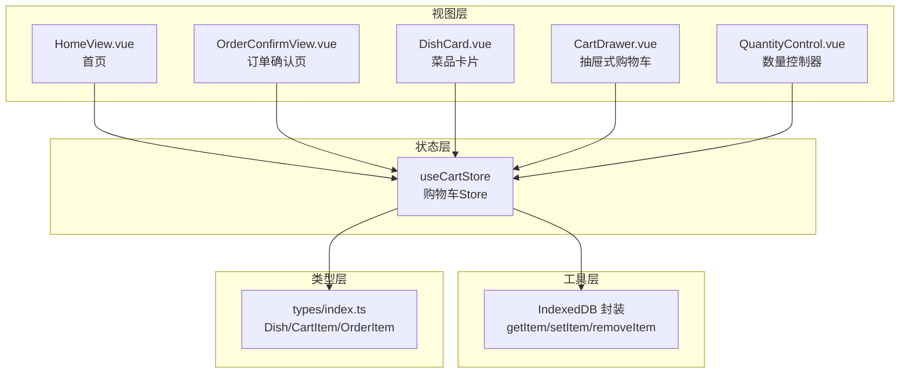
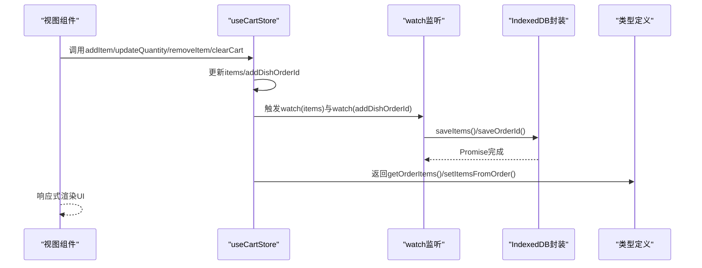
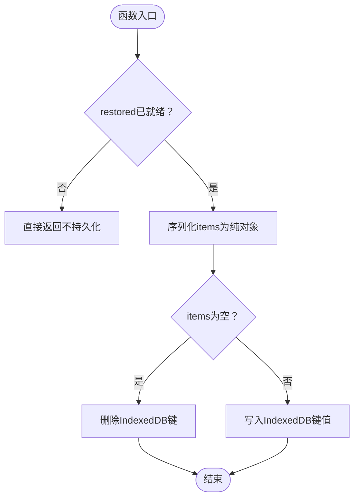
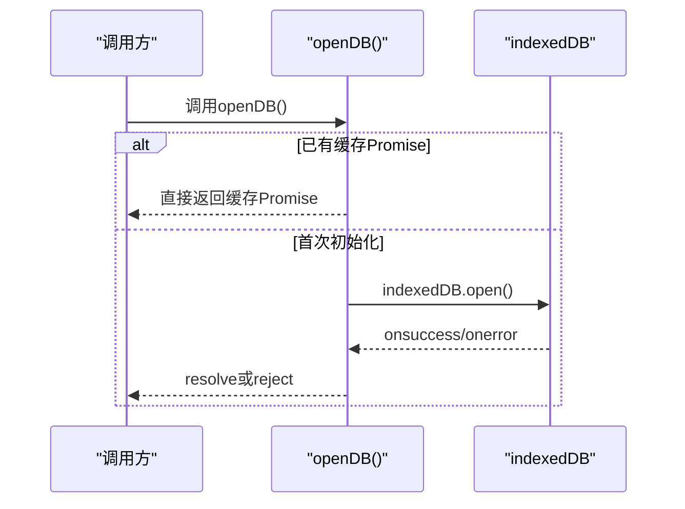
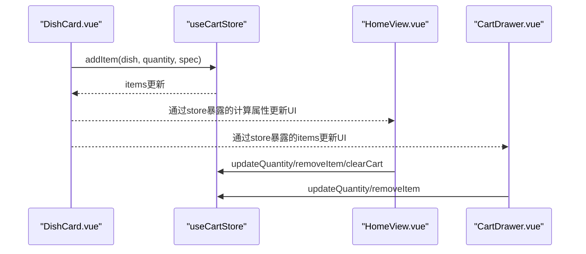
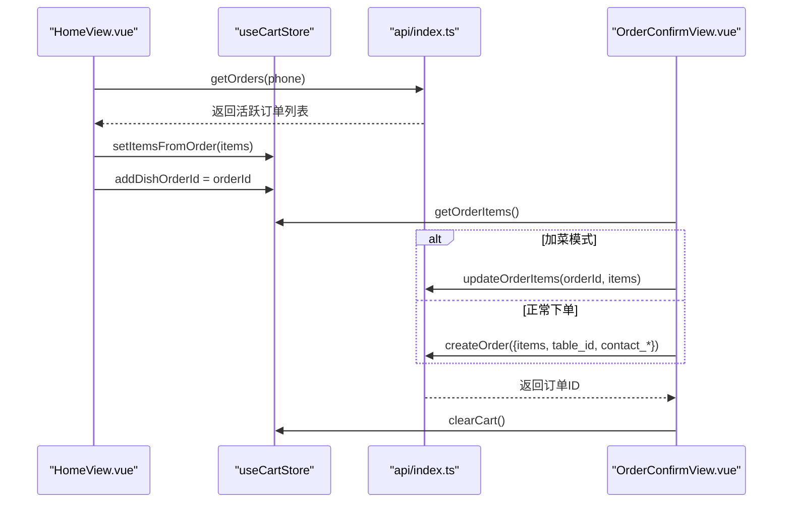
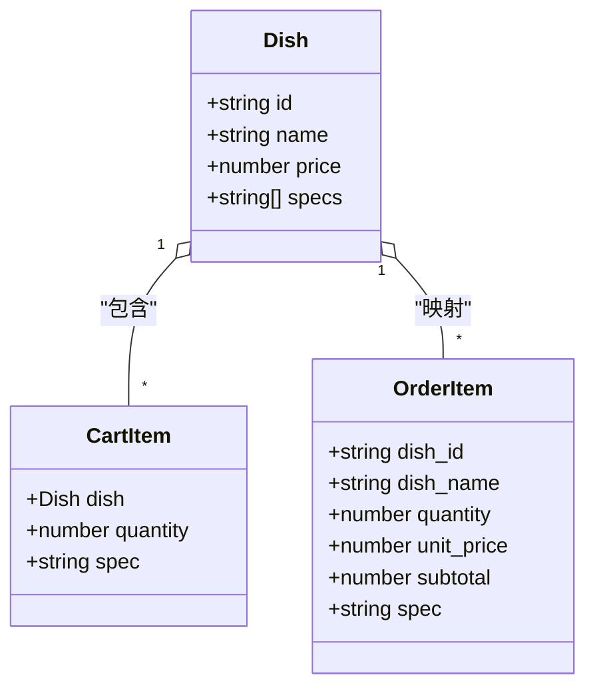
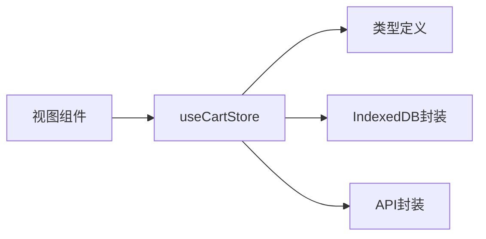

# 购物车状态管理

<cite>
**本文档引用的文件**
- [cart.ts](file://src/stores/cart.ts)
- [storage.ts](file://src/utils/storage.ts)
- [CartDrawer.vue](file://src/client/components/CartDrawer.vue)
- [DishCard.vue](file://src/client/components/DishCard.vue)
- [QuantityControl.vue](file://src/shared/components/QuantityControl.vue)
- [HomeView.vue](file://src/client/views/HomeView.vue)
- [OrderConfirmView.vue](file://src/client/views/OrderConfirmView.vue)
- [index.ts](file://src/api/index.ts)
- [index.ts](file://src/types/index.ts)
</cite>

## 目录
1. [简介](#简介)
2. [项目结构](#项目结构)
3. [核心组件](#核心组件)
4. [架构总览](#架构总览)
5. [详细组件分析](#详细组件分析)
6. [依赖关系分析](#依赖关系分析)
7. [性能考量](#性能考量)
8. [故障排查指南](#故障排查指南)
9. [结论](#结论)
10. [附录](#附录)

## 简介
本文件面向RLRMS客户端的购物车状态管理，围绕Pinia Store设计与实现进行深入解析。重点覆盖以下方面：
- 购物车数据结构与菜品规格管理
- 菜品添加/删除/数量调整与总价计算
- 购物车持久化与恢复策略
- 订单预处理与加菜模式
- 状态同步、本地存储策略与跨组件数据共享
- 清理机制、状态重置与数据迁移
- 最佳实践、性能优化与用户体验优化

## 项目结构
购物车相关代码主要分布在以下模块：
- 状态层：Pinia Store（购物车状态与持久化）
- 工具层：IndexedDB封装（本地存储）
- 视图层：首页、订单确认页、菜品卡片、抽屉式购物车等组件
- 类型层：Dish、CartItem、OrderItem等类型定义

图表来源
- [cart.ts:1-183](file://src/stores/cart.ts#L1-L183)
- [storage.ts:1-109](file://src/utils/storage.ts#L1-L109)
- [HomeView.vue:1-236](file://src/client/views/HomeView.vue#L1-L236)
- [OrderConfirmView.vue:1-232](file://src/client/views/OrderConfirmView.vue#L1-L232)
- [DishCard.vue:1-372](file://src/client/components/DishCard.vue#L1-L372)
- [CartDrawer.vue:1-314](file://src/client/components/CartDrawer.vue#L1-L314)
- [QuantityControl.vue:1-212](file://src/shared/components/QuantityControl.vue#L1-L212)
- [index.ts:54-115](file://src/types/index.ts#L54-L115)

章节来源
- [cart.ts:1-183](file://src/stores/cart.ts#L1-L183)
- [storage.ts:1-109](file://src/utils/storage.ts#L1-L109)
- [index.ts:54-115](file://src/types/index.ts#L54-L115)

## 核心组件
- useCartStore：购物车状态中心，负责菜品增删改、数量调整、总价/总数计算、订单预处理、持久化与恢复。
- IndexedDB封装：提供懒加载、事务读写、错误处理与清理能力。
- 视图组件：首页底部购物车条、抽屉式购物车、菜品卡片、数量控制器等，均通过Pinia共享状态驱动UI。

章节来源
- [cart.ts:9-182](file://src/stores/cart.ts#L9-L182)
- [storage.ts:11-108](file://src/utils/storage.ts#L11-L108)
- [HomeView.vue:309-365](file://src/client/views/HomeView.vue#L309-L365)
- [CartDrawer.vue:23-79](file://src/client/components/CartDrawer.vue#L23-L79)
- [DishCard.vue:32-84](file://src/client/components/DishCard.vue#L32-L84)
- [QuantityControl.vue:1-212](file://src/shared/components/QuantityControl.vue#L1-L212)

## 架构总览
购物车状态管理采用“Store + IndexedDB”的双层架构：
- Store层：集中管理购物车数据、派生计算、业务逻辑与持久化触发。
- 存储层：IndexedDB作为持久化介质，提供键值存储、事务隔离与错误兜底。
- 视图层：通过响应式绑定与事件交互，实现UI与状态的双向同步。

图表来源
- [cart.ts:27-181](file://src/stores/cart.ts#L27-L181)
- [storage.ts:42-91](file://src/utils/storage.ts#L42-L91)
- [index.ts:71-115](file://src/types/index.ts#L71-L115)

## 详细组件分析

### useCartStore 设计与实现
- 数据结构
  - items：CartItem数组，包含菜品、数量与规格标识。
  - addDishOrderId：加菜模式关联的订单ID，用于后续更新菜品。
  - restored：恢复完成标志，避免未恢复时的持久化写入。
- 计算属性
  - totalAmount：按单价×数量累加。
  - totalCount：按数量累加。
- 核心方法
  - addItem(dish, quantity, spec)：根据菜品ID与规格判断是否已存在，存在则累加数量，否则新增条目；随后持久化。
  - removeItem(dishId, spec)：按菜品ID与规格定位并移除；随后持久化。
  - updateQuantity(dishId, quantity, spec)：数量≤0时等价于移除，否则更新数量；随后持久化。
  - clearCart()：清空购物车与加菜订单ID；随后持久化。
  - getOrderItems()：将购物车转换为后端订单项格式，便于提交。
  - setItemsFromOrder(orderItems)：从后端订单项重建购物车，用于加菜模式。
- 持久化策略
  - saveItems()：序列化Vue响应式对象为纯JS对象，写入IndexedDB；空集合时删除键。
  - saveOrderId()：写入或删除加菜订单ID键。
  - 恢复restore()：并发读取购物车与订单ID，填充状态；完成后标记restored=true。
  - 防抖兜底：watch(items)在深度监听基础上增加100ms防抖，避免频繁写入。
  - 监听加菜订单ID：watch(addDishOrderId)变更即持久化。
- 关键常量
  - CART_ITEMS_KEY：购物车数据键。
  - CART_ORDER_ID_KEY：加菜订单ID键。

图表来源
- [cart.ts:113-121](file://src/stores/cart.ts#L113-L121)

章节来源
- [cart.ts:9-182](file://src/stores/cart.ts#L9-L182)

### IndexedDB 封装
- 懒加载：openDB()缓存Promise，避免重复初始化。
- 事务封装：getItem/setItem/removeItem/clear分别封装只读/读写事务。
- 升级建表：首次打开时创建对象仓库。
- 错误处理：onerror回调中清理缓存Promise，允许重试；onsuccess回调中resolve。
- 清理接口：clear用于清空存储。

图表来源
- [storage.ts:11-40](file://src/utils/storage.ts#L11-L40)

章节来源
- [storage.ts:1-109](file://src/utils/storage.ts#L1-L109)

### 视图组件与状态联动
- 首页底部购物车条
  - 展示totalCount与totalAmount，支持展开/收起。
  - 点击“确认订单”根据是否存在加菜订单ID决定文案与行为。
  - 支持清空购物车与数量调整。
- 抽屉式购物车
  - 展示购物车列表，支持数量调整与移除。
  - 提供“确认订单”按钮，触发路由跳转。
- 菜品卡片
  - 无规格时直接加入购物车；有规格时弹出规格选择与数量控制。
  - 与首页底部购物车条共享同一store实例。
- 数量控制器
  - 提供增减按钮与数字输入，带波浪动画与涟漪效果。

图表来源
- [DishCard.vue:49-84](file://src/client/components/DishCard.vue#L49-L84)
- [HomeView.vue:310-365](file://src/client/views/HomeView.vue#L310-L365)
- [CartDrawer.vue:23-79](file://src/client/components/CartDrawer.vue#L23-L79)
- [cart.ts:27-75](file://src/stores/cart.ts#L27-L75)

章节来源
- [HomeView.vue:309-365](file://src/client/views/HomeView.vue#L309-L365)
- [CartDrawer.vue:1-314](file://src/client/components/CartDrawer.vue#L1-L314)
- [DishCard.vue:1-372](file://src/client/components/DishCard.vue#L1-L372)
- [QuantityControl.vue:1-212](file://src/shared/components/QuantityControl.vue#L1-L212)

### 订单预处理与加菜模式
- 订单预处理
  - getOrderItems()将购物车转换为后端期望的订单项数组，包含菜品ID、名称、单价、数量、小计与规格。
- 加菜模式
  - 首页onMounted时尝试查询活跃订单，若存在且未处于加菜模式，则通过setItemsFromOrder()与addDishOrderId注入购物车与订单ID。
  - 订单确认页根据addDishOrderId决定提交方式：普通下单或更新菜品项。
  - 提交成功后清空购物车并跳转至订单详情页。

图表来源
- [HomeView.vue:197-221](file://src/client/views/HomeView.vue#L197-L221)
- [OrderConfirmView.vue:177-231](file://src/client/views/OrderConfirmView.vue#L177-L231)
- [cart.ts:78-110](file://src/stores/cart.ts#L78-L110)
- [index.ts:186-243](file://src/api/index.ts#L186-L243)

章节来源
- [HomeView.vue:197-221](file://src/client/views/HomeView.vue#L197-L221)
- [OrderConfirmView.vue:177-231](file://src/client/views/OrderConfirmView.vue#L177-L231)
- [cart.ts:78-110](file://src/stores/cart.ts#L78-L110)
- [index.ts:186-243](file://src/api/index.ts#L186-L243)

### 购物车数据结构与规格管理
- 类型定义
  - Dish：菜品基础信息，含specs字符串数组用于规格管理。
  - CartItem：包含dish、quantity与spec。
  - OrderItem：后端订单项，用于提交与重建。
- 规格管理
  - addItem/updateQuantity/removeItem均以(dishId, spec)为唯一性标识，确保同菜品不同规格独立计数。
  - DishCard在有规格时弹出规格选择与数量控制，保证用户明确规格与数量。

图表来源
- [index.ts:54-115](file://src/types/index.ts#L54-L115)

章节来源
- [index.ts:54-115](file://src/types/index.ts#L54-L115)
- [DishCard.vue:37-84](file://src/client/components/DishCard.vue#L37-L84)

### 跨组件数据共享与状态同步
- Pinia全局状态：所有视图组件通过useCartStore共享同一状态实例，实现跨组件数据一致性。
- 响应式渲染：totalAmount、totalCount、items等均为响应式，UI自动更新。
- 防抖与兜底：watch(items)深度监听配合100ms防抖，避免高频写入；restore()在初始化阶段完成一次性恢复，避免中间态写入。

章节来源
- [cart.ts:15-182](file://src/stores/cart.ts#L15-L182)
- [HomeView.vue:309-365](file://src/client/views/HomeView.vue#L309-L365)
- [CartDrawer.vue:23-79](file://src/client/components/CartDrawer.vue#L23-L79)

### 清理机制、状态重置与数据迁移
- 清理机制
  - clearCart()清空items与addDishOrderId，并持久化。
  - saveItems()在items为空时删除对应键，避免残留。
- 状态重置
  - restore()在store初始化时并发读取并填充状态，完成后标记restored=true，之后才允许持久化。
- 数据迁移
  - setItemsFromOrder()可将后端订单项重建为购物车，用于历史订单或加菜场景。

章节来源
- [cart.ts:69-110](file://src/stores/cart.ts#L69-L110)
- [cart.ts:132-150](file://src/stores/cart.ts#L132-L150)

## 依赖关系分析
- 组件耦合
  - 视图组件与Store强耦合，但通过类型约束降低编译期风险。
  - Store与Storage弱耦合，仅通过函数调用交互。
- 外部依赖
  - Pinia提供响应式与状态管理能力。
  - IndexedDB提供浏览器端持久化能力。
  - API层提供订单查询与提交能力，支撑加菜模式与下单流程。

图表来源
- [cart.ts:1-183](file://src/stores/cart.ts#L1-L183)
- [storage.ts:1-109](file://src/utils/storage.ts#L1-L109)
- [index.ts:128-243](file://src/api/index.ts#L128-L243)
- [index.ts:54-115](file://src/types/index.ts#L54-L115)

章节来源
- [cart.ts:1-183](file://src/stores/cart.ts#L1-L183)
- [storage.ts:1-109](file://src/utils/storage.ts#L1-L109)
- [index.ts:128-243](file://src/api/index.ts#L128-L243)
- [index.ts:54-115](file://src/types/index.ts#L54-L115)

## 性能考量
- 持久化优化
  - 防抖写入：watch(items)增加100ms防抖，减少频繁IO。
  - 条件写入：空集合删除键，避免冗余存储。
  - 懒加载DB：openDB()缓存Promise，避免重复初始化。
- 计算优化
  - totalAmount/totalCount使用reduce，复杂度O(n)，在合理数据规模内性能稳定。
- UI优化
  - 数量控制器提供波浪动画与涟漪效果，提升交互反馈。
  - 首页购物车条支持展开/收起，减少长列表渲染压力。

章节来源
- [cart.ts:15-182](file://src/stores/cart.ts#L15-L182)
- [cart.ts:153-158](file://src/stores/cart.ts#L153-L158)
- [storage.ts:11-40](file://src/utils/storage.ts#L11-L40)
- [QuantityControl.vue:26-31](file://src/shared/components/QuantityControl.vue#L26-L31)

## 故障排查指南
- IndexedDB不可用
  - 现象：购物车无法持久化或恢复失败。
  - 排查：检查浏览器隐私模式、禁用IndexedDB或存储配额限制。
  - 处理：restore()中捕获异常并静默忽略，确保应用可用。
- 重复初始化
  - 现象：多次openDB导致资源浪费。
  - 排查：确认dbPromise缓存逻辑。
  - 处理：保持现有懒加载与错误清理策略。
- 防抖丢失变更
  - 现象：快速连续操作后，最终状态未持久化。
  - 排查：watch(items)防抖时间为100ms。
  - 处理：确保操作结束后不再频繁变更；必要时手动触发持久化。
- 加菜模式异常
  - 现象：setItemsFromOrder未生效或addDishOrderId未正确设置。
  - 排查：确认HomeView中活跃订单查询与赋值逻辑。
  - 处理：检查API返回与store赋值顺序。

章节来源
- [cart.ts:132-150](file://src/stores/cart.ts#L132-L150)
- [storage.ts:21-25](file://src/utils/storage.ts#L21-L25)
- [HomeView.vue:197-221](file://src/client/views/HomeView.vue#L197-L221)

## 结论
useCartStore通过Pinia实现了清晰的状态管理与持久化策略，结合IndexedDB封装提供了可靠的本地存储能力。视图层通过统一的store实例实现跨组件数据共享与状态同步，支持菜品规格管理、数量调整、总价计算与订单预处理。整体架构具备良好的扩展性与可维护性，适合在多视图场景下协同工作。

## 附录
- 最佳实践
  - 保持items为纯对象再持久化，避免响应式代理污染存储。
  - 对高频变更操作使用防抖，平衡实时性与性能。
  - 在store初始化阶段完成一次性恢复，避免中间态写入。
  - 通过类型约束与API封装降低跨模块耦合。
- 用户体验优化
  - 数量控制器提供即时反馈与动画效果。
  - 首页购物车条支持展开/收起，减少长列表渲染。
  - 加菜模式下保留用户历史订单，提升复购效率。