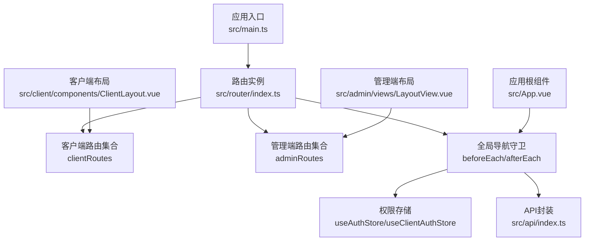
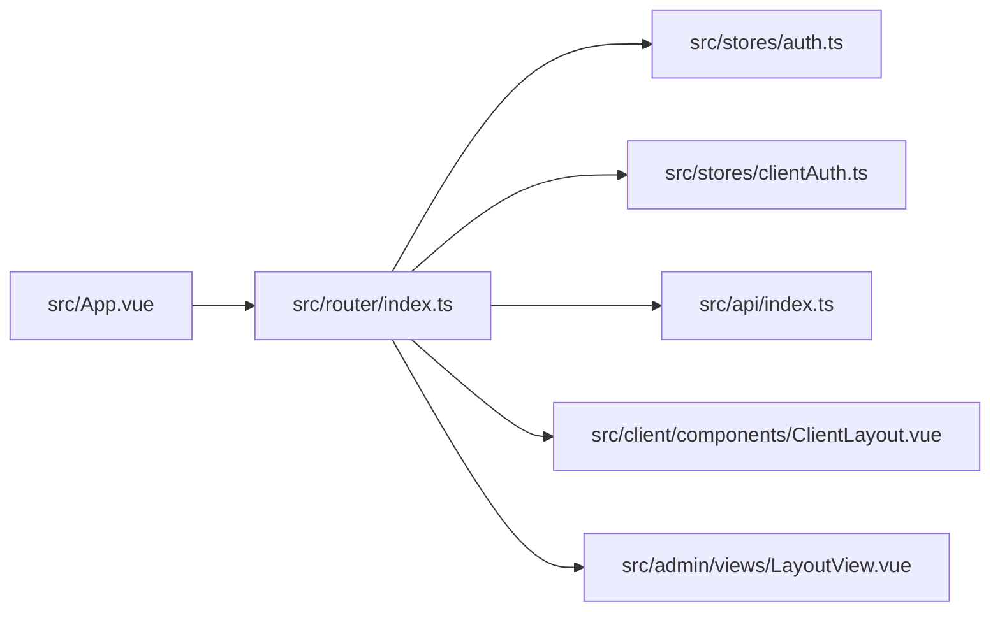

# 路由系统

<cite>
**本文引用的文件列表**
- [src/router/index.ts](file://src/router/index.ts)
- [src/main.ts](file://src/main.ts)
- [src/App.vue](file://src/App.vue)
- [src/admin/views/LayoutView.vue](file://src/admin/views/LayoutView.vue)
- [src/client/components/ClientLayout.vue](file://src/client/components/ClientLayout.vue)
- [src/stores/auth.ts](file://src/stores/auth.ts)
- [src/stores/clientAuth.ts](file://src/stores/clientAuth.ts)
- [src/api/index.ts](file://src/api/index.ts)
- [src/client/views/HomeView.vue](file://src/client/views/HomeView.vue)
- [src/admin/views/DashboardView.vue](file://src/admin/views/DashboardView.vue)
- [src/types/index.ts](file://src/types/index.ts)
</cite>

## 目录
1. [简介](#简介)
2. [项目结构](#项目结构)
3. [核心组件](#核心组件)
4. [架构总览](#架构总览)
5. [详细组件分析](#详细组件分析)
6. [依赖关系分析](#依赖关系分析)
7. [性能考量](#性能考量)
8. [故障排查指南](#故障排查指南)
9. [结论](#结论)
10. [附录](#附录)

## 简介
本文件面向RLRMS项目的路由系统，围绕Vue Router的配置与实现进行深入解析，重点覆盖：
- 客户端路由与管理端路由的分离设计
- 导航守卫的实现机制（权限验证、页面跳转控制、路由预加载策略）
- 路由懒加载与预取策略的性能优化
- 路由参数传递、查询字符串处理与路由元信息使用
- 最佳实践与常见问题解决方案
- 调试技巧与性能监控方法

## 项目结构
路由系统位于前端应用入口处，采用“单路由器 + 双端路由集合”的组织方式：
- 单路由器实例统一管理历史模式与滚动行为
- 客户端路由集合与管理端路由集合分别定义，避免交叉污染
- 导航守卫集中处理权限校验与标题更新
- 预加载与预取策略在应用启动与导航后执行，提升首屏与后续导航体验



图表来源
- [src/main.ts:1-37](file://src/main.ts#L1-L37)
- [src/router/index.ts:178-200](file://src/router/index.ts#L178-L200)
- [src/App.vue:11-48](file://src/App.vue#L11-L48)

章节来源
- [src/main.ts:1-37](file://src/main.ts#L1-L37)
- [src/router/index.ts:178-200](file://src/router/index.ts#L178-L200)

## 核心组件
- 路由器实例与历史模式：使用HTML5 History模式，支持滚动行为与自定义Edge浏览器兼容处理
- 客户端路由集合：面向顾客的点餐、订单、搜索等页面，部分页面要求客户端认证
- 管理端路由集合：包含登录页与带子路由的管理后台布局，子路由覆盖仪表盘、桌位、菜单、订单、库存、用户、设置、调试等
- 导航守卫：集中处理文档标题更新、客户端认证与管理员认证
- 预加载与预取：应用启动时预加载关键路由组件；导航完成后根据目标路由预取相关页面

章节来源
- [src/router/index.ts:19-40](file://src/router/index.ts#L19-L40)
- [src/router/index.ts:42-92](file://src/router/index.ts#L42-L92)
- [src/router/index.ts:94-176](file://src/router/index.ts#L94-L176)
- [src/router/index.ts:201-277](file://src/router/index.ts#L201-L277)
- [src/router/index.ts:279-314](file://src/router/index.ts#L279-L314)

## 架构总览
下图展示路由系统与权限、API、布局组件之间的交互关系。

```mermaid
sequenceDiagram
participant U as "用户"
participant R as "路由器<br/>src/router/index.ts"
participant S1 as "客户端认证存储<br/>useClientAuthStore"
participant S2 as "管理员认证存储<br/>useAuthStore"
participant API as "API封装<br/>src/api/index.ts"
participant L1 as "客户端布局<br/>ClientLayout.vue"
participant L2 as "管理端布局<br/>LayoutView.vue"
participant APP as "应用根组件<br/>src/App.vue"
U->>R : 导航至某路由
R->>R : 更新文档标题
alt 客户端受保护路由
R->>S1 : 检查是否已认证
alt 已认证
R-->>U : 放行
else 未认证
R->>S1 : 尝试从Cookie恢复
alt 恢复成功
R-->>U : 放行
else 恢复失败
R-->>U : 触发客户端登录弹窗
U-->>R : 登录成功/取消
opt 登录成功
R-->>U : 放行
else 登录取消
R-->>U : 跳转至首页
end
end
end
else 管理端受保护路由
R->>S2 : 检查是否已认证
alt 已认证
R-->>U : 放行
else 未认证
R->>API : 验证Token
API-->>R : 返回用户信息/失败
alt 成功
R-->>U : 放行
else 失败
R-->>U : 跳转至管理登录页(携带redirect)
end
end
end
R-->>APP : 导航完成
APP-->>U : 触发会话过期事件(如401)
```

图表来源
- [src/router/index.ts:201-277](file://src/router/index.ts#L201-L277)
- [src/stores/auth.ts:15-127](file://src/stores/auth.ts#L15-L127)
- [src/stores/clientAuth.ts:10-86](file://src/stores/clientAuth.ts#L10-L86)
- [src/api/index.ts:245-286](file://src/api/index.ts#L245-L286)
- [src/App.vue:16-39](file://src/App.vue#L16-L39)

## 详细组件分析

### 路由器与历史模式
- 使用History模式，支持滚动行为：优先恢复历史滚动位置，否则回到顶部
- Edge浏览器兼容：拦截replaceState调用，避免隐藏状态下异常
- 应用启动后执行关键路由组件预加载，利用空闲回调或降级方案

章节来源
- [src/router/index.ts:19-40](file://src/router/index.ts#L19-L40)
- [src/router/index.ts:189-199](file://src/router/index.ts#L189-L199)
- [src/main.ts:33-37](file://src/main.ts#L33-L37)

### 客户端路由集合
- 路由类型：首页、菜品详情、搜索、订单确认、订单详情、订单二维码、全部订单、设置
- 认证策略：部分路由（订单、设置）要求客户端认证
- 参数与查询：菜品详情使用路径参数；搜索使用查询参数；订单详情使用路径参数；订单二维码使用路径参数
- 元信息：每个路由包含标题元信息，用于动态更新文档标题

章节来源
- [src/router/index.ts:42-92](file://src/router/index.ts#L42-L92)
- [src/client/views/HomeView.vue:94-106](file://src/client/views/HomeView.vue#L94-L106)

### 管理端路由集合
- 登录页：无需认证
- 管理后台布局：包含多子路由（仪表盘、桌位、菜单、订单、库存、用户、设置、调试）
- 通用404：管理端未匹配路由指向管理端404视图
- 元信息：每个子路由包含标题元信息

章节来源
- [src/router/index.ts:94-176](file://src/router/index.ts#L94-L176)

### 导航守卫实现
- 标题更新：根据路由元信息动态设置文档标题
- 客户端认证守卫：
  - 若已认证放行
  - 否则尝试从Cookie恢复
  - 失败则触发客户端登录弹窗，等待登录成功或取消
  - 取消时跳转至首页
- 管理端认证守卫：
  - 若已认证放行
  - 否则调用API验证Token，成功则设置用户信息并放行
  - 失败则跳转至管理登录页，并携带redirect参数
- 会话过期处理：全局监听401事件，区分客户端与管理端路径，分别清理会话并重定向

章节来源
- [src/router/index.ts:201-277](file://src/router/index.ts#L201-L277)
- [src/App.vue:16-39](file://src/App.vue#L16-L39)

### 路由懒加载与预取策略
- 路由级别懒加载：各路由组件均以异步函数形式导入，实现按需加载
- 关键路由预加载：应用启动后在空闲时预加载客户端首页、管理首页与管理布局
- 导航后预取：根据当前路由名称，预取可能访问的相关页面组件，提升后续导航体验

章节来源
- [src/router/index.ts:23-40](file://src/router/index.ts#L23-L40)
- [src/router/index.ts:279-314](file://src/router/index.ts#L279-L314)

### 路由参数传递、查询字符串与元信息
- 路径参数：菜品详情、订单详情、订单二维码等使用路径参数
- 查询参数：搜索页面使用查询参数；管理登录页接收redirect查询参数
- 元信息：title用于动态设置文档标题；requiresClientAuth与requiresAuth用于控制认证策略

章节来源
- [src/router/index.ts:42-92](file://src/router/index.ts#L42-L92)
- [src/router/index.ts:94-176](file://src/router/index.ts#L94-L176)
- [src/App.vue:23-32](file://src/App.vue#L23-L32)

### 布局组件与导航
- 客户端布局：底部导航栏，基于路由路径高亮；离开路由时保存滚动位置与选中分类
- 管理端布局：侧边栏导航，根据当前路径自动展开调试菜单；支持移动端抽屉与折叠；退出登录时调用API并重定向

章节来源
- [src/client/components/ClientLayout.vue:1-256](file://src/client/components/ClientLayout.vue#L1-L256)
- [src/admin/views/LayoutView.vue:1-769](file://src/admin/views/LayoutView.vue#L1-L769)
- [src/client/views/HomeView.vue:142-167](file://src/client/views/HomeView.vue#L142-L167)

### 权限存储与会话保活
- 管理员认证存储：维护用户信息、认证状态、会话过期时间；定时保活，过期时触发全局事件
- 客户端认证存储：维护客户用户信息、显示名、手机号后四位；支持从Cookie恢复

章节来源
- [src/stores/auth.ts:15-127](file://src/stores/auth.ts#L15-L127)
- [src/stores/clientAuth.ts:10-86](file://src/stores/clientAuth.ts#L10-L86)

### API封装与401处理
- 统一封装请求与响应处理，包含超时、凭据、内容类型校验
- 401未授权时触发全局会话过期事件，区分客户端与管理端路径

章节来源
- [src/api/index.ts:54-114](file://src/api/index.ts#L54-L114)
- [src/api/index.ts:245-286](file://src/api/index.ts#L245-L286)

## 依赖关系分析
- 路由器依赖：
  - 权限存储：useAuthStore、useClientAuthStore
  - API封装：api.verifyToken、api.clientVerifyToken
  - 布局组件：客户端与管理端布局用于导航与UI
- 导航守卫对全局事件与路由元信息强依赖
- 预加载/预取策略依赖浏览器空闲回调能力



图表来源
- [src/router/index.ts:1-5](file://src/router/index.ts#L1-L5)
- [src/App.vue:11-14](file://src/App.vue#L11-L14)

章节来源
- [src/router/index.ts:1-5](file://src/router/index.ts#L1-L5)
- [src/App.vue:11-14](file://src/App.vue#L11-L14)

## 性能考量
- 路由懒加载：按需加载组件，减少首屏体积
- 关键路由预加载：在应用空闲时预加载首页与管理首页，缩短首次进入关键路径
- 导航后预取：根据当前路由预测下一步访问，降低二次导航延迟
- 滚动位置恢复：离开页面时保存滚动位置与选中分类，返回时恢复，提升连续操作体验
- 会话保活：定期验证Token，避免无效请求带来的失败重试

章节来源
- [src/router/index.ts:23-40](file://src/router/index.ts#L23-L40)
- [src/router/index.ts:279-314](file://src/router/index.ts#L279-L314)
- [src/client/views/HomeView.vue:142-167](file://src/client/views/HomeView.vue#L142-L167)
- [src/stores/auth.ts:37-55](file://src/stores/auth.ts#L37-L55)

## 故障排查指南
- 登录弹窗无法关闭或重复触发
  - 检查客户端登录事件监听与移除逻辑，确保一次性监听
  - 确认登录成功/取消事件是否正确分发
- 管理端登录后仍被重定向
  - 检查API验证Token接口返回与认证存储设置流程
  - 确认导航守卫中的redirect查询参数传递
- 401未授权导致页面异常
  - 检查全局401事件处理逻辑，区分客户端与管理端路径
  - 确认会话保活定时器是否正常启动与停止
- Edge浏览器历史替换异常
  - 确认replaceState拦截逻辑仅在可见状态下生效
- 预加载/预取未生效
  - 检查浏览器是否支持空闲回调；若不支持，确认降级方案（setTimeout）是否执行

章节来源
- [src/router/index.ts:201-277](file://src/router/index.ts#L201-L277)
- [src/App.vue:16-39](file://src/App.vue#L16-L39)
- [src/stores/auth.ts:37-65](file://src/stores/auth.ts#L37-L65)

## 结论
本路由系统通过“单路由器 + 双端路由集合 + 集中式导航守卫”的设计，实现了清晰的客户端与管理端分离、完善的权限控制与用户体验优化。结合懒加载、关键路由预加载与导航后预取策略，有效提升了首屏与后续导航性能。配合会话保活与全局401处理，保障了系统的稳定性与安全性。

## 附录
- 路由元信息字段
  - title：用于动态设置文档标题
  - requiresAuth：管理端受保护路由标识
  - requiresClientAuth：客户端受保护路由标识
- 路由参数与查询字符串示例
  - 菜品详情：/dish/:id
  - 订单详情：/order/:id
  - 订单二维码：/order/:id/qrcode
  - 搜索：/search?q=...
  - 管理登录：/admin/login?redirect=...

章节来源
- [src/router/index.ts:42-92](file://src/router/index.ts#L42-L92)
- [src/router/index.ts:94-176](file://src/router/index.ts#L94-L176)
- [src/types/index.ts:54-97](file://src/types/index.ts#L54-L97)