# Express服务器配置

<cite>
**本文档引用的文件**
- [server/src/index.ts](file://server/src/index.ts)
- [server/src/dev-server.ts](file://server/src/dev-server.ts)
- [server/src/dev.ts](file://server/src/dev.ts)
- [server/src/db/index.ts](file://server/src/db/index.ts)
- [server/src/db/init.ts](file://server/src/db/init.ts)
- [server/src/routes/index.ts](file://server/src/routes/index.ts)
- [server/src/routes/auth.ts](file://server/src/routes/auth.ts)
- [server/src/routes/admin.ts](file://server/src/routes/admin.ts)
- [server/src/utils/jwt.ts](file://server/src/utils/jwt.ts)
- [package.json](file://package.json)
- [ecosystem.config.cjs](file://ecosystem.config.cjs)
- [nginx.conf](file://nginx.conf)
- [Dockerfile](file://Dockerfile)
- [scripts/build-production.mjs](file://scripts/build-production.mjs)
- [vite.config.ts](file://vite.config.ts)
</cite>

## 目录
1. [简介](#简介)
2. [项目结构](#项目结构)
3. [核心组件](#核心组件)
4. [架构概览](#架构概览)
5. [详细组件分析](#详细组件分析)
6. [依赖关系分析](#依赖关系分析)
7. [性能考虑](#性能考虑)
8. [故障排除指南](#故障排除指南)
9. [结论](#结论)
10. [附录](#附录)

## 简介

本项目是一个基于Express.js的餐厅管理系统后端服务器，采用TypeScript编写，集成了现代化的开发工具链和生产部署方案。该服务器配置涵盖了完整的开发环境和生产环境支持，包括数据库初始化、中间件链路、安全响应头设置、健康检查端点以及SPA路由回退机制。

## 项目结构

项目采用模块化架构，主要分为以下几个核心部分：

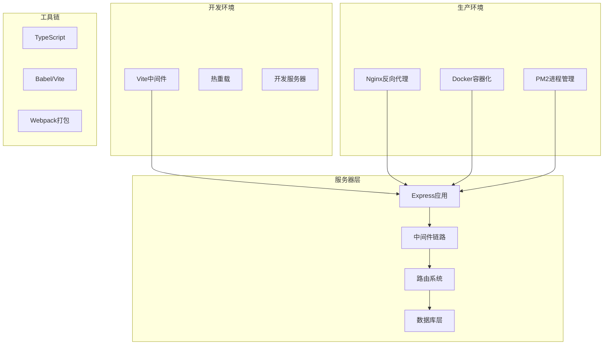

**图表来源**
- [server/src/index.ts:1-171](file://server/src/index.ts#L1-L171)
- [server/src/dev.ts:1-67](file://server/src/dev.ts#L1-L67)

**章节来源**
- [server/src/index.ts:1-171](file://server/src/index.ts#L1-L171)
- [package.json:1-64](file://package.json#L1-L64)

## 核心组件

### 服务器初始化配置

Express服务器采用统一的初始化流程，支持开发和生产两种模式：

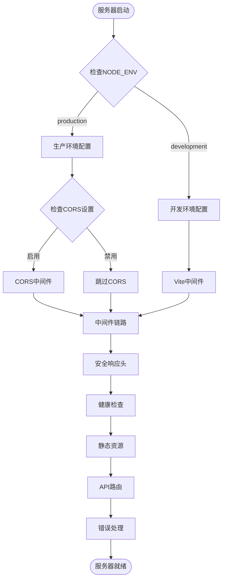

**图表来源**
- [server/src/index.ts:33-142](file://server/src/index.ts#L33-L142)
- [server/src/dev.ts:8-66](file://server/src/dev.ts#L8-L66)

### 环境变量配置

服务器支持多种环境变量配置：

| 环境变量 | 默认值 | 用途 | 生产环境要求 |
|---------|--------|------|-------------|
| NODE_ENV | development | 环境模式 | production/development |
| PORT | 3000 | 服务器端口 | 可选，默认3000 |
| FRONTEND_URL | - | CORS前端地址 | 生产环境必需 |
| JWT_SECRET | - | JWT加密密钥 | 生产环境必需 |

**章节来源**
- [server/src/index.ts:22-24](file://server/src/index.ts#L22-L24)
- [server/src/utils/jwt.ts:20-26](file://server/src/utils/jwt.ts#L20-L26)

### 中间件链路设计

服务器采用严格的中间件执行顺序：

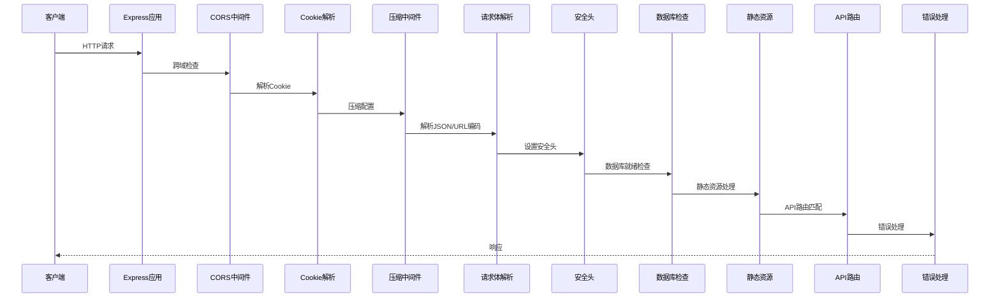

**图表来源**
- [server/src/index.ts:37-87](file://server/src/index.ts#L37-L87)

**章节来源**
- [server/src/index.ts:37-87](file://server/src/index.ts#L37-L87)

## 架构概览

系统采用分层架构设计，各层职责明确：

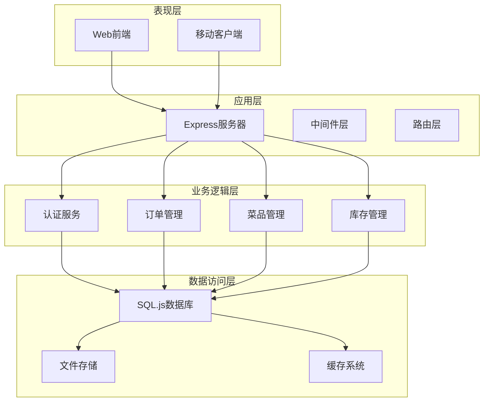

**图表来源**
- [server/src/index.ts:87-142](file://server/src/index.ts#L87-L142)
- [server/src/routes/index.ts:1-18](file://server/src/routes/index.ts#L1-L18)

## 详细组件分析

### 数据库初始化系统

数据库采用SQL.js实现，支持自动初始化和批量操作：

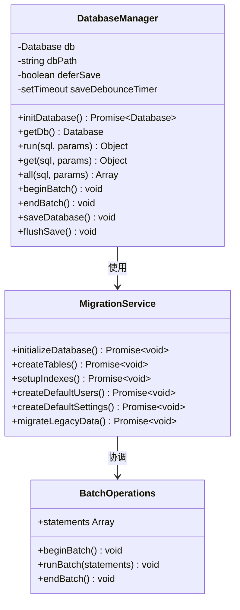

**图表来源**
- [server/src/db/index.ts:101-156](file://server/src/db/index.ts#L101-L156)
- [server/src/db/init.ts:5-204](file://server/src/db/init.ts#L5-L204)

#### 数据库初始化流程

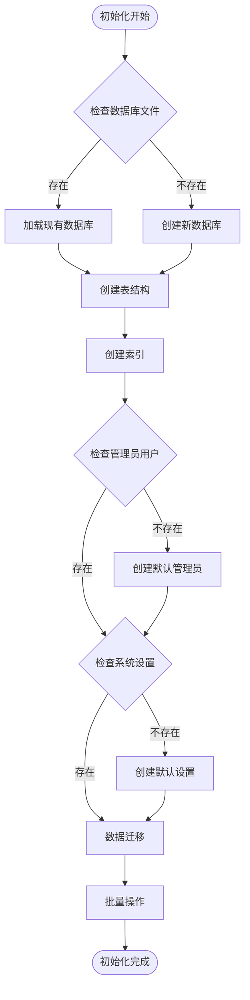

**图表来源**
- [server/src/db/init.ts:5-204](file://server/src/db/init.ts#L5-L204)

**章节来源**
- [server/src/db/index.ts:1-156](file://server/src/db/index.ts#L1-L156)
- [server/src/db/init.ts:1-204](file://server/src/db/init.ts#L1-L204)

### 安全响应头策略

服务器实现了全面的安全响应头设置：

| 响应头 | 值 | 作用 | 配置位置 |
|-------|----|-----|---------|
| X-Content-Type-Options | nosniff | 防止MIME类型嗅探 | [server/src/index.ts:61](file://server/src/index.ts#L61) |
| X-Frame-Options | DENY | 防止点击劫持 | [server/src/index.ts:62](file://server/src/index.ts#L62) |
| X-XSS-Protection | 1; mode=block | XSS防护 | [server/src/index.ts:63](file://server/src/index.ts#L63) |
| Referrer-Policy | strict-origin-when-cross-origin | 引用策略 | [server/src/index.ts:64](file://server/src/index.ts#L64) |

### 认证与授权系统

采用JWT令牌配合HTTP-only Cookie的认证方案：

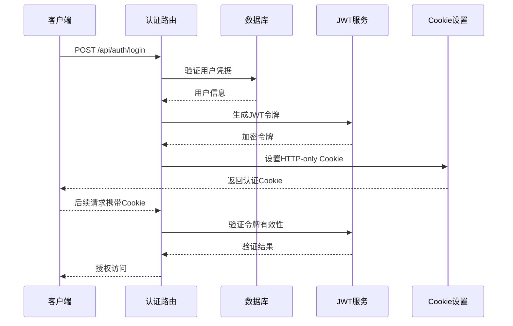

**图表来源**
- [server/src/routes/auth.ts:65-144](file://server/src/routes/auth.ts#L65-L144)
- [server/src/utils/jwt.ts:11-26](file://server/src/utils/jwt.ts#L11-L26)

**章节来源**
- [server/src/routes/auth.ts:1-405](file://server/src/routes/auth.ts#L1-L405)
- [server/src/utils/jwt.ts:1-27](file://server/src/utils/jwt.ts#L1-L27)

### 健康检查端点

健康检查端点提供服务器状态监控：

```mermaid
flowchart TD
HealthReq[健康检查请求] --> CheckDB{检查数据库状态}
CheckDB --> |就绪| OK[返回OK状态]
CheckDB --> |未就绪| Initializing[返回初始化状态]
OK --> Response1[{status: "ok", dbReady: true}]
Initializing --> Response2[{status: "initializing", dbReady: false}]
Response1 --> End([响应结束])
Response2 --> End
```

**图表来源**
- [server/src/index.ts:89-95](file://server/src/index.ts#L89-L95)

**章节来源**
- [server/src/index.ts:89-95](file://server/src/index.ts#L89-L95)

### 静态资源管理

服务器提供多级静态资源缓存策略：

| 路径前缀 | 缓存策略 | 用途 | 配置位置 |
|---------|---------|------|---------|
| /assets/ | 1年，immutable | 前端构建产物 | [server/src/index.ts:101](file://server/src/index.ts#L101) |
| /sources/ | 30天，immutable | 图片资源 | [server/src/index.ts:80](file://server/src/index.ts#L80) |
| 根目录 | 0天 | HTML文件 | [server/src/index.ts:107](file://server/src/index.ts#L107) |

**章节来源**
- [server/src/index.ts:80-118](file://server/src/index.ts#L80-L118)

### 开发环境配置

开发环境支持Vite中间件模式和热重载功能：

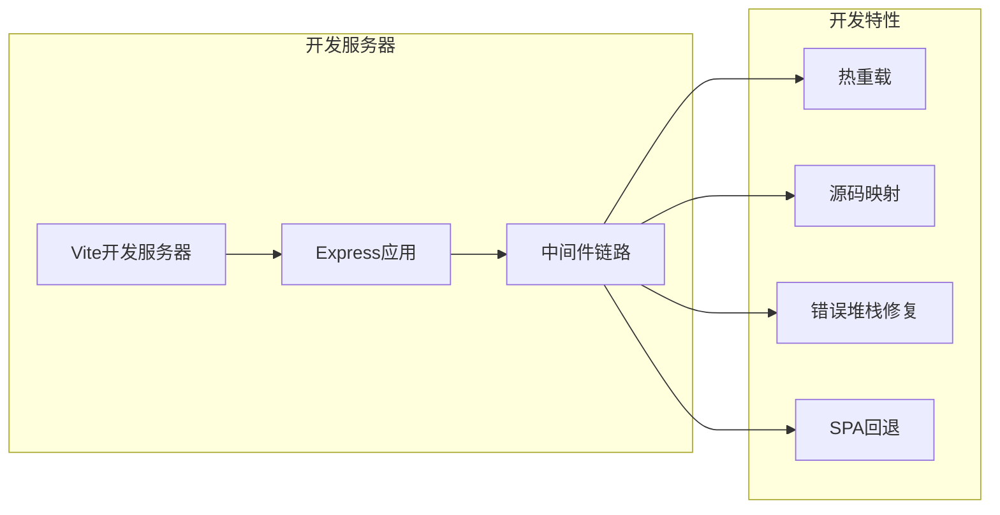

**图表来源**
- [server/src/dev.ts:8-66](file://server/src/dev.ts#L8-L66)

**章节来源**
- [server/src/dev.ts:1-67](file://server/src/dev.ts#L1-L67)
- [server/src/dev-server.ts:1-13](file://server/src/dev-server.ts#L1-L13)

## 依赖关系分析

### 外部依赖关系

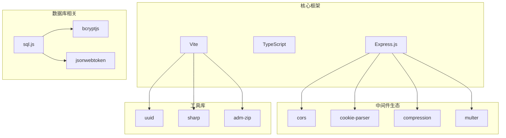

**图表来源**
- [package.json:16-41](file://package.json#L16-L41)

### 内部模块依赖

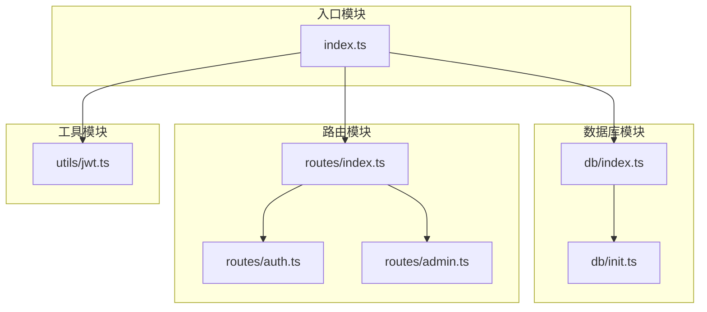

**图表来源**
- [server/src/index.ts:1-11](file://server/src/index.ts#L1-L11)
- [server/src/routes/index.ts:1-18](file://server/src/routes/index.ts#L1-L18)

**章节来源**
- [package.json:1-64](file://package.json#L1-L64)

## 性能考虑

### 压缩策略优化

服务器采用智能压缩过滤器，避免对SSE流的不必要压缩：

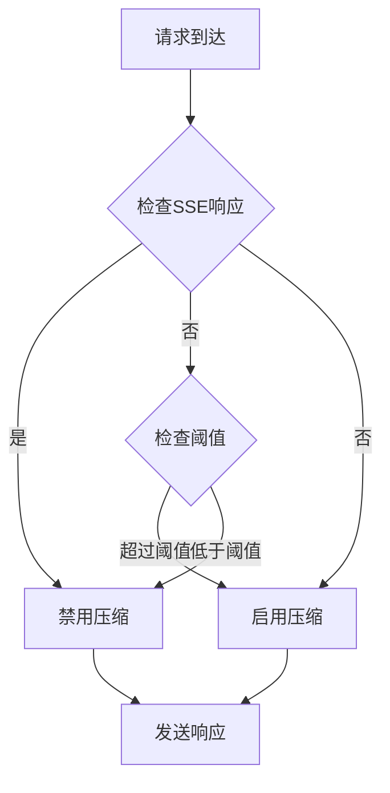

**图表来源**
- [server/src/index.ts:44-55](file://server/src/index.ts#L44-L55)

### 缓存策略

采用多级缓存机制优化静态资源性能：

| 缓存层级 | 适用场景 | 缓存时间 | 特性 |
|---------|---------|---------|------|
| CDN缓存 | 全球分发 | 30天+ | 最大化缓存命中率 |
| 反向代理缓存 | Nginx层 | 7-30天 | 减少后端负载 |
| 浏览器缓存 | 前端资源 | 1年 | 最佳用户体验 |
| 应用缓存 | 动态内容 | 临时 | 降低数据库压力 |

**章节来源**
- [nginx.conf:70-84](file://nginx.conf#L70-L84)
- [server/src/index.ts:80-118](file://server/src/index.ts#L80-L118)

## 故障排除指南

### 常见问题诊断

| 问题类型 | 症状 | 诊断方法 | 解决方案 |
|---------|------|---------|---------|
| 数据库连接失败 | 503服务不可用 | 检查/health端点 | 验证数据库初始化日志 |
| CORS错误 | 跨域请求失败 | 检查FRONTEND_URL配置 | 确认CORS源设置 |
| JWT验证失败 | 401未授权 | 检查JWT_SECRET | 验证密钥配置和格式 |
| 静态资源404 | 前端页面空白 | 检查构建产物 | 验证dist目录完整性 |

### 错误处理机制

服务器采用统一的错误处理中间件：

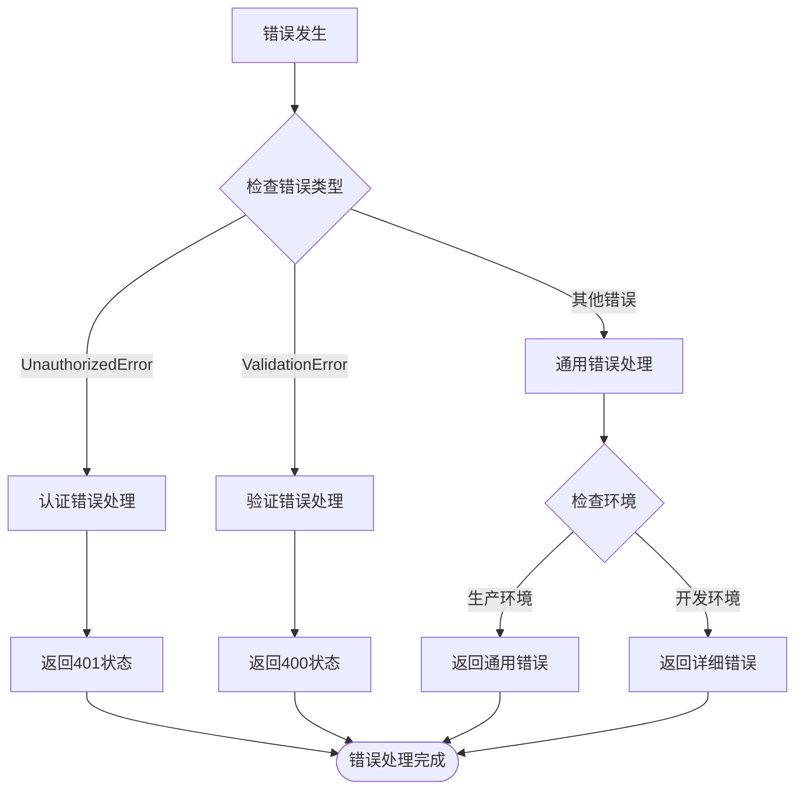

**图表来源**
- [server/src/index.ts:121-139](file://server/src/index.ts#L121-L139)

**章节来源**
- [server/src/index.ts:121-139](file://server/src/index.ts#L121-L139)

## 结论

本Express服务器配置展现了现代Node.js应用的最佳实践，具有以下特点：

1. **完整的生命周期管理**：从开发到生产的无缝切换
2. **安全优先的设计**：全面的安全响应头和认证机制
3. **高性能的架构**：智能缓存和压缩策略
4. **可观测性完善**：详细的健康检查和错误处理
5. **可维护性强**：清晰的模块化结构和配置分离

该配置为餐厅管理系统提供了稳定可靠的技术基础，支持未来的功能扩展和性能优化。

## 附录

### 部署配置参考

#### Docker容器化部署

```dockerfile
FROM node:20-alpine AS builder
WORKDIR /app
COPY package.json package-lock.json ./
RUN npm ci
COPY . .
RUN npm run build:production

FROM node:20-alpine AS runner
WORKDIR /app
ENV NODE_ENV=production
ENV PORT=3000
COPY --from=builder /app/package.json ./
COPY --from=builder /app/package-lock.json ./
RUN npm ci --omit=dev && npm cache clean --force
COPY --from=builder /app/server/dist ./server/dist
COPY --from=builder /app/dist ./dist
COPY --from=builder /app/public ./public
```

#### PM2进程管理配置

```javascript
module.exports = {
  apps: [{
    name: 'red-lantern-restaurant',
    script: 'server/dist/index.js',
    instances: 1,
    autorestart: true,
    watch: false,
    max_memory_restart: '500M',
    env_production: {
      NODE_ENV: 'production',
      PORT: 3000
    }
  }]
}
```

**章节来源**
- [Dockerfile:1-65](file://Dockerfile#L1-L65)
- [ecosystem.config.cjs:1-19](file://ecosystem.config.cjs#L1-L19)