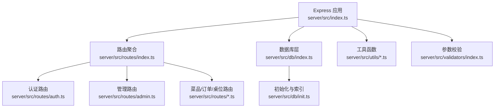
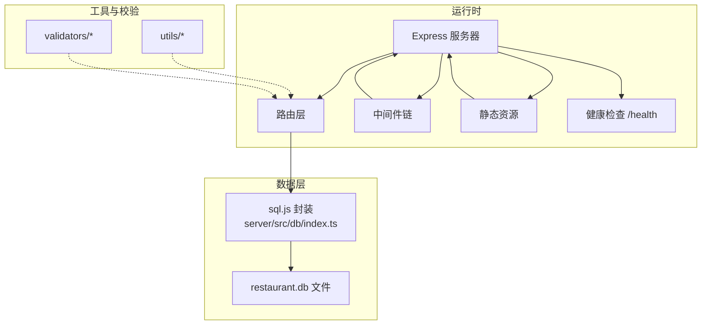
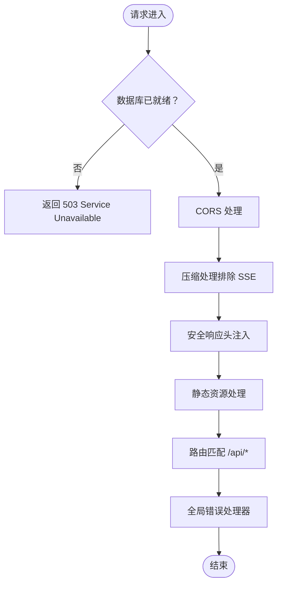
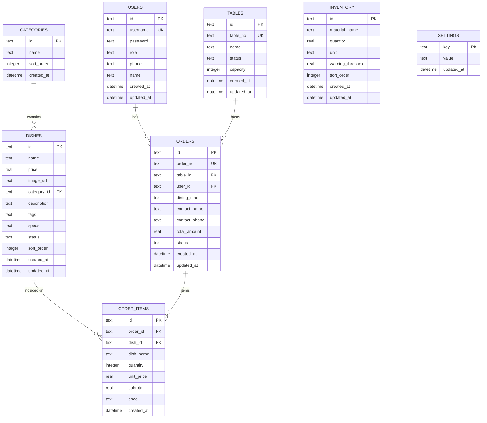
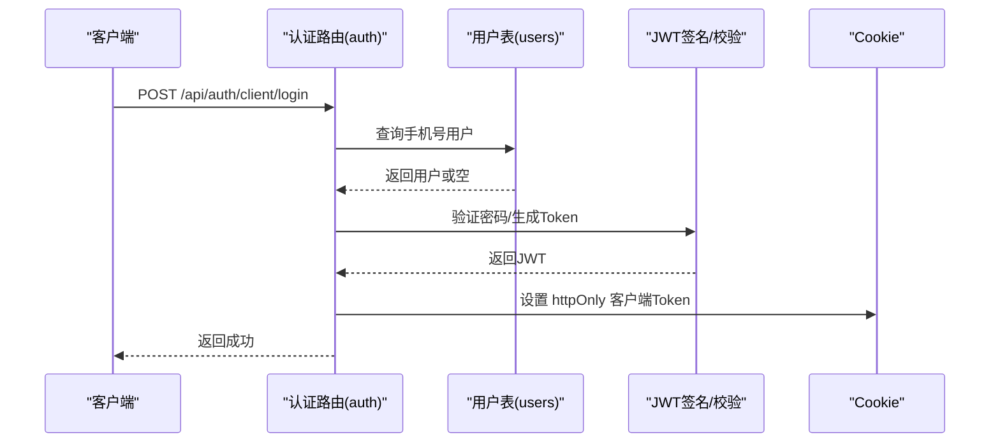
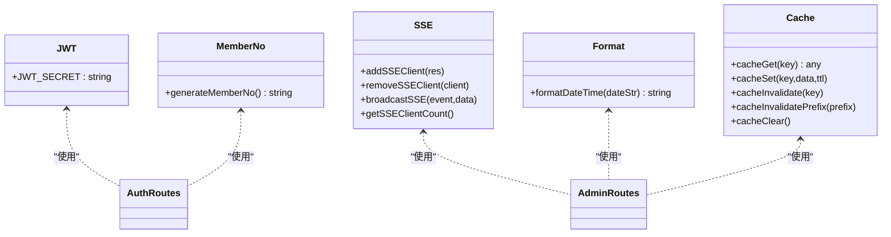
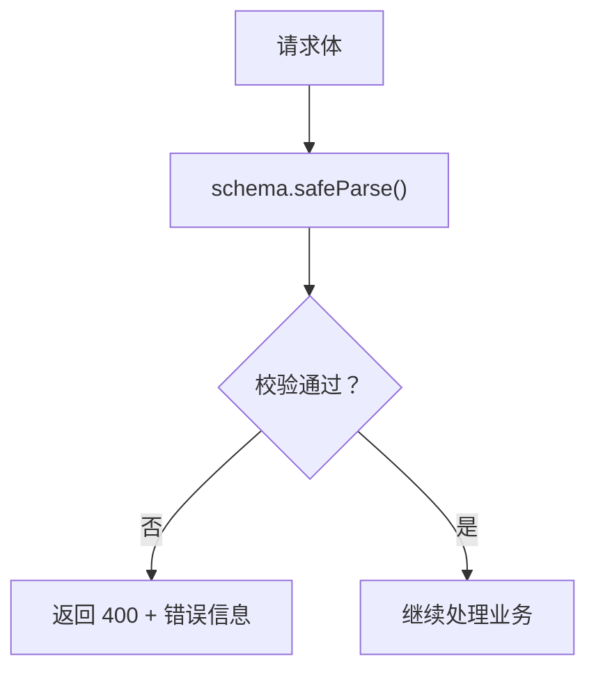
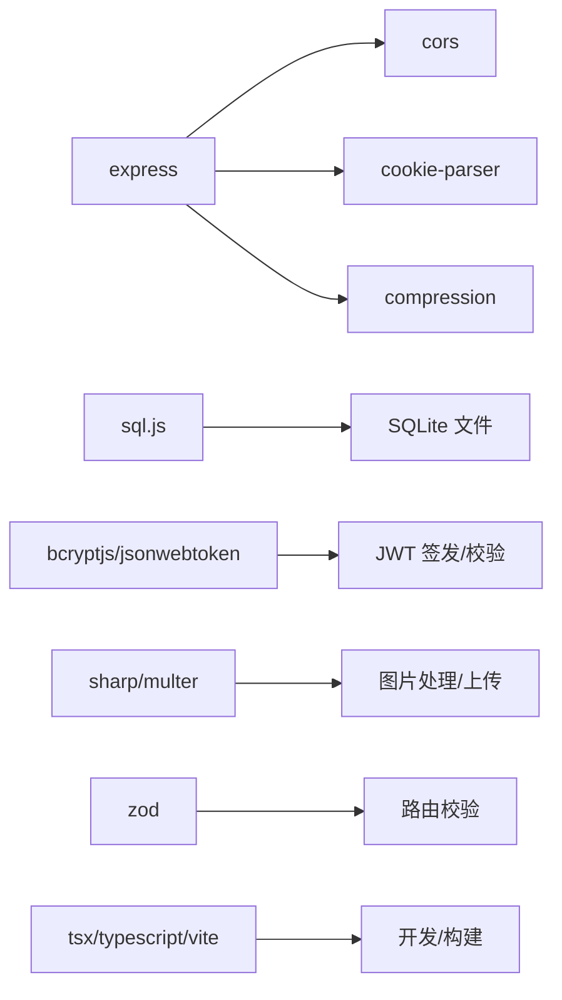

# 后端架构详解

<cite>
**本文引用的文件**
- [server/src/index.ts](file://server/src/index.ts)
- [server/src/dev-server.ts](file://server/src/dev-server.ts)
- [server/src/db/index.ts](file://server/src/db/index.ts)
- [server/src/db/init.ts](file://server/src/db/init.ts)
- [server/src/routes/index.ts](file://server/src/routes/index.ts)
- [server/src/routes/auth.ts](file://server/src/routes/auth.ts)
- [server/src/routes/admin.ts](file://server/src/routes/admin.ts)
- [server/src/utils/jwt.ts](file://server/src/utils/jwt.ts)
- [server/src/utils/sse.ts](file://server/src/utils/sse.ts)
- [server/src/utils/format.ts](file://server/src/utils/format.ts)
- [server/src/utils/cache.ts](file://server/src/utils/cache.ts)
- [server/src/utils/memberNo.ts](file://server/src/utils/memberNo.ts)
- [server/src/validators/index.ts](file://server/src/validators/index.ts)
- [package.json](file://package.json)
- [README.md](file://README.md)
</cite>

## 目录
1. [简介](#简介)
2. [项目结构](#项目结构)
3. [核心组件](#核心组件)
4. [架构总览](#架构总览)
5. [详细组件分析](#详细组件分析)
6. [依赖关系分析](#依赖关系分析)
7. [性能考量](#性能考量)
8. [故障排查指南](#故障排查指南)
9. [结论](#结论)
10. [附录](#附录)

## 简介
本文件面向RLRMS后端架构，围绕Express服务器配置与中间件、数据库设计（SQLite/sql.js）、API路由组织、工具函数库、数据验证机制（Zod）以及性能与安全策略进行系统性技术解读。目标是帮助开发者与运维人员快速理解并高效维护该系统。

## 项目结构
后端位于 server/src 目录，采用“按职责分层 + 路由聚合”的组织方式：
- 应用入口与中间件：server/src/index.ts
- 数据库层：server/src/db/index.ts（sql.js封装）、server/src/db/init.ts（初始化与索引）
- 路由层：server/src/routes/index.ts（聚合）、各业务路由（auth.ts、admin.ts、dishes.ts、orders.ts、tables.ts）
- 工具函数：server/src/utils/*（jwt、sse、format、cache、memberNo）
- 参数校验：server/src/validators/index.ts（Zod）

**图表来源**
- [server/src/index.ts:1-171](file://server/src/index.ts#L1-L171)
- [server/src/routes/index.ts:1-18](file://server/src/routes/index.ts#L1-L18)
- [server/src/db/index.ts:1-156](file://server/src/db/index.ts#L1-L156)
- [server/src/db/init.ts:1-204](file://server/src/db/init.ts#L1-L204)

**章节来源**
- [server/src/index.ts:1-171](file://server/src/index.ts#L1-L171)
- [server/src/routes/index.ts:1-18](file://server/src/routes/index.ts#L1-L18)
- [server/src/db/index.ts:1-156](file://server/src/db/index.ts#L1-L156)
- [server/src/db/init.ts:1-204](file://server/src/db/init.ts#L1-L204)

## 核心组件
- Express应用与中间件：统一处理CORS、压缩、Cookie、安全头、静态资源、健康检查、错误处理。
- 数据库层：基于sql.js的SQLite封装，提供批量写入、去抖保存、事务批处理。
- 路由体系：公开API（菜品/桌位/订单/认证）与管理API（带鉴权中间件）。
- 工具函数：JWT密钥派生、SSE推送、日期格式化、缓存、会员号生成。
- 参数校验：Zod Schema集中定义，贯穿管理端与部分公开接口。
- 安全策略：CORS白名单、安全响应头、Cookie安全属性、登录限流、文件上传过滤、SSE心跳保活。

**章节来源**
- [server/src/index.ts:33-142](file://server/src/index.ts#L33-L142)
- [server/src/db/index.ts:76-156](file://server/src/db/index.ts#L76-L156)
- [server/src/routes/index.ts:1-18](file://server/src/routes/index.ts#L1-L18)
- [server/src/utils/jwt.ts:1-27](file://server/src/utils/jwt.ts#L1-L27)
- [server/src/utils/sse.ts:1-59](file://server/src/utils/sse.ts#L1-L59)
- [server/src/utils/format.ts:1-12](file://server/src/utils/format.ts#L1-L12)
- [server/src/utils/cache.ts:1-73](file://server/src/utils/cache.ts#L1-L73)
- [server/src/utils/memberNo.ts:1-19](file://server/src/utils/memberNo.ts#L1-L19)
- [server/src/validators/index.ts:1-123](file://server/src/validators/index.ts#L1-L123)

## 架构总览
后端采用单体Express应用，生产环境直接启动；开发环境支持两种模式（集成/分离）。数据库为本地SQLite文件，通过sql.js加载与持久化。路由按“公开/管理”分层，管理端接口统一requireAuth中间件。

**图表来源**
- [server/src/index.ts:33-171](file://server/src/index.ts#L33-L171)
- [server/src/db/index.ts:1-156](file://server/src/db/index.ts#L1-L156)

## 详细组件分析

### Express服务器与中间件设计
- CORS：生产环境启用，origin来自环境变量，允许凭据。
- 压缩：开启gzip/deflate，针对SSE禁用压缩以避免缓冲。
- 安全响应头：X-Content-Type-Options、X-Frame-Options、X-XSS-Protection、Referrer-Policy。
- 数据库就绪保护：非 /health 路径在数据库初始化完成前返回503。
- 静态资源：/sources（图片）与生产构建产物（dist）分别缓存策略不同。
- 错误处理：统一捕获JWT无效、参数校验失败与通用500。

**图表来源**
- [server/src/index.ts:37-139](file://server/src/index.ts#L37-L139)

**章节来源**
- [server/src/index.ts:33-142](file://server/src/index.ts#L33-L142)

### 数据库设计与索引优化
- 存储引擎：SQLite（sql.js），数据文件位于 server/data/restaurant.db。
- 表结构要点：
  - users：角色区分（admin/customer），phone唯一性约束配合迁移逻辑。
  - tables：状态枚举（available/occupied/reserved），容量capacity。
  - categories：sort_order排序。
  - dishes：category_id外键，tags/specs JSON数组，status与sort_order。
  - orders：外键关联users与tables，dining_time枚举，contact_*联系方式。
  - order_items：订单明细，包含spec等。
  - inventory：物料清单，warning_threshold预警阈值。
  - settings：键值对系统配置。
- 索引策略：
  - 订单：status、contact_phone、table_id、created_at、user_id。
  - 订单项：order_id。
  - 菜品：category_id、status、sort_order。
  - 用户：phone、role。
  - 桌位：status。
- 初始化流程：批量beginBatch/endBatch，幂等迁移（会员号、user_id回填），默认设置插入。
- 写入优化：去抖保存（SAVE_DEBOUNCE_MS=50ms），批量语句runBatch，flushSave用于优雅关闭。

**图表来源**
- [server/src/db/init.ts:11-137](file://server/src/db/init.ts#L11-L137)

**章节来源**
- [server/src/db/index.ts:76-156](file://server/src/db/index.ts#L76-L156)
- [server/src/db/init.ts:1-204](file://server/src/db/init.ts#L1-L204)

### API路由组织与设计原则
- 路由聚合：/api 下挂载公开路由（dishes/tables/orders/auth），/api/admin 挂载管理路由。
- 认证路由（/api/auth）：
  - 管理员登录/登出/校验，IP限流（15分钟5次）。
  - 客户端登录/登出/校验，手机号格式校验，自动注册（会员号生成）。
  - 修改管理员密码（旧密码校验）。
- 管理路由（/api/admin）：
  - 鉴权中间件：requireAuth（admin_token Cookie + JWT校验 + 角色校验）。
  - 实时事件：SSE /events，心跳保活，断开清理。
  - 仪表盘：今日订单、收入、待处理订单、可用桌位统计。
  - 桌位/菜品/分类/订单/库存/用户/设置/图片/数据管理等完整CRUD。
  - 参数校验：Zod Schema集中定义，路由内统一safeParse。
  - 缓存：cacheGet/cacheSet/cacheInvalidate，缓存键命名空间明确。

**图表来源**
- [server/src/routes/auth.ts:182-294](file://server/src/routes/auth.ts#L182-L294)

**章节来源**
- [server/src/routes/index.ts:1-18](file://server/src/routes/index.ts#L1-L18)
- [server/src/routes/auth.ts:1-405](file://server/src/routes/auth.ts#L1-L405)
- [server/src/routes/admin.ts:1-800](file://server/src/routes/admin.ts#L1-L800)
- [server/src/utils/jwt.ts:1-27](file://server/src/utils/jwt.ts#L1-L27)

### 工具函数库与实现细节
- JWT密钥：
  - 开发：基于主机特征派生固定密钥，保证tsx watch重启时不丢失token。
  - 生产：优先使用JWT_SECRET环境变量，未设置则动态生成（每次启动不同）。
- SSE推送：
  - add/remove客户端，broadcast广播，心跳保活，断开清理。
- 日期格式化：本地化输出ISO字符串（+08:00）。
- 缓存：
  - TTL内存缓存，支持精确TTL与前缀失效，缓存键命名空间清晰。
- 会员号生成：扫描5-6位纯数字username的最大值+1，避免冲突。
- 文件上传：Multer限制5MB、限定图片类型，Sharp压缩至WebP（最大宽度800px）。

**图表来源**
- [server/src/utils/jwt.ts:1-27](file://server/src/utils/jwt.ts#L1-L27)
- [server/src/utils/sse.ts:1-59](file://server/src/utils/sse.ts#L1-L59)
- [server/src/utils/format.ts:1-12](file://server/src/utils/format.ts#L1-L12)
- [server/src/utils/cache.ts:1-73](file://server/src/utils/cache.ts#L1-L73)
- [server/src/utils/memberNo.ts:1-19](file://server/src/utils/memberNo.ts#L1-L19)

**章节来源**
- [server/src/utils/jwt.ts:1-27](file://server/src/utils/jwt.ts#L1-L27)
- [server/src/utils/sse.ts:1-59](file://server/src/utils/sse.ts#L1-L59)
- [server/src/utils/format.ts:1-12](file://server/src/utils/format.ts#L1-L12)
- [server/src/utils/cache.ts:1-73](file://server/src/utils/cache.ts#L1-L73)
- [server/src/utils/memberNo.ts:1-19](file://server/src/utils/memberNo.ts#L1-L19)

### 数据验证机制与Zod使用
- 认证与业务输入：
  - createOrderSchema、updateOrderStatusSchema、cancelOrderSchema等。
  - createDishSchema/updateDishSchema、createTableSchema、createCategorySchema。
  - createInventorySchema/updateInventorySchema、confirmResetSchema。
  - createUserSchema/updateUserSchema。
- 使用方式：路由内调用schema.safeParse，失败返回400与首错消息。
- 优势：类型推断、运行时校验、与TypeScript无缝衔接。

**图表来源**
- [server/src/validators/index.ts:1-123](file://server/src/validators/index.ts#L1-L123)
- [server/src/routes/admin.ts:374-429](file://server/src/routes/admin.ts#L374-L429)

**章节来源**
- [server/src/validators/index.ts:1-123](file://server/src/validators/index.ts#L1-L123)
- [server/src/routes/admin.ts:374-429](file://server/src/routes/admin.ts#L374-L429)

## 依赖关系分析
- Express生态：cors、cookie-parser、compression、express。
- 数据库：sql.js（SQLite JS实现）。
- 安全与认证：bcryptjs（密码加密）、jsonwebtoken（JWT）、uuid（ID生成）。
- 文件处理：sharp（图片压缩/格式转换）、multer（文件上传）、AdmZip/archiver（导入/导出ZIP）。
- 校验：zod（类型与运行时校验）。
- 开发与构建：tsx（开发热重载）、typescript、vite（前端构建）。

**图表来源**
- [package.json:16-41](file://package.json#L16-L41)
- [server/src/index.ts:3-10](file://server/src/index.ts#L3-L10)

**章节来源**
- [package.json:16-41](file://package.json#L16-L41)
- [server/src/index.ts:3-10](file://server/src/index.ts#L3-L10)

## 性能考量
- 数据库写入吞吐：
  - 去抖保存（50ms）合并多次写入，减少磁盘IO。
  - 批量事务（beginBatch/endBatch/runBatch）降低事务开销。
  - 关键路径（flushSave）在关闭前强制落盘。
- 查询性能：
  - 为高频查询建立索引（订单/订单项/菜品/用户/桌位）。
  - 订单查询按状态/时间/桌位筛选，避免全表扫描。
- 压缩与传输：
  - gzip/deflate压缩静态资源与JSON响应，SSE通道禁用压缩避免缓冲。
- 缓存：
  - 管理端热点数据（分类/菜品/设置/可用桌位）使用TTL缓存，显著降低查询压力。
- 图片优化：
  - 上传自动压缩为WebP，限制尺寸与体积，减少带宽与存储。

**章节来源**
- [server/src/db/index.ts:36-73](file://server/src/db/index.ts#L36-L73)
- [server/src/db/init.ts:124-137](file://server/src/db/init.ts#L124-L137)
- [server/src/utils/cache.ts:1-73](file://server/src/utils/cache.ts#L1-73)
- [server/src/routes/admin.ts:84-105](file://server/src/routes/admin.ts#L84-L105)

## 故障排查指南
- 数据库未就绪：
  - 现象：非 /health 路由返回503。
  - 处理：等待数据库初始化完成或检查初始化日志。
- JWT无效：
  - 现象：401 Unauthorized（错误名为UnauthorizedError）。
  - 处理：检查Cookie是否存在、是否过期、密钥是否一致。
- 参数校验失败：
  - 现象：400 Bad Request（错误名为ValidationError）。
  - 处理：根据返回的错误消息修正请求体字段。
- 登录失败/被限流：
  - 现象：15分钟内多次失败触发429。
  - 处理：稍后再试或检查账号密码。
- SSE连接异常：
  - 现象：心跳中断、断开清理。
  - 处理：检查代理超时配置（Nginx/Apache），确认SSE端点可达。

**章节来源**
- [server/src/index.ts:68-78](file://server/src/index.ts#L68-L78)
- [server/src/index.ts:121-139](file://server/src/index.ts#L121-L139)
- [server/src/routes/auth.ts:19-55](file://server/src/routes/auth.ts#L19-L55)
- [server/src/utils/sse.ts:134-162](file://server/src/utils/sse.ts#L134-L162)

## 结论
本后端以Express为核心，结合sql.js实现轻量级本地数据库，辅以严格的参数校验（Zod）、安全中间件（CORS/安全头/Cookie）、SSE实时推送与TTL缓存，形成一套可维护、可扩展且具备良好性能与安全性的系统。生产部署建议完善环境变量（JWT_SECRET、FRONTEND_URL）与代理超时配置，确保SSE稳定与跨域安全。

## 附录
- 开发与生产命令参考：
  - 开发：npm run dev 或 npm run dev:server
  - 构建：npm run build 与 npm run build:server
  - 启动：npm run start 或 npm run start:production
  - 数据库初始化：npm run db:init
- 环境变量建议：
  - PORT、NODE_ENV、FRONTEND_URL、JWT_SECRET（生产）

**章节来源**
- [README.md:176-234](file://README.md#L176-L234)
- [server/src/index.ts:22-24](file://server/src/index.ts#L22-L24)
- [server/src/utils/jwt.ts:24-26](file://server/src/utils/jwt.ts#L24-L26)