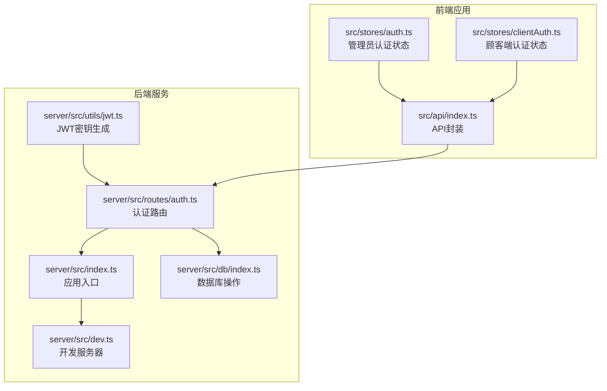
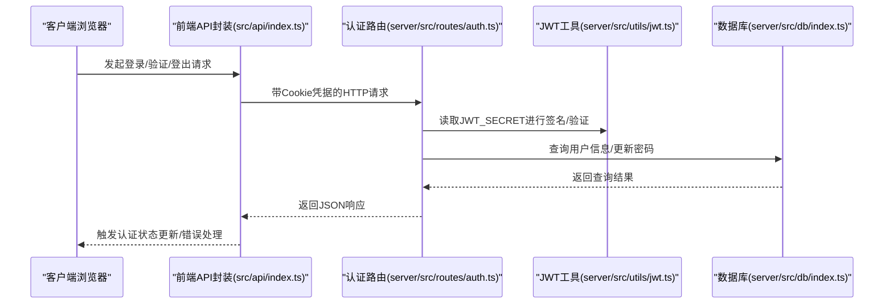
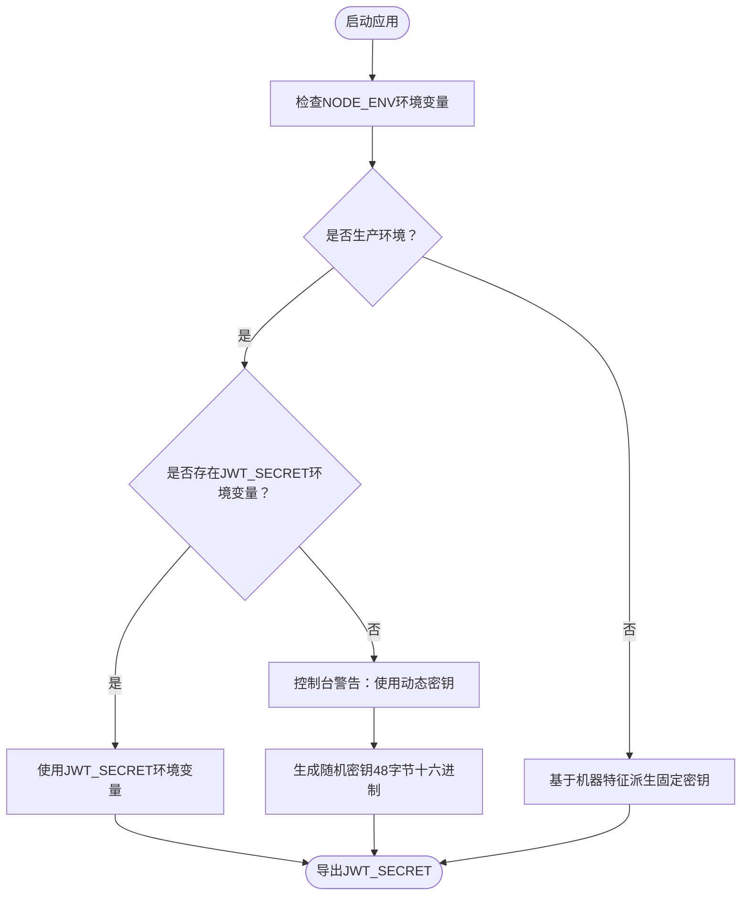
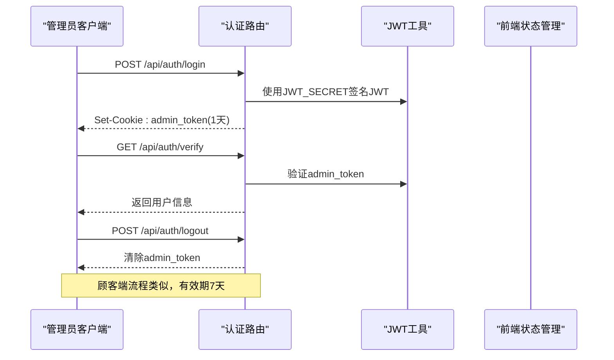
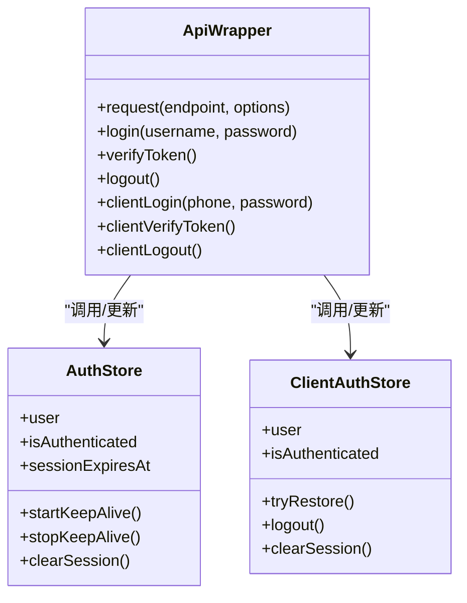
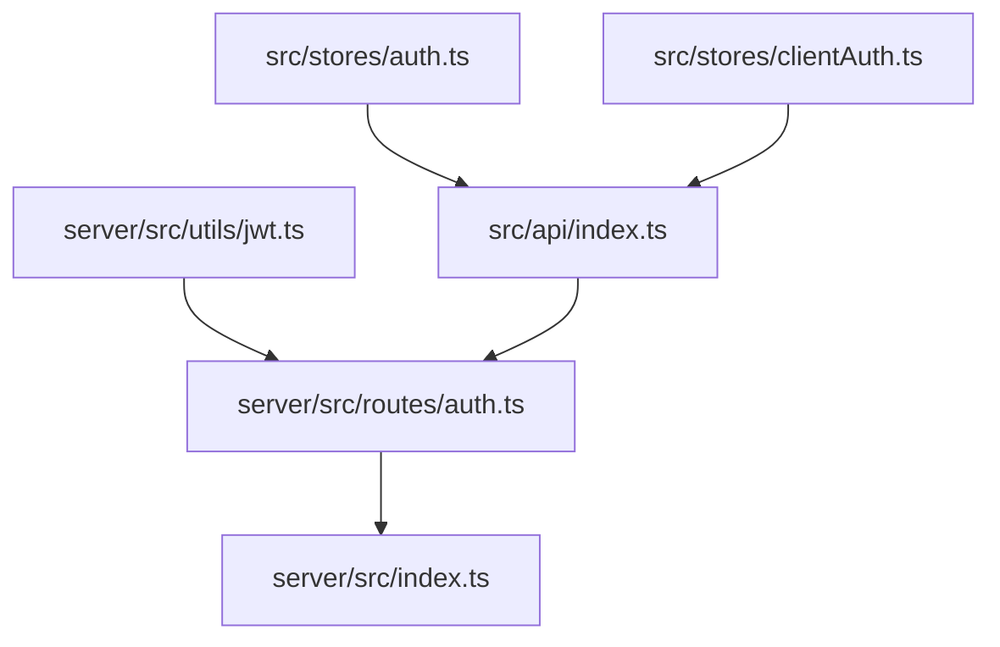

# JWT认证工具

<cite>
**本文档引用的文件**
- [jwt.ts](file://server/src/utils/jwt.ts)
- [auth.ts](file://server/src/routes/auth.ts)
- [index.ts](file://server/src/index.ts)
- [dev.ts](file://server/src/dev.ts)
- [auth.ts](file://src/stores/auth.ts)
- [clientAuth.ts](file://src/stores/clientAuth.ts)
- [index.ts](file://src/api/index.ts)
- [package.json](file://package.json)
- [db/index.ts](file://server/src/db/index.ts)
</cite>

## 目录
1. [简介](#简介)
2. [项目结构](#项目结构)
3. [核心组件](#核心组件)
4. [架构总览](#架构总览)
5. [详细组件分析](#详细组件分析)
6. [依赖关系分析](#依赖关系分析)
7. [性能考量](#性能考量)
8. [故障排除指南](#故障排除指南)
9. [结论](#结论)

## 简介
本文件针对项目中的JWT认证工具进行深入技术文档化，重点涵盖：
- JWT密钥生成机制：开发模式与生产模式的差异化策略
- 基于机器特征的密钥派生算法与动态密钥生成
- 安全性考量：密钥长度、随机性、重启后的令牌处理
- 认证系统应用场景：令牌生成、验证流程、过期处理
- 实际代码示例路径与安全最佳实践

## 项目结构
JWT认证工具位于后端服务的工具模块中，并与认证路由、应用入口、前端状态管理协同工作。

**图表来源**
- [jwt.ts:1-27](file://server/src/utils/jwt.ts#L1-L27)
- [auth.ts:1-405](file://server/src/routes/auth.ts#L1-L405)
- [index.ts:1-176](file://server/src/index.ts#L1-L176)
- [dev.ts:1-67](file://server/src/dev.ts#L1-L67)
- [db/index.ts:1-156](file://server/src/db/index.ts#L1-L156)
- [index.ts:1-608](file://src/api/index.ts#L1-L608)
- [auth.ts:1-128](file://src/stores/auth.ts#L1-L128)
- [clientAuth.ts:1-87](file://src/stores/clientAuth.ts#L1-L87)

**章节来源**
- [jwt.ts:1-27](file://server/src/utils/jwt.ts#L1-L27)
- [auth.ts:1-405](file://server/src/routes/auth.ts#L1-L405)
- [index.ts:1-176](file://server/src/index.ts#L1-L176)
- [dev.ts:1-67](file://server/src/dev.ts#L1-L67)
- [db/index.ts:1-156](file://server/src/db/index.ts#L1-L156)
- [index.ts:1-608](file://src/api/index.ts#L1-L608)
- [auth.ts:1-128](file://src/stores/auth.ts#L1-L128)
- [clientAuth.ts:1-87](file://src/stores/clientAuth.ts#L1-L87)

## 核心组件
- JWT密钥生成器：根据环境变量决定开发模式或生产模式的密钥策略
- 认证路由：提供管理员与顾客的登录、登出、令牌验证接口
- 应用入口：配置安全响应头、CORS、Cookie解析、压缩中间件
- 前端API封装：统一处理认证相关请求，携带Cookie凭据
- 前端状态管理：维护会话状态、过期检测与保活机制

**章节来源**
- [jwt.ts:1-27](file://server/src/utils/jwt.ts#L1-L27)
- [auth.ts:1-405](file://server/src/routes/auth.ts#L1-L405)
- [index.ts:1-176](file://server/src/index.ts#L1-L176)
- [index.ts:1-608](file://src/api/index.ts#L1-L608)
- [auth.ts:1-128](file://src/stores/auth.ts#L1-L128)
- [clientAuth.ts:1-87](file://src/stores/clientAuth.ts#L1-L87)

## 架构总览
JWT认证工具的整体交互流程如下：

**图表来源**
- [index.ts:1-608](file://src/api/index.ts#L1-L608)
- [auth.ts:1-405](file://server/src/routes/auth.ts#L1-L405)
- [jwt.ts:1-27](file://server/src/utils/jwt.ts#L1-L27)
- [db/index.ts:1-156](file://server/src/db/index.ts#L1-L156)

## 详细组件分析

### JWT密钥生成机制
- 开发模式策略
  - 基于机器特征派生固定密钥，避免硬编码在代码中
  - 机器特征指纹包含主机名与用户名，确保同一台机器的密钥稳定
  - 适合tsx watch重启场景，令牌不会因热重载而失效
- 生产模式策略
  - 默认使用动态密钥（随机字节转十六进制），每次启动不同
  - 支持通过环境变量显式指定JWT_SECRET，便于容器化与多实例部署
  - 若未设置环境变量，会在控制台发出警告，提示重启后令牌失效

**图表来源**
- [jwt.ts:1-27](file://server/src/utils/jwt.ts#L1-L27)

**章节来源**
- [jwt.ts:1-27](file://server/src/utils/jwt.ts#L1-L27)

### 认证路由与令牌生命周期
- 管理员认证
  - 登录接口：校验凭据后签发1天有效期的JWT，设置httpOnly Cookie
  - 验证接口：从Cookie读取令牌并验证，返回用户信息
  - 登出接口：清除Cookie
- 顾客认证
  - 登录接口：手机号+密码登录，未注册自动注册；签发7天有效期JWT
  - 验证接口：从Cookie读取令牌并验证，额外校验用户是否仍存在于数据库
  - 登出接口：清除Cookie
- 安全属性
  - httpOnly：防止XSS窃取Cookie
  - secure：生产环境强制HTTPS传输
  - sameSite：限制跨站请求携带Cookie
  - maxAge：设置Cookie有效期

**图表来源**
- [auth.ts:65-179](file://server/src/routes/auth.ts#L65-L179)
- [auth.ts:182-344](file://server/src/routes/auth.ts#L182-L344)
- [jwt.ts:1-27](file://server/src/utils/jwt.ts#L1-L27)

**章节来源**
- [auth.ts:65-179](file://server/src/routes/auth.ts#L65-L179)
- [auth.ts:182-344](file://server/src/routes/auth.ts#L182-L344)

### 前端集成与会话管理
- API封装
  - 统一设置credentials: 'include'，确保Cookie随请求发送
  - 对401进行特殊处理，触发全局认证过期事件
- 管理员认证状态
  - 维护会话过期时间，提供会话保活定时器
  - 在令牌即将过期时主动验证并触发过期事件
- 顾客端认证状态
  - 通过验证接口恢复登录状态
  - 提供登出与清除本地状态的方法

**图表来源**
- [index.ts:1-608](file://src/api/index.ts#L1-L608)
- [auth.ts:1-128](file://src/stores/auth.ts#L1-L128)
- [clientAuth.ts:1-87](file://src/stores/clientAuth.ts#L1-L87)

**章节来源**
- [index.ts:1-608](file://src/api/index.ts#L1-L608)
- [auth.ts:1-128](file://src/stores/auth.ts#L1-L128)
- [clientAuth.ts:1-87](file://src/stores/clientAuth.ts#L1-L87)

### 应用入口与安全中间件
- 安全响应头：X-Content-Type-Options、X-Frame-Options、X-XSS-Protection、Referrer-Policy
- 生产环境CORS：基于环境变量配置白名单
- Cookie解析：启用cookie-parser中间件
- 压缩中间件：对非SSE响应启用gzip压缩，减少带宽占用

**章节来源**
- [index.ts:34-143](file://server/src/index.ts#L34-L143)

### 开发服务器与环境变量
- 开发服务器通过Vite中间件模式集成前端与后端
- 环境变量：PORT、NODE_ENV、JWT_SECRET、FRONTEND_URL
- 生产构建脚本：提供一键生产环境安装脚本，自动生成JWT_SECRET

**章节来源**
- [dev.ts:1-67](file://server/src/dev.ts#L1-L67)
- [package.json:6-14](file://package.json#L6-L14)

## 依赖关系分析
JWT认证工具的依赖关系如下：

**图表来源**
- [jwt.ts:1-27](file://server/src/utils/jwt.ts#L1-L27)
- [auth.ts:1-405](file://server/src/routes/auth.ts#L1-L405)
- [index.ts:1-176](file://server/src/index.ts#L1-L176)
- [index.ts:1-608](file://src/api/index.ts#L1-L608)
- [auth.ts:1-128](file://src/stores/auth.ts#L1-L128)
- [clientAuth.ts:1-87](file://src/stores/clientAuth.ts#L1-L87)

**章节来源**
- [jwt.ts:1-27](file://server/src/utils/jwt.ts#L1-L27)
- [auth.ts:1-405](file://server/src/routes/auth.ts#L1-L405)
- [index.ts:1-176](file://server/src/index.ts#L1-L176)
- [index.ts:1-608](file://src/api/index.ts#L1-L608)
- [auth.ts:1-128](file://src/stores/auth.ts#L1-L128)
- [clientAuth.ts:1-87](file://src/stores/clientAuth.ts#L1-L87)

## 性能考量
- Cookie传输优化：httpOnly + sameSite + secure减少跨站风险，同时避免不必要的明文传输
- 令牌有效期：管理员1天、顾客7天，平衡用户体验与安全
- 前端缓存策略：API层采用stale-while-revalidate，降低重复请求开销
- 压缩中间件：对静态资源与JSON响应启用gzip，显著降低网络延迟

## 故障排除指南
- 生产环境重启后令牌失效
  - 现象：未设置JWT_SECRET导致每次启动生成动态密钥
  - 处理：在生产环境设置JWT_SECRET，或使用安装脚本生成
  - 参考：[jwt.ts:24-26](file://server/src/utils/jwt.ts#L24-L26)
- 登录后仍提示未登录
  - 现象：Cookie未正确设置或跨域问题
  - 处理：确认CORS配置、secure标志、sameSite设置与域名一致
  - 参考：[auth.ts:121-127](file://server/src/routes/auth.ts#L121-L127)
- 401未授权频繁触发
  - 现象：前端未携带Cookie或令牌过期
  - 处理：检查credentials: 'include'、会话保活定时器、令牌有效期
  - 参考：[index.ts:80-114](file://src/api/index.ts#L80-L114)，[auth.ts:37-55](file://src/stores/auth.ts#L37-L55)

**章节来源**
- [jwt.ts:24-26](file://server/src/utils/jwt.ts#L24-L26)
- [auth.ts:121-127](file://server/src/routes/auth.ts#L121-L127)
- [index.ts:80-114](file://src/api/index.ts#L80-L114)
- [auth.ts:37-55](file://src/stores/auth.ts#L37-L55)

## 结论
本JWT认证工具通过开发与生产双模式密钥策略，在保证开发体验的同时兼顾生产安全。配合httpOnly Cookie、CORS与安全响应头，形成完整的认证与防护体系。建议在生产环境中固定JWT_SECRET并结合会话保活机制，确保用户体验与安全性的平衡。