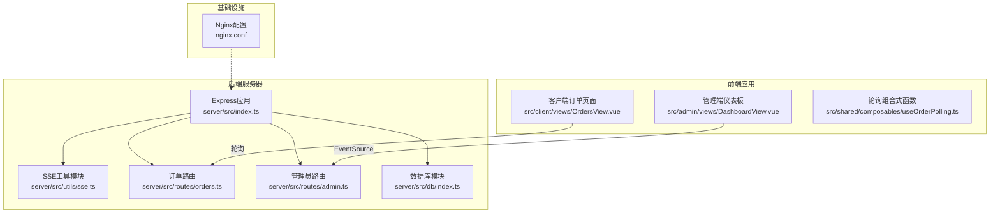
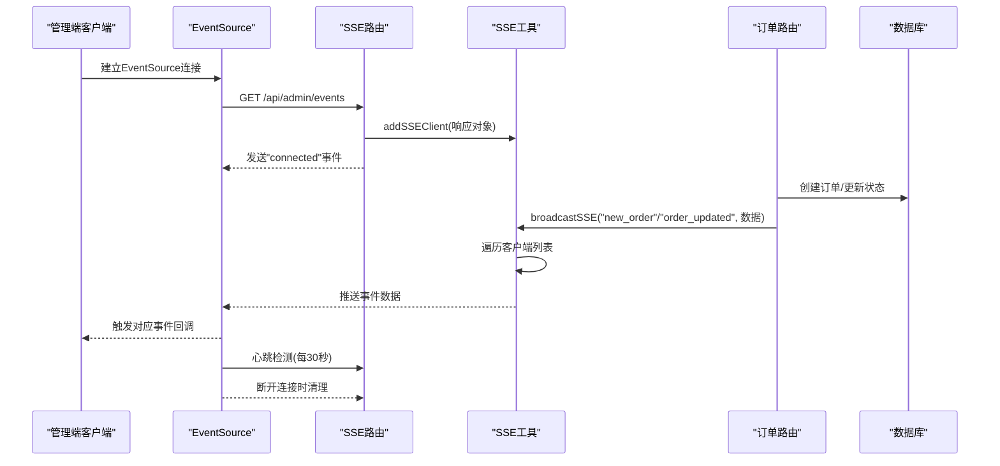
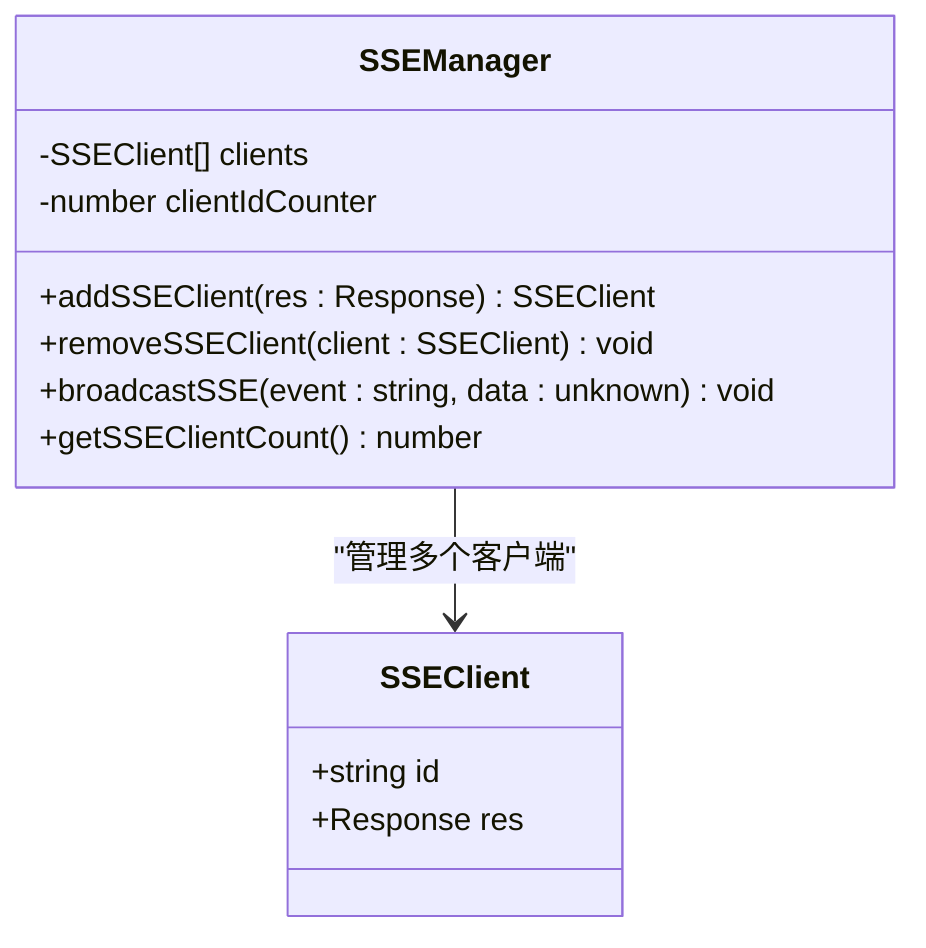
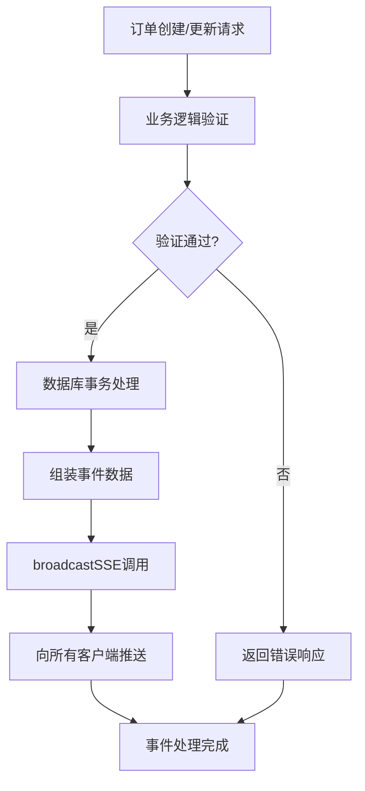
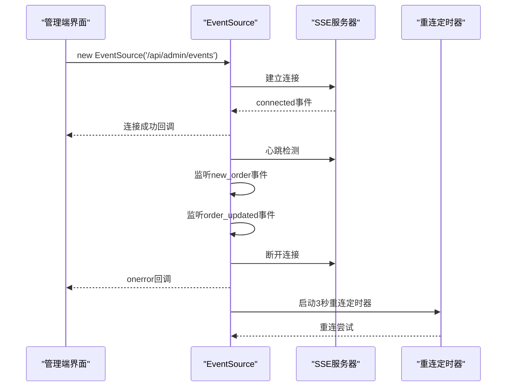
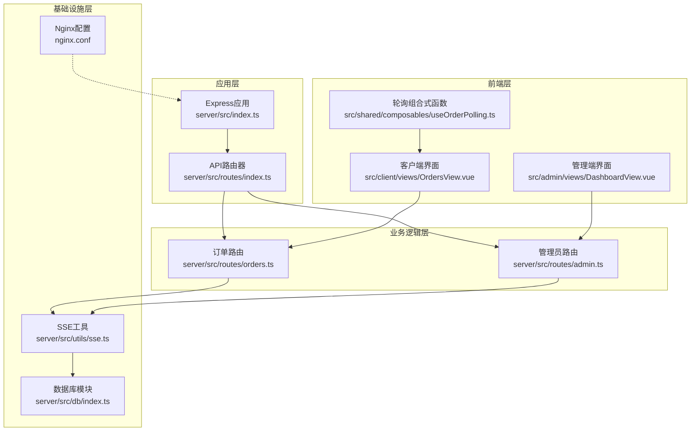

# SSE实时通信

<cite>
**本文档引用的文件**
- [server/src/utils/sse.ts](file://server/src/utils/sse.ts)
- [server/src/routes/orders.ts](file://server/src/route/orders.ts)
- [server/src/routes/admin.ts](file://server/src/routes/admin.ts)
- [server/src/index.ts](file://server/src/index.ts)
- [server/src/db/index.ts](file://server/src/db/index.ts)
- [src/admin/views/DashboardView.vue](file://src/admin/views/DashboardView.vue)
- [src/client/views/OrdersView.vue](file://src/client/views/OrdersView.vue)
- [src/shared/composables/useOrderPolling.ts](file://src/shared/composables/useOrderPolling.ts)
- [src/types/index.ts](file://src/types/index.ts)
- [nginx.conf](file://nginx.conf)
</cite>

## 目录
1. [引言](#引言)
2. [项目结构](#项目结构)
3. [核心组件](#核心组件)
4. [架构概览](#架构概览)
5. [详细组件分析](#详细组件分析)
6. [依赖关系分析](#依赖关系分析)
7. [性能考虑](#性能考虑)
8. [故障排除指南](#故障排除指南)
9. [结论](#结论)
10. [附录](#附录)

## 引言

本文件详细解析RLRMS项目中的SSE（Server-Sent Events）实时通信实现。SSE作为一种轻量级的服务器向客户端推送事件的技术，在本项目中主要用于订单状态的实时更新。文档涵盖事件流协议实现、连接管理、自动重连机制、客户端事件监听器管理、事件类型定义与消息格式规范、错误处理策略，以及在订单状态实时更新场景中的应用。

## 项目结构

该项目采用前后端分离架构，SSE功能主要位于后端Express服务器中，通过独立的SSE客户端管理模块实现事件广播；前端Vue应用通过EventSource进行事件监听，并结合轮询作为降级方案。

**图表来源**
- [server/src/index.ts:34-143](file://server/src/index.ts#L34-L143)
- [server/src/utils/sse.ts:1-59](file://server/src/utils/sse.ts#L1-L59)
- [server/src/routes/admin.ts:133-162](file://server/src/routes/admin.ts#L133-L162)
- [server/src/routes/orders.ts:1-552](file://server/src/routes/orders.ts#L1-L552)
- [src/admin/views/DashboardView.vue:302-452](file://src/admin/views/DashboardView.vue#L302-L452)
- [src/client/views/OrdersView.vue:88-136](file://src/client/views/OrdersView.vue#L88-L136)
- [nginx.conf:1-44](file://nginx.conf#L1-L44)

**章节来源**
- [server/src/index.ts:34-143](file://server/src/index.ts#L34-L143)
- [server/src/utils/sse.ts:1-59](file://server/src/utils/sse.ts#L1-L59)
- [server/src/routes/admin.ts:133-162](file://server/src/routes/admin.ts#L133-L162)
- [server/src/routes/orders.ts:1-552](file://server/src/routes/orders.ts#L1-L552)
- [src/admin/views/DashboardView.vue:302-452](file://src/admin/views/DashboardView.vue#L302-L452)
- [src/client/views/OrdersView.vue:88-136](file://src/client/views/OrdersView.vue#L88-L136)
- [nginx.conf:1-44](file://nginx.conf#L1-L44)

## 核心组件

### SSE客户端管理器
SSE客户端管理器负责维护活动连接列表、添加/移除客户端，以及向所有连接的客户端广播事件。其核心数据结构是一个客户端数组，每个客户端包含唯一ID和底层的HTTP响应对象。

### 订单状态事件广播
订单相关的业务逻辑在订单路由中实现，当发生新订单创建、订单取消或订单项更新等操作时，会调用SSE广播函数向所有连接的管理员端客户端推送相应的事件。

### 管理端事件监听与自动重连
管理端仪表板使用浏览器内置的EventSource API建立持久连接，监听来自服务器的事件流。实现包含心跳保活、错误处理和自动重连机制，确保在网络波动时能够恢复连接。

**章节来源**
- [server/src/utils/sse.ts:3-58](file://server/src/utils/sse.ts#L3-L58)
- [server/src/routes/orders.ts:342-411](file://server/src/routes/orders.ts#L342-L411)
- [src/admin/views/DashboardView.vue:302-452](file://src/admin/views/DashboardView.vue#L302-L452)

## 架构概览

SSE架构采用"服务器推送 + 客户端订阅"模式，服务器维护客户端连接池，客户端通过EventSource建立长连接接收实时事件。

**图表来源**
- [server/src/routes/admin.ts:133-162](file://server/src/routes/admin.ts#L133-L162)
- [server/src/utils/sse.ts:15-51](file://server/src/utils/sse.ts#L15-L51)
- [server/src/routes/orders.ts:342-411](file://server/src/routes/orders.ts#L342-L411)

**章节来源**
- [server/src/routes/admin.ts:133-162](file://server/src/routes/admin.ts#L133-L162)
- [server/src/utils/sse.ts:15-51](file://server/src/utils/sse.ts#L15-L51)
- [server/src/routes/orders.ts:342-411](file://server/src/routes/orders.ts#L342-L411)

## 详细组件分析

### SSE客户端管理器实现

SSE客户端管理器提供了三个核心功能：

#### 客户端连接管理
- 客户端ID生成：使用自增计数器确保唯一性
- 连接存储：将客户端响应对象保存在内存数组中
- 连接清理：在客户端断开或写入失败时自动移除

#### 事件广播机制
- 事件格式：遵循SSE协议标准格式
- 广播策略：遍历客户端副本避免并发修改问题
- 错误处理：捕获写入异常并清理失效连接

**图表来源**
- [server/src/utils/sse.ts:3-58](file://server/src/utils/sse.ts#L3-L58)

**章节来源**
- [server/src/utils/sse.ts:15-58](file://server/src/utils/sse.ts#L15-L58)

### 订单状态事件处理流程

订单路由实现了完整的事件广播流程，包括新订单创建和订单状态变更两种主要事件类型。

#### 新订单事件广播
当客户端提交新订单时，系统执行以下步骤：
1. 业务验证和数据处理
2. 数据库存取和状态更新
3. 事件数据组装
4. SSE广播通知

#### 订单状态更新事件
支持多种状态变更场景：
- 订单取消：推送取消状态
- 加菜操作：推送pending状态并标记类型
- 状态确认：推送confirmed状态

**图表来源**
- [server/src/routes/orders.ts:194-353](file://server/src/routes/orders.ts#L194-L353)
- [server/src/routes/orders.ts:355-418](file://server/src/routes/orders.ts#L355-L418)
- [server/src/routes/orders.ts:420-552](file://server/src/routes/orders.ts#L420-L552)

**章节来源**
- [server/src/routes/orders.ts:194-353](file://server/src/routes/orders.ts#L194-L353)
- [server/src/routes/orders.ts:355-418](file://server/src/routes/orders.ts#L355-L418)
- [server/src/routes/orders.ts:420-552](file://server/src/routes/orders.ts#L420-L552)

### 管理端SSE客户端实现

管理端使用EventSource API实现完整的事件监听和处理机制。

#### 连接建立与心跳保活
- SSE连接：通过`new EventSource('/api/admin/events', { withCredentials: true })`建立持久连接
- 初始连接确认：服务器发送"connected"事件包含客户端ID
- 心跳机制：每30秒发送心跳包保持连接活跃

#### 事件监听与处理
- 新订单事件：解析订单数据，根据筛选条件决定增量更新还是全量刷新
- 订单更新事件：更新本地状态，处理加菜请求的特殊逻辑

#### 自动重连机制
- 错误处理：连接断开时触发重连逻辑
- 退避策略：固定延迟3秒后重连
- 条件重连：仅在自动刷新启用时尝试重连

**图表来源**
- [src/admin/views/DashboardView.vue:308-390](file://src/admin/views/DashboardView.vue#L308-L390)

**章节来源**
- [src/admin/views/DashboardView.vue:302-452](file://src/admin/views/DashboardView.vue#L302-L452)

### 客户端轮询降级方案

虽然管理端实现了SSE实时推送，但客户端订单页面仍保留了轮询机制作为降级方案。

#### 轮询配置
- 轮询间隔：5秒
- 可见性感知：页面隐藏时暂停轮询
- 计数器机制：跟踪新增订单数量

#### 与SSE的协同
- 条件轮询：当SSE连接正常时停止轮询
- 自动切换：SSE断开时自动启用轮询

**章节来源**
- [src/shared/composables/useOrderPolling.ts:10-74](file://src/shared/composables/useOrderPolling.ts#L10-L74)
- [src/client/views/OrdersView.vue:88-136](file://src/client/views/OrdersView.vue#L88-L136)

## 依赖关系分析

SSE实现涉及多个模块间的协作关系，形成了清晰的分层架构。

**图表来源**
- [server/src/index.ts:1-176](file://server/src/index.ts#L1-L176)
- [server/src/routes/index.ts:1-18](file://server/src/routes/index.ts#L1-L18)
- [server/src/utils/sse.ts:1-59](file://server/src/utils/sse.ts#L1-L59)
- [server/src/db/index.ts:1-156](file://server/src/db/index.ts#L1-L156)
- [nginx.conf:1-44](file://nginx.conf#L1-L44)

**章节来源**
- [server/src/index.ts:1-176](file://server/src/index.ts#L1-L176)
- [server/src/routes/index.ts:1-18](file://server/src/routes/index.ts#L1-L18)
- [server/src/utils/sse.ts:1-59](file://server/src/utils/sse.ts#L1-L59)
- [server/src/db/index.ts:1-156](file://server/src/db/index.ts#L1-L156)
- [nginx.conf:1-44](file://nginx.conf#L1-L44)

## 性能考虑

### 连接池管理
- 内存存储：客户端连接存储在内存数组中，适合中小规模并发
- 连接清理：自动检测和清理失效连接，避免内存泄漏
- 心跳保活：30秒心跳间隔平衡资源消耗和连接稳定性

### 消息队列与缓冲
- 即时推送：事件直接写入客户端响应流，无额外缓冲层
- 流式传输：利用HTTP响应流特性，实现真正的实时推送
- 压缩禁用：SSE响应禁用Gzip压缩，确保事件实时性

### 内存使用控制
- 连接上限：当前实现未设置连接数上限，生产环境需考虑扩展
- 数据序列化：事件数据使用JSON序列化，注意大数据量时的内存占用
- 定时器管理：正确清理心跳定时器和重连定时器

### 数据库性能优化
- 批量操作：订单创建和更新使用数据库事务批量处理
- 查询优化：避免N+1查询问题，使用IN子句批量获取订单明细
- 缓存策略：集成Redis缓存减少数据库压力

**章节来源**
- [server/src/utils/sse.ts:37-51](file://server/src/utils/sse.ts#L37-L51)
- [server/src/index.ts:46-56](file://server/src/index.ts#L46-L56)
- [server/src/routes/orders.ts:96-128](file://server/src/routes/orders.ts#L96-L128)
- [server/src/db/index.ts:47-73](file://server/src/db/index.ts#L47-L73)

## 故障排除指南

### 常见问题诊断

#### SSE连接失败
**症状**：管理端无法接收实时订单更新
**排查步骤**：
1. 检查服务器日志中的SSE连接记录
2. 验证Nginx配置中SSE端点的特殊处理
3. 确认EventSource连接URL正确性
4. 检查浏览器开发者工具Network面板中的SSE连接状态

#### 事件接收异常
**症状**：部分事件未被客户端接收
**排查步骤**：
1. 检查服务器端广播函数的调用频率
2. 验证客户端事件监听器的注册情况
3. 确认事件数据格式符合预期
4. 检查客户端网络状况和防火墙设置

#### 自动重连失效
**症状**：连接断开后无法自动恢复
**排查步骤**：
1. 检查客户端onerror回调的执行情况
2. 验证重连定时器的创建和清理逻辑
3. 确认SSE_RECONNECT_DELAY常量值合理
4. 检查服务器端连接清理机制

### 部署配置要点

#### Nginx配置注意事项
- SSE端点必须在通用location规则之前声明
- 关闭代理缓冲确保事件实时性
- 设置适当的超时参数（连接超时60s，读写超时24小时）
- 保持连接存活时间65秒

#### Express应用配置
- SSE响应禁用Gzip压缩
- 设置合适的Content-Type头为text/event-stream
- 配置CORS允许跨域访问
- 实现健康检查端点监控服务状态

**章节来源**
- [nginx.conf:27-44](file://nginx.conf#L27-L44)
- [server/src/index.ts:45-96](file://server/src/index.ts#L45-L96)
- [src/admin/views/DashboardView.vue:375-390](file://src/admin/views/DashboardView.vue#L375-L390)

## 结论

本项目的SSE实现实现了完整的服务器推送机制，具有以下特点：

1. **简洁高效**：基于原生EventSource API，实现简单可靠
2. **容错性强**：完善的错误处理和自动重连机制
3. **性能优化**：禁用压缩、心跳保活、连接池管理
4. **扩展性好**：模块化设计便于功能扩展

在订单状态实时更新场景中，SSE提供了比传统轮询更好的用户体验和更低的服务器负载。建议在生产环境中结合监控告警机制，持续优化连接管理和事件处理性能。

## 附录

### 事件类型定义

| 事件名称 | 数据格式 | 触发时机 | 客户端处理 |
|---------|---------|---------|-----------|
| connected | `{clientId: string}` | SSE连接建立 | 停止轮询，标记连接状态 |
| new_order | Order对象 | 新订单创建 | 增量更新订单列表 |
| order_updated | `{id: string, status: string, type?: string}` | 订单状态变更 | 更新特定订单状态 |

### 配置参数说明

| 参数名称 | 默认值 | 说明 |
|---------|--------|------|
| SSE_RECONNECT_DELAY | 3000ms | 重连延迟时间 |
| HEARTBEAT_INTERVAL | 30000ms | 心跳检测间隔 |
| POLLING_INTERVAL | 5000ms | 轮询间隔（降级方案） |
| NGINX_PROXY_TIMEOUT | 86400s | Nginx代理超时 |

**章节来源**
- [src/admin/views/DashboardView.vue:306-306](file://src/admin/views/DashboardView.vue#L306-L306)
- [src/admin/views/DashboardView.vue:308-390](file://src/admin/views/DashboardView.vue#L308-L390)
- [nginx.conf:41-44](file://nginx.conf#L41-L44)