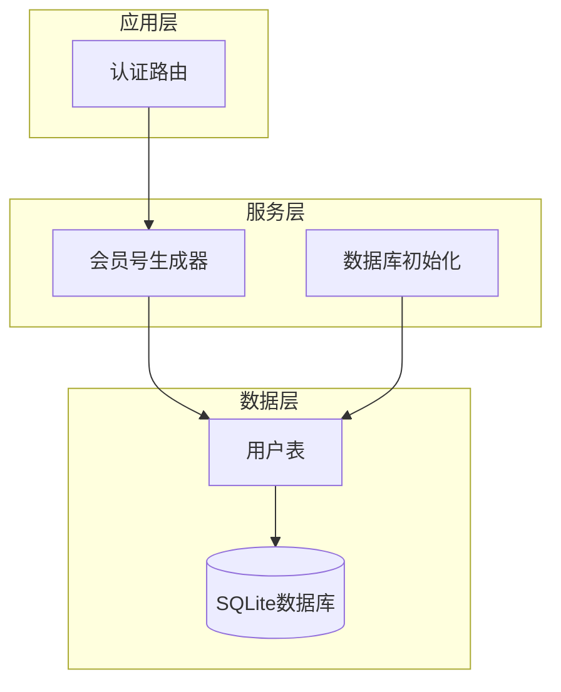
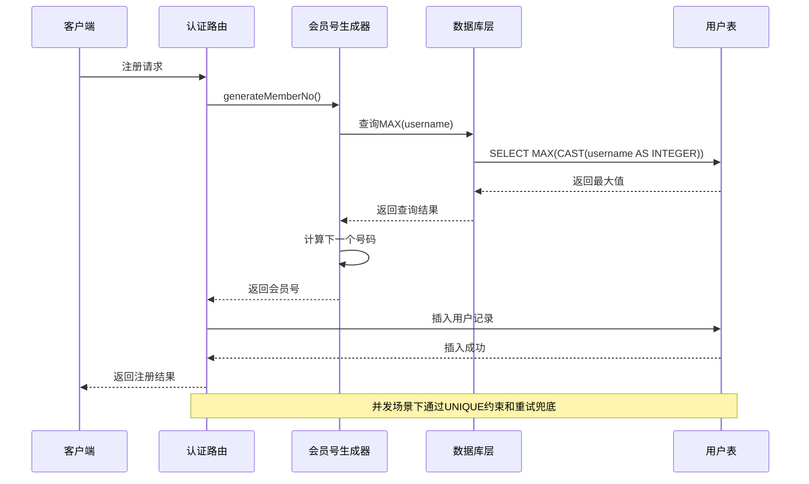
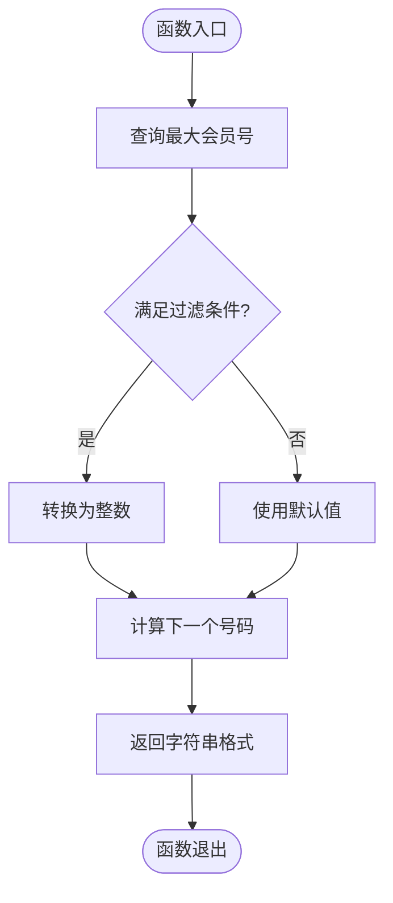
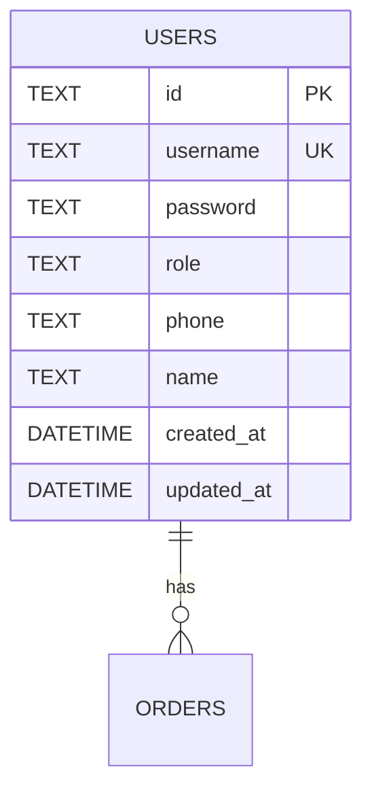
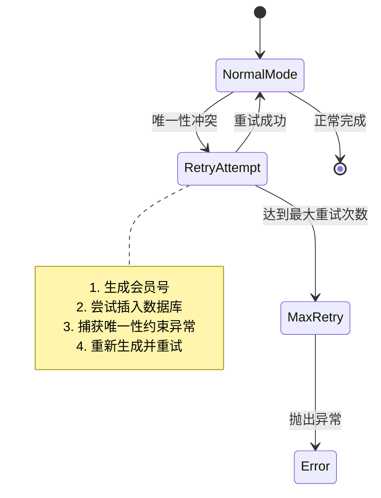
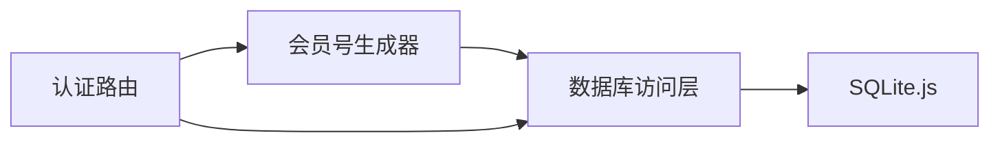

# 会员号生成器

<cite>
**本文档引用的文件**
- [server/src/utils/memberNo.ts](file://server/src/utils/memberNo.ts)
- [server/src/db/init.ts](file://server/src/db/init.ts)
- [server/src/db/index.ts](file://server/src/db/index.ts)
- [server/src/routes/auth.ts](file://server/src/routes/auth.ts)
</cite>

## 目录
1. [简介](#简介)
2. [项目结构](#项目结构)
3. [核心组件](#核心组件)
4. [架构概览](#架构概览)
5. [详细组件分析](#详细组件分析)
6. [依赖关系分析](#依赖关系分析)
7. [性能考量](#性能考量)
8. [故障排除指南](#故障排除指南)
9. [结论](#结论)
10. [附录](#附录)

## 简介
本文件是会员号生成器的专门技术文档，专注于解析系统中的会员号生成算法设计原理。该系统采用纯数字会员号方案，通过数据库约束和重试机制确保唯一性，并在并发环境下提供可靠的生成能力。文档将深入分析算法设计、格式规范、并发控制、性能优化以及最佳实践。

## 项目结构
会员号生成功能主要分布在以下模块中：
- 生成器工具：负责核心的会员号生成逻辑
- 数据库初始化：定义用户表结构和唯一约束
- 数据库访问层：提供统一的数据库操作接口
- 认证路由：消费生成器并在并发场景下进行重试兜底



**图表来源**
- [server/src/utils/memberNo.ts:12-18](file://server/src/utils/memberNo.ts#L12-L18)
- [server/src/db/init.ts:12-22](file://server/src/db/init.ts#L12-L22)

**章节来源**
- [server/src/utils/memberNo.ts:1-19](file://server/src/utils/memberNo.ts#L1-L19)
- [server/src/db/init.ts:1-200](file://server/src/db/init.ts#L1-L200)

## 核心组件
会员号生成器采用简洁而高效的纯数字方案，具有以下特点：

### 设计原则
- **纯数字格式**：所有会员号均为5-6位纯数字
- **起始值约定**：从10001开始递增
- **范围限制**：通过长度过滤排除手机号码
- **唯一性保障**：依赖数据库UNIQUE约束和重试机制

### 关键参数
- 起始会员号：10001
- 最大长度：6位数字
- 过滤条件：username长度≤6且为纯数字

**章节来源**
- [server/src/utils/memberNo.ts:3-18](file://server/src/utils/memberNo.ts#L3-L18)

## 架构概览
会员号生成的完整流程涉及多个层次的协作：



**图表来源**
- [server/src/utils/memberNo.ts:12-18](file://server/src/utils/memberNo.ts#L12-L18)
- [server/src/routes/auth.ts:231-246](file://server/src/routes/auth.ts#L231-L246)

## 详细组件分析

### 会员号生成器实现
生成器采用基于数据库查询的乐观并发控制策略：



**图表来源**
- [server/src/utils/memberNo.ts:12-18](file://server/src/utils/memberNo.ts#L12-L18)

#### 核心算法解析
1. **查询策略**：使用SQL聚合函数查找满足条件的最大值
2. **过滤机制**：通过长度和模式匹配排除手机号码
3. **类型转换**：将文本转换为整数进行数值运算
4. **边界处理**：空结果时使用起始值作为基准

#### 数据结构复杂度
- 时间复杂度：O(n)（n为满足条件的记录数量）
- 空间复杂度：O(1)
- 查询优化：依赖username字段的UNIQUE索引

**章节来源**
- [server/src/utils/memberNo.ts:12-18](file://server/src/utils/memberNo.ts#L12-L18)

### 数据库约束与初始化
用户表结构确保了会员号的唯一性和完整性：



**图表来源**
- [server/src/db/init.ts:12-22](file://server/src/db/init.ts#L12-L22)

#### 约束设计要点
- username字段设置为UNIQUE NOT NULL
- 自动创建索引提升查询性能
- 角色字段默认为customer
- 时间戳字段自动维护

**章节来源**
- [server/src/db/init.ts:12-22](file://server/src/db/init.ts#L12-L22)

### 并发控制机制
系统通过双重保障机制确保并发安全性：



**图表来源**
- [server/src/routes/auth.ts:231-246](file://server/src/routes/auth.ts#L231-L246)

#### 并发处理策略
- **乐观锁**：先生成再插入，利用数据库约束检测冲突
- **重试机制**：最多3次重试机会
- **幂等设计**：多次执行不会产生副作用
- **异常处理**：超过重试次数抛出明确错误

**章节来源**
- [server/src/routes/auth.ts:231-246](file://server/src/routes/auth.ts#L231-L246)

## 依赖关系分析

### 组件耦合度
会员号生成器具有良好的内聚性和低耦合性：
- 仅依赖数据库访问层的查询能力
- 不依赖具体的数据存储实现
- 与业务逻辑解耦

### 外部依赖
- SQLite.js：轻量级嵌入式数据库
- sql.js：JavaScript版本的SQLite
- UUID库：用于生成用户ID



**图表来源**
- [server/src/utils/memberNo.ts:1](file://server/src/utils/memberNo.ts#L1)
- [server/src/db/index.ts:101-125](file://server/src/db/index.ts#L101-L125)

**章节来源**
- [server/src/utils/memberNo.ts:1-19](file://server/src/utils/memberNo.ts#L1-L19)
- [server/src/db/index.ts:101-125](file://server/src/db/index.ts#L101-L125)

## 性能考量

### 查询性能优化
- **索引策略**：username字段自动建立UNIQUE索引
- **查询优化**：使用WHERE条件减少扫描范围
- **缓存机制**：数据库层提供连接池和查询缓存

### 写入性能优化
- **批量操作**：支持事务批量处理
- **延迟保存**：防抖机制合并频繁写入
- **异步处理**：后台任务处理非关键操作

### 并发性能
- **无锁设计**：避免显式锁竞争
- **重试退避**：指数退避减少冲突概率
- **资源隔离**：每个连接独立的事务上下文

## 故障排除指南

### 常见问题及解决方案

#### 1. 会员号冲突
**症状**：插入时出现唯一性约束错误
**原因**：并发注册导致重复号码
**解决**：检查重试逻辑是否正常工作

#### 2. 性能问题
**症状**：生成速度缓慢
**原因**：数据库负载过高
**解决**：优化查询条件，增加索引

#### 3. 数据不一致
**症状**：历史数据迁移异常
**原因**：迁移脚本执行中断
**解决**：检查幂等性设计，重新执行迁移

### 调试建议
- 启用详细的日志记录
- 监控数据库查询性能
- 验证并发场景下的正确性
- 定期检查数据完整性

**章节来源**
- [server/src/routes/auth.ts:231-246](file://server/src/routes/auth.ts#L231-L246)

## 结论
会员号生成器采用了简洁而有效的设计模式，通过纯数字格式、数据库约束和重试机制实现了高可靠性的并发生成。系统在保证数据一致性的同时，提供了良好的性能表现和可维护性。建议在未来版本中考虑添加校验位验证和更丰富的格式选项。

## 附录

### 使用示例
```javascript
// 基本使用
const memberNo = generateMemberNo();
console.log(`新会员号: ${memberNo}`);

// 在注册流程中使用
try {
  const memberNo = generateMemberNo();
  // 执行插入操作
} catch (error) {
  // 处理重试逻辑
}
```

### 最佳实践
- **冲突避免**：利用数据库约束和重试机制
- **批量生成**：在批量导入时使用事务处理
- **历史兼容**：保持与现有系统的兼容性
- **监控告警**：建立性能和错误监控体系

### 扩展建议
- 添加会员号格式验证
- 实现批量生成优化
- 增加历史数据迁移工具
- 提供配置化参数调整