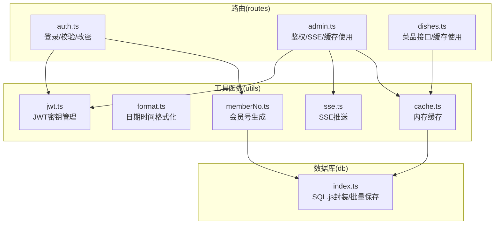
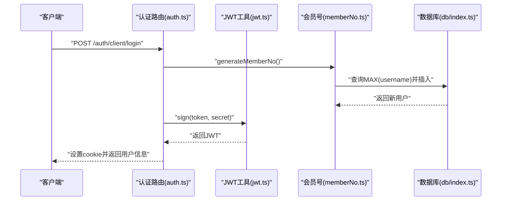
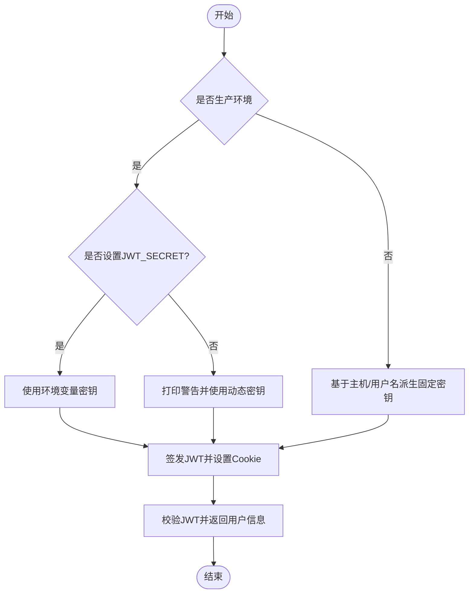
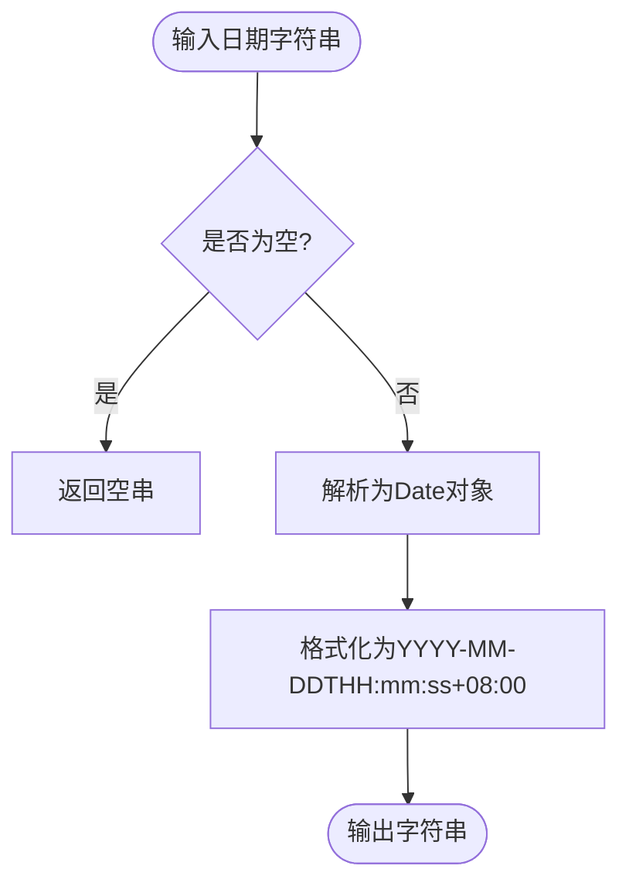
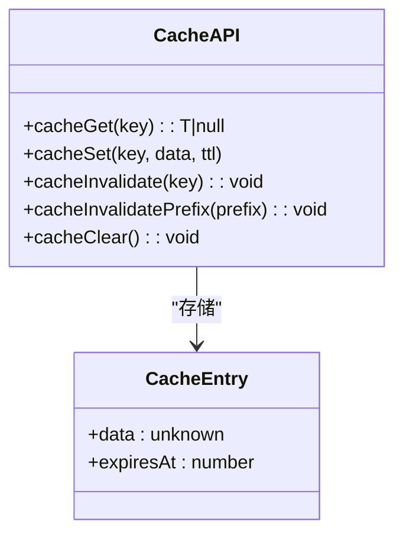
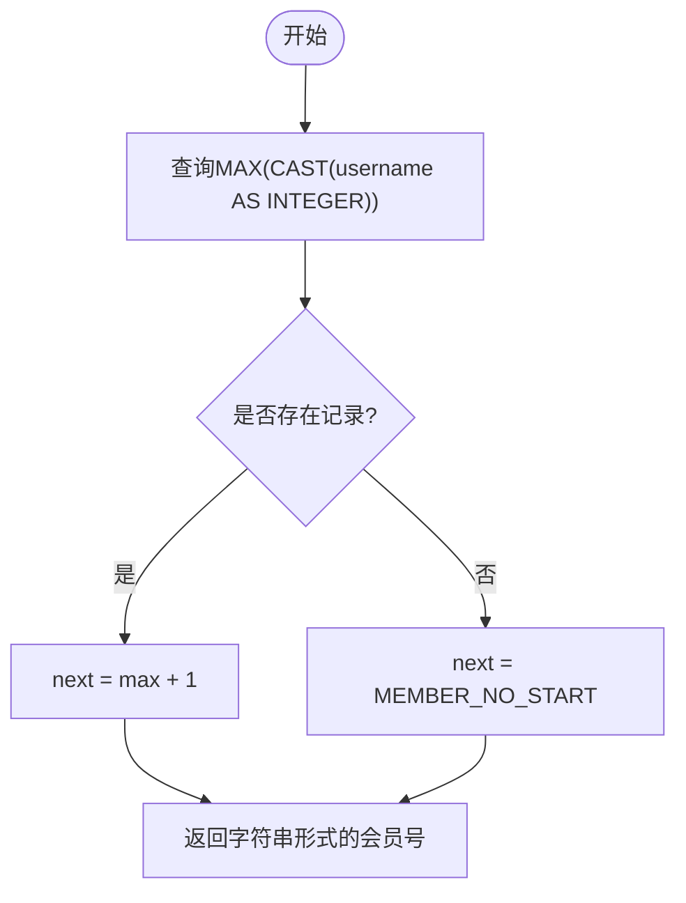
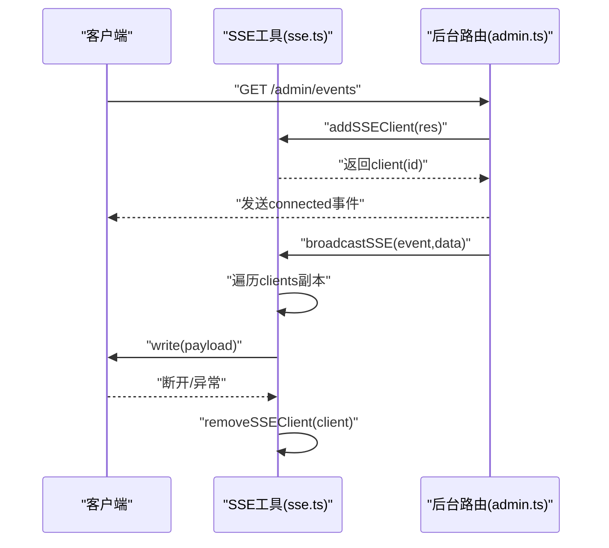
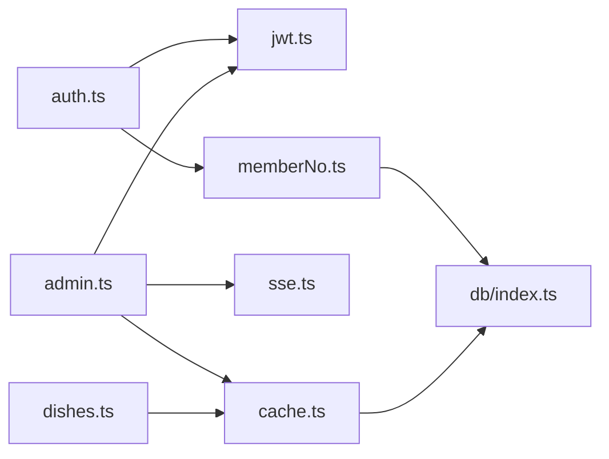

# 工具函数库

<cite>
**本文引用的文件**
- [jwt.ts](file://server/src/utils/jwt.ts)
- [format.ts](file://server/src/utils/format.ts)
- [cache.ts](file://server/src/utils/cache.ts)
- [memberNo.ts](file://server/src/utils/memberNo.ts)
- [sse.ts](file://server/src/utils/sse.ts)
- [auth.ts](file://server/src/routes/auth.ts)
- [admin.ts](file://server/src/routes/admin.ts)
- [dishes.ts](file://server/src/routes/dishes.ts)
- [index.ts](file://server/src/db/index.ts)
</cite>

## 目录
1. [简介](#简介)
2. [项目结构](#项目结构)
3. [核心组件](#核心组件)
4. [架构总览](#架构总览)
5. [详细组件分析](#详细组件分析)
6. [依赖关系分析](#依赖关系分析)
7. [性能考量](#性能考量)
8. [故障排查指南](#故障排查指南)
9. [结论](#结论)
10. [附录](#附录)

## 简介
本文件系统性梳理后端工具函数库，聚焦以下能力：
- JWT 认证工具：令牌生成、验证、过期处理与密钥管理
- 数据格式化工具：日期时间格式化
- 缓存工具：内存缓存策略、失效机制与性能优化
- 会员号生成算法：基于数据库约束的并发安全策略
- SSE 推送机制：实时事件广播与客户端生命周期管理

文档同时提供使用示例与最佳实践，涵盖错误处理与性能优化建议。

## 项目结构
工具函数集中位于 server/src/utils 下，配套路由层在 server/src/routes 中消费这些工具。数据库访问封装在 server/src/db/index.ts，为工具函数提供持久化支持。

图示来源
- [jwt.ts:1-27](file://server/src/utils/jwt.ts#L1-L27)
- [format.ts:1-12](file://server/src/utils/format.ts#L1-L12)
- [cache.ts:1-73](file://server/src/utils/cache.ts#L1-L73)
- [memberNo.ts:1-19](file://server/src/utils/memberNo.ts#L1-L19)
- [sse.ts:1-59](file://server/src/utils/sse.ts#L1-L59)
- [auth.ts:1-405](file://server/src/routes/auth.ts#L1-L405)
- [admin.ts:1-200](file://server/src/routes/admin.ts#L1-L200)
- [dishes.ts:1-200](file://server/src/routes/dishes.ts#L1-L200)
- [index.ts:1-156](file://server/src/db/index.ts#L1-L156)

章节来源
- [jwt.ts:1-27](file://server/src/utils/jwt.ts#L1-L27)
- [format.ts:1-12](file://server/src/utils/format.ts#L1-L12)
- [cache.ts:1-73](file://server/src/utils/cache.ts#L1-L73)
- [memberNo.ts:1-19](file://server/src/utils/memberNo.ts#L1-L19)
- [sse.ts:1-59](file://server/src/utils/sse.ts#L1-L59)
- [auth.ts:1-405](file://server/src/routes/auth.ts#L1-L405)
- [admin.ts:1-200](file://server/src/routes/admin.ts#L1-L200)
- [dishes.ts:1-200](file://server/src/routes/dishes.ts#L1-L200)
- [index.ts:1-156](file://server/src/db/index.ts#L1-L156)

## 核心组件
- JWT 认证工具：统一密钥来源与环境适配，配合 Express Cookie 存储与校验
- 数据格式化工具：标准化日期时间输出，便于前端展示与日志记录
- 缓存工具：基于 Map 的 TTL 内存缓存，支持键前缀失效与全局清空
- 会员号生成：基于数据库唯一约束与重试策略，保证并发安全
- SSE 推送：服务端事件流，支持心跳保活与异常清理

章节来源
- [jwt.ts:1-27](file://server/src/utils/jwt.ts#L1-L27)
- [format.ts:1-12](file://server/src/utils/format.ts#L1-L12)
- [cache.ts:1-73](file://server/src/utils/cache.ts#L1-L73)
- [memberNo.ts:1-19](file://server/src/utils/memberNo.ts#L1-L19)
- [sse.ts:1-59](file://server/src/utils/sse.ts#L1-L59)

## 架构总览
JWT 与 SSE 在路由层被广泛使用；缓存贯穿菜品与后台配置等高频读取场景；会员号生成在客户首次登录自动注册时使用；格式化工具服务于数据输出一致性。

图示来源
- [auth.ts:182-294](file://server/src/routes/auth.ts#L182-L294)
- [jwt.ts:20-22](file://server/src/utils/jwt.ts#L20-L22)
- [memberNo.ts:12-18](file://server/src/utils/memberNo.ts#L12-L18)
- [index.ts:112-125](file://server/src/db/index.ts#L112-L125)

## 详细组件分析

### JWT 认证工具
- 密钥管理
  - 开发环境：基于主机名与用户名派生固定密钥，保证热重载不丢失 token
  - 生产环境：优先使用环境变量，否则随机生成动态密钥（每次启动不同）
  - 若生产未设置密钥，会打印警告提示
- 令牌生成与验证
  - 登录成功后签发 JWT，并设置 HttpOnly Cookie
  - 校验接口使用密钥验证 token，失败返回 401
- 过期处理
  - 登录 token 设置 1 天有效期，客户端 token 设置 7 天
  - 客户端校验时额外检查用户是否存在，防“用户被删但仍持有 token”

图示来源
- [jwt.ts:4-26](file://server/src/utils/jwt.ts#L4-L26)
- [auth.ts:114-118](file://server/src/routes/auth.ts#L114-L118)
- [auth.ts:165](file://server/src/routes/auth.ts#L165)
- [auth.ts:265-269](file://server/src/routes/auth.ts#L265-L269)
- [auth.ts:315](file://server/src/routes/auth.ts#L315)

章节来源
- [jwt.ts:1-27](file://server/src/utils/jwt.ts#L1-L27)
- [auth.ts:65-144](file://server/src/routes/auth.ts#L65-L144)
- [auth.ts:158-179](file://server/src/routes/auth.ts#L158-L179)
- [auth.ts:182-294](file://server/src/routes/auth.ts#L182-L294)
- [auth.ts:308-344](file://server/src/routes/auth.ts#L308-L344)

### 数据格式化工具
- 功能：将输入字符串转为 ISO-8601 风格的本地时间字符串（+08:00）
- 使用场景：日志、响应体中的时间字段标准化
- 注意：对空值返回空串，避免异常传播

图示来源
- [format.ts:1-11](file://server/src/utils/format.ts#L1-L11)

章节来源
- [format.ts:1-12](file://server/src/utils/format.ts#L1-L12)

### 缓存工具
- 设计要点
  - 基于 Map 的内存缓存，每个条目包含数据与过期时间戳
  - 默认 TTL 30 秒，可按需传入自定义 TTL
  - 提供精确键失效、前缀失效与全量清空
  - 键常量集中管理，便于跨模块复用
- 性能优化
  - 读取命中直接返回，减少数据库压力
  - 失效粒度细到前缀，降低冗余缓存
- 典型使用
  - 菜品列表、首页聚合数据、分类列表等高频只读数据
  - 变更时主动失效相关键，保证一致性

图示来源
- [cache.ts:6-36](file://server/src/utils/cache.ts#L6-L36)
- [cache.ts:41-61](file://server/src/utils/cache.ts#L41-L61)
- [cache.ts:64-72](file://server/src/utils/cache.ts#L64-L72)

章节来源
- [cache.ts:1-73](file://server/src/utils/cache.ts#L1-L73)
- [dishes.ts:25-65](file://server/src/routes/dishes.ts#L25-L65)
- [dishes.ts:69-117](file://server/src/routes/dishes.ts#L69-L117)
- [dishes.ts:161-174](file://server/src/routes/dishes.ts#L161-L174)

### 会员号生成算法
- 策略
  - 查询 username 长度 ≤ 6 且为纯数字的最大值 +1
  - 起始值固定，避免与手机号混淆
  - 并发冲突通过数据库唯一约束与调用方重试兜底
- 流程
  - 读取最大值，计算下一个号码
  - 自动注册时使用该号码插入用户记录
  - 失败重试最多若干次，最终保证唯一性

图示来源
- [memberNo.ts:12-18](file://server/src/utils/memberNo.ts#L12-L18)
- [auth.ts:233-246](file://server/src/routes/auth.ts#L233-L246)

章节来源
- [memberNo.ts:1-19](file://server/src/utils/memberNo.ts#L1-L19)
- [auth.ts:232-246](file://server/src/routes/auth.ts#L232-L246)

### SSE 推送机制
- 组件
  - 客户端连接池：维护 SSEClient 列表与自增 ID
  - 广播：向所有可写客户端发送事件，自动清理不可写连接
  - 心跳：保持长连接活跃，避免中间代理超时
- 使用流程
  - 建立 SSE 连接，返回连接 ID
  - 业务变更时调用广播方法推送事件
  - 断开或异常时清理连接

图示来源
- [admin.ts:134-162](file://server/src/routes/admin.ts#L134-L162)
- [sse.ts:15-51](file://server/src/utils/sse.ts#L15-L51)

章节来源
- [admin.ts:134-162](file://server/src/routes/admin.ts#L134-L162)
- [sse.ts:1-59](file://server/src/utils/sse.ts#L1-L59)

## 依赖关系分析
- 路由依赖
  - 认证路由依赖 JWT 工具进行签发与校验
  - 客户端登录依赖会员号生成与数据库交互
  - 后台路由依赖 JWT 进行鉴权、SSE 进行实时推送、缓存进行读加速
  - 菜品路由依赖缓存工具进行数据缓存与失效
- 数据库依赖
  - 会员号生成依赖数据库查询最大值
  - 缓存工具通过数据库封装执行查询与批量写入

图示来源
- [auth.ts:5-7](file://server/src/routes/auth.ts#L5-L7)
- [auth.ts:232-235](file://server/src/routes/auth.ts#L232-L235)
- [admin.ts:15-17](file://server/src/routes/admin.ts#L15-L17)
- [dishes.ts:2-3](file://server/src/routes/dishes.ts#L2-L3)
- [index.ts:112-125](file://server/src/db/index.ts#L112-L125)

章节来源
- [auth.ts:1-405](file://server/src/routes/auth.ts#L1-L405)
- [admin.ts:1-200](file://server/src/routes/admin.ts#L1-L200)
- [dishes.ts:1-200](file://server/src/routes/dishes.ts#L1-L200)
- [index.ts:1-156](file://server/src/db/index.ts#L1-L156)

## 性能考量
- JWT
  - 生产环境建议显式设置 JWT_SECRET，避免动态密钥导致重启后 token 失效
  - 对于高并发登录场景，结合 IP 限流与数据库索引优化
- 缓存
  - 合理设置 TTL，热点数据可适当延长
  - 使用前缀失效精准清理，避免全量清空造成抖动
  - 对只读数据尽量走缓存，减少数据库压力
- 会员号
  - 并发冲突通过唯一约束与重试解决，重试次数不宜过大
  - 避免频繁扫描大表，必要时建立合适索引
- SSE
  - 心跳保活降低连接中断概率
  - 广播时遍历副本，避免迭代中修改数组
  - 异常捕获与清理，防止内存泄漏

## 故障排查指南
- JWT
  - 现象：登录成功但校验失败
  - 排查：确认密钥来源一致（开发/生产）、Cookie 是否正确设置、token 是否过期
- 会员号
  - 现象：并发注册失败或重复
  - 排查：检查唯一约束是否生效、重试逻辑是否执行、数据库事务隔离级别
- 缓存
  - 现象：读取旧数据
  - 排查：确认 TTL 是否过短、失效策略是否覆盖到目标键、是否遗漏失效点
- SSE
  - 现象：客户端无法接收事件
  - 排查：确认响应头设置、心跳是否正常、客户端断开回调是否触发清理

章节来源
- [jwt.ts:24-26](file://server/src/utils/jwt.ts#L24-L26)
- [auth.ts:34-405](file://server/src/routes/auth.ts#L34-L405)
- [cache.ts:18-26](file://server/src/utils/cache.ts#L18-L26)
- [sse.ts:37-51](file://server/src/utils/sse.ts#L37-L51)

## 结论
该工具函数库围绕认证、格式化、缓存、会员号与实时推送构建了清晰的基础设施层。通过合理的密钥管理、TTL 缓存、并发安全策略与 SSE 生命周期管理，既满足了开发效率，也兼顾了运行时稳定性与性能。建议在生产环境中明确密钥配置、完善缓存失效策略与监控告警，持续优化热点数据的缓存命中率与推送链路的可用性。

## 附录
- 使用示例与最佳实践
  - JWT
    - 登录成功后设置 HttpOnly Cookie，避免前端存储敏感信息
    - 校验失败统一返回 401，前端引导重新登录
  - 缓存
    - 为高频只读接口开启缓存，合理设置 TTL
    - 数据变更时调用失效函数，避免脏读
  - 会员号
    - 注册失败自动重试，确保唯一性
    - 避免与手机号混淆，长度与字符集严格控制
  - SSE
    - 心跳保活，异常清理，防止连接泄露
    - 广播前序列化数据，确保客户端可解析