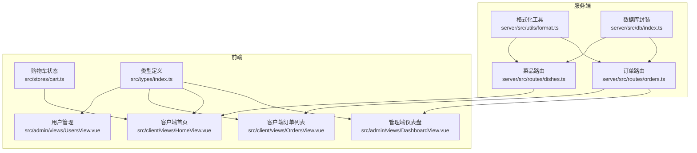
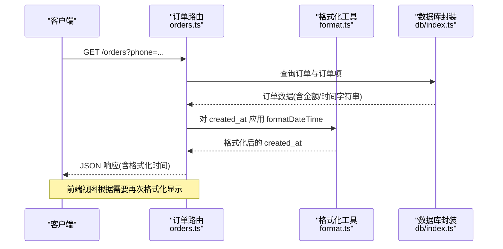
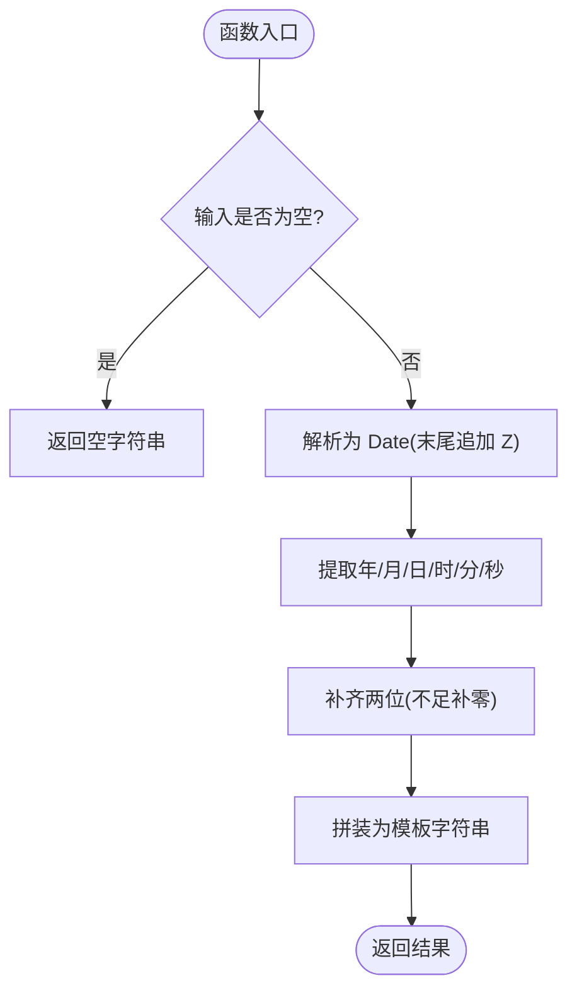
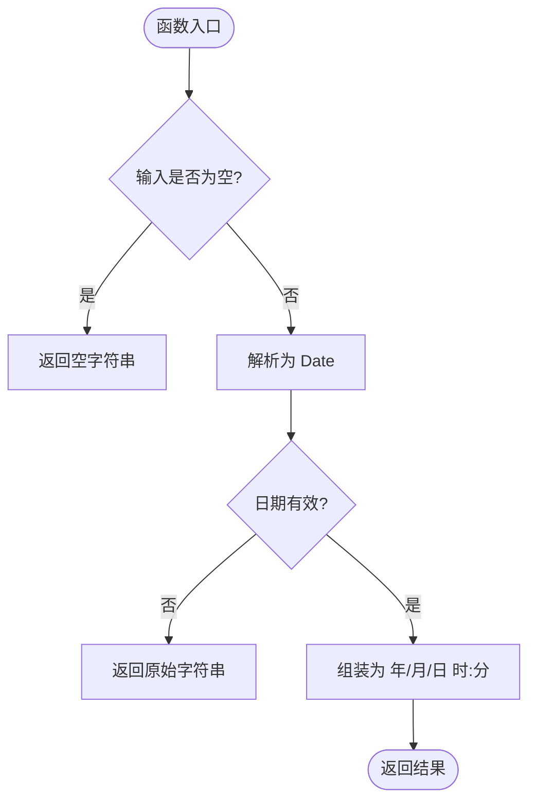
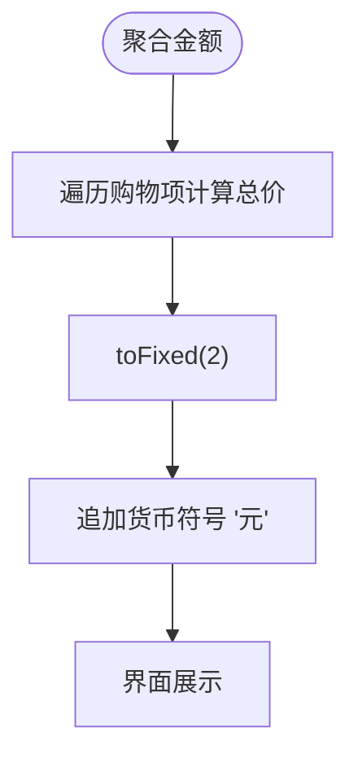
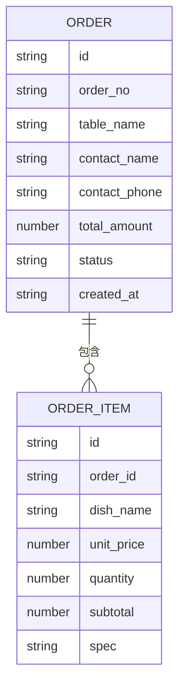
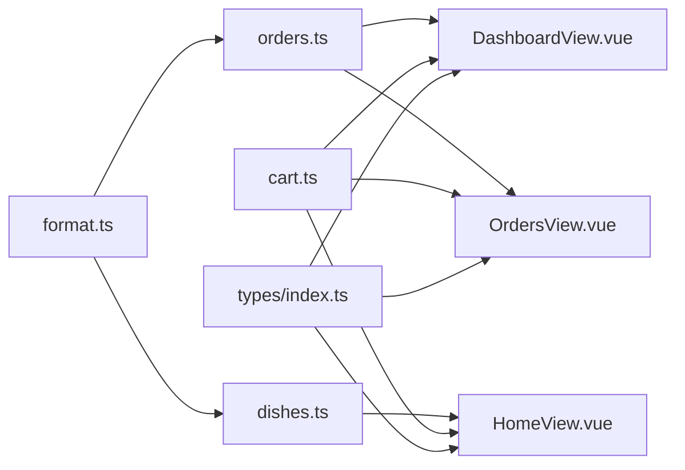

# 数据格式化工具

<cite>
**本文引用的文件**
- [server/src/utils/format.ts](file://server/src/utils/format.ts)
- [server/src/routes/orders.ts](file://server/src/routes/orders.ts)
- [server/src/routes/dishes.ts](file://server/src/routes/dishes.ts)
- [src/types/index.ts](file://src/types/index.ts)
- [src/admin/views/DashboardView.vue](file://src/admin/views/DashboardView.vue)
- [src/client/views/HomeView.vue](file://src/client/views/HomeView.vue)
- [src/client/views/OrdersView.vue](file://src/client/views/OrdersView.vue)
- [src/admin/views/UsersView.vue](file://src/admin/views/UsersView.vue)
- [src/stores/cart.ts](file://src/stores/cart.ts)
- [server/src/db/index.ts](file://server/src/db/index.ts)
</cite>

## 目录
1. [简介](#简介)
2. [项目结构](#项目结构)
3. [核心组件](#核心组件)
4. [架构总览](#架构总览)
5. [详细组件分析](#详细组件分析)
6. [依赖关系分析](#依赖关系分析)
7. [性能考量](#性能考量)
8. [故障排查指南](#故障排查指南)
9. [结论](#结论)
10. [附录](#附录)

## 简介
本文件系统性梳理本项目的“数据格式化工具”，聚焦以下方面：
- 日期时间格式化：含本地化支持、格式模板、时区处理
- 数字格式化：含千分位分隔符、小数位控制、精度处理
- 货币格式化：含货币符号、汇率处理、本地化显示
- 实战场景：API 响应格式化、日志输出格式化、用户界面显示格式化
- 性能优化与错误处理策略

通过对服务端格式化工具与前端展示层的双向分析，帮助开发者在不同层级正确、一致地进行数据格式化。

## 项目结构
项目采用前后端分离架构，格式化逻辑分布在服务端工具模块与多个前端视图组件中：
- 服务端：统一的日期时间格式化工具，配合路由层在响应中输出标准化时间字符串
- 前端：多处自定义日期格式化函数与数值格式化（toFixed）结合货币符号，用于界面展示

图表来源
- [server/src/utils/format.ts:1-11](file://server/src/utils/format.ts#L1-L11)
- [server/src/routes/orders.ts:1-135](file://server/src/routes/orders.ts#L1-L135)
- [server/src/routes/dishes.ts:1-216](file://server/src/routes/dishes.ts#L1-L216)
- [src/admin/views/DashboardView.vue:243-253](file://src/admin/views/DashboardView.vue#L243-L253)
- [src/client/views/HomeView.vue:329-331](file://src/client/views/HomeView.vue#L329-L331)
- [src/client/views/OrdersView.vue:65-75](file://src/client/views/OrdersView.vue#L65-L75)
- [src/admin/views/UsersView.vue:146-157](file://src/admin/views/UsersView.vue#L146-L157)
- [src/stores/cart.ts:15-19](file://src/stores/cart.ts#L15-L19)
- [server/src/db/index.ts:1-156](file://server/src/db/index.ts#L1-L156)

章节来源
- [server/src/utils/format.ts:1-11](file://server/src/utils/format.ts#L1-L11)
- [server/src/routes/orders.ts:1-135](file://server/src/routes/orders.ts#L1-L135)
- [server/src/routes/dishes.ts:1-216](file://server/src/routes/dishes.ts#L1-L216)
- [src/admin/views/DashboardView.vue:243-253](file://src/admin/views/DashboardView.vue#L243-L253)
- [src/client/views/HomeView.vue:329-331](file://src/client/views/HomeView.vue#L329-L331)
- [src/client/views/OrdersView.vue:65-75](file://src/client/views/OrdersView.vue#L65-L75)
- [src/admin/views/UsersView.vue:146-157](file://src/admin/views/UsersView.vue#L146-L157)
- [src/stores/cart.ts:15-19](file://src/stores/cart.ts#L15-L19)
- [server/src/db/index.ts:1-156](file://server/src/db/index.ts#L1-L156)

## 核心组件
- 服务端日期时间格式化工具
  - 功能：接收 ISO-like 字符串，转换为带固定偏移的本地化时间字符串
  - 特点：固定时区偏移、手动拼装模板、兼容空值
- 前端日期时间格式化函数
  - 管理端仪表盘：自定义格式化函数，输出“年/月/日 时:分”
  - 客户端订单列表：自定义格式化函数，输出“年/月/日 时:分”
  - 用户管理：使用本地化 API 输出“年-月-日”格式
- 数值与货币格式化
  - 多处使用 toFixed 控制小数位，配合“元”后缀形成货币显示
  - 购物车金额通过 Pinia 计算属性聚合，再统一 toFixed(2)

章节来源
- [server/src/utils/format.ts:1-11](file://server/src/utils/format.ts#L1-L11)
- [src/admin/views/DashboardView.vue:243-253](file://src/admin/views/DashboardView.vue#L243-L253)
- [src/client/views/OrdersView.vue:65-75](file://src/client/views/OrdersView.vue#L65-L75)
- [src/admin/views/UsersView.vue:146-157](file://src/admin/views/UsersView.vue#L146-L157)
- [src/stores/cart.ts:15-19](file://src/stores/cart.ts#L15-L19)

## 架构总览
服务端与前端在“时间”和“货币”两个维度协同工作：
- 时间：服务端统一输出标准化时间字符串；前端按界面需求二次格式化
- 货币：服务端以数值形式传递金额；前端统一 toFixed(2) 并追加货币符号

图表来源
- [server/src/routes/orders.ts:62-135](file://server/src/routes/orders.ts#L62-L135)
- [server/src/utils/format.ts:1-11](file://server/src/utils/format.ts#L1-L11)
- [server/src/db/index.ts:101-140](file://server/src/db/index.ts#L101-L140)

## 详细组件分析

### 服务端日期时间格式化工具
- 输入：ISO-like 字符串（可能缺少时区信息）
- 处理：解析为 Date，提取年月日时分秒，拼装为“YYYY-MM-DDTHH:mm:ss+08:00”
- 输出：固定偏移的时间字符串
- 适用场景：API 响应中统一 created_at 的呈现格式

图表来源
- [server/src/utils/format.ts:1-11](file://server/src/utils/format.ts#L1-L11)

章节来源
- [server/src/utils/format.ts:1-11](file://server/src/utils/format.ts#L1-L11)
- [server/src/routes/orders.ts:124-128](file://server/src/routes/orders.ts#L124-L128)

### 前端日期时间格式化（管理端仪表盘）
- 自定义函数：将数据库返回的 created_at 再次格式化为“年/月/日 时:分”
- 用途：订单列表时间显示，提升可读性
- 错误处理：空值返回空字符串；非法日期回退为原始字符串

图表来源
- [src/admin/views/DashboardView.vue:243-253](file://src/admin/views/DashboardView.vue#L243-L253)

章节来源
- [src/admin/views/DashboardView.vue:243-253](file://src/admin/views/DashboardView.vue#L243-L253)

### 前端日期时间格式化（客户端订单列表）
- 自定义函数：与管理端类似，输出“年/月/日 时:分”
- 用途：客户端订单列表与详情页时间显示

章节来源
- [src/client/views/OrdersView.vue:65-75](file://src/client/views/OrdersView.vue#L65-L75)

### 前端日期时间格式化（用户管理）
- 使用本地化 API：输出“年-月-日”
- 用途：用户列表与详情中的注册/更新时间显示
- 错误处理：异常时回退为原始字符串

章节来源
- [src/admin/views/UsersView.vue:146-157](file://src/admin/views/UsersView.vue#L146-L157)

### 数值与货币格式化（toFixed 与货币符号）
- 聚合与计算：购物车金额通过计算属性聚合（单价 × 数量）
- 统一格式：toFixed(2) 控制两位小数，配合“元”后缀
- 展示位置：首页底部栏、订单详情、订单列表等

图表来源
- [src/stores/cart.ts:15-19](file://src/stores/cart.ts#L15-L19)
- [src/client/views/HomeView.vue:329-331](file://src/client/views/HomeView.vue#L329-L331)
- [src/admin/views/DashboardView.vue:519-521](file://src/admin/views/DashboardView.vue#L519-L521)

章节来源
- [src/stores/cart.ts:15-19](file://src/stores/cart.ts#L15-L19)
- [src/client/views/HomeView.vue:329-331](file://src/client/views/HomeView.vue#L329-L331)
- [src/admin/views/DashboardView.vue:519-521](file://src/admin/views/DashboardView.vue#L519-L521)
- [src/admin/views/DashboardView.vue:653-654](file://src/admin/views/DashboardView.vue#L653-L654)
- [src/admin/views/DashboardView.vue:752-753](file://src/admin/views/DashboardView.vue#L752-L753)

### 类型与数据流映射
- 订单与金额字段：类型定义中包含 total_amount、unit_price、subtotal 等数值字段
- 前端展示：统一以 toFixed(2) + “元”进行货币化显示

图表来源
- [src/types/index.ts:82-97](file://src/types/index.ts#L82-L97)
- [src/types/index.ts:71-80](file://src/types/index.ts#L71-L80)

章节来源
- [src/types/index.ts:82-97](file://src/types/index.ts#L82-L97)
- [src/types/index.ts:71-80](file://src/types/index.ts#L71-L80)

## 依赖关系分析
- 服务端依赖
  - format.ts 被订单路由与管理路由导入，统一输出 created_at 格式
  - db/index.ts 提供数据库访问能力，支撑订单与菜品数据查询
- 前端依赖
  - 各视图组件依赖类型定义与 Pinia 状态，进行数值与时间的格式化展示

图表来源
- [server/src/utils/format.ts:1-11](file://server/src/utils/format.ts#L1-L11)
- [server/src/routes/orders.ts:1-135](file://server/src/routes/orders.ts#L1-L135)
- [server/src/routes/dishes.ts:1-216](file://server/src/routes/dishes.ts#L1-L216)
- [src/admin/views/DashboardView.vue:243-253](file://src/admin/views/DashboardView.vue#L243-L253)
- [src/client/views/HomeView.vue:329-331](file://src/client/views/HomeView.vue#L329-L331)
- [src/client/views/OrdersView.vue:65-75](file://src/client/views/OrdersView.vue#L65-L75)
- [src/stores/cart.ts:15-19](file://src/stores/cart.ts#L15-L19)
- [src/types/index.ts:82-97](file://src/types/index.ts#L82-L97)

章节来源
- [server/src/utils/format.ts:1-11](file://server/src/utils/format.ts#L1-L11)
- [server/src/routes/orders.ts:1-135](file://server/src/routes/orders.ts#L1-L135)
- [server/src/routes/dishes.ts:1-216](file://server/src/routes/dishes.ts#L1-L216)
- [src/admin/views/DashboardView.vue:243-253](file://src/admin/views/DashboardView.vue#L243-L253)
- [src/client/views/HomeView.vue:329-331](file://src/client/views/HomeView.vue#L329-L331)
- [src/client/views/OrdersView.vue:65-75](file://src/client/views/OrdersView.vue#L65-L75)
- [src/stores/cart.ts:15-19](file://src/stores/cart.ts#L15-L19)
- [src/types/index.ts:82-97](file://src/types/index.ts#L82-L97)

## 性能考量
- 服务端批量查询与一次性序列化
  - 订单查询中对订单项进行批量查询，避免 N+1，减少往返与 CPU 开销
  - 通过 beginBatch/endBatch 降低数据库写入频率，提升吞吐
- 前端渲染优化
  - 使用 toFixed(2) 统一货币显示，避免重复计算
  - 列表轮询与可见性监听，减少无效刷新
- 本地化 API 的权衡
  - UsersView 中使用本地化 API 输出日期，可读性强但需考虑浏览器兼容与性能

章节来源
- [server/src/routes/orders.ts:96-128](file://server/src/routes/orders.ts#L96-L128)
- [server/src/db/index.ts:46-73](file://server/src/db/index.ts#L46-L73)
- [src/client/views/OrdersView.vue:117-136](file://src/client/views/OrdersView.vue#L117-L136)
- [src/admin/views/UsersView.vue:146-157](file://src/admin/views/UsersView.vue#L146-L157)

## 故障排查指南
- 日期时间格式化异常
  - 现象：显示为“Invalid Date”或原始字符串
  - 排查：确认输入是否为空；检查服务端 formatDateTime 是否被正确调用；前端自定义函数对非法日期的回退逻辑
- 货币显示异常
  - 现象：小数位过多或过少
  - 排查：确认是否统一使用 toFixed(2)；检查单价与数量计算是否正确
- API 响应时间不一致
  - 现象：服务端与前端显示时间不一致
  - 排查：确认服务端 formatDateTime 固定时区偏移；前端二次格式化是否符合预期

章节来源
- [server/src/utils/format.ts:1-11](file://server/src/utils/format.ts#L1-L11)
- [src/admin/views/DashboardView.vue:243-253](file://src/admin/views/DashboardView.vue#L243-L253)
- [src/client/views/OrdersView.vue:65-75](file://src/client/views/OrdersView.vue#L65-L75)
- [src/admin/views/UsersView.vue:146-157](file://src/admin/views/UsersView.vue#L146-L157)
- [src/stores/cart.ts:15-19](file://src/stores/cart.ts#L15-L19)

## 结论
本项目在“时间”和“货币”两个维度形成了“服务端标准化 + 前端本地化”的格式化体系：
- 服务端负责统一时间格式与数值精度，保证 API 响应的一致性
- 前端负责面向用户的本地化展示，兼顾可读性与性能
- 通过类型定义与状态管理，确保数据在各层之间稳定流转

## 附录
- 实际使用示例（路径指引）
  - API 响应格式化（服务端）：[server/src/routes/orders.ts:124-128](file://server/src/routes/orders.ts#L124-L128)
  - 日志输出格式化（服务端）：[server/src/routes/orders.ts:131-134](file://server/src/routes/orders.ts#L131-L134)
  - 用户界面显示格式化（管理端）：[src/admin/views/DashboardView.vue:627-628](file://src/admin/views/DashboardView.vue#L627-L628)
  - 用户界面显示格式化（客户端）：[src/client/views/HomeView.vue:330-331](file://src/client/views/HomeView.vue#L330-L331)
  - 货币格式化（多处）：[src/admin/views/DashboardView.vue:653-654](file://src/admin/views/DashboardView.vue#L653-L654)