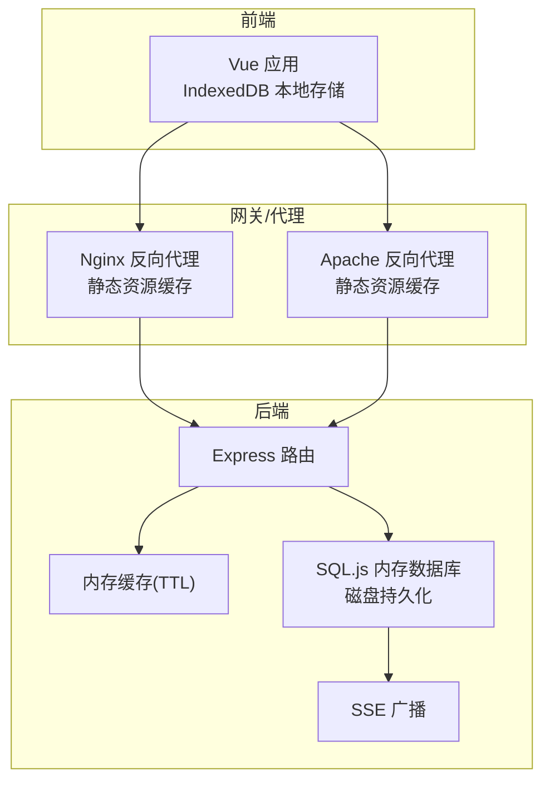
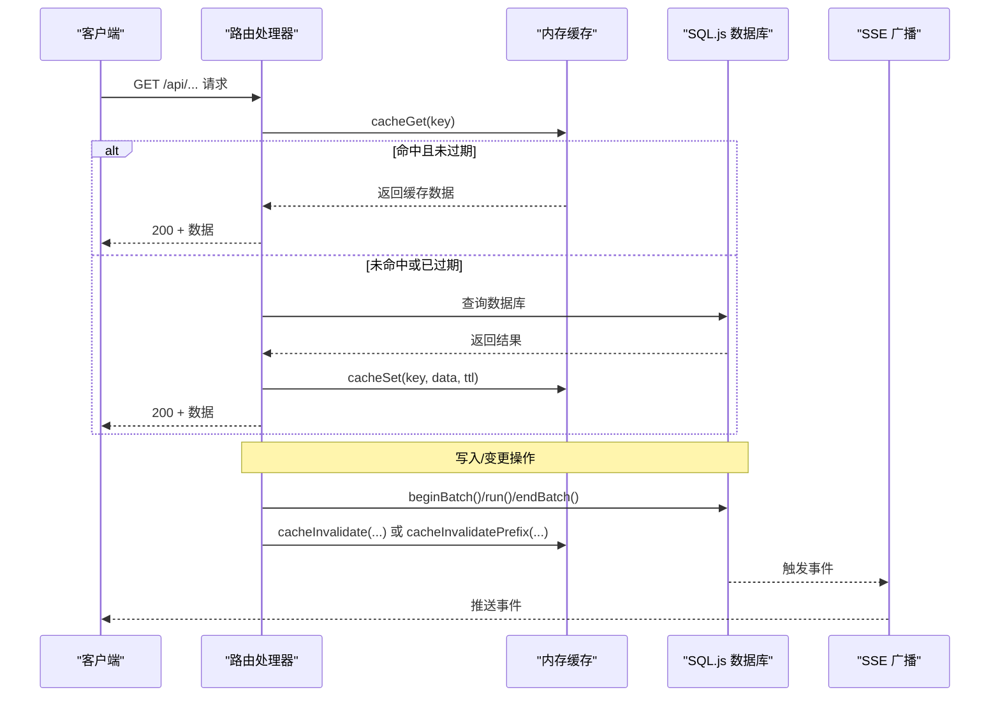
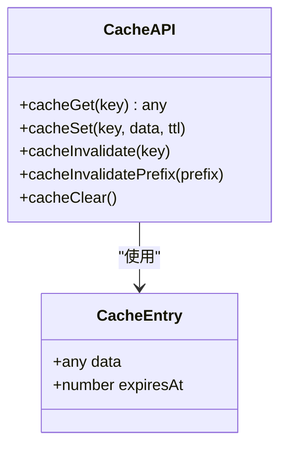
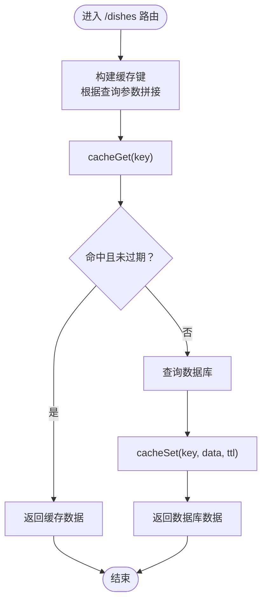
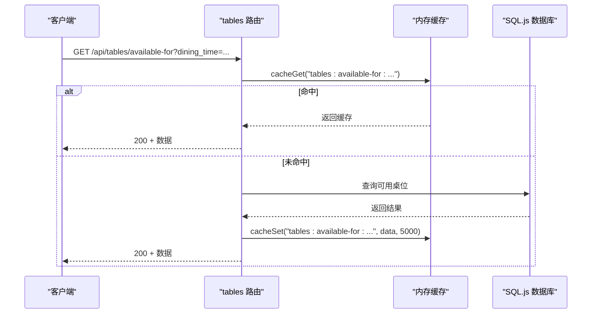
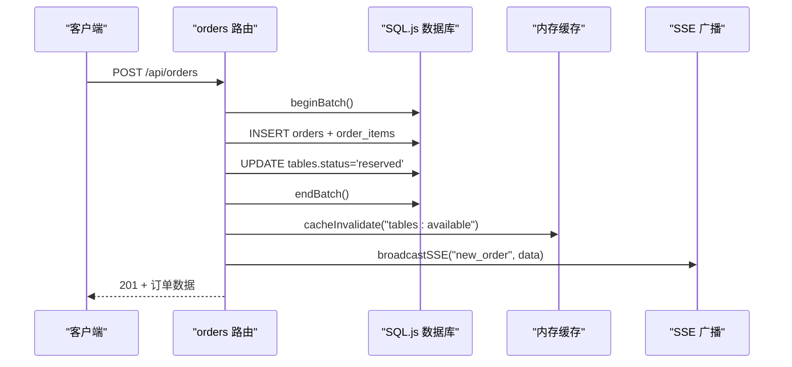
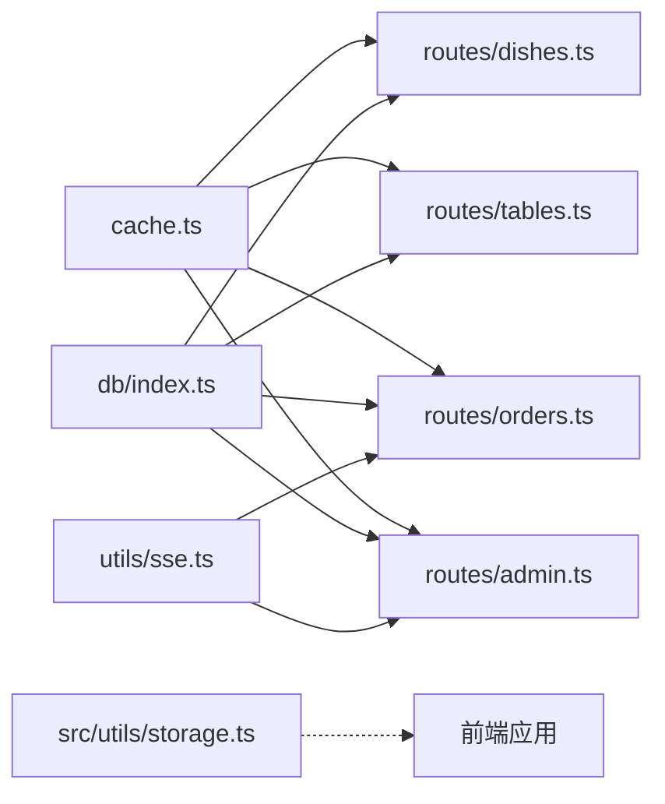

# 缓存管理工具

<cite>
**本文引用的文件**
- [server\src\utils\cache.ts](file://server/src/utils/cache.ts)
- [server\src\routes\dishes.ts](file://server/src/routes/dishes.ts)
- [server\src\routes\tables.ts](file://server/src/routes/tables.ts)
- [server\src\routes\orders.ts](file://server/src/routes/orders.ts)
- [server\src\routes\admin.ts](file://server/src/routes/admin.ts)
- [server\src\db\index.ts](file://server/src/db/index.ts)
- [server\src\db\init.ts](file://server/src/db/init.ts)
- [server\src\utils\sse.ts](file://server/src/utils/sse.ts)
- [src\utils\storage.ts](file://src/utils/storage.ts)
- [nginx.conf](file://nginx.conf)
- [apache.conf](file://apache.conf)
- [package.json](file://package.json)
</cite>

## 目录
1. [简介](#简介)
2. [项目结构](#项目结构)
3. [核心组件](#核心组件)
4. [架构总览](#架构总览)
5. [详细组件分析](#详细组件分析)
6. [依赖关系分析](#依赖关系分析)
7. [性能考量](#性能考量)
8. [故障排查指南](#故障排查指南)
9. [结论](#结论)
10. [附录](#附录)

## 简介
本文件面向“缓存管理工具”的技术文档，聚焦于后端内存缓存的实现与应用，涵盖键值管理、TTL 失效、LRU 淘汰策略现状与替代方案、手动清理策略、stale-while-revalidate 缓存策略的实现要点与注意事项、命中率优化建议、内存泄漏防护、监控与调试方法，以及实际应用场景与性能基准测试建议。项目采用轻量级内存 Map 作为 TTL 内存缓存，配合数据库批量写入去抖动与 SSE 实时事件，服务于菜品、桌位、订单等业务场景。

## 项目结构
- 后端缓存核心位于 server/src/utils/cache.ts，提供基础的 TTL 内存缓存能力与键空间常量。
- 业务路由层（dishes、tables、orders、admin）在读取路径中使用缓存，在写入或状态变更时进行缓存失效。
- 数据库层（server/src/db/index.ts）提供 SQL.js 内存数据库与磁盘持久化，支持批量写入去抖动，降低 I/O 开销。
- 前端本地存储使用 IndexedDB（src/utils/storage.ts），用于离线与持久化键值存储。
- 反向代理层（nginx.conf、apache.conf）对静态资源进行缓存控制，避免 API 路径被缓存。
- 依赖清单（package.json）包含 sql.js、express、vue 等关键模块。

**图示来源**
- [server\src\utils\cache.ts](file://server/src/utils/cache.ts)
- [server\src\db\index.ts](file://server/src/db/index.ts)
- [server\src\routes\dishes.ts](file://server/src/routes/dishes.ts)
- [server\src\routes\tables.ts](file://server/src/routes/tables.ts)
- [server\src\routes\orders.ts](file://server/src/routes/orders.ts)
- [server\src\utils\sse.ts](file://server/src/utils/sse.ts)
- [src\utils\storage.ts](file://src/utils/storage.ts)
- [nginx.conf](file://nginx.conf)
- [apache.conf](file://apache.conf)

**章节来源**
- [server\src\utils\cache.ts](file://server/src/utils/cache.ts)
- [server\src\db\index.ts](file://server/src/db/index.ts)
- [src\utils\storage.ts](file://src/utils/storage.ts)
- [nginx.conf](file://nginx.conf)
- [apache.conf](file://apache.conf)

## 核心组件
- 内存缓存（TTL）
  - 键值结构：Map<string, { data; expiresAt }>
  - 默认 TTL：30 秒
  - 提供：cacheGet、cacheSet、cacheInvalidate、cacheInvalidatePrefix、cacheClear、CACHE_KEYS 常量
- 业务路由缓存使用
  - 菜品：首页聚合数据、列表、分类、搜索前缀
  - 桌位：可用桌位、按就餐时间筛选
  - 订单：创建/取消/加菜后对相关缓存进行失效
  - 管理端：设置项缓存（60 秒）
- 数据库层
  - SQL.js 内存数据库，支持批量写入去抖动（SAVE_DEBOUNCE_MS=50ms），减少磁盘写入频率
  - 提供 beginBatch/endBatch/runBatch，用于事务内多语句合并写入
- 前端本地存储
  - IndexedDB 封装，懒加载初始化，提供 getItem/setItem/removeItem/clear
- 反向代理缓存
  - 静态资源开启长缓存；API 路径禁用缓存

**章节来源**
- [server\src\utils\cache.ts](file://server/src/utils/cache.ts)
- [server\src\routes\dishes.ts](file://server/src/routes/dishes.ts)
- [server\src\routes\tables.ts](file://server/src/routes/tables.ts)
- [server\src\routes\orders.ts](file://server/src/routes/orders.ts)
- [server\src\routes\admin.ts](file://server/src/routes/admin.ts)
- [server\src\db\index.ts](file://server/src/db/index.ts)
- [src\utils\storage.ts](file://src/utils/storage.ts)
- [nginx.conf](file://nginx.conf)
- [apache.conf](file://apache.conf)

## 架构总览
后端缓存与数据库交互遵循“读走缓存、写走数据库并失效缓存”的模式。SSE 用于实时事件广播，触发前端或管理端刷新缓存或界面状态。

**图示来源**
- [server\src\routes\dishes.ts](file://server/src/routes/dishes.ts)
- [server\src\routes\tables.ts](file://server/src/routes/tables.ts)
- [server\src\routes\orders.ts](file://server/src/routes/orders.ts)
- [server\src\routes\admin.ts](file://server/src/routes/admin.ts)
- [server\src\utils\cache.ts](file://server/src/utils/cache.ts)
- [server\src\db\index.ts](file://server/src/db/index.ts)
- [server\src\utils\sse.ts](file://server/src/utils/sse.ts)

## 详细组件分析

### 组件一：内存缓存（TTL）
- 设计要点
  - 使用 Map 作为存储容器，键为字符串，值包含 data 与 expiresAt 时间戳
  - cacheGet 在取值时判断过期并自动清理
  - cacheSet 支持自定义 TTL，默认 30 秒
  - 提供前缀失效与全量清空能力
  - 提供 CACHE_KEYS 常量统一管理键空间
- 复杂度与性能
  - cacheGet/cacheSet 为 O(1) 平均复杂度
  - cacheInvalidatePrefix 遍历 Map 键，复杂度 O(n)
- 适用场景
  - 不频繁变化的数据：菜品列表、分类、首页聚合数据、桌位可用集合、设置项
- 限制与扩展建议
  - 当前未实现 LRU 淘汰，高并发下可考虑引入容量上限与淘汰策略
  - 可增加命中/未命中计数器以便监控

**图示来源**
- [server\src\utils\cache.ts](file://server/src/utils/cache.ts)

**章节来源**
- [server\src\utils\cache.ts](file://server/src/utils/cache.ts)

### 组件二：菜品路由缓存策略
- 读路径
  - 首页聚合数据（categories + dishes）：缓存键 dishes:home-data
  - 列表（可按分类过滤）：缓存键 dishes:list[:category]
  - 分类列表：缓存键 categories
  - 搜索：使用前缀缓存键 dishes:search:...（当前实现未直接使用，但键常量已预留）
- 写路径失效
  - 新增/更新/删除菜品：失效 dishes:home-data 与 dishes:list
  - 重新排序菜品：失效 dishes:home-data 与 dishes:list
  - 新增/更新/删除分类：失效 categories 与 dishes:home-data
- TTL 设计
  - 首页聚合与列表默认 30 秒
  - 分类列表默认 30 秒
  - 搜索接口未使用缓存（当前）

**图示来源**
- [server\src\routes\dishes.ts](file://server/src/routes/dishes.ts)
- [server\src\utils\cache.ts](file://server/src/utils/cache.ts)

**章节来源**
- [server\src\routes\dishes.ts](file://server/src/routes/dishes.ts)
- [server\src\utils\cache.ts](file://server/src/utils/cache.ts)

### 组件三：桌位路由缓存策略
- 读路径
  - 可用桌位：缓存键 tables:available，TTL 5 秒
  - 指定就餐时间可用桌位：缓存键 tables:available-for:<dining_time>，TTL 5 秒
- 写路径失效
  - 桌位状态变更（新增/更新/删除）：失效 tables:available 与 tables:available-for: 前缀
  - 订单状态变更（完成/取消）释放桌位：失效 tables:available
- TTL 设计
  - 低 TTL 保障实时性，适合高并发下的座位竞争场景

**图示来源**
- [server\src\routes\tables.ts](file://server/src/routes/tables.ts)
- [server\src\utils\cache.ts](file://server/src/utils/cache.ts)

**章节来源**
- [server\src\routes\tables.ts](file://server/src/routes/tables.ts)
- [server\src\utils\cache.ts](file://server/src/utils/cache.ts)

### 组件四：订单路由与缓存失效
- 写路径
  - 创建订单：批量写入订单与订单项，释放桌位状态，失效 tables:available
  - 取消订单：更新订单与桌位状态，失效 tables:available
  - 加菜：批量删除旧项并插入新项，失效相关缓存
- 读路径
  - 订单详情与列表接口未使用缓存（当前），避免一致性问题
- 实时事件
  - 通过 SSE 广播新订单与订单更新事件，便于前端刷新

**图示来源**
- [server\src\routes\orders.ts](file://server/src/routes/orders.ts)
- [server\src\utils\cache.ts](file://server/src/utils/cache.ts)
- [server\src\utils\sse.ts](file://server/src/utils/sse.ts)

**章节来源**
- [server\src\routes\orders.ts](file://server/src/routes/orders.ts)
- [server\src\utils\sse.ts](file://server/src/utils/sse.ts)

### 组件五：管理端设置缓存
- 读路径
  - GET /api/admin/settings：从 settings 表读取键值对，转为对象缓存，TTL 60 秒
- 写路径
  - PUT /api/admin/settings：批量写入 settings，失效 settings 缓存
- 作用
  - 减少频繁读取设置项的数据库压力

**章节来源**
- [server\src\routes\admin.ts](file://server/src/routes/admin.ts)
- [server\src\utils\cache.ts](file://server/src/utils/cache.ts)

### 组件六：stale-while-revalidate 缓存策略（实现要点）
- 现状
  - 项目未实现标准的 stale-while-revalidate（SWR）流程
  - 读路径采用“命中即返回，未命中再查询并写入”的模式
- SWR 实现建议（概念性说明）
  - 读取时允许返回“陈旧”数据（未过期），同时异步发起后台请求刷新缓存
  - 前端在收到陈旧数据后，等待后台请求完成再替换为新鲜数据
  - 优点：降低首屏延迟，提升用户体验
  - 注意：需保证并发请求的幂等与一致性，避免竞态
- 与现有实现的结合点
  - 可在 cacheGet 中返回“过期但可用”的数据，同时触发后台刷新
  - 与 SSE 结合，当服务端数据变更时，前端可收到事件并主动刷新

[本节为概念性说明，不直接分析具体源码文件]

### 组件七：LRU 淘汰策略现状与替代方案
- 现状
  - 当前缓存未实现 LRU，仅基于 TTL 过期
- 替代方案
  - 引入容量上限与淘汰队列（如双向链表 + Map），实现 O(1) 访问与淘汰
  - 或采用第三方轻量 LRU 库（如 lru_map），在高频访问场景下提升命中率
- 适用场景
  - 高并发、热点数据明显、内存受限的环境更需要 LRU

[本节为概念性说明，不直接分析具体源码文件]

## 依赖关系分析
- 路由层依赖缓存模块与数据库模块
- 管理端在写入时显式调用 cacheInvalidate/cacheInvalidatePrefix
- SSE 与缓存解耦，通过事件驱动前端刷新
- 前端本地存储（IndexedDB）独立于后端缓存，用于离线与持久化键值

**图示来源**
- [server\src\utils\cache.ts](file://server/src/utils/cache.ts)
- [server\src\routes\dishes.ts](file://server/src/routes/dishes.ts)
- [server\src\routes\tables.ts](file://server/src/routes/tables.ts)
- [server\src\routes\orders.ts](file://server/src/routes/orders.ts)
- [server\src\routes\admin.ts](file://server/src/routes/admin.ts)
- [server\src\db\index.ts](file://server/src/db/index.ts)
- [server\src\utils\sse.ts](file://server/src/utils/sse.ts)
- [src\utils\storage.ts](file://src/utils/storage.ts)

**章节来源**
- [server\src\utils\cache.ts](file://server/src/utils/cache.ts)
- [server\src\db\index.ts](file://server/src/db/index.ts)
- [server\src\routes\dishes.ts](file://server/src/routes/dishes.ts)
- [server\src\routes\tables.ts](file://server/src/routes/tables.ts)
- [server\src\routes\orders.ts](file://server/src/routes/orders.ts)
- [server\src\routes\admin.ts](file://server/src/routes/admin.ts)
- [server\src\utils\sse.ts](file://server/src/utils/sse.ts)
- [src\utils\storage.ts](file://src/utils/storage.ts)

## 性能考量
- 缓存命中率优化
  - 为高频读取接口（如首页聚合、分类列表、可用桌位）设置合理 TTL
  - 使用前缀失效精确清理相关缓存，避免全量失效带来的抖动
  - 对于搜索类接口，若数据量大且变化频繁，谨慎启用缓存或缩短 TTL
- 内存使用优化
  - 控制缓存键数量与单条数据大小，避免缓存膨胀
  - 对于大对象（如聚合数据），优先序列化后存储，减少引用开销
- 垃圾回收与内存泄漏防护
  - 定期评估缓存键增长趋势，必要时引入容量上限与 LRU 淘汰
  - 确保写路径正确调用 cacheInvalidate/cacheInvalidatePrefix，避免悬挂键
  - 对于 SSE 客户端连接，确保断开时及时清理，避免持有引用
- 数据库写入优化
  - 使用 beginBatch/endBatch/runBatch 合并写入，降低磁盘写入频率
  - 适当调整去抖动间隔（SAVE_DEBOUNCE_MS=50ms），平衡吞吐与延迟
- 反向代理缓存
  - 静态资源开启长缓存，API 路径禁用缓存，避免脏数据传播

[本节提供通用指导，不直接分析具体源码文件]

## 故障排查指南
- 缓存未生效
  - 检查路由是否调用 cacheGet/cacheSet
  - 确认键名与 CACHE_KEYS 常量一致
  - 验证 TTL 是否过短导致频繁失效
- 缓存不一致
  - 检查写路径是否调用 cacheInvalidate/cacheInvalidatePrefix
  - 对于订单状态变更、桌位状态变更等关键操作，确认失效范围覆盖完整
- 内存占用异常
  - 评估缓存键数量与数据体积，必要时引入容量上限与淘汰策略
  - 关注前缀失效是否正确清理相关键
- 数据库写入抖动
  - 确认批量写入流程（beginBatch/endBatch）是否正确使用
  - 检查 SAVE_DEBOUNCE_MS 是否影响业务时序
- SSE 事件未到达
  - 检查客户端连接状态与心跳机制
  - 确认广播函数未抛错且响应流未被提前关闭

**章节来源**
- [server\src\utils\cache.ts](file://server/src/utils/cache.ts)
- [server\src\db\index.ts](file://server/src/db/index.ts)
- [server\src\utils\sse.ts](file://server/src/utils/sse.ts)

## 结论
该项目的缓存体系以“TTL 内存缓存 + 显式失效 + 数据库批量写入去抖动”为核心，满足了菜品、桌位、设置等不频繁变化数据的高效读取需求。对于高并发与热点数据场景，建议引入 LRU 淘汰与容量上限；对于强一致要求的接口（如订单详情），可采用“陈旧数据先返回 + 后台刷新 + SSE 事件驱动”的 SWR 模式。通过精细化的 TTL 策略、前缀失效与监控告警，可在保证一致性的同时显著提升性能与用户体验。

## 附录
- 实际应用场景
  - 菜品列表与首页聚合：30 秒 TTL，写入菜品/分类后失效相关键
  - 桌位可用性：5 秒 TTL，写入订单/桌位状态后失效相关键
  - 设置项：60 秒 TTL，写入后失效
- 性能基准测试建议
  - 基准指标：QPS、平均响应时间、缓存命中率、内存占用、数据库写入频率
  - 测试场景：并发读取（菜品列表/首页）、并发写入（创建订单/更新桌位）、混合场景
  - 工具建议：k6、Artillery 或压测平台，结合 Prometheus/Grafana 监控
- 监控与调试
  - 后端：记录 cacheGet/cacheSet 调用次数与命中率，观察失效频率
  - 前端：记录 SSE 事件接收情况与缓存刷新行为
  - 运维：关注反向代理缓存头配置，避免 API 被缓存

[本节为通用指导，不直接分析具体源码文件]