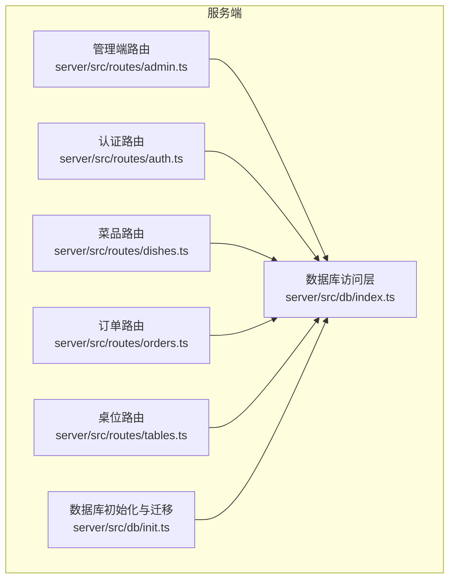
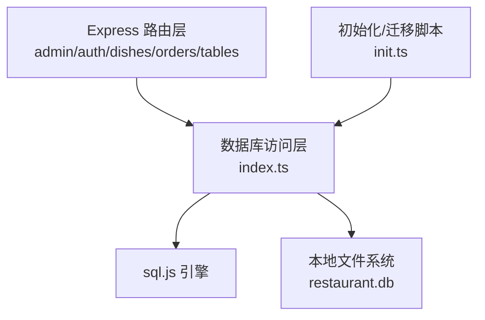
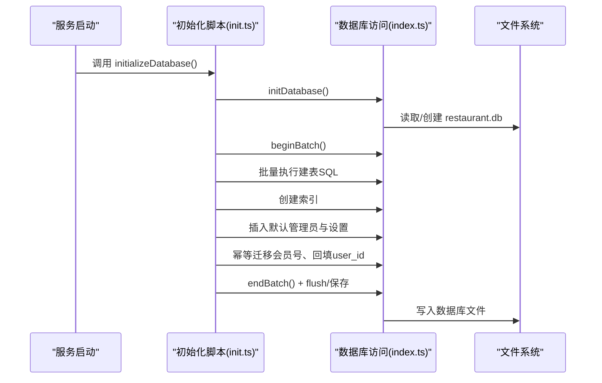
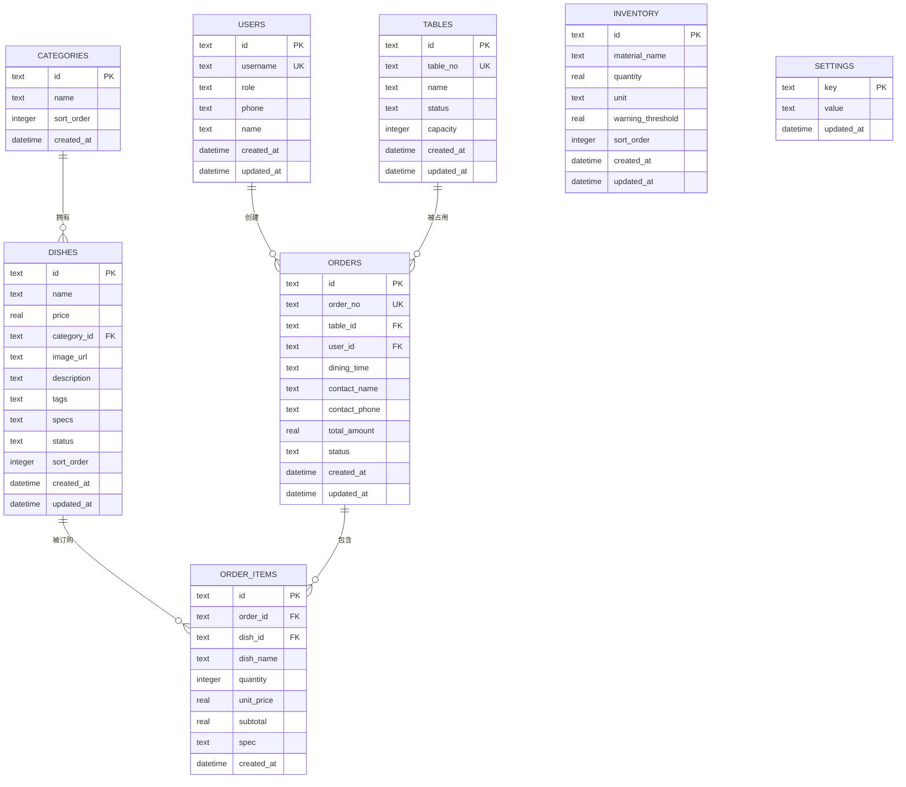
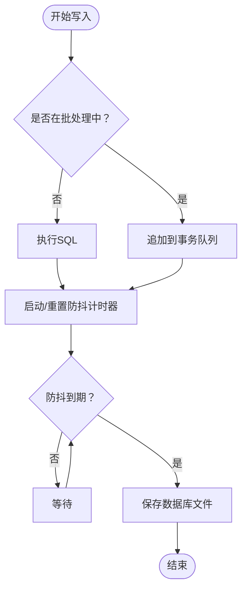
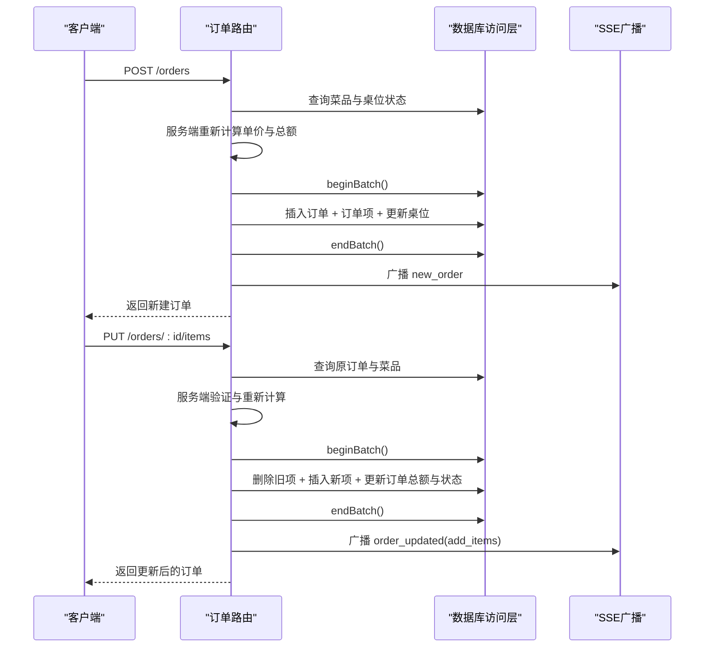
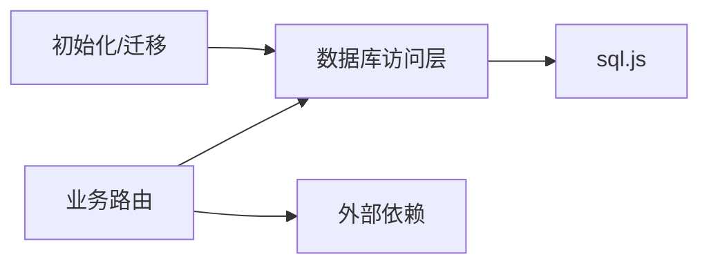

# 数据库设计

<cite>
**本文引用的文件**
- [server/src/db/index.ts](file://server/src/db/index.ts)
- [server/src/db/init.ts](file://server/src/db/init.ts)
- [server/src/routes/admin.ts](file://server/src/routes/admin.ts)
- [server/src/routes/auth.ts](file://server/src/routes/auth.ts)
- [server/src/routes/dishes.ts](file://server/src/routes/dishes.ts)
- [server/src/routes/orders.ts](file://server/src/routes/orders.ts)
- [server/src/routes/tables.ts](file://server/src/routes/tables.ts)
</cite>

## 目录
1. [简介](#简介)
2. [项目结构](#项目结构)
3. [核心组件](#核心组件)
4. [架构总览](#架构总览)
5. [详细组件分析](#详细组件分析)
6. [依赖分析](#依赖分析)
7. [性能考虑](#性能考虑)
8. [故障排查指南](#故障排查指南)
9. [结论](#结论)
10. [附录](#附录)

## 简介
本文件面向RLRMS项目的数据库设计，聚焦SQLite在WebAssembly运行时（sql.js）下的实现与应用。项目采用无服务器、零配置的嵌入式数据库方案，通过sql.js在Node.js环境中加载SQLite数据库文件，结合本地磁盘持久化与批处理写入策略，满足餐厅点餐与后台管理场景的数据一致性与性能需求。

SQLite选择的原因与优势：
- 无服务器架构：无需独立数据库实例，直接以内存映像方式读写文件，简化部署与运维。
- 零配置部署：单文件数据库（restaurant.db），便于分发与备份。
- ACID事务支持：在单文件模式下提供原子性、一致性、隔离性与持久性保障，适合订单与库存等关键业务。
- 跨平台兼容：sql.js可在浏览器与Node.js环境运行，便于前后端共享同一套SQL模型。

## 项目结构
数据库相关代码主要分布在以下位置：
- 数据库访问层：server/src/db/index.ts 提供统一的数据库初始化、查询、写入与保存能力。
- 初始化与迁移：server/src/db/init.ts 负责建表、索引、默认数据与幂等迁移。
- 路由与业务：各业务路由（admin、auth、dishes、orders、tables）通过数据库访问层进行数据操作。

图表来源
- [server/src/db/index.ts:1-156](file://server/src/db/index.ts#L1-L156)
- [server/src/db/init.ts:1-204](file://server/src/db/init.ts#L1-L204)
- [server/src/routes/admin.ts:1-800](file://server/src/routes/admin.ts#L1-L800)
- [server/src/routes/auth.ts:1-405](file://server/src/routes/auth.ts#L1-L405)
- [server/src/routes/dishes.ts:1-216](file://server/src/routes/dishes.ts#L1-L216)
- [server/src/routes/orders.ts:1-552](file://server/src/routes/orders.ts#L1-L552)
- [server/src/routes/tables.ts:1-93](file://server/src/routes/tables.ts#L1-L93)

章节来源
- [server/src/db/index.ts:1-156](file://server/src/db/index.ts#L1-L156)
- [server/src/db/init.ts:1-204](file://server/src/db/init.ts#L1-L204)

## 核心组件
- 数据库访问层（index.ts）
  - 初始化与加载：按需初始化sql.js，加载现有数据库文件或创建空库。
  - 写入与保存：提供run/exec写入方法，并通过防抖与批处理减少磁盘IO；支持beginBatch/endBatch一次性落盘。
  - 查询封装：get单行、all多行、exec原生SQL执行。
  - 关闭前刷新：flushSave确保服务停止前写入磁盘。
- 初始化与迁移（init.ts）
  - 建表：users、tables、categories、dishes、orders、order_items、inventory、settings。
  - 索引：围绕高频查询字段建立索引，如订单状态、联系人电话、桌位ID、菜品分类与状态等。
  - 默认数据：若无管理员账户则创建默认管理员；若无设置则填充默认配置。
  - 幂等迁移：历史客户用户名从手机号迁移到数字会员号；历史订单user_id回填。

章节来源
- [server/src/db/index.ts:75-156](file://server/src/db/index.ts#L75-L156)
- [server/src/db/init.ts:5-204](file://server/src/db/init.ts#L5-L204)

## 架构总览
数据库层采用“访问层 + 初始化/迁移 + 业务路由”的分层设计，业务路由通过统一的数据库访问接口进行读写，确保一致性与可维护性。

图表来源
- [server/src/db/index.ts:1-156](file://server/src/db/index.ts#L1-L156)
- [server/src/db/init.ts:1-204](file://server/src/db/init.ts#L1-L204)

## 详细组件分析

### 数据库初始化与迁移流程
- 初始化步骤
  - 加载或创建数据库实例。
  - 在单个事务批次内批量执行建表语句，避免多次落盘。
  - 建立高频查询索引。
  - 注入默认管理员与系统设置。
  - 执行幂等迁移：客户会员号迁移、历史订单user_id回填。
  - 结束批次并保存数据库文件。
- 幂等性保障
  - 用户名唯一约束保证迁移不重复执行。
  - 条件更新仅对user_id为空的历史订单生效。

图表来源
- [server/src/db/init.ts:5-204](file://server/src/db/init.ts#L5-L204)
- [server/src/db/index.ts:47-98](file://server/src/db/index.ts#L47-L98)

章节来源
- [server/src/db/init.ts:5-204](file://server/src/db/init.ts#L5-L204)

### 数据表设计与关系
- 用户表 users
  - 主键：id（文本）
  - 唯一：username
  - 字段：role（默认customer）、phone、name、created_at、updated_at
- 桌位表 tables
  - 主键：id（文本）
  - 唯一：table_no
  - 字段：name、status（默认available）、capacity（默认4）、created_at、updated_at
- 分类表 categories
  - 主键：id（文本）
  - 字段：name、sort_order（默认0）、created_at
- 菜品表 dishes
  - 主键：id（文本）
  - 外键：category_id → categories(id)
  - 字段：name、price、image_url、description、tags、specs、status（默认on_sale）、sort_order（默认0）、created_at、updated_at
- 订单表 orders
  - 主键：id（文本）
  - 唯一：order_no
  - 外键：table_id → tables(id)、user_id → users(id)
  - 字段：contact_name、contact_phone、total_amount、status（默认pending）、dining_time、created_at、updated_at
- 订单项表 order_items
  - 主键：id（文本）
  - 外键：order_id → orders(id)、dish_id → dishes(id)
  - 字段：dish_name、quantity、unit_price、subtotal、spec、created_at
- 库存表 inventory
  - 主键：id（文本）
  - 字段：material_name、quantity、unit、warning_threshold（默认0）、sort_order（默认0）、created_at、updated_at
- 设置表 settings
  - 主键：key（文本）
  - 字段：value、updated_at

图表来源
- [server/src/db/init.ts:11-122](file://server/src/db/init.ts#L11-L122)

章节来源
- [server/src/db/init.ts:11-122](file://server/src/db/init.ts#L11-L122)

### 索引与查询优化
- 已创建的关键索引
  - 订单：status、contact_phone、table_id、created_at、user_id
  - 订单项：order_id
  - 菜品：category_id、status、sort_order
  - 用户：phone、role
  - 桌位：status
- 业务查询优化
  - 订单列表：按created_at倒序，支持按状态、日期范围过滤。
  - 菜品列表：按分类与排序字段组合查询，避免N+1问题。
  - 桌位可用性：按时间段动态筛选可用/预留但非冲突的桌位。
  - 管理端仪表盘：单条SQL聚合统计今日订单数、收入、待处理订单与可用桌位。

章节来源
- [server/src/db/init.ts:124-137](file://server/src/db/init.ts#L124-L137)
- [server/src/routes/admin.ts:165-219](file://server/src/routes/admin.ts#L165-L219)
- [server/src/routes/dishes.ts:24-65](file://server/src/routes/dishes.ts#L24-L65)
- [server/src/routes/tables.ts:24-55](file://server/src/routes/tables.ts#L24-L55)

### 写入流程与事务控制
- 写入入口
  - run：执行单条或批量写入，触发防抖保存。
  - exec：执行原生SQL（多语句）。
  - runBatch：在单个事务中顺序执行多条语句。
- 批处理与防抖
  - beginBatch/endBatch：延迟保存，合并多次写入。
  - scheduleSave/saveDebounceTimer：短时间窗口内合并落盘，降低IO压力。
  - flushSave：服务关闭前强制保存，避免数据丢失。

图表来源
- [server/src/db/index.ts:37-73](file://server/src/db/index.ts#L37-L73)
- [server/src/db/index.ts:23-44](file://server/src/db/index.ts#L23-L44)
- [server/src/db/index.ts:149-156](file://server/src/db/index.ts#L149-L156)

章节来源
- [server/src/db/index.ts:23-73](file://server/src/db/index.ts#L23-L73)
- [server/src/db/index.ts:149-156](file://server/src/db/index.ts#L149-L156)

### 订单创建与加菜流程
- 订单创建
  - 客户端提交订单，服务端验证桌位状态与菜品有效性。
  - 服务端重新查询菜品单价并计算小计，确保金额不可篡改。
  - 批量写入：插入订单、订单项、更新桌位状态。
  - SSE广播新订单事件。
- 加菜流程
  - 仅对pending/confirmed状态的订单允许加菜。
  - 服务端重新验证菜品并计算总价，删除旧项后插入新项，重置订单状态为pending。
  - SSE广播订单更新事件。

图表来源
- [server/src/routes/orders.ts:194-353](file://server/src/routes/orders.ts#L194-L353)
- [server/src/routes/orders.ts:421-552](file://server/src/routes/orders.ts#L421-L552)

章节来源
- [server/src/routes/orders.ts:194-353](file://server/src/routes/orders.ts#L194-L353)
- [server/src/routes/orders.ts:421-552](file://server/src/routes/orders.ts#L421-L552)

### 管理端功能与数据一致性
- 管理端路由通过requireAuth中间件保护，使用JWT校验管理员身份。
- 管理端对菜品、分类、桌位、订单、库存等进行增删改查，均通过数据库访问层执行。
- 管理端在数据变更后主动失效相关缓存键，确保前端展示与数据库一致。

章节来源
- [server/src/routes/admin.ts:115-132](file://server/src/routes/admin.ts#L115-L132)
- [server/src/routes/admin.ts:340-520](file://server/src/routes/admin.ts#L340-L520)

## 依赖分析
- 组件耦合
  - 路由层仅依赖数据库访问层，降低耦合度。
  - 初始化脚本依赖数据库访问层进行建表、索引与默认数据写入。
- 外部依赖
  - sql.js：提供SQLite引擎与文件加载能力。
  - bcryptjs：密码哈希。
  - uuid：生成主键。
  - express、jsonwebtoken、multer、sharp、adm-zip、archiver：HTTP服务、鉴权、文件上传与打包。

图表来源
- [server/src/db/index.ts:1-10](file://server/src/db/index.ts#L1-L10)
- [server/src/db/init.ts:1-5](file://server/src/db/init.ts#L1-L5)

章节来源
- [server/src/db/index.ts:1-10](file://server/src/db/index.ts#L1-L10)
- [server/src/db/init.ts:1-5](file://server/src/db/init.ts#L1-L5)

## 性能考虑
- 写入优化
  - 批处理与防抖：减少磁盘IO次数，提高吞吐。
  - 事务内批量写入：保证一致性的同时降低落盘频率。
- 查询优化
  - 为高频过滤与排序字段建立索引，显著降低扫描成本。
  - 避免N+1查询：批量查询订单项并按订单ID分组。
- 缓存策略
  - 菜品与桌位列表设置短期TTL，平衡新鲜度与性能。
  - 管理端变更后主动失效缓存，确保一致性。
- 文件存储
  - 单文件数据库便于备份与迁移，建议定期导出与归档。

## 故障排查指南
- 数据库未初始化
  - 现象：调用数据库方法抛出未初始化异常。
  - 排查：确认已调用initializeDatabase()并在应用启动阶段执行。
- 写入未落盘
  - 现象：服务重启后数据丢失。
  - 排查：确保在关键路径调用flushSave或等待防抖到期；检查保存目录权限。
- 幂等迁移未生效
  - 现象：会员号迁移或历史订单回填未发生。
  - 排查：确认迁移条件（如username=phone、user_id IS NULL）是否满足；检查日志输出。
- 订单金额异常
  - 现象：订单金额与菜品单价不一致。
  - 排查：确认服务端重新查询菜品单价并计算小计；检查浮点精度处理。
- 桌位状态不一致
  - 现象：桌位显示可用但存在冲突订单。
  - 排查：核对可用性查询逻辑与dining_time过滤条件；检查缓存TTL。

章节来源
- [server/src/db/index.ts:93-98](file://server/src/db/index.ts#L93-L98)
- [server/src/db/index.ts:149-156](file://server/src/db/index.ts#L149-L156)
- [server/src/db/init.ts:167-198](file://server/src/db/init.ts#L167-L198)
- [server/src/routes/orders.ts:242-294](file://server/src/routes/orders.ts#L242-L294)
- [server/src/routes/tables.ts:38-55](file://server/src/routes/tables.ts#L38-L55)

## 结论
本设计以sql.js为核心，结合批处理与防抖策略，在保证ACID特性的同时实现了高吞吐与低运维成本。通过完善的索引、缓存与幂等迁移机制，系统在订单、菜品、桌位等核心业务上具备良好的一致性与扩展性。建议持续关注写入性能与备份策略，确保生产环境稳定运行。

## 附录

### 数据库迁移与版本管理
- 迁移策略
  - 使用初始化脚本集中管理建表、索引与默认数据。
  - 幂等迁移：通过条件判断与唯一约束避免重复执行。
- 版本管理
  - 建议在初始化脚本中增加版本号字段与升级分支，未来可演进为基于版本号的增量迁移。
- 备份与恢复
  - 备份：定期复制restaurant.db文件；可结合压缩工具生成归档。
  - 恢复：停止服务后替换数据库文件，启动后验证关键数据（管理员、设置、订单）。

章节来源
- [server/src/db/init.ts:110-122](file://server/src/db/init.ts#L110-L122)
- [server/src/db/init.ts:167-198](file://server/src/db/init.ts#L167-L198)