# 数据验证系统

<cite>
**本文档引用的文件**
- [validators/index.ts](file://server/src/validators/index.ts)
- [routes/auth.ts](file://server/src/routes/auth.ts)
- [routes/orders.ts](file://server/src/routes/orders.ts)
- [routes/admin.ts](file://server/src/routes/admin.ts)
- [routes/dishes.ts](file://server/src/routes/dishes.ts)
- [utils/format.ts](file://server/src/utils/format.ts)
- [utils/cache.ts](file://server/src/utils/cache.ts)
- [utils/jwt.ts](file://server/src/utils/jwt.ts)
- [utils/sse.ts](file://server/src/utils/sse.ts)
- [types/sql.js.d.ts](file://server/src/types/sql.js.d.ts)
- [package.json](file://package.json)
</cite>

## 目录
1. [简介](#简介)
2. [项目结构](#项目结构)
3. [核心组件](#核心组件)
4. [架构概览](#架构概览)
5. [详细组件分析](#详细组件分析)
6. [依赖关系分析](#依赖关系分析)
7. [性能考虑](#性能考虑)
8. [故障排除指南](#故障排除指南)
9. [结论](#结论)

## 简介

本项目采用 Zod 验证库构建了完整的数据验证系统，实现了从用户输入到 API 参数再到业务规则的多层次验证机制。系统通过类型安全的 Schema 定义，确保了数据的一致性和完整性，同时提供了灵活的错误处理和定制化的验证规则。

## 项目结构

项目采用前后端分离的架构，验证系统主要集中在后端服务器部分，通过模块化的方式组织验证逻辑：

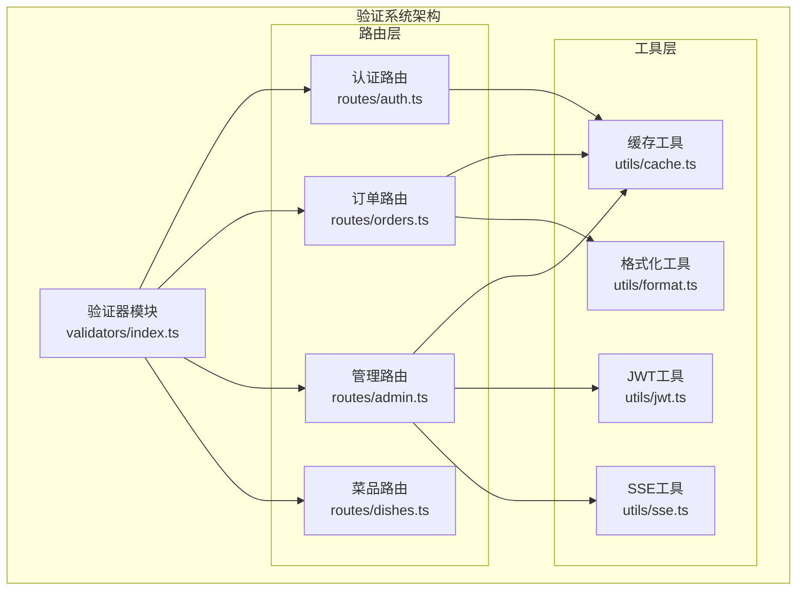

**图表来源**
- [validators/index.ts:1-123](file://server/src/validators/index.ts#L1-L123)
- [routes/auth.ts:1-405](file://server/src/routes/auth.ts#L1-L405)
- [routes/orders.ts:1-552](file://server/src/routes/orders.ts#L1-L552)
- [routes/admin.ts:1-1887](file://server/src/routes/admin.ts#L1-L1887)

**章节来源**
- [validators/index.ts:1-123](file://server/src/validators/index.ts#L1-L123)
- [package.json:1-64](file://package.json#L1-L64)

## 核心组件

### Zod 验证器模块

验证系统的核心是 Zod Schema 定义，涵盖了以下主要验证场景：

#### 订单验证
- **创建订单**: 验证桌位ID、用餐时间、联系人信息、手机号码、菜品清单等
- **取消订单**: 验证手机号身份验证
- **更新订单项**: 验证加菜操作的数据结构

#### 菜品验证
- **创建菜品**: 验证菜品名称、价格、分类、描述、标签、规格等
- **更新菜品**: 支持可选字段的更新操作

#### 系统管理验证
- **桌位管理**: 验证桌位编号、名称、容量等
- **分类管理**: 验证分类名称、排序等
- **库存管理**: 验证物料名称、数量、单位、预警阈值等
- **用户管理**: 验证用户名、密码、角色、联系方式等

#### 订单状态验证
- **状态白名单**: 严格限制订单状态的可选值范围

**章节来源**
- [validators/index.ts:6-123](file://server/src/validators/index.ts#L6-L123)

### 类型推断系统

系统利用 Zod 的类型推断功能，为每个 Schema 生成对应的 TypeScript 类型：

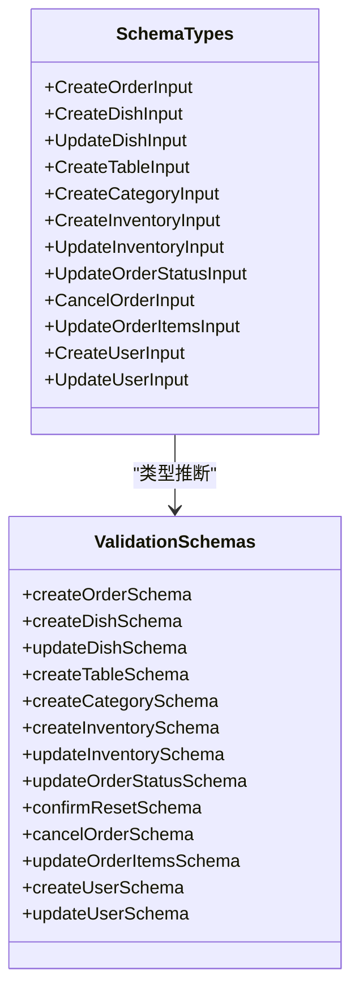

**图表来源**
- [validators/index.ts:111-123](file://server/src/validators/index.ts#L111-L123)

**章节来源**
- [validators/index.ts:111-123](file://server/src/validators/index.ts#L111-L123)

## 架构概览

验证系统采用分层架构，通过中间件和路由处理器实现验证逻辑：

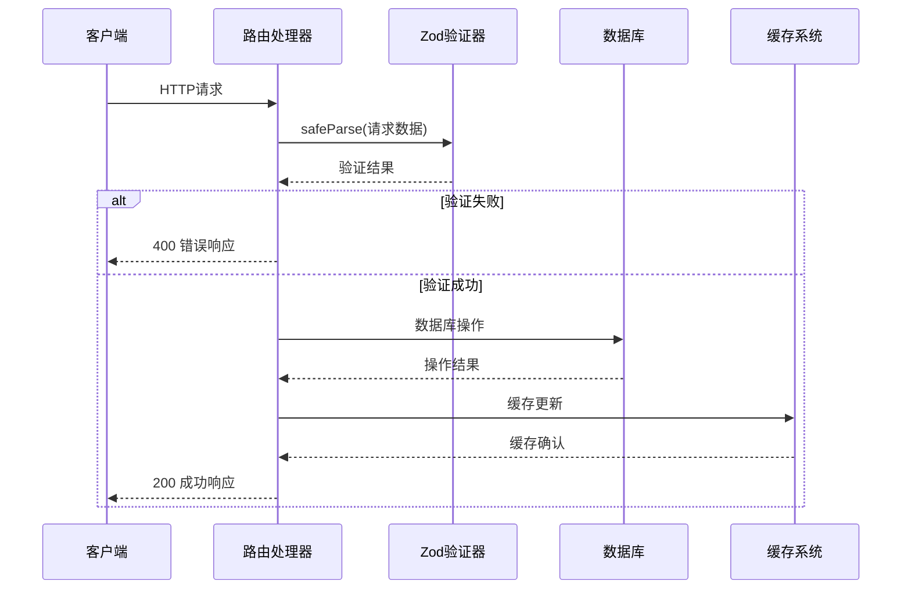

**图表来源**
- [routes/orders.ts:194-353](file://server/src/routes/orders.ts#L194-L353)
- [routes/admin.ts:273-306](file://server/src/routes/admin.ts#L273-L306)

## 详细组件分析

### 订单验证系统

订单验证系统是最复杂的验证模块，包含了多种验证场景：

#### 订单创建验证流程

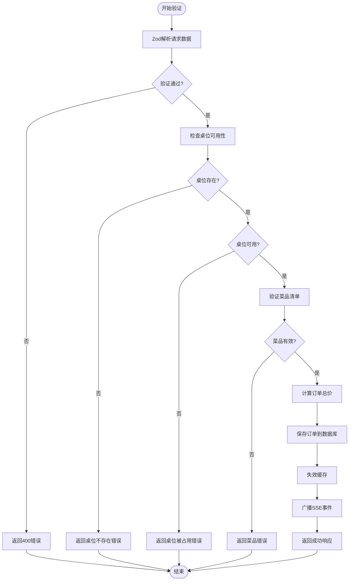

**图表来源**
- [routes/orders.ts:194-353](file://server/src/routes/orders.ts#L194-L353)

#### 订单取消验证

订单取消功能采用了双重验证机制：
1. **身份验证**: 验证请求体中的手机号格式
2. **权限验证**: 确保取消的手机号与订单中的联系人手机号一致

**章节来源**
- [routes/orders.ts:355-418](file://server/src/routes/orders.ts#L355-L418)

### 管理员验证系统

管理员后台的验证系统更加严格，包含了多种业务规则验证：

#### 菜品管理验证

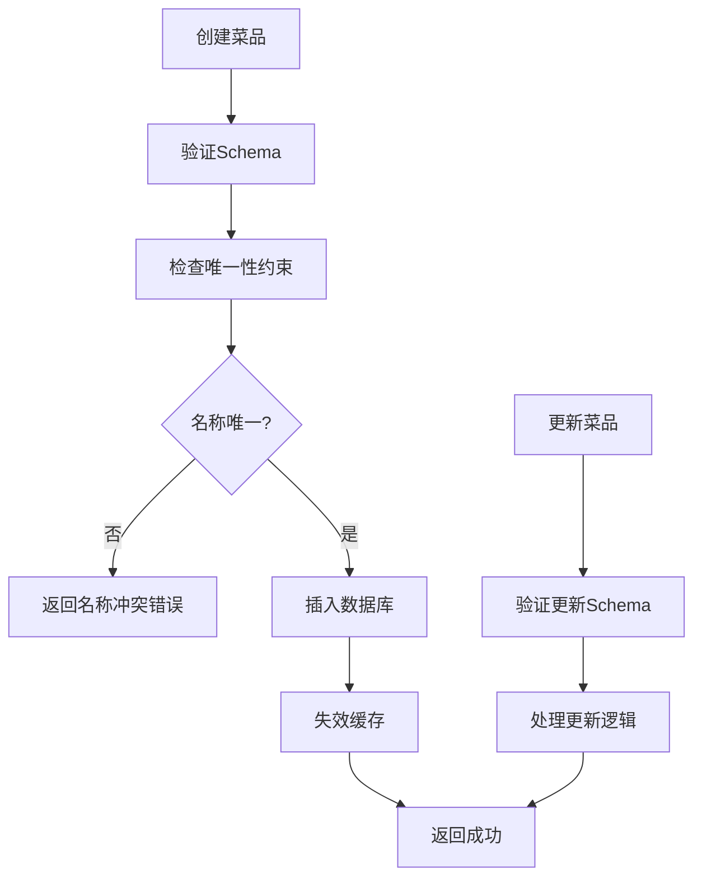

**图表来源**
- [routes/admin.ts:374-429](file://server/src/routes/admin.ts#L374-L429)
- [routes/admin.ts:456-520](file://server/src/routes/admin.ts#L456-L520)

**章节来源**
- [routes/admin.ts:374-520](file://server/src/routes/admin.ts#L374-L520)

### 认证验证系统

认证系统包含了多重安全验证机制：

#### 登录速率限制

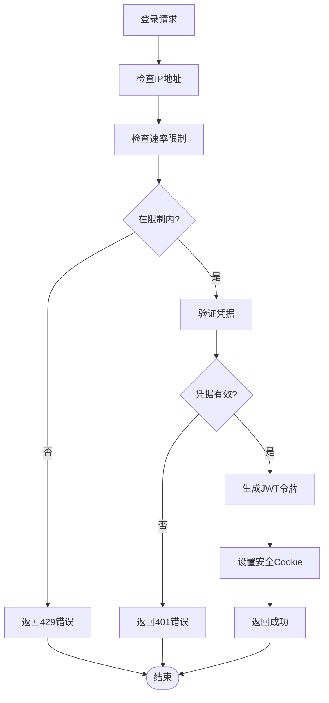

**图表来源**
- [routes/auth.ts:65-144](file://server/src/routes/auth.ts#L65-L144)

**章节来源**
- [routes/auth.ts:65-144](file://server/src/routes/auth.ts#L65-L144)

### 错误处理机制

系统采用了统一的错误处理模式：

#### 错误映射机制

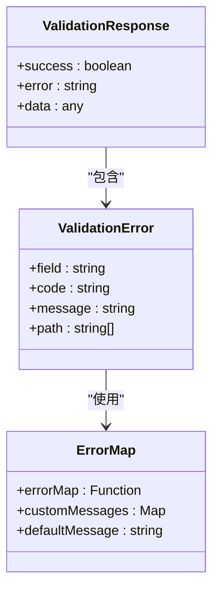

**图表来源**
- [validators/index.ts:67-76](file://server/src/validators/index.ts#L67-L76)
- [validators/index.ts:96-109](file://server/src/validators/index.ts#L96-L109)

**章节来源**
- [validators/index.ts:67-76](file://server/src/validators/index.ts#L67-L76)
- [validators/index.ts:96-109](file://server/src/validators/index.ts#L96-L109)

## 依赖关系分析

### 核心依赖

验证系统主要依赖于以下核心库：

```mermaid
graph TB
subgraph "验证系统依赖"
Zod[zod@3.24.1]
Express[express^4.21.2]
Bcrypt[bcryptjs^2.4.3]
JWT[jsonwebtoken^9.0.2]
UUID[uuid^11.0.3]
end
subgraph "验证系统"
Validators[validators/index.ts]
Routes[routes/*]
Utils[utils/*]
end
Zod --> Validators
Zod --> Routes
Express --> Routes
Bcrypt --> Routes
JWT --> Routes
UUID --> Routes
Validators --> Routes
Routes --> Utils
```

**图表来源**
- [package.json:16-41](file://package.json#L16-L41)
- [validators/index.ts:1](file://server/src/validators/index.ts#L1)

**章节来源**
- [package.json:16-41](file://package.json#L16-L41)

### 数据流关系

验证系统中的数据流遵循严格的处理顺序：

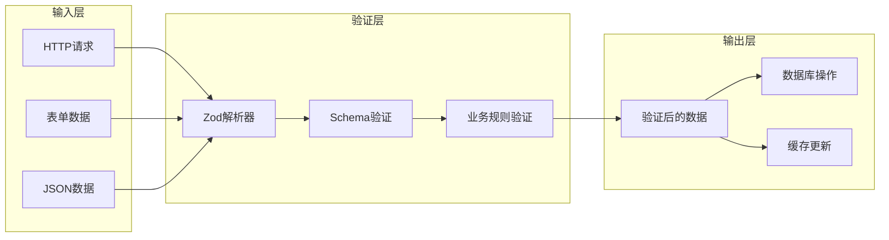

**图表来源**
- [routes/orders.ts:196-203](file://server/src/routes/orders.ts#L196-L203)
- [routes/admin.ts:276-282](file://server/src/routes/admin.ts#L276-L282)

## 性能考虑

### 延迟验证策略

系统采用了多种延迟验证策略来优化性能：

#### 批量验证优化

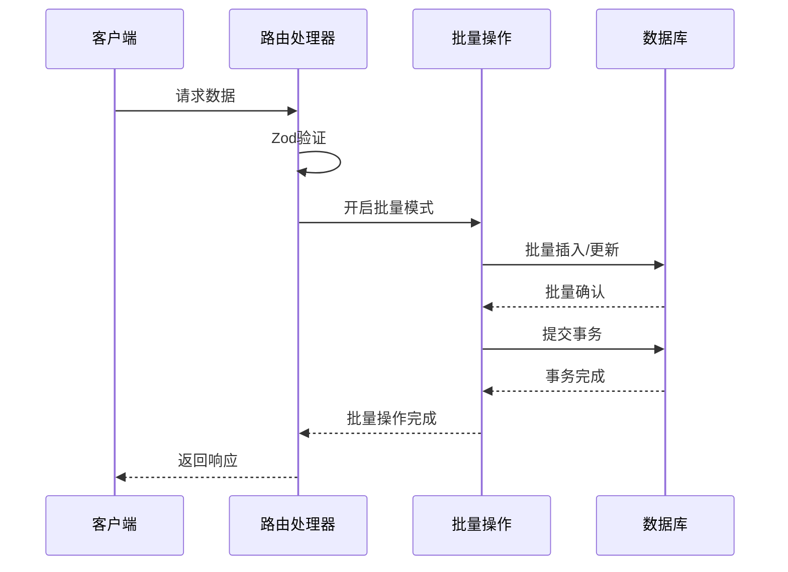

**图表来源**
- [routes/orders.ts:296-318](file://server/src/routes/orders.ts#L296-L318)
- [routes/admin.ts:441-445](file://server/src/routes/admin.ts#L441-L445)

#### 缓存验证优化

系统通过缓存机制减少重复验证：

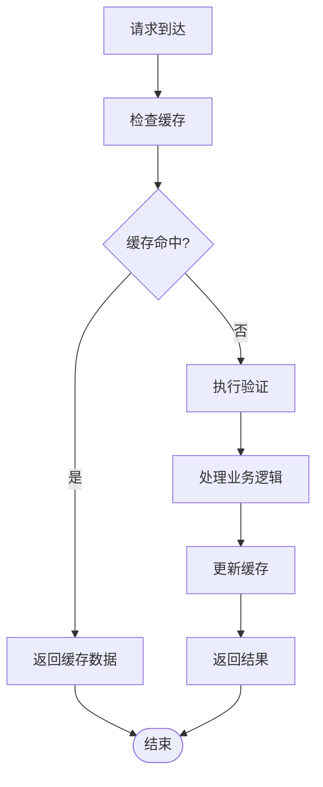

**图表来源**
- [utils/cache.ts:18-36](file://server/src/utils/cache.ts#L18-L36)
- [routes/dishes.ts:28-60](file://server/src/routes/dishes.ts#L28-L60)

**章节来源**
- [utils/cache.ts:18-36](file://server/src/utils/cache.ts#L18-L36)
- [routes/dishes.ts:28-60](file://server/src/routes/dishes.ts#L28-L60)

### 条件验证优化

系统实现了智能的条件验证，根据不同的业务场景选择合适的验证策略：

#### 动态验证规则

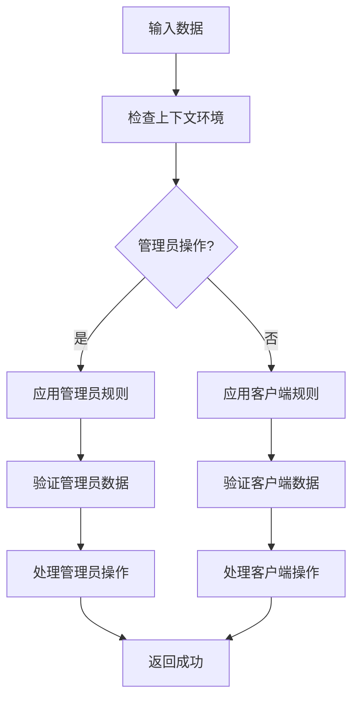

**图表来源**
- [routes/admin.ts:116-131](file://server/src/routes/admin.ts#L116-L131)
- [routes/orders.ts:24-49](file://server/src/routes/orders.ts#L24-L49)

**章节来源**
- [routes/admin.ts:116-131](file://server/src/routes/admin.ts#L116-L131)
- [routes/orders.ts:24-49](file://server/src/routes/orders.ts#L24-L49)

## 故障排除指南

### 常见验证错误

#### Schema 验证失败

当 Zod Schema 验证失败时，系统会返回详细的错误信息：

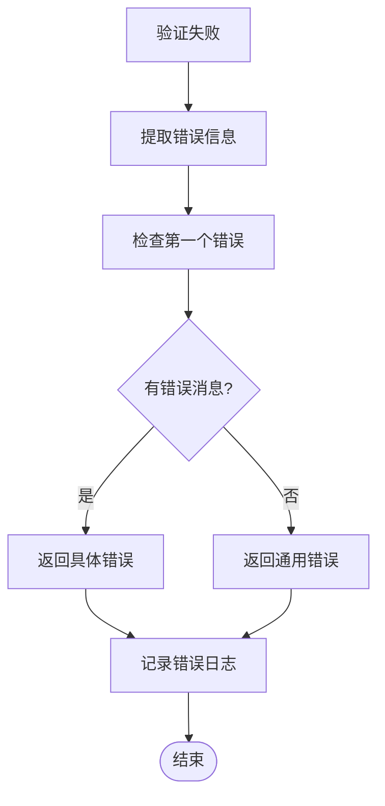

**图表来源**
- [routes/orders.ts:198-203](file://server/src/routes/orders.ts#L198-L203)
- [routes/admin.ts:278-282](file://server/src/routes/admin.ts#L278-L282)

#### 业务规则验证失败

业务规则验证失败通常涉及更复杂的逻辑判断：

**章节来源**
- [routes/orders.ts:208-236](file://server/src/routes/orders.ts#L208-L236)
- [routes/admin.ts:286-294](file://server/src/routes/admin.ts#L286-L294)

### 调试技巧

#### 开发环境调试

在开发环境中，可以利用以下技巧进行调试：

1. **启用详细日志**: 在验证失败时记录完整的请求数据
2. **使用类型推断**: 利用 TypeScript 的类型推断功能进行静态分析
3. **单元测试**: 为每个 Schema 编写针对性的测试用例

#### 生产环境监控

生产环境中的监控要点：

1. **错误率统计**: 监控各类验证错误的发生频率
2. **性能指标**: 监控验证操作的响应时间和吞吐量
3. **缓存命中率**: 监控缓存系统的有效性

**章节来源**
- [routes/auth.ts:140-144](file://server/src/routes/auth.ts#L140-L144)
- [routes/admin.ts:828-832](file://server/src/routes/admin.ts#L828-L832)

## 结论

本数据验证系统通过 Zod 验证库实现了全面、类型安全的数据验证机制。系统具有以下特点：

1. **类型安全**: 利用 Zod 的类型推断功能，确保编译时的类型安全
2. **灵活配置**: 支持自定义错误消息和验证规则
3. **性能优化**: 采用批量操作和缓存机制提升性能
4. **业务适配**: 针对不同的业务场景提供专门的验证规则
5. **错误处理**: 提供统一的错误处理和日志记录机制

通过合理的架构设计和实现策略，该验证系统能够有效保障数据的完整性和一致性，为整个应用提供了坚实的基础。