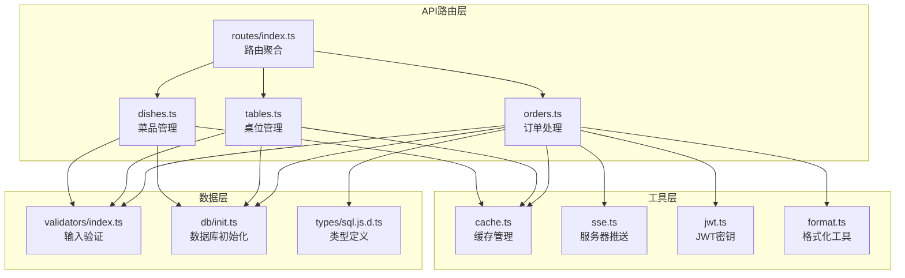
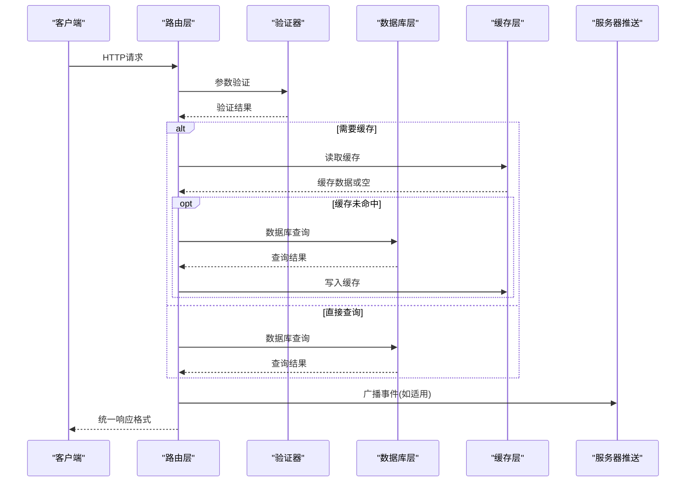
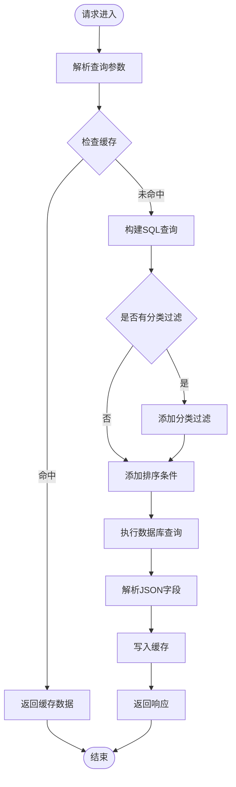
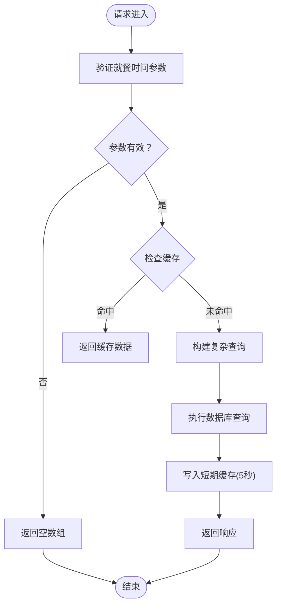
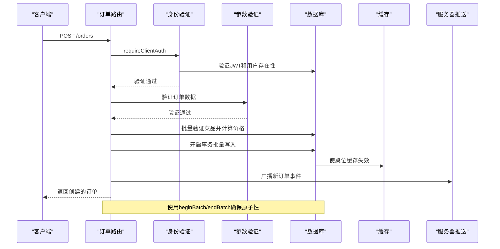
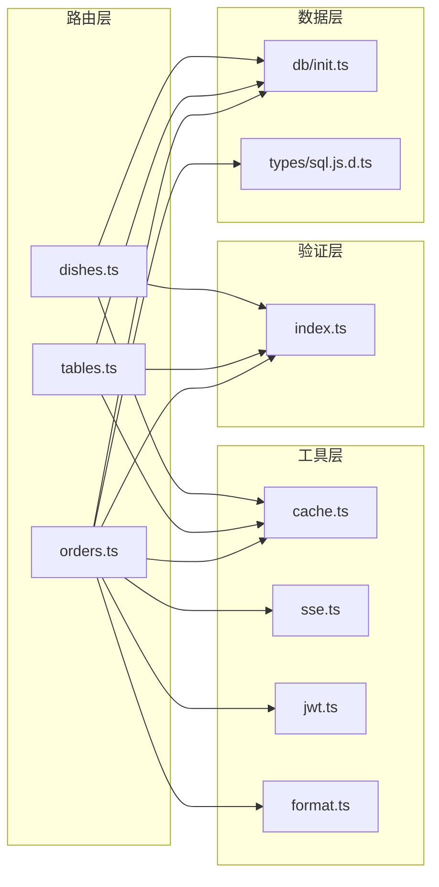

# 公共API路由

<cite>
**本文引用的文件**
- [server/src/routes/dishes.ts](file://server/src/routes/dishes.ts)
- [server/src/routes/tables.ts](file://server/src/routes/tables.ts)
- [server/src/routes/orders.ts](file://server/src/routes/orders.ts)
- [server/src/routes/index.ts](file://server/src/routes/index.ts)
- [server/src/validators/index.ts](file://server/src/validators/index.ts)
- [server/src/utils/cache.ts](file://server/src/utils/cache.ts)
- [server/src/utils/sse.ts](file://server/src/utils/sse.ts)
- [server/src/utils/format.ts](file://server/src/utils/format.ts)
- [server/src/utils/jwt.ts](file://server/src/utils/jwt.ts)
- [server/src/db/init.ts](file://server/src/db/init.ts)
- [server/src/types/sql.js.d.ts](file://server/src/types/sql.js.d.ts)
</cite>

## 目录
1. [简介](#简介)
2. [项目结构](#项目结构)
3. [核心组件](#核心组件)
4. [架构概览](#架构概览)
5. [详细组件分析](#详细组件分析)
6. [依赖关系分析](#依赖关系分析)
7. [性能考量](#性能考量)
8. [故障排除指南](#故障排除指南)
9. [结论](#结论)
10. [附录](#附录)

## 简介
本文件详细解析RLRMS系统的公共API路由实现，重点覆盖菜品管理、桌位管理和订单处理三大模块。文档遵循RESTful API设计原则，系统阐述HTTP方法使用、URL路径设计、参数传递方式，深入分析各路由端点的功能实现、参数验证机制、错误处理策略以及响应数据格式。同时提供路由扩展和新功能添加的实践指导，帮助开发者在现有架构基础上进行安全、可维护的功能扩展。

## 项目结构
RLRMS采用Express.js作为Web框架，路由层位于server/src/routes目录，按功能模块划分：
- dishes.ts：菜品管理相关路由
- tables.ts：桌位管理相关路由  
- orders.ts：订单处理相关路由
- index.ts：路由聚合入口



**图表来源**
- [server/src/routes/index.ts:1-18](file://server/src/routes/index.ts#L1-L18)
- [server/src/routes/dishes.ts:1-216](file://server/src/routes/dishes.ts#L1-L216)
- [server/src/routes/tables.ts:1-93](file://server/src/routes/tables.ts#L1-L93)
- [server/src/routes/orders.ts:1-552](file://server/src/routes/orders.ts#L1-L552)

**章节来源**
- [server/src/routes/index.ts:1-18](file://server/src/routes/index.ts#L1-L18)

## 核心组件
本节概述三个核心路由模块的设计理念和实现特点：

### 菜品管理模块（Dishes）
- 提供菜品列表查询、详情获取、搜索功能
- 实现多级缓存策略，优化性能
- 支持分类过滤和标签解析
- 包含专门的首页数据合并端点

### 桌位管理模块（Tables）  
- 提供桌位列表查询和可用性检测
- 支持按就餐时段筛选可用桌位
- 实现桌位状态管理
- 提供实时可用性缓存

### 订单处理模块（Orders）
- 实现完整的订单生命周期管理
- 强制客户端身份验证
- 服务端价格验证和计算
- 支持订单取消和加菜功能
- 集成服务器推送通知

**章节来源**
- [server/src/routes/dishes.ts:1-216](file://server/src/routes/dishes.ts#L1-L216)
- [server/src/routes/tables.ts:1-93](file://server/src/routes/tables.ts#L1-L93)
- [server/src/routes/orders.ts:1-552](file://server/src/routes/orders.ts#L1-L552)

## 架构概览
RLRMS采用分层架构设计，各层职责清晰：



**图表来源**
- [server/src/routes/dishes.ts:25-65](file://server/src/routes/dishes.ts#L25-L65)
- [server/src/routes/tables.ts:24-55](file://server/src/routes/tables.ts#L24-L55)
- [server/src/routes/orders.ts:194-353](file://server/src/routes/orders.ts#L194-L353)

## 详细组件分析

### 菜品管理路由分析

#### 路由设计原则
- 使用RESTful资源命名：/dishes、/dishes/:id
- 支持查询参数过滤：category
- 提供专用端点：/home-data、/search/query、/categories/all

#### 核心功能实现



**图表来源**
- [server/src/routes/dishes.ts:25-65](file://server/src/routes/dishes.ts#L25-L65)
- [server/src/routes/dishes.ts:69-117](file://server/src/routes/dishes.ts#L69-L117)

#### 关键端点详解

**GET /dishes**
- 功能：获取在售菜品列表
- 参数：category（可选，按分类过滤）
- 响应：成功标志 + 菜品数据数组
- 缓存策略：按分类区分的列表缓存

**GET /dishes/home-data**
- 功能：获取首页所需的数据组合
- 响应：包含分类和菜品的完整数据结构
- 缓存策略：首页数据缓存，包含tags和specs的JSON解析

**GET /dishes/search/query**
- 功能：菜品搜索
- 参数：q（搜索关键词）
- 响应：搜索结果数组

**GET /dishes/categories/all**
- 功能：获取所有分类
- 响应：分类列表

**GET /dishes/:id**
- 功能：获取指定菜品详情
- 响应：菜品详细信息，包含解析后的tags和specs

**章节来源**
- [server/src/routes/dishes.ts:25-216](file://server/src/routes/dishes.ts#L25-L216)

### 桌位管理路由分析

#### 路由设计原则
- 使用RESTful资源命名：/tables、/tables/:id
- 支持查询参数：dining_time（就餐时段）
- 提供状态查询：/available、/available-for

#### 核心功能实现



**图表来源**
- [server/src/routes/tables.ts:24-55](file://server/src/routes/tables.ts#L24-L55)

#### 关键端点详解

**GET /tables**
- 功能：获取所有桌位
- 响应：桌位列表

**GET /tables/available-for**
- 功能：获取特定就餐时段的可用桌位
- 参数：dining_time（中午/晚上）
- 响应：可用桌位列表
- 特殊逻辑：排除该时段已有活跃订单的预留桌位

**GET /tables/available**
- 功能：获取所有可用桌位
- 响应：可用桌位列表
- 缓存策略：5秒TTL的短期缓存

**GET /tables/:id**
- 功能：获取指定桌位详情
- 响应：桌位详细信息

**章节来源**
- [server/src/routes/tables.ts:1-93](file://server/src/routes/tables.ts#L1-L93)

### 订单处理路由分析

#### 路由设计原则
- 强制客户端身份验证中间件
- 使用RESTful资源命名：/orders、/orders/:id
- 支持子资源操作：/orders/:id/cancel、/orders/:id/items

#### 核心功能实现



**图表来源**
- [server/src/routes/orders.ts:194-353](file://server/src/routes/orders.ts#L194-L353)
- [server/src/routes/orders.ts:24-49](file://server/src/routes/orders.ts#L24-L49)

#### 关键端点详解

**GET /orders**
- 功能：获取当前用户的订单历史
- 参数：phone（必须提供手机号）
- 响应：订单列表，包含菜品明细
- 性能优化：N+1查询问题通过批量查询解决

**POST /orders**
- 功能：创建新订单
- 身份验证：requireClientAuth中间件
- 参数验证：createOrderSchema
- 业务逻辑：
  - 验证桌位可用性
  - 服务端批量验证菜品并重新计算价格
  - 原子性批量写入（订单+订单项+桌位状态更新）
  - SSE广播新订单事件

**GET /orders/:id**
- 功能：获取指定订单详情
- 身份验证：requireClientAuth中间件
- 响应：订单详细信息，包含菜品明细

**POST /orders/:id/cancel**
- 功能：取消订单
- 身份验证：requireClientAuth中间件
- 参数验证：cancelOrderSchema
- 业务逻辑：5分钟内且状态为pending才允许取消

**PUT /orders/:id/items**
- 功能：加菜（更新订单菜品）
- 身份验证：requireClientAuth中间件
- 参数验证：updateOrderItemsSchema
- 业务逻辑：删除旧项、插入新项、更新订单状态为pending

**POST /orders/verify**
- 功能：批量验证订单ID存在性
- 用途：清理幽灵订单

**章节来源**
- [server/src/routes/orders.ts:1-552](file://server/src/routes/orders.ts#L1-L552)

## 依赖关系分析

### 组件耦合度分析



**图表来源**
- [server/src/routes/dishes.ts:1-216](file://server/src/routes/dishes.ts#L1-L216)
- [server/src/routes/tables.ts:1-93](file://server/src/routes/tables.ts#L1-L93)
- [server/src/routes/orders.ts:1-552](file://server/src/routes/orders.ts#L1-L552)

### 外部依赖分析
- Express.js：Web框架基础
- Zod：运行时类型验证
- UUID：唯一标识符生成
- JSON Web Token：身份验证
- SQL.js：SQLite数据库驱动

**章节来源**
- [server/src/validators/index.ts:1-123](file://server/src/validators/index.ts#L1-L123)
- [server/src/utils/cache.ts:1-73](file://server/src/utils/cache.ts#L1-L73)
- [server/src/utils/sse.ts:1-59](file://server/src/utils/sse.ts#L1-L59)
- [server/src/utils/jwt.ts:1-27](file://server/src/utils/jwt.ts#L1-L27)
- [server/src/types/sql.js.d.ts:1-24](file://server/src/types/sql.js.d.ts#L1-L24)

## 性能考量

### 缓存策略
- **菜品模块**：多级缓存
  - DISHES_HOME：首页数据缓存（30秒TTL）
  - DISHES_LIST：菜品列表缓存（30秒TTL）
  - CATEGORIES：分类数据缓存（30秒TTL）
  - DISHES_SEARCH_PREFIX：搜索结果缓存（30秒TTL）

- **桌位模块**：短期缓存
  - TABLES_AVAILABLE：可用桌位缓存（5秒TTL）
  - TABLES_AVAILABLE_FOR_PREFIX：按时段可用桌位缓存（5秒TTL）

### 数据库优化
- 索引优化：为常用查询字段建立索引
- 批量操作：使用beginBatch/endBatch减少磁盘I/O
- N+1查询解决：批量查询订单明细

### 错误处理策略
- 统一响应格式：success + data/error字段
- 详细的错误信息：便于前端处理
- 适当的HTTP状态码：400、401、403、404、500

**章节来源**
- [server/src/utils/cache.ts:1-73](file://server/src/utils/cache.ts#L1-L73)
- [server/src/db/init.ts:124-137](file://server/src/db/init.ts#L124-L137)

## 故障排除指南

### 常见问题诊断

**菜品查询异常**
- 检查分类参数是否正确
- 验证JSON字段解析是否正常
- 确认缓存键是否正确

**桌位可用性问题**
- 验证dining_time参数格式
- 检查活跃订单状态判断逻辑
- 确认缓存失效时机

**订单创建失败**
- 检查客户端身份验证
- 验证菜品状态和价格
- 确认桌位可用性检查

**章节来源**
- [server/src/routes/dishes.ts:11-22](file://server/src/routes/dishes.ts#L11-L22)
- [server/src/routes/tables.ts:7-11](file://server/src/routes/tables.ts#L7-L11)
- [server/src/routes/orders.ts:24-49](file://server/src/routes/orders.ts#L24-L49)

## 结论
RLRMS的公共API路由实现了完整的餐厅管理系统功能，具有以下特点：

1. **RESTful设计**：严格遵循RESTful API设计原则，URL结构清晰，HTTP方法使用恰当
2. **安全性**：订单相关操作强制客户端身份验证，防止未授权访问
3. **性能优化**：多层次缓存策略，数据库索引优化，批量操作减少I/O
4. **可靠性**：统一的错误处理机制，原子性事务保证数据一致性
5. **可扩展性**：模块化设计，易于添加新功能和路由

该架构为餐厅管理系统的数字化转型提供了坚实的技术基础。

## 附录

### API响应统一格式
所有API响应采用统一格式：
```javascript
{
  "success": true,           // 布尔值，表示请求是否成功
  "data": {},               // 成功时的数据对象或数组
  "error": "错误信息"       // 失败时的错误描述
}
```

### 数据库表结构
- users：用户表，支持customer和admin角色
- tables：桌位表，包含状态和容量信息
- categories：菜品分类表
- dishes：菜品表，包含价格、状态、标签等信息
- orders：订单表，关联用户和桌位
- order_items：订单明细表
- inventory：库存表
- settings：系统设置表

### 路由扩展实践指导

**新增菜品相关路由**
1. 在dishes.ts中添加新路由
2. 如需缓存，使用invalidateDishesCache()失效相关缓存
3. 添加相应的验证器schema

**新增桌位相关路由**
1. 在tables.ts中添加新路由
2. 使用invalidateTablesCache()失效相关缓存
3. 考虑添加新的查询参数

**新增订单相关路由**
1. 在orders.ts中添加新路由
2. 考虑添加身份验证中间件
3. 使用批量操作确保数据一致性
4. 如有状态变更，考虑SSE广播

**最佳实践**
- 始终使用统一的响应格式
- 为可能的查询结果添加缓存
- 对外部输入进行严格的参数验证
- 使用事务确保数据完整性
- 考虑性能影响，合理设置缓存TTL
- 添加适当的错误处理和日志记录

**章节来源**
- [server/src/db/init.ts:11-204](file://server/src/db/init.ts#L11-L204)
- [server/src/routes/dishes.ts:7-12](file://server/src/routes/dishes.ts#L7-L12)
- [server/src/routes/tables.ts:7-11](file://server/src/routes/tables.ts#L7-L11)
- [server/src/routes/orders.ts:320-323](file://server/src/routes/orders.ts#L320-L323)