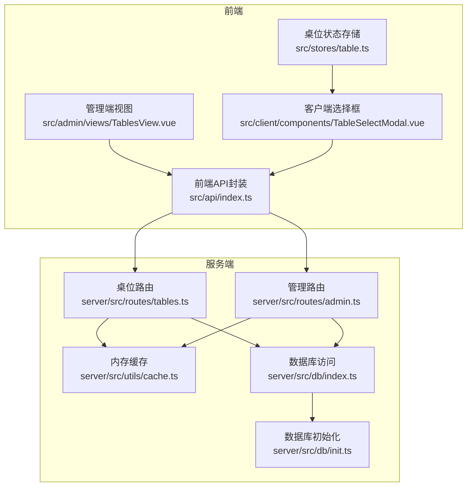
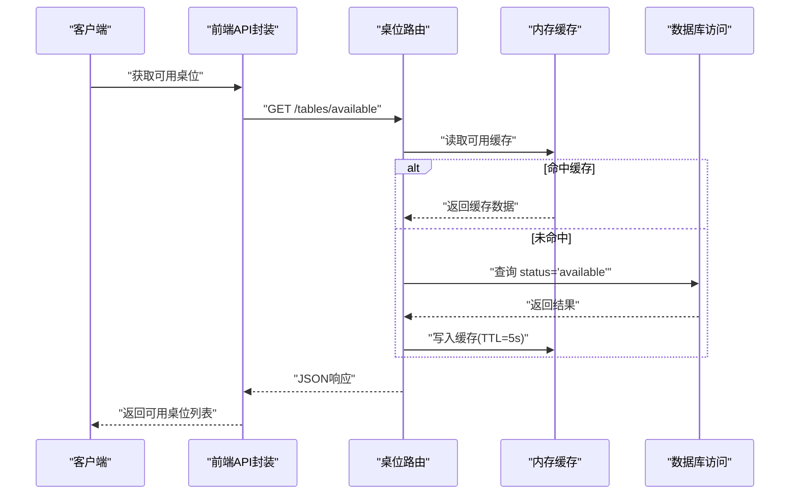
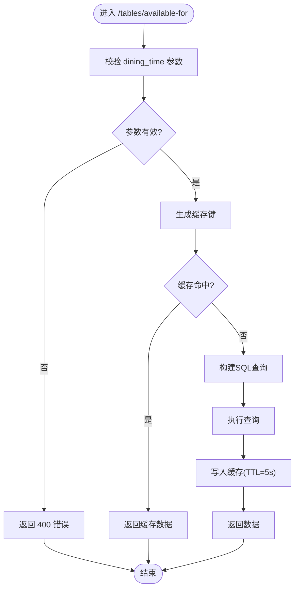
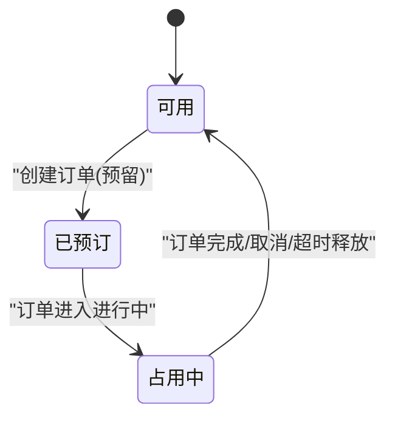
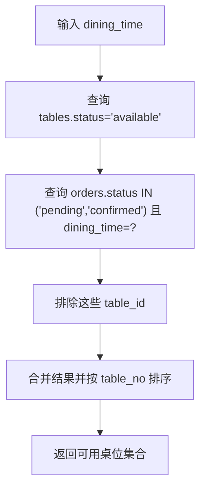
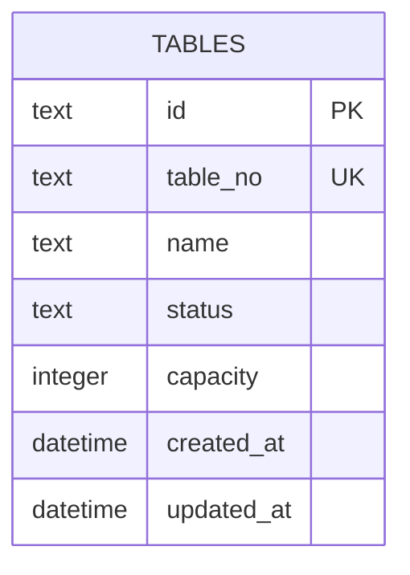
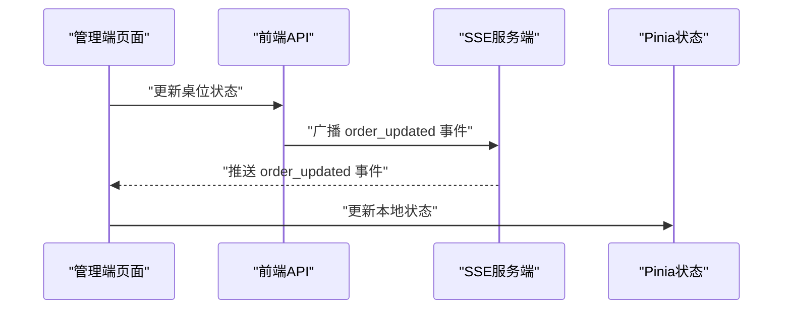
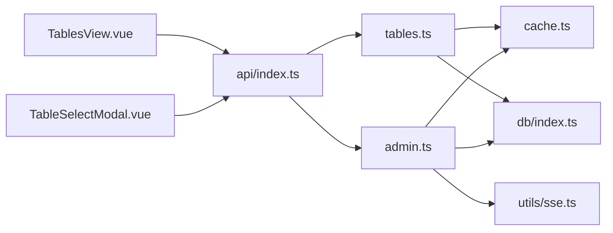

# 桌位管理API

<cite>
**本文档引用的文件**
- [server/src/routes/tables.ts](file://server/src/routes/tables.ts)
- [server/src/db/index.ts](file://server/src/db/index.ts)
- [server/src/db/init.ts](file://server/src/db/init.ts)
- [server/src/utils/cache.ts](file://server/src/utils/cache.ts)
- [src/api/index.ts](file://src/api/index.ts)
- [src/types/index.ts](file://src/types/index.ts)
- [src/admin/views/TablesView.vue](file://src/admin/views/TablesView.vue)
- [src/client/components/TableSelectModal.vue](file://src/client/components/TableSelectModal.vue)
- [src/stores/table.ts](file://src/stores/table.ts)
- [server/src/routes/admin.ts](file://server/src/routes/admin.ts)
- [server/src/utils/sse.ts](file://server/src/utils/sse.ts)
</cite>

## 目录
1. [简介](#简介)
2. [项目结构](#项目结构)
3. [核心组件](#核心组件)
4. [架构总览](#架构总览)
5. [详细组件分析](#详细组件分析)
6. [依赖关系分析](#依赖关系分析)
7. [性能考量](#性能考量)
8. [故障排查指南](#故障排查指南)
9. [结论](#结论)
10. [附录](#附录)

## 简介
本文件面向RLRMS桌位管理API，系统性解析RESTful接口设计、状态枚举处理、可用桌位筛选算法、容量管理与缓存策略，并阐述状态同步机制与扩展建议。文档覆盖服务端路由、数据库层、前端调用与状态管理，帮助开发者快速理解并高效扩展桌位模块。

## 项目结构
桌位模块由三层构成：
- 前端调用层：通过统一的API封装发起HTTP请求，支持stale-while-revalidate缓存策略
- 服务端路由层：提供桌位查询、可用性筛选、详情获取等REST接口
- 数据访问层：基于SQL.js的内存数据库，提供事务批处理与索引优化

图表来源
- [server/src/routes/tables.ts:1-93](file://server/src/routes/tables.ts#L1-L93)
- [server/src/routes/admin.ts:1-200](file://server/src/routes/admin.ts#L1-L200)
- [server/src/utils/cache.ts:1-73](file://server/src/utils/cache.ts#L1-L73)
- [server/src/db/index.ts:1-156](file://server/src/db/index.ts#L1-L156)
- [server/src/db/init.ts:1-204](file://server/src/db/init.ts#L1-L204)
- [src/api/index.ts:173-184](file://src/api/index.ts#L173-L184)
- [src/admin/views/TablesView.vue:1-484](file://src/admin/views/TablesView.vue#L1-L484)
- [src/client/components/TableSelectModal.vue:1-231](file://src/client/components/TableSelectModal.vue#L1-L231)
- [src/stores/table.ts:1-25](file://src/stores/table.ts#L1-L25)

章节来源
- [server/src/routes/tables.ts:1-93](file://server/src/routes/tables.ts#L1-L93)
- [server/src/routes/admin.ts:1-200](file://server/src/routes/admin.ts#L1-L200)
- [server/src/utils/cache.ts:1-73](file://server/src/utils/cache.ts#L1-L73)
- [server/src/db/index.ts:1-156](file://server/src/db/index.ts#L1-L156)
- [server/src/db/init.ts:1-204](file://server/src/db/init.ts#L1-L204)
- [src/api/index.ts:173-184](file://src/api/index.ts#L173-L184)
- [src/admin/views/TablesView.vue:1-484](file://src/admin/views/TablesView.vue#L1-L484)
- [src/client/components/TableSelectModal.vue:1-231](file://src/client/components/TableSelectModal.vue#L1-L231)
- [src/stores/table.ts:1-25](file://src/stores/table.ts#L1-L25)

## 核心组件
- 桌位数据模型：包含唯一标识、编号、名称、状态、容量及时间戳字段
- REST接口族：
  - 获取全部桌位
  - 获取可用桌位（全局）
  - 按就餐时段筛选可用桌位
  - 按ID获取桌位详情
- 状态枚举：available（可用）、reserved（已预订）、occupied（占用中）
- 缓存策略：内存TTL缓存，针对可用桌位与按时段可用桌位分别设置短TTL
- 管理端能力：创建、更新（含状态）、删除桌位；支持批量写入与缓存失效

章节来源
- [src/types/index.ts:34-43](file://src/types/index.ts#L34-L43)
- [server/src/routes/tables.ts:14-93](file://server/src/routes/tables.ts#L14-L93)
- [server/src/utils/cache.ts:64-72](file://server/src/utils/cache.ts#L64-L72)
- [server/src/routes/admin.ts:238-306](file://server/src/routes/admin.ts#L238-L306)

## 架构总览
桌位模块遵循分层架构：前端通过API封装调用后端路由；路由层负责参数校验、查询构建与缓存控制；数据层采用SQL.js内存数据库，提供事务批处理与索引加速；管理端通过SSE接收实时事件，实现状态同步。

图表来源
- [server/src/routes/tables.ts:57-76](file://server/src/routes/tables.ts#L57-L76)
- [server/src/utils/cache.ts:18-36](file://server/src/utils/cache.ts#L18-L36)
- [server/src/db/index.ts:127-140](file://server/src/db/index.ts#L127-L140)

## 详细组件分析

### RESTful API设计与实现
- GET /tables：返回所有桌位，按编号排序
- GET /tables/available：返回状态为available的桌位，带5秒TTL缓存
- GET /tables/available-for：按dining_time参数返回可用桌位，规则为：
  - status=available的桌位
  - 或status=reserved但该桌位当前无处于pending/confirmed状态且dining_time匹配的活跃订单
- GET /tables/:id：按ID获取桌位详情，未找到返回404

图表来源
- [server/src/routes/tables.ts:24-55](file://server/src/routes/tables.ts#L24-L55)

章节来源
- [server/src/routes/tables.ts:14-93](file://server/src/routes/tables.ts#L14-L93)

### 状态枚举与业务含义
- available：可被选择的空闲桌位
- reserved：已被预订但当前时段未占用
- occupied：当前被占用（通常由订单状态流转触发）

图表来源
- [server/src/routes/tables.ts:38-47](file://server/src/routes/tables.ts#L38-L47)
- [server/src/routes/admin.ts:795-833](file://server/src/routes/admin.ts#L795-L833)

章节来源
- [src/types/index.ts:39](file://src/types/index.ts#L39)
- [server/src/routes/tables.ts:38-47](file://server/src/routes/tables.ts#L38-L47)
- [server/src/routes/admin.ts:795-833](file://server/src/routes/admin.ts#L795-L833)

### 空闲桌位计算逻辑
- 全局可用：仅筛选status=available
- 按时段可用：筛选status=available，或status=reserved且该桌位当前无pending/confirmed且dining_time匹配的活跃订单

图表来源
- [server/src/routes/tables.ts:38-47](file://server/src/routes/tables.ts#L38-L47)

章节来源
- [server/src/routes/tables.ts:38-47](file://server/src/routes/tables.ts#L38-L47)

### 桌位容量管理
- 桌位实体包含capacity字段，默认4人
- 前端展示容量并限制选择逻辑（仅available状态可选）
- 管理端支持修改capacity

章节来源
- [src/types/index.ts:40](file://src/types/index.ts#L40)
- [src/client/components/TableSelectModal.vue:61-77](file://src/client/components/TableSelectModal.vue#L61-L77)
- [server/src/routes/admin.ts:238-306](file://server/src/routes/admin.ts#L238-L306)

### 数据模型与查询优化
- 表结构：tables(id, table_no, name, status, capacity, created_at, updated_at)
- 索引：对tables(status)建立索引，加速可用性查询
- 批处理：数据库层提供runBatch/beginBatch/endBatch，降低写入抖动

图表来源
- [server/src/db/init.ts:24-34](file://server/src/db/init.ts#L24-L34)
- [server/src/db/init.ts:136](file://server/src/db/init.ts#L136)

章节来源
- [server/src/db/init.ts:24-34](file://server/src/db/init.ts#L24-L34)
- [server/src/db/init.ts:136](file://server/src/db/init.ts#L136)
- [server/src/db/index.ts:63-73](file://server/src/db/index.ts#L63-L73)

### 缓存策略与一致性
- 缓存键空间：
  - TABLES_AVAILABLE：全局可用桌位
  - TABLES_AVAILABLE_FOR_PREFIX + dining_time：按时段可用桌位
- TTL：5秒，避免过期导致的“假可用”
- 失效时机：
  - 管理端更新桌位（含状态）后主动失效相关缓存
  - 订单完成/取消/超时释放桌位后失效可用缓存

章节来源
- [server/src/utils/cache.ts:64-72](file://server/src/utils/cache.ts#L64-L72)
- [server/src/routes/tables.ts:8-11](file://server/src/routes/tables.ts#L8-L11)
- [server/src/routes/admin.ts:259-266](file://server/src/routes/admin.ts#L259-L266)
- [server/src/routes/admin.ts:820-823](file://server/src/routes/admin.ts#L820-L823)

### 前端交互与状态同步
- 管理端：表格卡片展示状态色块与文本，支持状态切换、增删改
- 客户端：桌位选择模态框仅允许选择available状态的桌位
- 状态同步：管理端通过SSE广播事件，前端监听并更新本地状态

图表来源
- [src/admin/views/TablesView.vue:144-162](file://src/admin/views/TablesView.vue#L144-L162)
- [server/src/routes/admin.ts:825-827](file://server/src/routes/admin.ts#L825-L827)
- [src/stores/table.ts:1-25](file://src/stores/table.ts#L1-L25)

章节来源
- [src/admin/views/TablesView.vue:46-56](file://src/admin/views/TablesView.vue#L46-L56)
- [src/admin/views/TablesView.vue:144-162](file://src/admin/views/TablesView.vue#L144-L162)
- [src/client/components/TableSelectModal.vue:39-59](file://src/client/components/TableSelectModal.vue#L39-L59)
- [src/stores/table.ts:1-25](file://src/stores/table.ts#L1-L25)

## 依赖关系分析
- 路由依赖：tables路由依赖数据库访问与缓存工具；admin路由依赖JWT鉴权、SSE与缓存
- 类型约束：前端类型定义严格限定状态枚举，避免非法状态传播
- 查询耦合：可用性查询与订单活跃状态紧密耦合，需保持一致性

图表来源
- [server/src/routes/tables.ts:1-93](file://server/src/routes/tables.ts#L1-L93)
- [server/src/routes/admin.ts:1-200](file://server/src/routes/admin.ts#L1-L200)
- [server/src/utils/cache.ts:1-73](file://server/src/utils/cache.ts#L1-L73)
- [server/src/db/index.ts:1-156](file://server/src/db/index.ts#L1-L156)
- [src/api/index.ts:173-184](file://src/api/index.ts#L173-L184)
- [src/admin/views/TablesView.vue:1-484](file://src/admin/views/TablesView.vue#L1-L484)
- [src/client/components/TableSelectModal.vue:1-231](file://src/client/components/TableSelectModal.vue#L1-L231)

章节来源
- [server/src/routes/tables.ts:1-93](file://server/src/routes/tables.ts#L1-L93)
- [server/src/routes/admin.ts:1-200](file://server/src/routes/admin.ts#L1-L200)
- [server/src/utils/cache.ts:1-73](file://server/src/utils/cache.ts#L1-L73)
- [server/src/db/index.ts:1-156](file://server/src/db/index.ts#L1-L156)
- [src/api/index.ts:173-184](file://src/api/index.ts#L173-L184)
- [src/admin/views/TablesView.vue:1-484](file://src/admin/views/TablesView.vue#L1-L484)
- [src/client/components/TableSelectModal.vue:1-231](file://src/client/components/TableSelectModal.vue#L1-L231)

## 性能考量
- 查询性能：对tables(status)建立索引，显著降低可用性查询成本
- 写入性能：批处理与去抖保存减少磁盘IO，适合高频更新场景
- 缓存命中率：短TTL平衡实时性与一致性，建议结合业务峰值调整
- 前端缓存：stale-while-revalidate策略提升用户体验，避免重复网络请求

章节来源
- [server/src/db/init.ts:136](file://server/src/db/init.ts#L136)
- [server/src/db/index.ts:37-60](file://server/src/db/index.ts#L37-L60)
- [src/api/index.ts:17-34](file://src/api/index.ts#L17-L34)

## 故障排查指南
- 常见错误
  - 参数缺失：/tables/available-for缺少dining_time参数，返回400
  - 未找到：/tables/:id不存在时返回404
  - 数据库未初始化：直接调用数据库方法未初始化会抛异常
- 缓存问题
  - 缓存未生效：确认缓存键与TTL配置是否正确
  - 缓存不一致：更新桌位后需调用缓存失效函数
- 订单状态影响
  - 订单完成后/取消后桌位应变为available，若未变需检查SSE广播与缓存失效链路

章节来源
- [server/src/routes/tables.ts:27-30](file://server/src/routes/tables.ts#L27-L30)
- [server/src/routes/tables.ts:84-86](file://server/src/routes/tables.ts#L84-L86)
- [server/src/db/index.ts:93-98](file://server/src/db/index.ts#L93-L98)
- [server/src/routes/admin.ts:820-823](file://server/src/routes/admin.ts#L820-L823)

## 结论
桌位管理API以清晰的REST设计、严格的类型约束与高效的缓存策略实现了高可用的桌位查询与状态管理。通过SSE实现的实时同步进一步提升了管理端体验。建议在生产环境中根据业务峰值调整缓存TTL与并发策略，并持续监控订单状态与桌位状态的一致性。

## 附录

### API定义概览
- GET /tables：获取全部桌位
- GET /tables/available：获取可用桌位
- GET /tables/available-for：按就餐时段获取可用桌位
- GET /tables/:id：按ID获取桌位详情
- PUT /admin/tables/:id：更新桌位（含状态）
- POST /admin/tables：创建桌位
- DELETE /admin/tables/:id：删除桌位

章节来源
- [server/src/routes/tables.ts:14-93](file://server/src/routes/tables.ts#L14-L93)
- [server/src/routes/admin.ts:238-306](file://server/src/routes/admin.ts#L238-L306)
- [src/api/index.ts:173-184](file://src/api/index.ts#L173-L184)