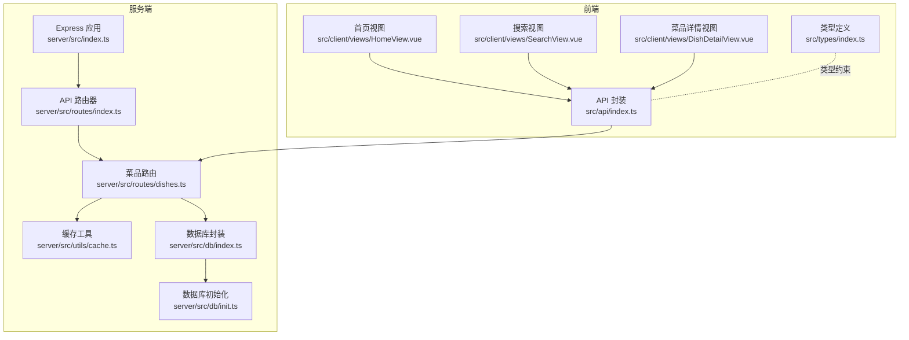
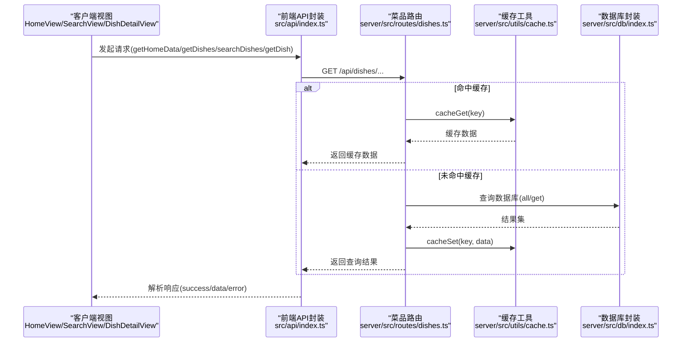
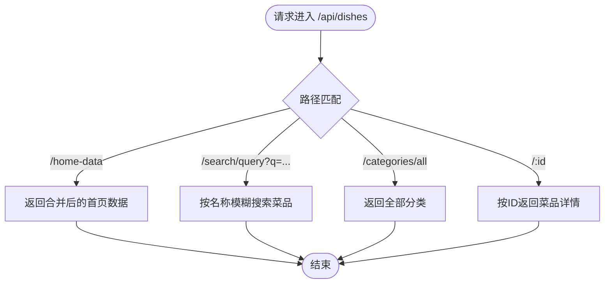
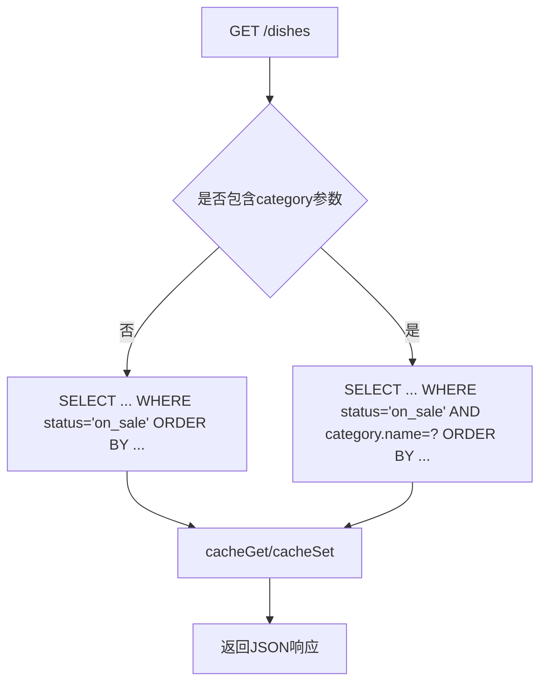
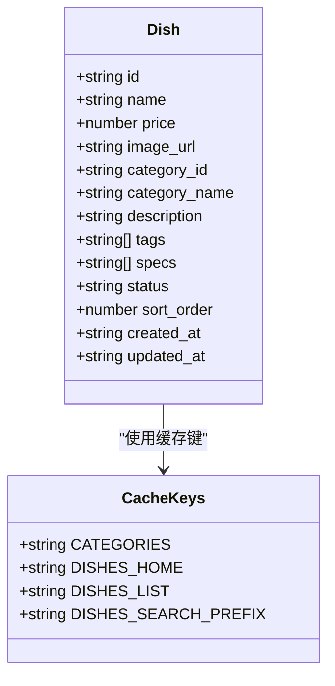
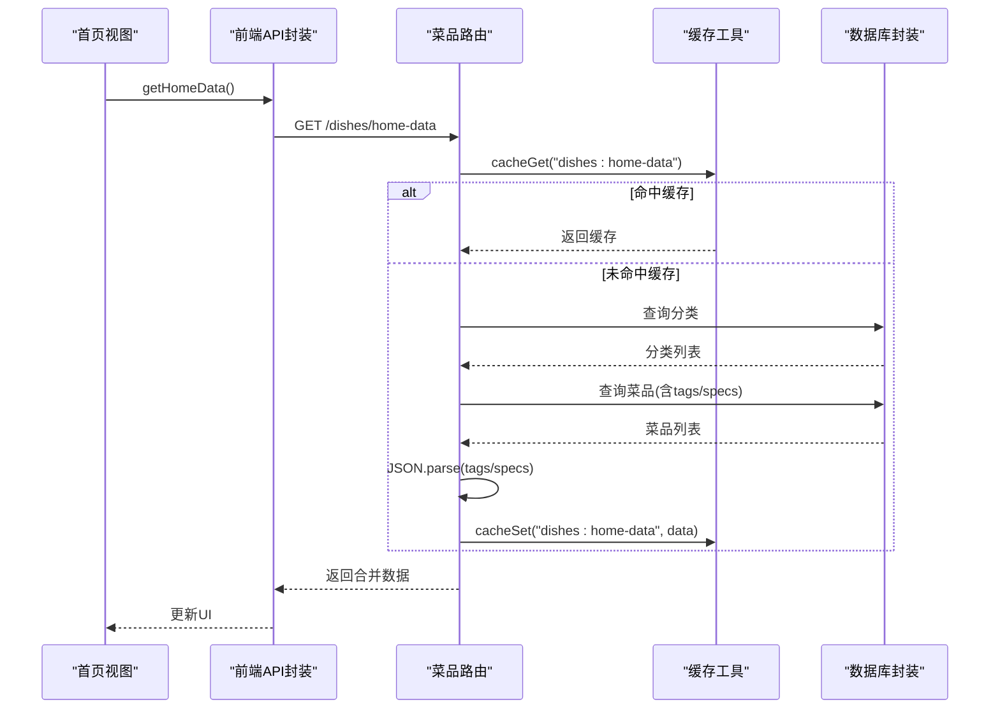
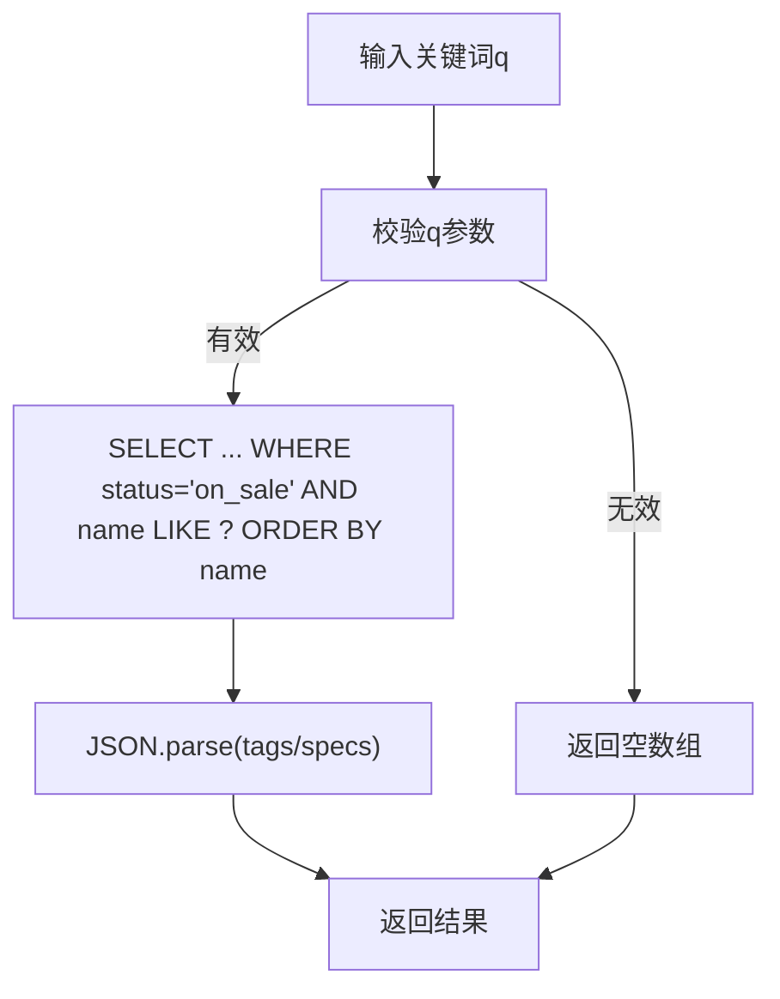
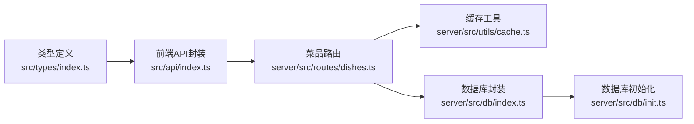

# 菜品管理API

<cite>
**本文档引用的文件**
- [server/src/routes/dishes.ts](file://server/src/routes/dishes.ts)
- [server/src/utils/cache.ts](file://server/src/utils/cache.ts)
- [server/src/db/index.ts](file://server/src/db/index.ts)
- [server/src/db/init.ts](file://server/src/db/init.ts)
- [server/src/index.ts](file://server/src/index.ts)
- [server/src/routes/index.ts](file://server/src/routes/index.ts)
- [src/api/index.ts](file://src/api/index.ts)
- [src/types/index.ts](file://src/types/index.ts)
- [src/client/views/HomeView.vue](file://src/client/views/HomeView.vue)
- [src/client/views/SearchView.vue](file://src/client/views/SearchView.vue)
- [src/client/views/DishDetailView.vue](file://src/client/views/DishDetailView.vue)
</cite>

## 目录
1. [简介](#简介)
2. [项目结构](#项目结构)
3. [核心组件](#核心组件)
4. [架构总览](#架构总览)
5. [详细组件分析](#详细组件分析)
6. [依赖关系分析](#依赖关系分析)
7. [性能考量](#性能考量)
8. [故障排查指南](#故障排查指南)
9. [结论](#结论)
10. [附录](#附录)

## 简介
本文件面向RLRMS菜品管理API的技术文档，聚焦于菜品模块的核心路由实现与RESTful设计原则的应用，涵盖以下主题：
- 菜品列表获取、首页数据合并、菜品搜索、分类查询、菜品详情获取等核心路由的实现细节
- GET请求参数处理、SQL查询优化、缓存策略实现
- 菜品数据结构设计，包括tags和specs字段的JSON解析机制
- 路由优先级设计（如/home-data必须在/:id之前定义）的重要性
- 菜品API扩展与性能优化最佳实践

## 项目结构
菜品模块位于服务端路由层，采用Express Router进行组织，并通过统一的API路由器挂载到主应用上。前端通过封装的API类发起请求，实现对菜品数据的获取与展示。

**图表来源**
- [server/src/index.ts:1-176](file://server/src/index.ts#L1-L176)
- [server/src/routes/index.ts:1-18](file://server/src/routes/index.ts#L1-L18)
- [server/src/routes/dishes.ts:1-216](file://server/src/routes/dishes.ts#L1-L216)
- [server/src/utils/cache.ts:1-73](file://server/src/utils/cache.ts#L1-L73)
- [server/src/db/index.ts:1-156](file://server/src/db/index.ts#L1-L156)
- [server/src/db/init.ts:1-204](file://server/src/db/init.ts#L1-L204)
- [src/api/index.ts:1-608](file://src/api/index.ts#L1-L608)
- [src/client/views/HomeView.vue:1-200](file://src/client/views/HomeView.vue#L1-L200)
- [src/client/views/SearchView.vue:1-200](file://src/client/views/SearchView.vue#L1-L200)
- [src/client/views/DishDetailView.vue:1-200](file://src/client/views/DishDetailView.vue#L1-L200)
- [src/types/index.ts:1-133](file://src/types/index.ts#L1-L133)

**章节来源**
- [server/src/index.ts:1-176](file://server/src/index.ts#L1-L176)
- [server/src/routes/index.ts:1-18](file://server/src/routes/index.ts#L1-L18)
- [server/src/routes/dishes.ts:1-216](file://server/src/routes/dishes.ts#L1-L216)
- [src/api/index.ts:1-608](file://src/api/index.ts#L1-L608)

## 核心组件
- 菜品路由模块：提供菜品列表、首页合并数据、搜索、分类、详情等接口，内置缓存与安全的JSON解析
- 缓存工具：基于Map的TTL内存缓存，支持键失效与批量失效
- 数据库封装：基于sql.js的轻量数据库操作，包含批处理与防抖落盘
- API封装：前端侧统一请求封装，包含超时控制、401处理、stale-while-revalidate缓存策略
- 类型定义：明确Dish、Category等数据模型，确保tags/specs为字符串数组

**章节来源**
- [server/src/routes/dishes.ts:1-216](file://server/src/routes/dishes.ts#L1-L216)
- [server/src/utils/cache.ts:1-73](file://server/src/utils/cache.ts#L1-L73)
- [server/src/db/index.ts:1-156](file://server/src/db/index.ts#L1-L156)
- [src/api/index.ts:1-608](file://src/api/index.ts#L1-L608)
- [src/types/index.ts:53-68](file://src/types/index.ts#L53-L68)

## 架构总览
菜品模块遵循RESTful设计原则，路径语义清晰，参数通过查询字符串传递；服务端通过Express Router分发请求，结合缓存与数据库封装实现高效读取；前端通过API封装统一发起请求并处理响应。

**图表来源**
- [src/client/views/HomeView.vue:68-89](file://src/client/views/HomeView.vue#L68-L89)
- [src/client/views/SearchView.vue:54-69](file://src/client/views/SearchView.vue#L54-L69)
- [src/client/views/DishDetailView.vue:38-50](file://src/client/views/DishDetailView.vue#L38-L50)
- [src/api/index.ts:128-171](file://src/api/index.ts#L128-L171)
- [server/src/routes/dishes.ts:24-65](file://server/src/routes/dishes.ts#L24-L65)
- [server/src/utils/cache.ts:18-36](file://server/src/utils/cache.ts#L18-L36)
- [server/src/db/index.ts:128-140](file://server/src/db/index.ts#L128-L140)

## 详细组件分析

### 路由优先级设计与冲突避免
- /home-data 必须在 /:id 之前定义，否则 /:id 会匹配到 /home-data 的路径，导致路由冲突
- 同样地，/search/query 和 /categories/all 也必须在 /:id 之前定义，以避免与动态ID路径混淆

**图表来源**
- [server/src/routes/dishes.ts:67-117](file://server/src/routes/dishes.ts#L67-L117)
- [server/src/routes/dishes.ts:119-174](file://server/src/routes/dishes.ts#L119-L174)
- [server/src/routes/dishes.ts:176-215](file://server/src/routes/dishes.ts#L176-L215)

**章节来源**
- [server/src/routes/dishes.ts:67-117](file://server/src/routes/dishes.ts#L67-L117)
- [server/src/routes/dishes.ts:119-174](file://server/src/routes/dishes.ts#L119-L174)
- [server/src/routes/dishes.ts:176-215](file://server/src/routes/dishes.ts#L176-L215)

### GET请求参数处理与SQL查询优化
- 列表查询支持category过滤，生成带分类维度的缓存键，避免跨分类污染
- 首页合并数据一次性拉取分类与菜品，减少往返次数
- 搜索接口使用LIKE进行名称模糊匹配，配合ORDER BY name
- 数据库层面建立多处索引（如idx_dishes_category_id、idx_dishes_status、idx_dishes_sort_order），显著降低查询成本

**图表来源**
- [server/src/routes/dishes.ts:24-65](file://server/src/routes/dishes.ts#L24-L65)
- [server/src/db/init.ts:124-137](file://server/src/db/init.ts#L124-L137)

**章节来源**
- [server/src/routes/dishes.ts:24-65](file://server/src/routes/dishes.ts#L24-L65)
- [server/src/db/init.ts:124-137](file://server/src/db/init.ts#L124-L137)

### 菜品数据结构设计与JSON解析机制
- Dish类型中tags与specs字段被定义为字符串数组，便于前端渲染标签与规格
- 服务端在返回菜品列表与搜索结果时，将存储为JSON字符串的tags/specs解析为数组
- 详情接口提供安全解析函数，避免异常JSON导致服务崩溃

**图表来源**
- [src/types/index.ts:53-68](file://src/types/index.ts#L53-L68)
- [server/src/utils/cache.ts:63-72](file://server/src/utils/cache.ts#L63-L72)
- [server/src/routes/dishes.ts:14-22](file://server/src/routes/dishes.ts#L14-L22)

**章节来源**
- [src/types/index.ts:53-68](file://src/types/index.ts#L53-L68)
- [server/src/routes/dishes.ts:14-22](file://server/src/routes/dishes.ts#L14-L22)
- [server/src/routes/dishes.ts:100-104](file://server/src/routes/dishes.ts#L100-L104)
- [server/src/routes/dishes.ts:146-150](file://server/src/routes/dishes.ts#L146-L150)
- [server/src/routes/dishes.ts:207-209](file://server/src/routes/dishes.ts#L207-L209)

### 首页数据合并接口（/home-data）
- 合并分类与菜品，一次性返回给前端，降低网络往返
- 对菜品tags/specs进行JSON解析，确保前端可直接渲染
- 使用TTL缓存，减少重复查询压力

**图表来源**
- [src/client/views/HomeView.vue:68-89](file://src/client/views/HomeView.vue#L68-L89)
- [src/api/index.ts:128-148](file://src/api/index.ts#L128-L148)
- [server/src/routes/dishes.ts:67-117](file://server/src/routes/dishes.ts#L67-L117)
- [server/src/utils/cache.ts:18-36](file://server/src/utils/cache.ts#L18-L36)
- [server/src/db/index.ts:128-140](file://server/src/db/index.ts#L128-L140)

**章节来源**
- [server/src/routes/dishes.ts:67-117](file://server/src/routes/dishes.ts#L67-L117)
- [src/api/index.ts:128-148](file://src/api/index.ts#L128-L148)
- [src/client/views/HomeView.vue:68-89](file://src/client/views/HomeView.vue#L68-L89)

### 菜品搜索接口（/search/query）
- 支持q查询参数，进行名称模糊匹配
- 返回菜品列表并解析tags/specs
- 前端实现搜索历史与防抖交互

**图表来源**
- [server/src/routes/dishes.ts:119-157](file://server/src/routes/dishes.ts#L119-L157)
- [src/client/views/SearchView.vue:54-69](file://src/client/views/SearchView.vue#L54-L69)

**章节来源**
- [server/src/routes/dishes.ts:119-157](file://server/src/routes/dishes.ts#L119-L157)
- [src/client/views/SearchView.vue:54-69](file://src/client/views/SearchView.vue#L54-L69)

### 分类查询接口（/categories/all）
- 返回全部分类并按sort_order排序
- 使用独立缓存键，避免与其他列表缓存混淆

**章节来源**
- [server/src/routes/dishes.ts:159-174](file://server/src/routes/dishes.ts#L159-L174)

### 菜品详情接口（/:id）
- 通过ID精确查询菜品，返回完整信息
- 安全解析tags/specs，避免异常JSON导致错误
- 详情接口需置于静态路由之后，避免与/home-data、/search/query等冲突

**章节来源**
- [server/src/routes/dishes.ts:176-215](file://server/src/routes/dishes.ts#L176-L215)

### 前端API封装与缓存策略
- 前端实现stale-while-revalidate策略：命中缓存立即返回，后台静默刷新
- 统一错误处理：401触发全局认证过期事件，非JSON响应进行防御式处理
- 请求超时与信号合并，支持可取消请求

**章节来源**
- [src/api/index.ts:1-608](file://src/api/index.ts#L1-L608)

## 依赖关系分析
- 路由层依赖缓存工具与数据库封装，负责业务逻辑与数据拼装
- 前端API封装依赖路由层，负责请求与响应处理
- 类型定义贯穿前后端，确保数据结构一致性

**图表来源**
- [src/types/index.ts:1-133](file://src/types/index.ts#L1-133)
- [src/api/index.ts:1-608](file://src/api/index.ts#L1-L608)
- [server/src/routes/dishes.ts:1-216](file://server/src/routes/dishes.ts#L1-L216)
- [server/src/utils/cache.ts:1-73](file://server/src/utils/cache.ts#L1-L73)
- [server/src/db/index.ts:1-156](file://server/src/db/index.ts#L1-L156)
- [server/src/db/init.ts:1-204](file://server/src/db/init.ts#L1-L204)

**章节来源**
- [server/src/routes/dishes.ts:1-216](file://server/src/routes/dishes.ts#L1-L216)
- [src/api/index.ts:1-608](file://src/api/index.ts#L1-L608)
- [src/types/index.ts:1-133](file://src/types/index.ts#L1-L133)

## 性能考量
- 缓存策略
  - TTL内存缓存：分类、菜品列表、首页合并数据均设置短TTL，兼顾新鲜度与性能
  - 前端stale-while-revalidate：提升首屏速度，后台静默刷新
- 数据库优化
  - 多处索引覆盖常见查询条件，减少全表扫描
  - 批处理写入与防抖落盘，降低I/O频率
- 网络优化
  - 首页合并接口减少往返
  - 压缩中间件与静态资源缓存策略
- 前端体验
  - 搜索历史与输入防抖
  - 滚动位置记忆与分类高亮

**章节来源**
- [server/src/utils/cache.ts:1-73](file://server/src/utils/cache.ts#L1-L73)
- [src/api/index.ts:128-148](file://src/api/index.ts#L128-L148)
- [server/src/db/init.ts:124-137](file://server/src/db/init.ts#L124-L137)
- [server/src/db/index.ts:36-60](file://server/src/db/index.ts#L36-L60)
- [src/client/views/SearchView.vue:23-37](file://src/client/views/SearchView.vue#L23-L37)
- [src/client/views/HomeView.vue:91-159](file://src/client/views/HomeView.vue#L91-L159)

## 故障排查指南
- 路由404或路径冲突
  - 确认/home-data、/search/query、/categories/all在/:id之前定义
- JSON解析错误
  - tags/specs字段为空或格式异常时，服务端与前端均有安全解析兜底
- 缓存命中异常
  - 检查缓存键是否正确，TTL是否过期
- 数据库初始化问题
  - 服务启动时若数据库未就绪，会返回503提示“数据库初始化中”
- 前端401处理
  - 自动触发认证过期事件，引导用户重新登录

**章节来源**
- [server/src/routes/dishes.ts:67-117](file://server/src/routes/dishes.ts#L67-L117)
- [server/src/routes/dishes.ts:14-22](file://server/src/routes/dishes.ts#L14-L22)
- [server/src/routes/dishes.ts:207-209](file://server/src/routes/dishes.ts#L207-L209)
- [server/src/index.ts:69-79](file://server/src/index.ts#L69-L79)
- [src/api/index.ts:94-114](file://src/api/index.ts#L94-L114)

## 结论
菜品管理API通过清晰的RESTful路由设计、完善的缓存与数据库优化、以及前后端一致的类型约束，实现了高性能与易维护性的平衡。遵循路由优先级与JSON解析安全策略，能够稳定支撑首页、搜索、详情等核心场景，并为后续扩展提供了良好的基础。

## 附录
- 最佳实践建议
  - 新增接口时，严格遵循路由优先级与参数命名规范
  - 对热点数据使用TTL缓存，结合前端stale-while-revalidate提升体验
  - 保持数据库索引与查询计划同步演进
  - 在新增字段时，确保前后端类型定义一致，避免运行时解析异常