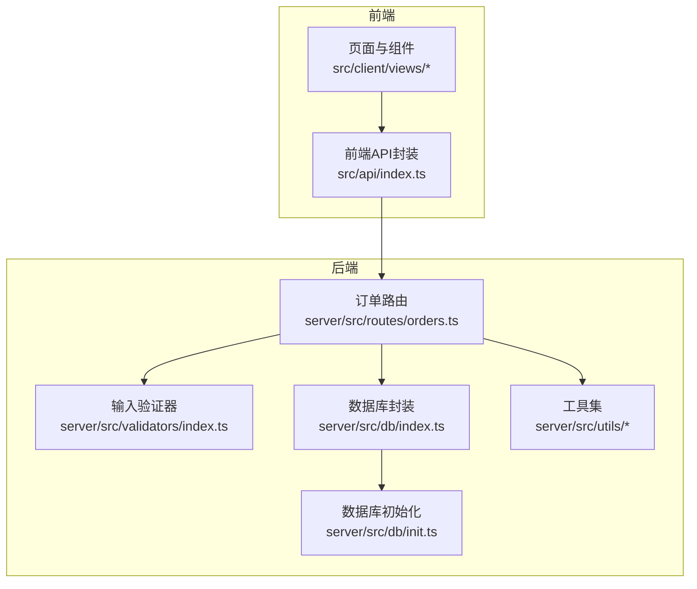
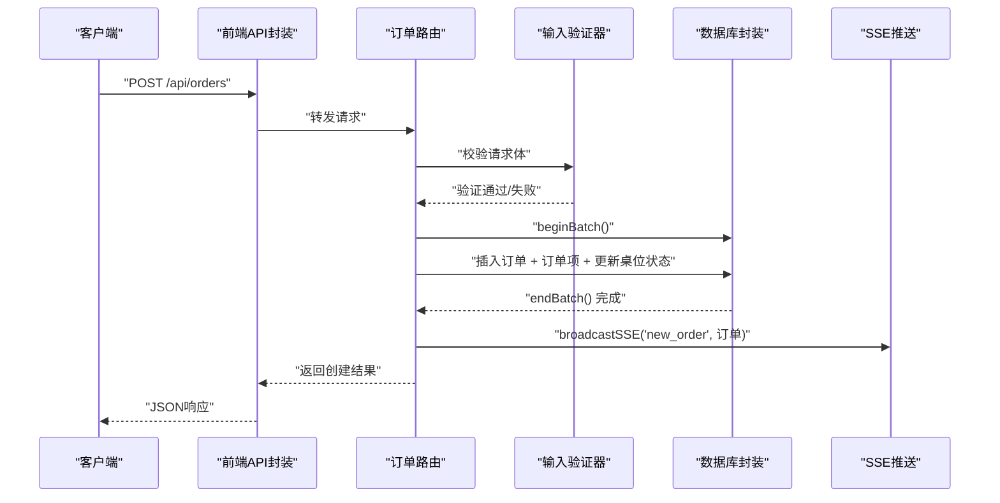
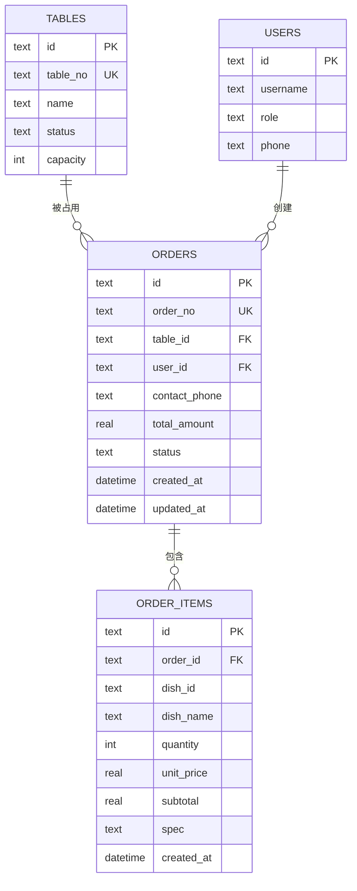
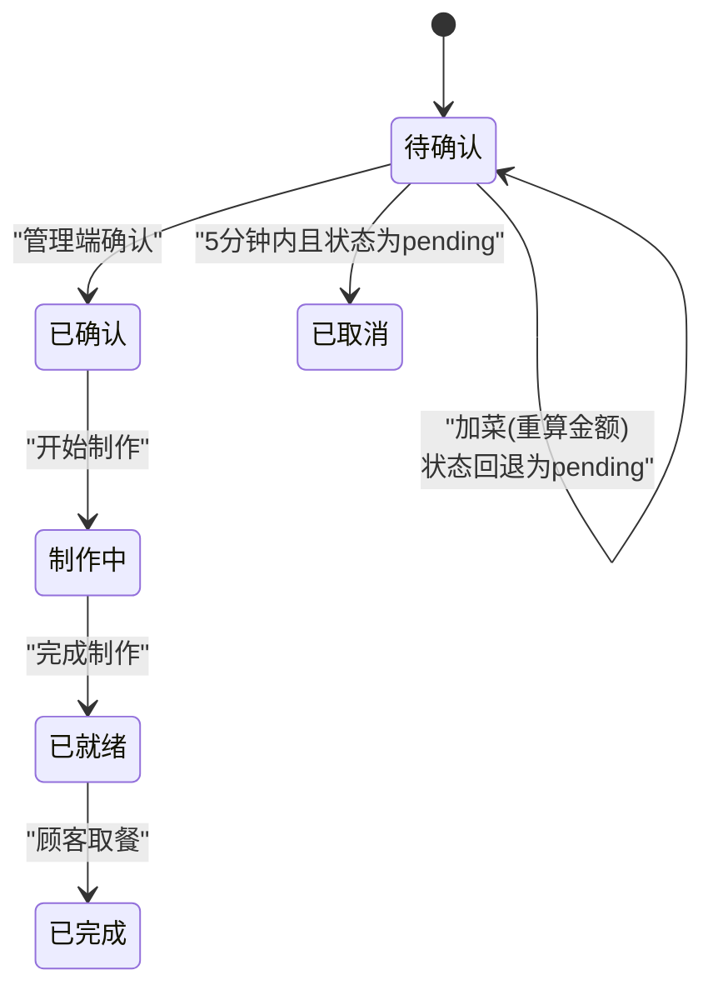
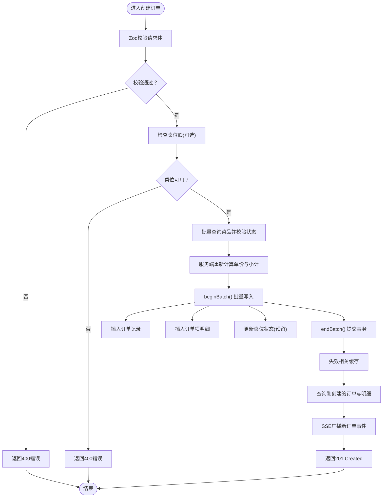
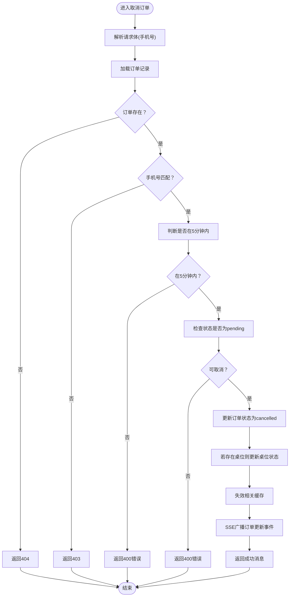
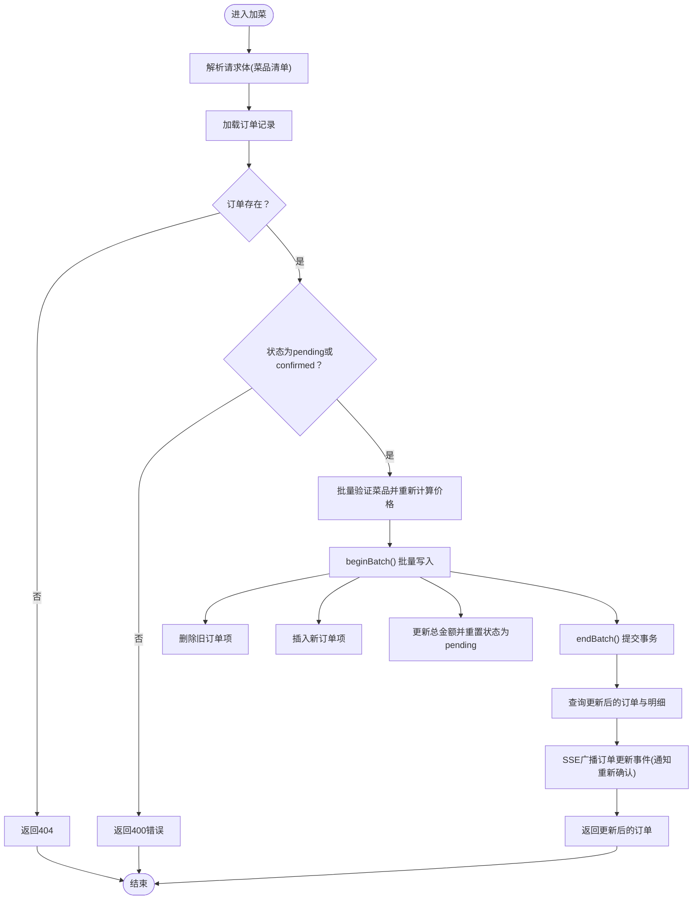
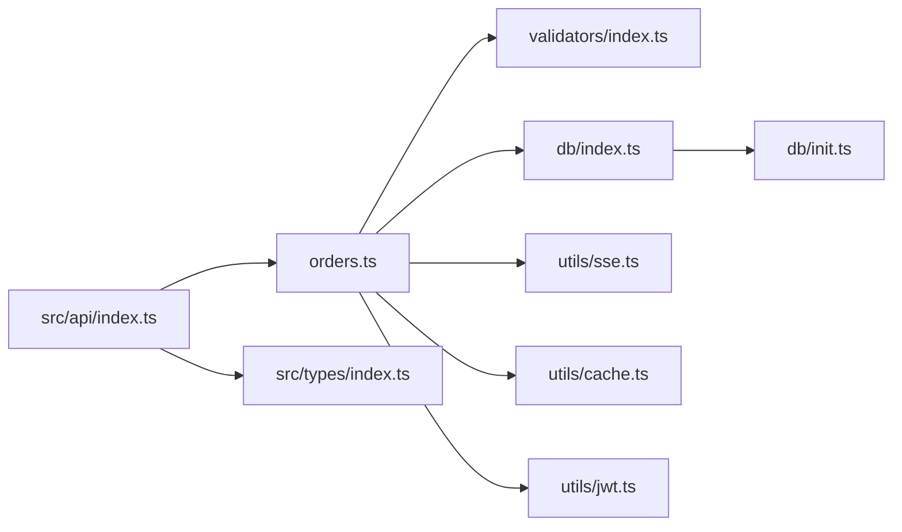

# 订单处理API

<cite>
**本文引用的文件**
- [orders.ts](file://server/src/routes/orders.ts)
- [index.ts（路由聚合）](file://server/src/routes/index.ts)
- [index.ts（数据库封装）](file://server/src/db/index.ts)
- [init.ts（数据库初始化）](file://server/src/db/init.ts)
- [index.ts（验证器）](file://server/src/validators/index.ts)
- [sse.ts（SSE工具）](file://server/src/utils/sse.ts)
- [cache.ts（缓存工具）](file://server/src/utils/cache.ts)
- [format.ts（时间格式化）](file://server/src/utils/format.ts)
- [jwt.ts（JWT密钥）](file://server/src/utils/jwt.ts)
- [index.ts（前端API封装）](file://src/api/index.ts)
- [index.ts（类型定义）](file://src/types/index.ts)
- [cart.ts（购物车存储）](file://src/stores/cart.ts)
- [useOrderPolling.ts（轮询组合式函数）](file://src/shared/composables/useOrderPolling.ts)
</cite>

## 目录
1. [简介](#简介)
2. [项目结构](#项目结构)
3. [核心组件](#核心组件)
4. [架构概览](#架构概览)
5. [详细组件分析](#详细组件分析)
6. [依赖关系分析](#依赖关系分析)
7. [性能考量](#性能考量)
8. [故障排查指南](#故障排查指南)
9. [结论](#结论)
10. [附录](#附录)

## 简介
本文件面向RLRMS餐厅点餐系统的订单处理API，围绕“订单创建、订单查询、订单状态更新、订单取消”等核心路由进行深入技术解析。文档重点阐述：
- RESTful API设计原则在订单模块的应用
- 订单状态流转与业务规则
- 订单主表与订单项明细表的数据模型关系
- 订单状态枚举值（pending、confirmed、preparing、ready、completed、cancelled）的业务含义与约束
- 订单API扩展与状态同步的最佳实践，包含与SSE实时推送系统的集成方案

## 项目结构
订单处理API位于后端Express路由层，采用分层架构：
- 路由层：定义HTTP端点与业务流程控制
- 数据访问层：封装SQL.js数据库操作与批量事务
- 工具层：JWT鉴权、SSE推送、缓存、时间格式化
- 类型层：前后端统一的TypeScript类型定义
- 前端调用层：统一的API封装与错误处理

图表来源
- [orders.ts:1-552](file://server/src/routes/orders.ts#L1-L552)
- [index.ts（路由聚合）:1-18](file://server/src/routes/index.ts#L1-L18)
- [index.ts（数据库封装）:1-156](file://server/src/db/index.ts#L1-L156)
- [init.ts（数据库初始化）:1-204](file://server/src/db/init.ts#L1-L204)
- [index.ts（验证器）:1-123](file://server/src/validators/index.ts#L1-L123)
- [index.ts（前端API封装）:1-608](file://src/api/index.ts#L1-L608)

章节来源
- [index.ts（路由聚合）:1-18](file://server/src/routes/index.ts#L1-L18)

## 核心组件
- 订单路由控制器：提供订单创建、查询、取消、加菜等REST端点，内置客户端身份验证中间件与输入验证
- 数据库封装：基于SQL.js，提供批量事务(beginBatch/endBatch)、防抖落盘、索引优化
- 输入验证器：使用Zod对订单创建、取消、加菜等请求体进行严格校验
- SSE推送：向管理端实时广播订单事件，支持客户端连接管理与事件广播
- 缓存工具：提供TTL内存缓存，用于不频繁变化的数据（如桌位可用列表）
- 时间格式化：统一输出ISO时间字符串，便于前端展示
- 前端API封装：统一的请求封装、超时控制、401处理、缓存策略

章节来源
- [orders.ts:1-552](file://server/src/routes/orders.ts#L1-L552)
- [index.ts（数据库封装）:1-156](file://server/src/db/index.ts#L1-L156)
- [index.ts（验证器）:1-123](file://server/src/validators/index.ts#L1-L123)
- [sse.ts（SSE工具）:1-59](file://server/src/utils/sse.ts#L1-L59)
- [cache.ts（缓存工具）:1-73](file://server/src/utils/cache.ts#L1-L73)
- [format.ts（时间格式化）:1-12](file://server/src/utils/format.ts#L1-L12)
- [index.ts（前端API封装）:1-608](file://src/api/index.ts#L1-L608)

## 架构概览
订单模块遵循RESTful设计，结合业务规则与数据一致性保障：
- 客户端通过cookie携带的JWT令牌进行身份验证，后端校验用户存在性与角色
- 订单创建时进行菜品存在性与售卖状态校验，服务端重新计算单价与小计，防止客户端篡改
- 所有写操作使用批量事务，确保订单与订单项的一致性
- 桌位占用与预留状态在创建与取消订单时联动更新
- SSE广播新订单与状态变更事件，管理端可实时接收

图表来源
- [orders.ts:194-353](file://server/src/routes/orders.ts#L194-L353)
- [index.ts（验证器）:6-19](file://server/src/validators/index.ts#L6-L19)
- [index.ts（数据库封装）:46-73](file://server/src/db/index.ts#L46-L73)
- [sse.ts（SSE工具）:37-51](file://server/src/utils/sse.ts#L37-L51)
- [index.ts（前端API封装）:186-205](file://src/api/index.ts#L186-L205)

## 详细组件分析

### 订单路由与REST设计
- GET /orders：按联系人手机号查询客户历史订单，返回订单列表及对应菜品明细；采用N+1避免策略，先查订单再批量查询订单项
- GET /orders/:id：按订单ID查询详情，返回订单与菜品明细
- POST /orders：创建新订单，要求客户端登录并通过手机号验证；校验桌位占用与重复下单；服务端批量验证菜品并重新计算价格；插入订单与订单项；更新桌位状态；SSE广播新订单事件
- POST /orders/verify：批量验证订单ID是否存在，用于清理“幽灵订单”
- POST /orders/:id/cancel：取消订单，要求手机号与订单匹配且在5分钟内、状态为pending
- PUT /orders/:id/items：加菜（增删改混合），仅pending或confirmed状态允许；服务端重新验证菜品并计算总价，重置状态为pending

章节来源
- [orders.ts:62-135](file://server/src/routes/orders.ts#L62-L135)
- [orders.ts:157-191](file://server/src/routes/orders.ts#L157-L191)
- [orders.ts:194-353](file://server/src/routes/orders.ts#L194-L353)
- [orders.ts:139-154](file://server/src/routes/orders.ts#L139-L154)
- [orders.ts:356-418](file://server/src/routes/orders.ts#L356-L418)
- [orders.ts:421-552](file://server/src/routes/orders.ts#L421-L552)

### 客户端身份验证中间件
- 从cookie读取client_token，使用JWT_SECRET解码并校验用户存在性与角色(customer)
- 将用户标识注入请求上下文，供后续路由使用
- 异常场景返回401并提示重新登录

章节来源
- [orders.ts:24-49](file://server/src/routes/orders.ts#L24-L49)
- [jwt.ts（JWT密钥）:1-27](file://server/src/utils/jwt.ts#L1-L27)

### 输入验证与数据模型
- 订单创建：校验桌位ID、用餐时段、联系人姓名与手机号、菜品清单（含数量、规格等）
- 取消订单：校验手机号
- 加菜：复用订单创建的items结构
- 类型定义：Order与OrderItem包含完整字段，状态枚举为'pending'、'confirmed'、'completed'、'cancelled'

章节来源
- [index.ts（验证器）:6-19](file://server/src/validators/index.ts#L6-L19)
- [index.ts（验证器）:78-81](file://server/src/validators/index.ts#L78-L81)
- [index.ts（验证器）:84-93](file://server/src/validators/index.ts#L84-L93)
- [index.ts（类型定义）:82-97](file://src/types/index.ts#L82-L97)

### 数据模型与关系
- 订单主表：包含订单号、桌位ID、用户ID、联系方式、总金额、状态、时间戳等
- 订单项明细表：记录每道菜的ID、名称、数量、单价、小计与规格
- 关系：一对多（订单-订单项），外键约束保证数据完整性
- 索引：为订单状态、手机号、桌位ID、创建时间等建立索引，提升查询性能

图表来源
- [init.ts（数据库初始化）:64-95](file://server/src/db/init.ts#L64-L95)
- [init.ts（数据库初始化）:124-137](file://server/src/db/init.ts#L124-L137)
- [index.ts（类型定义）:82-97](file://src/types/index.ts#L82-L97)

### 订单状态流转与业务规则
- pending：待确认（初始状态，可加菜/取消）
- confirmed：已确认（进入准备阶段）
- preparing：制作中
- ready：已就绪
- completed：已完成
- cancelled：已取消（仅pending且5分钟内有效）

图表来源
- [orders.ts:356-418](file://server/src/routes/orders.ts#L356-L418)
- [orders.ts:421-552](file://server/src/routes/orders.ts#L421-L552)
- [index.ts（类型定义）:93-93](file://src/types/index.ts#L93-L93)

### 订单创建流程（含价格校验与批量写入）

图表来源
- [orders.ts:194-353](file://server/src/routes/orders.ts#L194-L353)
- [index.ts（验证器）:6-19](file://server/src/validators/index.ts#L6-L19)
- [index.ts（数据库封装）:46-73](file://server/src/db/index.ts#L46-L73)
- [cache.ts（缓存工具）:41-43](file://server/src/utils/cache.ts#L41-L43)
- [sse.ts（SSE工具）:37-51](file://server/src/utils/sse.ts#L37-L51)

### 订单取消流程（5分钟窗口与状态限制）

图表来源
- [orders.ts:356-418](file://server/src/routes/orders.ts#L356-L418)
- [cache.ts（缓存工具）:41-43](file://server/src/utils/cache.ts#L41-L43)
- [sse.ts（SSE工具）:37-51](file://server/src/utils/sse.ts#L37-L51)

### 加菜流程（增删改混合与状态回退）

图表来源
- [orders.ts:421-552](file://server/src/routes/orders.ts#L421-L552)
- [index.ts（验证器）:84-93](file://server/src/validators/index.ts#L84-L93)
- [index.ts（数据库封装）:46-73](file://server/src/db/index.ts#L46-L73)
- [sse.ts（SSE工具）:37-51](file://server/src/utils/sse.ts#L37-L51)

### 前端调用与轮询策略
- 前端通过统一API封装发起请求，自动携带凭据与超时控制
- 订单列表页可结合SSE与轮询：当SSE连接可用时优先使用SSE，否则启用定时轮询检测新增订单
- 购物车存储在IndexedDB中，支持持久化与恢复

章节来源
- [index.ts（前端API封装）:1-608](file://src/api/index.ts#L1-L608)
- [useOrderPolling.ts（轮询组合式函数）:1-74](file://src/shared/composables/useOrderPolling.ts#L1-L74)
- [cart.ts（购物车存储）:1-183](file://src/stores/cart.ts#L1-L183)

## 依赖关系分析
- 订单路由依赖输入验证器、数据库封装、SSE工具、缓存工具与JWT密钥
- 数据库封装依赖SQL.js与文件系统，提供批量事务与防抖落盘
- 前端API封装依赖后端路由，提供统一错误处理与缓存策略

图表来源
- [orders.ts:1-10](file://server/src/routes/orders.ts#L1-L10)
- [index.ts（验证器）:1-123](file://server/src/validators/index.ts#L1-L123)
- [index.ts（数据库封装）:1-156](file://server/src/db/index.ts#L1-L156)
- [init.ts（数据库初始化）:1-204](file://server/src/db/init.ts#L1-L204)
- [sse.ts（SSE工具）:1-59](file://server/src/utils/sse.ts#L1-L59)
- [cache.ts（缓存工具）:1-73](file://server/src/utils/cache.ts#L1-L73)
- [jwt.ts（JWT密钥）:1-27](file://server/src/utils/jwt.ts#L1-L27)
- [index.ts（前端API封装）:1-608](file://src/api/index.ts#L1-L608)
- [index.ts（类型定义）:1-133](file://src/types/index.ts#L1-L133)

## 性能考量
- 批量事务与防抖落盘：通过beginBatch/endBatch减少磁盘IO次数，saveDebounceMs降低写放大
- N+1查询避免：查询订单列表时先获取订单ID集合，再一次性批量查询订单项
- 索引优化：为订单状态、手机号、桌位ID、创建时间等建立索引，加速查询
- 缓存策略：对不频繁变化的数据使用TTL内存缓存，减少重复查询
- SSE连接池：集中管理客户端连接，避免并发写入导致的资源竞争

章节来源
- [index.ts（数据库封装）:46-73](file://server/src/db/index.ts#L46-L73)
- [orders.ts:96-128](file://server/src/routes/orders.ts#L96-L128)
- [init.ts（数据库初始化）:124-137](file://server/src/db/init.ts#L124-L137)
- [cache.ts（缓存工具）:1-73](file://server/src/utils/cache.ts#L1-L73)
- [sse.ts（SSE工具）:1-59](file://server/src/utils/sse.ts#L1-L59)

## 故障排查指南
- 401未授权：检查client_token是否存在、是否过期、用户是否仍存在于数据库
- 400参数错误：核对请求体是否符合Zod校验规则（手机号格式、菜品ID、数量等）
- 404订单不存在：确认订单ID正确，或使用verify接口确认ID有效性
- 403手机号不匹配：确认取消请求中的手机号与订单记录一致
- 500服务器错误：查看后端日志，关注数据库事务与SSE广播异常
- SSE无推送：检查SSE客户端连接数与写入状态，必要时重建连接

章节来源
- [orders.ts:24-49](file://server/src/routes/orders.ts#L24-L49)
- [orders.ts:196-203](file://server/src/routes/orders.ts#L196-L203)
- [orders.ts:369-372](file://server/src/routes/orders.ts#L369-L372)
- [orders.ts:375-381](file://server/src/routes/orders.ts#L375-L381)
- [orders.ts:383-393](file://server/src/routes/orders.ts#L383-L393)
- [sse.ts（SSE工具）:37-51](file://server/src/utils/sse.ts#L37-L51)

## 结论
订单处理API在设计上遵循RESTful原则，结合严格的输入验证、批量事务与SSE实时推送，实现了高可靠与低延迟的订单生命周期管理。通过明确的状态流转与业务规则，系统能够有效防止竞态与数据不一致。建议在生产环境中进一步完善审计日志、幂等性保障与更细粒度的权限控制。

## 附录

### 订单状态枚举与业务语义
- pending：待确认，允许加菜与取消
- confirmed：已确认，进入准备流程
- preparing：制作中
- ready：已就绪
- completed：已完成
- cancelled：已取消（仅pending且5分钟内有效）

章节来源
- [index.ts（类型定义）:93-93](file://src/types/index.ts#L93-L93)
- [orders.ts:356-418](file://server/src/routes/orders.ts#L356-L418)
- [orders.ts:421-552](file://server/src/routes/orders.ts#L421-L552)

### 订单API扩展与状态同步最佳实践
- SSE集成：管理端监听SSE事件，根据事件类型更新UI；客户端在SSE可用时优先使用SSE，否则降级为轮询
- 轮询策略：使用组合式函数控制轮询启停，避免页面隐藏时的无效请求
- 幂等性：对重复提交进行去重处理（如订单号唯一性）
- 审计日志：记录关键状态变更与异常事件，便于追踪与回溯

章节来源
- [useOrderPolling.ts（轮询组合式函数）:1-74](file://src/shared/composables/useOrderPolling.ts#L1-L74)
- [index.ts（前端API封装）:1-608](file://src/api/index.ts#L1-L608)
- [sse.ts（SSE工具）:1-59](file://server/src/utils/sse.ts#L1-L59)