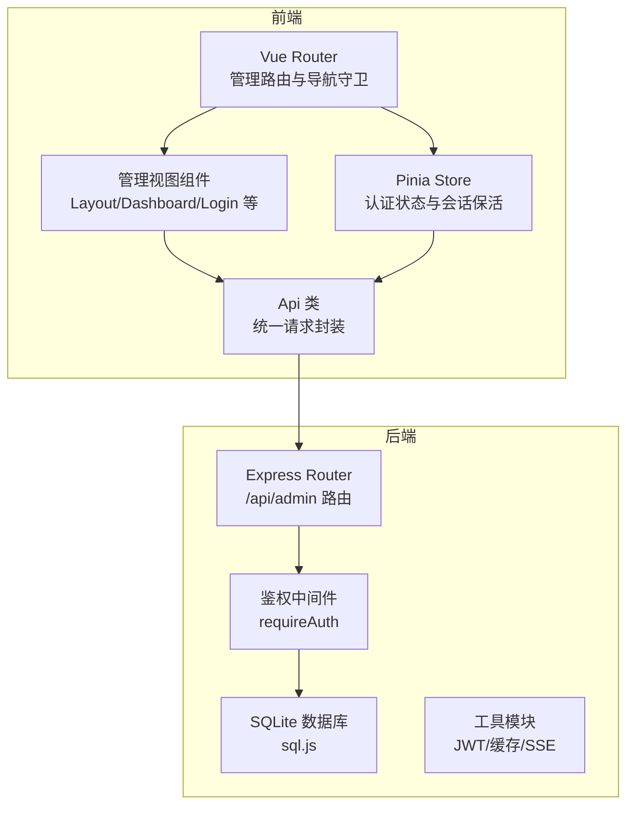
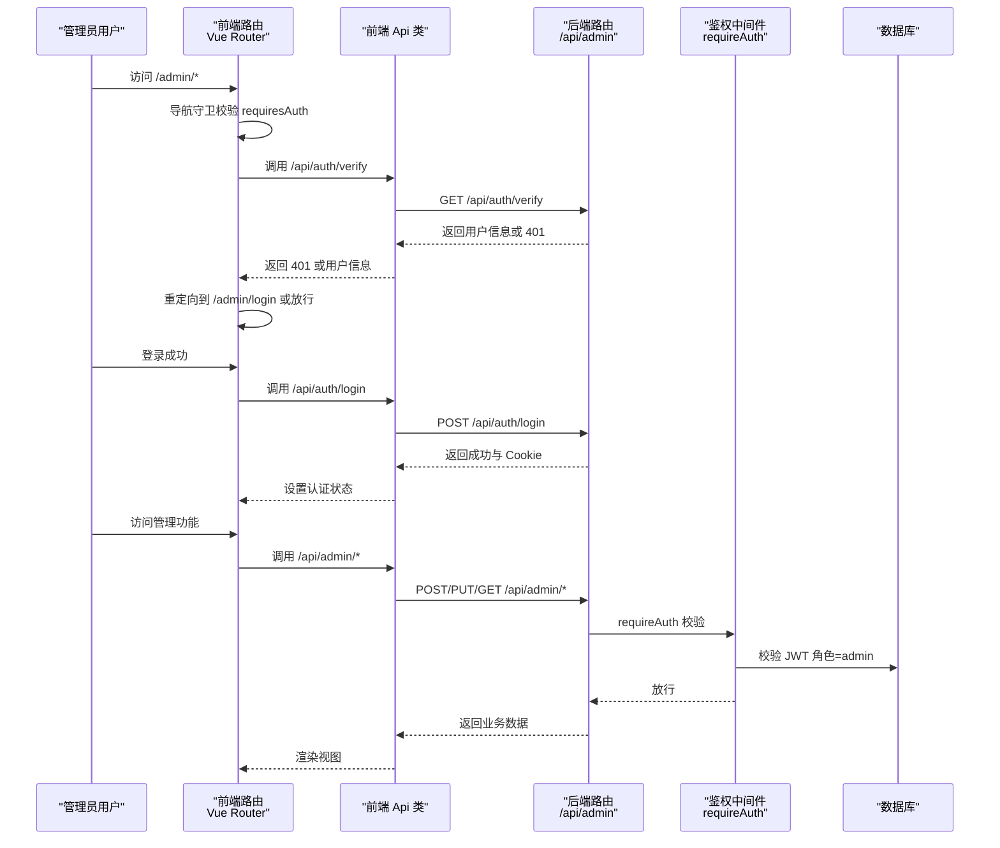
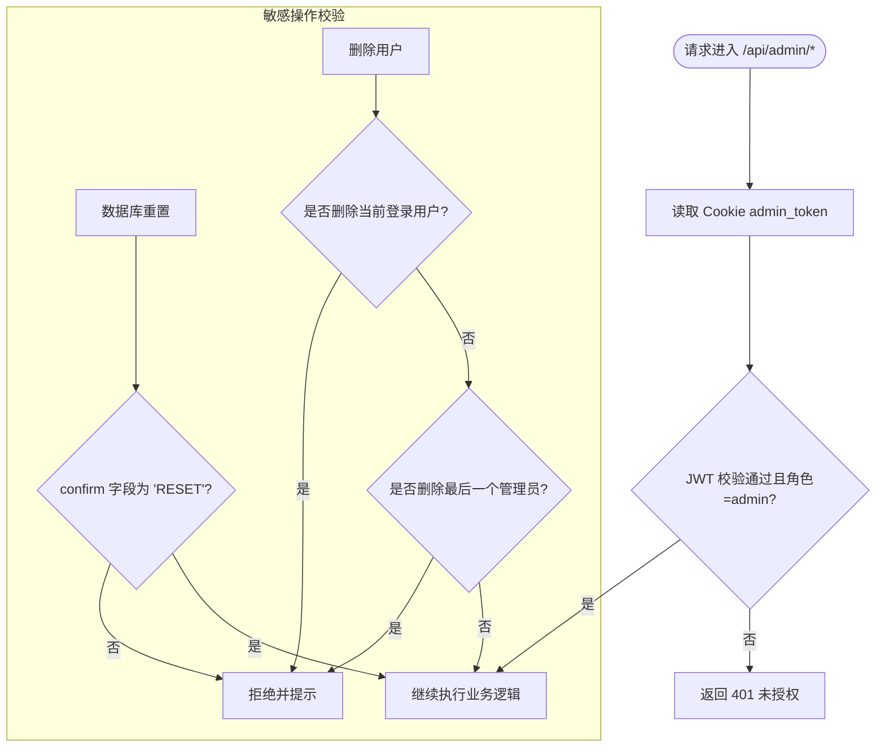
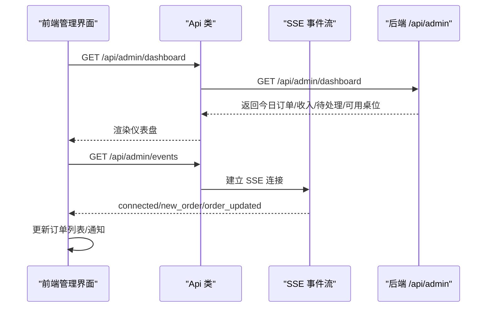
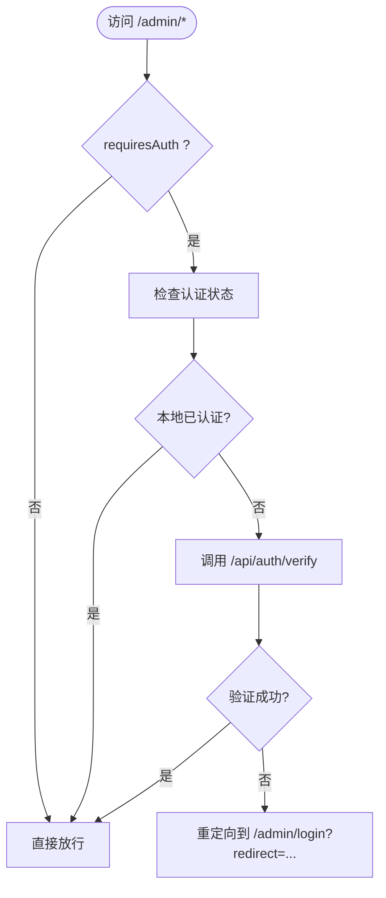
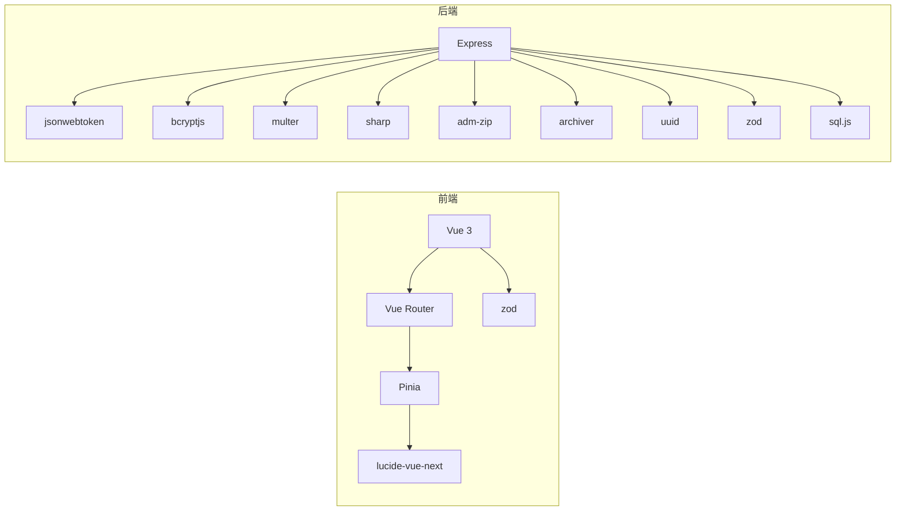

# 管理端路由

<cite>
**本文引用的文件**
- [server/src/routes/admin.ts](file://server/src/routes/admin.ts)
- [server/src/routes/index.ts](file://server/src/routes/index.ts)
- [src/router/index.ts](file://src/router/index.ts)
- [src/admin/views/LayoutView.vue](file://src/admin/views/LayoutView.vue)
- [src/admin/views/LoginView.vue](file://src/admin/views/LoginView.vue)
- [src/admin/views/DashboardView.vue](file://src/admin/views/DashboardView.vue)
- [src/api/index.ts](file://src/api/index.ts)
- [src/stores/auth.ts](file://src/stores/auth.ts)
- [server/src/utils/jwt.ts](file://server/src/utils/jwt.ts)
</cite>

## 目录
1. [简介](#简介)
2. [项目结构](#项目结构)
3. [核心组件](#核心组件)
4. [架构总览](#架构总览)
5. [详细组件分析](#详细组件分析)
6. [依赖分析](#依赖分析)
7. [性能考量](#性能考量)
8. [故障排查指南](#故障排查指南)
9. [结论](#结论)

## 简介
本文件聚焦于 RLRMS 管理端路由与权限体系的完整技术文档，围绕管理后台专用路由的设计与实现进行深入解析。内容涵盖：
- 管理功能的路由组织：数据管理、系统设置、用户管理等模块
- 权限控制机制：管理员身份验证、操作权限检查、敏感数据保护
- 管理端特有的 API 设计：批量操作、数据导入导出、系统配置
- 安全考虑与扩展指导

## 项目结构
管理端路由采用前后端分离架构：
- 前端使用 Vue Router 管理管理后台页面路由与导航守卫
- 后端使用 Express Router 提供 RESTful 管理 API，并内置中间件进行鉴权
- 前端通过统一的 Api 类封装调用，后端通过 Cookie 持久化会话

图表来源
- [src/router/index.ts:94-176](file://src/router/index.ts#L94-L176)
- [server/src/routes/index.ts:16-18](file://server/src/routes/index.ts#L16-L18)
- [server/src/routes/admin.ts:115-131](file://server/src/routes/admin.ts#L115-L131)

章节来源
- [src/router/index.ts:94-176](file://src/router/index.ts#L94-L176)
- [server/src/routes/index.ts:16-18](file://server/src/routes/index.ts#L16-L18)

## 核心组件
- 管理路由注册：后端将管理 API 路由挂载至 /api/admin 前缀，前端通过 /api/admin/* 调用
- 鉴权中间件：requireAuth 校验 Cookie 中的 admin_token，要求角色为 admin
- 前端路由守卫：对 /admin* 路由进行登录态校验与重定向
- SSE 实时推送：管理后台通过 Server-Sent Events 实时接收订单状态变更
- 数据导入导出：支持 ZIP 包含多表数据与图片资源的导入导出

章节来源
- [server/src/routes/admin.ts:115-131](file://server/src/routes/admin.ts#L115-L131)
- [src/router/index.ts:201-277](file://src/router/index.ts#L201-L277)
- [src/api/index.ts:288-595](file://src/api/index.ts#L288-L595)

## 架构总览
管理端路由与权限控制的整体流程如下：

图表来源
- [src/router/index.ts:201-277](file://src/router/index.ts#L201-L277)
- [src/api/index.ts:245-261](file://src/api/index.ts#L245-L261)
- [server/src/routes/admin.ts:115-131](file://server/src/routes/admin.ts#L115-L131)

## 详细组件分析

### 管理路由组织与模块划分
管理端路由按功能模块组织，覆盖数据管理、系统设置、用户管理、调试工具等：
- 桌位管理：GET /admin/tables、POST/PUT/DELETE /admin/tables/*
- 菜品管理：GET /admin/dishes、POST/PUT/DELETE /admin/dishes/*、批量排序 /admin/dishes/reorder
- 分类管理：GET /admin/categories、POST/PUT/DELETE /admin/categories/*、批量排序 /admin/categories/reorder
- 订单管理：GET /admin/orders、GET /admin/orders/search、PUT /admin/orders/:id/status、DELETE /admin/orders/:id
- 库存管理：GET /admin/inventory、POST/PUT/DELETE /admin/inventory/*、批量排序 /admin/inventory/reorder
- 用户管理：GET /admin/users、POST/PUT/DELETE /admin/users/*
- 系统设置：GET /admin/settings、PUT /admin/settings
- 数据管理：POST /admin/reset-database、POST /admin/clear-orders、POST /admin/import、GET /admin/export
- 媒体与图片：POST /admin/upload、DELETE /admin/image
- 实时推送：GET /admin/events（SSE）
- 调试工具：POST /admin/debug/query、GET /admin/debug/schema

章节来源
- [server/src/routes/admin.ts:164-219](file://server/src/routes/admin.ts#L164-L219)
- [server/src/routes/admin.ts:221-337](file://server/src/routes/admin.ts#L221-L337)
- [server/src/routes/admin.ts:339-546](file://server/src/routes/admin.ts#L339-L546)
- [server/src/routes/admin.ts:548-639](file://server/src/routes/admin.ts#L548-L639)
- [server/src/routes/admin.ts:641-872](file://server/src/routes/admin.ts#L641-L872)
- [server/src/routes/admin.ts:874-991](file://server/src/routes/admin.ts#L874-L991)
- [server/src/routes/admin.ts:993-1141](file://server/src/routes/admin.ts#L993-L1141)
- [server/src/routes/admin.ts:1143-1242](file://server/src/routes/admin.ts#L1143-L1242)
- [server/src/routes/admin.ts:1261-1356](file://server/src/routes/admin.ts#L1261-L1356)
- [server/src/routes/admin.ts:1358-1782](file://server/src/routes/admin.ts#L1358-L1782)
- [server/src/routes/admin.ts:1784-1887](file://server/src/routes/admin.ts#L1784-L1887)

### 权限控制机制
- 管理员身份验证：requireAuth 中间件从 Cookie 读取 admin_token，使用 JWT_SECRET 验证签名，要求角色为 admin
- 前端会话保活：Pinia Store 维护用户状态与过期时间，定时调用 /api/auth/verify 保持登录态
- 敏感操作二次确认：数据库重置需携带 confirm: "RESET" 字段
- 主管理员保护：禁止编辑/删除主管理员账户，禁止删除最后一个管理员账户
- 文件安全：上传与删除图片均进行路径穿越与类型校验，确保安全性

图表来源
- [server/src/routes/admin.ts:115-131](file://server/src/routes/admin.ts#L115-L131)
- [server/src/utils/jwt.ts:20-26](file://server/src/utils/jwt.ts#L20-L26)
- [src/stores/auth.ts:37-55](file://src/stores/auth.ts#L37-L55)
- [server/src/routes/admin.ts:1183-1192](file://server/src/routes/admin.ts#L1183-L1192)
- [server/src/routes/admin.ts:1120-1133](file://server/src/routes/admin.ts#L1120-L1133)

章节来源
- [server/src/routes/admin.ts:115-131](file://server/src/routes/admin.ts#L115-L131)
- [server/src/utils/jwt.ts:20-26](file://server/src/utils/jwt.ts#L20-L26)
- [src/stores/auth.ts:37-55](file://src/stores/auth.ts#L37-L55)
- [server/src/routes/admin.ts:1183-1192](file://server/src/routes/admin.ts#L1183-L1192)
- [server/src/routes/admin.ts:1120-1133](file://server/src/routes/admin.ts#L1120-L1133)

### 管理端 API 设计要点
- 批量操作：支持批量排序（菜品、分类、库存），批量删除订单，批量更新设置
- 数据导入导出：ZIP 包含 manifest.json 与各表 JSON 数据，以及 sources 目录下的图片资源；导入时按外键顺序清空并重建
- 实时推送：SSE 连接 /api/admin/events，支持心跳与断线重连，前端监听 new_order、order_updated 等事件
- 图片处理：上传后自动压缩、缩放、转 WebP，删除时检测是否被菜品使用
- 订单搜索：支持按订单号模糊搜索，避免 N+1 查询问题

图表来源
- [src/admin/views/DashboardView.vue:302-446](file://src/admin/views/DashboardView.vue#L302-L446)
- [src/api/index.ts:288-291](file://src/api/index.ts#L288-L291)
- [server/src/routes/admin.ts:134-162](file://server/src/routes/admin.ts#L134-L162)

章节来源
- [src/admin/views/DashboardView.vue:302-446](file://src/admin/views/DashboardView.vue#L302-L446)
- [src/api/index.ts:288-291](file://src/api/index.ts#L288-L291)
- [server/src/routes/admin.ts:134-162](file://server/src/routes/admin.ts#L134-L162)

### 前端路由与导航
- 管理后台路由：/admin/login、/admin、/admin/tables、/admin/dishes、/admin/orders、/admin/inventory、/admin/users、/admin/settings、/admin/debug 等
- 导航守卫：对 requiresAuth=true 的路由进行登录态校验，若未登录则重定向到 /admin/login 并携带 redirect 参数
- 登录视图：支持默认账号 admin/admin123 登录，登录成功后根据 redirect 参数跳转

图表来源
- [src/router/index.ts:201-277](file://src/router/index.ts#L201-L277)
- [src/admin/views/LoginView.vue:20-42](file://src/admin/views/LoginView.vue#L20-L42)

章节来源
- [src/router/index.ts:201-277](file://src/router/index.ts#L201-L277)
- [src/admin/views/LoginView.vue:20-42](file://src/admin/views/LoginView.vue#L20-L42)

### 管理端布局与导航
- 布局组件 LayoutView.vue 提供侧边栏导航，包含首页、桌位管理、菜单管理、库存管理、用户管理、系统设置等入口
- 调试工具仅在开发模式显示，包含 SQL 查询与 Schema 查看
- 支持移动端折叠与展开，提供退出登录按钮

章节来源
- [src/admin/views/LayoutView.vue:47-68](file://src/admin/views/LayoutView.vue#L47-L68)
- [src/admin/views/LayoutView.vue:32-36](file://src/admin/views/LayoutView.vue#L32-L36)

## 依赖分析
- 前端依赖：Vue 3、Vue Router、Pinia、lucide-vue-next、bcryptjs、jsonwebtoken、sharp、adm-zip、archiver、uuid、zod
- 后端依赖：express、jsonwebtoken、bcryptjs、multer、sharp、adm-zip、archiver、uuid、zod、sql.js

图表来源
- [package.json:16-41](file://package.json#L16-L41)

章节来源
- [package.json:16-41](file://package.json#L16-L41)

## 性能考量
- 批量操作：后端使用 beginBatch/endBatch 减少事务开销，提升导入/排序等批量场景性能
- 缓存策略：后端对设置等热点数据进行缓存，前端使用内存缓存与 stale-while-revalidate 策略降低重复请求
- SSE 降级：SSE 断开后自动启用轮询，保证实时性与稳定性
- 图片处理：Sharp 自动压缩与 WebP 转换，减少带宽与存储占用

## 故障排查指南
- 401 未授权：检查 Cookie 是否包含 admin_token，确认 JWT_SECRET 配置正确
- 403 禁止访问：确认 token 角色为 admin
- 导入失败：检查 ZIP 结构是否包含 data/manifest.json 与各表 JSON 文件，确保 sources 目录下图片扩展名合法
- 图片删除失败：确认图片未被菜品使用，路径穿越检测通过
- SSE 连接异常：检查 /api/admin/events 是否可访问，Nginx 缓冲设置是否禁用

章节来源
- [server/src/routes/admin.ts:115-131](file://server/src/routes/admin.ts#L115-L131)
- [server/src/routes/admin.ts:1358-1677](file://server/src/routes/admin.ts#L1358-L1677)
- [server/src/routes/admin.ts:1320-1356](file://server/src/routes/admin.ts#L1320-L1356)
- [server/src/routes/admin.ts:134-162](file://server/src/routes/admin.ts#L134-L162)

## 结论
RLRMS 管理端路由与权限体系以“前端路由守卫 + 后端鉴权中间件”为核心，结合 SSE 实时推送、批量操作与数据导入导出能力，构建了完整的后台管理闭环。通过严格的权限控制与安全校验（路径穿越、类型限制、二次确认），有效保障了系统的安全性与可维护性。建议在生产环境中：
- 明确 JWT_SECRET 环境变量配置，避免动态密钥导致的重启失效
- 对导入导出接口增加速率限制与日志审计
- 定期备份数据库与图片资源，确保灾难恢复能力