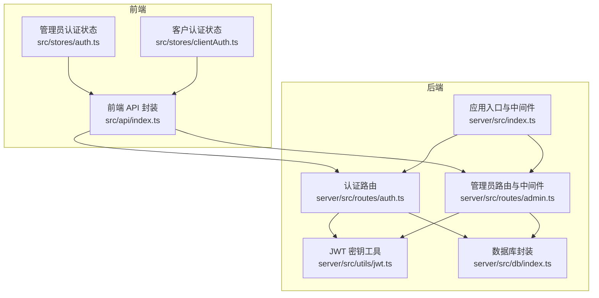
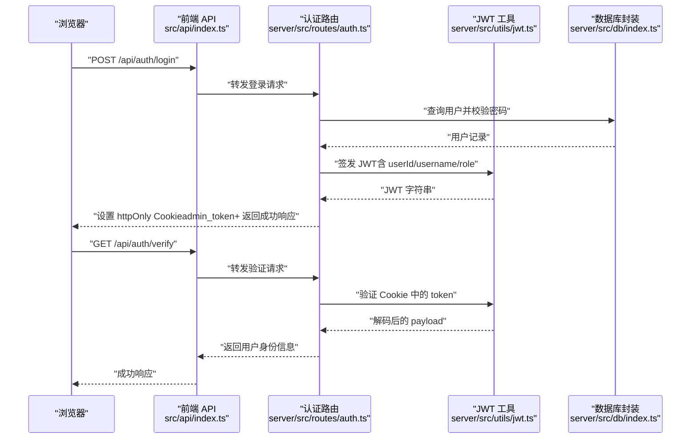
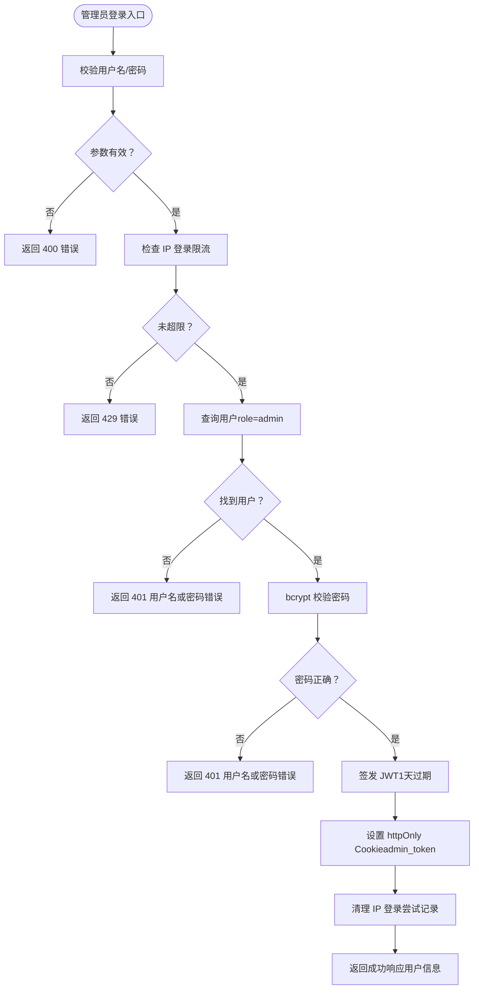
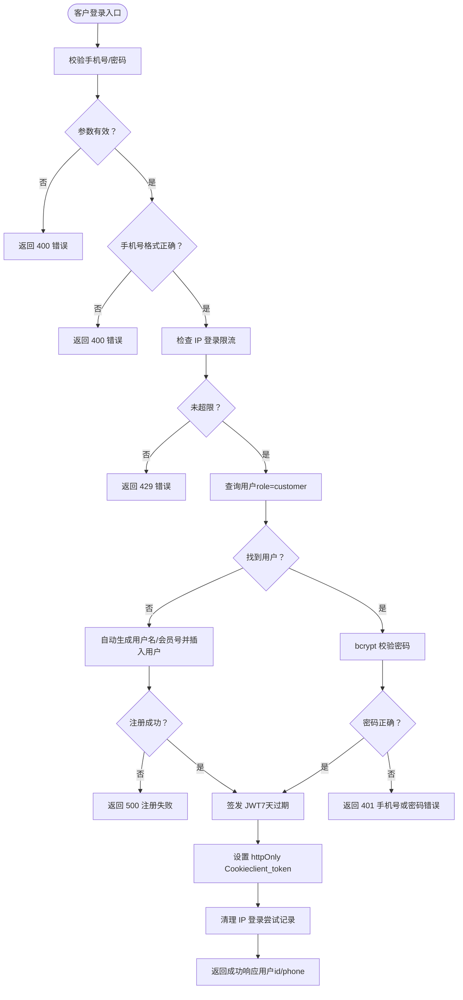
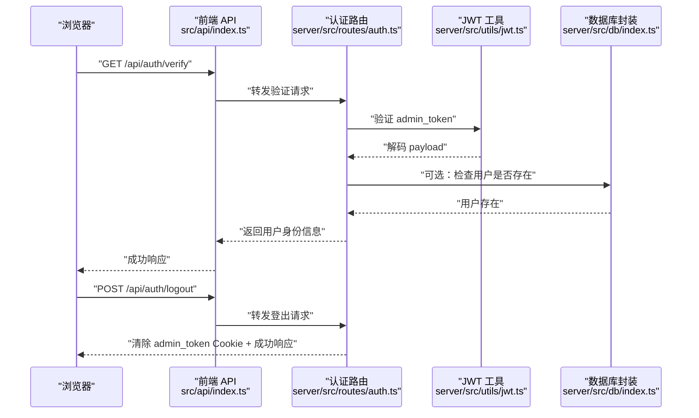
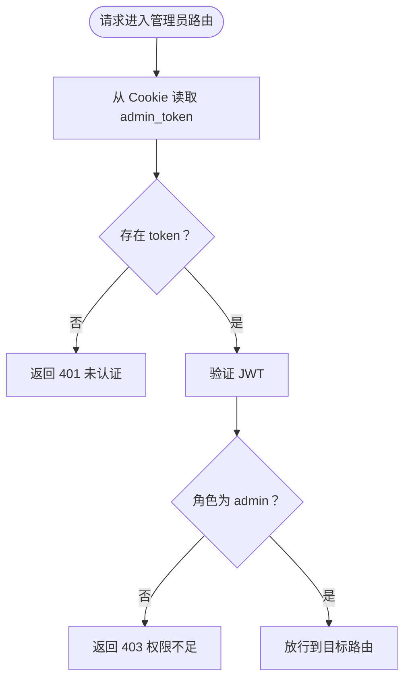
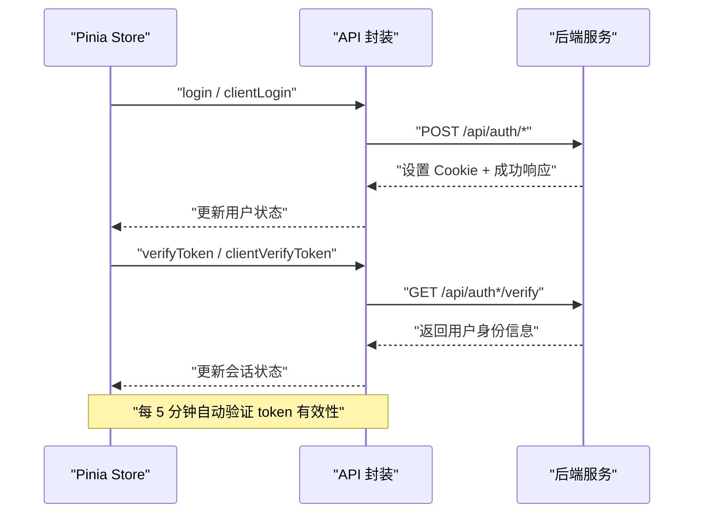
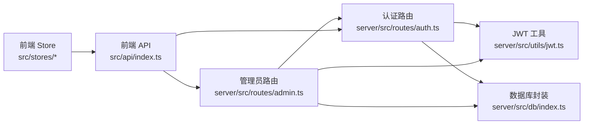

# 认证路由

<cite>
**本文引用的文件**
- [server/src/routes/auth.ts](file://server/src/routes/auth.ts)
- [server/src/utils/jwt.ts](file://server/src/utils/jwt.ts)
- [server/src/routes/admin.ts](file://server/src/routes/admin.ts)
- [server/src/index.ts](file://server/src/index.ts)
- [src/stores/auth.ts](file://src/stores/auth.ts)
- [src/stores/clientAuth.ts](file://src/stores/clientAuth.ts)
- [src/api/index.ts](file://src/api/index.ts)
- [server/src/db/index.ts](file://server/src/db/index.ts)
- [src/types/index.ts](file://src/types/index.ts)
</cite>

## 目录
1. [简介](#简介)
2. [项目结构](#项目结构)
3. [核心组件](#核心组件)
4. [架构总览](#架构总览)
5. [详细组件分析](#详细组件分析)
6. [依赖关系分析](#依赖关系分析)
7. [性能考量](#性能考量)
8. [故障排查指南](#故障排查指南)
9. [结论](#结论)
10. [附录](#附录)

## 简介
本文件聚焦 RLRMS 的认证路由与中间件实现，系统采用基于 httpOnly Cookie 的 JWT 认证方案，分别支持管理员登录认证与客户登录认证。文档深入解析以下主题：
- 管理员登录认证与客户登录认证的实现机制
- JWT 令牌生成与验证流程（签名算法、过期时间、刷新策略）
- 认证中间件的使用（token 提取、解码验证、权限检查）
- 登录成功与失败的响应格式（令牌返回、用户信息、错误码定义）
- 安全最佳实践与常见问题解决方案

## 项目结构
认证相关的核心文件分布如下：
- 后端路由与中间件：server/src/routes/auth.ts、server/src/routes/admin.ts
- JWT 密钥管理：server/src/utils/jwt.ts
- 服务端入口与中间件：server/src/index.ts
- 前端认证状态与 API：src/stores/auth.ts、src/stores/clientAuth.ts、src/api/index.ts
- 数据库封装：server/src/db/index.ts
- 类型定义：src/types/index.ts

图表来源
- [server/src/routes/auth.ts:1-405](file://server/src/routes/auth.ts#L1-L405)
- [server/src/routes/admin.ts:1-1887](file://server/src/routes/admin.ts#L1-L1887)
- [server/src/utils/jwt.ts:1-27](file://server/src/utils/jwt.ts#L1-L27)
- [server/src/index.ts:1-176](file://server/src/index.ts#L1-L176)
- [src/stores/auth.ts:1-128](file://src/stores/auth.ts#L1-L128)
- [src/stores/clientAuth.ts:1-87](file://src/stores/clientAuth.ts#L1-L87)
- [src/api/index.ts:1-608](file://src/api/index.ts#L1-L608)
- [server/src/db/index.ts:1-156](file://server/src/db/index.ts#L1-L156)

章节来源
- [server/src/routes/auth.ts:1-405](file://server/src/routes/auth.ts#L1-L405)
- [server/src/routes/admin.ts:1-1887](file://server/src/routes/admin.ts#L1-L1887)
- [server/src/utils/jwt.ts:1-27](file://server/src/utils/jwt.ts#L1-L27)
- [server/src/index.ts:1-176](file://server/src/index.ts#L1-L176)
- [src/stores/auth.ts:1-128](file://src/stores/auth.ts#L1-L128)
- [src/stores/clientAuth.ts:1-87](file://src/stores/clientAuth.ts#L1-L87)
- [src/api/index.ts:1-608](file://src/api/index.ts#L1-L608)
- [server/src/db/index.ts:1-156](file://server/src/db/index.ts#L1-L156)
- [src/types/index.ts:1-133](file://src/types/index.ts#L1-L133)

## 核心组件
- 认证路由模块（管理员与客户）
  - 管理员登录：校验用户名/密码，生成 1 天过期的 JWT，设置 httpOnly Cookie
  - 客户登录：校验手机号/密码，自动注册客户账号，生成 7 天过期的 JWT，设置 httpOnly Cookie
  - 登出：清除对应 Cookie
  - Token 校验：从 Cookie 读取并验证 JWT，返回用户身份信息
- 认证中间件（管理员）
  - 从 Cookie 读取 token，验证后仅允许 admin 角色访问
- JWT 密钥管理
  - 开发模式：基于主机特征派生固定密钥，保证热重载不丢失 token
  - 生产模式：随机密钥或显式环境变量，建议持久化以避免重启导致 token 失效
- 前端认证状态与 API
  - 统一的请求封装，携带 Cookie，处理 401 事件
  - 管理员会话保活与过期提示
  - 客户端尝试恢复登录状态

章节来源
- [server/src/routes/auth.ts:64-344](file://server/src/routes/auth.ts#L64-L344)
- [server/src/routes/admin.ts:115-131](file://server/src/routes/admin.ts#L115-L131)
- [server/src/utils/jwt.ts:11-26](file://server/src/utils/jwt.ts#L11-L26)
- [src/api/index.ts:246-286](file://src/api/index.ts#L246-L286)
- [src/stores/auth.ts:15-127](file://src/stores/auth.ts#L15-L127)
- [src/stores/clientAuth.ts:10-86](file://src/stores/clientAuth.ts#L10-L86)

## 架构总览
认证系统采用“Cookie + JWT”的组合方案：
- 前端通过 API 接口进行登录/登出/验证
- 后端将 JWT 置入 httpOnly Cookie，避免 XSS 泄露
- 管理员路由使用自定义中间件强制校验 Cookie 中的 token 并限制角色
- 客户端 token 有效期更长，并在验证时检查用户是否仍存在于数据库

图表来源
- [server/src/routes/auth.ts:64-179](file://server/src/routes/auth.ts#L64-L179)
- [server/src/utils/jwt.ts:20-22](file://server/src/utils/jwt.ts#L20-L22)
- [server/src/db/index.ts:112-125](file://server/src/db/index.ts#L112-L125)
- [src/api/index.ts:246-255](file://src/api/index.ts#L246-L255)

## 详细组件分析

### 管理员登录认证
- 输入校验：用户名与密码必填
- 登录限流：按 IP 维度 15 分钟窗口内最多 5 次尝试
- 用户查询：按用户名与角色 admin 查询
- 密码校验：bcrypt 对比
- 成功后：
  - 清理 IP 登录尝试记录
  - 生成 JWT（1 天过期），payload 包含 userId、username、role
  - 设置 httpOnly Cookie（admin_token），路径 “/”，生产环境启用 secure 与 sameSite
  - 返回成功响应，包含用户基本信息
- 失败场景：参数缺失、用户不存在、密码错误、限流触发、内部错误

图表来源
- [server/src/routes/auth.ts:64-144](file://server/src/routes/auth.ts#L64-L144)

章节来源
- [server/src/routes/auth.ts:64-144](file://server/src/routes/auth.ts#L64-L144)

### 客户登录认证与自动注册
- 输入校验：手机号（11 位数字）、密码长度至少 6
- 登录限流：同管理员
- 用户查询：按手机号与角色 customer 查询
- 若用户不存在：自动生成唯一用户名与会员号，插入用户记录（并发冲突时重试 3 次）
- 成功后：
  - 清理 IP 登录尝试记录
  - 生成 JWT（7 天过期），payload 包含 userId、username、role、phone
  - 设置 httpOnly Cookie（client_token），路径 “/”，生产环境启用 secure 与 sameSite
  - 返回成功响应，包含用户 id 与 phone
- 失败场景：参数缺失、手机号格式错误、密码过短、注册失败、内部错误

图表来源
- [server/src/routes/auth.ts:181-294](file://server/src/routes/auth.ts#L181-L294)

章节来源
- [server/src/routes/auth.ts:181-294](file://server/src/routes/auth.ts#L181-L294)

### Token 校验与登出
- 管理员校验：从 Cookie 读取 admin_token，验证 JWT，返回 userId/username/role
- 客户端校验：从 Cookie 读取 client_token，验证 JWT；随后再次查询数据库确认用户存在且角色为 customer
- 登出：清除对应 Cookie（admin_token 或 client_token）

图表来源
- [server/src/routes/auth.ts:157-179](file://server/src/routes/auth.ts#L157-L179)
- [server/src/routes/auth.ts:146-155](file://server/src/routes/auth.ts#L146-L155)
- [server/src/utils/jwt.ts:20-22](file://server/src/utils/jwt.ts#L20-L22)
- [server/src/db/index.ts:112-125](file://server/src/db/index.ts#L112-L125)

章节来源
- [server/src/routes/auth.ts:146-179](file://server/src/routes/auth.ts#L146-L179)

### 管理员认证中间件
- 从 Cookie 读取 admin_token
- 验证 JWT，若角色非 admin 则拒绝
- 通过后放行后续路由

图表来源
- [server/src/routes/admin.ts:115-131](file://server/src/routes/admin.ts#L115-L131)

章节来源
- [server/src/routes/admin.ts:115-131](file://server/src/routes/admin.ts#L115-L131)

### JWT 密钥与过期时间
- 密钥生成策略
  - 开发模式：基于主机名与用户名派生固定密钥，保证热重载不丢失 token
  - 生产模式：优先使用环境变量 JWT_SECRET；若未设置则随机生成，重启后 token 失效
- 过期时间
  - 管理员：1 天
  - 客户端：7 天
- Cookie 属性
  - httpOnly：防止 XSS
  - secure：生产环境启用
  - sameSite：lax
  - maxAge：管理员 1 天，客户 7 天

章节来源
- [server/src/utils/jwt.ts:11-26](file://server/src/utils/jwt.ts#L11-L26)
- [server/src/routes/auth.ts:114-118](file://server/src/routes/auth.ts#L114-L118)
- [server/src/routes/auth.ts:265-269](file://server/src/routes/auth.ts#L265-L269)

### 前端认证状态与 API
- 统一请求封装
  - 默认携带 Cookie（credentials: 'include'）
  - 自动处理 401 事件，触发全局认证过期事件
  - 对非 JSON 响应进行防御性处理
- 管理员会话保活
  - 保存会话过期时间（24 小时）
  - 每 5 分钟轮询验证 token 有效性，即将过期（30 分钟内）触发过期事件
- 客户端登录状态恢复
  - 启动时调用 clientVerifyToken，尝试恢复登录状态

图表来源
- [src/api/index.ts:54-114](file://src/api/index.ts#L54-L114)
- [src/stores/auth.ts:37-55](file://src/stores/auth.ts#L37-L55)
- [src/stores/clientAuth.ts:38-54](file://src/stores/clientAuth.ts#L38-L54)

章节来源
- [src/api/index.ts:246-286](file://src/api/index.ts#L246-L286)
- [src/stores/auth.ts:15-127](file://src/stores/auth.ts#L15-L127)
- [src/stores/clientAuth.ts:10-86](file://src/stores/clientAuth.ts#L10-L86)

## 依赖关系分析
- 认证路由依赖 JWT 工具生成/验证 token
- 认证路由依赖数据库封装进行用户查询与写入
- 管理员路由依赖认证中间件进行权限控制
- 前端 API 依赖 Cookie 进行认证传递，统一处理 401

图表来源
- [server/src/routes/auth.ts:1-405](file://server/src/routes/auth.ts#L1-L405)
- [server/src/routes/admin.ts:1-1887](file://server/src/routes/admin.ts#L1-L1887)
- [server/src/utils/jwt.ts:1-27](file://server/src/utils/jwt.ts#L1-L27)
- [server/src/db/index.ts:1-156](file://server/src/db/index.ts#L1-L156)
- [src/api/index.ts:1-608](file://src/api/index.ts#L1-L608)
- [src/stores/auth.ts:1-128](file://src/stores/auth.ts#L1-L128)
- [src/stores/clientAuth.ts:1-87](file://src/stores/clientAuth.ts#L1-L87)

章节来源
- [server/src/routes/auth.ts:1-405](file://server/src/routes/auth.ts#L1-L405)
- [server/src/routes/admin.ts:1-1887](file://server/src/routes/admin.ts#L1-L1887)
- [server/src/utils/jwt.ts:1-27](file://server/src/utils/jwt.ts#L1-L27)
- [server/src/db/index.ts:1-156](file://server/src/db/index.ts#L1-L156)
- [src/api/index.ts:1-608](file://src/api/index.ts#L1-L608)
- [src/stores/auth.ts:1-128](file://src/stores/auth.ts#L1-L128)
- [src/stores/clientAuth.ts:1-87](file://src/stores/clientAuth.ts#L1-L87)

## 性能考量
- 登录限流：按 IP 维度限制 15 分钟窗口内的尝试次数，降低暴力破解风险
- Cookie 传输：httpOnly 防止前端脚本读取，减少 XSS 风险
- 前端会话保活：每 5 分钟验证一次 token，避免长时间挂起导致状态不一致
- 数据库访问：登录与验证均使用预编译语句，避免 SQL 注入
- 响应头安全：统一设置安全响应头，提升整体安全性

[本节为通用性能讨论，不直接分析具体文件]

## 故障排查指南
- 登录失败
  - 参数缺失或格式错误：检查用户名/密码、手机号格式
  - 密码错误：确认 bcrypt 校验逻辑
  - 限流触发：等待 15 分钟或更换 IP
- 验证失败
  - 未提供 token：检查 Cookie 是否被浏览器禁用或跨域设置
  - token 无效：确认 JWT_SECRET 是否一致（生产环境建议固定）
  - 客户端验证：确认用户仍存在于数据库且角色为 customer
- 401 未认证
  - 前端会收到全局认证过期事件，需重新登录
  - 管理员中间件：确认 admin_token 是否存在且角色为 admin
- 会话过期
  - 管理员：24 小时过期；前端会在即将过期时提示
  - 客户端：7 天过期；前端会定期验证并提示过期

章节来源
- [server/src/routes/auth.ts:64-179](file://server/src/routes/auth.ts#L64-L179)
- [server/src/routes/auth.ts:181-344](file://server/src/routes/auth.ts#L181-L344)
- [server/src/routes/admin.ts:115-131](file://server/src/routes/admin.ts#L115-L131)
- [src/api/index.ts:94-104](file://src/api/index.ts#L94-L104)
- [src/stores/auth.ts:37-55](file://src/stores/auth.ts#L37-L55)

## 结论
本认证系统通过“Cookie + JWT”的方式实现了安全、稳定的管理员与客户认证：
- 管理员与客户分别使用独立的 Cookie 名称与过期时间
- 生产环境建议固定 JWT_SECRET，避免重启导致 token 失效
- 前端具备会话保活与过期提示，提升用户体验
- 登录限流与安全响应头进一步增强了系统抗攻击能力

[本节为总结性内容，不直接分析具体文件]

## 附录

### 响应格式与错误码
- 成功响应
  - 字段：success=true，data 包含用户信息
  - 管理员：返回 id、username、role、name
  - 客户端：返回 id、phone、role
- 失败响应
  - 字段：success=false，error 描述错误信息
  - 常见错误：参数缺失、用户名或密码错误、手机号或密码错误、登录尝试次数过多、用户不存在或已被删除、登录已过期、内部错误

章节来源
- [server/src/routes/auth.ts:64-179](file://server/src/routes/auth.ts#L64-L179)
- [server/src/routes/auth.ts:181-344](file://server/src/routes/auth.ts#L181-L344)
- [src/types/index.ts:1-7](file://src/types/index.ts#L1-L7)

### 安全最佳实践
- 固定 JWT_SECRET：生产环境务必设置 JWT_SECRET，避免随机密钥导致重启后 token 失效
- Cookie 安全属性：启用 httpOnly、secure（生产）、sameSite；合理设置 maxAge
- 会话保活：前端定期验证 token，及时提示过期
- 输入校验：严格校验手机号格式与密码长度
- 登录限流：防止暴力破解
- 数据库一致性：客户端验证时再次查询用户存在性

章节来源
- [server/src/utils/jwt.ts:20-26](file://server/src/utils/jwt.ts#L20-L26)
- [server/src/routes/auth.ts:19-55](file://server/src/routes/auth.ts#L19-L55)
- [src/stores/auth.ts:37-55](file://src/stores/auth.ts#L37-L55)