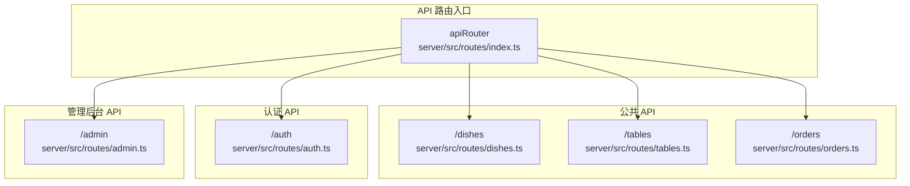
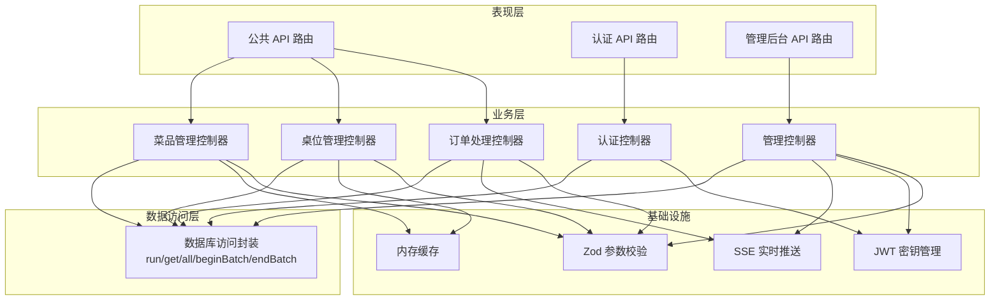
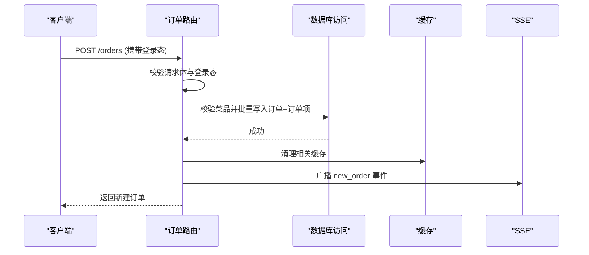
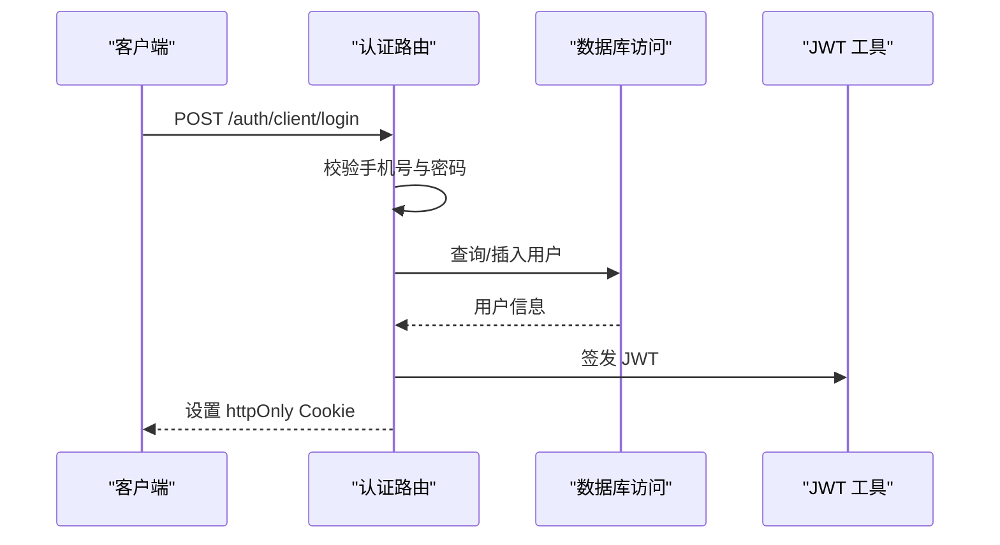
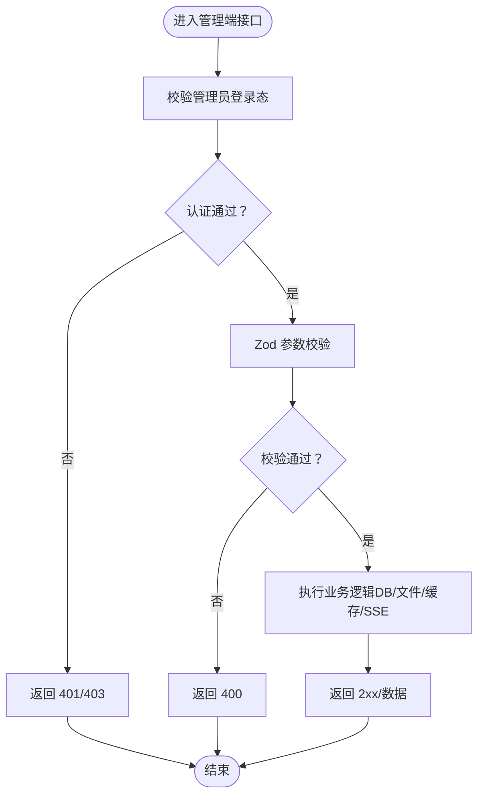
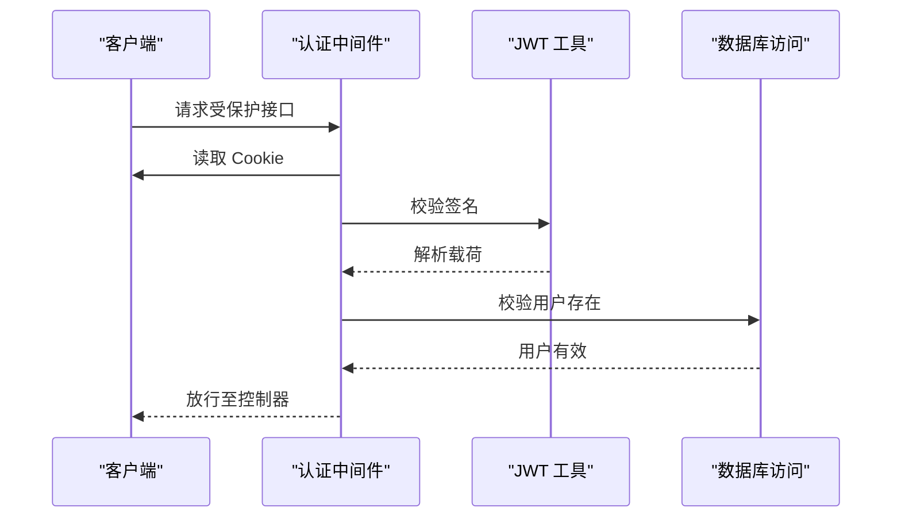
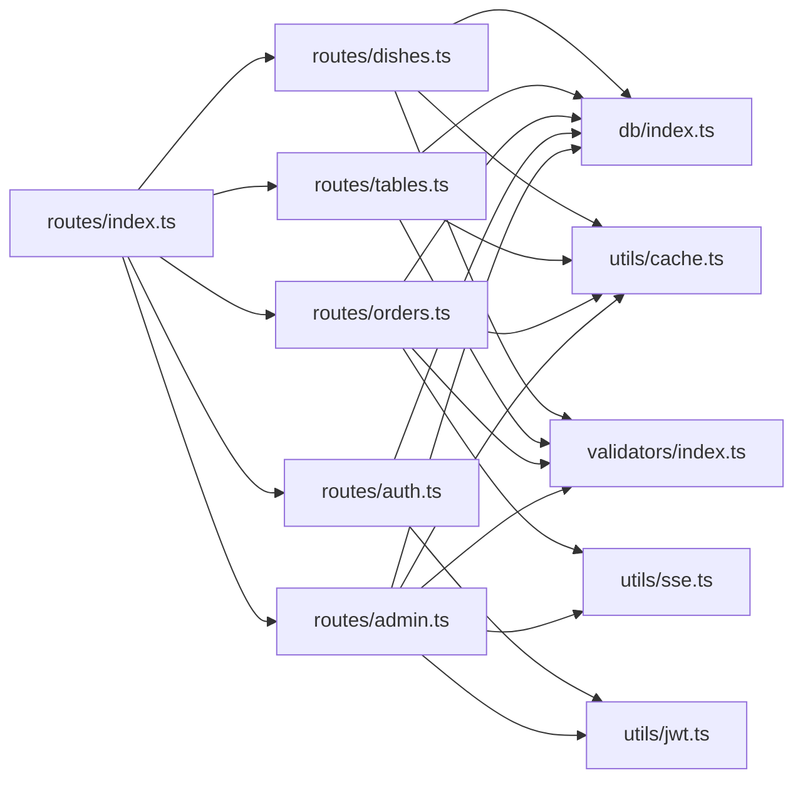

# 路由系统

<cite>
**本文引用的文件**
- [server/src/routes/index.ts](file://server/src/routes/index.ts)
- [server/src/routes/auth.ts](file://server/src/routes/auth.ts)
- [server/src/routes/admin.ts](file://server/src/routes/admin.ts)
- [server/src/routes/dishes.ts](file://server/src/routes/dishes.ts)
- [server/src/routes/tables.ts](file://server/src/routes/tables.ts)
- [server/src/routes/orders.ts](file://server/src/routes/orders.ts)
- [server/src/utils/jwt.ts](file://server/src/utils/jwt.ts)
- [server/src/utils/cache.ts](file://server/src/utils/cache.ts)
- [server/src/utils/sse.ts](file://server/src/utils/sse.ts)
- [server/src/utils/format.ts](file://server/src/utils/format.ts)
- [server/src/db/index.ts](file://server/src/db/index.ts)
- [server/src/validators/index.ts](file://server/src/validators/index.ts)
</cite>

## 目录
1. [简介](#简介)
2. [项目结构](#项目结构)
3. [核心组件](#核心组件)
4. [架构概览](#架构概览)
5. [详细组件分析](#详细组件分析)
6. [依赖分析](#依赖分析)
7. [性能考虑](#性能考虑)
8. [故障排除指南](#故障排除指南)
9. [结论](#结论)
10. [附录](#附录)

## 简介
本文件全面解析 RLRMS 路由系统的实现，涵盖 RESTful API 设计、分层路由结构（公共 API、认证 API、管理后台 API）、中间件体系（认证、权限、参数校验）、缓存与实时推送机制，以及扩展新功能的最佳实践。系统采用 Express + sql.js 架构，前端通过 Vue 3 + Vite 提供交互界面，后端路由清晰分离用户侧与管理侧功能，确保安全性与可维护性。

## 项目结构
后端路由位于 server/src/routes 下，按功能模块划分：
- 公共 API：菜品、桌位、订单（面向客户端）
- 认证 API：管理员登录/登出/校验；客户端登录/登出/校验
- 管理后台 API：仪表盘、菜品管理、桌位管理、订单管理、库存、用户管理、设置、数据导入导出、调试工具等

**图表来源**
- [server/src/routes/index.ts:1-18](file://server/src/routes/index.ts#L1-L18)

**章节来源**
- [server/src/routes/index.ts:1-18](file://server/src/routes/index.ts#L1-L18)

## 核心组件
- 路由聚合器：统一挂载各模块路由，区分公共与管理端口
- 功能路由模块：按领域拆分，职责单一，便于测试与演进
- 中间件体系：认证校验、权限控制、参数校验、SSE 实时推送
- 工具与基础设施：JWT 密钥管理、缓存、数据库访问、格式化、验证器

**章节来源**
- [server/src/routes/index.ts:1-18](file://server/src/routes/index.ts#L1-L18)
- [server/src/utils/jwt.ts:1-27](file://server/src/utils/jwt.ts#L1-L27)
- [server/src/utils/cache.ts:1-73](file://server/src/utils/cache.ts#L1-L73)
- [server/src/db/index.ts:1-156](file://server/src/db/index.ts#L1-L156)

## 架构概览
系统采用分层设计：
- 表现层：Express 路由模块
- 业务层：各模块控制器（路由处理器）
- 数据访问层：封装 sql.js，提供 run/get/all 等统一接口
- 基础设施：JWT、缓存、SSE、验证器

**图表来源**
- [server/src/routes/dishes.ts:1-216](file://server/src/routes/dishes.ts#L1-L216)
- [server/src/routes/tables.ts:1-93](file://server/src/routes/tables.ts#L1-L93)
- [server/src/routes/orders.ts:1-552](file://server/src/routes/orders.ts#L1-L552)
- [server/src/routes/auth.ts:1-405](file://server/src/routes/auth.ts#L1-L405)
- [server/src/routes/admin.ts:1-1884](file://server/src/routes/admin.ts#L1-L1884)
- [server/src/db/index.ts:100-156](file://server/src/db/index.ts#L100-L156)
- [server/src/utils/cache.ts:18-61](file://server/src/utils/cache.ts#L18-L61)
- [server/src/utils/sse.ts:15-51](file://server/src/utils/sse.ts#L15-L51)
- [server/src/utils/jwt.ts:20-26](file://server/src/utils/jwt.ts#L20-L26)
- [server/src/validators/index.ts:1-123](file://server/src/validators/index.ts#L1-L123)

## 详细组件分析

### 公共 API 路由（菜品、桌位、订单）
- 菜品路由：提供菜品列表、首页聚合数据、搜索、分类、详情等接口，内置缓存与 JSON 字段安全解析
- 桌位路由：提供全部桌位、可用桌位、特定时间可用桌位、桌位详情等接口，带 TTL 缓存
- 订单路由：客户端登录态下进行下单、查询、取消、加菜等操作，服务端严格校验菜品与金额，批量事务保证一致性，SSE 推送订单状态变更

**图表来源**
- [server/src/routes/orders.ts:194-353](file://server/src/routes/orders.ts#L194-L353)
- [server/src/utils/sse.ts:37-50](file://server/src/utils/sse.ts#L37-L50)
- [server/src/utils/cache.ts:41-43](file://server/src/utils/cache.ts#L41-L43)

**章节来源**
- [server/src/routes/dishes.ts:24-216](file://server/src/routes/dishes.ts#L24-L216)
- [server/src/routes/tables.ts:13-93](file://server/src/routes/tables.ts#L13-L93)
- [server/src/routes/orders.ts:61-552](file://server/src/routes/orders.ts#L61-L552)

### 认证 API 路由（管理员与客户端）
- 管理员认证：登录（IP 登录频率限制）、登出、令牌校验；使用 JWT 存储在 httpOnly Cookie 中
- 客户端认证：手机号+密码自动注册/登录、登出、令牌校验；支持手机号格式校验与密码强度约束
- 密钥管理：开发环境基于主机特征派生固定密钥，生产环境使用随机密钥或环境变量覆盖

**图表来源**
- [server/src/routes/auth.ts:181-294](file://server/src/routes/auth.ts#L181-L294)
- [server/src/utils/jwt.ts:20-26](file://server/src/utils/jwt.ts#L20-L26)

**章节来源**
- [server/src/routes/auth.ts:64-344](file://server/src/routes/auth.ts#L64-L344)
- [server/src/utils/jwt.ts:1-27](file://server/src/utils/jwt.ts#L1-L27)

### 管理后台 API 路由（仪表盘、菜品、桌位、订单、库存、用户、设置、导入导出、调试）
- 仪表盘：今日订单数、收入、待处理订单、可用桌位、最近订单等聚合统计
- 菜品管理：增删改查、排序、图片上传与清理、JSON 字段安全解析
- 桌位管理：增删改查、状态变更、可用性校验
- 订单管理：按状态/日期筛选、按订单号模糊搜索、状态更新、删除订单、清理已完成/已取消订单
- 库存管理：增删改查、排序
- 用户管理：增删改查、密码更新、角色限制
- 设置管理：键值对设置读取与更新
- 数据导入导出：ZIP 包含清单与数据文件，支持图片资源打包
- 调试工具：安全 SQL 查询执行（仅 SELECT/非 SELECT 区分处理）

**图表来源**
- [server/src/routes/admin.ts:115-131](file://server/src/routes/admin.ts#L115-L131)
- [server/src/validators/index.ts:1-123](file://server/src/validators/index.ts#L1-123)
- [server/src/db/index.ts:100-156](file://server/src/db/index.ts#L100-L156)

**章节来源**
- [server/src/routes/admin.ts:164-219](file://server/src/routes/admin.ts#L164-L219)
- [server/src/routes/admin.ts:341-546](file://server/src/routes/admin.ts#L341-L546)
- [server/src/routes/admin.ts:795-833](file://server/src/routes/admin.ts#L795-L833)
- [server/src/routes/admin.ts:1428-1677](file://server/src/routes/admin.ts#L1428-L1677)

### 路由中间件与安全
- 认证中间件：requireAuth（管理员）、requireClientAuth（客户端），均从 Cookie 中提取 JWT 并校验用户存在性
- 权限控制：管理员端强制 admin 角色，用户管理等关键操作有额外限制（如不可编辑/删除主管理员）
- 参数预处理：Zod Schema 校验请求体，统一错误返回格式
- 安全增强：登录频率限制（IP 维度）、SSE 客户端心跳、危险 SQL 黑名单、文件上传类型与大小限制、路径穿越防护

**图表来源**
- [server/src/routes/admin.ts:115-131](file://server/src/routes/admin.ts#L115-L131)
- [server/src/routes/orders.ts:24-49](file://server/src/routes/orders.ts#L24-L49)
- [server/src/utils/jwt.ts:20-26](file://server/src/utils/jwt.ts#L20-L26)

**章节来源**
- [server/src/routes/admin.ts:115-131](file://server/src/routes/admin.ts#L115-L131)
- [server/src/routes/orders.ts:24-49](file://server/src/routes/orders.ts#L24-L49)
- [server/src/validators/index.ts:1-123](file://server/src/validators/index.ts#L1-L123)

### RESTful API 设计原则
- HTTP 方法使用：GET/POST/PUT/DELETE 明确对应资源的读取、创建、更新、删除
- 状态码规范：200/201/400/401/403/404/429/500 等按场景返回
- 错误处理策略：统一 success/error 字段，错误消息本地化，异常捕获与日志记录
- 资源命名：复数形式（/dishes、/tables、/orders），子资源通过斜杠分隔（/orders/:id/items）
- 查询参数：分页/过滤/排序通过查询字符串传递（如 /orders?status=pending&startDate=...）

**章节来源**
- [server/src/routes/dishes.ts:24-216](file://server/src/routes/dishes.ts#L24-L216)
- [server/src/routes/tables.ts:13-93](file://server/src/routes/tables.ts#L13-L93)
- [server/src/routes/orders.ts:61-552](file://server/src/routes/orders.ts#L61-L552)
- [server/src/routes/admin.ts:164-219](file://server/src/routes/admin.ts#L164-L219)

### 路由扩展与新功能添加最佳实践
- 模块化：新增功能优先创建独立路由文件，遵循现有命名与目录约定
- 中间件复用：优先使用现有认证/权限中间件，避免重复实现
- 参数校验：使用 Zod Schema 定义输入约束，保持错误信息一致
- 缓存策略：对静态/低频变更数据使用缓存，变更时及时失效
- 事务与一致性：批量写入使用 beginBatch/endBatch，确保原子性
- 实时推送：重要状态变更通过 SSE 广播，前端订阅事件
- 安全考虑：严格文件上传校验、路径安全、SQL 注入防护、危险操作黑名单

**章节来源**
- [server/src/routes/index.ts:1-18](file://server/src/routes/index.ts#L1-L18)
- [server/src/validators/index.ts:1-123](file://server/src/validators/index.ts#L1-L123)
- [server/src/utils/cache.ts:18-61](file://server/src/utils/cache.ts#L18-L61)
- [server/src/db/index.ts:46-73](file://server/src/db/index.ts#L46-L73)
- [server/src/utils/sse.ts:37-50](file://server/src/utils/sse.ts#L37-L50)

## 依赖分析
- 路由聚合：apiRouter 统一挂载各模块路由
- 数据访问：各模块通过 db/index.ts 的 run/get/all 封装访问数据库
- 工具依赖：jwt.ts 提供密钥管理；cache.ts 提供 TTL 内存缓存；sse.ts 提供服务器推送；format.ts 提供时间格式化
- 验证器：validators/index.ts 提供 Zod Schema，贯穿请求参数校验

**图表来源**
- [server/src/routes/index.ts:1-18](file://server/src/routes/index.ts#L1-L18)
- [server/src/db/index.ts:100-156](file://server/src/db/index.ts#L100-L156)
- [server/src/utils/cache.ts:18-61](file://server/src/utils/cache.ts#L18-L61)
- [server/src/utils/sse.ts:37-50](file://server/src/utils/sse.ts#L37-L50)
- [server/src/utils/jwt.ts:20-26](file://server/src/utils/jwt.ts#L20-L26)
- [server/src/validators/index.ts:1-123](file://server/src/validators/index.ts#L1-L123)

**章节来源**
- [server/src/routes/index.ts:1-18](file://server/src/routes/index.ts#L1-L18)
- [server/src/db/index.ts:100-156](file://server/src/db/index.ts#L100-L156)

## 性能考虑
- 缓存：菜品与桌位查询使用 TTL 缓存，减少数据库压力；变更时主动失效
- 批量写入：订单创建/更新使用 beginBatch/endBatch，合并多次写入为单次持久化
- 避免 N+1 查询：订单列表批量加载订单项，按订单 ID 分组
- 数据库写入去抖：saveDatabase 使用防抖定时器合并写入
- SSE 心跳：保持长连接稳定，避免代理缓冲导致延迟

**章节来源**
- [server/src/utils/cache.ts:18-61](file://server/src/utils/cache.ts#L18-L61)
- [server/src/db/index.ts:46-73](file://server/src/db/index.ts#L46-L73)
- [server/src/routes/orders.ts:96-130](file://server/src/routes/orders.ts#L96-L130)
- [server/src/utils/sse.ts:148-155](file://server/src/utils/sse.ts#L148-L155)

## 故障排除指南
- 认证失败：检查 Cookie 是否正确设置、JWT 是否过期、用户是否被删除
- 参数校验错误：根据返回的错误消息修正请求体字段与格式
- 数据库写入失败：查看批量事务是否正确闭合，必要时启用调试查询端点
- 缓存不生效：确认缓存键是否正确，变更后是否调用失效函数
- SSE 无推送：检查连接是否存活、心跳是否正常、客户端是否正确订阅

**章节来源**
- [server/src/routes/auth.ts:157-179](file://server/src/routes/auth.ts#L157-L179)
- [server/src/routes/admin.ts:1789-1843](file://server/src/routes/admin.ts#L1789-L1843)
- [server/src/utils/cache.ts:41-61](file://server/src/utils/cache.ts#L41-L61)
- [server/src/utils/sse.ts:37-50](file://server/src/utils/sse.ts#L37-L50)

## 结论
RLRMS 路由系统通过清晰的分层设计与模块化路由，实现了公共 API、认证 API 与管理后台 API 的有效隔离。结合 JWT、缓存、SSE、Zod 校验与 sql.js 数据访问封装，系统在安全性、性能与可维护性方面达到良好平衡。遵循本文最佳实践，可快速扩展新功能并保持整体架构的一致性。

## 附录
- 路由路径与方法对照（示例）
  - GET /dishes → 获取菜品列表
  - GET /dishes/home-data → 获取首页聚合数据
  - GET /dishes/search/query?q=… → 搜索菜品
  - GET /dishes/categories/all → 获取分类
  - GET /dishes/:id → 获取菜品详情
  - GET /tables → 获取全部桌位
  - GET /tables/available → 获取可用桌位
  - GET /tables/available-for?dining_time=… → 获取特定时间段可用桌位
  - GET /tables/:id → 获取桌位详情
  - GET /orders → 获取当前用户订单（需客户端登录）
  - GET /orders/:id → 获取订单详情（需客户端登录）
  - POST /orders → 创建订单（需客户端登录）
  - POST /orders/:id/cancel → 取消订单（需客户端登录+手机号验证）
  - PUT /orders/:id/items → 加菜（需客户端登录）
  - POST /auth/login → 管理员登录
  - POST /auth/logout → 管理员登出
  - GET /auth/verify → 管理员令牌校验
  - POST /auth/client/login → 客户端登录/自动注册
  - POST /auth/client/logout → 客户端登出
  - GET /auth/client/verify → 客户端令牌校验
  - 管理后台路由（示例）：/admin/dashboard、/admin/dishes、/admin/tables、/admin/orders、/admin/inventory、/admin/users、/admin/settings、/admin/import、/admin/export、/admin/debug/query 等