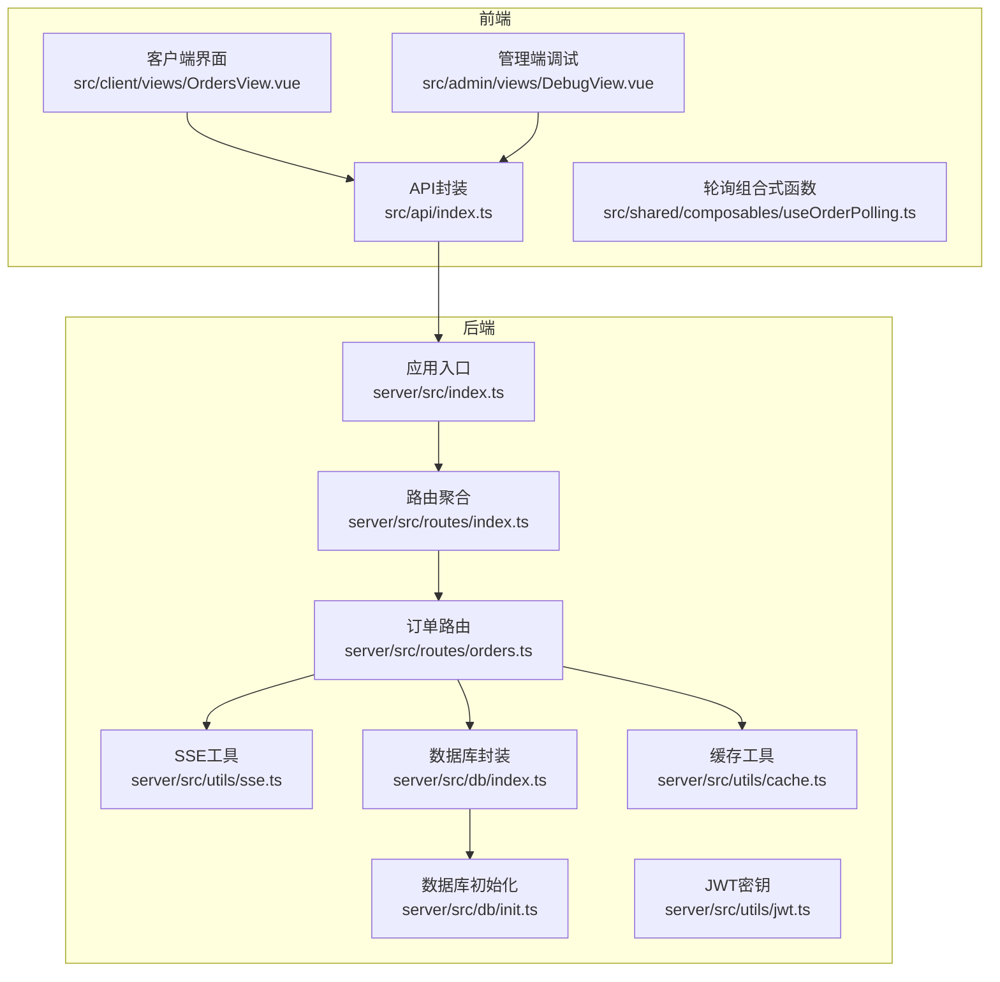
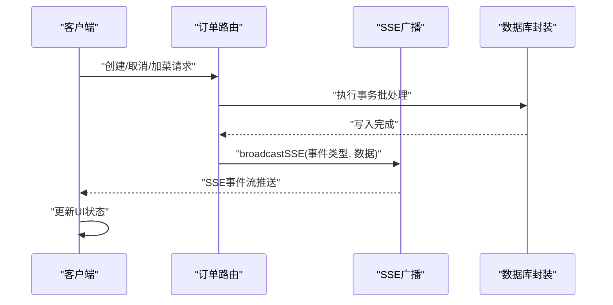
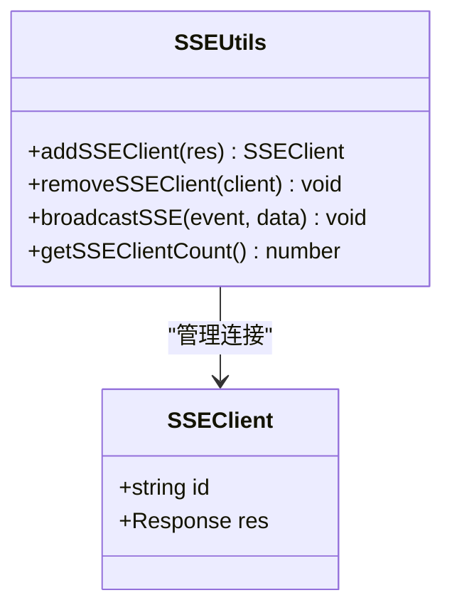
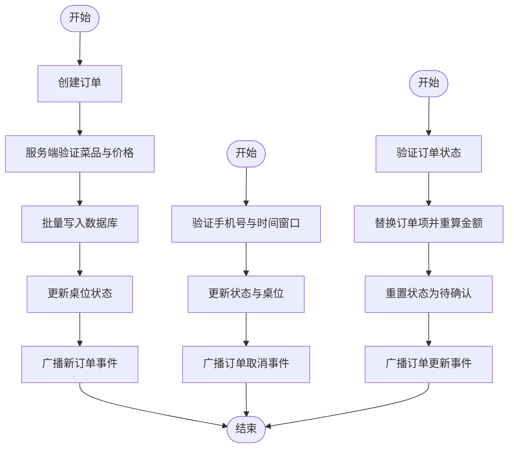
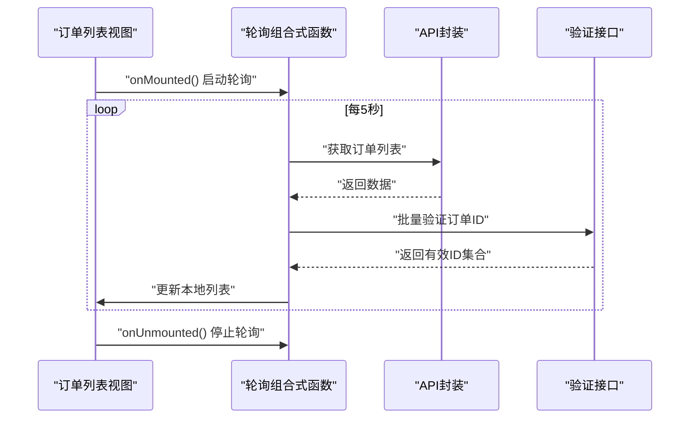
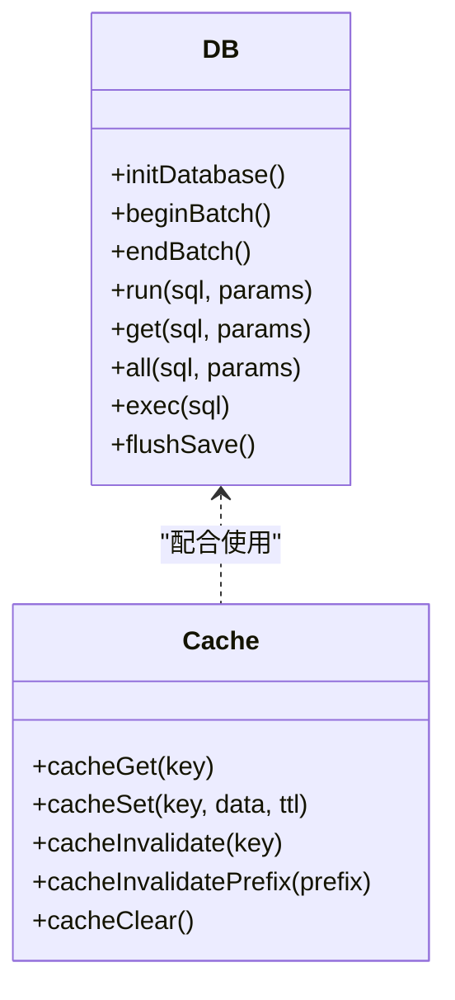
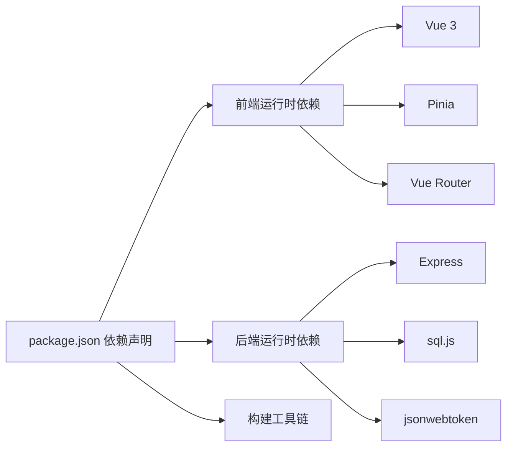

# 实时通信系统

<cite>
**本文档引用的文件**
- [server/src/utils/sse.ts](file://server/src/utils/sse.ts)
- [server/src/routes/orders.ts](file://server/src/routes/orders.ts)
- [src/shared/composables/useOrderPolling.ts](file://src/shared/composables/useOrderPolling.ts)
- [server/src/db/index.ts](file://server/src/db/index.ts)
- [server/src/dev-server.ts](file://server/src/dev-server.ts)
- [server/src/utils/cache.ts](file://server/src/utils/cache.ts)
- [server/src/utils/jwt.ts](file://server/src/utils/jwt.ts)
- [src/admin/views/DebugView.vue](file://src/admin/views/DebugView.vue)
- [src/client/views/OrdersView.vue](file://src/client/views/OrdersView.vue)
- [server/src/index.ts](file://server/src/index.ts)
- [server/src/routes/index.ts](file://server/src/routes/index.ts)
- [package.json](file://package.json)
- [server/src/db/init.ts](file://server/src/db/init.ts)
- [src/api/index.ts](file://src/api/index.ts)
- [src/stores/cart.ts](file://src/stores/cart.ts)
- [src/types/index.ts](file://src/types/index.ts)
</cite>

## 目录
1. [简介](#简介)
2. [项目结构](#项目结构)
3. [核心组件](#核心组件)
4. [架构概览](#架构概览)
5. [详细组件分析](#详细组件分析)
6. [依赖关系分析](#依赖关系分析)
7. [性能考虑](#性能考虑)
8. [故障排查指南](#故障排查指南)
9. [结论](#结论)
10. [附录](#附录)

## 简介
本文件面向RLRMS实时通信系统，聚焦以下目标：
- 解析SSE（Server-Sent Events）推送机制的实现原理与使用方法，涵盖事件广播、客户端监听、连接管理。
- 详述实时订单状态更新流程：从订单状态变更触发，到事件推送，再到客户端响应。
- 设计并解释轮询机制：轮询间隔、缓存策略、性能优化。
- 提供实时通信的错误处理与重连策略。
- 给出实时系统的监控与调试方法，以及扩展实时功能的实践建议。

## 项目结构
系统采用前后端分离架构，后端基于Express提供REST API与SSE事件流，前端使用Vue 3 + Pinia构建，包含客户端点餐界面与管理端调试工具。数据库采用sql.js嵌入式SQLite，支持批处理与防抖落盘，保障高并发写入的吞吐与一致性。

**图表来源**
- [server/src/index.ts:1-171](file://server/src/index.ts#L1-L171)
- [server/src/routes/index.ts:1-18](file://server/src/routes/index.ts#L1-L18)
- [server/src/routes/orders.ts:1-552](file://server/src/routes/orders.ts#L1-L552)
- [server/src/utils/sse.ts:1-59](file://server/src/utils/sse.ts#L1-L59)
- [server/src/db/index.ts:1-156](file://server/src/db/index.ts#L1-L156)
- [server/src/db/init.ts:1-204](file://server/src/db/init.ts#L1-L204)
- [server/src/utils/cache.ts:1-73](file://server/src/utils/cache.ts#L1-L73)
- [server/src/utils/jwt.ts:1-27](file://server/src/utils/jwt.ts#L1-L27)
- [src/api/index.ts:1-608](file://src/api/index.ts#L1-L608)
- [src/shared/composables/useOrderPolling.ts:1-74](file://src/shared/composables/useOrderPolling.ts#L1-L74)
- [src/client/views/OrdersView.vue:1-290](file://src/client/views/OrdersView.vue#L1-L290)
- [src/admin/views/DebugView.vue:1-34](file://src/admin/views/DebugView.vue#L1-L34)

**章节来源**
- [server/src/index.ts:1-171](file://server/src/index.ts#L1-L171)
- [server/src/routes/index.ts:1-18](file://server/src/routes/index.ts#L1-L18)
- [server/src/db/index.ts:1-156](file://server/src/db/index.ts#L1-L156)
- [server/src/db/init.ts:1-204](file://server/src/db/init.ts#L1-L204)

## 核心组件
- SSE客户端连接管理：维护活动连接列表，支持添加、移除、广播与统计。
- 订单路由与业务逻辑：负责订单创建、取消、加菜等操作，变更后通过SSE广播事件。
- 前端轮询与缓存：提供轮询组合式函数与内存缓存策略，降低网络压力。
- 数据库封装：sql.js + 批处理 + 防抖落盘，兼顾性能与可靠性。
- 缓存工具：TTL内存缓存，配合失效策略减少重复查询。
- JWT密钥管理：开发/生产差异化密钥生成策略，确保安全性。
- 健康检查与静态资源：健康检查接口与静态资源托管，便于部署与运维。

**章节来源**
- [server/src/utils/sse.ts:1-59](file://server/src/utils/sse.ts#L1-L59)
- [server/src/routes/orders.ts:1-552](file://server/src/routes/orders.ts#L1-L552)
- [src/shared/composables/useOrderPolling.ts:1-74](file://src/shared/composables/useOrderPolling.ts#L1-L74)
- [server/src/db/index.ts:1-156](file://server/src/db/index.ts#L1-L156)
- [server/src/utils/cache.ts:1-73](file://server/src/utils/cache.ts#L1-L73)
- [server/src/utils/jwt.ts:1-27](file://server/src/utils/jwt.ts#L1-L27)
- [server/src/index.ts:1-171](file://server/src/index.ts#L1-L171)

## 架构概览
系统采用“事件驱动 + 轮询兜底”的混合实时方案：
- 事件驱动：订单状态变更时，后端通过SSE向所有已建立连接的客户端广播事件，实现低延迟更新。
- 轮询兜底：当SSE连接异常或未建立时，前端定时轮询接口，结合内存缓存与幽灵订单验证，确保最终一致性。
- 数据层：sql.js嵌入式数据库，批处理事务与防抖落盘，保障写入性能；索引优化查询效率。
- 安全与稳定性：JWT鉴权、CORS配置、压缩过滤（SSE禁用压缩）、健康检查与错误统一处理。

**图表来源**
- [server/src/routes/orders.ts:342-343](file://server/src/routes/orders.ts#L342-L343)
- [server/src/utils/sse.ts:37-51](file://server/src/utils/sse.ts#L37-L51)
- [server/src/db/index.ts:46-73](file://server/src/db/index.ts#L46-L73)

**章节来源**
- [server/src/routes/orders.ts:193-353](file://server/src/routes/orders.ts#L193-L353)
- [server/src/utils/sse.ts:12-59](file://server/src/utils/sse.ts#L12-L59)
- [server/src/db/index.ts:100-147](file://server/src/db/index.ts#L100-L147)

## 详细组件分析

### SSE推送机制
- 客户端连接模型：每个连接被分配唯一ID并保存在内存数组中，支持统计与清理。
- 广播策略：遍历连接副本进行推送，避免迭代中修改数组；对不可写连接或异常进行清理。
- 压缩规避：SSE响应禁用压缩，确保事件实时性。

**图表来源**
- [server/src/utils/sse.ts:3-6](file://server/src/utils/sse.ts#L3-L6)
- [server/src/utils/sse.ts:15-58](file://server/src/utils/sse.ts#L15-L58)

**章节来源**
- [server/src/utils/sse.ts:12-59](file://server/src/utils/sse.ts#L12-L59)
- [server/src/index.ts:44-55](file://server/src/index.ts#L44-L55)

### 订单状态变更与事件推送
- 订单创建：服务端批量验证菜品与价格，写入订单与订单项，更新桌位状态，随后广播“新订单”事件。
- 订单取消：校验手机号与时间窗口，更新状态与桌位，广播“订单更新”事件。
- 加菜操作：删除旧项、插入新项、重算金额并重置状态，广播“订单更新”事件。

**图表来源**
- [server/src/routes/orders.ts:193-353](file://server/src/routes/orders.ts#L193-L353)
- [server/src/routes/orders.ts:355-418](file://server/src/routes/orders.ts#L355-L418)
- [server/src/routes/orders.ts:420-552](file://server/src/routes/orders.ts#L420-L552)

**章节来源**
- [server/src/routes/orders.ts:193-353](file://server/src/routes/orders.ts#L193-L353)
- [server/src/routes/orders.ts:355-418](file://server/src/routes/orders.ts#L355-L418)
- [server/src/routes/orders.ts:420-552](file://server/src/routes/orders.ts#L420-L552)

### 前端轮询机制与缓存策略
- 轮询控制：组合式函数提供定时器管理、页面可见性感知与增量检测，支持自定义轮询间隔与条件跳过。
- 内存缓存：stale-while-revalidate策略，命中即返回，后台静默刷新，降低请求频率。
- 幽灵订单验证：客户端在获取订单列表后，调用验证接口剔除不存在的订单ID，增强鲁棒性。

**图表来源**
- [src/shared/composables/useOrderPolling.ts:10-74](file://src/shared/composables/useOrderPolling.ts#L10-L74)
- [src/client/views/OrdersView.vue:77-136](file://src/client/views/OrdersView.vue#L77-L136)
- [src/api/index.ts:207-222](file://src/api/index.ts#L207-L222)

**章节来源**
- [src/shared/composables/useOrderPolling.ts:1-74](file://src/shared/composables/useOrderPolling.ts#L1-L74)
- [src/client/views/OrdersView.vue:33-136](file://src/client/views/OrdersView.vue#L33-L136)
- [src/api/index.ts:9-34](file://src/api/index.ts#L9-L34)

### 数据库与缓存
- 数据库封装：提供初始化、批处理、防抖落盘与查询接口，避免频繁I/O。
- 缓存工具：TTL内存缓存，支持失效与前缀失效，减少热点查询压力。
- 索引优化：为订单、菜品、用户、桌位等高频字段建立索引，提升查询性能。

**图表来源**
- [server/src/db/index.ts:76-156](file://server/src/db/index.ts#L76-L156)
- [server/src/utils/cache.ts:18-61](file://server/src/utils/cache.ts#L18-L61)

**章节来源**
- [server/src/db/index.ts:1-156](file://server/src/db/index.ts#L1-156)
- [server/src/utils/cache.ts:1-73](file://server/src/utils/cache.ts#L1-L73)
- [server/src/db/init.ts:124-137](file://server/src/db/init.ts#L124-L137)

### JWT与安全
- 密钥策略：开发模式基于主机特征派生固定密钥，生产模式使用动态密钥或环境变量，重启后密钥变化以提升安全性。
- 客户端认证：订单相关接口要求客户端登录态，通过cookie中的client_token进行JWT校验，并确保用户仍存在于数据库。

**章节来源**
- [server/src/utils/jwt.ts:1-27](file://server/src/utils/jwt.ts#L1-L27)
- [server/src/routes/orders.ts:24-49](file://server/src/routes/orders.ts#L24-L49)

### 健康检查与静态资源
- 健康检查：提供/health接口，返回数据库初始化状态与时间戳，便于容器编排与负载均衡探活。
- 静态资源：生产环境托管前端构建产物与图片资源，设置长缓存与ETag，提升加载速度。

**章节来源**
- [server/src/index.ts:89-119](file://server/src/index.ts#L89-L119)

## 依赖关系分析
- 前端依赖：Vue 3、Pinia、Vue Router、Lucide图标库、TypeScript类型定义。
- 后端依赖：Express、sql.js、uuid、bcryptjs、jsonwebtoken、cors、compression、cookie-parser等。
- 构建脚本：Vite + TypeScript，支持开发热重载与生产打包。

**图表来源**
- [package.json:16-41](file://package.json#L16-L41)
- [package.json:42-62](file://package.json#L42-L62)

**章节来源**
- [package.json:1-64](file://package.json#L1-L64)

## 性能考虑
- SSE实时性：禁用SSE响应压缩，避免缓冲导致的延迟；广播时遍历副本，避免并发修改。
- 写入优化：批处理事务与防抖落盘，合并多次写入，减少磁盘I/O。
- 查询优化：为高频查询字段建立索引，降低查询成本。
- 前端缓存：stale-while-revalidate策略，减少重复请求；轮询间隔默认5秒，可根据场景调整。
- 幽灵订单验证：客户端在获取订单列表后进行ID验证，剔除无效数据，提高一致性。

**章节来源**
- [server/src/index.ts:44-55](file://server/src/index.ts#L44-L55)
- [server/src/db/index.ts:46-73](file://server/src/db/index.ts#L46-L73)
- [server/src/db/init.ts:124-137](file://server/src/db/init.ts#L124-L137)
- [src/shared/composables/useOrderPolling.ts:14](file://src/shared/composables/useOrderPolling.ts#L14)
- [src/client/views/OrdersView.vue:40-54](file://src/client/views/OrdersView.vue#L40-L54)

## 故障排查指南
- SSE连接问题
  - 确认SSE响应未被压缩：后端已针对Content-Type包含text/event-stream的响应禁用压缩。
  - 检查客户端连接是否被清理：当连接不可写或抛出异常时，服务端会自动移除。
  - 观察客户端轮询作为兜底：若SSE异常，前端轮询将继续工作。
- 订单状态异常
  - 核对订单状态变更逻辑：创建、取消、加菜均有严格校验与事务保证。
  - 关注缓存失效：如桌位状态变更，需确保相关缓存键失效。
- 数据库初始化失败
  - 查看健康检查接口/health，确认数据库初始化状态。
  - 若初始化失败，服务将关闭并退出进程，需修复数据库文件或权限。
- 认证与会话
  - 客户端登录态过期会触发全局事件，前端应监听并引导重新登录。
  - JWT密钥在生产环境重启后会变化，避免跨重启持久化。

**章节来源**
- [server/src/index.ts:44-55](file://server/src/index.ts#L44-L55)
- [server/src/utils/sse.ts:37-51](file://server/src/utils/sse.ts#L37-L51)
- [server/src/routes/orders.ts:320-323](file://server/src/routes/orders.ts#L320-L323)
- [server/src/index.ts:89-95](file://server/src/index.ts#L89-L95)
- [src/api/index.ts:94-104](file://src/api/index.ts#L94-L104)
- [server/src/utils/jwt.ts:24-26](file://server/src/utils/jwt.ts#L24-L26)

## 结论
本系统通过SSE与轮询相结合的方式，在保证实时性的前提下兼顾了稳定性与性能。后端采用sql.js嵌入式数据库与批处理策略，前端引入内存缓存与幽灵订单验证，形成完整的实时通信闭环。建议在生产环境中进一步完善SSE连接监控、重连策略与限流措施，持续优化索引与查询计划，以应对更高并发场景。

## 附录
- 开发与部署
  - 开发模式：使用tsx watch启动后端，Vite热重载前端。
  - 生产模式：构建后端与前端，使用NODE_ENV=production启动，静态资源由Nginx/Apache托管。
- 调试工具
  - 管理端调试面板提供SQL执行器与API调试器，便于快速定位问题。
- 类型系统
  - 统一的API响应类型与业务实体类型，确保前后端契约一致。

**章节来源**
- [server/src/dev-server.ts:1-13](file://server/src/dev-server.ts#L1-L13)
- [src/admin/views/DebugView.vue:1-34](file://src/admin/views/DebugView.vue#L1-L34)
- [src/types/index.ts:1-133](file://src/types/index.ts#L1-L133)