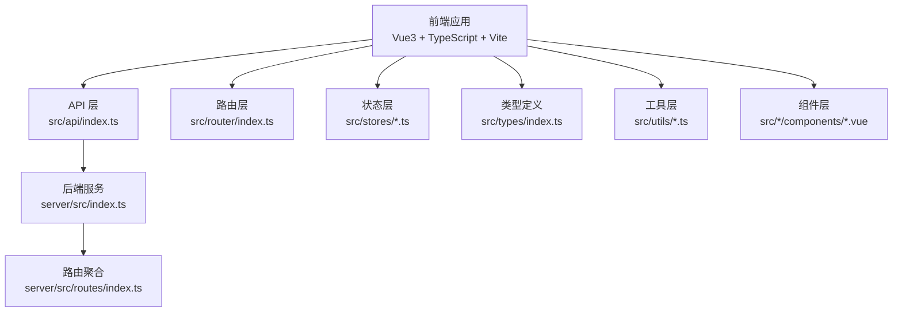
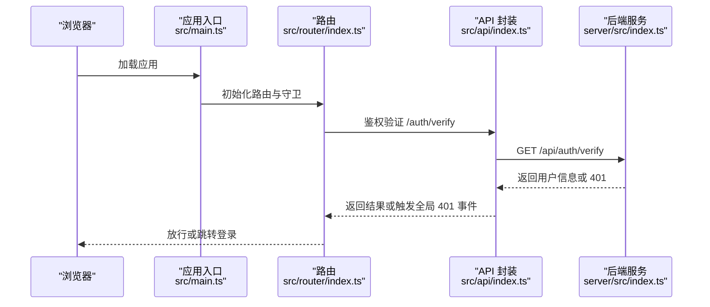
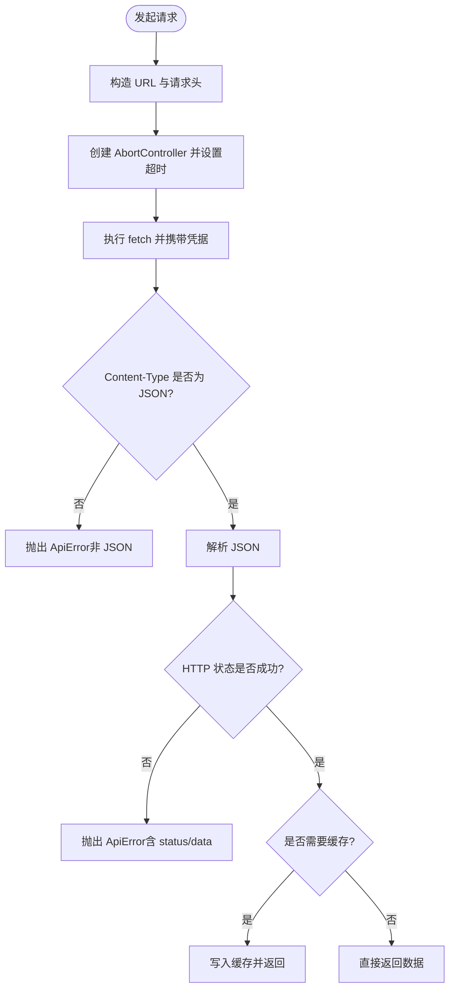
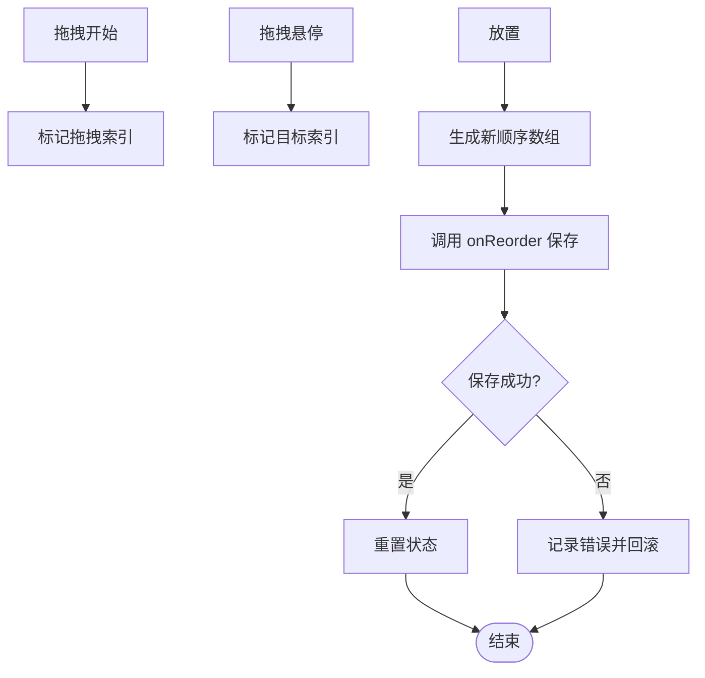
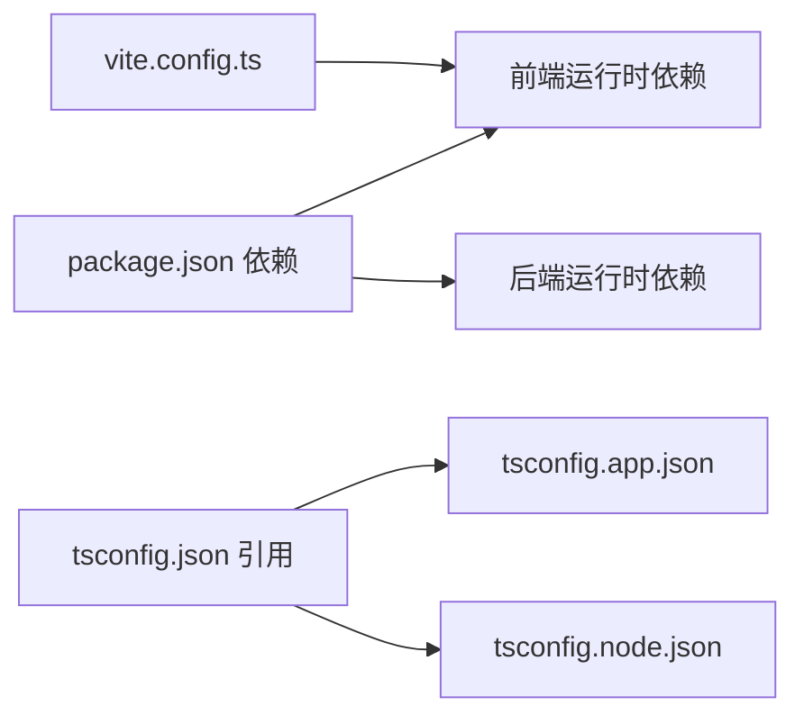

# 代码风格规范

<cite>
**本文引用的文件**
- [package.json](file://package.json)
- [tsconfig.json](file://tsconfig.json)
- [tsconfig.app.json](file://tsconfig.app.json)
- [tsconfig.node.json](file://tsconfig.node.json)
- [vite.config.ts](file://vite.config.ts)
- [src/types/index.ts](file://src/types/index.ts)
- [src/main.ts](file://src/main.ts)
- [src/App.vue](file://src/App.vue)
- [src/router/index.ts](file://src/router/index.ts)
- [src/api/index.ts](file://src/api/index.ts)
- [src/stores/app.ts](file://src/stores/app.ts)
- [src/utils/storage.ts](file://src/utils/storage.ts)
- [src/shared/composables/useDragReorder.ts](file://src/shared/composables/useDragReorder.ts)
- [src/admin/views/DashboardView.vue](file://src/admin/views/DashboardView.vue)
- [src/client/components/CartDrawer.vue](file://src/client/components/CartDrawer.vue)
- [server/src/index.ts](file://server/src/index.ts)
- [server/src/routes/index.ts](file://server/src/routes/index.ts)
</cite>

## 目录
1. [引言](#引言)
2. [项目结构](#项目结构)
3. [核心组件](#核心组件)
4. [架构总览](#架构总览)
5. [详细组件分析](#详细组件分析)
6. [依赖关系分析](#依赖关系分析)
7. [性能考量](#性能考量)
8. [故障排查指南](#故障排查指南)
9. [结论](#结论)
10. [附录](#附录)

## 引言
本规范面向 RLRMS 项目，统一前后端 TypeScript 与 Vue3 开发风格，明确类型定义、接口设计、泛型使用、Composition API 规范、组件命名与 props/events 设计原则，并给出 ESLint 与格式化建议、注释与变量命名约定、函数设计要点以及前后端差异与统一标准。文档中的示例均以“代码片段路径”形式引用仓库内具体文件位置，避免直接展示代码内容。

## 项目结构
- 前端采用 Vue3 + TypeScript + Vite 构建，使用 Pinia 状态管理与 Vue Router 路由。
- 后端基于 Express，模块化组织路由与中间件，提供 RESTful 接口与 SSE。
- 类型集中于 src/types/index.ts，统一前后端交互契约；API 层封装通用请求与缓存策略；路由层实现鉴权守卫与预取优化；组件层遵循 Composition API 与单文件组件规范。

图示来源
- [src/main.ts:1-37](file://src/main.ts#L1-L37)
- [src/api/index.ts:1-608](file://src/api/index.ts#L1-L608)
- [src/router/index.ts:1-317](file://src/router/index.ts#L1-L317)
- [server/src/index.ts:1-171](file://server/src/index.ts#L1-L171)
- [server/src/routes/index.ts:1-18](file://server/src/routes/index.ts#L1-L18)

章节来源
- [package.json:1-64](file://package.json#L1-L64)
- [tsconfig.json:1-8](file://tsconfig.json#L1-L8)
- [tsconfig.app.json:1-21](file://tsconfig.app.json#L1-L21)
- [tsconfig.node.json:1-27](file://tsconfig.node.json#L1-L27)
- [vite.config.ts:1-112](file://vite.config.ts#L1-L112)

## 核心组件
- 类型系统：集中于 src/types/index.ts，统一定义响应体、用户、桌位、菜品、订单、库存、仪表盘统计等接口，确保前后端一致。
- API 封装：src/api/index.ts 提供统一请求、超时、401 处理、缓存策略与可取消请求能力。
- 路由与鉴权：src/router/index.ts 实现客户端与管理端路由分层、鉴权守卫、标题设置、预加载与预取。
- 状态管理：src/stores/app.ts 提供主题、加载状态、调试模式与 Toast 管理。
- 工具与存储：src/utils/storage.ts 提供 IndexedDB 封装，支持懒加载与事务读写。
- 组合式工具：src/shared/composables/useDragReorder.ts 提供拖拽重排的通用逻辑与保存流程。
- 组件示例：src/admin/views/DashboardView.vue 与 src/client/components/CartDrawer.vue 展示 Composition API、异步组件、事件与模型绑定等实践。

章节来源
- [src/types/index.ts:1-133](file://src/types/index.ts#L1-L133)
- [src/api/index.ts:1-608](file://src/api/index.ts#L1-L608)
- [src/router/index.ts:1-317](file://src/router/index.ts#L1-L317)
- [src/stores/app.ts:1-122](file://src/stores/app.ts#L1-L122)
- [src/utils/storage.ts:1-109](file://src/utils/storage.ts#L1-L109)
- [src/shared/composables/useDragReorder.ts:1-109](file://src/shared/composables/useDragReorder.ts#L1-L109)
- [src/admin/views/DashboardView.vue:1-800](file://src/admin/views/DashboardView.vue#L1-L800)
- [src/client/components/CartDrawer.vue:1-314](file://src/client/components/CartDrawer.vue#L1-L314)

## 架构总览
下图展示前端应用启动、路由守卫、API 请求与后端服务的整体交互。

图示来源
- [src/main.ts:1-37](file://src/main.ts#L1-L37)
- [src/router/index.ts:201-277](file://src/router/index.ts#L201-L277)
- [src/api/index.ts:253-261](file://src/api/index.ts#L253-L261)
- [server/src/index.ts:121-139](file://server/src/index.ts#L121-L139)

## 详细组件分析

### TypeScript 类型与接口设计规范
- 命名与一致性
  - 使用名词短语命名接口，如 User、Table、Dish、Order、ApiResponse 等，保持与业务实体一致。
  - 对枚举值使用字面量联合类型，如 status、role、dining_time，提升编译期安全。
- 泛型与约束
  - 在组合式工具中使用泛型约束基类属性，如 useDragReorder<T extends DragItem>，确保 items 的最小公共接口。
- 响应体统一
  - ApiResponse<T> 作为所有接口的统一包装，包含 success、data、error、message 字段，便于前端统一处理。
- 复杂度与可维护性
  - 类型拆分清晰，避免在一个文件中堆积过多类型；必要时按领域拆分文件并在 index.ts 汇总导出。

章节来源
- [src/types/index.ts:1-133](file://src/types/index.ts#L1-L133)
- [src/shared/composables/useDragReorder.ts:8-11](file://src/shared/composables/useDragReorder.ts#L8-L11)

### Vue3 组件开发规范（Composition API）
- 组件结构
  - 使用 <script setup> 与 lang="ts"，减少样板代码；将逻辑集中在 setup 函数内，返回值即对外暴露。
  - 通过 defineModel/defineEmits 明确双向绑定与事件发射，增强可读性与类型推断。
- 组件命名
  - 采用帕斯卡命名法，如 DashboardView、CartDrawer、QuantityControl，保持目录与组件名一致。
- Props 与 Events 设计
  - 使用 defineModel 管理 v-model 场景；使用 defineEmits 明确事件签名，避免隐式事件。
- 异步组件与图标
  - 对重型组件使用 defineAsyncComponent 动态引入；图标库 lucide-vue-next 按需引入，减少首屏体积。
- 生命周期与副作用
  - 在 onMounted/onUnmounted 中注册/清理事件监听、定时器与 SSE 连接，避免内存泄漏。
- 状态与 Store
  - 在组件中通过 Pinia Store 管理跨组件共享状态，如主题、加载状态、Toast 列表等。

章节来源
- [src/admin/views/DashboardView.vue:1-800](file://src/admin/views/DashboardView.vue#L1-L800)
- [src/client/components/CartDrawer.vue:1-314](file://src/client/components/CartDrawer.vue#L1-L314)
- [src/stores/app.ts:1-122](file://src/stores/app.ts#L1-L122)

### API 层与请求规范
- 统一请求封装
  - request<T> 封装 fetch、超时、凭据携带、Content-Type 设置与非 JSON 防御。
  - 401 统一处理：触发全局 auth:expired 事件，阻止默认错误处理链。
- 缓存策略
  - 内存缓存（stale-while-revalidate）：30 秒 TTL，命中即刻返回，后台静默刷新。
- 可取消请求
  - createCancellableRequest 提供 AbortController，支持外部信号合并，避免竞态与悬挂请求。
- 错误类型
  - ApiError 携带 status 与 data，便于上层差异化处理。

图示来源
- [src/api/index.ts:54-114](file://src/api/index.ts#L54-L114)
- [src/api/index.ts:17-29](file://src/api/index.ts#L17-L29)

章节来源
- [src/api/index.ts:1-608](file://src/api/index.ts#L1-L608)

### 路由与鉴权规范
- 路由分层
  - 客户端路由与管理端路由分离，管理端使用嵌套路由与 LayoutView。
- 鉴权守卫
  - 客户端受保护路由：若未认证则触发登录模态框，成功后再放行。
  - 管理端受保护路由：调用 /auth/verify 校验，失败则跳转登录页并携带 redirect。
- 预加载与预取
  - 应用启动后预加载关键组件；导航完成后根据目标路由预取相关页面，提升体验。

章节来源
- [src/router/index.ts:42-92](file://src/router/index.ts#L42-L92)
- [src/router/index.ts:94-176](file://src/router/index.ts#L94-L176)
- [src/router/index.ts:201-277](file://src/router/index.ts#L201-L277)
- [src/router/index.ts:283-314](file://src/router/index.ts#L283-L314)

### 状态管理与工具
- 主题与系统偏好
  - 支持 light/dark/system 三态，监听 prefers-color-scheme 变化并持久化。
- Toast 管理
  - 固定最大数量，先进先出替换；每条 Toast 独立定时器，互不影响。
- IndexedDB 存储
  - 懒加载数据库连接，事务只读/读写，错误重试与清理缓存 Promise。

章节来源
- [src/stores/app.ts:1-122](file://src/stores/app.ts#L1-L122)
- [src/utils/storage.ts:1-109](file://src/utils/storage.ts#L1-L109)

### 组合式工具：拖拽重排
- 设计要点
  - 使用 Ref 标记拖拽状态与索引，计算新的排序数组并调用 onReorder 异步保存。
  - 保存过程中设置 isSaving，异常时回滚 UI 并记录日志。
- 泛型约束
  - 通过 T extends DragItem 约束 items 的最小公共接口，确保扩展性。

图示来源
- [src/shared/composables/useDragReorder.ts:21-95](file://src/shared/composables/useDragReorder.ts#L21-L95)

章节来源
- [src/shared/composables/useDragReorder.ts:1-109](file://src/shared/composables/useDragReorder.ts#L1-L109)

### 后端服务与路由
- Express 应用
  - 生产环境启用 CORS 与安全响应头；健康检查 /health；静态资源托管与 SPA 回退。
- 路由聚合
  - /api 下挂载 dishes、tables、orders、auth、admin 等子路由，职责清晰。
- SSE 与压缩
  - SSE 响应不压缩，保障实时推送；其他响应按阈值与过滤策略压缩。

章节来源
- [server/src/index.ts:1-171](file://server/src/index.ts#L1-L171)
- [server/src/routes/index.ts:1-18](file://server/src/routes/index.ts#L1-L18)

## 依赖关系分析
- 前端依赖
  - Vue3、Vue Router、Pinia、lucide-vue-next、zod 等；Vite 用于构建与开发，包含别名 @ 指向 src。
- 后端依赖
  - Express、cors、cookie-parser、compression、dotenv 等；路由模块化组织。
- 类型与配置
  - tsconfig.json 通过 references 聚合 app 与 node 两套 tsconfig，分别针对应用与构建脚本。

图示来源
- [package.json:16-62](file://package.json#L16-L62)
- [tsconfig.json:3-6](file://tsconfig.json#L3-L6)
- [vite.config.ts:28-33](file://vite.config.ts#L28-L33)

章节来源
- [package.json:1-64](file://package.json#L1-L64)
- [tsconfig.json:1-8](file://tsconfig.json#L1-L8)
- [tsconfig.app.json:1-21](file://tsconfig.app.json#L1-L21)
- [tsconfig.node.json:1-27](file://tsconfig.node.json#L1-L27)
- [vite.config.ts:1-112](file://vite.config.ts#L1-L112)

## 性能考量
- 代码分割与懒加载
  - Vite 配置手动分割 vendor 与 vendor-icons，降低包体积与提升 Tree-shaking 效果。
  - 组件按需异步加载，减少首屏负担。
- 缓存与预取
  - API 层采用内存缓存（TTL 30s），Stale-While-Revalidate 策略；路由层预加载关键组件与预取相关页面。
- SSE 降级
  - SSE 断开后自动切换轮询，保障实时性与可靠性。
- 构建优化
  - 生产环境启用 esbuild minify 与 source map 控制；CSS 分割与资源命名哈希。

章节来源
- [vite.config.ts:63-112](file://vite.config.ts#L63-L112)
- [src/api/index.ts:17-29](file://src/api/index.ts#L17-L29)
- [src/admin/views/DashboardView.vue:302-446](file://src/admin/views/DashboardView.vue#L302-L446)
- [src/router/index.ts:23-40](file://src/router/index.ts#L23-L40)
- [src/router/index.ts:283-314](file://src/router/index.ts#L283-L314)

## 故障排查指南
- 401 会话过期
  - 前端：ApiError 抛出并触发 auth:expired 事件；App.vue 监听事件进行路由跳转与提示。
  - 后端：统一捕获 UnauthorizedError 并返回标准化错误。
- 非 JSON 响应
  - 前端：检测 Content-Type，若非 application/json 直接抛错，避免后续解析异常。
- SSE 连接问题
  - DashboardView.vue 中实现重连与降级轮询，断线后自动恢复或提示。
- IndexedDB 初始化失败
  - storage.ts 清理缓存 Promise 以便重试；错误路径统一 reject。

章节来源
- [src/api/index.ts:94-104](file://src/api/index.ts#L94-L104)
- [src/App.vue:16-39](file://src/App.vue#L16-L39)
- [server/src/index.ts:121-139](file://server/src/index.ts#L121-L139)
- [src/admin/views/DashboardView.vue:375-390](file://src/admin/views/DashboardView.vue#L375-L390)
- [src/utils/storage.ts:18-37](file://src/utils/storage.ts#L18-L37)

## 结论
本规范围绕类型系统、组件开发、API 封装、路由与鉴权、状态管理与工具、后端服务与路由等方面，总结了 RLRMS 项目的风格与最佳实践。建议在团队内推广统一的命名、注释与提交前检查流程，持续优化缓存与预取策略，确保前后端契约稳定与可演进。

## 附录

### TypeScript 编码规范要点
- 类型定义
  - 使用字面量联合类型表达枚举值；统一 ApiResponse 包装；避免 any。
- 接口设计
  - 优先使用只读与可选字段；对可空值使用 null/undefined 明确标注。
- 泛型使用
  - 在复用逻辑中使用泛型约束最小接口；避免过度抽象导致可读性下降。
- 复杂度与可维护性
  - 单文件函数长度控制；长流程拆分为小函数；合理使用工具类型。

章节来源
- [src/types/index.ts:1-133](file://src/types/index.ts#L1-L133)
- [src/shared/composables/useDragReorder.ts:8-11](file://src/shared/composables/useDragReorder.ts#L8-L11)

### Vue3 组件开发规范要点
- Composition API
  - 使用 <script setup>；在 onMounted/onUnmounted 中管理副作用；通过 defineModel/defineEmits 明确 props 与 events。
- 组件命名与组织
  - 帕斯卡命名法；按功能域划分目录；组件名与文件名一致。
- 异步与性能
  - 异步组件按需加载；避免在模板中执行复杂计算；合理使用 computed 与 watch。

章节来源
- [src/admin/views/DashboardView.vue:1-800](file://src/admin/views/DashboardView.vue#L1-L800)
- [src/client/components/CartDrawer.vue:1-314](file://src/client/components/CartDrawer.vue#L1-L314)

### 前后端代码风格差异与统一标准
- 前端
  - 使用 TypeScript + Vue3；严格 lint 规则；组件化开发；API 封装与缓存策略。
- 后端
  - 使用 Node/Express；模块化路由；统一错误处理；生产环境安全头与健康检查。
- 统一标准
  - 类型契约统一于 src/types/index.ts；API 响应统一 ApiResponse；错误类型化；路由与鉴权策略一致。

章节来源
- [src/types/index.ts:1-133](file://src/types/index.ts#L1-L133)
- [src/api/index.ts:1-608](file://src/api/index.ts#L1-L608)
- [server/src/index.ts:1-171](file://server/src/index.ts#L1-L171)

### ESLint 配置与代码格式化建议
- 语言与工具
  - 使用 TypeScript 与 Vue SFC；推荐配合 Prettier 进行格式化；结合 Volar 与 ESLint Vue 插件。
- 关键规则建议
  - 严格模式：noUnusedLocals、noUnusedParameters、noFallthroughCasesInSwitch、noUncheckedSideEffectImports。
  - Vue：禁止在模板中使用未声明的变量；推荐使用 <script setup> 语法。
  - 命名：组件名使用帕斯卡命名；变量与函数使用驼峰命名；常量使用大写下划线。
  - 注释：公共 API 与复杂逻辑添加 JSDoc；简明扼要，避免冗余。
- 与现有配置的对应
  - tsconfig.app.json 已启用 strict、noUnusedLocals、noUnusedParameters 等严格选项，可直接作为 ESLint 的基础。

章节来源
- [tsconfig.app.json:11-17](file://tsconfig.app.json#L11-L17)
- [tsconfig.node.json:17-23](file://tsconfig.node.json#L17-L23)

### 注释规范、变量命名与函数设计
- 注释
  - 文件顶部添加用途说明；复杂函数添加 JSDoc；变更与风险点添加 TODO/FIXME 注释。
- 变量命名
  - 布尔变量以 is/has/can 前缀；集合使用复数；常量使用全大写。
- 函数设计
  - 单一职责；短小精悍；错误通过异常或错误对象返回；必要时提供超时与取消能力。

章节来源
- [src/api/index.ts:54-114](file://src/api/index.ts#L54-L114)
- [src/utils/storage.ts:11-40](file://src/utils/storage.ts#L11-L40)