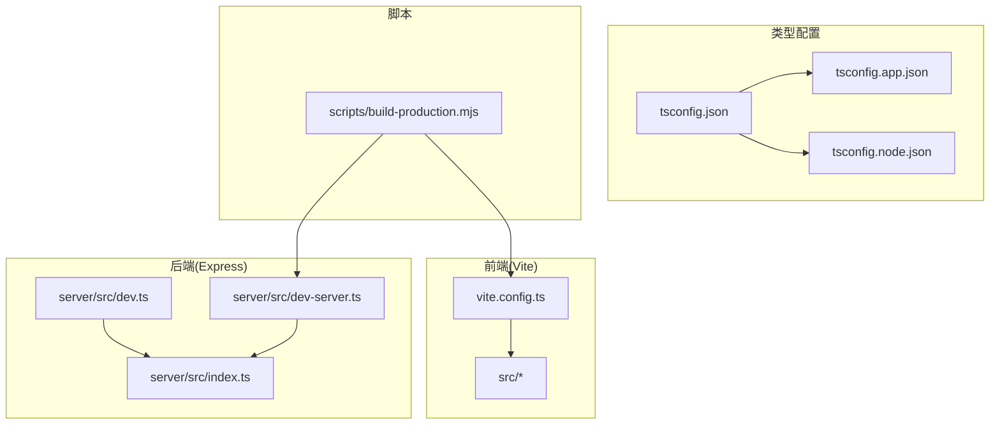
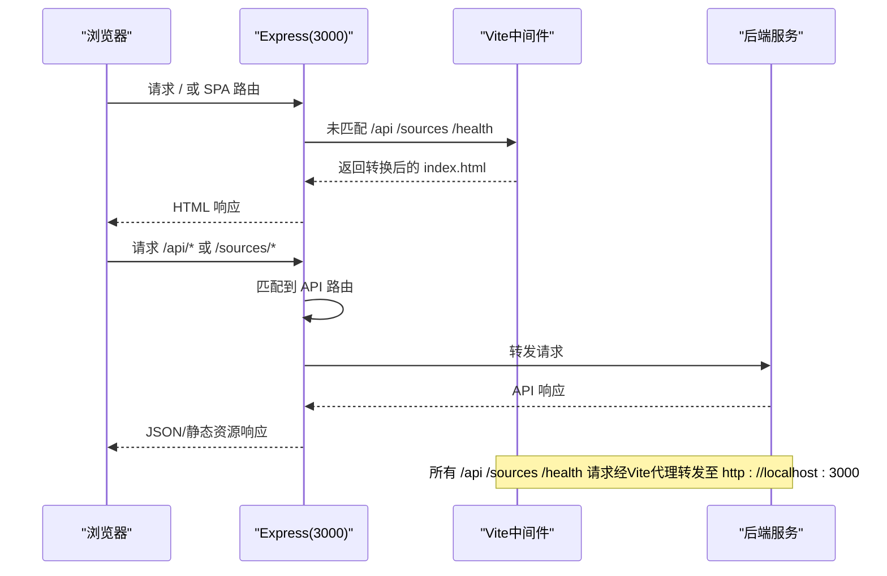
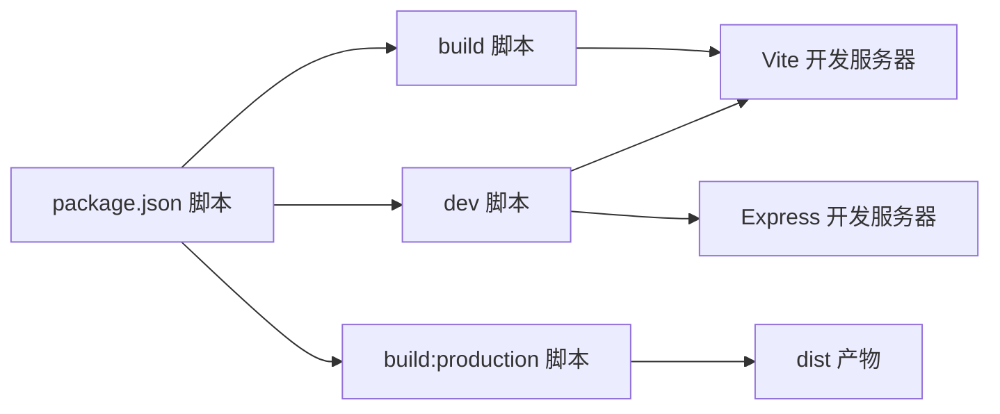

# 开发工具配置

<cite>
**本文档引用的文件**
- [vite.config.ts](file://vite.config.ts)
- [package.json](file://package.json)
- [tsconfig.json](file://tsconfig.json)
- [tsconfig.app.json](file://tsconfig.app.json)
- [tsconfig.node.json](file://tsconfig.node.json)
- [server/src/dev.ts](file://server/src/dev.ts)
- [server/src/dev-server.ts](file://server/src/dev-server.ts)
- [scripts/build-production.mjs](file://scripts/build-production.mjs)
</cite>

## 目录
1. [简介](#简介)
2. [项目结构](#项目结构)
3. [核心组件](#核心组件)
4. [架构总览](#架构总览)
5. [详细组件分析](#详细组件分析)
6. [依赖关系分析](#依赖关系分析)
7. [性能考虑](#性能考虑)
8. [故障排查指南](#故障排查指南)
9. [结论](#结论)
10. [附录](#附录)

## 简介
本指南面向RLRMS项目的开发者，聚焦于开发工具链的配置与使用，涵盖以下主题：
- Vite开发服务器配置：代理、中间件模式、热重载与构建优化
- TypeScript编译配置：路径映射、模块解析、严格模式与编译选项
- VS Code推荐插件与配置：Vue语言特性、ESLint、Prettier等
- 调试工具：浏览器调试、Vue DevTools、网络请求监控
- Git钩子与自动化脚本：构建流水线与部署流程

## 项目结构
项目采用前后端一体化的Monorepo风格组织，前端基于Vite+Vue3，后端基于Express+TypeScript，通过Vite中间件集成到Express开发服务器中，实现统一端口与代理转发。

图表来源
- [vite.config.ts:1-112](file://vite.config.ts#L1-L112)
- [server/src/dev.ts:1-67](file://server/src/dev.ts#L1-L67)
- [server/src/dev-server.ts:1-18](file://server/src/dev-server.ts#L1-L18)
- [tsconfig.json:1-8](file://tsconfig.json#L1-L8)
- [tsconfig.app.json:1-21](file://tsconfig.app.json#L1-L21)
- [tsconfig.node.json:1-27](file://tsconfig.node.json#L1-L27)
- [scripts/build-production.mjs:1-54](file://scripts/build-production.mjs#L1-L54)

章节来源
- [vite.config.ts:1-112](file://vite.config.ts#L1-L112)
- [server/src/dev.ts:1-67](file://server/src/dev.ts#L1-L67)
- [server/src/dev-server.ts:1-18](file://server/src/dev-server.ts#L1-L18)
- [tsconfig.json:1-8](file://tsconfig.json#L1-L8)
- [tsconfig.app.json:1-21](file://tsconfig.app.json#L1-L21)
- [tsconfig.node.json:1-27](file://tsconfig.node.json#L1-L27)
- [scripts/build-production.mjs:1-54](file://scripts/build-production.mjs#L1-L54)

## 核心组件
- Vite开发服务器：提供代理、中间件模式、依赖预构建与按需代码分割
- Express开发服务器：挂载Vite中间件，统一端口对外提供SPA与API
- TypeScript编译配置：分别针对应用与Node环境，启用严格模式与路径映射
- 生产构建脚本：串联前端构建、后端编译与产物打包

章节来源
- [vite.config.ts:28-112](file://vite.config.ts#L28-L112)
- [server/src/dev.ts:8-67](file://server/src/dev.ts#L8-L67)
- [tsconfig.app.json:1-21](file://tsconfig.app.json#L1-L21)
- [tsconfig.node.json:1-27](file://tsconfig.node.json#L1-L27)
- [scripts/build-production.mjs:13-54](file://scripts/build-production.mjs#L13-L54)

## 架构总览
下图展示开发阶段的请求流转：浏览器请求进入Express，未命中API路由时由Vite中间件处理SPA回退；命中API路由则交由后端处理；所有API请求通过Vite代理转发至本地后端。

图表来源
- [server/src/dev.ts:24-56](file://server/src/dev.ts#L24-L56)
- [vite.config.ts:48-62](file://vite.config.ts#L48-L62)

章节来源
- [server/src/dev.ts:8-67](file://server/src/dev.ts#L8-L67)
- [vite.config.ts:43-62](file://vite.config.ts#L43-L62)

## 详细组件分析

### Vite开发服务器配置
- 代理设置
  - 代理路径：/api、/sources、/health
  - 目标地址：http://localhost:3000
  - 改写来源：开启跨域支持
- 中间件模式与SPA回退
  - Express挂载Vite中间件，对非API路由返回转换后的index.html
  - 防重复日志：transformIndexHtml异常进行去重提示
- 依赖预构建
  - 预构建常用依赖以提升开发体验
- 代码分割与产物命名
  - 通过manualChunks将图标库与第三方依赖拆分为独立chunk
  - 使用内容哈希命名资源文件，便于缓存与更新
- 构建优化
  - CSS代码分割、最小化、禁用source map、清空输出目录
  - chunk大小警告阈值适配网络带宽

章节来源
- [vite.config.ts:43-112](file://vite.config.ts#L43-L112)
- [server/src/dev.ts:24-56](file://server/src/dev.ts#L24-L56)

### TypeScript编译配置
- 根配置
  - 通过references聚合应用与Node环境的编译配置
- 应用配置(app)
  - 继承Vue官方DOM模板，启用严格模式与未使用项检查
  - 路径映射：@/* -> src/*
  - 类型注入：vite/client
- Node配置(node)
  - 模块解析：bundler模式，允许TS扩展导入
  - 严格模式：启用严格模式与未使用项检查
  - 仅用于Vite配置文件的类型检查

章节来源
- [tsconfig.json:1-8](file://tsconfig.json#L1-L8)
- [tsconfig.app.json:1-21](file://tsconfig.app.json#L1-L21)
- [tsconfig.node.json:1-27](file://tsconfig.node.json#L1-L27)

### Express开发服务器与中间件集成
- 独立后端模式
  - 提供纯API服务，监听3000端口
- 集成Vite中间件模式
  - Express挂载Vite中间件，统一端口提供SPA与API
  - 对非API请求返回转换后的index.html
  - 异常栈修复与去重日志

章节来源
- [server/src/dev-server.ts:1-18](file://server/src/dev-server.ts#L1-L18)
- [server/src/dev.ts:8-67](file://server/src/dev.ts#L8-L67)

### 生产构建与部署脚本
- 流程
  - 先构建前端，再编译后端
  - 复制public与server/data到dist
  - 输出部署清单与启动说明
- 环境变量
  - 通过环境变量控制运行模式与密钥

章节来源
- [scripts/build-production.mjs:1-54](file://scripts/build-production.mjs#L1-L54)

## 依赖关系分析
- 开发脚本
  - dev：监听前端与后端源码变化，自动重启
  - build：先类型检查，再构建
  - build:production：执行生产构建脚本
- 运行时
  - start/start:production：启动编译后的后端服务

图表来源
- [package.json:6-14](file://package.json#L6-L14)
- [scripts/build-production.mjs:13-38](file://scripts/build-production.mjs#L13-L38)

章节来源
- [package.json:6-14](file://package.json#L6-L14)
- [scripts/build-production.mjs:13-54](file://scripts/build-production.mjs#L13-L54)

## 性能考虑
- 代码分割
  - 将图标库与第三方依赖拆分，提升Tree-Shaking效果与缓存命中率
- 构建优化
  - 启用最小化与CSS代码分割，禁用source map降低体积
- 依赖预构建
  - 预构建常用依赖，减少首次冷启动时间
- 资源命名
  - 内容哈希命名，便于长期缓存与增量更新

章节来源
- [vite.config.ts:63-112](file://vite.config.ts#L63-L112)

## 故障排查指南
- Vite中间件transformIndexHtml异常
  - 现象：重复出现JSON解析相关的警告
  - 处理：已内置去重日志与容错逻辑，若模板仍有效则继续使用
- 代理不生效或404
  - 检查代理前缀是否与请求一致（/api、/sources、/health）
  - 确认后端服务已在3000端口运行
- 端口冲突
  - 修改Express监听端口或释放占用端口
- 构建失败
  - 先执行类型检查，修正TS错误后再构建
  - 清理缓存后重试

章节来源
- [server/src/dev.ts:34-50](file://server/src/dev.ts#L34-L50)
- [vite.config.ts:48-62](file://vite.config.ts#L48-L62)
- [package.json:9](file://package.json#L9)

## 结论
本配置文档梳理了RLRMS项目的开发工具链：Vite代理与中间件模式、Express统一端口、TypeScript严格模式与路径映射、以及生产构建脚本。遵循本文档可获得稳定、高效的开发与部署体验。

## 附录

### VS Code推荐插件与配置
- Vue语言特性
  - Vue Language Features (Volar)：提供类型感知与模板诊断
- 代码质量
  - ESLint：统一代码规范与静态检查
  - Prettier：格式化代码，建议与ESLint配合使用
- 其他实用插件
  - DotENV：.env文件语法高亮
  - ES7+ React/Redux/React-Native snippets：提高开发效率
  - Path Intellisense：路径补全
  - Bracket Pair Colorizer：括号配色与嵌套指示
  - Auto Rename Tag：HTML标签自动重命名
  - Live Server：快速预览静态页面（可选）

### 调试工具使用
- 浏览器调试
  - 打开开发者工具，使用Elements/CSS选择器定位组件，Console查看运行时信息
- Vue DevTools
  - 安装浏览器扩展，查看组件树、状态与事件流
- 网络请求监控
  - Network面板观察API请求与响应，确认代理转发正常
  - 关注 /api、/sources、/health 路由的请求头与跨域设置

### Git钩子与自动化脚本
- 推荐工作流
  - pre-commit：执行ESLint与基础测试
  - pre-push：执行构建与端到端测试
- 项目内脚本
  - 开发：npm run dev（同时监听前端与后端）
  - 构建：npm run build（先类型检查，再Vite构建）
  - 生产构建：npm run build:production（生成dist）
  - 启动：npm run start 或 npm run start:production

章节来源
- [package.json:6-14](file://package.json#L6-L14)
- [scripts/build-production.mjs:13-54](file://scripts/build-production.mjs#L13-L54)