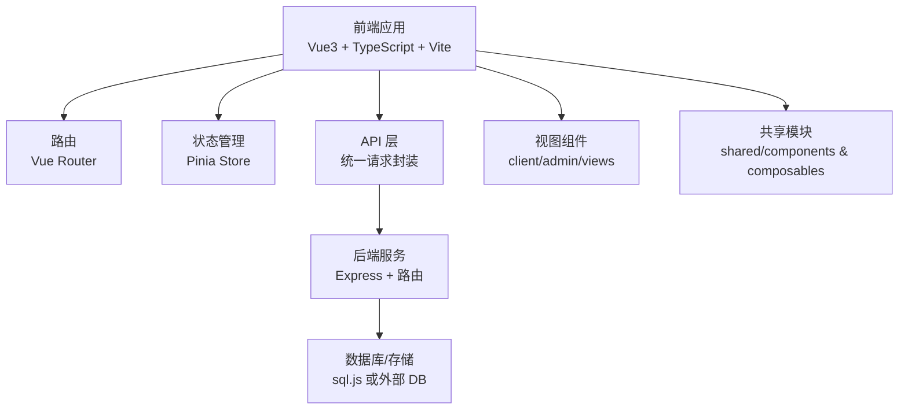
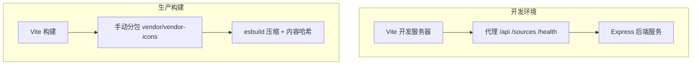
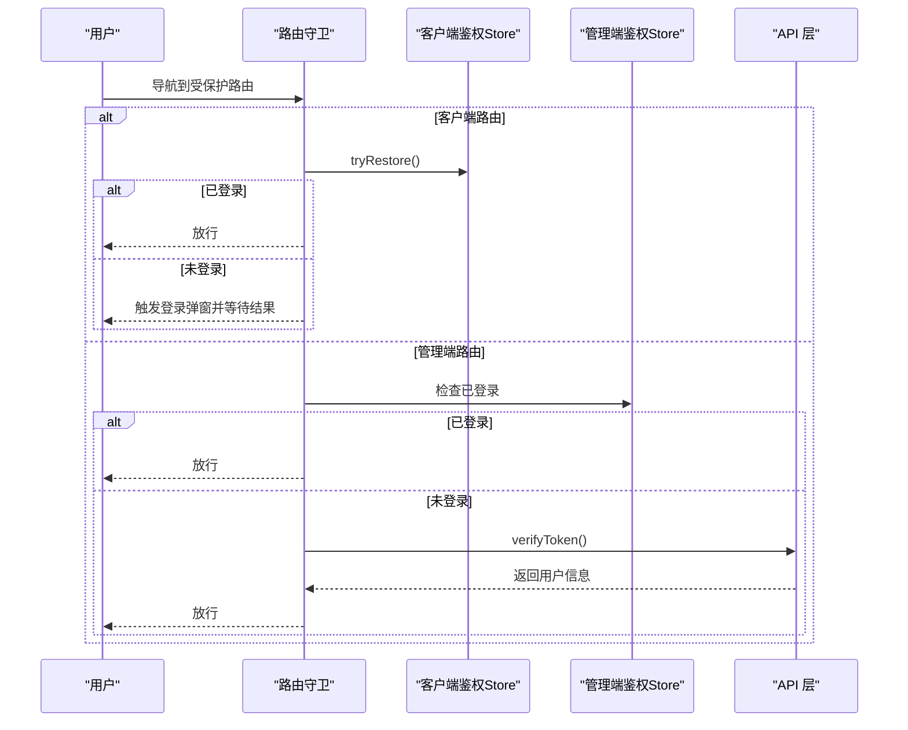
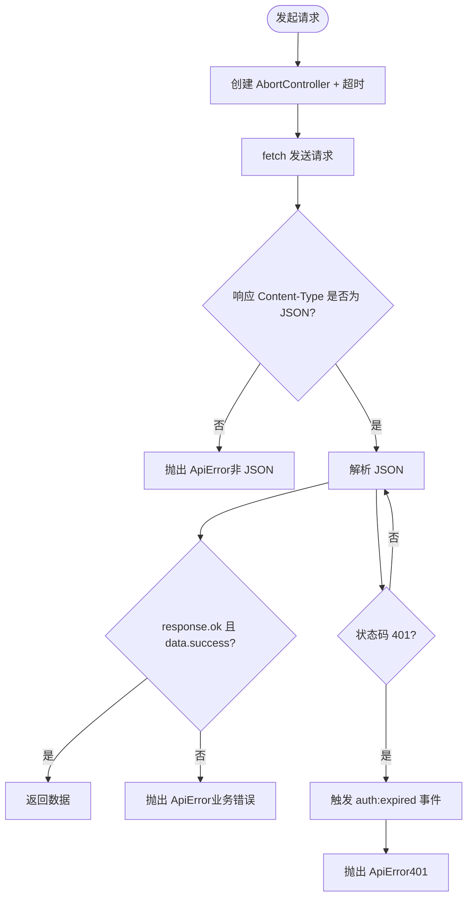
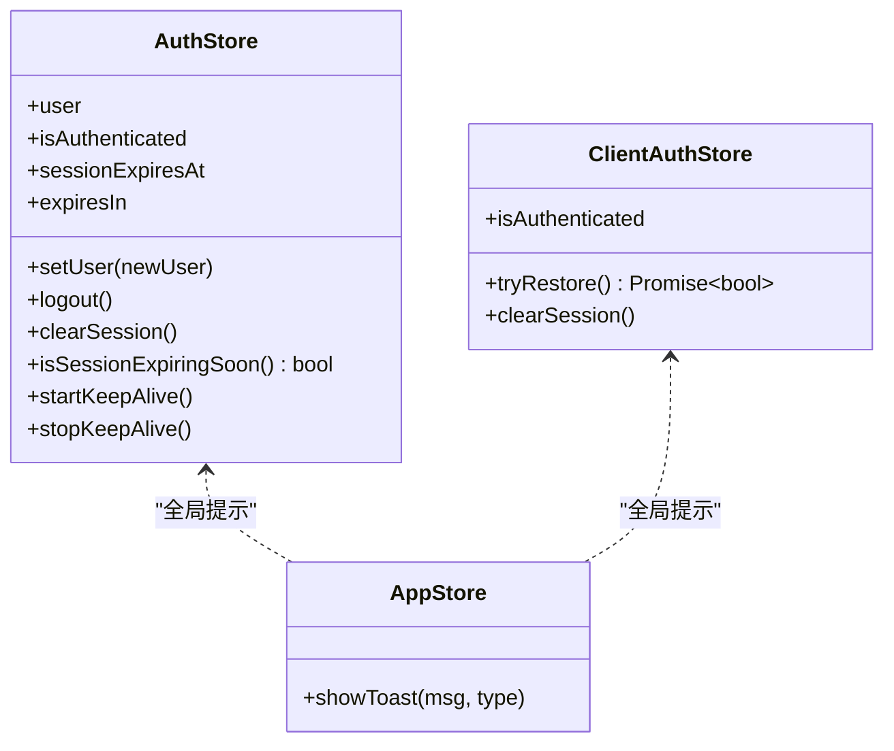
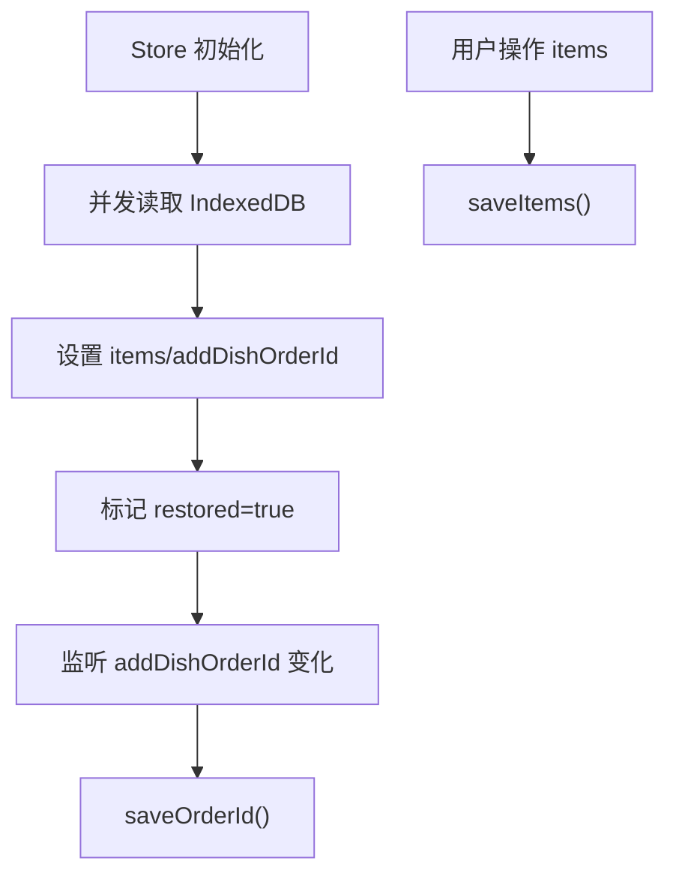
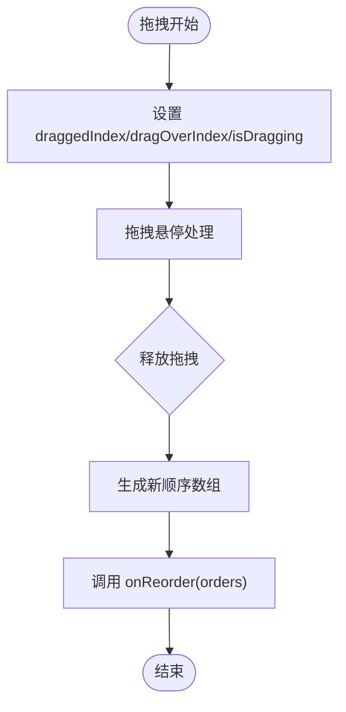
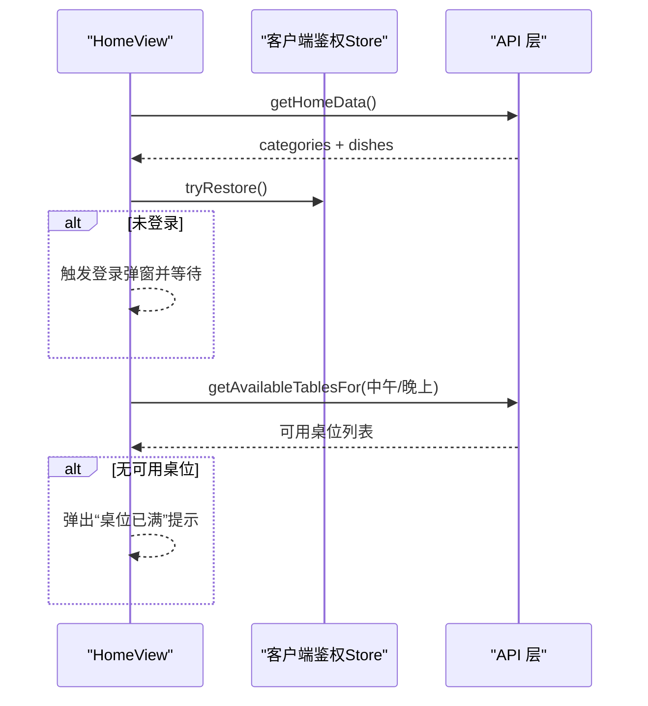
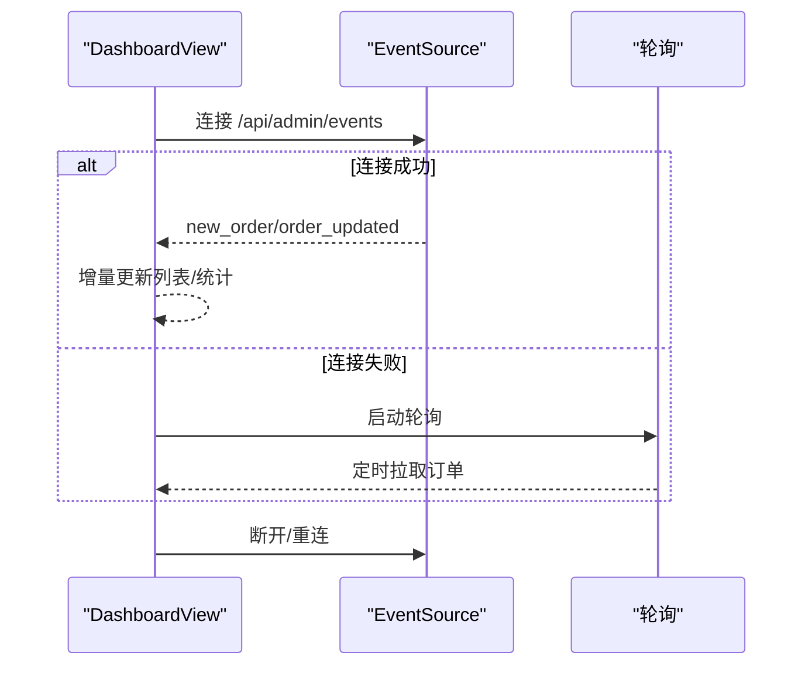
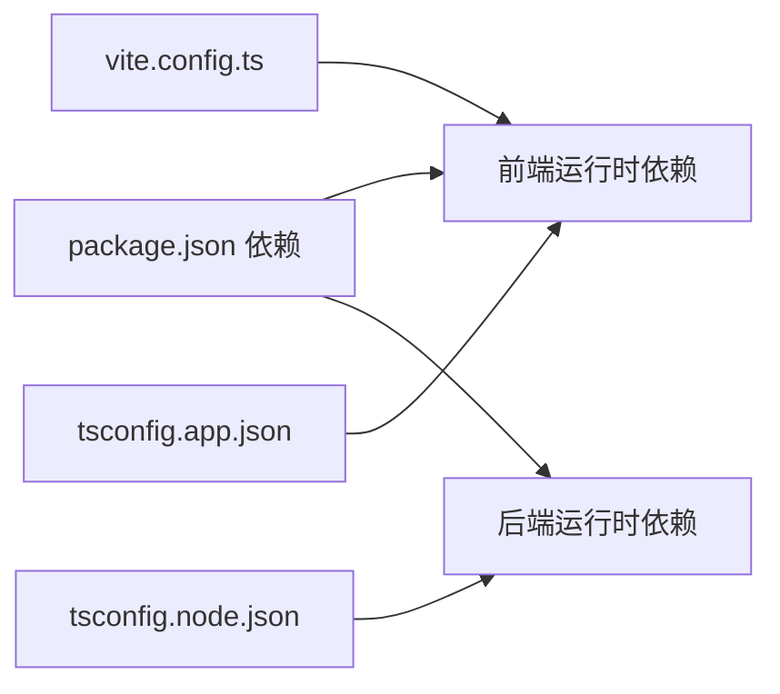

# 开发指南

<cite>
**本文引用的文件**
- [package.json](file://package.json)
- [vite.config.ts](file://vite.config.ts)
- [tsconfig.json](file://tsconfig.json)
- [tsconfig.app.json](file://tsconfig.app.json)
- [tsconfig.node.json](file://tsconfig.node.json)
- [src/main.ts](file://src/main.ts)
- [src/App.vue](file://src/App.vue)
- [src/router/index.ts](file://src/router/index.ts)
- [src/types/index.ts](file://src/types/index.ts)
- [src/api/index.ts](file://src/api/index.ts)
- [src/stores/auth.ts](file://src/stores/auth.ts)
- [src/stores/cart.ts](file://src/stores/cart.ts)
- [src/shared/composables/useDragReorder.ts](file://src/shared/composables/useDragReorder.ts)
- [src/client/views/HomeView.vue](file://src/client/views/HomeView.vue)
- [src/admin/views/DashboardView.vue](file://src/admin/views/DashboardView.vue)
</cite>

## 目录
1. [简介](#简介)
2. [项目结构](#项目结构)
3. [核心组件](#核心组件)
4. [架构总览](#架构总览)
5. [详细组件分析](#详细组件分析)
6. [依赖关系分析](#依赖关系分析)
7. [性能考量](#性能考量)
8. [故障排查指南](#故障排查指南)
9. [结论](#结论)
10. [附录](#附录)

## 简介
本开发指南面向 RL RMS 项目的新老开发者，系统化阐述项目的开发规范与最佳实践，覆盖代码风格、命名约定、目录结构；TypeScript 使用规范与类型定义最佳实践；Vue3 组件开发（Composition API 使用、组件设计原则）；状态管理（Pinia Store 设计模式与使用方法）；单元测试编写与测试框架使用；代码审查清单与质量保证流程；开发工具配置与使用建议；以及新开发者快速上手路径。

## 项目结构
项目采用“前端单页应用 + 后端服务”的前后端分离架构，前端基于 Vue3 + TypeScript + Vite，状态管理使用 Pinia，路由使用 Vue Router；后端服务通过 Express 提供 REST API，并在开发模式下与前端共享端口。

- 根目录脚本与构建
  - 使用 Vite 构建前端产物，TypeScript 类型检查与编译由 vue-tsc 与 tsc 协同完成
  - 开发模式下通过 tsx watch 启动后端服务，前端通过代理转发 /api 到后端
- 前端目录组织
  - src/admin：管理后台视图与组件
  - src/client：客户前台视图与组件
  - src/shared：跨域通用组件与组合式函数
  - src/stores：Pinia 状态管理模块
  - src/router：路由定义与守卫
  - src/types：全局类型定义
  - src/utils：通用工具（如本地存储封装）
  - src/api：统一的前端 API 封装与缓存策略
- 后端目录组织
  - server/src：Express 应用、路由、工具、验证器等
  - server/data：数据库初始化与数据
  - server/tsconfig.json：后端 TypeScript 配置

**图表来源**
- [src/main.ts:1-37](file://src/main.ts#L1-L37)
- [src/router/index.ts:1-317](file://src/router/index.ts#L1-L317)
- [src/api/index.ts:1-608](file://src/api/index.ts#L1-L608)
- [src/stores/auth.ts:1-128](file://src/stores/auth.ts#L1-L128)
- [src/stores/cart.ts:1-175](file://src/stores/cart.ts#L1-L175)

**章节来源**
- [package.json:1-64](file://package.json#L1-L64)
- [vite.config.ts:1-112](file://vite.config.ts#L1-L112)
- [tsconfig.json:1-8](file://tsconfig.json#L1-L8)
- [tsconfig.app.json:1-21](file://tsconfig.app.json#L1-L21)
- [tsconfig.node.json:1-27](file://tsconfig.node.json#L1-L27)

## 核心组件
- 应用入口与全局初始化
  - 创建应用实例、注册 Pinia 与路由、全局禁用输入拼写检查、预加载关键路由
- 应用根组件与全局事件
  - 监听 auth:expired 事件，区分管理员与客户会话过期处理
- 路由系统
  - 客户端与管理端双路由体系，带标题设置、鉴权守卫、懒加载与预取
- API 层
  - 统一封装 fetch 请求、超时与信号合并、非 JSON 防御、401 全局处理、内存缓存（stale-while-revalidate）
- 状态管理
  - 认证状态（含会话保活）、购物车（IndexedDB 持久化）、应用全局状态
- 组合式函数
  - 拖拽排序通用逻辑（useDragReorder）

**章节来源**
- [src/main.ts:1-37](file://src/main.ts#L1-L37)
- [src/App.vue:1-113](file://src/App.vue#L1-L113)
- [src/router/index.ts:1-317](file://src/router/index.ts#L1-L317)
- [src/api/index.ts:1-608](file://src/api/index.ts#L1-L608)
- [src/stores/auth.ts:1-128](file://src/stores/auth.ts#L1-L128)
- [src/stores/cart.ts:1-175](file://src/stores/cart.ts#L1-L175)
- [src/shared/composables/useDragReorder.ts:1-109](file://src/shared/composables/useDragReorder.ts#L1-L109)

## 架构总览
前端通过 Vite 构建，开发时启用代理将 /api、/sources、/health 请求转发至后端服务；生产构建对 console.log 进行移除，按依赖分包并启用 esbuild 压缩与内容哈希命名；TypeScript 采用多配置文件分别约束应用与 Node 环境。

**图表来源**
- [vite.config.ts:28-112](file://vite.config.ts#L28-L112)
- [package.json:6-14](file://package.json#L6-L14)

**章节来源**
- [vite.config.ts:1-112](file://vite.config.ts#L1-L112)
- [package.json:1-64](file://package.json#L1-L64)

## 详细组件分析

### 路由与鉴权（客户端与管理端）
- 关键特性
  - 客户端路由：首页、菜品详情、搜索、订单确认、订单详情、订单二维码、全部订单、设置等
  - 管理端路由：登录、布局、仪表盘、桌位、菜单、订单、库存、用户、设置、调试等
  - 鉴权守卫：根据 meta.requiresClientAuth / requiresAuth 控制访问；支持 Cookie 恢复与 401 全局处理
  - 预加载：应用启动后空闲预加载关键组件；导航后根据目标路由预取相关页面
- 设计要点
  - Edge 浏览器历史替换兼容性处理
  - 文档标题动态设置
  - 客户端登录弹窗通过自定义事件驱动

**图表来源**
- [src/router/index.ts:201-277](file://src/router/index.ts#L201-L277)

**章节来源**
- [src/router/index.ts:1-317](file://src/router/index.ts#L1-L317)

### API 层与错误处理
- 关键特性
  - 统一请求封装：超时控制、AbortSignal 合并、凭据携带
  - 非 JSON 响应防御：拦截非 application/json 响应
  - 401 统一处理：触发 auth:expired 全局事件
  - 内存缓存：stale-while-revalidate 策略，提升低带宽场景体验
  - 取消请求：createCancellableRequest
- 错误模型
  - 自定义 ApiError，包含 status、data
- 数据导出/导入：Blob 下载、表单上传、Content-Disposition 解析

**图表来源**
- [src/api/index.ts:54-114](file://src/api/index.ts#L54-L114)

**章节来源**
- [src/api/index.ts:1-608](file://src/api/index.ts#L1-L608)

### 认证状态管理（Pinia）
- 认证 Store（useAuthStore）
  - 用户信息、认证状态、会话过期时间
  - 会话保活：定时器周期校验 token，失败则触发 auth:expired
  - 会话即将过期判断、清理与登出
- 客户端认证 Store（useClientAuthStore）
  - 与管理端鉴权分离，支持 Cookie 恢复与登录弹窗交互
- 应用 Store（useAppStore）
  - 全局提示 Toast、全局状态

**图表来源**
- [src/stores/auth.ts:1-128](file://src/stores/auth.ts#L1-L128)

**章节来源**
- [src/stores/auth.ts:1-128](file://src/stores/auth.ts#L1-L128)

### 购物车状态管理（Pinia）
- 功能点
  - 添加/删除/修改数量、清空、序列化下单数据
  - IndexedDB 持久化：cart_items 与 addDishOrderId
  - 初始化恢复：Promise.all 并发读取，finally 标记 restored
  - 结构化克隆剥离 Proxy，避免持久化响应式对象
- 性能与可靠性
  - 仅在 restored 后持久化，避免初始化阶段写入
  - watch 监听 addDishOrderId 变化自动保存

**图表来源**
- [src/stores/cart.ts:132-160](file://src/stores/cart.ts#L132-L160)

**章节来源**
- [src/stores/cart.ts:1-175](file://src/stores/cart.ts#L1-L175)

### 组合式函数：拖拽排序（useDragReorder）
- 输入
  - items: Ref<T[]>
  - onReorder: (orders) => Promise<void>
- 输出
  - 拖拽状态与事件处理函数
- 行为
  - 计算新的排序数组，调用 onReorder 并捕获错误
  - 保存中状态 isSaving，避免重复提交

**图表来源**
- [src/shared/composables/useDragReorder.ts:13-95](file://src/shared/composables/useDragReorder.ts#L13-L95)

**章节来源**
- [src/shared/composables/useDragReorder.ts:1-109](file://src/shared/composables/useDragReorder.ts#L1-L109)

### 客户端首页（HomeView）与交互
- 关键特性
  - 首页数据缓存与懒加载骨架屏
  - 分类侧边栏滚动定位、菜品网格展示
  - 购物车抽屉、数量控制、清空确认
  - 登录弹窗、桌位满额提示
- 交互细节
  - sessionStorage 恢复滚动位置与选中分类
  - 离开路由前保存状态，避免返回时重复弹窗
  - 通过自定义事件驱动登录弹窗

**图表来源**
- [src/client/views/HomeView.vue:68-210](file://src/client/views/HomeView.vue#L68-L210)

**章节来源**
- [src/client/views/HomeView.vue:1-867](file://src/client/views/HomeView.vue#L1-L867)

### 管理端仪表盘（DashboardView）与实时推送
- 关键特性
  - 仪表盘统计卡片、订单列表、筛选与搜索
  - SSE 实时推送：新订单、订单状态变更、加菜请求
  - 降级轮询：SSE 断开后自动启用轮询
  - 清空已完成/已取消订单、批量操作
- 技术实现
  - EventSource 连接、断线重连定时器
  - 有筛选条件时全量刷新，否则增量更新
  - 自动刷新开关与状态同步

**图表来源**
- [src/admin/views/DashboardView.vue:302-446](file://src/admin/views/DashboardView.vue#L302-L446)

**章节来源**
- [src/admin/views/DashboardView.vue:1-800](file://src/admin/views/DashboardView.vue#L1-L800)

## 依赖关系分析
- 前端依赖
  - Vue3、Vue Router、Pinia、lucide-vue-next、vite、vue-tsc、tsx
- 后端依赖
  - Express、jsonwebtoken、bcryptjs、sql.js、cors、cookie-parser、compression 等
- 构建与工具
  - Vite 插件链、别名 @ -> src、生产移除 console、代码分割策略
  - TypeScript 多配置文件（应用/Node）

**图表来源**
- [package.json:16-62](file://package.json#L16-L62)
- [vite.config.ts:1-112](file://vite.config.ts#L1-L112)
- [tsconfig.app.json:1-21](file://tsconfig.app.json#L1-L21)
- [tsconfig.node.json:1-27](file://tsconfig.node.json#L1-L27)

**章节来源**
- [package.json:1-64](file://package.json#L1-L64)
- [vite.config.ts:1-112](file://vite.config.ts#L1-L112)
- [tsconfig.json:1-8](file://tsconfig.json#L1-L8)

## 性能考量
- 构建优化
  - 代码分割：vendor 与 vendor-icons 独立 chunk，提升 Tree-shaking 效果
  - esbuild 压缩与内容哈希命名，降低传输体积
  - 生产环境移除 console.* 调用，减少包体与日志泄露风险
- 运行时优化
  - API 层内存缓存（stale-while-revalidate），降低网络往返
  - 路由懒加载与预取，提升首屏与切换体验
  - 骨架屏与过渡动画，改善感知性能
- 存储与持久化
  - IndexedDB 持久化购物车，避免刷新丢失
  - 结构化克隆剥离响应式 Proxy，确保序列化安全

**章节来源**
- [vite.config.ts:63-112](file://vite.config.ts#L63-L112)
- [src/api/index.ts:5-34](file://src/api/index.ts#L5-L34)
- [src/router/index.ts:19-40](file://src/router/index.ts#L19-L40)
- [src/stores/cart.ts:112-130](file://src/stores/cart.ts#L112-L130)

## 故障排查指南
- 401 会话过期
  - 现象：全局触发 auth:expired 事件，管理员跳转登录，客户弹出登录框
  - 排查：确认 Cookie 凭据、后端 verifyToken 接口、会话保活定时器
- SSE 断开
  - 现象：自动切换轮询，断线重连定时器生效
  - 排查：网络状况、后端事件流接口、浏览器 EventSource 支持
- 购物车丢失
  - 现象：刷新后购物车为空
  - 排查：IndexedDB 可用性、持久化时机（restored 标记）、结构化克隆
- 路由跳转异常
  - 现象：Edge 浏览器历史替换行为异常
  - 排查：Edge 浏览器 UA 检测与 replaceState 包装

**章节来源**
- [src/App.vue:16-39](file://src/App.vue#L16-L39)
- [src/stores/auth.ts:37-65](file://src/stores/auth.ts#L37-L65)
- [src/admin/views/DashboardView.vue:375-391](file://src/admin/views/DashboardView.vue#L375-L391)
- [src/stores/cart.ts:112-130](file://src/stores/cart.ts#L112-L130)
- [src/router/index.ts:7-17](file://src/router/index.ts#L7-L17)

## 结论
本指南总结了 RL RMS 的开发规范与最佳实践，涵盖前端工程化、TypeScript 类型约束、Vue3 组件与 Composition API、Pinia 状态管理、API 层设计、实时推送与性能优化等方面。建议团队在日常开发中严格遵循命名与目录约定，保持类型安全与可维护性，持续完善测试与质量保障流程。

## 附录

### 代码风格与命名约定
- 目录与文件
  - 视图组件：client/views、admin/views；共享组件：shared/components
  - 组合式函数：shared/composables；状态管理：stores
- 命名
  - Store 使用 useXxx 形式导出工厂函数
  - 组件文件名采用 PascalCase，如 HomeView.vue
  - 类型接口以大写字母开头，如 User、Dish
- 路由
  - 路由名称使用帕斯卡命名，路径使用短横线分隔
- API
  - 方法名语义化，如 getHomeData、createOrder、updateOrderStatus

**章节来源**
- [src/router/index.ts:42-176](file://src/router/index.ts#L42-L176)
- [src/types/index.ts:1-133](file://src/types/index.ts#L1-L133)

### TypeScript 使用规范与类型定义最佳实践
- 配置
  - 应用层启用严格模式、未使用局部变量/参数检查、switch 无覆盖检查
  - Node 层启用严格模式与 bundler 模式
- 类型定义
  - 统一在 src/types/index.ts 定义 API 与实体类型
  - 对外暴露的接口字段明确可选/必选，避免 any
- 组件类型
  - Props 与 Emits 明确声明，避免运行时类型推断导致的脆弱性

**章节来源**
- [tsconfig.app.json:11-18](file://tsconfig.app.json#L11-L18)
- [tsconfig.node.json:17-24](file://tsconfig.node.json#L17-L24)
- [src/types/index.ts:1-133](file://src/types/index.ts#L1-L133)

### Vue3 组件开发指导（Composition API）
- 组合式函数
  - 将可复用逻辑抽象为组合式函数（如 useDragReorder），增强可测试性
- 组件设计原则
  - 单一职责、可测试性优先、避免过度耦合
  - 使用 defineAsyncComponent 做异步组件加载
- 生命周期与副作用
  - 合理使用 onMounted/onUnmounted，注意清理定时器与事件监听
- 事件与状态
  - 通过自定义事件与 Pinia Store 解耦组件间通信

**章节来源**
- [src/shared/composables/useDragReorder.ts:1-109](file://src/shared/composables/useDragReorder.ts#L1-L109)
- [src/client/views/HomeView.vue:1-867](file://src/client/views/HomeView.vue#L1-L867)

### 状态管理设计模式与使用方法
- Store 设计
  - 使用 defineStore 定义，集中管理状态与派生计算
  - 将副作用（如 API 调用、定时器）封装在 Store 内部
- 认证与购物车
  - 认证 Store：会话保活、过期处理
  - 购物车 Store：IndexedDB 持久化、结构化克隆
- 共享状态
  - App Store 统一 Toast 与全局提示

**章节来源**
- [src/stores/auth.ts:1-128](file://src/stores/auth.ts#L1-L128)
- [src/stores/cart.ts:1-175](file://src/stores/cart.ts#L1-L175)

### 单元测试与测试框架
- 建议
  - 使用 Playwright 进行端到端测试，覆盖关键用户路径（登录、下单、管理操作）
  - 对组合式函数与纯逻辑进行单元测试（如 useDragReorder）
  - 对 Store 的副作用进行模拟与断言
- 质量门禁
  - CI 中强制执行类型检查、构建与测试

**章节来源**
- [package.json:43-43](file://package.json#L43-L43)

### 代码审查清单与质量保证流程
- 代码审查清单
  - 类型安全：是否启用严格模式并通过类型检查
  - 命名一致性：组件、Store、路由、类型是否符合约定
  - 副作用隔离：API 调用、定时器、事件监听是否在 Store/生命周期中正确管理
  - 性能：是否存在不必要的重渲染、缓存与懒加载是否合理
  - 安全：401 处理、凭据传递、敏感日志输出
- 质量保证流程
  - 提交前本地运行类型检查与测试
  - CI 自动化：构建、测试、覆盖率报告
  - 代码风格检查（如 ESLint/TSC 配置）

**章节来源**
- [tsconfig.app.json:11-18](file://tsconfig.app.json#L11-L18)
- [tsconfig.node.json:17-24](file://tsconfig.node.json#L17-L24)
- [package.json:43-43](file://package.json#L43-L43)

### 开发工具配置与使用建议
- Vite
  - 代理配置：/api、/sources、/health 指向后端
  - 别名：@ -> src，提升导入可读性
  - 生产移除 console：减少包体与日志泄露
- TypeScript
  - 多配置文件：应用与 Node 分离，避免相互干扰
- 构建
  - 代码分割与内容哈希命名，便于缓存与回滚
- 调试
  - 使用浏览器 DevTools 检查网络请求、SSE 连接、事件流
  - 在 DashboardView 中利用调试工具查看 SQL 与 Schema

**章节来源**
- [vite.config.ts:28-112](file://vite.config.ts#L28-L112)
- [tsconfig.json:1-8](file://tsconfig.json#L1-L8)
- [src/admin/views/DashboardView.vue:597-608](file://src/admin/views/DashboardView.vue#L597-L608)

### 新开发者快速上手
- 环境准备
  - 安装 Node.js 与包管理器，安装依赖
- 启动项目
  - 开发：npm run dev（前端）与 npm run dev:server（后端）
  - 构建：npm run build（前端）与 npm run build:server（后端）
- 快速浏览
  - 从 HomeView 与 DashboardView 入手，理解路由与鉴权
  - 查看 useDragReorder 与购物车 Store，掌握组合式函数与状态管理
  - 阅读 API 层，理解 401 处理与缓存策略
- 贡献流程
  - 新功能先在分支开发，提交前运行类型检查与测试
  - 提交 PR 前确保通过 CI

**章节来源**
- [package.json:6-14](file://package.json#L6-L14)
- [src/main.ts:1-37](file://src/main.ts#L1-L37)
- [src/router/index.ts:1-317](file://src/router/index.ts#L1-L317)
- [src/api/index.ts:1-608](file://src/api/index.ts#L1-L608)
- [src/stores/cart.ts:1-175](file://src/stores/cart.ts#L1-L175)
- [src/shared/composables/useDragReorder.ts:1-109](file://src/shared/composables/useDragReorder.ts#L1-L109)