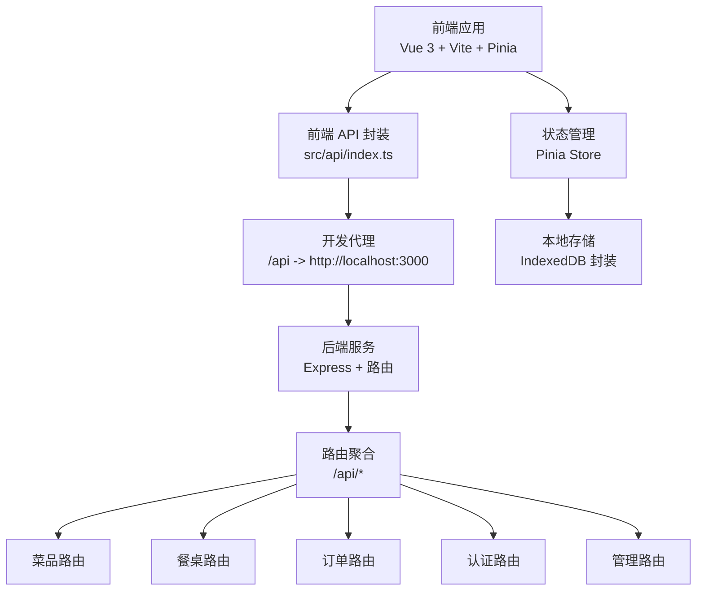
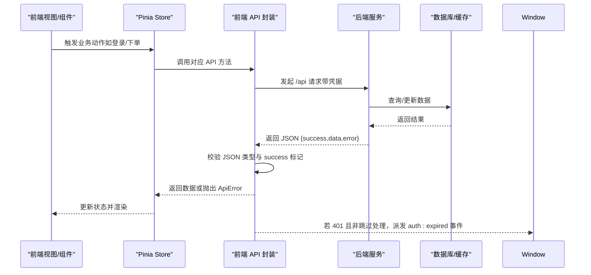
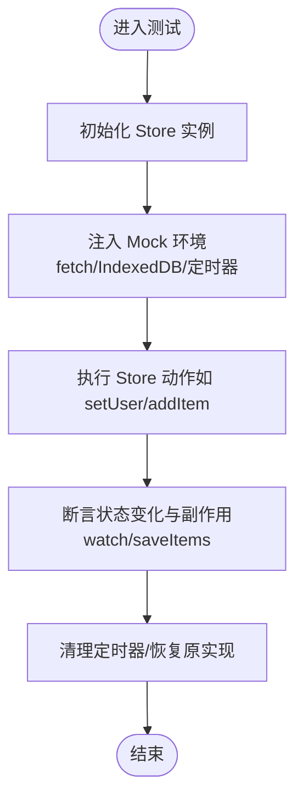
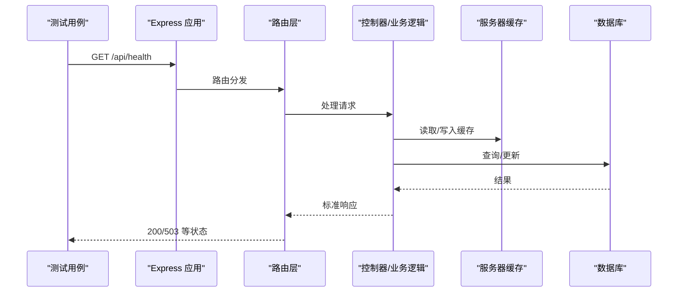
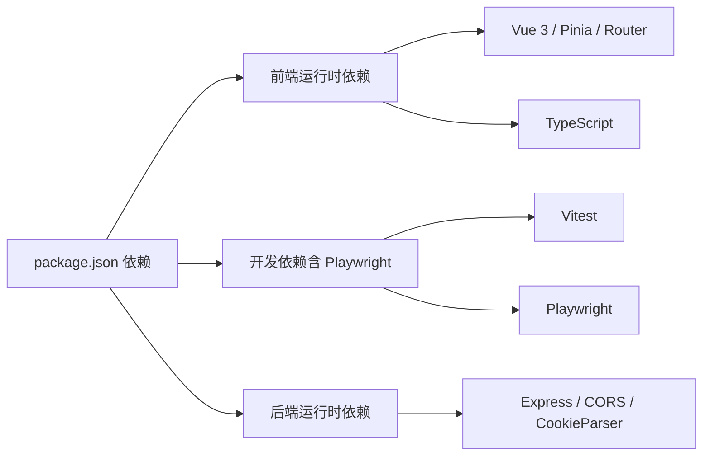

# 测试策略

<cite>
**本文引用的文件**
- [package.json](file://package.json)
- [vite.config.ts](file://vite.config.ts)
- [server/src/index.ts](file://server/src/index.ts)
- [server/src/routes/index.ts](file://server/src/routes/index.ts)
- [src/api/index.ts](file://src/api/index.ts)
- [src/stores/auth.ts](file://src/stores/auth.ts)
- [src/stores/cart.ts](file://src/stores/cart.ts)
- [src/utils/storage.ts](file://src/utils/storage.ts)
- [server/src/utils/cache.ts](file://server/src/utils/cache.ts)
- [src/types/index.ts](file://src/types/index.ts)
</cite>

## 目录
1. [引言](#引言)
2. [项目结构](#项目结构)
3. [核心组件](#核心组件)
4. [架构总览](#架构总览)
5. [详细组件分析](#详细组件分析)
6. [依赖分析](#依赖分析)
7. [性能考虑](#性能考虑)
8. [故障排查指南](#故障排查指南)
9. [结论](#结论)
10. [附录](#附录)

## 引言
本测试策略面向 RLRMS 项目，覆盖前端组件测试、Pinia 状态管理测试、后端 API 测试与集成测试。目标是建立统一的测试框架选择与配置规范，明确测试用例设计原则（含边界条件、异常处理、性能测试），设定覆盖率门槛，并在持续集成中落地自动化测试流程。同时提供 Mock 数据准备与测试环境搭建建议。

## 项目结构
- 前端基于 Vue 3 + Vite，采用 Pinia 状态管理，通过自定义 API 封装层调用后端 /api 路由。
- 后端基于 Express，路由按功能拆分（dishes、tables、orders、auth、admin），统一挂载于 /api 前缀。
- 前端与后端通过代理在开发模式下连通；生产模式下后端托管前端构建产物并提供 SPA 回退。
- 前端状态持久化使用 IndexedDB（封装于 storage 工具），Pinia Store 提供会话与购物车状态管理。

图表来源
- [vite.config.ts:48-61](file://vite.config.ts#L48-L61)
- [server/src/index.ts:88](file://server/src/index.ts#L88)
- [server/src/routes/index.ts:10-17](file://server/src/routes/index.ts#L10-L17)

章节来源
- [vite.config.ts:28-62](file://vite.config.ts#L28-L62)
- [server/src/index.ts:34-143](file://server/src/index.ts#L34-L143)
- [server/src/routes/index.ts:1-18](file://server/src/routes/index.ts#L1-L18)

## 核心组件
- 前端 API 封装层：统一请求、超时、取消、401 处理、JSON 响应校验、前端缓存（stale-while-revalidate）。
- Pinia 状态管理：认证状态（会话过期、保活）、购物车（增删改清、持久化、恢复）。
- 后端路由：菜品、餐桌、订单、认证、管理端接口；统一错误处理与健康检查。
- 本地存储：IndexedDB 封装，提供懒加载、事务读写、升级建表能力。

章节来源
- [src/api/index.ts:54-126](file://src/api/index.ts#L54-L126)
- [src/stores/auth.ts:15-127](file://src/stores/auth.ts#L15-L127)
- [src/stores/cart.ts:9-182](file://src/stores/cart.ts#L9-L182)
- [server/src/index.ts:122-140](file://server/src/index.ts#L122-L140)
- [src/utils/storage.ts:11-108](file://src/utils/storage.ts#L11-L108)

## 架构总览
以下序列图展示前端调用后端 API 的典型流程，以及认证过期事件的传播路径。

图表来源
- [src/api/index.ts:54-114](file://src/api/index.ts#L54-L114)
- [server/src/index.ts:122-140](file://server/src/index.ts#L122-L140)

## 详细组件分析

### 前端组件测试策略
- 测试目标
  - 组件渲染与交互行为（点击、输入、切换）。
  - 与 Pinia Store 的绑定逻辑（读取状态、派发动作）。
  - 与 API 封装层的交互（请求发起、错误处理、加载态）。
- 推荐框架
  - 单元测试：Vitest（与 Vite 生态无缝衔接）。
  - 集成/端到端：Playwright（已作为 devDependency 引入）。
- Mock 与夹具
  - 使用 Vitest 的 mock 功能拦截 fetch、API 方法与 Store 动作。
  - 准备最小化类型数据（遵循 src/types/index.ts）作为夹具。
- 边界与异常
  - 网络超时、401 未授权、非 JSON 响应、后端返回 error 字段。
  - IndexedDB 不可用时的状态降级。
- 示例关注点（不展示具体代码）
  - 登录流程：用户名/密码为空、401、成功登录后的会话初始化。
  - 购物车：添加/删除/修改数量、持久化恢复、清空。
  - 列表页：分页/搜索/缓存命中与失效。

章节来源
- [src/api/index.ts:54-126](file://src/api/index.ts#L54-L126)
- [src/stores/cart.ts:133-150](file://src/stores/cart.ts#L133-L150)
- [src/types/index.ts:1-133](file://src/types/index.ts#L1-L133)

### Pinia 状态测试策略
- 认证状态（useAuthStore）
  - 会话过期时间计算、即将过期判断、保活定时器启停。
  - 登出与清理流程、401 触发的过期事件。
- 购物车状态（useCartStore）
  - 增删改清、总数/总价计算、持久化与恢复、防抖保存。
- 测试要点
  - 时间推进（mock 定时器与 Date.now）。
  - IndexedDB 读写操作的异步与错误场景。
  - 计算属性的正确性与副作用（watch/saveItems）。

图表来源
- [src/stores/auth.ts:37-55](file://src/stores/auth.ts#L37-L55)
- [src/stores/cart.ts:113-130](file://src/stores/cart.ts#L113-L130)

章节来源
- [src/stores/auth.ts:15-127](file://src/stores/auth.ts#L15-L127)
- [src/stores/cart.ts:9-182](file://src/stores/cart.ts#L9-L182)
- [src/utils/storage.ts:42-91](file://src/utils/storage.ts#L42-L91)

### 后端 API 测试策略
- 路由组织
  - /api/dishes、/api/tables、/api/orders、/api/auth、/api/admin。
- 关键测试场景
  - 健康检查 /health（数据库初始化状态）。
  - 认证中间件与 401 处理。
  - 参数校验与 400 错误。
  - 缓存失效与一致性（服务器端 TTL 缓存）。
- 推荐工具
  - Supertest（对 Express 应用进行 HTTP 层测试）。
  - Jest 或 Vitest（统一测试运行器，结合 Supertest）。
- Mock 与夹具
  - 使用内存数据库或 SQL.js 进行快速回放。
  - 对外部依赖（如文件上传、导出）使用假实现或临时目录。

图表来源
- [server/src/index.ts:90-96](file://server/src/index.ts#L90-L96)
- [server/src/index.ts:70-79](file://server/src/index.ts#L70-L79)
- [server/src/utils/cache.ts:18-36](file://server/src/utils/cache.ts#L18-L36)

章节来源
- [server/src/routes/index.ts:1-18](file://server/src/routes/index.ts#L1-L18)
- [server/src/index.ts:34-143](file://server/src/index.ts#L34-L143)
- [server/src/utils/cache.ts:1-73](file://server/src/utils/cache.ts#L1-L73)

### 测试用例设计原则
- 边界条件
  - 数值边界（价格、数量、容量）、空值与空数组、空字符串。
  - 时间边界（会话过期阈值、缓存 TTL、定时器间隔）。
- 异常情况
  - 网络中断、超时、401/403/404/500。
  - 非 JSON 响应、字段缺失、类型不符。
  - IndexedDB 不可用或读写失败。
- 性能测试
  - 接口响应时间（含缓存命中与未命中）。
  - 大列表渲染与虚拟滚动（如适用）。
  - 并发请求与防抖保存的稳定性。

章节来源
- [src/api/index.ts:84-114](file://src/api/index.ts#L84-L114)
- [src/stores/cart.ts:154-158](file://src/stores/cart.ts#L154-L158)
- [server/src/utils/cache.ts:13](file://server/src/utils/cache.ts#L13)

### 测试覆盖率与持续集成
- 覆盖率门槛建议
  - 语句覆盖率：≥80%
  - 分支覆盖率：≥70%
  - 函数覆盖率：≥85%
  - 行覆盖率：≥80%
- CI 流程建议
  - 安装依赖 → 启动数据库/缓存 → 运行后端测试（Supertest）→ 运行前端测试（Vitest）→ 生成覆盖率报告 → 上传报告。
  - E2E 可选在专用阶段运行（如 Playwright）。
- Mock 数据准备
  - 基于 src/types/index.ts 的接口类型，构造最小可运行的夹具。
  - 为不同场景（正常、异常、边界）准备多套数据集。

章节来源
- [src/types/index.ts:1-133](file://src/types/index.ts#L1-L133)

### 测试环境搭建
- 开发代理
  - Vite 代理将 /api、/sources、/health 转发至后端（见 vite.config.ts）。
- 后端启动
  - 通过脚本启动后端服务，或在 CI 中使用临时数据库。
- 前端测试
  - 在 Vitest 中配置别名与环境变量，确保与生产一致的模块解析。
- 数据隔离
  - 使用独立的测试数据库或内存数据库，避免污染生产数据。

章节来源
- [vite.config.ts:48-61](file://vite.config.ts#L48-L61)
- [server/src/index.ts:164-175](file://server/src/index.ts#L164-L175)

## 依赖分析
- 前端依赖
  - Vue 3、Pinia、Vue Router、Vite、TypeScript。
  - 已引入 Playwright（devDependency），可用于 E2E。
- 后端依赖
  - Express、CORS、Cookie Parser、Compression、dotenv。
  - 路由按模块划分，利于测试拆分与隔离。
- 测试工具链
  - 建议：Vitest（前端单元测试）+ Supertest（后端 API 测试）+ Playwright（E2E）。
  - 与现有包管理脚本配合，统一在 npm/yarn scripts 中编排。

图表来源
- [package.json:16-62](file://package.json#L16-L62)

章节来源
- [package.json:1-64](file://package.json#L1-L64)

## 性能考虑
- 前端缓存
  - 前端请求层采用 stale-while-revalidate 缓存，减少重复请求。
  - Pinia Store 的持久化与防抖保存需避免频繁写入 IndexedDB。
- 后端缓存
  - 服务器端 TTL 缓存用于热点数据（分类、菜品列表、设置等）。
- 性能测试建议
  - 使用 Vitest 的计时与 Supertest 的基准测试。
  - 关注大列表渲染、并发请求与缓存命中率。

章节来源
- [src/api/index.ts:17-34](file://src/api/index.ts#L17-L34)
- [server/src/utils/cache.ts:18-36](file://server/src/utils/cache.ts#L18-L36)
- [src/stores/cart.ts:154-158](file://src/stores/cart.ts#L154-L158)

## 故障排查指南
- 常见问题
  - 401 未授权：确认前端是否正确携带凭据与处理 auth:expired 事件。
  - 非 JSON 响应：检查后端 content-type 与错误处理器。
  - 数据库未就绪：/health 返回 initializing 时等待初始化完成。
  - IndexedDB 不可用：Store 恢复逻辑需容错处理。
- 调试建议
  - 打开浏览器网络面板与后端日志。
  - 在 Vitest 中开启详细断言与堆栈打印。
  - 使用 Supertest 输出请求/响应详情。

章节来源
- [src/api/index.ts:84-114](file://src/api/index.ts#L84-L114)
- [server/src/index.ts:70-79](file://server/src/index.ts#L70-L79)
- [src/stores/cart.ts:145-147](file://src/stores/cart.ts#L145-L147)

## 结论
通过统一的测试框架（Vitest + Supertest + Playwright）、清晰的测试用例设计原则与覆盖率门槛，结合前端缓存与后端 TTL 缓存策略，可在保证质量的同时提升开发效率。建议在 CI 中自动执行单元与集成测试，并在 PR 中强制覆盖率阈值，逐步完善 E2E 覆盖。

## 附录
- 测试文件命名建议
  - 前端：*.spec.ts（Vitest）；组件测试以 .component.spec.ts 结尾。
  - 后端：*.test.ts（Supertest）；路由测试以 .route.test.ts 结尾。
- Mock 数据模板
  - 参考 src/types/index.ts 的接口定义，按需裁剪字段。
- 脚本扩展建议
  - 新增 test:unit、test:integration、test:e2e、test:coverage 等脚本，统一入口。