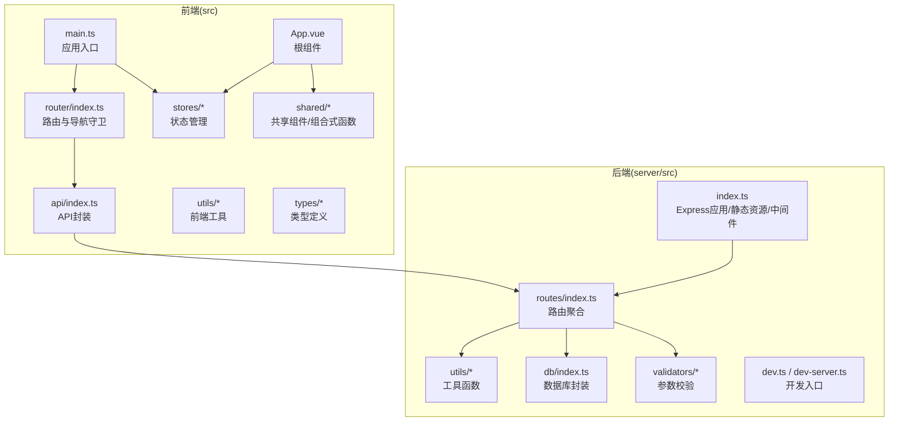
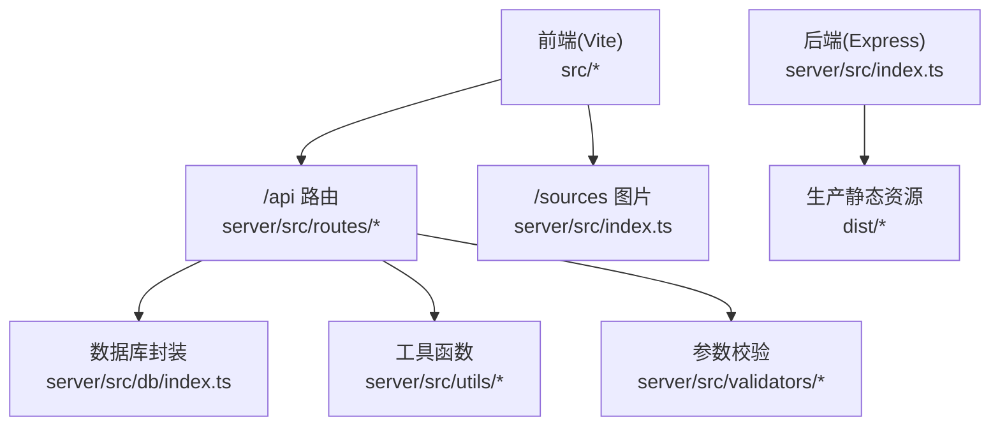
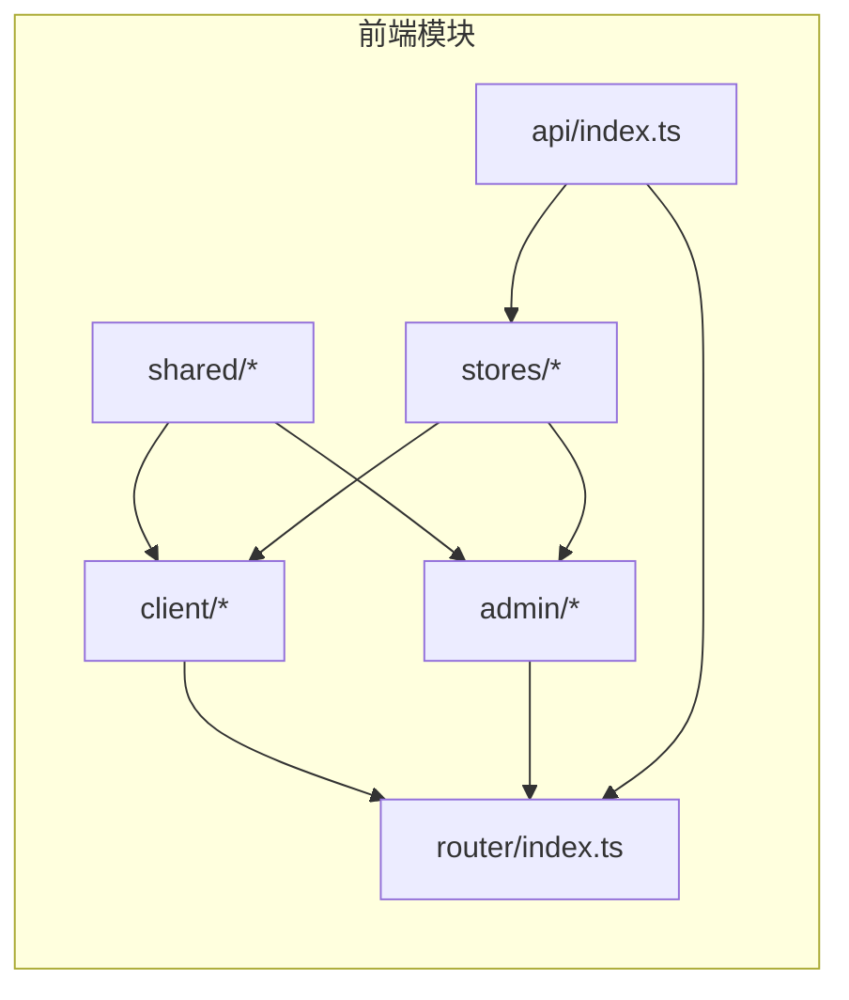
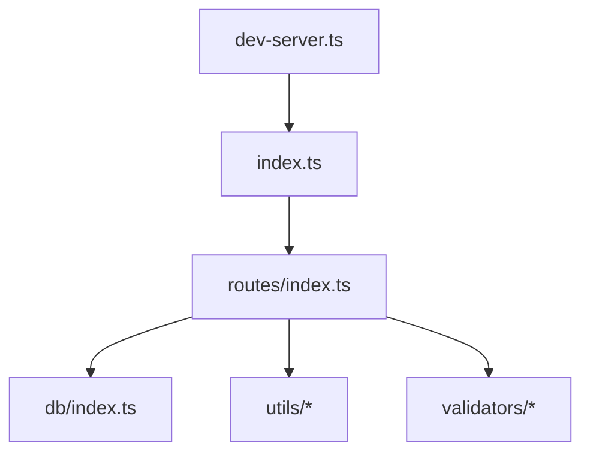
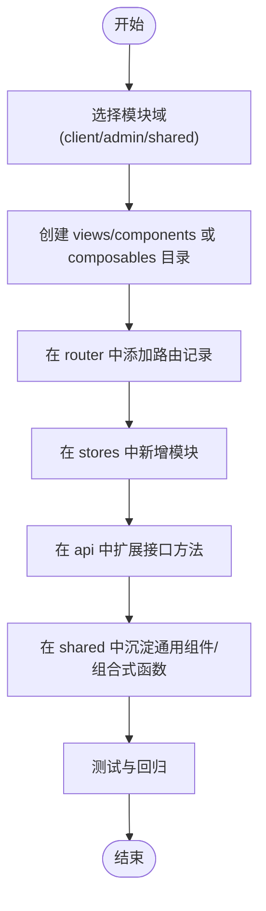
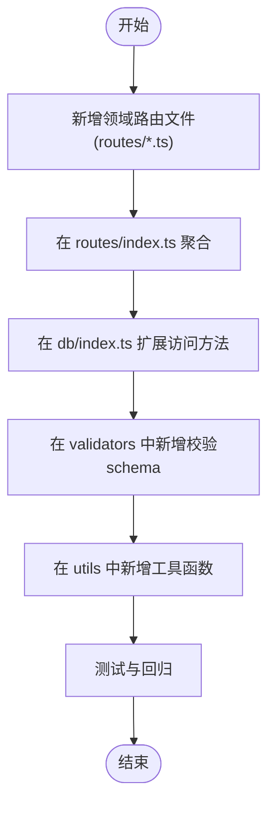
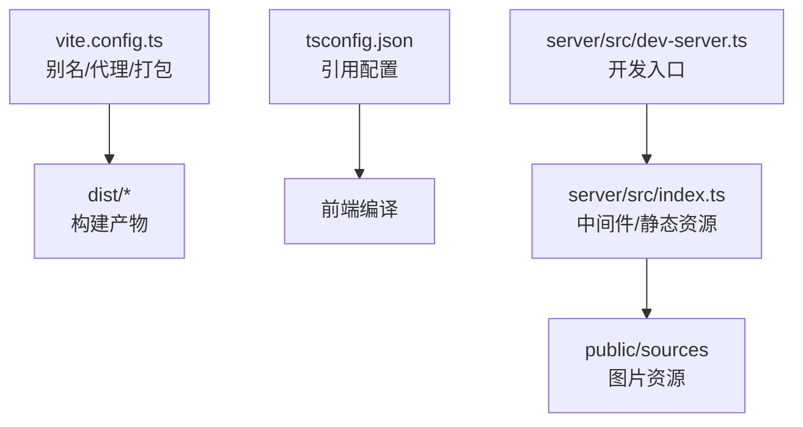
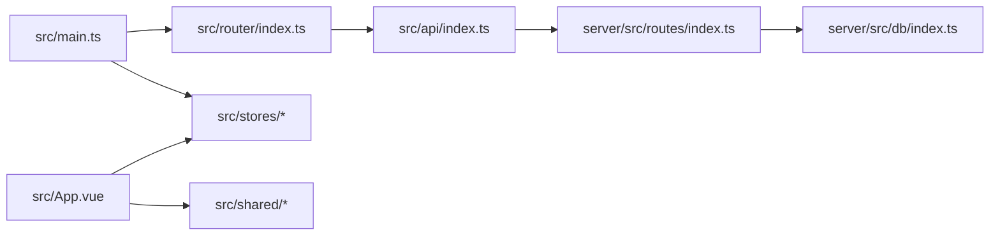

# 目录结构约定

<cite>
**本文引用的文件**
- [src/main.ts](file://src/main.ts)
- [src/router/index.ts](file://src/router/index.ts)
- [src/App.vue](file://src/App.vue)
- [src/stores/app.ts](file://src/stores/app.ts)
- [src/shared/components/Toast.vue](file://src/shared/components/Toast.vue)
- [src/api/index.ts](file://src/api/index.ts)
- [server/src/index.ts](file://server/src/index.ts)
- [server/src/dev-server.ts](file://server/src/dev-server.ts)
- [server/src/routes/index.ts](file://server/src/routes/index.ts)
- [server/src/utils/cache.ts](file://server/src/utils/cache.ts)
- [server/src/db/index.ts](file://server/src/db/index.ts)
- [vite.config.ts](file://vite.config.ts)
- [tsconfig.json](file://tsconfig.json)
- [package.json](file://package.json)
- [README.md](file://README.md)
</cite>

## 目录

1. [引言](#引言)
2. [项目结构](#项目结构)
3. [核心组件](#核心组件)
4. [架构总览](#架构总览)
5. [详细组件分析](#详细组件分析)
6. [依赖关系分析](#依赖关系分析)
7. [性能考量](#性能考量)
8. [故障排查指南](#故障排查指南)
9. [结论](#结论)
10. [附录](#附录)

## 引言
本文件旨在为 RLRMS 项目建立统一的目录结构约定，明确前端 src 与后端 server/src 的模块职责、分层架构与文件命名规范，并提供新增功能模块时的创建流程、静态资源与配置文件的组织方式，以及模块化开发与组件复用的最佳实践。

## 项目结构
- 前端 src 目录采用“按功能域分层 + 模块化”的组织方式：
  - client：顾客端页面与组件
  - admin：管理端页面与组件
  - shared：跨域复用的通用组件与组合式函数
  - stores：Pinia 状态管理模块
  - router：路由定义与导航守卫
  - api：统一 API 请求封装与缓存策略
  - utils：前端工具函数
  - types：全局类型定义
- 后端 server/src 目录采用“按职责分层 + 路由聚合”的组织方式：
  - routes：REST API 路由模块（按领域拆分）
  - utils：通用工具函数（缓存、格式化、JWT、SSE 等）
  - validators：请求参数校验（Zod）
  - db：数据库初始化与访问封装
  - types：类型声明
  - dev.ts / dev-server.ts：开发模式入口
  - index.ts：Express 应用创建与生产入口

**图表来源**
- [src/main.ts:1-37](file://src/main.ts#L1-L37)
- [src/router/index.ts:1-317](file://src/router/index.ts#L1-L317)
- [src/App.vue:1-113](file://src/App.vue#L1-L113)
- [src/api/index.ts:1-608](file://src/api/index.ts#L1-L608)
- [server/src/index.ts:1-171](file://server/src/index.ts#L1-L171)
- [server/src/routes/index.ts:1-18](file://server/src/routes/index.ts#L1-L18)
- [server/src/db/index.ts:1-156](file://server/src/db/index.ts#L1-L156)

**章节来源**
- [README.md:61-174](file://README.md#L61-L174)

## 核心组件
- 应用入口与挂载
  - 前端入口负责创建应用实例、挂载路由与状态管理，并进行全局行为初始化（如拼写检查禁用、预加载关键路由）。
  - 后端入口负责创建 Express 应用、配置中间件、静态资源托管、路由挂载与错误处理。
- 路由与导航守卫
  - 前端路由区分顾客端与管理端，支持标题动态设置、登录态校验与登录模态触发。
  - 后端路由按领域聚合，提供公开 API 与管理端 API，并在开发模式下支持热更新。
- 状态管理与共享组件
  - 应用状态（主题、加载、Toast、调试模式）集中于 app store；Toast 组件作为全局提示展示。
- API 封装与缓存
  - 前端提供统一的请求封装、超时与取消能力、401 处理与全局事件派发；实现前端内存缓存（stale-while-revalidate）。
  - 后端提供 TTL 内存缓存与批量写入优化，保障读写性能与一致性。

**章节来源**
- [src/main.ts:1-37](file://src/main.ts#L1-L37)
- [src/router/index.ts:19-317](file://src/router/index.ts#L19-L317)
- [src/App.vue:16-48](file://src/App.vue#L16-L48)
- [src/stores/app.ts:14-122](file://src/stores/app.ts#L14-L122)
- [src/shared/components/Toast.vue:1-138](file://src/shared/components/Toast.vue#L1-138)
- [src/api/index.ts:54-127](file://src/api/index.ts#L54-L127)
- [server/src/index.ts:33-142](file://server/src/index.ts#L33-L142)
- [server/src/routes/index.ts:1-18](file://server/src/routes/index.ts#L1-L18)
- [server/src/utils/cache.ts:1-73](file://server/src/utils/cache.ts#L1-L73)
- [server/src/db/index.ts:76-156](file://server/src/db/index.ts#L76-L156)

## 架构总览
- 前后端分离架构，前端通过 /api 与 /sources 访问后端；开发模式下 Vite 代理转发。
- 前端采用 Vue 3 + Vite + TypeScript + Pinia + Vue Router；后端采用 Express + sql.js + Zod。
- 静态资源组织：public/sources 用于上传图片；生产环境静态资源 dist 与 assets 分离缓存。
- 数据库：SQLite（sql.js）文件位于 server/data/restaurant.db，支持批量写入与去抖保存。

**图表来源**
- [server/src/index.ts:80-119](file://server/src/index.ts#L80-L119)
- [server/src/routes/index.ts:10-18](file://server/src/routes/index.ts#L10-L18)
- [server/src/db/index.ts:76-98](file://server/src/db/index.ts#L76-L98)
- [vite.config.ts:48-62](file://vite.config.ts#L48-L62)

## 详细组件分析

### 前端模块职责划分
- client 模块
  - 职责：顾客端页面与交互组件，如首页、菜品详情、订单流程、搜索、设置等。
  - 关联：与路由 clientRoutes 对应；依赖 api 与 stores。
- admin 模块
  - 职责：管理端页面与组件，如登录、仪表盘、桌位/菜品/订单/库存/用户/设置等。
  - 关联：路由 adminRoutes 与子路由；依赖 api 与 stores。
- shared 模块
  - 职责：跨域复用的通用组件（如 Toast、Loading、Modal、QuantityControl 等）与组合式函数（拖拽排序、订单轮询、交错动画等）。
  - 关联：被 client 与 admin 视图复用。
- stores 模块
  - 职责：Pinia 状态管理，如 app（主题、Toast、调试模式）、auth（管理端认证）、cart（购物车）、clientAuth（顾客端认证）、table（桌位）。
- router 模块
  - 职责：路由定义、导航守卫（标题设置、登录态校验、登录模态触发）、路由预取与预加载。
- api 模块
  - 职责：统一请求封装、超时/取消、401 全局处理、前端内存缓存（stale-while-revalidate）。
- utils 与 types
  - 职责：前端工具函数与全局类型定义。

**图表来源**
- [src/router/index.ts:42-176](file://src/router/index.ts#L42-L176)
- [src/api/index.ts:128-608](file://src/api/index.ts#L128-L608)
- [src/stores/app.ts:14-122](file://src/stores/app.ts#L14-L122)

**章节来源**
- [src/router/index.ts:42-176](file://src/router/index.ts#L42-L176)
- [src/api/index.ts:128-608](file://src/api/index.ts#L128-L608)
- [src/stores/app.ts:14-122](file://src/stores/app.ts#L14-L122)
- [src/shared/components/Toast.vue:1-138](file://src/shared/components/Toast.vue#L1-138)

### 后端分层架构
- routes 层
  - 职责：REST API 路由定义与聚合，按领域拆分（dishes、tables、orders、auth、admin）。
  - 关联：与 db、utils、validators 协作。
- utils 层
  - 职责：通用工具函数，如缓存（TTL 内存缓存）、格式化、JWT、SSE 等。
- validators 层
  - 职责：请求参数校验（Zod schema），确保输入合法性。
- db 层
  - 职责：数据库初始化、连接、事务与批量写入、查询封装、去抖保存。
- dev 与 index
  - 职责：开发模式入口（集成/分离），生产入口（中间件/静态资源/错误处理）。

**图表来源**
- [server/src/routes/index.ts:1-18](file://server/src/routes/index.ts#L1-L18)
- [server/src/db/index.ts:76-156](file://server/src/db/index.ts#L76-L156)
- [server/src/utils/cache.ts:1-73](file://server/src/utils/cache.ts#L1-L73)
- [server/src/index.ts:33-142](file://server/src/index.ts#L33-L142)
- [server/src/dev-server.ts:1-13](file://server/src/dev-server.ts#L1-L13)

**章节来源**
- [server/src/routes/index.ts:1-18](file://server/src/routes/index.ts#L1-L18)
- [server/src/utils/cache.ts:1-73](file://server/src/utils/cache.ts#L1-L73)
- [server/src/db/index.ts:76-156](file://server/src/db/index.ts#L76-L156)
- [server/src/index.ts:33-142](file://server/src/index.ts#L33-L142)
- [server/src/dev-server.ts:1-13](file://server/src/dev-server.ts#L1-L13)

### 新增功能模块规范

#### 前端新增模块步骤
- 选择模块域
  - 顾客端：在 src/client 下创建 views 与 components 子目录，按页面与组件命名。
  - 管理端：在 src/admin 下创建 views 与 components 子目录，按页面与组件命名。
  - 共享模块：在 src/shared 下创建 components 或 composables 子目录，遵循复用性设计。
- 路由接入
  - 在 src/router/index.ts 中按域添加路由记录，设置 meta 标题与鉴权标志。
  - 如需预加载，调用预加载函数并在合适时机触发。
- 状态管理
  - 在 src/stores 下新增模块，使用 defineStore 定义状态与方法。
- API 调用
  - 在 src/api/index.ts 中扩展对应接口方法，必要时增加缓存键与 TTL。
- 组件复用
  - 优先在 shared 中沉淀通用组件与组合式函数，减少重复代码。

**章节来源**
- [src/router/index.ts:42-176](file://src/router/index.ts#L42-L176)
- [src/api/index.ts:128-608](file://src/api/index.ts#L128-L608)
- [src/stores/app.ts:14-122](file://src/stores/app.ts#L14-L122)

#### 后端新增模块步骤
- 路由模块
  - 在 server/src/routes 下新增领域路由文件（如 dishes.ts、orders.ts），导出 Router 实例。
  - 在 server/src/routes/index.ts 中聚合新路由。
- 业务逻辑
  - 在对应领域文件中实现路由处理函数，调用 db 与 utils，使用 validators 校验参数。
- 数据访问
  - 在 server/src/db/index.ts 中扩展查询/写入方法，必要时使用批量写入与去抖保存。
- 工具与校验
  - 在 server/src/utils 与 server/src/validators 中新增工具与 Zod schema。

**章节来源**
- [server/src/routes/index.ts:1-18](file://server/src/routes/index.ts#L1-L18)
- [server/src/db/index.ts:76-156](file://server/src/db/index.ts#L76-L156)
- [server/src/utils/cache.ts:1-73](file://server/src/utils/cache.ts#L1-L73)

### 文件命名约定
- 目录命名
  - views：页面组件集合
  - components：可复用组件集合
  - composables：组合式函数（use 前缀）
  - stores：状态模块
  - utils：工具函数
  - api：API 封装
  - types：类型定义
- 文件命名
  - 页面视图：使用 View 后缀（如 HomeView.vue）
  - 组件：使用具体语义名称（如 CartDrawer.vue、DishCard.vue）
  - 组合式函数：useXxx.ts（如 useDragReorder.ts）
  - 状态模块：小驼峰（如 app.ts、auth.ts）
  - API 方法：语义化（如 getDishes、createOrder）

**章节来源**
- [README.md:589-599](file://README.md#L589-L599)

### 模块化开发最佳实践
- 单一职责：每个模块聚焦一个业务域，避免交叉耦合。
- 组件复用：优先在 shared 中沉淀通用组件与组合式函数，降低重复。
- 状态收敛：将跨页面共享的状态放入 stores，避免 props/emit 逐层传递。
- 导航守卫：在 router 中集中处理鉴权与登录态恢复，保持页面纯净。
- 错误处理：统一在 api 与 App.vue 中处理 401 与全局事件，避免分散逻辑。

**章节来源**
- [src/router/index.ts:201-277](file://src/router/index.ts#L201-L277)
- [src/App.vue:16-48](file://src/App.vue#L16-L48)
- [src/api/index.ts:54-127](file://src/api/index.ts#L54-L127)

### 静态资源与配置组织
- 静态资源
  - 上传图片：public/sources，后端通过 /sources 暴露；生产环境开启长缓存与不可变 ETag。
  - 前端构建产物：dist，生产环境静态资源 assets 分离缓存，入口 index.html 不长期缓存。
- 配置文件
  - 前端：vite.config.ts（别名、代理、代码分割、生产移除 console）、tsconfig.json（引用 tsconfig.app/node.json）。
  - 后端：server/src/index.ts（中间件、CORS、压缩、安全头、错误处理）、server/src/dev-server.ts（开发入口）。
  - 包管理：package.json（脚本、依赖、开发依赖）。

**图表来源**
- [vite.config.ts:28-112](file://vite.config.ts#L28-L112)
- [tsconfig.json:1-8](file://tsconfig.json#L1-L8)
- [server/src/index.ts:80-119](file://server/src/index.ts#L80-L119)
- [server/src/dev-server.ts:1-13](file://server/src/dev-server.ts#L1-L13)

**章节来源**
- [vite.config.ts:28-112](file://vite.config.ts#L28-L112)
- [tsconfig.json:1-8](file://tsconfig.json#L1-L8)
- [server/src/index.ts:80-119](file://server/src/index.ts#L80-L119)
- [server/src/dev-server.ts:1-13](file://server/src/dev-server.ts#L1-L13)

## 依赖关系分析
- 前端依赖
  - main.ts 依赖 router、stores、style.css；router 依赖 api 与 stores；App.vue 依赖 stores 与 shared 组件。
- 后端依赖
  - index.ts 依赖 db/init 与 routes/index；routes/index 聚合各领域路由；db/index 提供数据库访问。

**图表来源**
- [src/main.ts:1-12](file://src/main.ts#L1-L12)
- [src/router/index.ts:1-6](file://src/router/index.ts#L1-L6)
- [src/App.vue:1-14](file://src/App.vue#L1-L14)
- [src/api/index.ts:1-5](file://src/api/index.ts#L1-L5)
- [server/src/routes/index.ts:1-7](file://server/src/routes/index.ts#L1-L7)
- [server/src/db/index.ts:1-9](file://server/src/db/index.ts#L1-L9)

**章节来源**
- [src/main.ts:1-12](file://src/main.ts#L1-L12)
- [src/router/index.ts:1-6](file://src/router/index.ts#L1-L6)
- [src/App.vue:1-14](file://src/App.vue#L1-L14)
- [src/api/index.ts:1-5](file://src/api/index.ts#L1-L5)
- [server/src/routes/index.ts:1-7](file://server/src/routes/index.ts#L1-L7)
- [server/src/db/index.ts:1-9](file://server/src/db/index.ts#L1-L9)

## 性能考量
- 前端
  - 路由懒加载与预取：通过动态 import 与预加载关键路由提升首屏与切换体验。
  - 代码分割：vendor 与 vendor-icons 独立 chunk，CSS 分割，资源文件名带内容哈希。
  - 生产移除 console：减少包体积与运行时开销。
- 后端
  - 压缩与安全头：启用 compression，SSE 不压缩；设置安全响应头。
  - 缓存：TTL 内存缓存与批量写入，降低数据库压力。
  - 健康检查：/health 接口返回数据库初始化状态，便于探活。

**章节来源**
- [src/router/index.ts:23-40](file://src/router/index.ts#L23-L40)
- [vite.config.ts:68-100](file://vite.config.ts#L68-L100)
- [server/src/index.ts:44-66](file://server/src/index.ts#L44-L66)
- [server/src/utils/cache.ts:18-36](file://server/src/utils/cache.ts#L18-L36)
- [server/src/index.ts:89-95](file://server/src/index.ts#L89-L95)

## 故障排查指南
- 401 会话过期
  - 前端：api 封装捕获 401，派发 auth:expired 事件，App.vue 监听并处理跳转与登录模态。
  - 后端：Express 中间件统一处理 401 与 400 验证错误，返回标准格式。
- 数据库初始化失败
  - 后端 initDb 在失败时关闭服务器并退出进程，需检查数据库文件与权限。
- 静态资源 404
  - 确认生产环境静态资源托管与回退策略；检查 /sources 路由与 public/sources 目录。
- 开发代理问题
  - 检查 vite.config.ts 代理配置与后端端口一致；确认 /api、/sources、/health 转发。

**章节来源**
- [src/api/index.ts:94-114](file://src/api/index.ts#L94-L114)
- [src/App.vue:16-48](file://src/App.vue#L16-L48)
- [server/src/index.ts:121-139](file://server/src/index.ts#L121-L139)
- [server/src/index.ts:147-160](file://server/src/index.ts#L147-L160)

## 结论
通过明确的目录结构约定与分层架构，RLRMS 实现了前后端清晰的职责边界与良好的模块化复用。遵循本文提供的创建规范、命名约定与最佳实践，可在新增功能时保持一致性与可维护性；配合缓存、压缩与健康检查等性能与可靠性措施，可进一步提升用户体验与系统稳定性。

## 附录
- 开发与生产脚本参考
  - 前端：dev、build、build:production
  - 后端：dev:server、build:server
  - 数据库：db:init
- 环境变量与端口
  - 后端端口通过环境变量 PORT 控制，默认 3000；开发代理需与后端端口一致。

**章节来源**
- [package.json:6-14](file://package.json#L6-L14)
- [README.md:494-509](file://README.md#L494-L509)