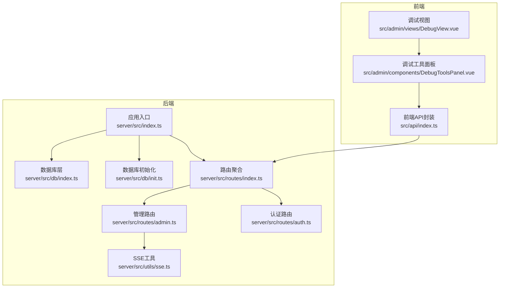
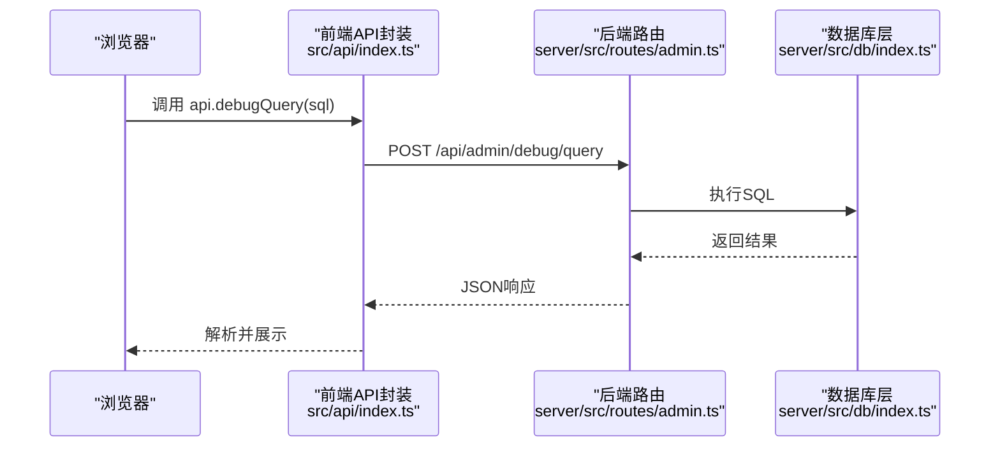
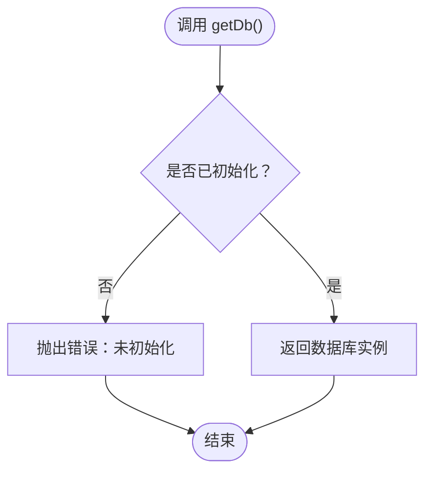
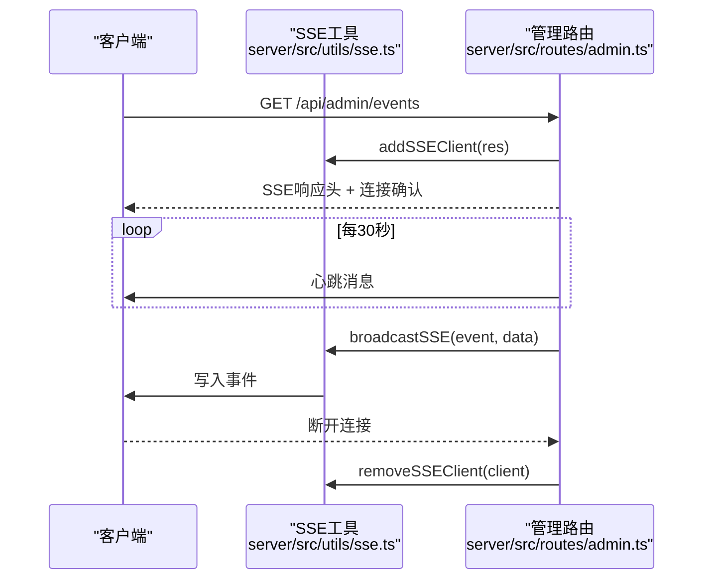
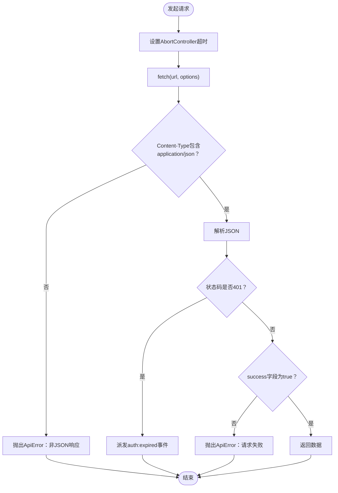
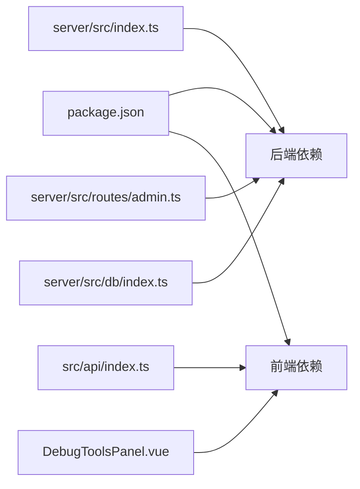

# 调试与故障排除

<cite>
**本文档引用的文件**
- [server/src/index.ts](file://server/src/index.ts)
- [server/src/dev-server.ts](file://server/src/dev-server.ts)
- [server/src/db/index.ts](file://server/src/db/index.ts)
- [server/src/db/init.ts](file://server/src/db/init.ts)
- [server/src/utils/sse.ts](file://server/src/utils/sse.ts)
- [server/src/routes/index.ts](file://server/src/routes/index.ts)
- [server/src/routes/admin.ts](file://server/src/routes/admin.ts)
- [server/src/routes/auth.ts](file://server/src/routes/auth.ts)
- [src/api/index.ts](file://src/api/index.ts)
- [src/admin/views/DebugView.vue](file://src/admin/views/DebugView.vue)
- [src/admin/components/DebugToolsPanel.vue](file://src/admin/components/DebugToolsPanel.vue)
- [package.json](file://package.json)
</cite>

## 目录
1. [简介](#简介)
2. [项目结构](#项目结构)
3. [核心组件](#核心组件)
4. [架构总览](#架构总览)
5. [详细组件分析](#详细组件分析)
6. [依赖关系分析](#依赖关系分析)
7. [性能考虑](#性能考虑)
8. [故障排除指南](#故障排除指南)
9. [结论](#结论)

## 简介
本指南面向RLRMS项目的开发与运维人员，提供系统化的调试与故障排除方法。内容涵盖：
- 数据库连接问题诊断与修复
- API调用失败的定位与处理
- 前端组件异常的排查思路
- 开发工具使用技巧（浏览器开发者工具、Vue DevTools、网络监控）
- 后端日志分析与错误追踪
- SSE实时通信调试与连接问题排查
- 性能问题定位与优化建议
- 紧急故障的应急处理流程

## 项目结构
项目采用前后端分离架构，后端基于Express + sql.js，前端基于Vue 3 + Vite。调试工具集中在管理端的“调试工具”页面，提供SQL执行器与API调试器两大功能模块。

**图表来源**
- [server/src/index.ts:34-143](file://server/src/index.ts#L34-L143)
- [server/src/db/index.ts:76-98](file://server/src/db/index.ts#L76-L98)
- [server/src/routes/index.ts:1-18](file://server/src/routes/index.ts#L1-L18)
- [server/src/utils/sse.ts:1-59](file://server/src/utils/sse.ts#L1-L59)
- [src/api/index.ts:54-114](file://src/api/index.ts#L54-L114)
- [src/admin/components/DebugToolsPanel.vue:1-800](file://src/admin/components/DebugToolsPanel.vue#L1-L800)
- [src/admin/views/DebugView.vue:1-34](file://src/admin/views/DebugView.vue#L1-L34)

**章节来源**
- [server/src/index.ts:1-176](file://server/src/index.ts#L1-L176)
- [server/src/db/index.ts:1-156](file://server/src/db/index.ts#L1-L156)
- [server/src/routes/index.ts:1-18](file://server/src/routes/index.ts#L1-L18)
- [src/api/index.ts:1-608](file://src/api/index.ts#L1-L608)

## 核心组件
- 后端应用入口与中间件：负责CORS、压缩、安全头、健康检查、静态资源托管、全局错误处理。
- 数据库层：封装sql.js，提供初始化、查询、批量写入、防抖保存等能力。
- SSE工具：维护客户端连接池，支持广播事件与心跳保活。
- 路由系统：聚合各业务路由，提供鉴权中间件与SSE事件流。
- 前端API封装：统一请求、超时控制、缓存策略、401处理、错误包装。
- 调试工具：SQL执行器与API调试器，支持分页浏览、参数替换、响应时间统计。

**章节来源**
- [server/src/index.ts:34-143](file://server/src/index.ts#L34-L143)
- [server/src/db/index.ts:76-156](file://server/src/db/index.ts#L76-L156)
- [server/src/utils/sse.ts:1-59](file://server/src/utils/sse.ts#L1-L59)
- [server/src/routes/admin.ts:134-162](file://server/src/routes/admin.ts#L134-L162)
- [src/api/index.ts:54-114](file://src/api/index.ts#L54-L114)
- [src/admin/components/DebugToolsPanel.vue:136-321](file://src/admin/components/DebugToolsPanel.vue#L136-L321)

## 架构总览
后端通过Express提供REST接口，前端通过统一API封装进行HTTP调用；管理端调试工具通过/admin/debug接口与后端交互，实现SQL执行与模式浏览。

**图表来源**
- [src/api/index.ts:598-603](file://src/api/index.ts#L598-L603)
- [server/src/routes/admin.ts:1-800](file://server/src/routes/admin.ts#L1-L800)
- [server/src/db/index.ts:101-147](file://server/src/db/index.ts#L101-L147)

## 详细组件分析

### 数据库层（sql.js）
- 初始化：首次运行时创建表结构、索引与默认数据，幂等处理迁移。
- 写入策略：批量事务与防抖保存，减少磁盘IO。
- 查询接口：run/get/all/exec，支持参数化查询。
- 异常处理：未初始化时抛出明确错误，便于上层捕获。

**图表来源**
- [server/src/db/index.ts:93-98](file://server/src/db/index.ts#L93-L98)

**章节来源**
- [server/src/db/index.ts:76-156](file://server/src/db/index.ts#L76-L156)
- [server/src/db/init.ts:5-204](file://server/src/db/init.ts#L5-L204)

### SSE实时通信
- 客户端连接：建立SSE连接，发送连接确认与心跳。
- 广播机制：遍历客户端集合，逐个写入事件，自动清理不可写连接。
- 心跳保活：每30秒发送一次心跳，维持长连接稳定。

**图表来源**
- [server/src/routes/admin.ts:134-162](file://server/src/routes/admin.ts#L134-L162)
- [server/src/utils/sse.ts:15-51](file://server/src/utils/sse.ts#L15-L51)

**章节来源**
- [server/src/utils/sse.ts:1-59](file://server/src/utils/sse.ts#L1-L59)
- [server/src/routes/admin.ts:134-162](file://server/src/routes/admin.ts#L134-L162)

### 前端API封装与调试工具
- 统一请求：超时控制、合并信号、凭据携带、内容类型校验。
- 错误处理：401事件派发、非JSON响应防御、统一ApiError包装。
- 调试工具：SQL执行器、模式浏览、API调试器（参数替换、响应时间统计、复制响应）。

**图表来源**
- [src/api/index.ts:54-114](file://src/api/index.ts#L54-L114)

**章节来源**
- [src/api/index.ts:54-114](file://src/api/index.ts#L54-L114)
- [src/admin/components/DebugToolsPanel.vue:136-321](file://src/admin/components/DebugToolsPanel.vue#L136-L321)

## 依赖关系分析
- 后端依赖：Express、sql.js、bcrypt、jsonwebtoken、multer、sharp、adm-zip、archiver等。
- 前端依赖：Vue 3、Vue Router、Pinia、lucide-vue-next等。
- 调试工具依赖：前端API封装与后端/admin/debug接口。

**图表来源**
- [package.json:16-41](file://package.json#L16-L41)
- [src/api/index.ts:1-608](file://src/api/index.ts#L1-L608)
- [src/admin/components/DebugToolsPanel.vue:1-800](file://src/admin/components/DebugToolsPanel.vue#L1-L800)
- [server/src/index.ts:1-176](file://server/src/index.ts#L1-L176)
- [server/src/routes/admin.ts:1-800](file://server/src/routes/admin.ts#L1-L800)
- [server/src/db/index.ts:1-156](file://server/src/db/index.ts#L1-L156)

**章节来源**
- [package.json:16-41](file://package.json#L16-L41)

## 性能考虑
- 压缩策略：对SSE响应禁用压缩，避免缓冲导致实时性下降。
- 防抖保存：数据库写入采用50ms防抖，降低I/O频率。
- 批量事务：初始化与批量更新使用beginBatch/endBatch，减少磁盘写入次数。
- 缓存策略：前端API封装采用stale-while-revalidate策略，提升响应速度。
- 索引优化：数据库初始化阶段创建常用索引，加速查询。

**章节来源**
- [server/src/index.ts:46-56](file://server/src/index.ts#L46-L56)
- [server/src/db/index.ts:37-60](file://server/src/db/index.ts#L37-L60)
- [server/src/db/init.ts:124-137](file://server/src/db/init.ts#L124-L137)
- [src/api/index.ts:9-34](file://src/api/index.ts#L9-L34)

## 故障排除指南

### 通用诊断流程
1. 确认服务状态
   - 访问 /health 接口查看数据库初始化状态。
   - 检查后端日志输出，关注初始化失败与错误堆栈。
2. 检查网络连通性
   - 前端与后端跨域配置（生产环境启用CORS）。
   - 静态资源托管与SPA回退逻辑。
3. 校验认证与权限
   - 管理端SSE事件流需要有效admin_token。
   - 前端401事件派发与会话过期处理。

**章节来源**
- [server/src/index.ts:90-96](file://server/src/index.ts#L90-L96)
- [server/src/index.ts:122-140](file://server/src/index.ts#L122-L140)
- [server/src/routes/admin.ts:115-131](file://server/src/routes/admin.ts#L115-L131)
- [src/api/index.ts:94-104](file://src/api/index.ts#L94-L104)

### 数据库连接问题
- 症状
  - /health返回initializing或503 Service Unavailable。
  - 数据库初始化失败导致进程退出。
- 诊断步骤
  - 查看数据库文件是否存在与可读写权限。
  - 检查初始化脚本是否成功创建表与索引。
  - 关注防抖保存与批量事务是否正常执行。
- 修复建议
  - 清理损坏的数据库文件后重启服务。
  - 确保/data目录存在且权限正确。
  - 使用调试工具执行简单查询验证连接。

**章节来源**
- [server/src/index.ts:69-79](file://server/src/index.ts#L69-L79)
- [server/src/db/index.ts:17-20](file://server/src/db/index.ts#L17-L20)
- [server/src/db/init.ts:5-204](file://server/src/db/init.ts#L5-L204)

### API调用失败
- 症状
  - 前端抛出ApiError，状态码非2xx或success=false。
  - 非JSON响应导致“非JSON响应”错误。
  - 401未授权触发会话过期事件。
- 诊断步骤
  - 在调试工具的API调试器中复现请求，观察响应状态与耗时。
  - 检查请求头、路径参数、查询参数与请求体。
  - 关注后端路由的鉴权中间件与参数校验。
- 修复建议
  - 确保Content-Type为application/json。
  - 正确传递cookies与凭据。
  - 修正参数类型与必填字段。

**章节来源**
- [src/api/index.ts:83-114](file://src/api/index.ts#L83-L114)
- [src/api/index.ts:36-46](file://src/api/index.ts#L36-L46)
- [server/src/routes/admin.ts:115-131](file://server/src/routes/admin.ts#L115-L131)

### 前端组件异常
- 症状
  - 调试工具面板无响应或显示空白。
  - SQL执行器无结果或报错。
  - API调试器参数面板展开失败。
- 诊断步骤
  - 使用Vue DevTools检查组件状态与props。
  - 在浏览器开发者工具Network标签查看请求与响应。
  - 检查组件样式与布局是否被覆盖。
- 修复建议
  - 确保路由正确指向调试视图。
  - 检查组件依赖的图标库与样式变量。
  - 验证数据绑定与计算属性。

**章节来源**
- [src/admin/views/DebugView.vue:1-34](file://src/admin/views/DebugView.vue#L1-L34)
- [src/admin/components/DebugToolsPanel.vue:1-800](file://src/admin/components/DebugToolsPanel.vue#L1-L800)

### 开发工具使用技巧
- 浏览器开发者工具
  - Network：监控请求/响应、过滤SSE、查看响应头与状态码。
  - Console：查看后端错误堆栈与前端ApiError详情。
  - Elements：检查调试工具面板DOM结构与样式。
- Vue DevTools
  - 组件树：定位调试工具面板及其子组件。
  - Vuex/Pinia：查看状态变化与缓存命中情况。
- 网络监控
  - SSE连接：观察事件流、心跳与断线重连。
  - 请求超时：调整前端超时阈值或后端处理时间。

**章节来源**
- [src/api/index.ts:58-81](file://src/api/index.ts#L58-L81)
- [server/src/utils/sse.ts:15-51](file://server/src/utils/sse.ts#L15-L51)

### 后端日志分析与错误追踪
- 日志位置
  - 控制台输出：数据库初始化、错误堆栈、SSE连接状态。
  - 全局错误处理：统一返回结构与错误级别。
- 分析要点
  - 数据库初始化失败：检查文件权限与磁盘空间。
  - 路由错误：关注参数校验与鉴权中间件。
  - SSE异常：检查客户端断开与写入异常。
- 追踪技巧
  - 使用唯一ID定位请求链路。
  - 区分业务错误与系统错误，记录上下文信息。

**章节来源**
- [server/src/index.ts:122-140](file://server/src/index.ts#L122-L140)
- [server/src/db/index.ts:150-156](file://server/src/db/index.ts#L150-L156)
- [server/src/utils/sse.ts:40-50](file://server/src/utils/sse.ts#L40-L50)

### SSE实时通信调试
- 常见问题
  - 连接频繁断开：检查心跳间隔与网络稳定性。
  - 事件未到达：确认客户端连接池与写入逻辑。
  - 生产环境Nginx缓冲：需设置X-Accel-Buffering=no。
- 调试步骤
  - 在调试工具中打开SSE事件流，观察连接确认与心跳。
  - 使用浏览器Network标签筛选SSE事件。
  - 检查后端日志中的连接添加/移除记录。
- 修复建议
  - 保持稳定的网络环境与合理的心跳周期。
  - 确保SSE响应头正确设置，避免代理层缓冲。

**章节来源**
- [server/src/routes/admin.ts:134-162](file://server/src/routes/admin.ts#L134-L162)
- [server/src/utils/sse.ts:15-51](file://server/src/utils/sse.ts#L15-L51)

### 性能问题定位与解决方案
- 诊断指标
  - API响应时间：调试工具显示毫秒级耗时。
  - 数据库写入延迟：关注防抖保存与批量事务。
  - 前端缓存命中率：stale-while-revalidate策略效果。
- 优化建议
  - 合理设置压缩阈值，避免SSE被压缩。
  - 使用批量事务减少磁盘写入。
  - 前端缓存策略与懒加载结合使用。

**章节来源**
- [server/src/index.ts:46-56](file://server/src/index.ts#L46-L56)
- [server/src/db/index.ts:37-60](file://server/src/db/index.ts#L37-L60)
- [src/api/index.ts:9-34](file://src/api/index.ts#L9-L34)

### 紧急故障应急处理流程
1. 快速评估
   - 访问 /health 确认服务状态。
   - 查看最近日志，定位错误根因。
2. 降级措施
   - 关闭SSE事件流或临时禁用高负载接口。
   - 清理缓存或回滚到上一个稳定版本。
3. 修复与恢复
   - 修复数据库问题后重启服务。
   - 更新配置并验证SSE连接。
4. 监控与复盘
   - 持续监控关键指标与错误率。
   - 记录故障原因与处理过程，形成知识库。

**章节来源**
- [server/src/index.ts:90-96](file://server/src/index.ts#L90-L96)
- [server/src/index.ts:164-175](file://server/src/index.ts#L164-L175)

## 结论
本指南提供了RLRMS项目的系统化调试与故障排除方法，涵盖数据库、API、前端组件、SSE通信、性能优化与应急处理。建议在日常开发中：
- 使用调试工具进行快速验证与回归测试。
- 建立完善的日志与监控体系，及时发现潜在问题。
- 遵循性能优化最佳实践，确保系统稳定高效运行。