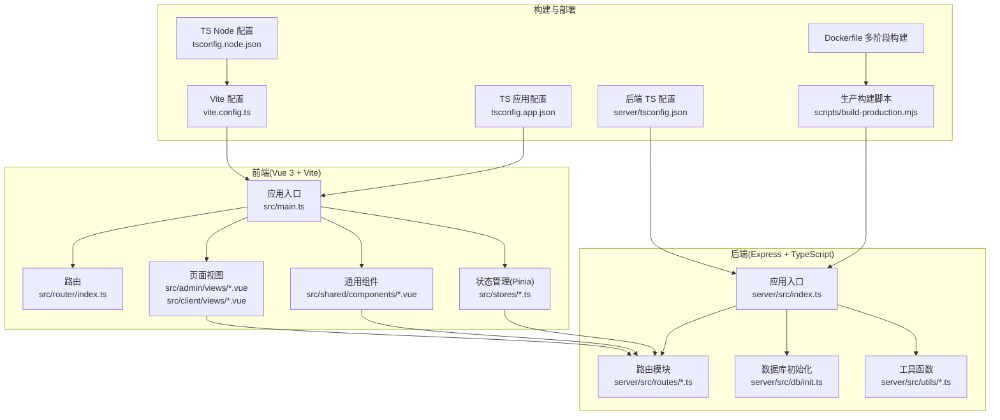
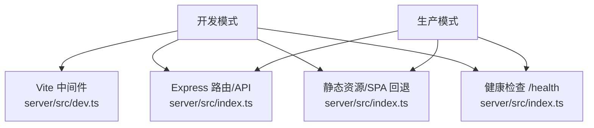
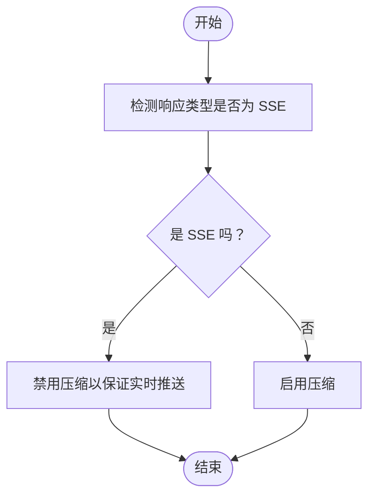
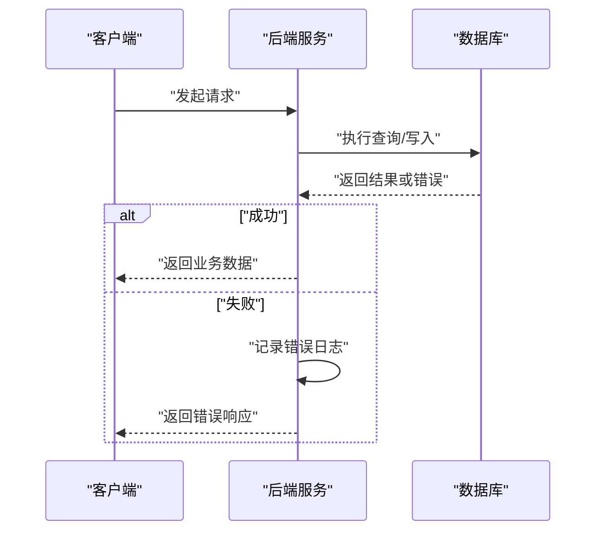
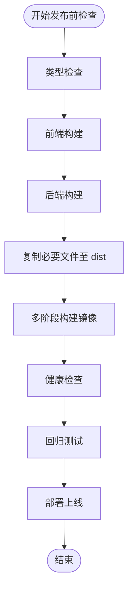
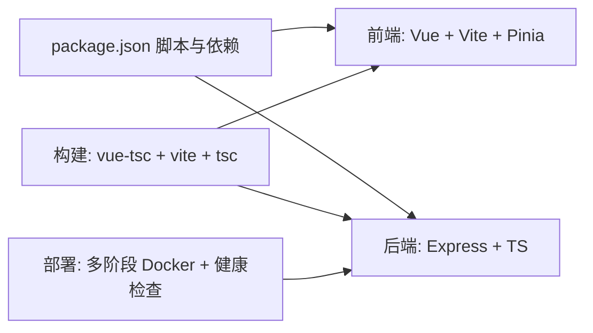

# 质量保证流程

<cite>
**本文引用的文件**
- [package.json](file://package.json)
- [vite.config.ts](file://vite.config.ts)
- [tsconfig.json](file://tsconfig.json)
- [tsconfig.app.json](file://tsconfig.app.json)
- [tsconfig.node.json](file://tsconfig.node.json)
- [server/tsconfig.json](file://server/tsconfig.json)
- [Dockerfile](file://Dockerfile)
- [scripts/build-production.mjs](file://scripts/build-production.mjs)
- [server/src/dev.ts](file://server/src/dev.ts)
- [server/src/dev-server.ts](file://server/src/dev-server.ts)
- [server/src/index.ts](file://server/src/index.ts)
- [server/src/utils/format.ts](file://server/src/utils/format.ts)
- [src/stores/app.ts](file://src/stores/app.ts)
</cite>

## 目录
1. [引言](#引言)
2. [项目结构](#项目结构)
3. [核心组件](#核心组件)
4. [架构总览](#架构总览)
5. [详细组件分析](#详细组件分析)
6. [依赖分析](#依赖分析)
7. [性能考虑](#性能考虑)
8. [故障排查指南](#故障排查指南)
9. [结论](#结论)
10. [附录](#附录)

## 引言
本文件为 RLRMS 项目的质量保证流程文档，聚焦于代码审查标准与流程、静态代码分析实践、性能监控与优化、错误日志收集与分析、以及发布前质量检查与回归测试流程。文档基于仓库现有配置与实现进行梳理，并提供可操作的质量保障建议。

## 项目结构
项目采用前后端分离架构：前端基于 Vue 3 + Vite，后端基于 Express + TypeScript；通过多阶段 Docker 构建实现生产部署；开发模式下通过 Vite 中间件与 Express 协同提供热更新与 SPA 回退。

图表来源
- [vite.config.ts:1-112](file://vite.config.ts#L1-L112)
- [tsconfig.app.json:1-21](file://tsconfig.app.json#L1-L21)
- [tsconfig.node.json:1-27](file://tsconfig.node.json#L1-L27)
- [server/tsconfig.json:1-17](file://server/tsconfig.json#L1-L17)
- [Dockerfile:1-65](file://Dockerfile#L1-L65)
- [scripts/build-production.mjs:1-54](file://scripts/build-production.mjs#L1-L54)
- [server/src/index.ts:1-176](file://server/src/index.ts#L1-L176)

章节来源
- [vite.config.ts:1-112](file://vite.config.ts#L1-L112)
- [tsconfig.json:1-8](file://tsconfig.json#L1-L8)
- [tsconfig.app.json:1-21](file://tsconfig.app.json#L1-L21)
- [tsconfig.node.json:1-27](file://tsconfig.node.json#L1-L27)
- [server/tsconfig.json:1-17](file://server/tsconfig.json#L1-L17)
- [Dockerfile:1-65](file://Dockerfile#L1-L65)
- [scripts/build-production.mjs:1-54](file://scripts/build-production.mjs#L1-L54)
- [server/src/index.ts:1-176](file://server/src/index.ts#L1-L176)

## 核心组件
- 前端应用与构建
  - 使用 Vite 提供开发服务器与生产构建，包含按需移除 console 日志、手动分包、资源命名与压缩等策略。
  - TypeScript 编译严格模式与未使用项检查，确保类型安全与代码整洁。
- 后端应用与构建
  - Express 应用统一处理跨域、压缩、安全头、静态资源与健康检查。
  - 多阶段 Docker 构建，生产镜像最小化，包含健康检查与非 root 用户运行。
- 开发与调试
  - Vite 中间件模式集成开发体验，开发服务器对 transformIndexHtml 警告去重，减少噪音。
  - 后端开发服务器提供独立 API 服务与数据库初始化流程。

章节来源
- [vite.config.ts:1-112](file://vite.config.ts#L1-L112)
- [tsconfig.app.json:11-17](file://tsconfig.app.json#L11-L17)
- [server/src/index.ts:34-143](file://server/src/index.ts#L34-L143)
- [Dockerfile:24-64](file://Dockerfile#L24-L64)
- [server/src/dev.ts:8-66](file://server/src/dev.ts#L8-L66)
- [server/src/dev-server.ts:1-18](file://server/src/dev-server.ts#L1-L18)

## 架构总览
下图展示开发与生产两种运行模式的关键差异：开发模式下前端通过 Vite 中间件注入，后端提供 API 与静态资源回退；生产模式下后端直接托管前端构建产物并提供健康检查。

图表来源
- [server/src/dev.ts:12-56](file://server/src/dev.ts#L12-L56)
- [server/src/index.ts:88-120](file://server/src/index.ts#L88-L120)
- [server/src/index.ts:90-96](file://server/src/index.ts#L90-L96)

章节来源
- [server/src/dev.ts:8-66](file://server/src/dev.ts#L8-L66)
- [server/src/index.ts:88-120](file://server/src/index.ts#L88-L120)
- [server/src/index.ts:90-96](file://server/src/index.ts#L90-L96)

## 详细组件分析

### 代码审查标准与流程
- Pull Request 规范
  - 必须关联需求或缺陷编号，标题清晰描述变更范围与影响面。
  - 变更内容需包含单元/集成测试或端到端测试用例，覆盖新增/修改逻辑。
  - 提交信息遵循约定式提交，区分 feat/fix/docs/chore 等类型。
- 审查清单
  - 类型安全：是否通过 TypeScript 严格模式与未使用项检查。
  - 性能与体积：是否遵循手动分包策略，避免引入大依赖；生产构建是否启用压缩与内容哈希。
  - 安全性：是否设置安全响应头，是否避免在生产环境输出 console 日志。
  - 可靠性：是否处理数据库初始化与健康检查，异常路径是否记录日志并返回明确错误。
  - 可维护性：是否保持单一职责，是否存在重复逻辑或未使用的代码。
- 合并要求
  - 至少一名审查者批准。
  - CI 通过（构建、类型检查、测试）。
  - 无阻断性警告（如大型 chunk、未使用依赖）。

章节来源
- [vite.config.ts:63-111](file://vite.config.ts#L63-L111)
- [tsconfig.app.json:11-17](file://tsconfig.app.json#L11-L17)
- [server/src/index.ts:60-67](file://server/src/index.ts#L60-L67)
- [server/src/index.ts:122-140](file://server/src/index.ts#L122-L140)

### 静态代码分析与类型检查
- TypeScript 编译器检查
  - 应用层与 Node 层分别配置严格模式与未使用项检查，确保类型安全与代码质量。
  - 建议在本地与 CI 中执行类型检查，阻止不安全类型进入主干。
- ESLint（建议）
  - 当前仓库未包含 ESLint 配置文件。建议引入并统一规则集，结合 Prettier 保证风格一致。
  - 关键规则建议：禁用 console、no-unused-vars、no-explicit-any、import/no-unresolved 等。
- 安全扫描（建议）
  - 使用 npm audit 或 Snyk 等工具定期扫描依赖漏洞。
  - 对第三方依赖版本进行锁定与升级策略管理。

章节来源
- [tsconfig.app.json:11-17](file://tsconfig.app.json#L11-L17)
- [tsconfig.node.json:17-23](file://tsconfig.node.json#L17-L23)
- [server/tsconfig.json:2-12](file://server/tsconfig.json#L2-L12)

### 性能监控与优化指导
- 内存使用
  - 后端进程注册 SIGTERM/SIGINT 钩子，确保退出前刷新数据库缓冲，避免数据丢失。
  - 建议在生产中开启内存指标采集与告警，监控堆内存与驻留集大小。
- 网络请求优化
  - 后端对 SSE 流响应禁用压缩，确保实时推送不被缓冲。
  - 前端静态资源长期缓存与内容哈希，减少带宽占用。
- 渲染性能
  - 使用 Pinia 状态管理，避免不必要的响应式开销。
  - 组件层面减少深层嵌套与过度计算，合理拆分与懒加载页面。
- 构建优化
  - 手动分包策略将图标库与第三方依赖独立打包，提升 Tree Shaking 效果。
  - 生产构建启用 esbuild 压缩与内容哈希命名，降低首屏加载时间。

图表来源
- [server/src/index.ts:46-56](file://server/src/index.ts#L46-L56)

章节来源
- [server/src/dev-server.ts:15-17](file://server/src/dev-server.ts#L15-L17)
- [server/src/index.ts:46-56](file://server/src/index.ts#L46-L56)
- [vite.config.ts:68-98](file://vite.config.ts#L68-L98)
- [src/stores/app.ts:14-121](file://src/stores/app.ts#L14-L121)

### 错误日志收集与分析方法
- 后端错误处理
  - 统一错误中间件捕获异常，区分鉴权与参数校验错误并返回明确状态码。
  - 生产环境隐藏内部错误细节，开发环境输出完整堆栈以便定位问题。
- 日志输出
  - 错误发生时输出错误消息与堆栈，便于快速定位。
  - 建议接入结构化日志（如 Bunyan/Pino），统一字段与级别。
- 分析流程
  - 收集错误日志与时间戳，结合浏览器与服务端日志交叉验证。
  - 对高频错误建立告警阈值，配合监控面板进行趋势分析。

图表来源
- [server/src/index.ts:122-140](file://server/src/index.ts#L122-L140)

章节来源
- [server/src/index.ts:122-140](file://server/src/index.ts#L122-L140)

### 发布前质量检查清单与回归测试流程
- 发布前质量检查
  - 本地构建与类型检查全部通过。
  - 生产构建脚本生成 dist 与 server/dist，确认静态资源与数据目录复制正确。
  - Docker 多阶段构建成功，健康检查可用，非 root 用户运行。
- 回归测试流程
  - 功能回归：覆盖登录、点餐、订单、库存等核心链路。
  - 性能回归：对比构建产物体积与首屏加载时间，确保无显著退化。
  - 安全回归：验证安全响应头、CORS 配置与健康检查接口。
  - 兼容性回归：在不同浏览器与设备上验证 UI 与交互一致性。

图表来源
- [scripts/build-production.mjs:13-38](file://scripts/build-production.mjs#L13-L38)
- [Dockerfile:24-64](file://Dockerfile#L24-L64)
- [server/src/index.ts:90-96](file://server/src/index.ts#L90-L96)

章节来源
- [scripts/build-production.mjs:1-54](file://scripts/build-production.mjs#L1-L54)
- [Dockerfile:1-65](file://Dockerfile#L1-L65)
- [server/src/index.ts:90-96](file://server/src/index.ts#L90-L96)

## 依赖分析
- 前端依赖
  - Vue 3、Vue Router、Pinia、Vite、@vitejs/plugin-vue 等构成前端技术栈。
  - 开发脚本通过 vue-tsc 与 vite 构建，确保类型与打包一致性。
- 后端依赖
  - Express、cors、cookie-parser、compression、jsonwebtoken、bcryptjs、sql.js 等提供服务端能力。
  - TypeScript 编译配置严格，确保类型安全与模块解析正确。
- 构建与部署
  - 多阶段 Docker 构建，先安装全部依赖进行构建，再仅安装生产依赖运行，镜像体积最小化。
  - 健康检查与非 root 用户运行增强安全性与稳定性。

图表来源
- [package.json:6-14](file://package.json#L6-L14)
- [package.json:16-41](file://package.json#L16-L41)
- [package.json:42-62](file://package.json#L42-L62)
- [Dockerfile:6-47](file://Dockerfile#L6-L47)

章节来源
- [package.json:1-64](file://package.json#L1-L64)
- [Dockerfile:1-65](file://Dockerfile#L1-L65)

## 性能考虑
- 构建与分包
  - 手动分包策略将图标库与第三方依赖独立，提升 Tree Shaking 与缓存命中率。
  - 资源文件名使用内容哈希，CSS/JS/媒体资源分类命名，便于长期缓存。
- 运行时优化
  - 压缩阈值与过滤策略避免 SSE 响应被压缩导致延迟。
  - 前端静态资源长期缓存与 SPA 回退，减少重复下载。
- 监控建议
  - 建议接入性能监控（如 Web Vitals、APDEX），持续跟踪首屏与交互延迟。

章节来源
- [vite.config.ts:68-104](file://vite.config.ts#L68-L104)
- [server/src/index.ts:46-56](file://server/src/index.ts#L46-L56)

## 故障排查指南
- 数据库初始化失败
  - 后端在初始化失败时会关闭服务并退出进程，检查数据库连接与权限。
- 健康检查失败
  - 通过 /health 接口确认数据库就绪状态，排查初始化耗时与依赖问题。
- 开发服务器警告过多
  - Vite transformIndexHtml 警告已去重输出，若仍出现异常模板，检查模板与插件兼容性。
- 进程退出与数据丢失
  - 后端注册 SIGTERM/SIGINT 钩子，确保退出前刷新缓冲；生产环境务必启用该机制。

章节来源
- [server/src/index.ts:148-161](file://server/src/index.ts#L148-L161)
- [server/src/index.ts:90-96](file://server/src/index.ts#L90-L96)
- [server/src/dev.ts:34-50](file://server/src/dev.ts#L34-L50)
- [server/src/dev-server.ts:15-17](file://server/src/dev-server.ts#L15-L17)

## 结论
本质量保证流程围绕“类型安全、构建优化、运行稳定、可观测性”四大支柱展开。通过严格的代码审查、静态分析与性能监控，结合自动化构建与健康检查，可显著提升 RLRMS 的交付质量与运行可靠性。建议尽快补齐 ESLint 与安全扫描配置，并完善端到端测试与性能回归流程。

## 附录
- 时间格式化工具
  - 提供日期时间格式化辅助函数，确保前后端时间表示一致。
  
章节来源
- [server/src/utils/format.ts:1-12](file://server/src/utils/format.ts#L1-L12)