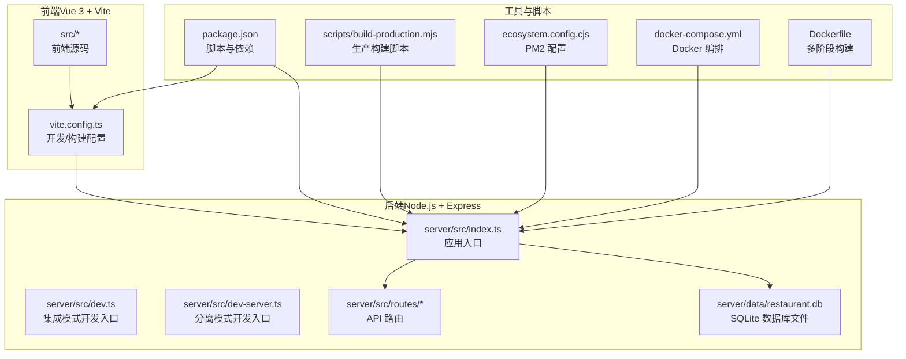
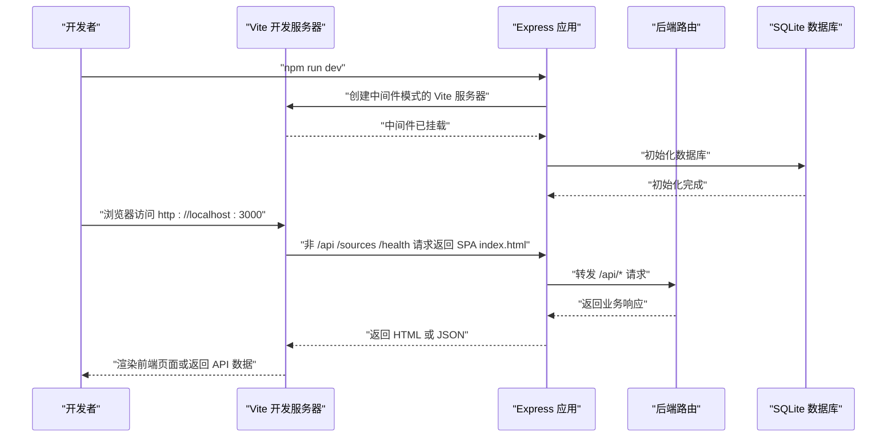
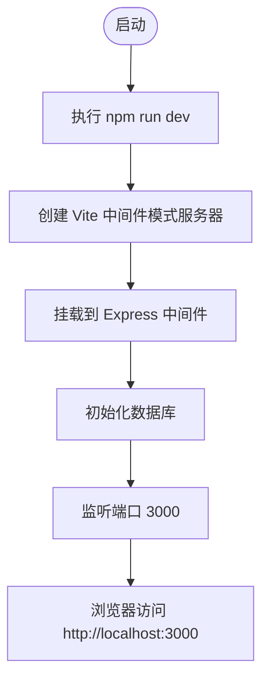
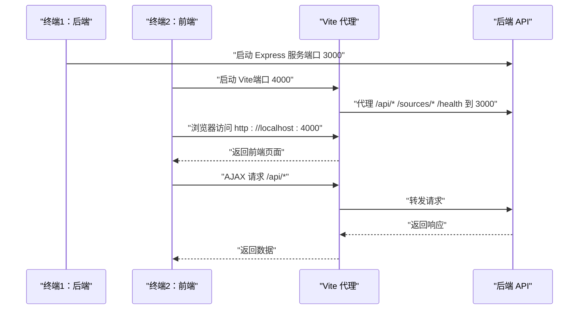
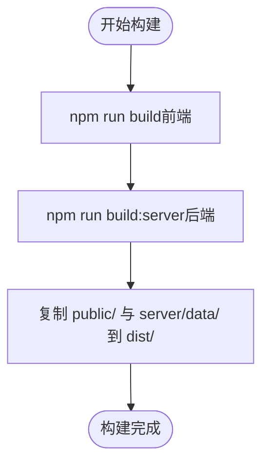
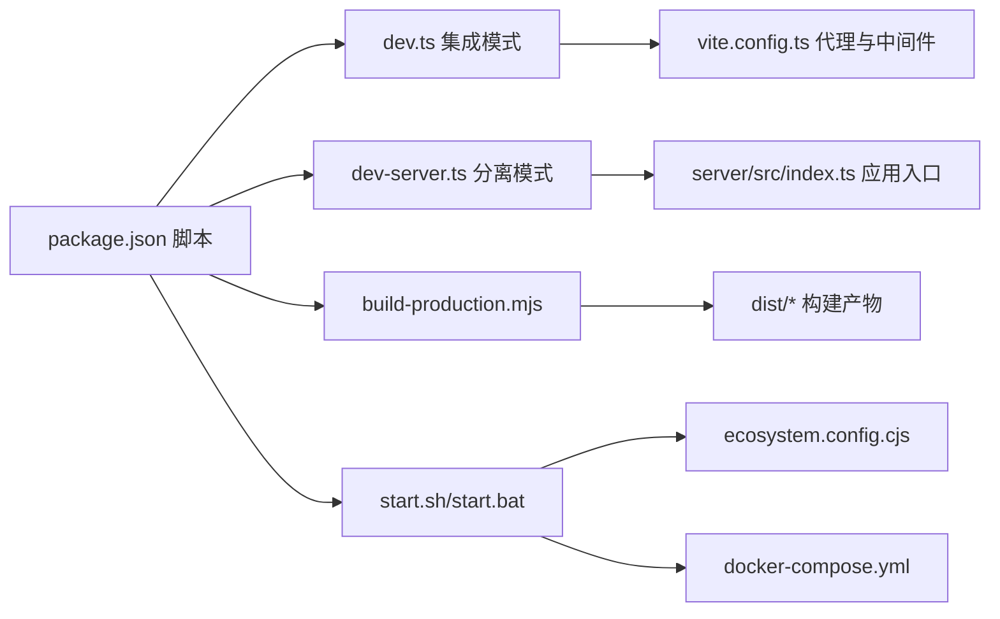

# 快速开始

<cite>
**本文引用的文件**
- [package.json](file://package.json)
- [README.md](file://README.md)
- [vite.config.ts](file://vite.config.ts)
- [server/src/dev.ts](file://server/src/dev.ts)
- [server/src/dev-server.ts](file://server/src/dev-server.ts)
- [server/src/index.ts](file://server/src/index.ts)
- [scripts/build-production.mjs](file://scripts/build-production.mjs)
- [install.sh](file://install.sh)
- [install.bat](file://install.bat)
- [start.sh](file://start.sh)
- [start.bat](file://start.bat)
- [ecosystem.config.cjs](file://ecosystem.config.cjs)
- [docker-compose.yml](file://docker-compose.yml)
- [Dockerfile](file://Dockerfile)
</cite>

## 目录
1. [简介](#简介)
2. [项目结构](#项目结构)
3. [核心组件](#核心组件)
4. [架构总览](#架构总览)
5. [详细组件分析](#详细组件分析)
6. [依赖关系分析](#依赖关系分析)
7. [性能考虑](#性能考虑)
8. [故障排除指南](#故障排除指南)
9. [结论](#结论)
10. [附录](#附录)

## 简介
本指南面向新手开发者，帮助你在30分钟内成功运行 RLRMS 餐厅管理系统。内容涵盖环境要求、依赖安装、开发模式（集成模式与分离模式）、生产构建与部署、常见问题排查等。

## 项目结构
项目采用前后端分离架构，包含：
- 前端：Vue 3 + Vite + TypeScript
- 后端：Node.js + Express + sql.js（SQLite 的 JS 实现）
- 开发与生产工具链：Vite、TypeScript、PM2、Docker

图表来源
- [vite.config.ts:28-62](file://vite.config.ts#L28-L62)
- [server/src/index.ts:33-142](file://server/src/index.ts#L33-L142)
- [server/src/dev.ts:8-66](file://server/src/dev.ts#L8-L66)
- [server/src/dev-server.ts:1-13](file://server/src/dev-server.ts#L1-L13)
- [scripts/build-production.mjs:11-54](file://scripts/build-production.mjs#L11-L54)
- [ecosystem.config.cjs:1-19](file://ecosystem.config.cjs#L1-L19)
- [docker-compose.yml:6-54](file://docker-compose.yml#L6-L54)
- [Dockerfile:6-65](file://Dockerfile#L6-L65)

章节来源
- [README.md: 61-174:61-174](file://README.md#L61-L174)

## 核心组件
- 包管理与脚本：通过 package.json 定义开发、构建、启动、数据库初始化等脚本。
- 前端开发服务器：Vite 提供热更新与代理能力；在集成模式下由 Express 作为中间层统一提供服务。
- 后端应用：Express 应用负责路由、静态资源、SSE、健康检查、生产环境静态托管与 SPA 回退。
- 生产构建：统一构建前端与后端，复制必要资源到 dist 目录，便于部署。
- 进程管理：PM2 配置用于生产环境进程守护与日志管理。
- 容器化：Docker 多阶段构建，暴露端口、健康检查、非 root 用户运行、持久化卷挂载。

章节来源
- [package.json: 6-15:6-15](file://package.json#L6-L15)
- [vite.config.ts: 28-62:28-62](file://vite.config.ts#L28-L62)
- [server/src/index.ts: 33-142:33-142](file://server/src/index.ts#L33-L142)
- [scripts/build-production.mjs: 11-54:11-54](file://scripts/build-production.mjs#L11-L54)
- [ecosystem.config.cjs: 1-L19:1-19](file://ecosystem.config.cjs#L1-L19)
- [docker-compose.yml: 6-54:6-54](file://docker-compose.yml#L6-L54)
- [Dockerfile: 6-65:6-65](file://Dockerfile#L6-L65)

## 架构总览
下面的序列图展示了两种开发模式的请求流转与服务启动顺序。

图表来源
- [server/src/dev.ts: 8-L66:8-66](file://server/src/dev.ts#L8-L66)
- [server/src/index.ts: 33-L142:33-142](file://server/src/index.ts#L33-L142)
- [vite.config.ts: 43-L62:43-62](file://vite.config.ts#L43-L62)

## 详细组件分析

### 环境要求
- Node.js：>= 18
- npm：>= 9
- 推荐使用 nvm 管理 Node.js 版本

章节来源
- [README.md: 178-182:178-182](file://README.md#L178-L182)

### 依赖安装
- 安装命令：在项目根目录执行安装脚本或 npm install
- Windows：install.bat
- Linux/macOS：install.sh

章节来源
- [README.md: 183-189:183-189](file://README.md#L183-L189)
- [install.sh: 48-51:48-51](file://install.sh#L48-L51)
- [install.bat: 35-44:35-44](file://install.bat#L35-L44)

### 开发模式

#### 集成模式（推荐）
- 同时启动前端与后端，Express 通过 Vite 中间件模式统一在端口 3000 提供服务。
- 访问地址：http://localhost:3000
- 启动命令：npm run dev

图表来源
- [server/src/dev.ts: 8-L66:8-66](file://server/src/dev.ts#L8-L66)
- [vite.config.ts: 43-L62:43-62](file://vite.config.ts#L43-L62)

章节来源
- [README.md: 194-203:194-203](file://README.md#L194-L203)
- [server/src/dev.ts: 8-L66:8-66](file://server/src/dev.ts#L8-L66)

#### 分离模式（适用于独立 Vite 场景）
- 分别启动后端 API 服务（端口 3000）与前端 Vite 服务（端口 4000），Vite 通过 proxy 将 /api、/sources、/health 请求转发到后端。
- 访问地址：Vite 端口（如 http://localhost:4000），API 请求自动代理到 http://localhost:3000
- 启动命令：
  - 终端1：npm run dev:server
  - 终端2：npx vite

图表来源
- [server/src/dev-server.ts: 1-L13:1-13](file://server/src/dev-server.ts#L1-L13)
- [vite.config.ts: 48-L62:48-62](file://vite.config.ts#L48-L62)

章节来源
- [README.md: 204-217:204-217](file://README.md#L204-L217)
- [server/src/dev-server.ts: 1-L13:1-13](file://server/src/dev-server.ts#L1-L13)
- [vite.config.ts: 43-L62:43-62](file://vite.config.ts#L43-L62)

### 生产构建与部署

#### 生产构建
- 构建前端：npm run build
- 构建后端：npm run build:server
- 一键生产构建：npm run build:production（内部调用上述两个命令并复制必要资源）

图表来源
- [scripts/build-production.mjs: 11-L54:11-54](file://scripts/build-production.mjs#L11-L54)
- [package.json: 9-L11:9-11](file://package.json#L9-L11)

章节来源
- [README.md: 218-227:218-227](file://README.md#L218-L227)
- [scripts/build-production.mjs: 11-L54:11-54](file://scripts/build-production.mjs#L11-L54)
- [package.json: 9-L11:9-11](file://package.json#L9-L11)

#### 部署方式

##### PM2 部署
- 使用 ecosystem.config.cjs 管理进程，自动保存与开机自启
- 启动命令：pm2 start ecosystem.config.cjs

章节来源
- [README.md: 542-548:542-548](file://README.md#L542-L548)
- [ecosystem.config.cjs: 1-L19:1-19](file://ecosystem.config.cjs#L1-L19)

##### Docker 部署
- 多阶段构建，精简镜像，非 root 用户运行，健康检查，持久化卷挂载
- 启动命令：docker compose up -d --build

章节来源
- [README.md: 525-538:525-538](file://README.md#L525-L538)
- [docker-compose.yml: 6-54:6-54](file://docker-compose.yml#L6-L54)
- [Dockerfile: 6-65:6-65](file://Dockerfile#L6-L65)

##### 反向代理（Nginx/Apache）
- 项目提供 nginx.conf 与 apache.conf 模板，安装脚本可自动检测并引导配置
- 注意事项：修改 server_name、SSE 超时配置、重载服务

章节来源
- [README.md: 550-557:550-557](file://README.md#L550-L557)
- [install.sh: 89-181:89-181](file://install.sh#L89-L181)
- [install.bat: 86-199:86-199](file://install.bat#L86-L199)

##### 快捷启停脚本
- Linux/macOS：start.sh、stop.sh
- Windows：start.bat、stop.bat

章节来源
- [README.md: 558-564:558-564](file://README.md#L558-L564)
- [start.sh: 1-L156:1-156](file://start.sh#L1-L156)
- [start.bat: 1-L133:1-133](file://start.bat#L1-L133)

### 数据库初始化
- 初始化命令：npm run db:init
- 作用：创建/初始化 SQLite 数据库与表结构

章节来源
- [README.md: 228-233:228-233](file://README.md#L228-L233)
- [package.json: 14](file://package.json#L14)

## 依赖关系分析

图表来源
- [package.json: 6-L15:6-15](file://package.json#L6-L15)
- [server/src/dev.ts: 8-L66:8-66](file://server/src/dev.ts#L8-L66)
- [server/src/dev-server.ts: 1-L13:1-13](file://server/src/dev-server.ts#L1-L13)
- [scripts/build-production.mjs: 11-L54:11-54](file://scripts/build-production.mjs#L11-L54)
- [vite.config.ts: 43-L62:43-62](file://vite.config.ts#L43-L62)
- [server/src/index.ts: 33-L142:33-142](file://server/src/index.ts#L33-L142)
- [start.sh: 95-L125:95-125](file://start.sh#L95-L125)
- [start.bat: 68-L98:68-98](file://start.bat#L68-L98)
- [docker-compose.yml: 6-L54:6-54](file://docker-compose.yml#L6-L54)

章节来源
- [package.json: 6-L15:6-15](file://package.json#L6-L15)
- [vite.config.ts: 28-L62:28-62](file://vite.config.ts#L28-L62)
- [server/src/index.ts: 33-L142:33-142](file://server/src/index.ts#L33-L142)
- [scripts/build-production.mjs: 11-L54:11-54](file://scripts/build-production.mjs#L11-L54)
- [ecosystem.config.cjs: 1-L19:1-19](file://ecosystem.config.cjs#L1-L19)
- [docker-compose.yml: 6-L54:6-54](file://docker-compose.yml#L6-L54)

## 性能考虑
- 前端构建优化：Vite 预构建常用依赖、代码分割、按扩展名命名资源文件、生产环境移除 console。
- 后端压缩：对非 SSE 响应启用压缩，减少传输体积。
- 生产静态托管：长期缓存带内容哈希的静态资源，提升加载速度。
- Docker 资源限制：限制内存使用，防止泄漏导致系统不稳定。

章节来源
- [vite.config.ts: 39-L112:39-112](file://vite.config.ts#L39-L112)
- [server/src/index.ts: 44-L56:44-56](file://server/src/index.ts#L44-L56)
- [Dockerfile: 40-L47:40-47](file://Dockerfile#L40-L47)

## 故障排除指南

### 环境版本问题
- 现象：安装或启动时报 Node.js/npm 版本过低
- 处理：升级 Node.js 至 18+，npm 至 9+

章节来源
- [install.sh: 24-38:24-38](file://install.sh#L24-L38)
- [install.bat: 13-34:13-34](file://install.bat#L13-L34)

### 端口占用
- 现象：启动失败提示端口已被占用
- 处理：停止占用端口的进程，或修改 .env 中的 PORT

章节来源
- [start.sh: 47-L73:47-73](file://start.sh#L47-L73)
- [start.bat: 46-L61:46-61](file://start.bat#L46-L61)

### 数据库初始化失败
- 现象：启动时报数据库不可用或初始化失败
- 处理：执行 npm run db:init 初始化数据库；检查 server/data 权限与磁盘空间

章节来源
- [server/src/index.ts: 68-L78:68-78](file://server/src/index.ts#L68-L78)
- [README.md: 228-233:228-233](file://README.md#L228-L233)

### 反向代理配置问题
- 现象：通过 Nginx/Apache 访问异常或 SSE 不工作
- 处理：检查 server_name、WebSocket 升级变量映射、SSE 超时配置、重载服务

章节来源
- [install.sh: 117-L177:117-177](file://install.sh#L117-L177)
- [install.bat: 108-L140:108-140](file://install.bat#L108-L140)

### Docker 启动失败
- 现象：docker compose up 失败
- 处理：查看日志 docker compose logs -f，检查 .env、端口映射、卷挂载权限

章节来源
- [docker-compose.yml: 32-L39:32-39](file://docker-compose.yml#L32-L39)
- [Dockerfile: 56-L58:56-58](file://Dockerfile#L56-L58)

### PM2 进程异常
- 现象：PM2 启动后很快退出
- 处理：查看日志 pm2 logs red-lantern-restaurant，检查环境变量与端口占用

章节来源
- [ecosystem.config.cjs: 1-L19:1-19](file://ecosystem.config.cjs#L1-L19)
- [start.sh: 95-L125:95-125](file://start.sh#L95-L125)

## 结论
通过本指南，你可以在30分钟内完成环境准备、依赖安装、开发模式启动、生产构建与部署，并掌握常见问题的排查方法。建议优先使用集成模式进行开发，生产环境结合 PM2/Docker/Nginx/Apache 实现稳定运行。

## 附录

### 常用命令速查
- 安装依赖：npm install
- 集成模式开发：npm run dev
- 分离模式开发：npm run dev:server（终端1）+ npx vite（终端2）
- 生产构建：npm run build:production
- 数据库初始化：npm run db:init
- PM2 启动：pm2 start ecosystem.config.cjs
- Docker 启动：docker compose up -d --build
- 快捷启动：start.sh（Linux/macOS）或 start.bat（Windows）

章节来源
- [README.md: 183-233:183-233](file://README.md#L183-L233)
- [package.json: 6-L15:6-15](file://package.json#L6-L15)
- [ecosystem.config.cjs: 1-L19:1-19](file://ecosystem.config.cjs#L1-L19)
- [docker-compose.yml: 6-L54:6-54](file://docker-compose.yml#L6-L54)
- [start.sh: 1-L156:1-156](file://start.sh#L1-L156)
- [start.bat: 1-L133:1-133](file://start.bat#L1-L133)