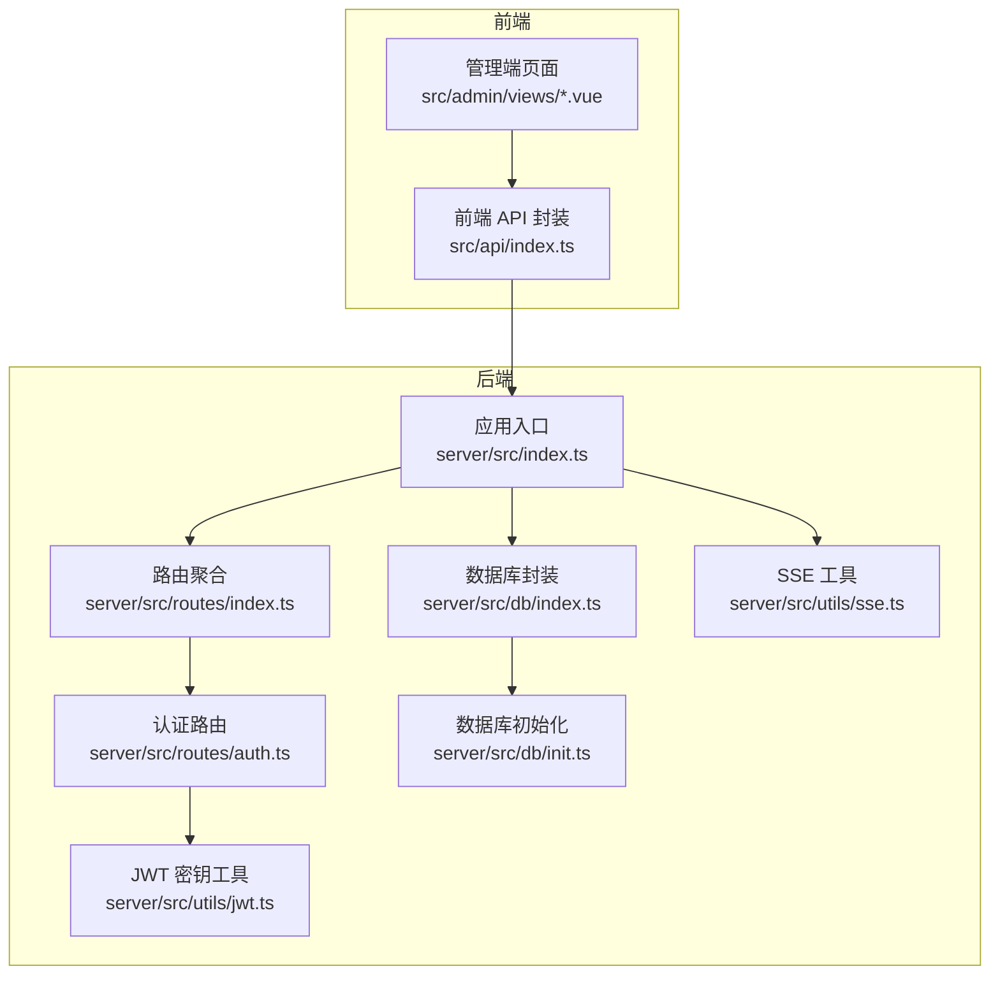
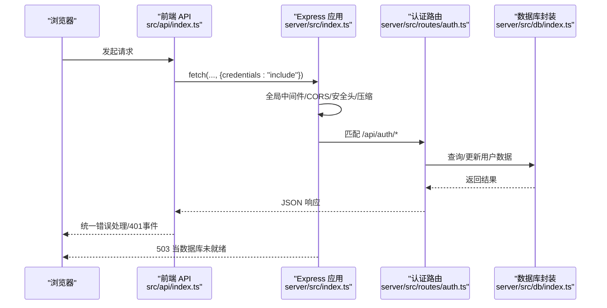
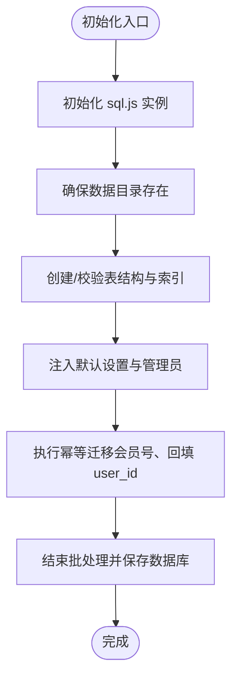
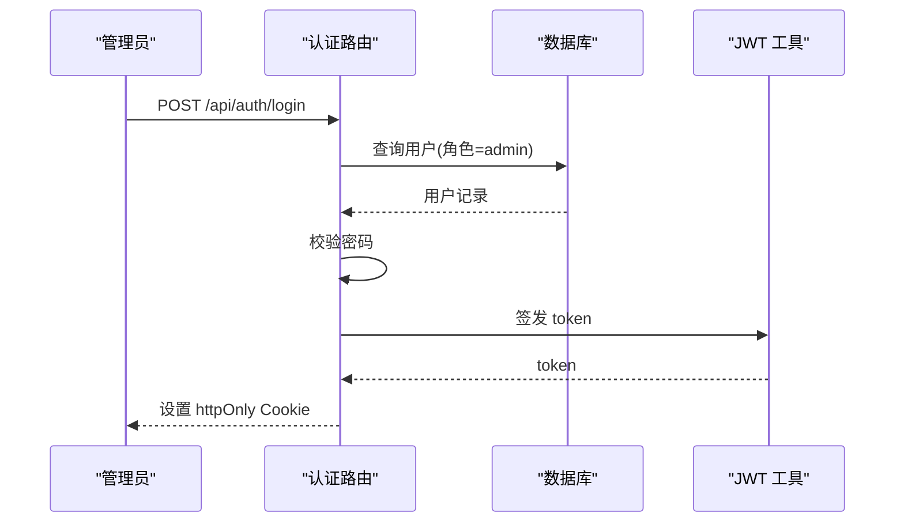
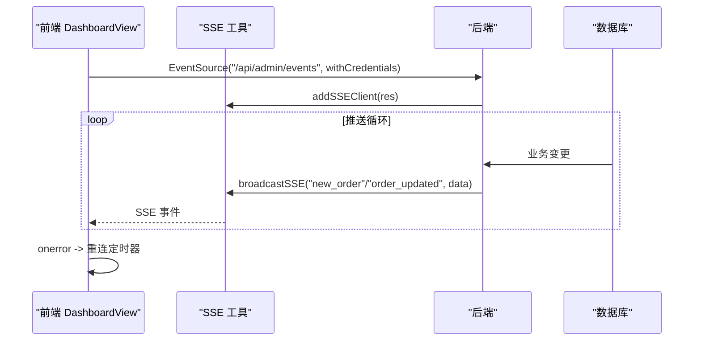
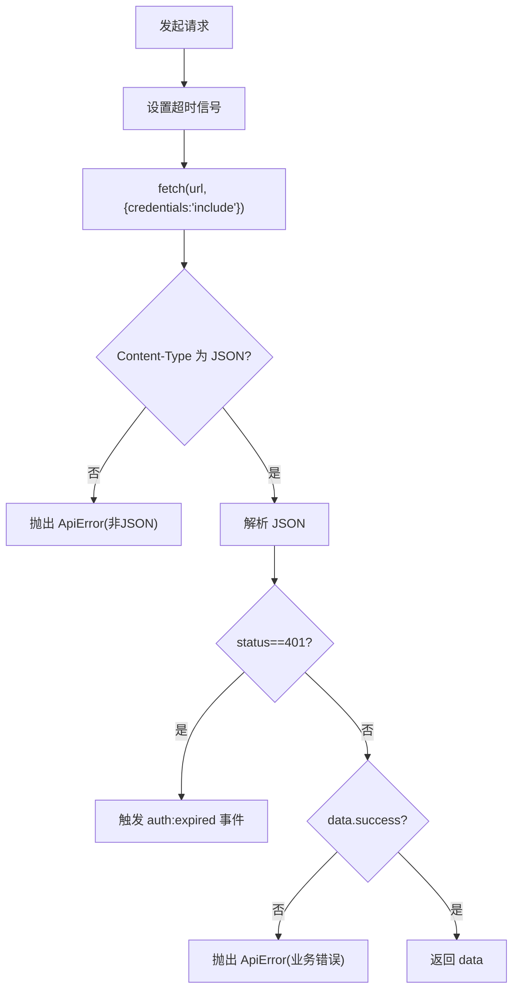
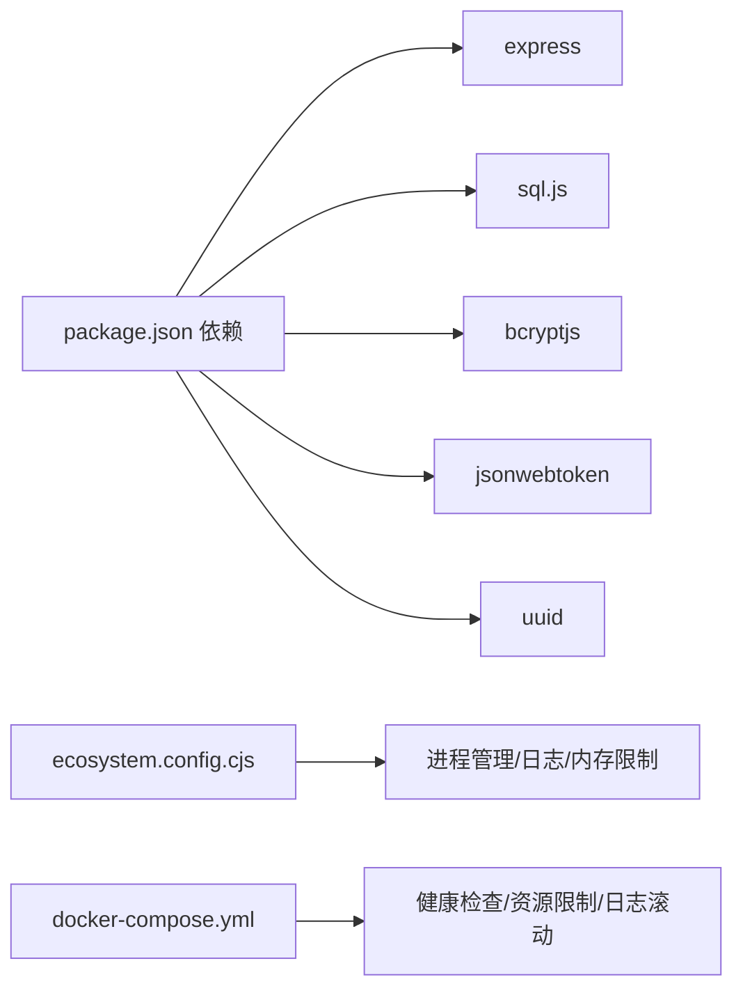

# 故障排除与调试

<cite>
**本文引用的文件**
- [server/src/index.ts](file://server/src/index.ts)
- [server/src/db/index.ts](file://server/src/db/index.ts)
- [server/src/db/init.ts](file://server/src/db/init.ts)
- [server/src/utils/sse.ts](file://server/src/utils/sse.ts)
- [server/src/utils/jwt.ts](file://server/src/utils/jwt.ts)
- [server/src/routes/auth.ts](file://server/src/routes/auth.ts)
- [server/src/routes/index.ts](file://server/src/routes/index.ts)
- [src/api/index.ts](file://src/api/index.ts)
- [src/admin/views/DebugView.vue](file://src/admin/views/DebugView.vue)
- [src/admin/components/DebugToolsPanel.vue](file://src/admin/components/DebugToolsPanel.vue)
- [src/admin/views/DashboardView.vue](file://src/admin/views/DashboardView.vue)
- [src/shared/composables/useOrderPolling.ts](file://src/shared/composables/useOrderPolling.ts)
- [ecosystem.config.cjs](file://ecosystem.config.cjs)
- [docker-compose.yml](file://docker-compose.yml)
- [package.json](file://package.json)
</cite>

## 目录
1. [简介](#简介)
2. [项目结构](#项目结构)
3. [核心组件](#核心组件)
4. [架构总览](#架构总览)
5. [详细组件分析](#详细组件分析)
6. [依赖关系分析](#依赖关系分析)
7. [性能考虑](#性能考虑)
8. [故障排除指南](#故障排除指南)
9. [结论](#结论)
10. [附录](#附录)

## 简介
本指南面向开发者与运维人员，系统性地梳理 RLRMS 在数据库连接、认证失败、SSE 实时推送、性能问题等方面的故障排除与调试方法。文档涵盖：
- 常见问题与解决方案
- 调试工具使用（浏览器开发者工具、Node.js 调试器、数据库查询工具）
- 日志分析与关键指标
- SSE 连接排查步骤
- 性能监控与优化建议
- 错误代码与处理流程
- 预防性维护与监控告警

## 项目结构
系统采用前后端一体化架构，服务端基于 Express，前端基于 Vue 3，使用 sql.js 内嵌数据库，支持生产环境部署与健康检查。

图示来源
- [server/src/index.ts:1-171](file://server/src/index.ts#L1-L171)
- [server/src/routes/index.ts:1-18](file://server/src/routes/index.ts#L1-L18)
- [server/src/routes/auth.ts:1-405](file://server/src/routes/auth.ts#L1-L405)
- [server/src/db/index.ts:1-156](file://server/src/db/index.ts#L1-L156)
- [server/src/db/init.ts:1-204](file://server/src/db/init.ts#L1-L204)
- [server/src/utils/sse.ts:1-59](file://server/src/utils/sse.ts#L1-L59)
- [server/src/utils/jwt.ts:1-27](file://server/src/utils/jwt.ts#L1-L27)
- [src/api/index.ts:1-608](file://src/api/index.ts#L1-L608)

章节来源
- [server/src/index.ts:1-171](file://server/src/index.ts#L1-L171)
- [server/src/routes/index.ts:1-18](file://server/src/routes/index.ts#L1-L18)
- [server/src/db/index.ts:1-156](file://server/src/db/index.ts#L1-L156)
- [server/src/db/init.ts:1-204](file://server/src/db/init.ts#L1-L204)
- [server/src/utils/sse.ts:1-59](file://server/src/utils/sse.ts#L1-L59)
- [server/src/utils/jwt.ts:1-27](file://server/src/utils/jwt.ts#L1-L27)
- [src/api/index.ts:1-608](file://src/api/index.ts#L1-L608)

## 核心组件
- 应用入口与中间件：负责 CORS、压缩、安全头、静态资源、健康检查、全局错误处理与数据库就绪保护。
- 数据库层：sql.js 内嵌数据库封装，提供批量写入、去抖保存、事务式批处理。
- 认证与令牌：基于 JWT 的管理员与客户认证，带速率限制与 Cookie 安全策略。
- SSE 实时推送：集中式客户端管理与广播，支持断线重连与降级轮询。
- 前端 API 封装：统一错误处理、超时控制、缓存策略与凭据携带。

章节来源
- [server/src/index.ts:29-142](file://server/src/index.ts#L29-L142)
- [server/src/db/index.ts:75-156](file://server/src/db/index.ts#L75-L156)
- [server/src/routes/auth.ts:62-344](file://server/src/routes/auth.ts#L62-L344)
- [server/src/utils/sse.ts:12-59](file://server/src/utils/sse.ts#L12-L59)
- [src/api/index.ts:54-127](file://src/api/index.ts#L54-L127)

## 架构总览
下图展示从浏览器到数据库的关键调用链路与异常处理路径。

图示来源
- [src/api/index.ts:54-127](file://src/api/index.ts#L54-L127)
- [server/src/index.ts:33-139](file://server/src/index.ts#L33-L139)
- [server/src/routes/auth.ts:62-344](file://server/src/routes/auth.ts#L62-L344)
- [server/src/db/index.ts:75-156](file://server/src/db/index.ts#L75-L156)

## 详细组件分析

### 数据库层（sql.js 封装）
- 初始化与迁移：首次启动创建表与索引，注入默认设置与管理员账户，并执行幂等迁移。
- 写入优化：批量开始/结束与去抖保存，降低磁盘 I/O。
- 查询接口：单行/多行/执行原生命令，统一错误抛出与一致性保障。

图示来源
- [server/src/db/init.ts:5-203](file://server/src/db/init.ts#L5-L203)
- [server/src/db/index.ts:75-156](file://server/src/db/index.ts#L75-L156)

章节来源
- [server/src/db/init.ts:1-204](file://server/src/db/init.ts#L1-L204)
- [server/src/db/index.ts:1-156](file://server/src/db/index.ts#L1-L156)

### 认证与令牌（JWT）
- 管理员登录：IP 限流、密码校验、签发 httpOnly Cookie，支持客户端登录与自动注册。
- 客户端登录：手机号格式校验、密码强度校验、自动注册与幂等冲突处理。
- 令牌验证：解码并校验，生产环境要求显式设置 JWT_SECRET。

图示来源
- [server/src/routes/auth.ts:62-144](file://server/src/routes/auth.ts#L62-L144)
- [server/src/utils/jwt.ts:16-26](file://server/src/utils/jwt.ts#L16-L26)

章节来源
- [server/src/routes/auth.ts:1-405](file://server/src/routes/auth.ts#L1-L405)
- [server/src/utils/jwt.ts:1-27](file://server/src/utils/jwt.ts#L1-L27)

### SSE 实时推送
- 客户端管理：添加/移除连接，遍历副本广播，异常自动清理。
- 前端集成：EventSource 连接、事件监听、断线重连与降级轮询切换。

图示来源
- [server/src/utils/sse.ts:12-59](file://server/src/utils/sse.ts#L12-L59)
- [src/admin/views/DashboardView.vue:302-446](file://src/admin/views/DashboardView.vue#L302-L446)

章节来源
- [server/src/utils/sse.ts:1-59](file://server/src/utils/sse.ts#L1-L59)
- [src/admin/views/DashboardView.vue:302-446](file://src/admin/views/DashboardView.vue#L302-L446)
- [src/shared/composables/useOrderPolling.ts:1-55](file://src/shared/composables/useOrderPolling.ts#L1-L55)

### 前端 API 封装与错误处理
- 统一请求：超时、凭据、合并信号。
- 错误处理：401 触发全局事件、非 JSON 防御、统一 ApiError 抛出。
- 缓存策略：stale-while-revalidate，提升弱网体验。

图示来源
- [src/api/index.ts:54-127](file://src/api/index.ts#L54-L127)

章节来源
- [src/api/index.ts:1-608](file://src/api/index.ts#L1-L608)

## 依赖关系分析
- 运行时依赖：Express、sql.js、bcryptjs、jsonwebtoken、uuid、cookie-parser、compression、cors。
- 进程管理：PM2（ecosystem.config.cjs），容器编排：docker-compose（健康检查、资源限制、日志滚动）。
- 环境变量：PORT、NODE_ENV、JWT_SECRET、FRONTEND_URL。

图示来源
- [package.json:16-41](file://package.json#L16-L41)
- [ecosystem.config.cjs:1-19](file://ecosystem.config.cjs#L1-19)
- [docker-compose.yml:1-54](file://docker-compose.yml#L1-L54)

章节来源
- [package.json:1-64](file://package.json#L1-L64)
- [ecosystem.config.cjs:1-19](file://ecosystem.config.cjs#L1-L19)
- [docker-compose.yml:1-54](file://docker-compose.yml#L1-L54)

## 性能考虑
- 数据库写入：批量开始/结束与 50ms 去抖保存，减少磁盘 I/O。
- 压缩策略：SSE 响应不压缩，避免缓冲导致实时性下降。
- 前端缓存：stale-while-revalidate 策略，降低网络往返。
- 轮询降级：SSE 断开后自动启用轮询，避免长时间无更新。
- 进程与容器：PM2 自动重启与内存上限，Docker 资源限制与健康检查。

章节来源
- [server/src/db/index.ts:36-73](file://server/src/db/index.ts#L36-L73)
- [server/src/index.ts:44-55](file://server/src/index.ts#L44-L55)
- [src/api/index.ts:5-34](file://src/api/index.ts#L5-L34)
- [src/shared/composables/useOrderPolling.ts:19-47](file://src/shared/composables/useOrderPolling.ts#L19-L47)
- [ecosystem.config.cjs:8-16](file://ecosystem.config.cjs#L8-L16)
- [docker-compose.yml:40-54](file://docker-compose.yml#L40-L54)

## 故障排除指南

### 通用诊断流程
- 确认服务状态：查看 /health 健康端点与容器/进程日志。
- 检查环境变量：确认 PORT、NODE_ENV、JWT_SECRET、FRONTEND_URL。
- 验证数据库：确认数据库文件存在、初始化完成、索引存在。
- 复现问题：使用浏览器开发者工具 Network/Console，前端 API 封装会抛出统一错误。
- 降级验证：关闭 SSE，启用轮询，确认功能可用。

章节来源
- [server/src/index.ts:89-95](file://server/src/index.ts#L89-L95)
- [server/src/db/init.ts:140-203](file://server/src/db/init.ts#L140-L203)
- [src/api/index.ts:54-127](file://src/api/index.ts#L54-L127)

### 数据库连接问题
- 现象
  - 503 Service Unavailable，提示数据库初始化中。
  - 首次访问卡顿或失败。
- 排查步骤
  - 检查 /health 端点状态。
  - 查看数据库文件是否存在与权限。
  - 确认初始化日志“Database initialized successfully”。
  - 如需重置，使用管理端调试工具的“重置数据库”（谨慎）。
- 关键日志
  - “Database initialized successfully”
  - “Failed to initialize database: ...”
- 相关实现
  - 数据库就绪保护与错误处理。
  - 批处理与去抖保存。

章节来源
- [server/src/index.ts:68-78](file://server/src/index.ts#L68-L78)
- [server/src/index.ts:147-160](file://server/src/index.ts#L147-L160)
- [server/src/db/init.ts:138-203](file://server/src/db/init.ts#L138-L203)
- [server/src/db/index.ts:22-60](file://server/src/db/index.ts#L22-L60)

### 认证失败
- 现象
  - 登录 401，提示用户名或密码错误。
  - 429 过多尝试。
  - 401 Token 失效或校验失败。
- 排查步骤
  - 确认用户名/密码正确，手机号格式与密码长度。
  - 检查 IP 限流是否触发。
  - 确认 Cookie 是否携带与 httpOnly 设置。
  - 生产环境必须设置 JWT_SECRET，否则重启后所有 token 失效。
- 相关实现
  - 登录路由、速率限制、JWT 校验、Cookie 安全策略。

章节来源
- [server/src/routes/auth.ts:62-144](file://server/src/routes/auth.ts#L62-L144)
- [server/src/routes/auth.ts:157-179](file://server/src/routes/auth.ts#L157-L179)
- [server/src/utils/jwt.ts:16-26](file://server/src/utils/jwt.ts#L16-L26)

### SSE 连接问题
- 现象
  - 订单实时推送中断，前端显示断线并自动轮询。
  - EventSource 报错，定时重连。
- 排查步骤
  - 检查后端 SSE 客户端数量与广播逻辑。
  - 前端断线后自动启用轮询，确认轮询正常。
  - 确认 /api/admin/events 可访问且 withCredentials。
- 相关实现
  - SSE 客户端管理与广播。
  - 前端 EventSource 连接、断线重连与降级轮询。

章节来源
- [server/src/utils/sse.ts:12-59](file://server/src/utils/sse.ts#L12-L59)
- [src/admin/views/DashboardView.vue:302-446](file://src/admin/views/DashboardView.vue#L302-L446)
- [src/shared/composables/useOrderPolling.ts:19-47](file://src/shared/composables/useOrderPolling.ts#L19-L47)

### 性能问题
- 现象
  - 响应慢、CPU 占用高、内存增长。
- 排查步骤
  - 使用 PM2 日志与 Docker 日志观察内存与重启情况。
  - 检查是否频繁写入，确认批处理与去抖保存生效。
  - 确认 SSE 不压缩，避免缓冲。
- 优化建议
  - 合理使用批处理接口，减少小事务。
  - 前端缓存策略减少重复请求。
  - 容器与进程设置内存上限，避免 OOM。

章节来源
- [ecosystem.config.cjs:8-16](file://ecosystem.config.cjs#L8-L16)
- [docker-compose.yml:40-54](file://docker-compose.yml#L40-L54)
- [server/src/db/index.ts:36-73](file://server/src/db/index.ts#L36-L73)
- [server/src/index.ts:44-55](file://server/src/index.ts#L44-L55)
- [src/api/index.ts:5-34](file://src/api/index.ts#L5-L34)

### 错误代码与处理
- 400：请求参数非法（如手机号格式、密码长度）。
- 401：未提供/无效 token、会话过期。
- 404：用户不存在。
- 429：登录尝试过多。
- 500：内部错误（生产环境隐藏具体堆栈）。
- 503：数据库未就绪。

章节来源
- [server/src/routes/auth.ts:78-108](file://server/src/routes/auth.ts#L78-L108)
- [server/src/routes/auth.ts:157-179](file://server/src/routes/auth.ts#L157-L179)
- [server/src/index.ts:121-139](file://server/src/index.ts#L121-L139)
- [server/src/index.ts:68-78](file://server/src/index.ts#L68-L78)

### 调试工具使用
- 浏览器开发者工具
  - Network：查看请求/响应、Content-Type、Cookies、超时。
  - Console：查看统一错误抛出与业务错误。
- Node.js 调试器
  - 使用 npm 脚本启动 watch 模式，结合断点定位问题。
- 数据库查询工具
  - 使用管理端“调试工具”SQL 执行器与模式浏览，执行原生命令与查看表结构。

章节来源
- [src/admin/views/DebugView.vue:1-34](file://src/admin/views/DebugView.vue#L1-L34)
- [src/admin/components/DebugToolsPanel.vue:135-213](file://src/admin/components/DebugToolsPanel.vue#L135-L213)
- [src/api/index.ts:598-608](file://src/api/index.ts#L598-L608)

### 日志分析与关键指标
- 关键日志
  - “Database initialized successfully”
  - “Failed to initialize database: ...”
  - “Warning: JWT_SECRET not set in production...”
- 关键指标
  - /health 状态与 dbReady 字段。
  - 容器内存使用与重启次数。
  - SSE 客户端数量与广播耗时。

章节来源
- [server/src/db/init.ts:138-203](file://server/src/db/init.ts#L138-L203)
- [server/src/index.ts:89-95](file://server/src/index.ts#L89-L95)
- [server/src/utils/jwt.ts:24-26](file://server/src/utils/jwt.ts#L24-L26)
- [ecosystem.config.cjs:13-16](file://ecosystem.config.cjs#L13-L16)
- [server/src/utils/sse.ts:55-59](file://server/src/utils/sse.ts#L55-L59)

### 预防性维护与监控告警
- 环境变量
  - 生产环境务必设置 JWT_SECRET，避免重启后全部掉线。
  - CORS 来源 FRONTEND_URL 明确配置。
- 进程与容器
  - PM2 自动重启与内存上限。
  - Docker 健康检查与日志滚动。
- 数据备份
  - 定期导出系统数据（前端提供导出接口）。
- 监控建议
  - 监控 /health、SSE 客户端数量、内存与 CPU。
  - 前端埋点上报 401 与错误分布。

章节来源
- [server/src/utils/jwt.ts:24-26](file://server/src/utils/jwt.ts#L24-L26)
- [ecosystem.config.cjs:8-16](file://ecosystem.config.cjs#L8-L16)
- [docker-compose.yml:32-54](file://docker-compose.yml#L32-L54)
- [src/api/index.ts:509-549](file://src/api/index.ts#L509-L549)

## 结论
通过统一的错误处理、数据库批处理与去抖保存、SSE 与轮询双通道、以及完善的日志与监控，RLRMS 在开发与生产环境中均具备良好的可观测性与可维护性。遵循本文提供的诊断流程与最佳实践，可快速定位并解决问题，保障系统稳定运行。

## 附录
- 常用端点
  - GET /health：健康检查
  - POST /api/auth/login：管理员登录
  - POST /api/auth/client/login：客户登录
  - GET /api/admin/events：SSE 实时事件
  - POST /api/admin/debug/query：调试 SQL 执行
- 常用脚本
  - npm run dev / dev:server：开发热重载
  - npm run start / start:production：生产启动
  - npm run db:init：初始化数据库

章节来源
- [server/src/index.ts:89-95](file://server/src/index.ts#L89-L95)
- [server/src/routes/auth.ts:62-144](file://server/src/routes/auth.ts#L62-L144)
- [src/admin/views/DashboardView.vue:302-446](file://src/admin/views/DashboardView.vue#L302-L446)
- [src/admin/components/DebugToolsPanel.vue:135-213](file://src/admin/components/DebugToolsPanel.vue#L135-L213)
- [package.json:6-14](file://package.json#L6-L14)