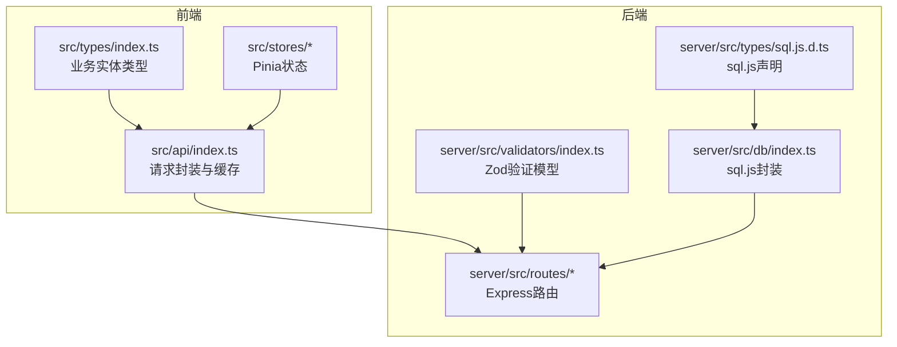
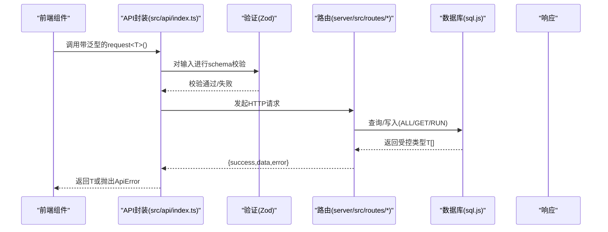
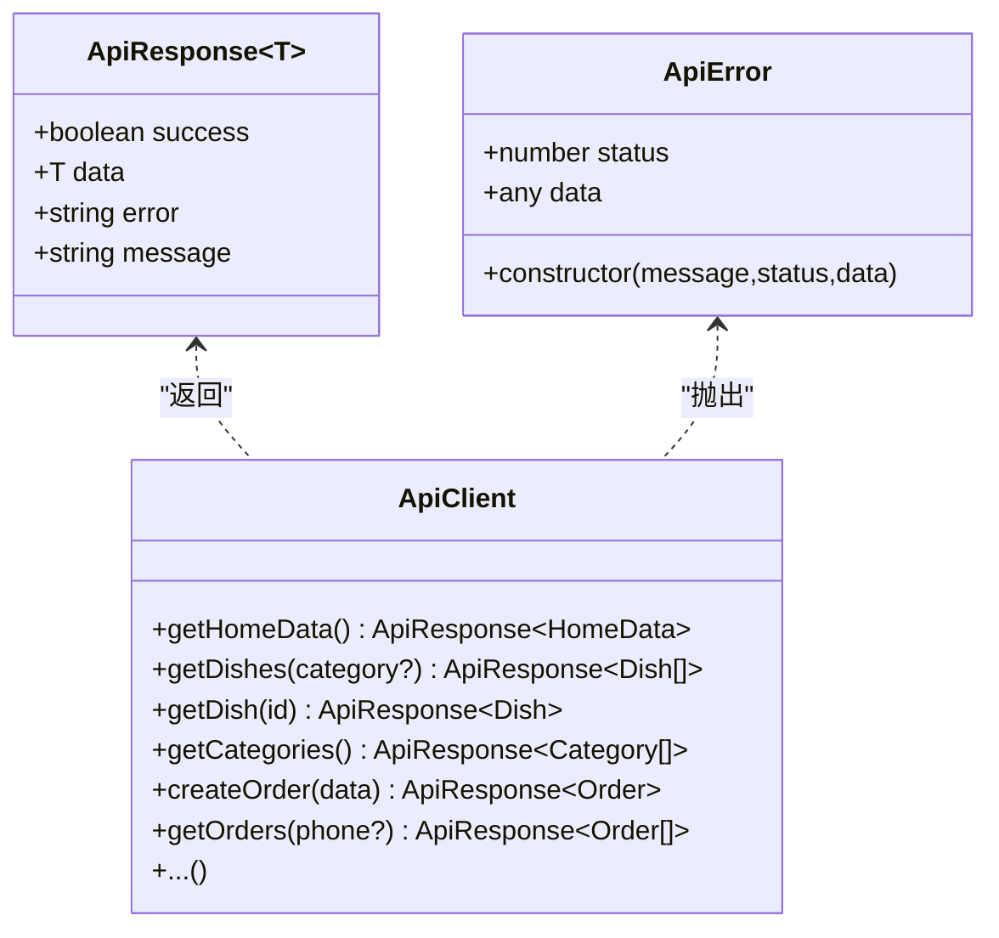
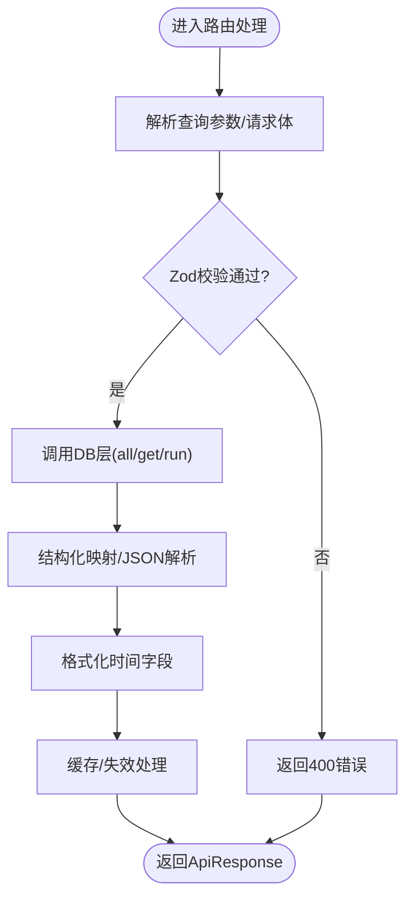
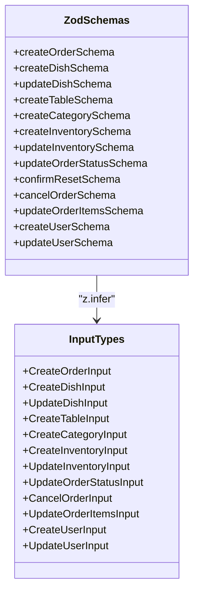
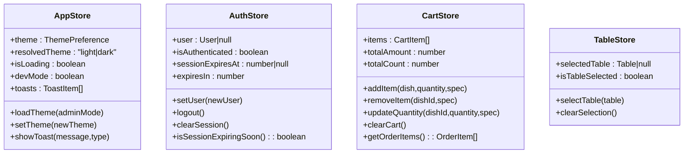
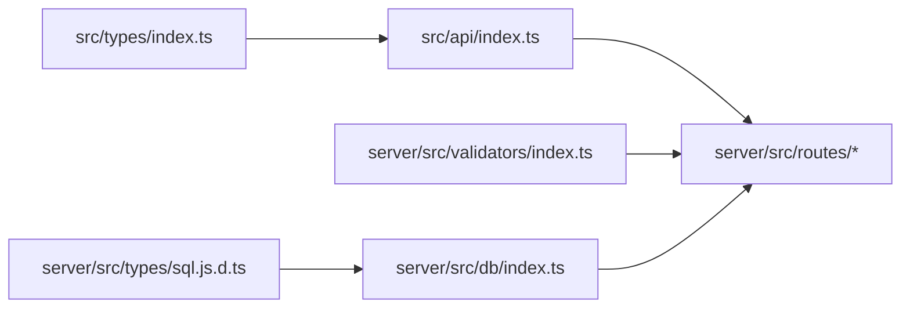

# TypeScript类型定义

<cite>
**本文引用的文件**
- [src/types/index.ts](file://src/types/index.ts)
- [server/src/types/sql.js.d.ts](file://server/src/types/sql.js.d.ts)
- [server/src/db/index.ts](file://server/src/db/index.ts)
- [server/src/validators/index.ts](file://server/src/validators/index.ts)
- [src/api/index.ts](file://src/api/index.ts)
- [src/stores/app.ts](file://src/stores/app.ts)
- [src/stores/auth.ts](file://src/stores/auth.ts)
- [src/stores/cart.ts](file://src/stores/cart.ts)
- [src/stores/table.ts](file://src/stores/table.ts)
- [server/src/utils/format.ts](file://server/src/utils/format.ts)
- [server/src/routes/dishes.ts](file://server/src/routes/dishes.ts)
- [server/src/routes/orders.ts](file://server/src/routes/orders.ts)
- [server/src/routes/tables.ts](file://server/src/routes/tables.ts)
- [server/src/routes/admin.ts](file://server/src/routes/admin.ts)
- [server/src/routes/index.ts](file://server/src/routes/index.ts)
</cite>

## 目录
1. [引言](#引言)
2. [项目结构](#项目结构)
3. [核心组件](#核心组件)
4. [架构总览](#架构总览)
5. [详细组件分析](#详细组件分析)
6. [依赖分析](#依赖分析)
7. [性能考虑](#性能考虑)
8. [故障排查指南](#故障排查指南)
9. [结论](#结论)
10. [附录](#附录)

## 引言
本文件系统性梳理 RLRMS 项目的 TypeScript 类型体系，覆盖前端与后端的类型定义、接口映射、验证模型、状态管理与数据库交互。重点解释以下方面：
- 接口与类型别名的设计原则与边界
- 泛型约束与条件类型在类型安全中的应用
- 前端 API 响应类型、数据库实体类型与表单验证类型之间的映射关系
- 类型推导、映射类型与条件类型的使用场景
- 如何通过类型系统提升代码质量与开发效率

## 项目结构
项目采用前后端分离的类型设计：
- 前端公共类型：统一的业务实体类型定义，供 API 层与状态管理共享
- 后端类型：数据库访问层对 sql.js 的声明类型，配合路由层的查询结果类型
- 验证层：基于 Zod 的输入验证模型，生成强类型的输入/输出类型
- 状态层：Pinia Store 中的响应式状态类型
- API 层：统一的请求封装与缓存策略，返回受控的响应类型

**图表来源**
- [src/types/index.ts:1-133](file://src/types/index.ts#L1-L133)
- [src/api/index.ts:1-608](file://src/api/index.ts#L1-L608)
- [server/src/db/index.ts:1-156](file://server/src/db/index.ts#L1-L156)
- [server/src/types/sql.js.d.ts:1-24](file://server/src/types/sql.js.d.ts#L1-L24)
- [server/src/validators/index.ts:1-123](file://server/src/validators/index.ts#L1-L123)
- [server/src/routes/dishes.ts:1-216](file://server/src/routes/dishes.ts#L1-L216)
- [server/src/routes/tables.ts:1-93](file://server/src/routes/tables.ts#L1-L93)
- [server/src/routes/orders.ts:1-552](file://server/src/routes/orders.ts#L1-L552)
- [server/src/routes/admin.ts:1-800](file://server/src/routes/admin.ts#L1-L800)

**章节来源**
- [src/types/index.ts:1-133](file://src/types/index.ts#L1-L133)
- [server/src/types/sql.js.d.ts:1-24](file://server/src/types/sql.js.d.ts#L1-L24)
- [server/src/db/index.ts:1-156](file://server/src/db/index.ts#L1-L156)
- [server/src/validators/index.ts:1-123](file://server/src/validators/index.ts#L1-L123)
- [src/api/index.ts:1-608](file://src/api/index.ts#L1-L608)
- [server/src/routes/index.ts:1-18](file://server/src/routes/index.ts#L1-L18)

## 核心组件
本节概述类型系统的关键构件及其职责。

- 通用响应类型
  - 前端统一响应包装：包含 success、data、error、message 字段，便于前端一致处理
  - 后端路由返回：遵循相同的成功/失败约定，便于前后端契约稳定

- 业务实体类型
  - 用户、管理员用户、桌位、分类、菜品、订单、库存、购物车项、仪表盘统计、联系卡片等
  - 关键设计点：可空字段明确标注；枚举值使用字面量联合类型，避免魔法字符串

- 验证模型与输入类型
  - 基于 Zod 的 schema 定义，涵盖订单、菜品、桌位、分类、库存、用户等
  - 通过 z.infer 生成对应的输入/输出类型，实现“声明即类型”的一致性

- 数据库访问类型
  - sql.js 的声明文件提供 Database、Statement、SqlJsStatic 的类型
  - 数据库读取/写入方法返回受控类型，支持泛型 T 的结果推导

- 前端 API 类型
  - 请求封装函数 request<T> 支持泛型响应类型
  - 缓存策略与超时控制，结合自定义错误类型 ApiError 提升健壮性

- 状态管理类型
  - Pinia Store 中的状态字段类型明确，计算属性与动作的返回类型清晰
  - 主题偏好、加载状态、调试模式、Toast 等类型均具象化

**章节来源**
- [src/types/index.ts:1-133](file://src/types/index.ts#L1-L133)
- [server/src/validators/index.ts:1-123](file://server/src/validators/index.ts#L1-L123)
- [server/src/types/sql.js.d.ts:1-24](file://server/src/types/sql.js.d.ts#L1-L24)
- [server/src/db/index.ts:101-140](file://server/src/db/index.ts#L101-L140)
- [src/api/index.ts:36-126](file://src/api/index.ts#L36-L126)
- [src/stores/app.ts:14-121](file://src/stores/app.ts#L14-L121)
- [src/stores/auth.ts:15-127](file://src/stores/auth.ts#L15-L127)
- [src/stores/cart.ts:9-182](file://src/stores/cart.ts#L9-L182)
- [src/stores/table.ts:5-24](file://src/stores/table.ts#L5-L24)

## 架构总览
类型系统贯穿“前端类型 → API 层 → 验证层 → 路由层 → 数据库层 → 响应层”的完整链路，形成闭环的类型安全。

**图表来源**
- [src/api/index.ts:54-114](file://src/api/index.ts#L54-L114)
- [server/src/validators/index.ts:111-123](file://server/src/validators/index.ts#L111-L123)
- [server/src/db/index.ts:112-140](file://server/src/db/index.ts#L112-L140)
- [server/src/routes/dishes.ts:25-65](file://server/src/routes/dishes.ts#L25-L65)
- [server/src/routes/orders.ts:194-353](file://server/src/routes/orders.ts#L194-L353)
- [server/src/routes/tables.ts:14-22](file://server/src/routes/tables.ts#L14-L22)

## 详细组件分析

### 前端类型与API映射
- 统一响应包装
  - 前端使用 ApiResponse<T> 包裹所有 API 响应，确保错误与成功路径一致
  - API 封装内部对非 JSON 响应进行防御性处理，避免异常分支污染

- 请求封装与缓存
  - request<T>() 支持泛型响应类型，自动合并信号与超时控制
  - 内置内存缓存（stale-while-revalidate），对热点数据进行缓存与刷新
  - 自定义 ApiError 类型，携带状态码与附加数据，便于前端统一处理

- 前端状态与类型
  - Pinia Store 的状态字段类型明确，如主题偏好、加载状态、Toast 列表等
  - 计算属性与动作返回类型清晰，减少运行时错误

**图表来源**
- [src/types/index.ts:2-7](file://src/types/index.ts#L2-L7)
- [src/api/index.ts:36-126](file://src/api/index.ts#L36-L126)

**章节来源**
- [src/types/index.ts:1-133](file://src/types/index.ts#L1-L133)
- [src/api/index.ts:1-608](file://src/api/index.ts#L1-L608)
- [src/stores/app.ts:14-121](file://src/stores/app.ts#L14-L121)
- [src/stores/auth.ts:15-127](file://src/stores/auth.ts#L15-L127)
- [src/stores/cart.ts:9-182](file://src/stores/cart.ts#L9-L182)
- [src/stores/table.ts:5-24](file://src/stores/table.ts#L5-L24)

### 后端类型与数据库映射
- sql.js 声明类型
  - Database、Statement、SqlJsStatic 的接口定义，确保数据库操作的类型安全
  - run/get/all/exec 等方法返回受控类型，支持泛型参数 T

- 路由层类型映射
  - dishes/tables/orders/admin 路由对查询结果进行结构化映射
  - JSON 字段（tags/specs）在路由层进行安全解析，避免运行时异常
  - 时间字段通过 formatDateTime 统一格式化，确保前后端一致

**图表来源**
- [server/src/db/index.ts:112-140](file://server/src/db/index.ts#L112-L140)
- [server/src/types/sql.js.d.ts:1-24](file://server/src/types/sql.js.d.ts#L1-L24)
- [server/src/routes/dishes.ts:69-117](file://server/src/routes/dishes.ts#L69-L117)
- [server/src/routes/tables.ts:25-55](file://server/src/routes/tables.ts#L25-L55)
- [server/src/routes/orders.ts:194-353](file://server/src/routes/orders.ts#L194-L353)
- [server/src/utils/format.ts:1-12](file://server/src/utils/format.ts#L1-L12)

**章节来源**
- [server/src/types/sql.js.d.ts:1-24](file://server/src/types/sql.js.d.ts#L1-L24)
- [server/src/db/index.ts:1-156](file://server/src/db/index.ts#L1-L156)
- [server/src/routes/dishes.ts:1-216](file://server/src/routes/dishes.ts#L1-L216)
- [server/src/routes/tables.ts:1-93](file://server/src/routes/tables.ts#L1-L93)
- [server/src/routes/orders.ts:1-552](file://server/src/routes/orders.ts#L1-L552)
- [server/src/utils/format.ts:1-12](file://server/src/utils/format.ts#L1-L12)

### 验证模型与输入类型
- Zod Schema 设计
  - 订单、菜品、桌位、分类、库存、用户等均有独立 schema
  - 使用枚举类型限制状态与角色，使用正则表达式限制手机号格式
  - 数值范围与整数约束确保业务合理性

- 类型推导与一致性
  - 通过 z.infer 生成 Create/Update/Input 等类型，保证前端/后端输入一致
  - 在路由层对请求体进行 safeParse，失败时返回明确错误信息

**图表来源**
- [server/src/validators/index.ts:1-123](file://server/src/validators/index.ts#L1-L123)

**章节来源**
- [server/src/validators/index.ts:1-123](file://server/src/validators/index.ts#L1-L123)

### 状态管理类型
- 应用状态（主题、加载、调试、Toast）
  - 主题偏好使用字面量联合类型，避免拼写错误
  - Toast 列表使用固定结构，支持最多 5 条，超出时移除最早一条

- 认证状态（JWT 会话）
  - 会话过期时间、保活定时器、即将过期阈值等均以数值常量形式定义
  - 通过 computed 计算剩余时间，避免重复计算

- 购物车状态
  - CartItem 与 OrderItem 结构差异通过映射函数转换
  - 本地持久化使用 JSON 序列化剥离响应式代理，确保存储为纯对象

**图表来源**
- [src/stores/app.ts:14-121](file://src/stores/app.ts#L14-L121)
- [src/stores/auth.ts:15-127](file://src/stores/auth.ts#L15-L127)
- [src/stores/cart.ts:9-182](file://src/stores/cart.ts#L9-L182)
- [src/stores/table.ts:5-24](file://src/stores/table.ts#L5-L24)

**章节来源**
- [src/stores/app.ts:1-122](file://src/stores/app.ts#L1-L122)
- [src/stores/auth.ts:1-128](file://src/stores/auth.ts#L1-L128)
- [src/stores/cart.ts:1-183](file://src/stores/cart.ts#L1-L183)
- [src/stores/table.ts:1-25](file://src/stores/table.ts#L1-L25)

## 依赖分析
- 前端到后端的类型依赖
  - 前端类型定义被 API 层引用，API 层再调用后端路由
  - 验证模型在路由层被消费，确保输入约束与业务规则一致

- 后端内部依赖
  - 路由层依赖验证模型与数据库封装
  - 数据库封装依赖 sql.js 声明类型，提供 run/get/all/exec 等方法

**图表来源**
- [src/types/index.ts:1-133](file://src/types/index.ts#L1-L133)
- [src/api/index.ts:1-608](file://src/api/index.ts#L1-L608)
- [server/src/validators/index.ts:1-123](file://server/src/validators/index.ts#L1-L123)
- [server/src/db/index.ts:1-156](file://server/src/db/index.ts#L1-L156)
- [server/src/types/sql.js.d.ts:1-24](file://server/src/types/sql.js.d.ts#L1-L24)

**章节来源**
- [server/src/routes/index.ts:1-18](file://server/src/routes/index.ts#L1-L18)

## 性能考虑
- 前端缓存策略
  - 内存缓存采用 stale-while-revalidate，热点数据快速返回，后台静默刷新
  - TTL 控制与键空间管理，避免无限增长

- 数据库写入优化
  - 批量事务 beginBatch/endBatch，降低磁盘写入次数
  - debounce 保存策略，合并短时间内的多次写入

- 查询优化
  - 路由层对订单明细采用批量查询，避免 N+1 查询问题
  - 缓存键按功能域划分，精确失效

**章节来源**
- [src/api/index.ts:9-34](file://src/api/index.ts#L9-L34)
- [server/src/db/index.ts:47-73](file://server/src/db/index.ts#L47-L73)
- [server/src/routes/orders.ts:96-130](file://server/src/routes/orders.ts#L96-L130)
- [server/src/routes/dishes.ts:27-65](file://server/src/routes/dishes.ts#L27-L65)

## 故障排查指南
- API 错误处理
  - 非 JSON 响应会被识别并抛出 ApiError，包含状态码与数据
  - 401 未授权时触发全局事件，提示会话过期

- 验证失败
  - Zod 校验失败返回明确错误消息，定位到首个错误字段
  - 输入类型与业务约束不匹配时，优先检查 schema 定义

- 数据库异常
  - run/get/all/exec 返回受控类型，异常时查看具体 SQL 与参数
  - 批量写入失败时，检查 beginBatch/endBatch 是否正确配对

- 状态同步问题
  - Pinia Store 的持久化使用 JSON 序列化，避免响应式代理写入
  - 计算属性依赖的源数据变更需确保响应式追踪

**章节来源**
- [src/api/index.ts:83-114](file://src/api/index.ts#L83-L114)
- [server/src/validators/index.ts:111-123](file://server/src/validators/index.ts#L111-L123)
- [server/src/db/index.ts:101-109](file://server/src/db/index.ts#L101-L109)
- [src/stores/cart.ts:113-121](file://src/stores/cart.ts#L113-L121)

## 结论
RLRMS 的类型系统通过“前端类型 + API 封装 + 验证模型 + 路由映射 + 数据库封装”的闭环设计，在多个层面实现了强类型约束与运行时安全：
- 前后端契约稳定，响应与错误处理一致
- 输入/输出类型由 Zod 自动生成，避免手写类型漂移
- 数据库访问通过声明类型与泛型方法保障结果结构
- 状态管理类型明确，计算属性与动作返回类型清晰
- 缓存、批处理与查询优化提升了整体性能与可靠性

## 附录
- 类型最佳实践
  - 使用字面量联合类型替代字符串枚举，减少拼写错误
  - 对可空字段明确标注，避免隐式空值传播
  - 通过 z.infer 生成输入类型，保持前后端一致性
  - 在路由层对 JSON 字段进行安全解析，避免运行时异常
  - 使用泛型与条件类型增强复用性与可维护性

- 常见问题与建议
  - 若出现“类型不匹配”，优先检查 Zod schema 与前端类型定义
  - 若数据库写入异常，检查批量事务与 debounce 保存逻辑
  - 若缓存命中异常，检查缓存键与 TTL 设置