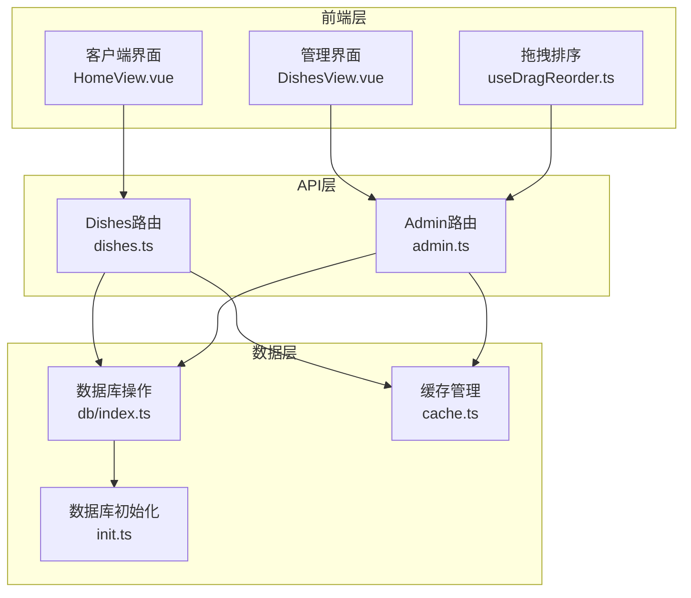
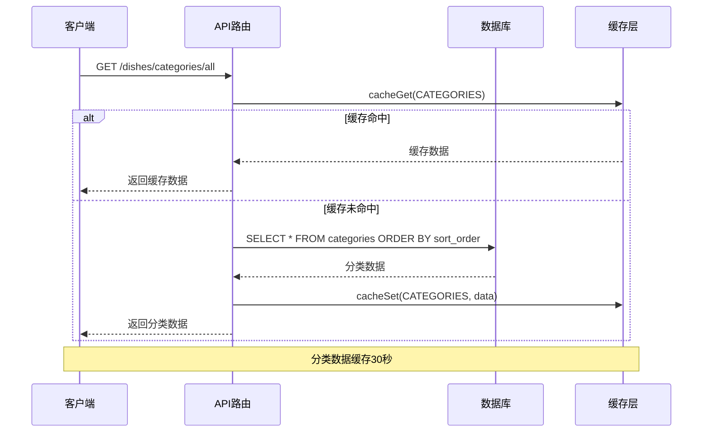
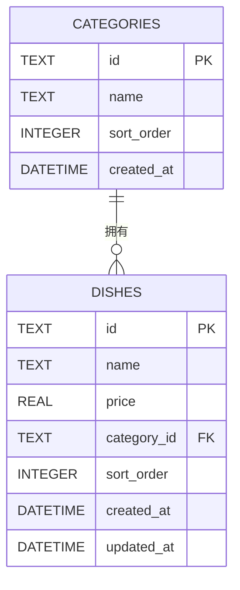
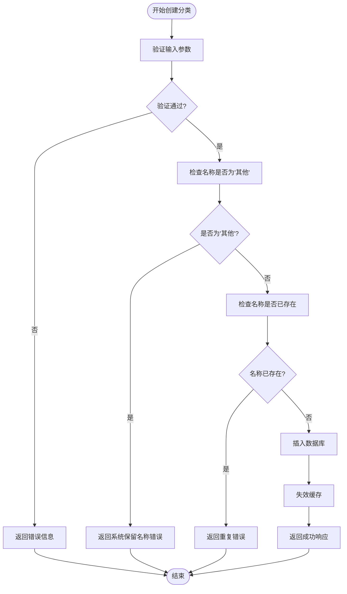
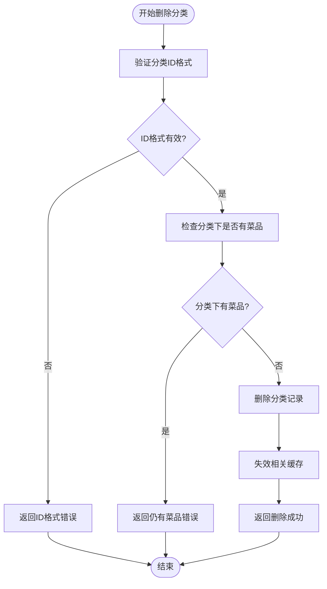
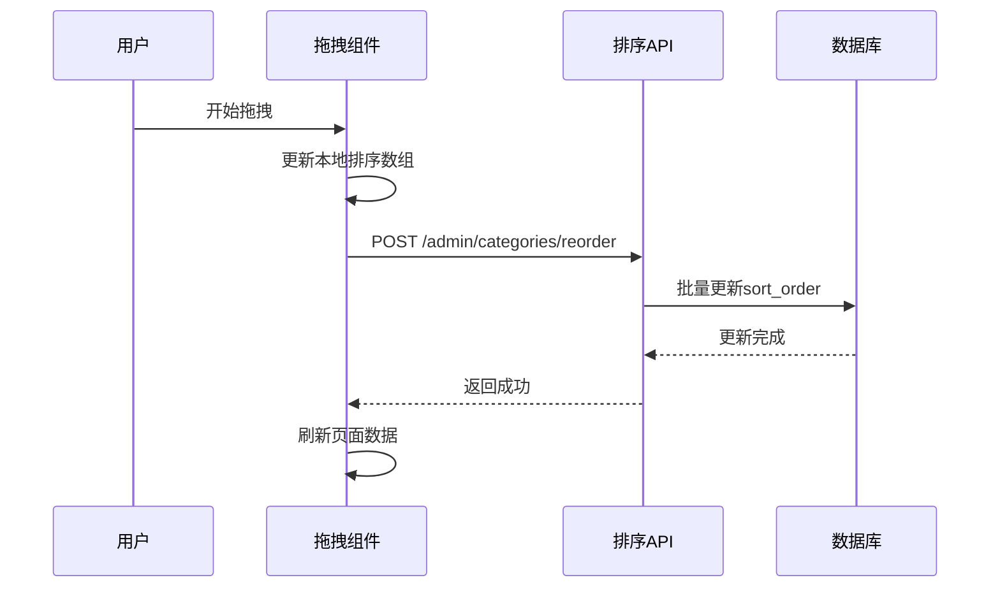
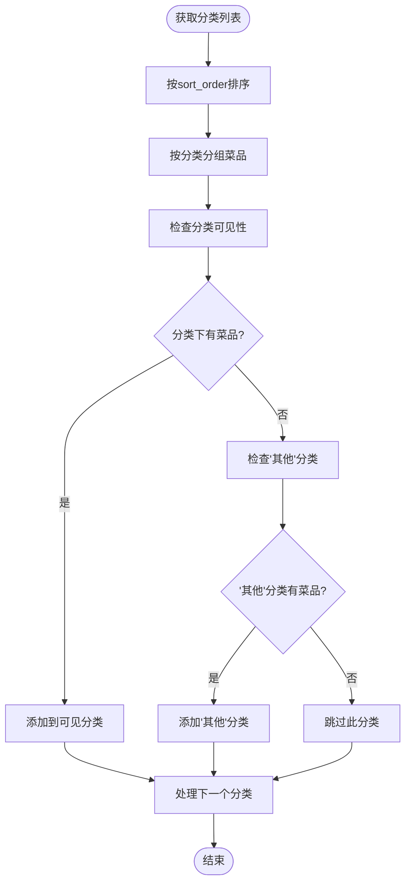
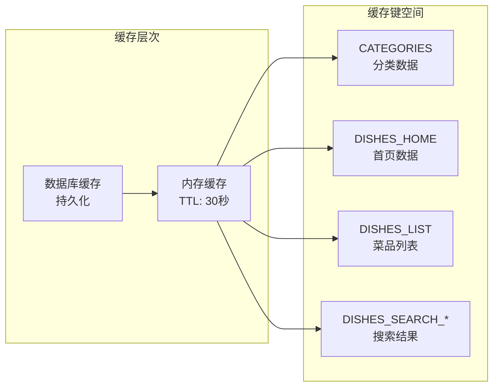
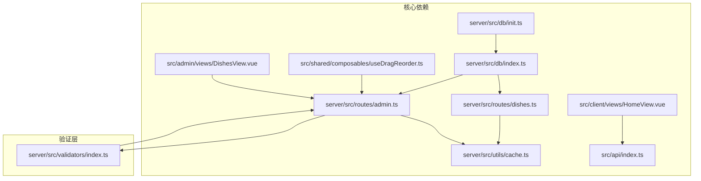

# 分类表设计

<cite>
**本文档引用的文件**
- [server/src/db/init.ts](file://server/src/db/init.ts)
- [server/src/db/index.ts](file://server/src/db/index.ts)
- [server/src/routes/dishes.ts](file://server/src/routes/dishes.ts)
- [server/src/routes/admin.ts](file://server/src/routes/admin.ts)
- [server/src/utils/cache.ts](file://server/src/utils/cache.ts)
- [server/src/validators/index.ts](file://server/src/validators/index.ts)
- [src/client/views/HomeView.vue](file://src/client/views/HomeView.vue)
- [src/shared/composables/useDragReorder.ts](file://src/shared/composables/useDragReorder.ts)
- [src/admin/views/DishesView.vue](file://src/admin/views/DishesView.vue)
</cite>

## 目录
1. [简介](#简介)
2. [项目结构](#项目结构)
3. [核心组件](#核心组件)
4. [架构概览](#架构概览)
5. [详细组件分析](#详细组件分析)
6. [依赖关系分析](#依赖关系分析)
7. [性能考虑](#性能考虑)
8. [故障排除指南](#故障排除指南)
9. [结论](#结论)

## 简介

本文档详细描述了餐厅管理系统中分类表(categories)的设计与实现。分类表是菜品管理的核心数据结构，负责组织和展示菜品内容。本文档深入解释了分类表的字段设计、菜品分类管理机制、分类层级结构、排序算法和显示控制，并提供了完整的SQL创建语句、索引设计和数据字典。

## 项目结构

分类表设计涉及前后端多个层次的协作，包括数据库层、服务端路由层、客户端视图层和缓存层。整个系统采用分层架构设计，确保数据的一致性和性能优化。

**图表来源**
- [server/src/db/init.ts:37-43](file://server/src/db/init.ts#L37-L43)
- [server/src/routes/dishes.ts:1-23](file://server/src/routes/dishes.ts#L1-L23)
- [server/src/routes/admin.ts:548-639](file://server/src/routes/admin.ts#L548-L639)

## 核心组件

### 数据库表结构

分类表(categories)采用SQLite数据库存储，具有以下核心字段：

| 字段名 | 数据类型 | 约束条件 | 描述 | 默认值 |
|--------|----------|----------|------|--------|
| id | TEXT | PRIMARY KEY | 分类唯一标识符 | 自动生成 |
| name | TEXT | NOT NULL | 分类名称 | - |
| sort_order | INTEGER | DEFAULT 0 | 排序权重 | 0 |
| created_at | DATETIME | DEFAULT CURRENT_TIMESTAMP | 创建时间 | 当前时间戳 |

### 关键特性

1. **主键设计**: 使用UUID作为主键，确保全局唯一性
2. **排序机制**: 通过sort_order字段实现灵活的排序控制
3. **索引优化**: 在sort_order上建立索引提升查询性能
4. **缓存策略**: 实现TTL内存缓存机制

**章节来源**
- [server/src/db/init.ts:37-43](file://server/src/db/init.ts#L37-L43)
- [server/src/db/init.ts:124-137](file://server/src/db/init.ts#L124-L137)

## 架构概览

分类系统的整体架构采用分层设计，确保数据流的清晰性和可维护性。

**图表来源**
- [server/src/routes/dishes.ts:159-174](file://server/src/routes/dishes.ts#L159-L174)
- [server/src/utils/cache.ts:18-36](file://server/src/utils/cache.ts#L18-L36)

## 详细组件分析

### 数据库初始化与表结构

分类表在数据库初始化过程中创建，采用标准的SQL建表语法：

**图表来源**
- [server/src/db/init.ts:37-43](file://server/src/db/init.ts#L37-L43)
- [server/src/db/init.ts:46-61](file://server/src/db/init.ts#L46-L61)

### CRUD操作实现

#### 创建分类

分类创建流程包含输入验证、重复检查和数据库写入：

**图表来源**
- [server/src/routes/admin.ts:560-593](file://server/src/routes/admin.ts#L560-L593)
- [server/src/validators/index.ts:48-51](file://server/src/validators/index.ts#L48-L51)

#### 删除分类

分类删除操作需要确保数据完整性：

**图表来源**
- [server/src/routes/admin.ts:595-616](file://server/src/routes/admin.ts#L595-L616)

### 排序算法实现

#### 前端拖拽排序

前端实现了基于拖拽的排序功能，支持实时排序调整：

**图表来源**
- [src/shared/composables/useDragReorder.ts:54-95](file://src/shared/composables/useDragReorder.ts#L54-L95)
- [server/src/routes/admin.ts:618-639](file://server/src/routes/admin.ts#L618-L639)

#### 显示控制逻辑

客户端根据菜品实际存在情况动态显示分类：

**图表来源**
- [src/client/views/HomeView.vue:45-66](file://src/client/views/HomeView.vue#L45-L66)

### 缓存策略

系统实现了多层次的缓存策略来提升性能：

**图表来源**
- [server/src/utils/cache.ts:64-72](file://server/src/utils/cache.ts#L64-L72)
- [server/src/db/index.ts:37-44](file://server/src/db/index.ts#L37-L44)

**章节来源**
- [server/src/utils/cache.ts:1-73](file://server/src/utils/cache.ts#L1-L73)
- [server/src/db/index.ts:23-73](file://server/src/db/index.ts#L23-L73)

## 依赖关系分析

分类系统各组件之间的依赖关系如下：

**图表来源**
- [server/src/db/init.ts:1-204](file://server/src/db/init.ts#L1-L204)
- [server/src/routes/admin.ts:548-639](file://server/src/routes/admin.ts#L548-L639)

**章节来源**
- [server/src/db/init.ts:1-204](file://server/src/db/init.ts#L1-L204)
- [server/src/routes/admin.ts:548-639](file://server/src/routes/admin.ts#L548-L639)

## 性能考虑

### 查询优化

1. **索引设计**: 在categories.sort_order上建立了索引，确保排序查询的高效性
2. **批量操作**: 使用beginBatch/endBatch进行批量数据库操作，减少磁盘I/O
3. **缓存策略**: 实现30秒TTL的内存缓存，减少重复查询

### 存储优化

1. **数据类型选择**: 使用INTEGER存储排序字段，节省存储空间
2. **时间戳管理**: 自动维护created_at和updated_at字段
3. **外键约束**: 通过FOREIGN KEY确保数据一致性

## 故障排除指南

### 常见问题及解决方案

#### 分类排序异常
- **症状**: 分类显示顺序混乱
- **原因**: 排序字段数据损坏或缓存未刷新
- **解决**: 调用排序API重新设置sort_order，清除相关缓存

#### 分类删除失败
- **症状**: 删除分类时报"分类下还有菜品"
- **原因**: 分类关联的菜品未清理
- **解决**: 先删除或转移分类下的所有菜品，再删除分类

#### 缓存数据陈旧
- **症状**: 新增/修改分类后界面显示异常
- **原因**: 缓存未及时失效
- **解决**: 系统自动失效相关缓存，等待30秒或手动刷新页面

**章节来源**
- [server/src/routes/admin.ts:595-616](file://server/src/routes/admin.ts#L595-L616)
- [server/src/utils/cache.ts:41-54](file://server/src/utils/cache.ts#L41-L54)

## 结论

分类表设计体现了现代Web应用的最佳实践，通过合理的数据结构设计、完善的缓存策略和优雅的用户交互体验，实现了高效的菜品分类管理。系统的主要优势包括：

1. **数据一致性**: 通过外键约束和事务处理确保数据完整性
2. **性能优化**: 多层次缓存和索引设计提升查询效率
3. **用户体验**: 实时拖拽排序和智能显示控制
4. **可维护性**: 清晰的分层架构和模块化设计

该设计为餐厅管理系统的菜品分类功能提供了坚实的技术基础，能够满足日常运营的各种需求，并具备良好的扩展性和维护性。