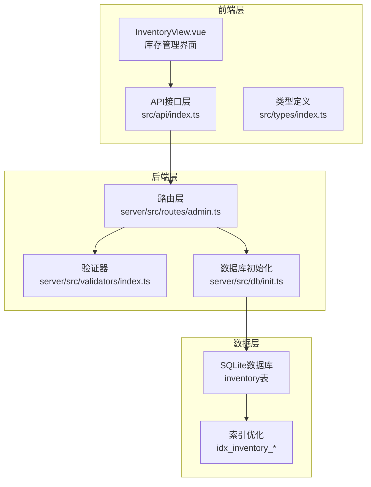
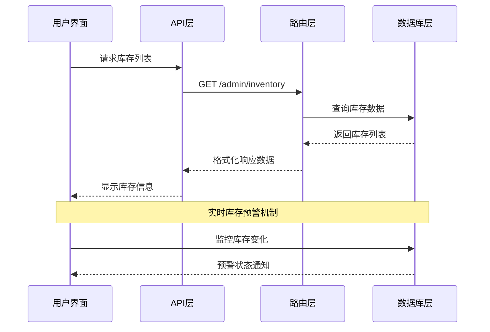
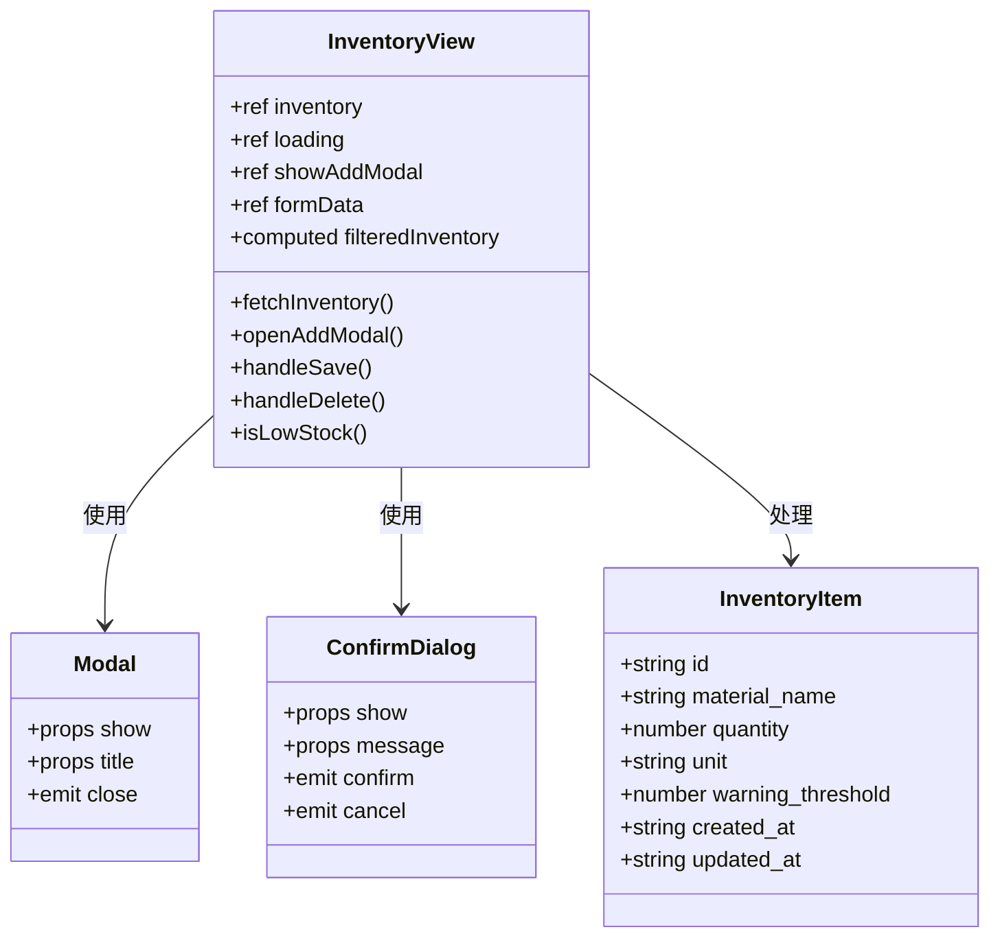
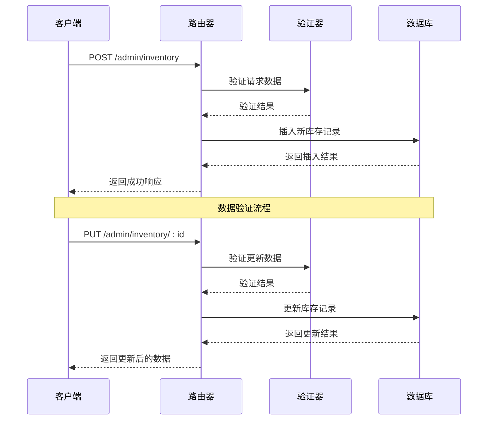
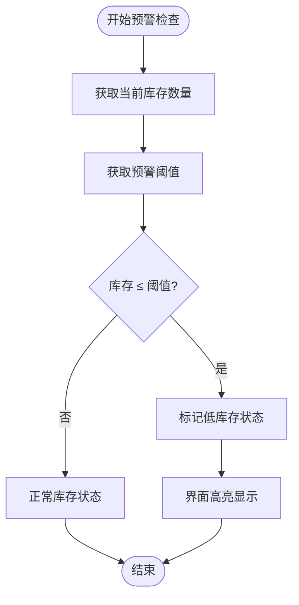
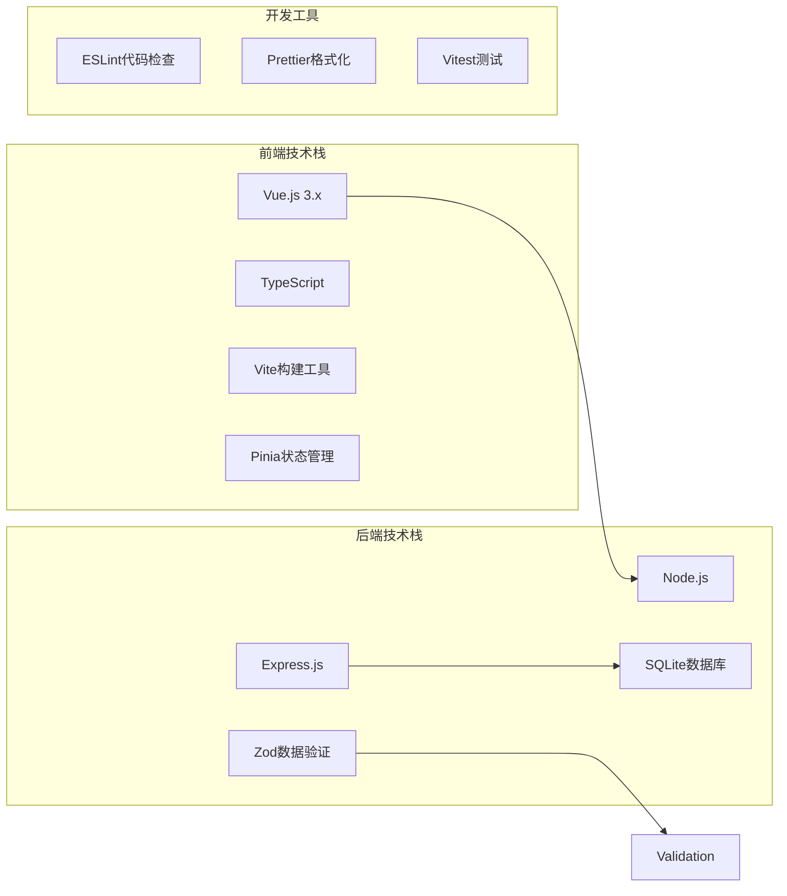
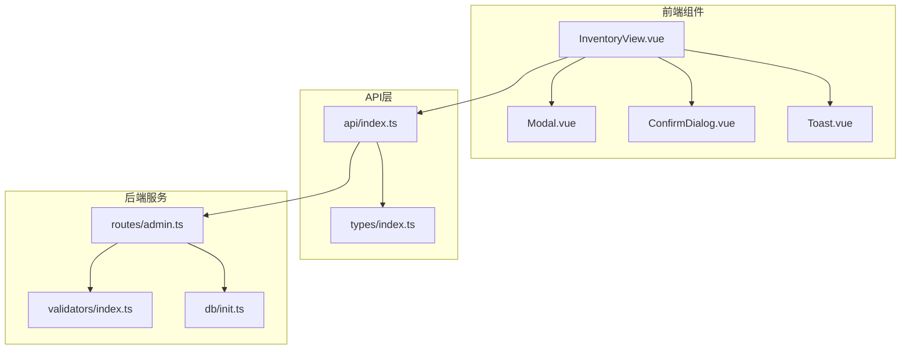

# 库存表设计

<cite>
**本文档中引用的文件**
- [InventoryView.vue](file://src/admin/views/InventoryView.vue)
- [admin.ts](file://server/src/routes/admin.ts)
- [init.ts](file://server/src/db/init.ts)
- [index.ts](file://server/src/validators/index.ts)
- [index.ts](file://src/types/index.ts)
- [index.ts](file://src/api/index.ts)
- [README.md](file://README.md)
</cite>

## 目录
1. [简介](#简介)
2. [项目结构](#项目结构)
3. [核心组件](#核心组件)
4. [架构概览](#架构概览)
5. [详细组件分析](#详细组件分析)
6. [依赖关系分析](#依赖关系分析)
7. [性能考虑](#性能考虑)
8. [故障排除指南](#故障排除指南)
9. [结论](#结论)

## 简介

本设计文档详细阐述了RLRMS（红灯笼食府）库存管理系统中的库存表设计。该系统采用前后端分离架构，前端使用Vue.js框架，后端基于Express.js和SQLite数据库。库存表作为核心业务表之一，负责管理餐厅的物料库存、预警机制和排序管理。

库存表设计遵循RESTful API规范，提供了完整的CRUD操作，包括物料的添加、修改、删除和查询功能。系统还实现了实时库存预警功能，当库存数量低于预设阈值时，界面会自动高亮显示并提示用户进行补货。

## 项目结构

RLRMS项目采用模块化架构设计，库存管理功能分布在多个层次中：

**图表来源**
- [InventoryView.vue:1-507](file://src/admin/views/InventoryView.vue#L1-L507)
- [admin.ts:874-991](file://server/src/routes/admin.ts#L874-L991)
- [init.ts:97-137](file://server/src/db/init.ts#L97-L137)

**章节来源**
- [InventoryView.vue:1-507](file://src/admin/views/InventoryView.vue#L1-L507)
- [admin.ts:874-991](file://server/src/routes/admin.ts#L874-L991)
- [init.ts:97-137](file://server/src/db/init.ts#L97-L137)

## 核心组件

### 数据模型设计

库存表采用SQLite数据库存储，支持多种数据类型以满足不同物料的计量需求：

| 字段名 | 数据类型 | 约束条件 | 描述 | 默认值 |
|--------|----------|----------|------|--------|
| id | TEXT | PRIMARY KEY | 唯一标识符，UUID格式 | 自动生成 |
| material_name | TEXT | NOT NULL | 物料名称 | 必填 |
| quantity | REAL | NOT NULL | 当前库存数量 | 必填 |
| unit | TEXT |  | 计量单位 | 可选 |
| warning_threshold | REAL | DEFAULT 0 | 预警阈值 | 0 |
| sort_order | INTEGER | DEFAULT 0 | 排序权重 | 0 |
| created_at | DATETIME | DEFAULT CURRENT_TIMESTAMP | 创建时间 | 系统时间 |
| updated_at | DATETIME | DEFAULT CURRENT_TIMESTAMP | 更新时间 | 系统时间 |

### 字段业务含义详解

**id主键字段**
- 采用UUID格式确保全局唯一性
- 支持分布式环境下的数据一致性
- 便于与其他系统集成和数据同步

**material_name物料名称**
- 唯一约束，防止重复物料录入
- 最大长度限制为100字符
- 作为库存查询和展示的主要标识

**quantity数量字段**
- 支持小数精度，可精确到0.01
- 不允许为负数，确保数据完整性
- 可根据实际业务需要调整精度

**unit单位字段**
- 支持各种计量单位（kg、个、瓶等）
- 最大长度限制为20字符
- 与quantity字段配合使用，提供准确的库存信息

**warning_threshold预警阈值**
- 默认值为0，表示不启用预警
- 当库存数量小于等于阈值时触发预警
- 支持小数精度，灵活适应不同物料规格

**sort_order排序字段**
- 整数类型，数值越小排序越靠前
- 支持拖拽排序功能
- 与material_name联合排序，确保稳定的显示顺序

**章节来源**
- [init.ts:97-108](file://server/src/db/init.ts#L97-L108)
- [index.ts:99-108](file://src/types/index.ts#L99-L108)
- [README.md:470-477](file://README.md#L470-L477)

## 架构概览

库存管理系统采用经典的三层架构模式，实现了清晰的职责分离：

**图表来源**
- [admin.ts:876-883](file://server/src/routes/admin.ts#L876-L883)
- [InventoryView.vue:52-63](file://src/admin/views/InventoryView.vue#L52-L63)

系统架构特点：
- **前后端分离**：前端Vue.js负责用户交互，后端Node.js提供API服务
- **RESTful设计**：遵循HTTP协议标准，易于理解和维护
- **实时更新**：通过WebSocket实现实时库存状态更新
- **数据验证**：前后端双重验证确保数据质量

## 详细组件分析

### 前端组件分析

InventoryView.vue是库存管理的核心界面组件，实现了完整的物料管理功能：

**图表来源**
- [InventoryView.vue:1-134](file://src/admin/views/InventoryView.vue#L1-L134)
- [index.ts:99-108](file://src/types/index.ts#L99-L108)

### 后端API路由设计

后端采用Express.js框架，实现了RESTful API规范的库存管理接口：

**图表来源**
- [admin.ts:886-913](file://server/src/routes/admin.ts#L886-L913)
- [admin.ts:938-970](file://server/src/routes/admin.ts#L938-L970)

### 数据验证机制

系统采用Zod库实现强大的数据验证功能：

| 验证规则 | 字段 | 约束条件 | 错误消息 |
|----------|------|----------|----------|
| createInventorySchema | material_name | 非空，最大100字符 | 物料名称不能为空 |
| createInventorySchema | quantity | 数字类型 | 请输入有效数量 |
| createInventorySchema | unit | 非空，最大20字符 | 单位不能为空 |
| createInventorySchema | warning_threshold | 数字类型，可选 | 预警阈值格式错误 |
| updateInventorySchema | quantity | 非负数 | 数量不能为负数 |
| updateInventorySchema | warning_threshold | 非负数，可选 | 预警阈值不能为负数 |

**章节来源**
- [index.ts:53-64](file://server/src/validators/index.ts#L53-L64)
- [InventoryView.vue:87-106](file://src/admin/views/InventoryView.vue#L87-L106)

### 预警机制实现

系统实现了智能的库存预警功能，通过比较当前库存与预警阈值来判断库存状态：

**图表来源**
- [InventoryView.vue:127-129](file://src/admin/views/InventoryView.vue#L127-L129)

预警功能特点：
- **实时监控**：界面实时显示库存状态
- **视觉反馈**：低库存物料自动高亮显示
- **友好提示**：使用警告图标提醒用户关注

## 依赖关系分析

### 技术栈依赖

### 组件间依赖关系

**图表来源**
- [InventoryView.vue:8-12](file://src/admin/views/InventoryView.vue#L8-L12)
- [admin.ts:107-18](file://server/src/routes/admin.ts#L107-L18)

**章节来源**
- [admin.ts:107-18](file://server/src/routes/admin.ts#L107-L18)
- [index.ts:1-133](file://src/types/index.ts#L1-133)

## 性能考虑

### 数据库优化策略

系统在数据库层面实施了多项优化措施：

**索引设计**
- 主键索引：自动为id字段创建主键索引
- 排序索引：为sort_order字段创建索引，提升排序查询性能
- 时间索引：为created_at字段创建索引，优化时间范围查询

**查询优化**
- 批量操作：使用beginBatch/endBatch减少数据库往返次数
- 条件查询：通过WHERE子句精确筛选数据
- 分页机制：支持大量数据的分页加载

### 前端性能优化

**懒加载机制**
- 弹窗组件采用动态导入，减少初始包体积
- 按需加载第三方库，提升页面加载速度

**缓存策略**
- 内存缓存：前端缓存最近访问的库存数据
- 本地存储：利用浏览器localStorage持久化用户偏好

**响应式设计**
- 移动端适配：支持触摸手势和响应式布局
- 动画优化：使用CSS3硬件加速提升动画性能

## 故障排除指南

### 常见问题及解决方案

**库存数据异常**
- 症状：库存数量显示异常或计算错误
- 原因：数据类型不匹配或精度丢失
- 解决方案：检查数据库字段类型定义，确保使用REAL类型存储小数

**预警功能失效**
- 症状：低库存物料未显示预警状态
- 原因：前端比较逻辑错误或数据传输问题
- 解决方案：检查isLowStock函数实现和API响应数据格式

**排序功能异常**
- 症状：拖拽排序后数据顺序不正确
- 原因：sort_order字段更新失败或查询排序逻辑错误
- 解决方案：验证reorderInventory接口调用和数据库更新语句

**章节来源**
- [admin.ts:917-935](file://server/src/routes/admin.ts#L917-L935)
- [InventoryView.vue:35-50](file://src/admin/views/InventoryView.vue#L35-L50)

### 调试技巧

**后端调试**
- 使用console.log输出关键变量值
- 利用数据库客户端查看实际数据状态
- 检查API响应时间和错误日志

**前端调试**
- 使用Vue DevTools检查组件状态
- 利用浏览器开发者工具监控网络请求
- 检查控制台错误和警告信息

## 结论

RLRMS库存表设计体现了现代Web应用的最佳实践，通过合理的数据模型设计、完善的业务逻辑实现和优秀的用户体验设计，构建了一个功能完整、性能优异的库存管理系统。

系统的主要优势包括：

**技术先进性**
- 采用最新的Vue.js 3.x和TypeScript技术栈
- 实现了完整的前后端分离架构
- 支持现代化的开发工作流和部署方式

**业务实用性**
- 完整覆盖库存管理的核心业务场景
- 提供直观易用的用户界面
- 实现智能化的库存预警机制

**扩展性良好**
- 模块化设计便于功能扩展
- RESTful API设计支持多端接入
- 数据库设计支持未来业务发展

通过持续的优化和完善，该库存管理系统能够有效支撑餐厅的日常运营，提高库存管理效率，降低运营成本，为餐厅的成功运营提供有力的技术保障。