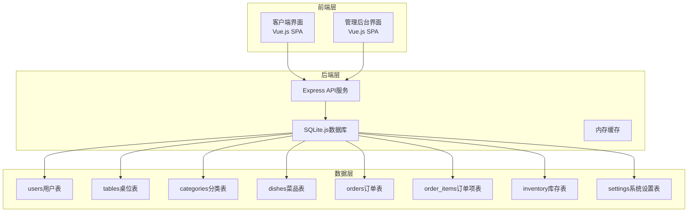
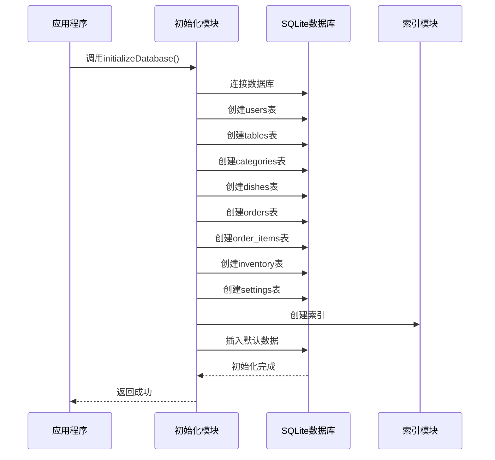
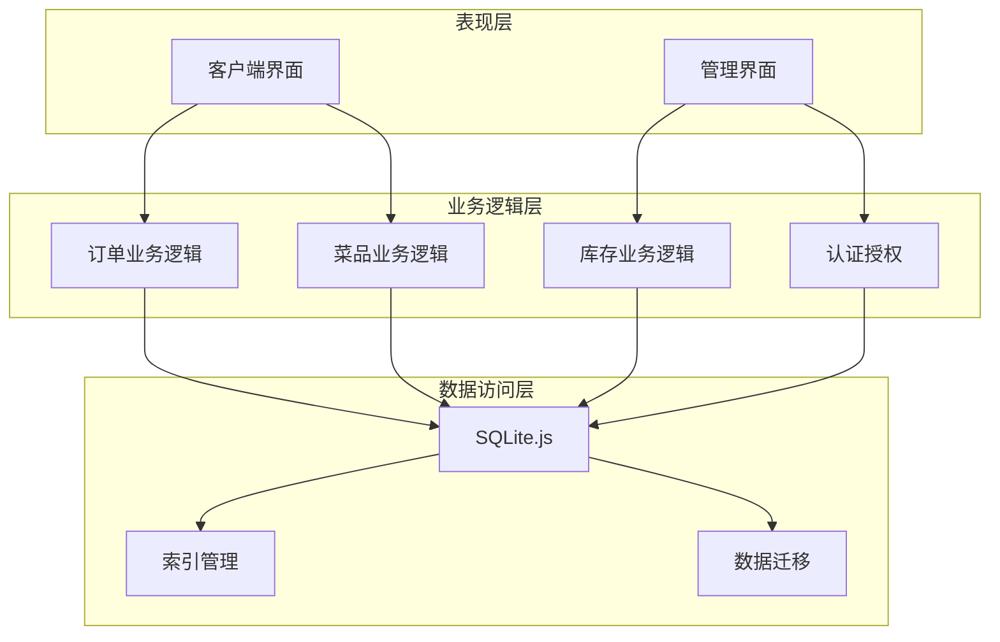
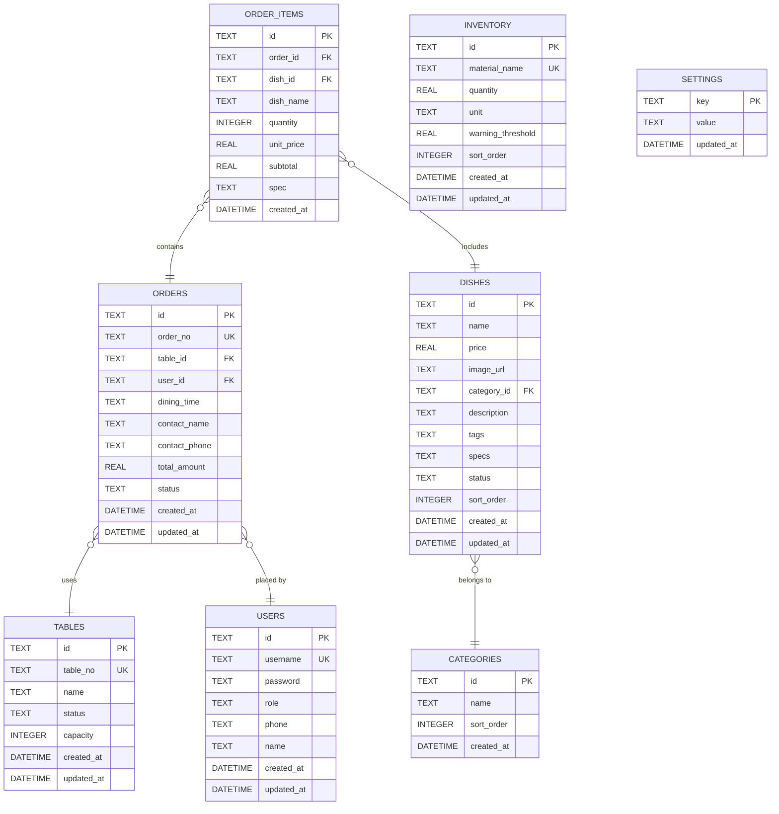

# 数据库表结构设计

<cite>
**本文档引用的文件**
- [server/src/db/init.ts](file://server/src/db/init.ts)
- [server/src/db/index.ts](file://server/src/db/index.ts)
- [server/src/routes/admin.ts](file://server/src/routes/admin.ts)
- [server/src/routes/orders.ts](file://server/src/routes/orders.ts)
- [server/src/routes/dishes.ts](file://server/src/routes/dishes.ts)
- [server/src/validators/index.ts](file://server/src/validators/index.ts)
- [src/types/index.ts](file://src/types/index.ts)
- [README.md](file://README.md)
</cite>

## 目录
1. [简介](#简介)
2. [项目结构](#项目结构)
3. [核心组件](#核心组件)
4. [架构概览](#架构概览)
5. [详细组件分析](#详细组件分析)
6. [依赖分析](#依赖分析)
7. [性能考虑](#性能考虑)
8. [故障排除指南](#故障排除指南)
9. [结论](#结论)

## 简介

RLRMS（红灯笼餐厅管理系统）是一个基于SQLite.js的Web餐厅管理系统。本系统采用客户端-服务器架构，使用Vue.js作为前端框架，Node.js + Express作为后端服务，SQLite.js作为本地数据库引擎。系统支持餐厅点餐、订单管理、菜品管理、库存管理和用户管理等核心功能。

## 项目结构

系统采用前后端分离的架构设计，数据库层位于后端服务中，使用SQLite.js实现本地数据库存储。项目结构清晰，模块化程度高，便于维护和扩展。

**图表来源**
- [server/src/db/init.ts:1-204](file://server/src/db/init.ts#L1-L204)
- [server/src/db/index.ts:1-156](file://server/src/db/index.ts#L1-L156)

**章节来源**
- [server/src/db/init.ts:1-204](file://server/src/db/init.ts#L1-L204)
- [server/src/db/index.ts:1-156](file://server/src/db/index.ts#L1-L156)

## 核心组件

系统的核心数据结构围绕餐厅业务需求设计，包含以下主要表结构：

### 数据库初始化流程

系统启动时会自动执行数据库初始化，创建所有必要的表结构和索引。初始化过程采用批处理模式，确保数据库操作的原子性和一致性。

**图表来源**
- [server/src/db/init.ts:5-204](file://server/src/db/init.ts#L5-L204)

**章节来源**
- [server/src/db/init.ts:1-204](file://server/src/db/init.ts#L1-L204)

## 架构概览

系统采用三层架构设计，数据访问层使用SQLite.js，业务逻辑层处理各种业务规则，表示层负责用户交互。

**图表来源**
- [server/src/db/index.ts:1-156](file://server/src/db/index.ts#L1-L156)
- [server/src/routes/admin.ts:1-200](file://server/src/routes/admin.ts#L1-L200)

## 详细组件分析

### 用户表 (users)

用户表是系统的基础表，用于存储系统用户信息，包括管理员和普通客户。

#### 表结构设计

| 字段名 | 数据类型 | 约束条件 | 默认值 | 说明 |
|--------|----------|----------|--------|------|
| id | TEXT | PRIMARY KEY | 无 | 用户唯一标识符，UUID格式 |
| username | TEXT | UNIQUE NOT NULL | 无 | 用户名，唯一标识用户 |
| password | TEXT | NOT NULL | 无 | 密码，使用bcrypt加密存储 |
| role | TEXT | NOT NULL DEFAULT 'customer' | 'customer' | 用户角色：admin或customer |
| phone | TEXT | NULL | NULL | 联系电话 |
| name | TEXT | NULL | NULL | 姓名 |
| created_at | DATETIME | DEFAULT CURRENT_TIMESTAMP | 当前时间戳 | 创建时间 |
| updated_at | DATETIME | DEFAULT CURRENT_TIMESTAMP | 当前时间戳 | 更新时间 |

#### 主键设计
- 使用UUID作为主键，确保全局唯一性
- 避免序列号可能带来的安全风险

#### 外键关系
- 无外键关系，用户表独立存在

#### 索引策略
- 在username字段上建立唯一索引，确保用户名唯一性
- 在phone字段上建立索引，支持快速查找
- 在role字段上建立索引，优化角色查询

#### 约束条件
- username必须唯一且非空
- password必须非空
- role只能是'admin'或'customer'
- created_at和updated_at自动维护

#### 业务规则实现
- 管理员角色具有最高权限
- 客户角色仅能访问部分功能
- 密码使用bcrypt进行安全加密

**章节来源**
- [server/src/db/init.ts:12-22](file://server/src/db/init.ts#L12-L22)
- [server/src/db/init.ts:140-149](file://server/src/db/init.ts#L140-L149)
- [server/src/validators/index.ts:96-102](file://server/src/validators/index.ts#L96-L102)

### 桌位表 (tables)

桌位表用于管理餐厅的桌位信息，支持桌位状态管理和容量控制。

#### 表结构设计

| 字段名 | 数据类型 | 约束条件 | 默认值 | 说明 |
|--------|----------|----------|--------|------|
| id | TEXT | PRIMARY KEY | 无 | 桌位唯一标识符，UUID格式 |
| table_no | TEXT | UNIQUE NOT NULL | 无 | 桌位编号，唯一标识 |
| name | TEXT | NOT NULL | 无 | 桌位名称 |
| status | TEXT | NOT NULL DEFAULT 'available' | 'available' | 桌位状态：available/occupied/reserved |
| capacity | INTEGER | DEFAULT 4 | 4 | 最大容纳人数 |
| created_at | DATETIME | DEFAULT CURRENT_TIMESTAMP | 当前时间戳 | 创建时间 |
| updated_at | DATETIME | DEFAULT CURRENT_TIMESTAMP | 当前时间戳 | 更新时间 |

#### 主键设计
- 使用UUID作为主键，确保全局唯一性

#### 外键关系
- 无外键关系，桌位表独立存在

#### 索引策略
- 在table_no字段上建立唯一索引，确保桌位编号唯一
- 在status字段上建立索引，优化状态查询

#### 约束条件
- table_no必须唯一且非空
- name必须非空
- status只能是'available'、'occupied'或'reserved'
- capacity必须为正整数

#### 业务规则实现
- 支持三种桌位状态管理
- 容量限制确保座位利用率
- 自动维护创建和更新时间

**章节来源**
- [server/src/db/init.ts:25-34](file://server/src/db/init.ts#L25-L34)
- [server/src/validators/index.ts:42-46](file://server/src/validators/index.ts#L42-L46)

### 分类表 (categories)

分类表用于组织菜品，支持菜品的分类管理和排序。

#### 表结构设计

| 字段名 | 数据类型 | 约束条件 | 默认值 | 说明 |
|--------|----------|----------|--------|------|
| id | TEXT | PRIMARY KEY | 无 | 分类唯一标识符，UUID格式 |
| name | TEXT | NOT NULL | 无 | 分类名称 |
| sort_order | INTEGER | DEFAULT 0 | 0 | 排序权重，数值越大越靠前 |
| created_at | DATETIME | DEFAULT CURRENT_TIMESTAMP | 当前时间戳 | 创建时间 |

#### 主键设计
- 使用UUID作为主键，确保全局唯一性

#### 外键关系
- 无外键关系，分类表独立存在

#### 索引策略
- 无额外索引，按sort_order排序显示

#### 约束条件
- name必须非空
- sort_order必须为整数

#### 业务规则实现
- 支持自定义排序权重
- 用于菜品分类展示和管理

**章节来源**
- [server/src/db/init.ts:37-43](file://server/src/db/init.ts#L37-L43)
- [server/src/validators/index.ts:48-51](file://server/src/validators/index.ts#L48-L51)

### 菜品表 (dishes)

菜品表是系统的核心表之一，存储所有菜品信息，支持菜品分类、价格管理、状态控制等功能。

#### 表结构设计

| 字段名 | 数据类型 | 约束条件 | 默认值 | 说明 |
|--------|----------|----------|--------|------|
| id | TEXT | PRIMARY KEY | 无 | 菜品唯一标识符，UUID格式 |
| name | TEXT | NOT NULL | 无 | 菜品名称 |
| price | REAL | NOT NULL | 无 | 菜品价格，支持小数 |
| image_url | TEXT | NULL | NULL | 菜品图片URL |
| category_id | TEXT | NULL | NULL | 所属分类，外键引用categories表 |
| description | TEXT | NULL | NULL | 菜品描述 |
| tags | TEXT | NULL | NULL | 标签数组，JSON格式存储 |
| specs | TEXT | NULL | NULL | 规格选项，JSON格式存储 |
| status | TEXT | DEFAULT 'on_sale' | 'on_sale' | 菜品状态：on_sale/off_sale |
| sort_order | INTEGER | DEFAULT 0 | 0 | 排序权重 |
| created_at | DATETIME | DEFAULT CURRENT_TIMESTAMP | 当前时间戳 | 创建时间 |
| updated_at | DATETIME | DEFAULT CURRENT_TIMESTAMP | 当前时间戳 | 更新时间 |

#### 主键设计
- 使用UUID作为主键，确保全局唯一性

#### 外键关系
- category_id外键引用categories表的id字段

#### 索引策略
- 在category_id字段上建立索引，优化分类查询
- 在status字段上建立索引，优化状态过滤
- 在sort_order字段上建立索引，优化排序查询

#### 约束条件
- name必须非空
- price必须为非负数
- status只能是'on_sale'或'off_sale'

#### 业务规则实现
- 支持菜品状态管理（上架/下架）
- 支持标签和规格的灵活配置
- 自动维护价格和时间戳

#### JSON字段处理
- tags字段存储字符串数组，使用JSON格式
- specs字段存储规格选项数组
- 系统自动进行JSON解析和序列化

**章节来源**
- [server/src/db/init.ts:46-61](file://server/src/db/init.ts#L46-L61)
- [server/src/validators/index.ts:21-39](file://server/src/validators/index.ts#L21-L39)
- [server/src/routes/dishes.ts:92-104](file://server/src/routes/dishes.ts#L92-L104)

### 订单表 (orders)

订单表管理所有客户订单信息，支持订单状态跟踪和订单详情管理。

#### 表结构设计

| 字段名 | 数据类型 | 约束条件 | 默认值 | 说明 |
|--------|----------|----------|--------|------|
| id | TEXT | PRIMARY KEY | 无 | 订单唯一标识符，UUID格式 |
| order_no | TEXT | UNIQUE NOT NULL | 无 | 订单编号，RL+日期+随机码 |
| table_id | TEXT | NULL | NULL | 关联桌位，外键引用tables表 |
| user_id | TEXT | NULL | NULL | 关联用户，外键引用users表 |
| dining_time | TEXT | NULL | NULL | 就餐时间：中午/晚上 |
| contact_name | TEXT | NULL | NULL | 联系人姓名 |
| contact_phone | TEXT | NULL | NULL | 联系电话 |
| total_amount | REAL | NOT NULL | 无 | 订单总金额 |
| status | TEXT | DEFAULT 'pending' | 'pending' | 订单状态 |
| created_at | DATETIME | DEFAULT CURRENT_TIMESTAMP | 当前时间戳 | 创建时间 |
| updated_at | DATETIME | DEFAULT CURRENT_TIMESTAMP | 当前时间戳 | 更新时间 |

#### 主键设计
- 使用UUID作为主键，确保全局唯一性

#### 外键关系
- table_id外键引用tables表的id字段
- user_id外键引用users表的id字段

#### 索引策略
- 在status字段上建立索引，优化状态查询
- 在contact_phone字段上建立索引，支持按电话查询
- 在table_id字段上建立索引，优化桌位关联查询
- 在created_at字段上建立索引，优化时间排序
- 在user_id字段上建立索引，优化用户关联查询

#### 约束条件
- order_no必须唯一且非空
- total_amount必须为非负数
- status只能是'pending'、'confirmed'、'completed'或'cancelled'

#### 业务规则实现
- 自动生成唯一的订单编号
- 支持多种订单状态管理
- 自动维护订单金额计算
- 支持桌位和用户关联

#### 订单编号生成
- 格式：RL + 当前日期 + 4位随机数
- 确保全球唯一性

**章节来源**
- [server/src/db/init.ts:64-79](file://server/src/db/init.ts#L64-L79)
- [server/src/routes/orders.ts:54-59](file://server/src/routes/orders.ts#L54-L59)
- [server/src/validators/index.ts:6-19](file://server/src/validators/index.ts#L6-L19)

### 订单项表 (order_items)

订单项表存储订单中的具体菜品信息，支持订单详情的详细记录。

#### 表结构设计

| 字段名 | 数据类型 | 约束条件 | 默认值 | 说明 |
|--------|----------|----------|--------|------|
| id | TEXT | PRIMARY KEY | 无 | 订单项唯一标识符，UUID格式 |
| order_id | TEXT | NOT NULL | 无 | 关联订单，外键引用orders表 |
| dish_id | TEXT | NOT NULL | 无 | 关联菜品，外键引用dishes表 |
| dish_name | TEXT | NOT NULL | 无 | 菜品名称快照 |
| quantity | INTEGER | NOT NULL | 无 | 数量，必须为正整数 |
| unit_price | REAL | NOT NULL | 无 | 单价，必须为非负数 |
| subtotal | REAL | NOT NULL | 无 | 小计金额，单价×数量 |
| spec | TEXT | NULL | NULL | 规格说明 |
| created_at | DATETIME | DEFAULT CURRENT_TIMESTAMP | 当前时间戳 | 创建时间 |

#### 主键设计
- 使用UUID作为主键，确保全局唯一性

#### 外键关系
- order_id外键引用orders表的id字段
- dish_id外键引用dishes表的id字段

#### 索引策略
- 在order_id字段上建立索引，优化订单查询

#### 约束条件
- quantity必须为正整数
- unit_price必须为非负数
- subtotal必须为非负数

#### 业务规则实现
- 自动计算小计金额
- 保存菜品名称快照，防止菜品信息变更影响历史订单
- 支持规格说明记录

**章节来源**
- [server/src/db/init.ts:82-95](file://server/src/db/init.ts#L82-L95)
- [server/src/validators/index.ts:11-18](file://server/src/validators/index.ts#L11-L18)

### 库存表 (inventory)

库存表管理餐厅的物料库存信息，支持库存预警和库存管理。

#### 表结构设计

| 字段名 | 数据类型 | 约束条件 | 默认值 | 说明 |
|--------|----------|----------|--------|------|
| id | TEXT | PRIMARY KEY | 无 | 库存唯一标识符，UUID格式 |
| material_name | TEXT | NOT NULL | 无 | 物料名称，唯一标识 |
| quantity | REAL | NOT NULL | 0 | 库存数量，支持小数 |
| unit | TEXT | NULL | NULL | 单位名称 |
| warning_threshold | REAL | DEFAULT 0 | 0 | 预警阈值 |
| sort_order | INTEGER | DEFAULT 0 | 0 | 排序权重 |
| created_at | DATETIME | DEFAULT CURRENT_TIMESTAMP | 当前时间戳 | 创建时间 |
| updated_at | DATETIME | DEFAULT CURRENT_TIMESTAMP | 当前时间戳 | 更新时间 |

#### 主键设计
- 使用UUID作为主键，确保全局唯一性

#### 外键关系
- 无外键关系，库存表独立存在

#### 索引策略
- 无额外索引，按sort_order排序显示

#### 约束条件
- material_name必须唯一且非空
- quantity必须为非负数
- warning_threshold必须为非负数

#### 业务规则实现
- 支持库存预警功能
- 支持自定义排序权重
- 自动维护库存数量和时间戳

#### 库存管理特性
- 支持小数数量的精确库存管理
- 预警阈值用于库存不足提醒
- 单位字段支持不同计量单位

**章节来源**
- [server/src/db/init.ts:98-108](file://server/src/db/init.ts#L98-L108)
- [server/src/validators/index.ts:53-64](file://server/src/validators/index.ts#L53-L64)

### 系统设置表 (settings)

系统设置表存储系统的配置信息，支持动态配置管理。

#### 表结构设计

| 字段名 | 数据类型 | 约束条件 | 默认值 | 说明 |
|--------|----------|----------|--------|------|
| key | TEXT | PRIMARY KEY | 无 | 设置键，唯一标识 |
| value | TEXT | NOT NULL | 无 | 设置值 |
| updated_at | DATETIME | DEFAULT CURRENT_TIMESTAMP | 当前时间戳 | 更新时间 |

#### 主键设计
- 使用字符串作为主键，直接对应设置键

#### 外键关系
- 无外键关系，设置表独立存在

#### 索引策略
- 无额外索引，按主键查询

#### 约束条件
- key必须唯一且非空
- value必须非空

#### 业务规则实现
- 支持键值对形式的配置管理
- 自动维护更新时间
- 支持动态配置读取

#### 默认设置
- restaurant_name：餐厅名称，默认"红灯笼食府"
- restaurant_phone：联系电话
- restaurant_address：地址
- business_hours：营业时间，默认"11:00-21:00"
- notification_email：通知邮箱
- notification_phone：通知电话

**章节来源**
- [server/src/db/init.ts:117-122](file://server/src/db/init.ts#L117-L122)
- [server/src/db/init.ts:152-165](file://server/src/db/init.ts#L152-L165)

## 依赖分析

系统表之间的依赖关系体现了餐厅业务的层次结构，从基础数据到业务逻辑层层递进。

**图表来源**
- [server/src/db/init.ts:12-122](file://server/src/db/init.ts#L12-L122)

### 外键关系分析

系统采用严格的外键约束确保数据完整性：

1. **菜品-分类关系**：dishes.category_id → categories.id
2. **订单-桌位关系**：orders.table_id → tables.id
3. **订单-用户关系**：orders.user_id → users.id
4. **订单项-订单关系**：order_items.order_id → orders.id
5. **订单项-菜品关系**：order_items.dish_id → dishes.id

### 约束完整性

系统通过多种机制确保数据完整性：

- **主键约束**：确保每张表的唯一标识
- **外键约束**：维护表间引用关系
- **唯一约束**：确保关键字段的唯一性
- **检查约束**：验证数据的有效性
- **默认值**：提供合理的默认行为

**章节来源**
- [server/src/db/init.ts:59-94](file://server/src/db/init.ts#L59-L94)

## 性能考虑

系统在设计时充分考虑了性能优化，采用了多种策略提升查询效率和响应速度。

### 索引策略

系统为高频查询字段建立了专门的索引：

1. **订单表索引**
   - idx_orders_status：按状态查询
   - idx_orders_contact_phone：按电话查询
   - idx_orders_table_id：按桌位查询
   - idx_orders_created_at：按时间排序
   - idx_orders_user_id：按用户查询

2. **菜品表索引**
   - idx_dishes_category_id：按分类查询
   - idx_dishes_status：按状态查询
   - idx_dishes_sort_order：按排序查询

3. **用户表索引**
   - idx_users_phone：按电话查询
   - idx_users_role：按角色查询

4. **桌位表索引**
   - idx_tables_status：按状态查询

### 批处理优化

系统采用批处理模式减少数据库I/O操作：

- **批量初始化**：所有表创建和索引建立在单个事务中完成
- **批量保存**：使用debounce机制合并多次写操作
- **批量查询**：避免N+1查询问题，使用IN子句批量获取

### 缓存策略

系统实现了多层次的缓存机制：

- **内存缓存**：菜品列表和分类数据缓存
- **文件缓存**：数据库文件持久化存储
- **HTTP缓存**：静态资源缓存

### 查询优化

针对常见查询场景进行了优化：

- **订单查询**：批量获取订单及其明细，避免N+1查询
- **菜品查询**：支持分类过滤和状态过滤
- **搜索查询**：使用LIKE操作符配合索引

**章节来源**
- [server/src/db/init.ts:124-137](file://server/src/db/init.ts#L124-L137)
- [server/src/db/index.ts:63-73](file://server/src/db/index.ts#L63-L73)
- [server/src/routes/orders.ts:96-130](file://server/src/routes/orders.ts#L96-L130)

## 故障排除指南

### 常见问题诊断

#### 数据库初始化失败
- 检查数据库文件权限
- 确认数据目录存在且可写
- 验证SQLite.js库加载正常

#### 索引创建失败
- 检查SQL语法正确性
- 确认目标表已存在
- 验证字段名拼写正确

#### 外键约束冲突
- 检查相关表的数据完整性
- 验证外键值的存在性
- 确认级联操作的配置

#### 性能问题
- 检查索引使用情况
- 分析慢查询日志
- 优化查询语句

### 数据迁移

系统支持数据迁移和版本升级：

- **列添加**：使用ALTER TABLE添加新列
- **数据回填**：自动填充历史数据
- **幂等操作**：确保重复执行的安全性

**章节来源**
- [server/src/db/init.ts:110-114](file://server/src/db/init.ts#L110-L114)
- [server/src/db/init.ts:167-197](file://server/src/db/init.ts#L167-L197)

## 结论

RLRMS数据库设计遵循了现代数据库设计的最佳实践，采用了规范化设计和严格的约束机制。系统通过合理的表结构设计、完善的索引策略和高效的查询优化，为餐厅管理提供了可靠的数据支撑。

### 设计优势

1. **数据完整性**：严格的外键约束和约束条件确保数据一致性
2. **性能优化**：精心设计的索引和缓存策略提升查询效率
3. **扩展性**：模块化的表结构便于功能扩展和维护
4. **安全性**：用户密码加密存储和权限控制机制
5. **易用性**：直观的字段命名和合理的默认值设置

### 技术特点

- 采用SQLite.js实现轻量级数据库解决方案
- 使用UUID作为主键确保全局唯一性
- 支持JSON字段存储灵活数据结构
- 实现批处理和缓存优化提升性能
- 提供完整的数据迁移和版本管理

该数据库设计方案为RLRMS系统提供了坚实的数据基础，能够满足餐厅管理的各种业务需求，并具备良好的扩展性和维护性。