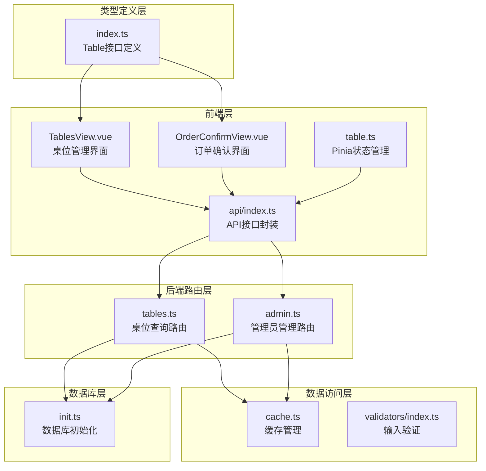
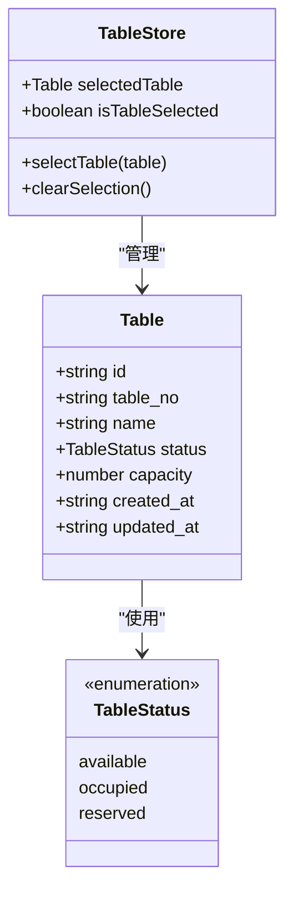
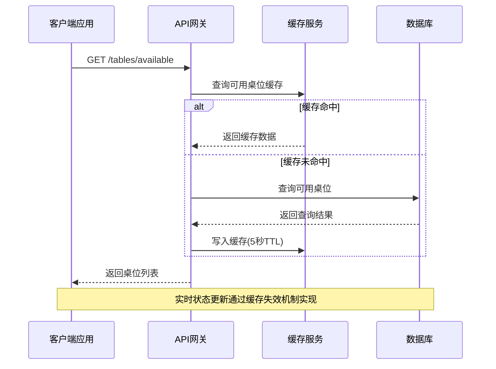
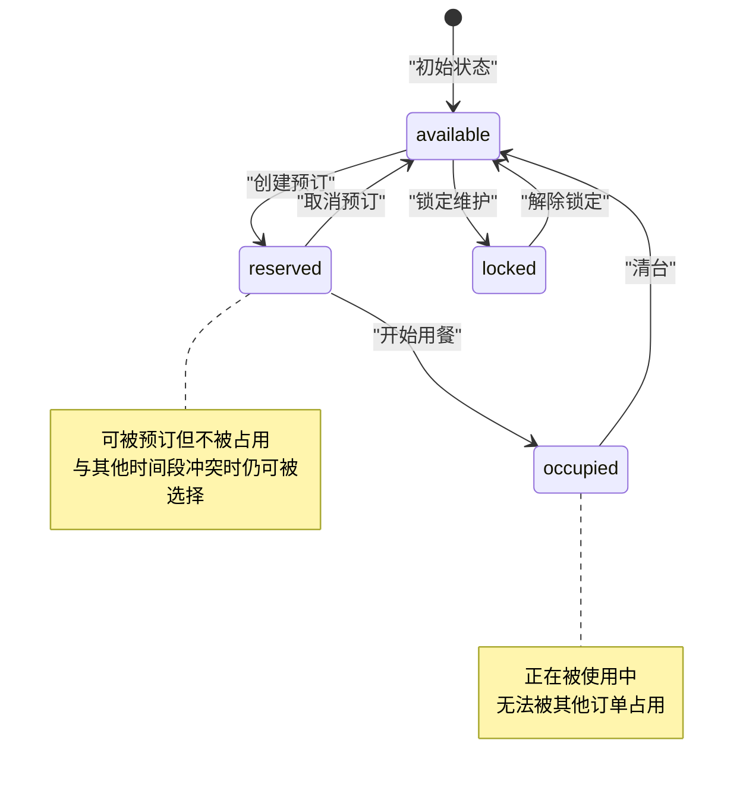
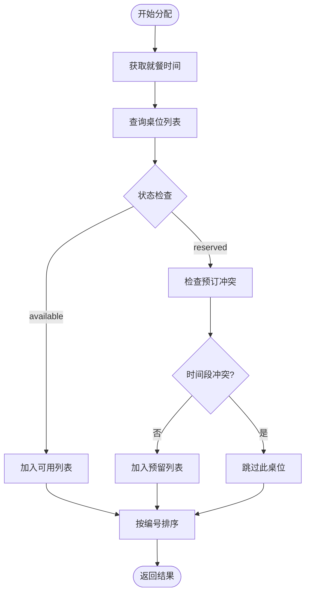
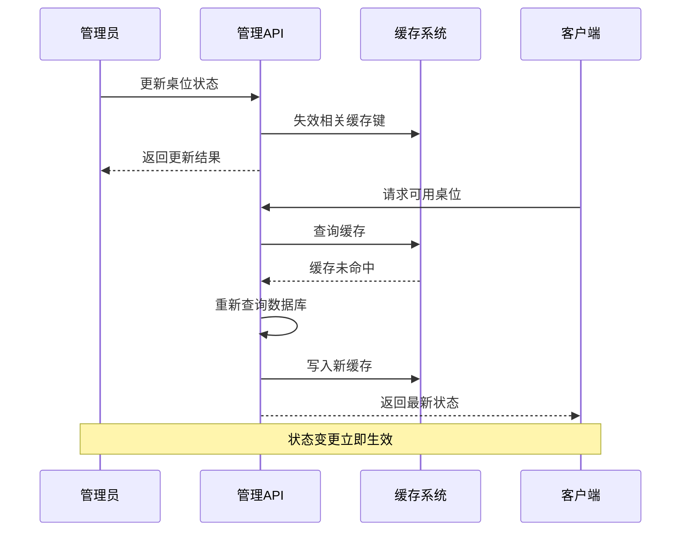
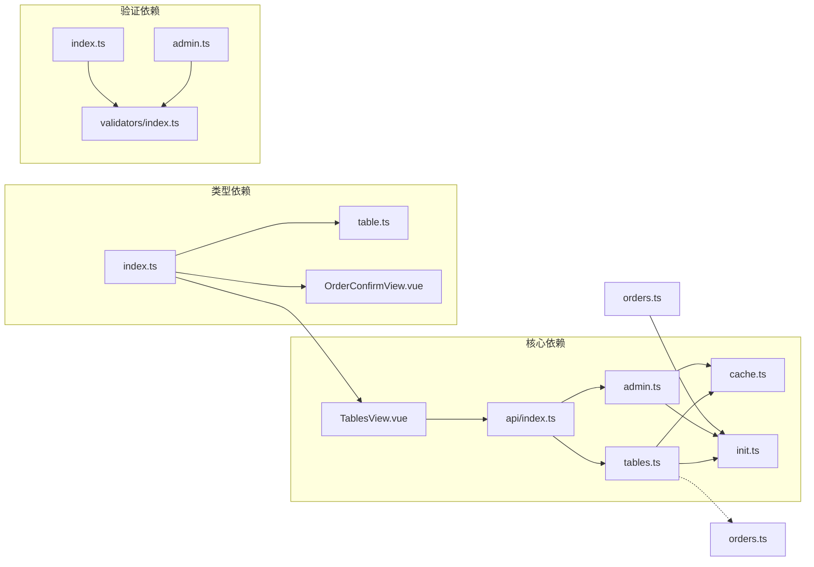

# 桌位表设计

<cite>
**本文档引用的文件**
- [server/src/db/init.ts](file://server/src/db/init.ts)
- [server/src/routes/tables.ts](file://server/src/routes/tables.ts)
- [server/src/routes/admin.ts](file://server/src/routes/admin.ts)
- [server/src/utils/cache.ts](file://server/src/utils/cache.ts)
- [server/src/validators/index.ts](file://server/src/validators/index.ts)
- [src/types/index.ts](file://src/types/index.ts)
- [src/stores/table.ts](file://src/stores/table.ts)
- [src/admin/views/TablesView.vue](file://src/admin/views/TablesView.vue)
- [src/client/views/OrderConfirmView.vue](file://src/client/views/OrderConfirmView.vue)
- [src/api/index.ts](file://src/api/index.ts)
</cite>

## 目录
1. [简介](#简介)
2. [项目结构](#项目结构)
3. [核心组件](#核心组件)
4. [架构概览](#架构概览)
5. [详细组件分析](#详细组件分析)
6. [依赖关系分析](#依赖关系分析)
7. [性能考虑](#性能考虑)
8. [故障排除指南](#故障排除指南)
9. [结论](#结论)
10. [附录](#附录)

## 简介

本文档详细阐述了RLRMS系统中桌位表(tables)的设计与实现。桌位表是餐厅管理系统的核心数据模型之一，负责管理餐厅内的所有桌位资源，包括桌位编号、名称、状态、容量等关键属性。本文将深入分析桌位表的字段设计、状态管理机制、分配策略、容量控制以及实时状态更新等核心功能，并提供完整的SQL创建语句、索引设计和数据字典。

## 项目结构

桌位表相关的代码分布在多个层次中，形成了清晰的分层架构：



**图表来源**
- [server/src/routes/tables.ts:1-93](file://server/src/routes/tables.ts#L1-L93)
- [server/src/routes/admin.ts:238-306](file://server/src/routes/admin.ts#L238-L306)
- [server/src/db/init.ts:24-34](file://server/src/db/init.ts#L24-L34)

**章节来源**
- [server/src/routes/tables.ts:1-93](file://server/src/routes/tables.ts#L1-L93)
- [server/src/routes/admin.ts:238-306](file://server/src/routes/admin.ts#L238-L306)
- [server/src/db/init.ts:24-34](file://server/src/db/init.ts#L24-L34)

## 核心组件

### 数据模型定义

桌位表的数据模型在TypeScript中明确定义，确保了类型安全和开发体验：



**图表来源**
- [src/types/index.ts:34-43](file://src/types/index.ts#L34-L43)
- [src/stores/table.ts:1-25](file://src/stores/table.ts#L1-L25)

### 字段设计详解

桌位表包含以下核心字段：

| 字段名 | 类型 | 约束 | 默认值 | 描述 |
|--------|------|--------|--------|------|
| id | TEXT | PRIMARY KEY | 自动生成 | 主键标识符，UUID格式 |
| table_no | TEXT | UNIQUE NOT NULL | 无 | 桌位编号，全局唯一 |
| name | TEXT | NOT NULL | 无 | 桌位名称，便于识别 |
| status | TEXT | NOT NULL DEFAULT 'available' | 'available' | 桌位状态：available/occupied/reserved |
| capacity | INTEGER | DEFAULT 4 | 4 | 座位容量，表示可容纳人数 |
| created_at | DATETIME | DEFAULT CURRENT_TIMESTAMP | 当前时间 | 创建时间戳 |
| updated_at | DATETIME | DEFAULT CURRENT_TIMESTAMP | 当前时间 | 更新时间戳 |

**章节来源**
- [server/src/db/init.ts:24-34](file://server/src/db/init.ts#L24-L34)
- [src/types/index.ts:34-43](file://src/types/index.ts#L34-L43)

## 架构概览

系统采用前后端分离架构，桌位管理通过RESTful API进行交互：



**图表来源**
- [server/src/routes/tables.ts:57-76](file://server/src/routes/tables.ts#L57-L76)
- [server/src/utils/cache.ts:18-36](file://server/src/utils/cache.ts#L18-L36)

## 详细组件分析

### 桌位状态管理机制

桌位状态管理是系统的核心功能，支持三种状态转换：



**图表来源**
- [server/src/routes/tables.ts:38-47](file://server/src/routes/tables.ts#L38-L47)
- [src/types/index.ts](file://src/types/index.ts#L39)

### 桌位分配策略

系统实现了智能的桌位分配算法，主要特点：

1. **时间维度过滤**：根据就餐时间动态筛选可用桌位
2. **状态优先级**：优先返回available状态的桌位
3. **预订冲突检测**：排除已被预订且与目标时间段冲突的桌位
4. **容量匹配**：结合订单需求与桌位容量进行匹配



**图表来源**
- [server/src/routes/tables.ts:24-55](file://server/src/routes/tables.ts#L24-L55)

**章节来源**
- [server/src/routes/tables.ts:24-55](file://server/src/routes/tables.ts#L24-L55)

### 容量控制机制

容量控制通过以下机制实现：

1. **输入验证**：创建和更新时对capacity字段进行验证
2. **默认值处理**：未指定容量时默认为4人
3. **前端显示**：用户界面直观展示座位容量信息
4. **业务规则**：订单创建时检查桌位容量是否满足需求

**章节来源**
- [server/src/validators/index.ts:42-46](file://server/src/validators/index.ts#L42-L46)
- [server/src/routes/admin.ts:273-306](file://server/src/routes/admin.ts#L273-L306)
- [src/admin/views/TablesView.vue:212-215](file://src/admin/views/TablesView.vue#L212-L215)

### 实时状态更新

系统通过缓存失效机制实现实时状态更新：



**图表来源**
- [server/src/routes/admin.ts:238-271](file://server/src/routes/admin.ts#L238-L271)
- [server/src/utils/cache.ts:41-54](file://server/src/utils/cache.ts#L41-L54)

**章节来源**
- [server/src/routes/admin.ts:238-271](file://server/src/routes/admin.ts#L238-L271)
- [server/src/utils/cache.ts:41-54](file://server/src/utils/cache.ts#L41-L54)

## 依赖关系分析

### 组件耦合度分析



**图表来源**
- [server/src/routes/tables.ts:1-3](file://server/src/routes/tables.ts#L1-L3)
- [server/src/routes/admin.ts:1-3](file://server/src/routes/admin.ts#L1-L3)
- [src/types/index.ts:34-43](file://src/types/index.ts#L34-L43)

### 外部依赖

系统对外部依赖主要包括：
- **Express.js**：Web框架和路由处理
- **SQLite**：轻量级数据库存储
- **Zod**：运行时类型验证
- **Pinia**：Vue状态管理
- **Vue 3**：前端框架

**章节来源**
- [server/src/routes/tables.ts:1-3](file://server/src/routes/tables.ts#L1-L3)
- [server/src/routes/admin.ts:1-3](file://server/src/routes/admin.ts#L1-L3)
- [src/types/index.ts:34-43](file://src/types/index.ts#L34-L43)

## 性能考虑

### 缓存策略

系统采用了多层缓存策略来优化性能：

1. **可用桌位缓存**：缓存键为`tables:available`，TTL为5秒
2. **按时间过滤缓存**：缓存键为`tables:available-for:{dining_time}`，TTL为5秒
3. **批量失效**：状态变更时统一失效相关缓存键

### 索引优化

数据库层面建立了必要的索引以提升查询性能：

```sql
-- 桌位状态索引
CREATE INDEX IF NOT EXISTS idx_tables_status ON tables(status);

-- 订单关联索引
CREATE INDEX IF NOT EXISTS idx_orders_table_id ON orders(table_id);
```

**章节来源**
- [server/src/db/init.ts:124-137](file://server/src/db/init.ts#L124-L137)
- [server/src/utils/cache.ts:64-72](file://server/src/utils/cache.ts#L64-L72)

## 故障排除指南

### 常见问题及解决方案

1. **桌位状态查询异常**
   - 检查缓存服务是否正常运行
   - 验证数据库连接状态
   - 确认缓存键配置正确

2. **桌位分配冲突**
   - 检查订单状态是否正确更新
   - 验证时间维度过滤逻辑
   - 确认缓存失效机制正常工作

3. **容量验证失败**
   - 检查输入数据格式
   - 验证Zod schema配置
   - 确认默认值处理逻辑

**章节来源**
- [server/src/utils/cache.ts:18-26](file://server/src/utils/cache.ts#L18-L26)
- [server/src/validators/index.ts:42-46](file://server/src/validators/index.ts#L42-L46)

## 结论

桌位表设计充分体现了现代Web应用的最佳实践，通过合理的数据模型设计、智能的状态管理机制、高效的缓存策略和完善的错误处理，构建了一个高性能、可扩展的桌位管理系统。系统不仅满足了基本的桌位管理需求，还为未来的功能扩展奠定了坚实的基础。

## 附录

### SQL创建语句

```sql
-- 创建桌位表
CREATE TABLE IF NOT EXISTS tables (
    id TEXT PRIMARY KEY,
    table_no TEXT UNIQUE NOT NULL,
    name TEXT NOT NULL,
    status TEXT NOT NULL DEFAULT 'available',
    capacity INTEGER DEFAULT 4,
    created_at DATETIME DEFAULT CURRENT_TIMESTAMP,
    updated_at DATETIME DEFAULT CURRENT_TIMESTAMP
);

-- 创建索引
CREATE INDEX IF NOT EXISTS idx_tables_status ON tables(status);
```

**章节来源**
- [server/src/db/init.ts:24-34](file://server/src/db/init.ts#L24-L34)
- [server/src/db/init.ts](file://server/src/db/init.ts#L136)

### 数据字典

| 字段名 | 数据类型 | 约束 | 描述 | 示例值 |
|--------|----------|------|------|--------|
| id | TEXT | PRIMARY KEY | 桌位唯一标识 | "uuid格式字符串" |
| table_no | TEXT | UNIQUE, NOT NULL | 桌位编号 | "A001", "VIP01" |
| name | TEXT | NOT NULL | 桌位名称 | "靠窗位置", "VIP包间" |
| status | TEXT | NOT NULL, DEFAULT 'available' | 桌位状态 | 'available', 'occupied', 'reserved' |
| capacity | INTEGER | DEFAULT 4 | 座位容量 | 2, 4, 6, 8 |
| created_at | DATETIME | DEFAULT CURRENT_TIMESTAMP | 创建时间 | "2024-01-01 12:00:00" |
| updated_at | DATETIME | DEFAULT CURRENT_TIMESTAMP | 更新时间 | "2024-01-01 12:00:00" |

### API接口规范

| 接口 | 方法 | 路径 | 功能描述 | 参数 |
|------|------|------|----------|------|
| 获取所有桌位 | GET | /tables | 获取所有桌位信息 | 无 |
| 获取可用桌位 | GET | /tables/available | 获取可用桌位列表 | 无 |
| 获取特定时间可用桌位 | GET | /tables/available-for | 获取指定时间可用桌位 | dining_time: string |
| 获取桌位详情 | GET | /tables/:id | 获取指定桌位详情 | id: string |

**章节来源**
- [server/src/routes/tables.ts:14-93](file://server/src/routes/tables.ts#L14-L93)
- [src/api/index.ts:173-184](file://src/api/index.ts#L173-L184)